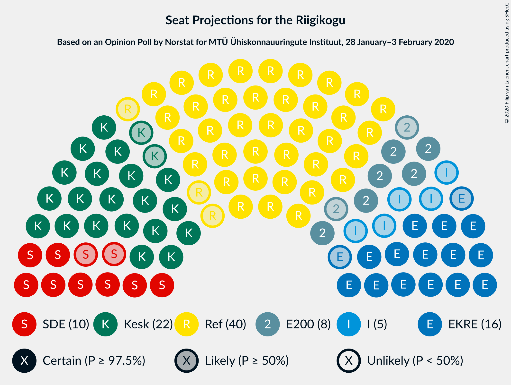
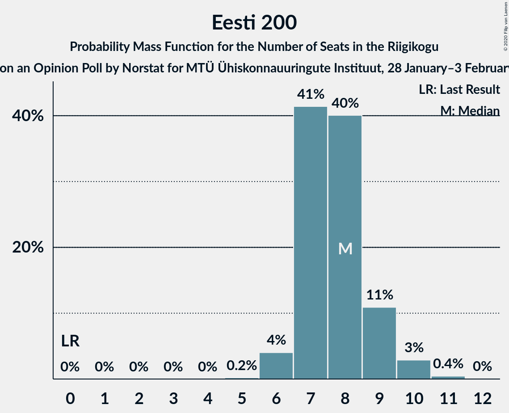

# Opinion Poll by Norstat for MTÜ Ühiskonnauuringute Instituut, 28 January–3 February 2020

<a href="#voting-intentions">Voting Intentions</a> | <a href="#seats">Seats</a> | <a href="#coalitions">Coalitions</a> | <a href="#technical-information">Technical Information</a>

## Voting Intentions

### Confidence Intervals

| Party | Last Result | Poll Result | 80% Confidence Interval | 90% Confidence Interval | 95% Confidence Interval | 99% Confidence Interval |
|:-----:|:-----------:|:-----------:|:-----------------------:|:-----------------------:|:-----------------------:|:-----------------------:|
| Eesti Reformierakond | 28.9% | 35.1% | 33.2–37.1% |32.7–37.6% |32.2–38.1% |31.3–39.1% |
| Eesti Keskerakond | 23.1% | 20.8% | 19.2–22.5% |18.8–23.0% |18.4–23.4% |17.7–24.3% |
| Eesti Konservatiivne Rahvaerakond | 17.8% | 15.6% | 14.2–17.2% |13.8–17.6% |13.5–18.0% |12.8–18.8% |
| Sotsiaaldemokraatlik Erakond | 9.8% | 10.2% | 9.1–11.5% |8.7–11.9% |8.5–12.2% |8.0–12.9% |
| Eesti 200 | 4.4% | 8.5% | 7.5–9.7% |7.2–10.1% |6.9–10.4% |6.5–11.0% |
| Erakond Isamaa | 11.4% | 5.9% | 5.0–7.0% |4.8–7.3% |4.6–7.5% |4.2–8.1% |
| Erakond Eestimaa Rohelised | 1.8% | 2.7% | 2.1–3.5% |2.0–3.7% |1.9–3.9% |1.6–4.3% |
| Eesti Vabaerakond | 1.2% | 0.3% | 0.2–0.7% |0.1–0.8% |0.1–0.9% |0.1–1.1% |

*Note:* The poll result column reflects the actual value used in the calculations. Published results may vary slightly, and in addition be rounded to fewer digits.

## Seats

### Confidence Intervals

| Party | Last Result | Median | 80% Confidence Interval | 90% Confidence Interval | 95% Confidence Interval | 99% Confidence Interval |
|:-----:|:-----------:|:------:|:-----------------------:|:-----------------------:|:-----------------------:|:-----------------------:|
| <a href="#eesti-reformierakond">Eesti Reformierakond</a> | 34 | 40 | 39–41 |38–43 |37–43 |36–45 |
| <a href="#eesti-keskerakond">Eesti Keskerakond</a> | 26 | 22 | 20–23 |20–24 |20–25 |19–26 |
| <a href="#eesti-konservatiivne-rahvaerakond">Eesti Konservatiivne Rahvaerakond</a> | 19 | 16 | 15–18 |14–18 |14–18 |13–19 |
| <a href="#sotsiaaldemokraatlik-erakond">Sotsiaaldemokraatlik Erakond</a> | 10 | 10 | 9–11 |8–12 |8–12 |8–13 |
| <a href="#eesti-200">Eesti 200</a> | 0 | 8 | 7–9 |7–9 |6–10 |6–10 |
| <a href="#erakond-isamaa">Erakond Isamaa</a> | 12 | 5 | 4–6 |4–7 |0–7 |0–7 |
| <a href="#erakond-eestimaa-rohelised">Erakond Eestimaa Rohelised</a> | 0 | 0 | 0 |0 |0 |0 |
| <a href="#eesti-vabaerakond">Eesti Vabaerakond</a> | 0 | 0 | 0 |0 |0 |0 |

### Eesti Reformierakond

*For a full overview of the results for this party, see the [Eesti Reformierakond](party-eestireformierakond.html) page.*

| Number of Seats | Probability | Accumulated | Special Marks |
|:---------------:|:-----------:|:-----------:|:-------------:|
| 34 | 0% | 100% | Last Result |
| 35 | 0.2% | 99.9% |  |
| 36 | 0.7% | 99.7% |  |
| 37 | 3% | 99.0% |  |
| 38 | 2% | 96% |  |
| 39 | 13% | 94% |  |
| 40 | 56% | 81% | Median |
| 41 | 17% | 25% |  |
| 42 | 2% | 7% |  |
| 43 | 3% | 5% |  |
| 44 | 0.9% | 2% |  |
| 45 | 0.8% | 1.1% |  |
| 46 | 0.3% | 0.3% |  |
| 47 | 0% | 0.1% |  |
| 48 | 0% | 0% |  |

### Eesti Keskerakond

*For a full overview of the results for this party, see the [Eesti Keskerakond](party-eestikeskerakond.html) page.*

| Number of Seats | Probability | Accumulated | Special Marks |
|:---------------:|:-----------:|:-----------:|:-------------:|
| 17 | 0.1% | 100% |  |
| 18 | 0.4% | 99.9% |  |
| 19 | 2% | 99.5% |  |
| 20 | 10% | 98% |  |
| 21 | 17% | 88% |  |
| 22 | 34% | 70% | Median |
| 23 | 27% | 36% |  |
| 24 | 5% | 9% |  |
| 25 | 2% | 4% |  |
| 26 | 1.4% | 2% | Last Result |
| 27 | 0.2% | 0.3% |  |
| 28 | 0% | 0% |  |

### Eesti Konservatiivne Rahvaerakond

*For a full overview of the results for this party, see the [Eesti Konservatiivne Rahvaerakond](party-eestikonservatiivnerahvaerakond.html) page.*

| Number of Seats | Probability | Accumulated | Special Marks |
|:---------------:|:-----------:|:-----------:|:-------------:|
| 12 | 0.1% | 100% |  |
| 13 | 0.7% | 99.9% |  |
| 14 | 6% | 99.1% |  |
| 15 | 6% | 93% |  |
| 16 | 64% | 87% | Median |
| 17 | 11% | 24% |  |
| 18 | 11% | 12% |  |
| 19 | 1.5% | 2% | Last Result |
| 20 | 0.2% | 0.2% |  |
| 21 | 0% | 0% |  |

### Sotsiaaldemokraatlik Erakond

*For a full overview of the results for this party, see the [Sotsiaaldemokraatlik Erakond](party-sotsiaaldemokraatlikerakond.html) page.*

| Number of Seats | Probability | Accumulated | Special Marks |
|:---------------:|:-----------:|:-----------:|:-------------:|
| 7 | 0.4% | 100% |  |
| 8 | 7% | 99.6% |  |
| 9 | 33% | 92% |  |
| 10 | 21% | 59% | Last Result, Median |
| 11 | 33% | 38% |  |
| 12 | 4% | 5% |  |
| 13 | 1.2% | 1.3% |  |
| 14 | 0.1% | 0.1% |  |
| 15 | 0% | 0% |  |

### Eesti 200

*For a full overview of the results for this party, see the [Eesti 200](party-eesti200.html) page.*

| Number of Seats | Probability | Accumulated | Special Marks |
|:---------------:|:-----------:|:-----------:|:-------------:|
| 0 | 0% | 100% | Last Result |
| 1 | 0% | 100% |  |
| 2 | 0% | 100% |  |
| 3 | 0% | 100% |  |
| 4 | 0% | 100% |  |
| 5 | 0.2% | 100% |  |
| 6 | 4% | 99.8% |  |
| 7 | 41% | 96% |  |
| 8 | 40% | 54% | Median |
| 9 | 11% | 14% |  |
| 10 | 3% | 3% |  |
| 11 | 0.4% | 0.5% |  |
| 12 | 0% | 0% |  |

### Erakond Isamaa

*For a full overview of the results for this party, see the [Erakond Isamaa](party-erakondisamaa.html) page.*

| Number of Seats | Probability | Accumulated | Special Marks |
|:---------------:|:-----------:|:-----------:|:-------------:|
| 0 | 5% | 100% |  |
| 1 | 0% | 95% |  |
| 2 | 0% | 95% |  |
| 3 | 0% | 95% |  |
| 4 | 6% | 95% |  |
| 5 | 65% | 89% | Median |
| 6 | 15% | 23% |  |
| 7 | 8% | 8% |  |
| 8 | 0.2% | 0.2% |  |
| 9 | 0% | 0% |  |
| 10 | 0% | 0% |  |
| 11 | 0% | 0% |  |
| 12 | 0% | 0% | Last Result |

### Erakond Eestimaa Rohelised

*For a full overview of the results for this party, see the [Erakond Eestimaa Rohelised](party-erakondeestimaarohelised.html) page.*

| Number of Seats | Probability | Accumulated | Special Marks |
|:---------------:|:-----------:|:-----------:|:-------------:|
| 0 | 100% | 100% | Last Result, Median |

### Eesti Vabaerakond

*For a full overview of the results for this party, see the [Eesti Vabaerakond](party-eestivabaerakond.html) page.*

| Number of Seats | Probability | Accumulated | Special Marks |
|:---------------:|:-----------:|:-----------:|:-------------:|
| 0 | 100% | 100% | Last Result, Median |

## Coalitions

### Confidence Intervals

| Coalition | Last Result | Median | Majority? | 80% Confidence Interval | 90% Confidence Interval | 95% Confidence Interval | 99% Confidence Interval |
|:---------:|:-----------:|:------:|:---------:|:-----------------------:|:-----------------------:|:-----------------------:|:-----------------------:|
| Eesti Reformierakond – Eesti Keskerakond – Eesti Konservatiivne Rahvaerakond | 79 | 78 | 100% | 76–80 | 76–81 | 75–83 | 74–85 |
| Eesti Reformierakond – Eesti Keskerakond | 60 | 62 | 100% | 60–64 | 59–65 | 58–66 | 58–69 |
| Eesti Reformierakond – Eesti Konservatiivne Rahvaerakond – Erakond Isamaa | 65 | 61 | 100% | 60–63 | 59–64 | 58–64 | 56–65 |
| Eesti Reformierakond – Eesti Konservatiivne Rahvaerakond | 53 | 56 | 99.9% | 55–59 | 54–59 | 53–59 | 52–61 |
| Eesti Reformierakond – Sotsiaaldemokraatlik Erakond – Erakond Isamaa – Eesti Vabaerakond | 56 | 56 | 99.2% | 53–56 | 52–57 | 52–58 | 50–59 |
| Eesti Reformierakond – Sotsiaaldemokraatlik Erakond – Erakond Isamaa | 56 | 56 | 99.2% | 53–56 | 52–57 | 52–58 | 50–59 |
| Eesti Reformierakond – Sotsiaaldemokraatlik Erakond | 44 | 50 | 44% | 48–52 | 48–53 | 47–54 | 46–55 |
| Eesti Reformierakond – Erakond Isamaa | 46 | 45 | 0.3% | 44–46 | 42–46 | 42–48 | 40–50 |
| Eesti Keskerakond – Eesti Konservatiivne Rahvaerakond – Erakond Isamaa | 57 | 43 | 0% | 42–45 | 41–45 | 39–45 | 37–47 |
| Eesti Keskerakond – Eesti Konservatiivne Rahvaerakond | 45 | 38 | 0% | 37–39 | 36–40 | 35–41 | 34–43 |
| Eesti Keskerakond – Sotsiaaldemokraatlik Erakond – Erakond Isamaa | 48 | 37 | 0% | 35–38 | 34–40 | 34–40 | 32–41 |
| Eesti Keskerakond – Sotsiaaldemokraatlik Erakond | 36 | 32 | 0% | 30–33 | 30–34 | 29–35 | 28–36 |
| Eesti Konservatiivne Rahvaerakond – Sotsiaaldemokraatlik Erakond | 29 | 26 | 0% | 24–28 | 23–28 | 23–29 | 22–30 |

### Eesti Reformierakond – Eesti Keskerakond – Eesti Konservatiivne Rahvaerakond

| Number of Seats | Probability | Accumulated | Special Marks |
|:---------------:|:-----------:|:-----------:|:-------------:|
| 73 | 0.2% | 100% |  |
| 74 | 0.6% | 99.8% |  |
| 75 | 2% | 99.2% |  |
| 76 | 12% | 97% |  |
| 77 | 6% | 85% |  |
| 78 | 32% | 79% | Median |
| 79 | 37% | 48% | Last Result |
| 80 | 5% | 11% |  |
| 81 | 2% | 6% |  |
| 82 | 0.7% | 3% |  |
| 83 | 0.7% | 3% |  |
| 84 | 0.9% | 2% |  |
| 85 | 1.1% | 1.2% |  |
| 86 | 0% | 0% |  |

### Eesti Reformierakond – Eesti Keskerakond

| Number of Seats | Probability | Accumulated | Special Marks |
|:---------------:|:-----------:|:-----------:|:-------------:|
| 55 | 0.1% | 100% |  |
| 56 | 0% | 99.9% |  |
| 57 | 0.3% | 99.9% |  |
| 58 | 2% | 99.6% |  |
| 59 | 3% | 97% |  |
| 60 | 11% | 95% | Last Result |
| 61 | 8% | 84% |  |
| 62 | 39% | 76% | Median |
| 63 | 27% | 38% |  |
| 64 | 2% | 11% |  |
| 65 | 5% | 9% |  |
| 66 | 1.4% | 4% |  |
| 67 | 0.5% | 2% |  |
| 68 | 0.6% | 2% |  |
| 69 | 0.8% | 0.9% |  |
| 70 | 0.1% | 0.1% |  |
| 71 | 0% | 0% |  |

### Eesti Reformierakond – Eesti Konservatiivne Rahvaerakond – Erakond Isamaa

| Number of Seats | Probability | Accumulated | Special Marks |
|:---------------:|:-----------:|:-----------:|:-------------:|
| 55 | 0.2% | 100% |  |
| 56 | 0.3% | 99.8% |  |
| 57 | 1.1% | 99.5% |  |
| 58 | 3% | 98% |  |
| 59 | 4% | 96% |  |
| 60 | 9% | 92% |  |
| 61 | 51% | 83% | Median |
| 62 | 14% | 32% |  |
| 63 | 9% | 18% |  |
| 64 | 8% | 10% |  |
| 65 | 1.3% | 2% | Last Result |
| 66 | 0.3% | 0.3% |  |
| 67 | 0% | 0.1% |  |
| 68 | 0% | 0% |  |

### Eesti Reformierakond – Eesti Konservatiivne Rahvaerakond

| Number of Seats | Probability | Accumulated | Special Marks |
|:---------------:|:-----------:|:-----------:|:-------------:|
| 50 | 0.1% | 100% |  |
| 51 | 0.1% | 99.9% | Majority |
| 52 | 0.7% | 99.7% |  |
| 53 | 3% | 99.0% | Last Result |
| 54 | 4% | 96% |  |
| 55 | 12% | 92% |  |
| 56 | 54% | 79% | Median |
| 57 | 3% | 26% |  |
| 58 | 11% | 22% |  |
| 59 | 9% | 11% |  |
| 60 | 1.2% | 2% |  |
| 61 | 0.6% | 1.1% |  |
| 62 | 0.3% | 0.4% |  |
| 63 | 0.1% | 0.1% |  |
| 64 | 0% | 0% |  |

### Eesti Reformierakond – Sotsiaaldemokraatlik Erakond – Erakond Isamaa – Eesti Vabaerakond

| Number of Seats | Probability | Accumulated | Special Marks |
|:---------------:|:-----------:|:-----------:|:-------------:|
| 48 | 0% | 100% |  |
| 49 | 0.1% | 99.9% |  |
| 50 | 0.7% | 99.8% |  |
| 51 | 1.2% | 99.2% | Majority |
| 52 | 4% | 98% |  |
| 53 | 6% | 94% |  |
| 54 | 26% | 89% |  |
| 55 | 12% | 63% | Median |
| 56 | 42% | 51% | Last Result |
| 57 | 4% | 8% |  |
| 58 | 3% | 4% |  |
| 59 | 1.3% | 2% |  |
| 60 | 0.1% | 0.4% |  |
| 61 | 0.2% | 0.3% |  |
| 62 | 0.1% | 0.1% |  |
| 63 | 0% | 0% |  |

### Eesti Reformierakond – Sotsiaaldemokraatlik Erakond – Erakond Isamaa

| Number of Seats | Probability | Accumulated | Special Marks |
|:---------------:|:-----------:|:-----------:|:-------------:|
| 48 | 0% | 100% |  |
| 49 | 0.1% | 99.9% |  |
| 50 | 0.7% | 99.8% |  |
| 51 | 1.2% | 99.2% | Majority |
| 52 | 4% | 98% |  |
| 53 | 6% | 94% |  |
| 54 | 26% | 89% |  |
| 55 | 12% | 63% | Median |
| 56 | 42% | 51% | Last Result |
| 57 | 4% | 8% |  |
| 58 | 3% | 4% |  |
| 59 | 1.3% | 2% |  |
| 60 | 0.1% | 0.4% |  |
| 61 | 0.2% | 0.3% |  |
| 62 | 0.1% | 0.1% |  |
| 63 | 0% | 0% |  |

### Eesti Reformierakond – Sotsiaaldemokraatlik Erakond

| Number of Seats | Probability | Accumulated | Special Marks |
|:---------------:|:-----------:|:-----------:|:-------------:|
| 44 | 0.1% | 100% | Last Result |
| 45 | 0.2% | 99.9% |  |
| 46 | 0.7% | 99.7% |  |
| 47 | 4% | 99.0% |  |
| 48 | 6% | 95% |  |
| 49 | 31% | 89% |  |
| 50 | 14% | 58% | Median |
| 51 | 34% | 44% | Majority |
| 52 | 5% | 11% |  |
| 53 | 3% | 6% |  |
| 54 | 1.2% | 3% |  |
| 55 | 1.2% | 1.4% |  |
| 56 | 0.1% | 0.2% |  |
| 57 | 0.1% | 0.1% |  |
| 58 | 0% | 0% |  |

### Eesti Reformierakond – Erakond Isamaa

| Number of Seats | Probability | Accumulated | Special Marks |
|:---------------:|:-----------:|:-----------:|:-------------:|
| 38 | 0% | 100% |  |
| 39 | 0.4% | 99.9% |  |
| 40 | 0.6% | 99.6% |  |
| 41 | 1.0% | 99.0% |  |
| 42 | 4% | 98% |  |
| 43 | 3% | 94% |  |
| 44 | 5% | 91% |  |
| 45 | 50% | 86% | Median |
| 46 | 31% | 36% | Last Result |
| 47 | 1.1% | 4% |  |
| 48 | 1.2% | 3% |  |
| 49 | 0.8% | 2% |  |
| 50 | 0.7% | 1.0% |  |
| 51 | 0.3% | 0.3% | Majority |
| 52 | 0% | 0% |  |

### Eesti Keskerakond – Eesti Konservatiivne Rahvaerakond – Erakond Isamaa

| Number of Seats | Probability | Accumulated | Special Marks |
|:---------------:|:-----------:|:-----------:|:-------------:|
| 35 | 0% | 100% |  |
| 36 | 0% | 99.9% |  |
| 37 | 0.6% | 99.9% |  |
| 38 | 0.5% | 99.3% |  |
| 39 | 2% | 98.9% |  |
| 40 | 1.1% | 97% |  |
| 41 | 2% | 96% |  |
| 42 | 9% | 94% |  |
| 43 | 43% | 85% | Median |
| 44 | 32% | 42% |  |
| 45 | 8% | 10% |  |
| 46 | 1.2% | 2% |  |
| 47 | 0.3% | 0.8% |  |
| 48 | 0.3% | 0.5% |  |
| 49 | 0.1% | 0.2% |  |
| 50 | 0% | 0% |  |
| 51 | 0% | 0% | Majority |
| 52 | 0% | 0% |  |
| 53 | 0% | 0% |  |
| 54 | 0% | 0% |  |
| 55 | 0% | 0% |  |
| 56 | 0% | 0% |  |
| 57 | 0% | 0% | Last Result |

### Eesti Keskerakond – Eesti Konservatiivne Rahvaerakond

| Number of Seats | Probability | Accumulated | Special Marks |
|:---------------:|:-----------:|:-----------:|:-------------:|
| 32 | 0.1% | 100% |  |
| 33 | 0.4% | 99.9% |  |
| 34 | 1.1% | 99.5% |  |
| 35 | 0.9% | 98% |  |
| 36 | 4% | 97% |  |
| 37 | 12% | 94% |  |
| 38 | 45% | 82% | Median |
| 39 | 30% | 37% |  |
| 40 | 3% | 7% |  |
| 41 | 2% | 5% |  |
| 42 | 2% | 2% |  |
| 43 | 0.4% | 0.6% |  |
| 44 | 0.1% | 0.1% |  |
| 45 | 0% | 0% | Last Result |

### Eesti Keskerakond – Sotsiaaldemokraatlik Erakond – Erakond Isamaa

| Number of Seats | Probability | Accumulated | Special Marks |
|:---------------:|:-----------:|:-----------:|:-------------:|
| 29 | 0.1% | 100% |  |
| 30 | 0% | 99.9% |  |
| 31 | 0.1% | 99.9% |  |
| 32 | 1.0% | 99.7% |  |
| 33 | 0.9% | 98.8% |  |
| 34 | 3% | 98% |  |
| 35 | 16% | 94% |  |
| 36 | 3% | 78% |  |
| 37 | 28% | 75% | Median |
| 38 | 40% | 47% |  |
| 39 | 2% | 7% |  |
| 40 | 4% | 5% |  |
| 41 | 0.8% | 1.0% |  |
| 42 | 0.1% | 0.2% |  |
| 43 | 0.1% | 0.1% |  |
| 44 | 0% | 0% |  |
| 45 | 0% | 0% |  |
| 46 | 0% | 0% |  |
| 47 | 0% | 0% |  |
| 48 | 0% | 0% | Last Result |

### Eesti Keskerakond – Sotsiaaldemokraatlik Erakond

| Number of Seats | Probability | Accumulated | Special Marks |
|:---------------:|:-----------:|:-----------:|:-------------:|
| 26 | 0.1% | 100% |  |
| 27 | 0.1% | 99.9% |  |
| 28 | 1.3% | 99.8% |  |
| 29 | 2% | 98% |  |
| 30 | 16% | 97% |  |
| 31 | 11% | 81% |  |
| 32 | 28% | 70% | Median |
| 33 | 32% | 41% |  |
| 34 | 5% | 10% |  |
| 35 | 4% | 4% |  |
| 36 | 0.6% | 0.9% | Last Result |
| 37 | 0.2% | 0.3% |  |
| 38 | 0% | 0.1% |  |
| 39 | 0% | 0% |  |

### Eesti Konservatiivne Rahvaerakond – Sotsiaaldemokraatlik Erakond

| Number of Seats | Probability | Accumulated | Special Marks |
|:---------------:|:-----------:|:-----------:|:-------------:|
| 21 | 0% | 100% |  |
| 22 | 0.5% | 99.9% |  |
| 23 | 5% | 99.5% |  |
| 24 | 5% | 95% |  |
| 25 | 24% | 89% |  |
| 26 | 21% | 65% | Median |
| 27 | 30% | 45% |  |
| 28 | 10% | 14% |  |
| 29 | 4% | 4% | Last Result |
| 30 | 0.4% | 0.8% |  |
| 31 | 0.4% | 0.4% |  |
| 32 | 0% | 0% |  |

## Technical Information

### Opinion Poll

+ **Polling firm:** Norstat
+ **Commissioner(s):** MTÜ Ühiskonnauuringute Instituut
+ **Fieldwork period:** 28 January–3 February 2020

### Calculations

+ **Sample size:** 1000
+ **Simulations done:** 131,072
+ **Error estimate:** 1.20%

