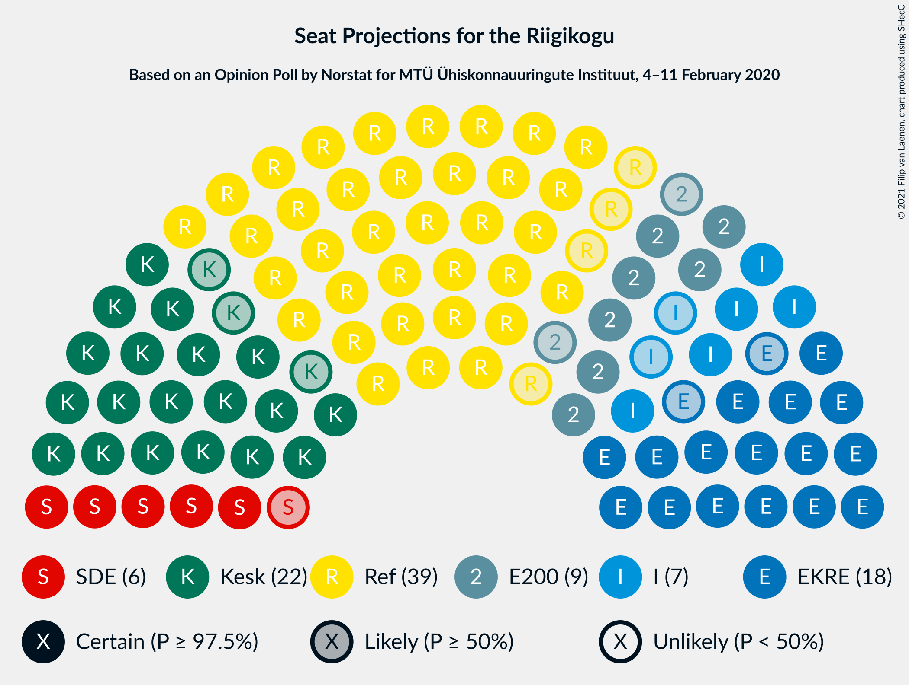
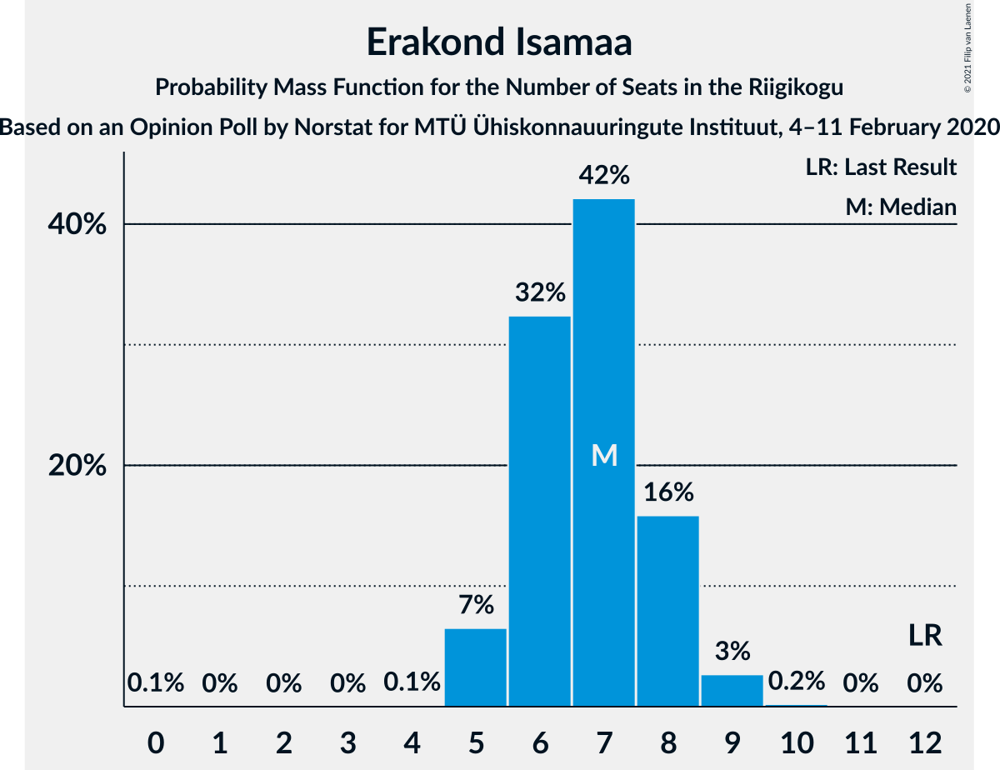
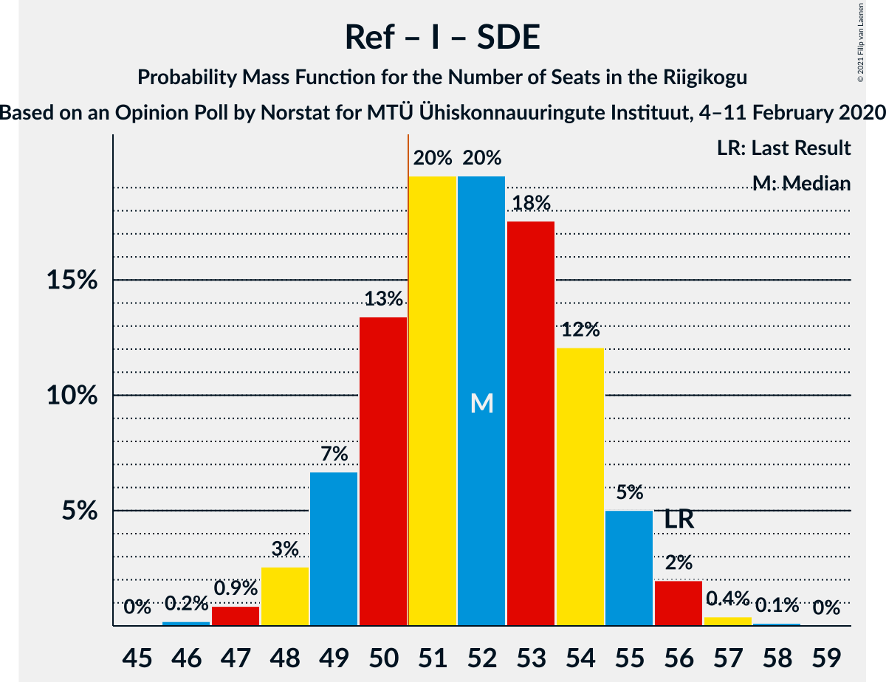
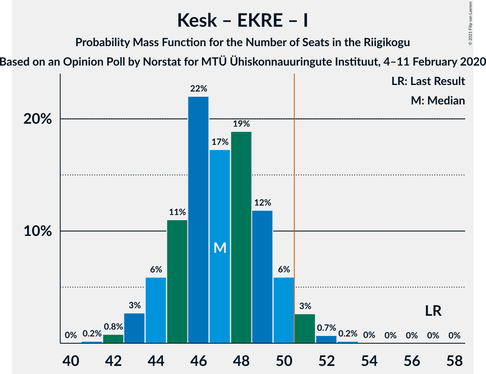

# Opinion Poll by Norstat for MTÜ Ühiskonnauuringute Instituut, 4–11 February 2020

<a href="#voting-intentions">Voting Intentions</a> | <a href="#seats">Seats</a> | <a href="#coalitions">Coalitions</a> | <a href="#technical-information">Technical Information</a>

## Voting Intentions

### Confidence Intervals

| Party | Last Result | Poll Result | 80% Confidence Interval | 90% Confidence Interval | 95% Confidence Interval | 99% Confidence Interval |
|:-----:|:-----------:|:-----------:|:-----------------------:|:-----------------------:|:-----------------------:|:-----------------------:|
| Eesti Reformierakond | 28.9% | 33.8% | 31.9–35.8% |31.4–36.3% |30.9–36.8% |30.0–37.7% |
| Eesti Keskerakond | 23.1% | 20.0% | 18.4–21.7% |18.0–22.2% |17.6–22.6% |16.9–23.4% |
| Eesti Konservatiivne Rahvaerakond | 17.8% | 17.5% | 16.0–19.1% |15.6–19.6% |15.3–20.0% |14.6–20.8% |
| Eesti 200 | 4.4% | 9.2% | 8.1–10.5% |7.8–10.8% |7.6–11.2% |7.1–11.8% |
| Erakond Isamaa | 11.4% | 7.3% | 6.3–8.5% |6.1–8.8% |5.8–9.1% |5.4–9.7% |
| Sotsiaaldemokraatlik Erakond | 9.8% | 6.7% | 5.8–7.8% |5.5–8.1% |5.3–8.4% |4.9–9.0% |
| Erakond Eestimaa Rohelised | 1.8% | 3.3% | 2.7–4.1% |2.5–4.4% |2.4–4.6% |2.1–5.0% |
| Eesti Vabaerakond | 1.2% | 0.5% | 0.3–0.9% |0.3–1.1% |0.2–1.2% |0.2–1.4% |

*Note:* The poll result column reflects the actual value used in the calculations. Published results may vary slightly, and in addition be rounded to fewer digits.

## Seats

### Confidence Intervals

| Party | Last Result | Median | 80% Confidence Interval | 90% Confidence Interval | 95% Confidence Interval | 99% Confidence Interval |
|:-----:|:-----------:|:------:|:-----------------------:|:-----------------------:|:-----------------------:|:-----------------------:|
| <a href="#eesti-reformierakond">Eesti Reformierakond</a> | 34 | 39 | 36–41 |36–42 |35–43 |34–44 |
| <a href="#eesti-keskerakond">Eesti Keskerakond</a> | 26 | 22 | 20–24 |19–25 |19–25 |18–26 |
| <a href="#eesti-konservatiivne-rahvaerakond">Eesti Konservatiivne Rahvaerakond</a> | 19 | 19 | 17–20 |16–21 |16–21 |15–22 |
| <a href="#eesti-200">Eesti 200</a> | 0 | 10 | 8–11 |8–11 |7–11 |6–11 |
| <a href="#erakond-isamaa">Erakond Isamaa</a> | 12 | 6 | 5–8 |5–8 |5–9 |5–9 |
| <a href="#sotsiaaldemokraatlik-erakond">Sotsiaaldemokraatlik Erakond</a> | 10 | 6 | 5–7 |5–7 |5–8 |0–8 |
| <a href="#erakond-eestimaa-rohelised">Erakond Eestimaa Rohelised</a> | 0 | 0 | 0 |0 |0 |0 |
| <a href="#eesti-vabaerakond">Eesti Vabaerakond</a> | 0 | 0 | 0 |0 |0 |0 |

### Eesti Reformierakond

*For a full overview of the results for this party, see the [Eesti Reformierakond](party-eestireformierakond.html) page.*

| Number of Seats | Probability | Accumulated | Special Marks |
|:---------------:|:-----------:|:-----------:|:-------------:|
| 33 | 0.1% | 100% |  |
| 34 | 0.4% | 99.9% | Last Result |
| 35 | 2% | 99.4% |  |
| 36 | 8% | 97% |  |
| 37 | 5% | 89% |  |
| 38 | 20% | 85% |  |
| 39 | 30% | 64% | Median |
| 40 | 10% | 34% |  |
| 41 | 16% | 24% |  |
| 42 | 5% | 8% |  |
| 43 | 3% | 3% |  |
| 44 | 0.6% | 0.8% |  |
| 45 | 0.1% | 0.2% |  |
| 46 | 0.1% | 0.1% |  |
| 47 | 0% | 0% |  |

### Eesti Keskerakond

*For a full overview of the results for this party, see the [Eesti Keskerakond](party-eestikeskerakond.html) page.*

| Number of Seats | Probability | Accumulated | Special Marks |
|:---------------:|:-----------:|:-----------:|:-------------:|
| 17 | 0.4% | 100% |  |
| 18 | 1.3% | 99.6% |  |
| 19 | 5% | 98% |  |
| 20 | 11% | 93% |  |
| 21 | 32% | 82% |  |
| 22 | 19% | 50% | Median |
| 23 | 15% | 31% |  |
| 24 | 11% | 17% |  |
| 25 | 5% | 6% |  |
| 26 | 0.8% | 1.0% | Last Result |
| 27 | 0.1% | 0.1% |  |
| 28 | 0% | 0% |  |

### Eesti Konservatiivne Rahvaerakond

*For a full overview of the results for this party, see the [Eesti Konservatiivne Rahvaerakond](party-eestikonservatiivnerahvaerakond.html) page.*

| Number of Seats | Probability | Accumulated | Special Marks |
|:---------------:|:-----------:|:-----------:|:-------------:|
| 14 | 0.1% | 100% |  |
| 15 | 0.9% | 99.9% |  |
| 16 | 6% | 99.0% |  |
| 17 | 18% | 93% |  |
| 18 | 24% | 75% |  |
| 19 | 33% | 51% | Last Result, Median |
| 20 | 12% | 17% |  |
| 21 | 4% | 6% |  |
| 22 | 2% | 2% |  |
| 23 | 0.4% | 0.5% |  |
| 24 | 0.1% | 0.1% |  |
| 25 | 0% | 0% |  |

### Eesti 200

*For a full overview of the results for this party, see the [Eesti 200](party-eesti200.html) page.*

| Number of Seats | Probability | Accumulated | Special Marks |
|:---------------:|:-----------:|:-----------:|:-------------:|
| 0 | 0% | 100% | Last Result |
| 1 | 0% | 100% |  |
| 2 | 0% | 100% |  |
| 3 | 0% | 100% |  |
| 4 | 0% | 100% |  |
| 5 | 0% | 100% |  |
| 6 | 0.6% | 100% |  |
| 7 | 3% | 99.4% |  |
| 8 | 21% | 97% |  |
| 9 | 24% | 76% |  |
| 10 | 42% | 52% | Median |
| 11 | 10% | 11% |  |
| 12 | 0.4% | 0.5% |  |
| 13 | 0.1% | 0.1% |  |
| 14 | 0% | 0% |  |

### Erakond Isamaa

*For a full overview of the results for this party, see the [Erakond Isamaa](party-erakondisamaa.html) page.*

| Number of Seats | Probability | Accumulated | Special Marks |
|:---------------:|:-----------:|:-----------:|:-------------:|
| 4 | 0% | 100% |  |
| 5 | 14% | 99.9% |  |
| 6 | 49% | 86% | Median |
| 7 | 22% | 37% |  |
| 8 | 12% | 15% |  |
| 9 | 3% | 3% |  |
| 10 | 0.2% | 0.2% |  |
| 11 | 0% | 0% |  |
| 12 | 0% | 0% | Last Result |

### Sotsiaaldemokraatlik Erakond

*For a full overview of the results for this party, see the [Sotsiaaldemokraatlik Erakond](party-sotsiaaldemokraatlikerakond.html) page.*

| Number of Seats | Probability | Accumulated | Special Marks |
|:---------------:|:-----------:|:-----------:|:-------------:|
| 0 | 1.5% | 100% |  |
| 1 | 0% | 98.5% |  |
| 2 | 0% | 98.5% |  |
| 3 | 0% | 98.5% |  |
| 4 | 1.0% | 98.5% |  |
| 5 | 24% | 98% |  |
| 6 | 51% | 74% | Median |
| 7 | 20% | 23% |  |
| 8 | 3% | 4% |  |
| 9 | 0.4% | 0.5% |  |
| 10 | 0% | 0% | Last Result |

### Erakond Eestimaa Rohelised

*For a full overview of the results for this party, see the [Erakond Eestimaa Rohelised](party-erakondeestimaarohelised.html) page.*

| Number of Seats | Probability | Accumulated | Special Marks |
|:---------------:|:-----------:|:-----------:|:-------------:|
| 0 | 99.5% | 100% | Last Result, Median |
| 1 | 0% | 0.5% |  |
| 2 | 0% | 0.5% |  |
| 3 | 0% | 0.5% |  |
| 4 | 0.4% | 0.5% |  |
| 5 | 0.1% | 0.1% |  |
| 6 | 0% | 0% |  |

### Eesti Vabaerakond

*For a full overview of the results for this party, see the [Eesti Vabaerakond](party-eestivabaerakond.html) page.*

| Number of Seats | Probability | Accumulated | Special Marks |
|:---------------:|:-----------:|:-----------:|:-------------:|
| 0 | 100% | 100% | Last Result, Median |

## Coalitions

### Confidence Intervals

| Coalition | Last Result | Median | Majority? | 80% Confidence Interval | 90% Confidence Interval | 95% Confidence Interval | 99% Confidence Interval |
|:---------:|:-----------:|:------:|:---------:|:-----------------------:|:-----------------------:|:-----------------------:|:-----------------------:|
| Eesti Reformierakond – Eesti Keskerakond – Eesti Konservatiivne Rahvaerakond | 79 | 79 | 100% | 77–81 | 76–82 | 76–82 | 75–85 |
| Eesti Reformierakond – Eesti Konservatiivne Rahvaerakond – Erakond Isamaa | 65 | 64 | 100% | 61–66 | 61–67 | 60–68 | 60–69 |
| Eesti Reformierakond – Eesti Keskerakond | 60 | 61 | 100% | 59–62 | 58–64 | 57–65 | 56–66 |
| Eesti Reformierakond – Eesti Konservatiivne Rahvaerakond | 53 | 58 | 100% | 55–60 | 54–60 | 54–61 | 53–62 |
| Eesti Reformierakond – Erakond Isamaa – Sotsiaaldemokraatlik Erakond – Eesti Vabaerakond | 56 | 51 | 73% | 49–54 | 48–55 | 48–55 | 47–57 |
| Eesti Reformierakond – Erakond Isamaa – Sotsiaaldemokraatlik Erakond | 56 | 51 | 73% | 49–54 | 48–55 | 48–55 | 47–57 |
| Eesti Keskerakond – Eesti Konservatiivne Rahvaerakond – Erakond Isamaa | 57 | 46 | 4% | 44–49 | 43–50 | 43–51 | 42–52 |
| Eesti Reformierakond – Erakond Isamaa | 46 | 45 | 0.4% | 43–48 | 43–49 | 42–50 | 41–50 |
| Eesti Reformierakond – Sotsiaaldemokraatlik Erakond | 44 | 45 | 0.1% | 42–48 | 41–48 | 41–48 | 40–50 |
| Eesti Keskerakond – Eesti Konservatiivne Rahvaerakond | 45 | 40 | 0% | 38–43 | 37–43 | 37–44 | 36–45 |
| Eesti Keskerakond – Erakond Isamaa – Sotsiaaldemokraatlik Erakond | 48 | 34 | 0% | 32–36 | 32–37 | 31–38 | 29–40 |
| Eesti Keskerakond – Sotsiaaldemokraatlik Erakond | 36 | 27 | 0% | 26–30 | 25–30 | 24–31 | 22–32 |
| Eesti Konservatiivne Rahvaerakond – Sotsiaaldemokraatlik Erakond | 29 | 25 | 0% | 23–26 | 22–27 | 21–27 | 19–29 |

### Eesti Reformierakond – Eesti Keskerakond – Eesti Konservatiivne Rahvaerakond

| Number of Seats | Probability | Accumulated | Special Marks |
|:---------------:|:-----------:|:-----------:|:-------------:|
| 74 | 0.2% | 100% |  |
| 75 | 0.7% | 99.8% |  |
| 76 | 5% | 99.1% |  |
| 77 | 7% | 94% |  |
| 78 | 10% | 87% |  |
| 79 | 33% | 77% | Last Result |
| 80 | 28% | 44% | Median |
| 81 | 10% | 16% |  |
| 82 | 4% | 6% |  |
| 83 | 0.9% | 2% |  |
| 84 | 0.3% | 1.3% |  |
| 85 | 0.8% | 1.0% |  |
| 86 | 0.2% | 0.2% |  |
| 87 | 0% | 0% |  |

### Eesti Reformierakond – Eesti Konservatiivne Rahvaerakond – Erakond Isamaa

| Number of Seats | Probability | Accumulated | Special Marks |
|:---------------:|:-----------:|:-----------:|:-------------:|
| 58 | 0.1% | 100% |  |
| 59 | 0.1% | 99.9% |  |
| 60 | 3% | 99.8% |  |
| 61 | 15% | 97% |  |
| 62 | 8% | 82% |  |
| 63 | 5% | 74% |  |
| 64 | 30% | 69% | Median |
| 65 | 21% | 39% | Last Result |
| 66 | 13% | 18% |  |
| 67 | 1.4% | 5% |  |
| 68 | 2% | 4% |  |
| 69 | 1.4% | 2% |  |
| 70 | 0.2% | 0.4% |  |
| 71 | 0.1% | 0.2% |  |
| 72 | 0.1% | 0.1% |  |
| 73 | 0% | 0% |  |

### Eesti Reformierakond – Eesti Keskerakond

| Number of Seats | Probability | Accumulated | Special Marks |
|:---------------:|:-----------:|:-----------:|:-------------:|
| 54 | 0% | 100% |  |
| 55 | 0.3% | 99.9% |  |
| 56 | 2% | 99.7% |  |
| 57 | 2% | 98% |  |
| 58 | 4% | 96% |  |
| 59 | 7% | 92% |  |
| 60 | 30% | 85% | Last Result |
| 61 | 17% | 55% | Median |
| 62 | 28% | 38% |  |
| 63 | 4% | 10% |  |
| 64 | 4% | 6% |  |
| 65 | 1.1% | 3% |  |
| 66 | 2% | 2% |  |
| 67 | 0.1% | 0.2% |  |
| 68 | 0% | 0% |  |

### Eesti Reformierakond – Eesti Konservatiivne Rahvaerakond

| Number of Seats | Probability | Accumulated | Special Marks |
|:---------------:|:-----------:|:-----------:|:-------------:|
| 52 | 0.2% | 100% |  |
| 53 | 0.9% | 99.7% | Last Result |
| 54 | 7% | 98.8% |  |
| 55 | 6% | 91% |  |
| 56 | 18% | 86% |  |
| 57 | 8% | 68% |  |
| 58 | 36% | 60% | Median |
| 59 | 9% | 24% |  |
| 60 | 12% | 15% |  |
| 61 | 1.0% | 3% |  |
| 62 | 2% | 2% |  |
| 63 | 0.2% | 0.4% |  |
| 64 | 0.2% | 0.2% |  |
| 65 | 0% | 0.1% |  |
| 66 | 0% | 0% |  |

### Eesti Reformierakond – Erakond Isamaa – Sotsiaaldemokraatlik Erakond – Eesti Vabaerakond

| Number of Seats | Probability | Accumulated | Special Marks |
|:---------------:|:-----------:|:-----------:|:-------------:|
| 45 | 0% | 100% |  |
| 46 | 0.2% | 99.9% |  |
| 47 | 1.5% | 99.8% |  |
| 48 | 6% | 98% |  |
| 49 | 12% | 92% |  |
| 50 | 7% | 80% |  |
| 51 | 34% | 73% | Median, Majority |
| 52 | 8% | 39% |  |
| 53 | 13% | 30% |  |
| 54 | 9% | 17% |  |
| 55 | 6% | 8% |  |
| 56 | 0.9% | 2% | Last Result |
| 57 | 0.6% | 0.8% |  |
| 58 | 0.2% | 0.2% |  |
| 59 | 0% | 0% |  |

### Eesti Reformierakond – Erakond Isamaa – Sotsiaaldemokraatlik Erakond

| Number of Seats | Probability | Accumulated | Special Marks |
|:---------------:|:-----------:|:-----------:|:-------------:|
| 45 | 0% | 100% |  |
| 46 | 0.2% | 99.9% |  |
| 47 | 1.5% | 99.8% |  |
| 48 | 6% | 98% |  |
| 49 | 12% | 92% |  |
| 50 | 7% | 80% |  |
| 51 | 34% | 73% | Median, Majority |
| 52 | 8% | 39% |  |
| 53 | 13% | 30% |  |
| 54 | 9% | 17% |  |
| 55 | 6% | 8% |  |
| 56 | 0.9% | 2% | Last Result |
| 57 | 0.6% | 0.8% |  |
| 58 | 0.2% | 0.2% |  |
| 59 | 0% | 0% |  |

### Eesti Keskerakond – Eesti Konservatiivne Rahvaerakond – Erakond Isamaa

| Number of Seats | Probability | Accumulated | Special Marks |
|:---------------:|:-----------:|:-----------:|:-------------:|
| 41 | 0.1% | 100% |  |
| 42 | 1.0% | 99.9% |  |
| 43 | 6% | 98.9% |  |
| 44 | 5% | 93% |  |
| 45 | 9% | 88% |  |
| 46 | 34% | 79% |  |
| 47 | 14% | 45% | Median |
| 48 | 17% | 31% |  |
| 49 | 5% | 15% |  |
| 50 | 6% | 10% |  |
| 51 | 3% | 4% | Majority |
| 52 | 0.7% | 0.9% |  |
| 53 | 0.2% | 0.2% |  |
| 54 | 0.1% | 0.1% |  |
| 55 | 0% | 0% |  |
| 56 | 0% | 0% |  |
| 57 | 0% | 0% | Last Result |

### Eesti Reformierakond – Erakond Isamaa

| Number of Seats | Probability | Accumulated | Special Marks |
|:---------------:|:-----------:|:-----------:|:-------------:|
| 40 | 0.1% | 100% |  |
| 41 | 0.6% | 99.9% |  |
| 42 | 4% | 99.2% |  |
| 43 | 13% | 95% |  |
| 44 | 11% | 82% |  |
| 45 | 27% | 71% | Median |
| 46 | 15% | 44% | Last Result |
| 47 | 13% | 28% |  |
| 48 | 6% | 15% |  |
| 49 | 6% | 9% |  |
| 50 | 2% | 3% |  |
| 51 | 0.3% | 0.4% | Majority |
| 52 | 0.2% | 0.2% |  |
| 53 | 0% | 0% |  |

### Eesti Reformierakond – Sotsiaaldemokraatlik Erakond

| Number of Seats | Probability | Accumulated | Special Marks |
|:---------------:|:-----------:|:-----------:|:-------------:|
| 38 | 0.1% | 100% |  |
| 39 | 0.4% | 99.9% |  |
| 40 | 0.5% | 99.5% |  |
| 41 | 5% | 99.0% |  |
| 42 | 4% | 94% |  |
| 43 | 7% | 90% |  |
| 44 | 21% | 83% | Last Result |
| 45 | 29% | 61% | Median |
| 46 | 7% | 32% |  |
| 47 | 14% | 26% |  |
| 48 | 10% | 12% |  |
| 49 | 2% | 2% |  |
| 50 | 0.4% | 0.6% |  |
| 51 | 0.1% | 0.1% | Majority |
| 52 | 0% | 0% |  |

### Eesti Keskerakond – Eesti Konservatiivne Rahvaerakond

| Number of Seats | Probability | Accumulated | Special Marks |
|:---------------:|:-----------:|:-----------:|:-------------:|
| 34 | 0.1% | 100% |  |
| 35 | 0.4% | 99.9% |  |
| 36 | 0.9% | 99.5% |  |
| 37 | 8% | 98.6% |  |
| 38 | 8% | 90% |  |
| 39 | 13% | 82% |  |
| 40 | 30% | 69% |  |
| 41 | 12% | 39% | Median |
| 42 | 17% | 27% |  |
| 43 | 6% | 10% |  |
| 44 | 3% | 4% |  |
| 45 | 1.1% | 1.3% | Last Result |
| 46 | 0.2% | 0.2% |  |
| 47 | 0% | 0.1% |  |
| 48 | 0% | 0% |  |

### Eesti Keskerakond – Erakond Isamaa – Sotsiaaldemokraatlik Erakond

| Number of Seats | Probability | Accumulated | Special Marks |
|:---------------:|:-----------:|:-----------:|:-------------:|
| 27 | 0% | 100% |  |
| 28 | 0.1% | 99.9% |  |
| 29 | 1.1% | 99.8% |  |
| 30 | 0.7% | 98.7% |  |
| 31 | 2% | 98% |  |
| 32 | 10% | 96% |  |
| 33 | 27% | 85% |  |
| 34 | 15% | 59% | Median |
| 35 | 24% | 44% |  |
| 36 | 11% | 20% |  |
| 37 | 5% | 9% |  |
| 38 | 2% | 3% |  |
| 39 | 1.1% | 2% |  |
| 40 | 0.5% | 0.6% |  |
| 41 | 0.1% | 0.1% |  |
| 42 | 0% | 0% |  |
| 43 | 0% | 0% |  |
| 44 | 0% | 0% |  |
| 45 | 0% | 0% |  |
| 46 | 0% | 0% |  |
| 47 | 0% | 0% |  |
| 48 | 0% | 0% | Last Result |

### Eesti Keskerakond – Sotsiaaldemokraatlik Erakond

| Number of Seats | Probability | Accumulated | Special Marks |
|:---------------:|:-----------:|:-----------:|:-------------:|
| 20 | 0.1% | 100% |  |
| 21 | 0.1% | 99.9% |  |
| 22 | 0.4% | 99.8% |  |
| 23 | 2% | 99.5% |  |
| 24 | 0.8% | 98% |  |
| 25 | 4% | 97% |  |
| 26 | 8% | 93% |  |
| 27 | 40% | 86% |  |
| 28 | 16% | 45% | Median |
| 29 | 11% | 30% |  |
| 30 | 14% | 18% |  |
| 31 | 3% | 4% |  |
| 32 | 0.9% | 1.1% |  |
| 33 | 0.1% | 0.1% |  |
| 34 | 0% | 0% |  |
| 35 | 0% | 0% |  |
| 36 | 0% | 0% | Last Result |

### Eesti Konservatiivne Rahvaerakond – Sotsiaaldemokraatlik Erakond

| Number of Seats | Probability | Accumulated | Special Marks |
|:---------------:|:-----------:|:-----------:|:-------------:|
| 18 | 0.2% | 100% |  |
| 19 | 0.9% | 99.7% |  |
| 20 | 0.3% | 98.8% |  |
| 21 | 2% | 98.6% |  |
| 22 | 7% | 97% |  |
| 23 | 18% | 90% |  |
| 24 | 21% | 72% |  |
| 25 | 32% | 51% | Median |
| 26 | 12% | 19% |  |
| 27 | 5% | 7% |  |
| 28 | 1.3% | 2% |  |
| 29 | 0.8% | 0.9% | Last Result |
| 30 | 0.1% | 0.2% |  |
| 31 | 0% | 0% |  |

## Technical Information

### Opinion Poll

+ **Polling firm:** Norstat
+ **Commissioner(s):** MTÜ Ühiskonnauuringute Instituut
+ **Fieldwork period:** 4–11 February 2020

### Calculations

+ **Sample size:** 1000
+ **Simulations done:** 131,072
+ **Error estimate:** 2.83%

