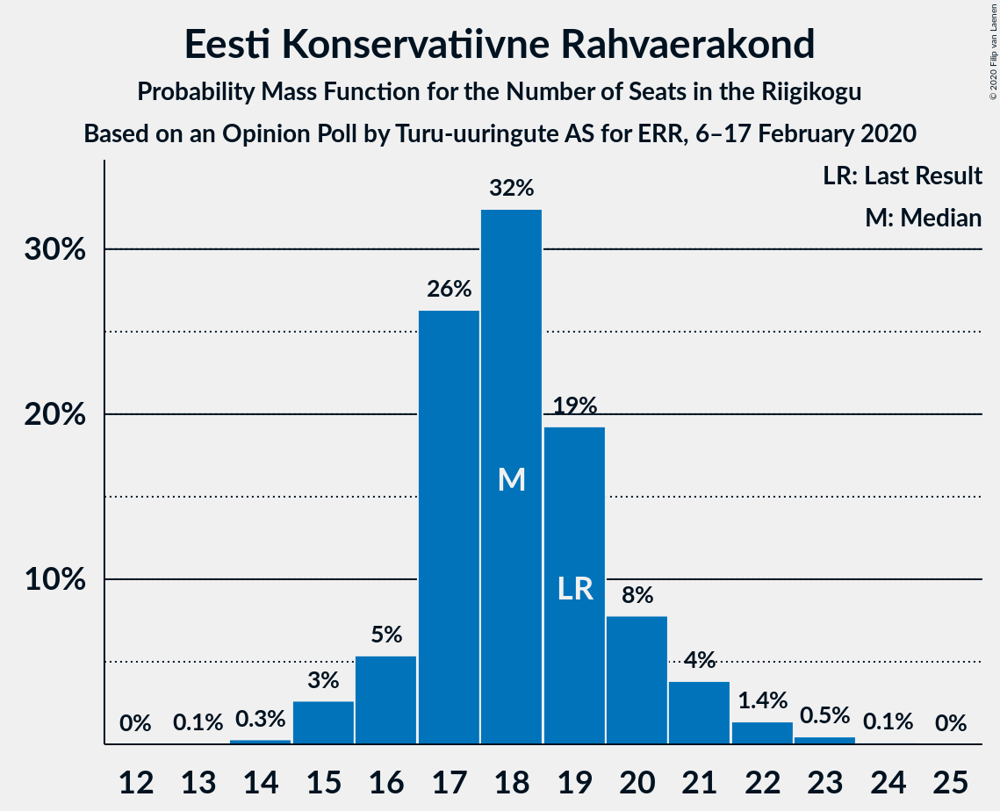
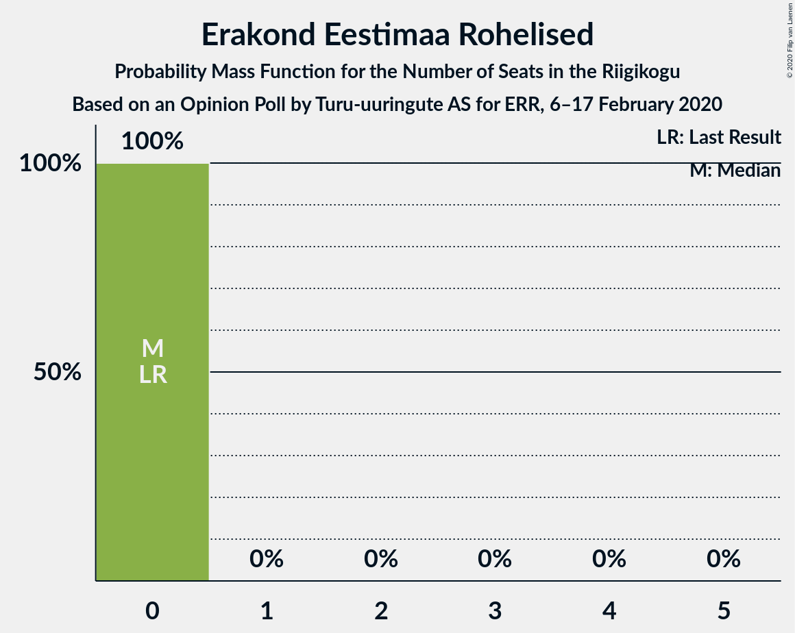
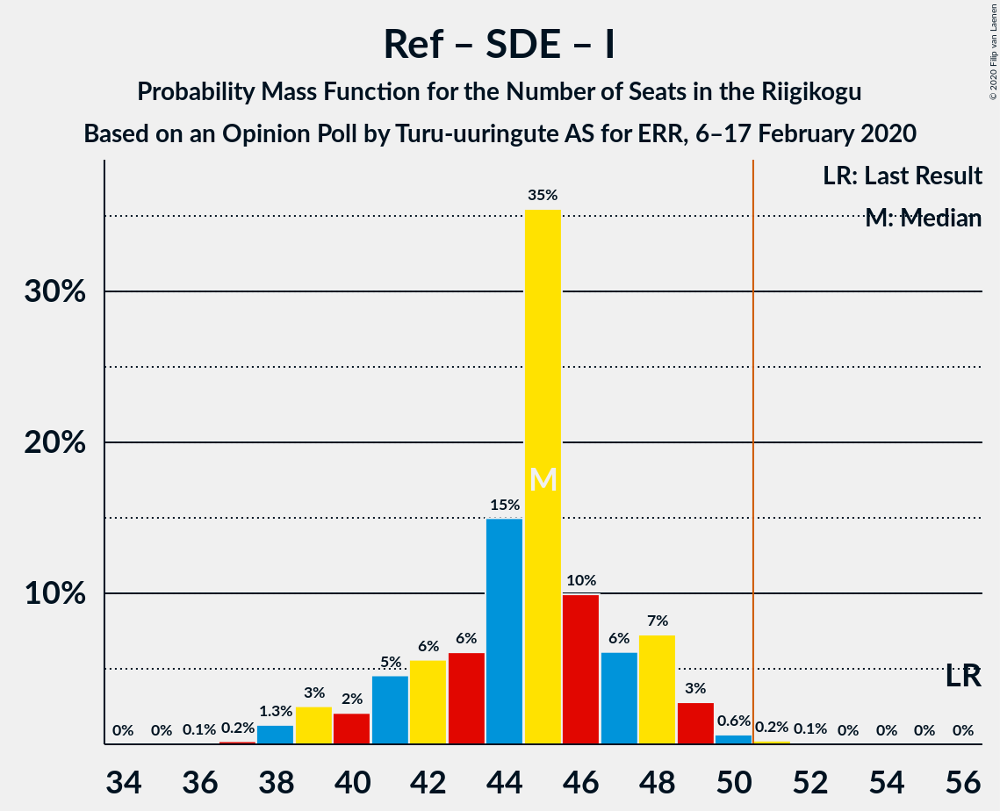

# Opinion Poll by Turu-uuringute AS for ERR, 6–17 February 2020

<a href="#voting-intentions">Voting Intentions</a> | <a href="#seats">Seats</a> | <a href="#coalitions">Coalitions</a> | <a href="#technical-information">Technical Information</a>

## Voting Intentions

### Confidence Intervals

| Party | Last Result | Poll Result | 80% Confidence Interval | 90% Confidence Interval | 95% Confidence Interval | 99% Confidence Interval |
|:-----:|:-----------:|:-----------:|:-----------------------:|:-----------------------:|:-----------------------:|:-----------------------:|
| Eesti Reformierakond | 28.9% | 27.2% | 25.3–29.3% |24.7–29.9% |24.3–30.4% |23.4–31.4% |
| Eesti Keskerakond | 23.1% | 26.1% | 24.2–28.2% |23.7–28.7% |23.2–29.3% |22.3–30.3% |
| Eesti Konservatiivne Rahvaerakond | 17.8% | 17.5% | 15.8–19.3% |15.4–19.8% |15.0–20.2% |14.2–21.1% |
| Sotsiaaldemokraatlik Erakond | 9.8% | 10.9% | 9.6–12.4% |9.2–12.8% |8.9–13.2% |8.3–14.0% |
| Eesti 200 | 4.4% | 9.8% | 8.6–11.2% |8.2–11.7% |7.9–12.0% |7.4–12.8% |
| Erakond Isamaa | 11.4% | 5.4% | 4.5–6.6% |4.3–7.0% |4.1–7.2% |3.7–7.8% |
| Erakond Eestimaa Rohelised | 1.8% | 2.2% | 1.7–3.0% |1.5–3.3% |1.4–3.5% |1.2–3.9% |

*Note:* The poll result column reflects the actual value used in the calculations. Published results may vary slightly, and in addition be rounded to fewer digits.

## Seats

### Confidence Intervals

| Party | Last Result | Median | 80% Confidence Interval | 90% Confidence Interval | 95% Confidence Interval | 99% Confidence Interval |
|:-----:|:-----------:|:------:|:-----------------------:|:-----------------------:|:-----------------------:|:-----------------------:|
| <a href="#eesti-reformierakond">Eesti Reformierakond</a> | 34 | 30 | 28–33 |27–33 |27–34 |25–36 |
| <a href="#eesti-keskerakond">Eesti Keskerakond</a> | 26 | 29 | 26–31 |25–33 |25–33 |25–34 |
| <a href="#eesti-konservatiivne-rahvaerakond">Eesti Konservatiivne Rahvaerakond</a> | 19 | 18 | 17–20 |16–21 |15–21 |15–23 |
| <a href="#sotsiaaldemokraatlik-erakond">Sotsiaaldemokraatlik Erakond</a> | 10 | 11 | 9–12 |9–13 |8–13 |8–14 |
| <a href="#eesti-200">Eesti 200</a> | 0 | 9 | 8–11 |8–11 |7–12 |7–13 |
| <a href="#erakond-isamaa">Erakond Isamaa</a> | 12 | 5 | 0–6 |0–6 |0–7 |0–7 |
| <a href="#erakond-eestimaa-rohelised">Erakond Eestimaa Rohelised</a> | 0 | 0 | 0 |0 |0 |0 |

### Eesti Reformierakond

*For a full overview of the results for this party, see the [Eesti Reformierakond](party-eestireformierakond.html) page.*

| Number of Seats | Probability | Accumulated | Special Marks |
|:---------------:|:-----------:|:-----------:|:-------------:|
| 24 | 0.1% | 100% |  |
| 25 | 0.6% | 99.8% |  |
| 26 | 1.0% | 99.2% |  |
| 27 | 5% | 98% |  |
| 28 | 16% | 93% |  |
| 29 | 19% | 77% |  |
| 30 | 21% | 58% | Median |
| 31 | 15% | 37% |  |
| 32 | 10% | 21% |  |
| 33 | 7% | 12% |  |
| 34 | 3% | 4% | Last Result |
| 35 | 1.1% | 2% |  |
| 36 | 0.2% | 0.6% |  |
| 37 | 0.4% | 0.4% |  |
| 38 | 0% | 0% |  |

### Eesti Keskerakond

*For a full overview of the results for this party, see the [Eesti Keskerakond](party-eestikeskerakond.html) page.*

| Number of Seats | Probability | Accumulated | Special Marks |
|:---------------:|:-----------:|:-----------:|:-------------:|
| 23 | 0.1% | 100% |  |
| 24 | 0.4% | 99.9% |  |
| 25 | 5% | 99.5% |  |
| 26 | 8% | 95% | Last Result |
| 27 | 5% | 87% |  |
| 28 | 18% | 82% |  |
| 29 | 39% | 64% | Median |
| 30 | 12% | 25% |  |
| 31 | 3% | 13% |  |
| 32 | 5% | 10% |  |
| 33 | 5% | 5% |  |
| 34 | 0.4% | 0.6% |  |
| 35 | 0.1% | 0.2% |  |
| 36 | 0% | 0% |  |

### Eesti Konservatiivne Rahvaerakond

*For a full overview of the results for this party, see the [Eesti Konservatiivne Rahvaerakond](party-eestikonservatiivnerahvaerakond.html) page.*

| Number of Seats | Probability | Accumulated | Special Marks |
|:---------------:|:-----------:|:-----------:|:-------------:|
| 13 | 0.1% | 100% |  |
| 14 | 0.3% | 99.9% |  |
| 15 | 3% | 99.6% |  |
| 16 | 5% | 97% |  |
| 17 | 26% | 92% |  |
| 18 | 32% | 65% | Median |
| 19 | 19% | 33% | Last Result |
| 20 | 8% | 14% |  |
| 21 | 4% | 6% |  |
| 22 | 1.4% | 2% |  |
| 23 | 0.5% | 0.6% |  |
| 24 | 0.1% | 0.1% |  |
| 25 | 0% | 0% |  |

### Sotsiaaldemokraatlik Erakond

*For a full overview of the results for this party, see the [Sotsiaaldemokraatlik Erakond](party-sotsiaaldemokraatlikerakond.html) page.*

| Number of Seats | Probability | Accumulated | Special Marks |
|:---------------:|:-----------:|:-----------:|:-------------:|
| 7 | 0.3% | 100% |  |
| 8 | 3% | 99.7% |  |
| 9 | 18% | 97% |  |
| 10 | 25% | 79% | Last Result |
| 11 | 29% | 54% | Median |
| 12 | 18% | 25% |  |
| 13 | 6% | 8% |  |
| 14 | 2% | 2% |  |
| 15 | 0.2% | 0.2% |  |
| 16 | 0% | 0% |  |

### Eesti 200

*For a full overview of the results for this party, see the [Eesti 200](party-eesti200.html) page.*

| Number of Seats | Probability | Accumulated | Special Marks |
|:---------------:|:-----------:|:-----------:|:-------------:|
| 0 | 0% | 100% | Last Result |
| 1 | 0% | 100% |  |
| 2 | 0% | 100% |  |
| 3 | 0% | 100% |  |
| 4 | 0% | 100% |  |
| 5 | 0% | 100% |  |
| 6 | 0.4% | 100% |  |
| 7 | 4% | 99.6% |  |
| 8 | 16% | 96% |  |
| 9 | 31% | 80% | Median |
| 10 | 28% | 49% |  |
| 11 | 16% | 20% |  |
| 12 | 3% | 4% |  |
| 13 | 0.8% | 0.9% |  |
| 14 | 0.1% | 0.1% |  |
| 15 | 0% | 0% |  |

### Erakond Isamaa

*For a full overview of the results for this party, see the [Erakond Isamaa](party-erakondisamaa.html) page.*

| Number of Seats | Probability | Accumulated | Special Marks |
|:---------------:|:-----------:|:-----------:|:-------------:|
| 0 | 21% | 100% |  |
| 1 | 0% | 79% |  |
| 2 | 0% | 79% |  |
| 3 | 0% | 79% |  |
| 4 | 15% | 79% |  |
| 5 | 53% | 64% | Median |
| 6 | 9% | 11% |  |
| 7 | 2% | 3% |  |
| 8 | 0.2% | 0.2% |  |
| 9 | 0% | 0% |  |
| 10 | 0% | 0% |  |
| 11 | 0% | 0% |  |
| 12 | 0% | 0% | Last Result |

### Erakond Eestimaa Rohelised

*For a full overview of the results for this party, see the [Erakond Eestimaa Rohelised](party-erakondeestimaarohelised.html) page.*

| Number of Seats | Probability | Accumulated | Special Marks |
|:---------------:|:-----------:|:-----------:|:-------------:|
| 0 | 100% | 100% | Last Result, Median |

## Coalitions

### Confidence Intervals

| Coalition | Last Result | Median | Majority? | 80% Confidence Interval | 90% Confidence Interval | 95% Confidence Interval | 99% Confidence Interval |
|:---------:|:-----------:|:------:|:---------:|:-----------------------:|:-----------------------:|:-----------------------:|:-----------------------:|
| Eesti Reformierakond – Eesti Keskerakond – Eesti Konservatiivne Rahvaerakond | 79 | 76 | 100% | 74–80 | 74–81 | 73–82 | 72–83 |
| Eesti Reformierakond – Eesti Keskerakond | 60 | 58 | 100% | 56–62 | 55–63 | 55–64 | 53–65 |
| Eesti Reformierakond – Eesti Konservatiivne Rahvaerakond – Erakond Isamaa | 65 | 52 | 76% | 49–55 | 48–55 | 47–56 | 46–58 |
| Eesti Keskerakond – Eesti Konservatiivne Rahvaerakond – Erakond Isamaa | 57 | 51 | 63% | 48–53 | 47–54 | 46–55 | 44–56 |
| Eesti Reformierakond – Eesti Konservatiivne Rahvaerakond | 53 | 48 | 13% | 45–51 | 45–52 | 44–53 | 43–55 |
| Eesti Keskerakond – Eesti Konservatiivne Rahvaerakond | 45 | 47 | 9% | 44–50 | 43–51 | 43–52 | 41–53 |
| Eesti Reformierakond – Sotsiaaldemokraatlik Erakond – Erakond Isamaa | 56 | 45 | 0.4% | 41–48 | 40–48 | 39–49 | 38–50 |
| Eesti Keskerakond – Sotsiaaldemokraatlik Erakond – Erakond Isamaa | 48 | 43 | 0.1% | 40–46 | 40–47 | 38–48 | 37–49 |
| Eesti Reformierakond – Sotsiaaldemokraatlik Erakond | 44 | 40 | 0% | 38–44 | 37–45 | 37–45 | 36–48 |
| Eesti Keskerakond – Sotsiaaldemokraatlik Erakond | 36 | 39 | 0% | 37–42 | 36–43 | 35–44 | 34–45 |
| Eesti Reformierakond – Erakond Isamaa | 46 | 34 | 0% | 31–37 | 29–37 | 29–38 | 27–40 |
| Eesti Konservatiivne Rahvaerakond – Sotsiaaldemokraatlik Erakond | 29 | 29 | 0% | 27–31 | 26–32 | 25–33 | 24–34 |

### Eesti Reformierakond – Eesti Keskerakond – Eesti Konservatiivne Rahvaerakond

| Number of Seats | Probability | Accumulated | Special Marks |
|:---------------:|:-----------:|:-----------:|:-------------:|
| 71 | 0.2% | 100% |  |
| 72 | 1.1% | 99.7% |  |
| 73 | 3% | 98.7% |  |
| 74 | 12% | 95% |  |
| 75 | 10% | 83% |  |
| 76 | 23% | 73% |  |
| 77 | 11% | 50% | Median |
| 78 | 18% | 39% |  |
| 79 | 4% | 21% | Last Result |
| 80 | 8% | 17% |  |
| 81 | 4% | 9% |  |
| 82 | 3% | 5% |  |
| 83 | 1.1% | 2% |  |
| 84 | 0.3% | 0.4% |  |
| 85 | 0% | 0.1% |  |
| 86 | 0% | 0% |  |

### Eesti Reformierakond – Eesti Keskerakond

| Number of Seats | Probability | Accumulated | Special Marks |
|:---------------:|:-----------:|:-----------:|:-------------:|
| 52 | 0.2% | 100% |  |
| 53 | 0.5% | 99.8% |  |
| 54 | 2% | 99.3% |  |
| 55 | 4% | 98% |  |
| 56 | 4% | 93% |  |
| 57 | 11% | 90% |  |
| 58 | 30% | 78% |  |
| 59 | 16% | 48% | Median |
| 60 | 11% | 32% | Last Result |
| 61 | 8% | 21% |  |
| 62 | 8% | 13% |  |
| 63 | 2% | 5% |  |
| 64 | 2% | 3% |  |
| 65 | 0.9% | 1.3% |  |
| 66 | 0.2% | 0.4% |  |
| 67 | 0.1% | 0.2% |  |
| 68 | 0% | 0% |  |

### Eesti Reformierakond – Eesti Konservatiivne Rahvaerakond – Erakond Isamaa

| Number of Seats | Probability | Accumulated | Special Marks |
|:---------------:|:-----------:|:-----------:|:-------------:|
| 44 | 0.1% | 100% |  |
| 45 | 0.2% | 99.9% |  |
| 46 | 0.3% | 99.8% |  |
| 47 | 3% | 99.4% |  |
| 48 | 2% | 96% |  |
| 49 | 4% | 94% |  |
| 50 | 14% | 90% |  |
| 51 | 10% | 76% | Majority |
| 52 | 25% | 66% |  |
| 53 | 12% | 40% | Median |
| 54 | 18% | 29% |  |
| 55 | 6% | 10% |  |
| 56 | 3% | 4% |  |
| 57 | 0.7% | 1.3% |  |
| 58 | 0.3% | 0.6% |  |
| 59 | 0.2% | 0.3% |  |
| 60 | 0% | 0% |  |
| 61 | 0% | 0% |  |
| 62 | 0% | 0% |  |
| 63 | 0% | 0% |  |
| 64 | 0% | 0% |  |
| 65 | 0% | 0% | Last Result |

### Eesti Keskerakond – Eesti Konservatiivne Rahvaerakond – Erakond Isamaa

| Number of Seats | Probability | Accumulated | Special Marks |
|:---------------:|:-----------:|:-----------:|:-------------:|
| 43 | 0.1% | 100% |  |
| 44 | 0.7% | 99.9% |  |
| 45 | 0.5% | 99.2% |  |
| 46 | 3% | 98.7% |  |
| 47 | 4% | 96% |  |
| 48 | 6% | 92% |  |
| 49 | 11% | 86% |  |
| 50 | 12% | 76% |  |
| 51 | 26% | 63% | Majority |
| 52 | 18% | 38% | Median |
| 53 | 11% | 20% |  |
| 54 | 5% | 9% |  |
| 55 | 2% | 4% |  |
| 56 | 1.2% | 2% |  |
| 57 | 0.3% | 0.4% | Last Result |
| 58 | 0% | 0.1% |  |
| 59 | 0% | 0% |  |

### Eesti Reformierakond – Eesti Konservatiivne Rahvaerakond

| Number of Seats | Probability | Accumulated | Special Marks |
|:---------------:|:-----------:|:-----------:|:-------------:|
| 41 | 0% | 100% |  |
| 42 | 0.2% | 99.9% |  |
| 43 | 0.6% | 99.8% |  |
| 44 | 2% | 99.2% |  |
| 45 | 11% | 97% |  |
| 46 | 8% | 86% |  |
| 47 | 22% | 78% |  |
| 48 | 14% | 55% | Median |
| 49 | 15% | 41% |  |
| 50 | 13% | 27% |  |
| 51 | 6% | 13% | Majority |
| 52 | 2% | 7% |  |
| 53 | 3% | 5% | Last Result |
| 54 | 1.0% | 2% |  |
| 55 | 0.2% | 0.5% |  |
| 56 | 0.3% | 0.3% |  |
| 57 | 0% | 0% |  |

### Eesti Keskerakond – Eesti Konservatiivne Rahvaerakond

| Number of Seats | Probability | Accumulated | Special Marks |
|:---------------:|:-----------:|:-----------:|:-------------:|
| 40 | 0.1% | 100% |  |
| 41 | 0.6% | 99.9% |  |
| 42 | 0.9% | 99.3% |  |
| 43 | 5% | 98% |  |
| 44 | 7% | 94% |  |
| 45 | 10% | 87% | Last Result |
| 46 | 21% | 77% |  |
| 47 | 24% | 56% | Median |
| 48 | 11% | 32% |  |
| 49 | 8% | 21% |  |
| 50 | 4% | 13% |  |
| 51 | 6% | 9% | Majority |
| 52 | 2% | 3% |  |
| 53 | 0.7% | 1.0% |  |
| 54 | 0.2% | 0.3% |  |
| 55 | 0% | 0.1% |  |
| 56 | 0% | 0% |  |

### Eesti Reformierakond – Sotsiaaldemokraatlik Erakond – Erakond Isamaa

| Number of Seats | Probability | Accumulated | Special Marks |
|:---------------:|:-----------:|:-----------:|:-------------:|
| 36 | 0.1% | 100% |  |
| 37 | 0.2% | 99.9% |  |
| 38 | 1.3% | 99.7% |  |
| 39 | 3% | 98% |  |
| 40 | 2% | 96% |  |
| 41 | 5% | 94% |  |
| 42 | 6% | 89% |  |
| 43 | 6% | 84% |  |
| 44 | 15% | 78% |  |
| 45 | 35% | 63% |  |
| 46 | 10% | 27% | Median |
| 47 | 6% | 17% |  |
| 48 | 7% | 11% |  |
| 49 | 3% | 4% |  |
| 50 | 0.6% | 1.0% |  |
| 51 | 0.2% | 0.4% | Majority |
| 52 | 0.1% | 0.1% |  |
| 53 | 0% | 0% |  |
| 54 | 0% | 0% |  |
| 55 | 0% | 0% |  |
| 56 | 0% | 0% | Last Result |

### Eesti Keskerakond – Sotsiaaldemokraatlik Erakond – Erakond Isamaa

| Number of Seats | Probability | Accumulated | Special Marks |
|:---------------:|:-----------:|:-----------:|:-------------:|
| 35 | 0.2% | 100% |  |
| 36 | 0.3% | 99.8% |  |
| 37 | 0.6% | 99.6% |  |
| 38 | 2% | 99.0% |  |
| 39 | 2% | 97% |  |
| 40 | 6% | 95% |  |
| 41 | 13% | 90% |  |
| 42 | 11% | 77% |  |
| 43 | 17% | 66% |  |
| 44 | 12% | 48% |  |
| 45 | 15% | 36% | Median |
| 46 | 14% | 21% |  |
| 47 | 4% | 7% |  |
| 48 | 2% | 3% | Last Result |
| 49 | 0.4% | 0.6% |  |
| 50 | 0.1% | 0.1% |  |
| 51 | 0.1% | 0.1% | Majority |
| 52 | 0% | 0% |  |

### Eesti Reformierakond – Sotsiaaldemokraatlik Erakond

| Number of Seats | Probability | Accumulated | Special Marks |
|:---------------:|:-----------:|:-----------:|:-------------:|
| 34 | 0% | 100% |  |
| 35 | 0.4% | 99.9% |  |
| 36 | 1.1% | 99.5% |  |
| 37 | 4% | 98% |  |
| 38 | 7% | 95% |  |
| 39 | 9% | 87% |  |
| 40 | 37% | 78% |  |
| 41 | 14% | 41% | Median |
| 42 | 8% | 27% |  |
| 43 | 9% | 20% |  |
| 44 | 4% | 11% | Last Result |
| 45 | 4% | 6% |  |
| 46 | 1.2% | 2% |  |
| 47 | 0.6% | 1.2% |  |
| 48 | 0.5% | 0.5% |  |
| 49 | 0% | 0% |  |

### Eesti Keskerakond – Sotsiaaldemokraatlik Erakond

| Number of Seats | Probability | Accumulated | Special Marks |
|:---------------:|:-----------:|:-----------:|:-------------:|
| 33 | 0.1% | 100% |  |
| 34 | 0.4% | 99.9% |  |
| 35 | 2% | 99.5% |  |
| 36 | 3% | 97% | Last Result |
| 37 | 15% | 94% |  |
| 38 | 14% | 79% |  |
| 39 | 16% | 66% |  |
| 40 | 17% | 50% | Median |
| 41 | 18% | 32% |  |
| 42 | 6% | 14% |  |
| 43 | 5% | 9% |  |
| 44 | 2% | 3% |  |
| 45 | 0.5% | 0.8% |  |
| 46 | 0.2% | 0.3% |  |
| 47 | 0.1% | 0.1% |  |
| 48 | 0% | 0% |  |

### Eesti Reformierakond – Erakond Isamaa

| Number of Seats | Probability | Accumulated | Special Marks |
|:---------------:|:-----------:|:-----------:|:-------------:|
| 25 | 0.1% | 100% |  |
| 26 | 0.2% | 99.9% |  |
| 27 | 0.3% | 99.7% |  |
| 28 | 2% | 99.4% |  |
| 29 | 4% | 98% |  |
| 30 | 3% | 93% |  |
| 31 | 5% | 91% |  |
| 32 | 5% | 86% |  |
| 33 | 17% | 81% |  |
| 34 | 18% | 64% |  |
| 35 | 27% | 46% | Median |
| 36 | 4% | 19% |  |
| 37 | 11% | 15% |  |
| 38 | 3% | 4% |  |
| 39 | 0.5% | 1.2% |  |
| 40 | 0.5% | 0.7% |  |
| 41 | 0.1% | 0.1% |  |
| 42 | 0% | 0% |  |
| 43 | 0% | 0% |  |
| 44 | 0% | 0% |  |
| 45 | 0% | 0% |  |
| 46 | 0% | 0% | Last Result |

### Eesti Konservatiivne Rahvaerakond – Sotsiaaldemokraatlik Erakond

| Number of Seats | Probability | Accumulated | Special Marks |
|:---------------:|:-----------:|:-----------:|:-------------:|
| 23 | 0.1% | 100% |  |
| 24 | 0.7% | 99.9% |  |
| 25 | 2% | 99.3% |  |
| 26 | 6% | 97% |  |
| 27 | 17% | 91% |  |
| 28 | 15% | 74% |  |
| 29 | 35% | 59% | Last Result, Median |
| 30 | 9% | 24% |  |
| 31 | 6% | 15% |  |
| 32 | 6% | 9% |  |
| 33 | 2% | 3% |  |
| 34 | 0.4% | 0.7% |  |
| 35 | 0.3% | 0.3% |  |
| 36 | 0% | 0% |  |

## Technical Information

### Opinion Poll

+ **Polling firm:** Turu-uuringute AS
+ **Commissioner(s):** ERR
+ **Fieldwork period:** 6–17 February 2020

### Calculations

+ **Sample size:** 808
+ **Simulations done:** 131,072
+ **Error estimate:** 1.51%

