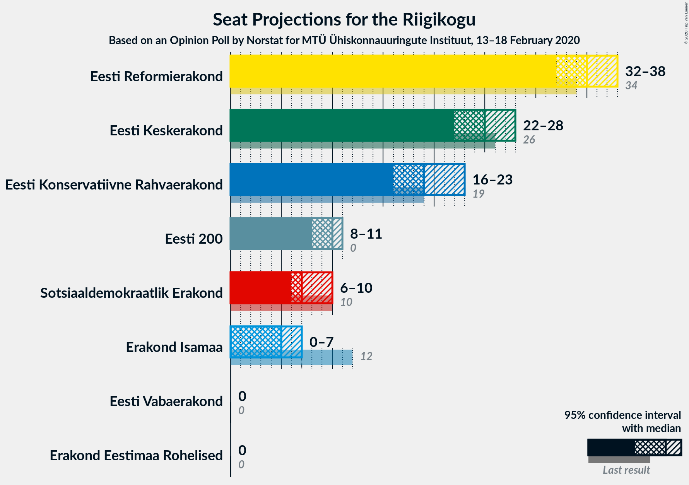

# Opinion Poll by Norstat for MTÜ Ühiskonnauuringute Instituut, 13–18 February 2020

<a href="#voting-intentions">Voting Intentions</a> | <a href="#seats">Seats</a> | <a href="#coalitions">Coalitions</a> | <a href="#technical-information">Technical Information</a>

## Voting Intentions

### Confidence Intervals

| Party | Last Result | Poll Result | 80% Confidence Interval | 90% Confidence Interval | 95% Confidence Interval | 99% Confidence Interval |
|:-----:|:-----------:|:-----------:|:-----------------------:|:-----------------------:|:-----------------------:|:-----------------------:|
| Eesti Reformierakond | 28.9% | 30.9% | 29.1–32.8% |28.5–33.4% |28.1–33.8% |27.3–34.8% |
| Eesti Keskerakond | 23.1% | 22.4% | 20.8–24.2% |20.3–24.7% |19.9–25.1% |19.2–26.0% |
| Eesti Konservatiivne Rahvaerakond | 17.8% | 18.0% | 16.5–19.6% |16.1–20.1% |15.7–20.5% |15.1–21.3% |
| Eesti 200 | 4.4% | 9.8% | 8.7–11.1% |8.4–11.5% |8.1–11.8% |7.6–12.5% |
| Sotsiaaldemokraatlik Erakond | 9.8% | 7.9% | 6.9–9.1% |6.6–9.4% |6.4–9.7% |5.9–10.3% |
| Erakond Isamaa | 11.4% | 6.0% | 5.1–7.1% |4.9–7.4% |4.7–7.7% |4.3–8.2% |
| Erakond Eestimaa Rohelised | 1.8% | 3.0% | 2.4–3.8% |2.2–4.1% |2.1–4.3% |1.9–4.7% |
| Eesti Vabaerakond | 1.2% | 0.7% | 0.5–1.2% |0.4–1.3% |0.3–1.4% |0.2–1.7% |

*Note:* The poll result column reflects the actual value used in the calculations. Published results may vary slightly, and in addition be rounded to fewer digits.

## Seats

### Confidence Intervals

| Party | Last Result | Median | 80% Confidence Interval | 90% Confidence Interval | 95% Confidence Interval | 99% Confidence Interval |
|:-----:|:-----------:|:------:|:-----------------------:|:-----------------------:|:-----------------------:|:-----------------------:|
| <a href="#eesti-reformierakond">Eesti Reformierakond</a> | 34 | 35 | 33–37 |33–37 |32–38 |31–40 |
| <a href="#eesti-keskerakond">Eesti Keskerakond</a> | 26 | 25 | 23–27 |22–27 |22–28 |20–29 |
| <a href="#eesti-konservatiivne-rahvaerakond">Eesti Konservatiivne Rahvaerakond</a> | 19 | 19 | 18–21 |17–22 |16–23 |16–23 |
| <a href="#eesti-200">Eesti 200</a> | 0 | 10 | 9–11 |8–11 |8–11 |7–12 |
| <a href="#sotsiaaldemokraatlik-erakond">Sotsiaaldemokraatlik Erakond</a> | 10 | 7 | 6–9 |6–9 |6–10 |5–10 |
| <a href="#erakond-isamaa">Erakond Isamaa</a> | 12 | 5 | 4–6 |4–6 |0–7 |0–8 |
| <a href="#erakond-eestimaa-rohelised">Erakond Eestimaa Rohelised</a> | 0 | 0 | 0 |0 |0 |0 |
| <a href="#eesti-vabaerakond">Eesti Vabaerakond</a> | 0 | 0 | 0 |0 |0 |0 |

### Eesti Reformierakond

*For a full overview of the results for this party, see the [Eesti Reformierakond](party-eestireformierakond.html) page.*

| Number of Seats | Probability | Accumulated | Special Marks |
|:---------------:|:-----------:|:-----------:|:-------------:|
| 30 | 0.1% | 100% |  |
| 31 | 0.6% | 99.8% |  |
| 32 | 3% | 99.3% |  |
| 33 | 10% | 97% |  |
| 34 | 15% | 87% | Last Result |
| 35 | 43% | 72% | Median |
| 36 | 16% | 29% |  |
| 37 | 9% | 13% |  |
| 38 | 2% | 4% |  |
| 39 | 1.0% | 2% |  |
| 40 | 0.5% | 0.8% |  |
| 41 | 0.2% | 0.3% |  |
| 42 | 0.1% | 0.1% |  |
| 43 | 0% | 0% |  |

### Eesti Keskerakond

*For a full overview of the results for this party, see the [Eesti Keskerakond](party-eestikeskerakond.html) page.*

| Number of Seats | Probability | Accumulated | Special Marks |
|:---------------:|:-----------:|:-----------:|:-------------:|
| 20 | 0.5% | 100% |  |
| 21 | 2% | 99.4% |  |
| 22 | 4% | 98% |  |
| 23 | 21% | 94% |  |
| 24 | 18% | 73% |  |
| 25 | 33% | 55% | Median |
| 26 | 10% | 22% | Last Result |
| 27 | 9% | 12% |  |
| 28 | 2% | 4% |  |
| 29 | 1.2% | 1.4% |  |
| 30 | 0.2% | 0.2% |  |
| 31 | 0% | 0% |  |

### Eesti Konservatiivne Rahvaerakond

*For a full overview of the results for this party, see the [Eesti Konservatiivne Rahvaerakond](party-eestikonservatiivnerahvaerakond.html) page.*

| Number of Seats | Probability | Accumulated | Special Marks |
|:---------------:|:-----------:|:-----------:|:-------------:|
| 15 | 0.3% | 100% |  |
| 16 | 3% | 99.7% |  |
| 17 | 4% | 97% |  |
| 18 | 24% | 93% |  |
| 19 | 37% | 69% | Last Result, Median |
| 20 | 20% | 31% |  |
| 21 | 3% | 11% |  |
| 22 | 5% | 8% |  |
| 23 | 3% | 3% |  |
| 24 | 0.3% | 0.3% |  |
| 25 | 0% | 0% |  |

### Eesti 200

*For a full overview of the results for this party, see the [Eesti 200](party-eesti200.html) page.*

| Number of Seats | Probability | Accumulated | Special Marks |
|:---------------:|:-----------:|:-----------:|:-------------:|
| 0 | 0% | 100% | Last Result |
| 1 | 0% | 100% |  |
| 2 | 0% | 100% |  |
| 3 | 0% | 100% |  |
| 4 | 0% | 100% |  |
| 5 | 0% | 100% |  |
| 6 | 0% | 100% |  |
| 7 | 2% | 100% |  |
| 8 | 6% | 98% |  |
| 9 | 15% | 92% |  |
| 10 | 61% | 76% | Median |
| 11 | 13% | 15% |  |
| 12 | 1.5% | 2% |  |
| 13 | 0.4% | 0.4% |  |
| 14 | 0% | 0% |  |

### Sotsiaaldemokraatlik Erakond

*For a full overview of the results for this party, see the [Sotsiaaldemokraatlik Erakond](party-sotsiaaldemokraatlikerakond.html) page.*

| Number of Seats | Probability | Accumulated | Special Marks |
|:---------------:|:-----------:|:-----------:|:-------------:|
| 5 | 2% | 100% |  |
| 6 | 16% | 98% |  |
| 7 | 48% | 83% | Median |
| 8 | 20% | 34% |  |
| 9 | 12% | 15% |  |
| 10 | 2% | 3% | Last Result |
| 11 | 0.1% | 0.1% |  |
| 12 | 0% | 0% |  |

### Erakond Isamaa

*For a full overview of the results for this party, see the [Erakond Isamaa](party-erakondisamaa.html) page.*

| Number of Seats | Probability | Accumulated | Special Marks |
|:---------------:|:-----------:|:-----------:|:-------------:|
| 0 | 5% | 100% |  |
| 1 | 0% | 95% |  |
| 2 | 0% | 95% |  |
| 3 | 0% | 95% |  |
| 4 | 8% | 95% |  |
| 5 | 50% | 88% | Median |
| 6 | 34% | 37% |  |
| 7 | 3% | 4% |  |
| 8 | 0.6% | 0.6% |  |
| 9 | 0% | 0% |  |
| 10 | 0% | 0% |  |
| 11 | 0% | 0% |  |
| 12 | 0% | 0% | Last Result |

### Erakond Eestimaa Rohelised

*For a full overview of the results for this party, see the [Erakond Eestimaa Rohelised](party-erakondeestimaarohelised.html) page.*

| Number of Seats | Probability | Accumulated | Special Marks |
|:---------------:|:-----------:|:-----------:|:-------------:|
| 0 | 99.9% | 100% | Last Result, Median |
| 1 | 0% | 0.1% |  |
| 2 | 0% | 0.1% |  |
| 3 | 0% | 0.1% |  |
| 4 | 0.1% | 0.1% |  |
| 5 | 0% | 0% |  |

### Eesti Vabaerakond

*For a full overview of the results for this party, see the [Eesti Vabaerakond](party-eestivabaerakond.html) page.*

| Number of Seats | Probability | Accumulated | Special Marks |
|:---------------:|:-----------:|:-----------:|:-------------:|
| 0 | 100% | 100% | Last Result, Median |

## Coalitions

### Confidence Intervals

| Coalition | Last Result | Median | Majority? | 80% Confidence Interval | 90% Confidence Interval | 95% Confidence Interval | 99% Confidence Interval |
|:---------:|:-----------:|:------:|:---------:|:-----------------------:|:-----------------------:|:-----------------------:|:-----------------------:|
| Eesti Reformierakond – Eesti Keskerakond – Eesti Konservatiivne Rahvaerakond | 79 | 78 | 100% | 77–81 | 76–82 | 75–84 | 75–86 |
| Eesti Reformierakond – Eesti Keskerakond | 60 | 60 | 100% | 58–62 | 57–63 | 56–63 | 55–65 |
| Eesti Reformierakond – Eesti Konservatiivne Rahvaerakond – Erakond Isamaa | 65 | 59 | 100% | 57–61 | 57–62 | 56–63 | 54–64 |
| Eesti Reformierakond – Eesti Konservatiivne Rahvaerakond | 53 | 54 | 99.0% | 52–56 | 52–57 | 51–58 | 50–60 |
| Eesti Keskerakond – Eesti Konservatiivne Rahvaerakond – Erakond Isamaa | 57 | 49 | 16% | 47–51 | 47–51 | 45–52 | 44–54 |
| Eesti Reformierakond – Sotsiaaldemokraatlik Erakond – Erakond Isamaa – Eesti Vabaerakond | 56 | 48 | 4% | 45–49 | 45–50 | 42–51 | 41–53 |
| Eesti Reformierakond – Sotsiaaldemokraatlik Erakond – Erakond Isamaa | 56 | 48 | 4% | 45–49 | 45–50 | 42–51 | 41–53 |
| Eesti Keskerakond – Eesti Konservatiivne Rahvaerakond | 45 | 44 | 0.4% | 42–46 | 41–46 | 41–49 | 39–50 |
| Eesti Reformierakond – Sotsiaaldemokraatlik Erakond | 44 | 42 | 0% | 40–44 | 40–45 | 39–46 | 38–48 |
| Eesti Reformierakond – Erakond Isamaa | 46 | 40 | 0% | 39–42 | 37–43 | 35–43 | 34–45 |
| Eesti Keskerakond – Sotsiaaldemokraatlik Erakond – Erakond Isamaa | 48 | 37 | 0% | 35–39 | 34–40 | 34–41 | 31–41 |
| Eesti Keskerakond – Sotsiaaldemokraatlik Erakond | 36 | 32 | 0% | 30–34 | 30–35 | 29–35 | 27–37 |
| Eesti Konservatiivne Rahvaerakond – Sotsiaaldemokraatlik Erakond | 29 | 26 | 0% | 25–29 | 24–29 | 23–30 | 22–31 |

### Eesti Reformierakond – Eesti Keskerakond – Eesti Konservatiivne Rahvaerakond

| Number of Seats | Probability | Accumulated | Special Marks |
|:---------------:|:-----------:|:-----------:|:-------------:|
| 73 | 0.1% | 100% |  |
| 74 | 0.2% | 99.9% |  |
| 75 | 2% | 99.7% |  |
| 76 | 2% | 97% |  |
| 77 | 11% | 95% |  |
| 78 | 35% | 84% |  |
| 79 | 28% | 49% | Last Result, Median |
| 80 | 7% | 21% |  |
| 81 | 8% | 14% |  |
| 82 | 2% | 6% |  |
| 83 | 0.9% | 4% |  |
| 84 | 2% | 3% |  |
| 85 | 0.3% | 0.9% |  |
| 86 | 0.6% | 0.6% |  |
| 87 | 0% | 0% |  |

### Eesti Reformierakond – Eesti Keskerakond

| Number of Seats | Probability | Accumulated | Special Marks |
|:---------------:|:-----------:|:-----------:|:-------------:|
| 54 | 0.1% | 100% |  |
| 55 | 0.5% | 99.9% |  |
| 56 | 4% | 99.3% |  |
| 57 | 3% | 95% |  |
| 58 | 18% | 92% |  |
| 59 | 19% | 74% |  |
| 60 | 33% | 55% | Last Result, Median |
| 61 | 8% | 22% |  |
| 62 | 5% | 14% |  |
| 63 | 6% | 8% |  |
| 64 | 1.1% | 2% |  |
| 65 | 0.4% | 0.9% |  |
| 66 | 0.3% | 0.5% |  |
| 67 | 0.2% | 0.2% |  |
| 68 | 0% | 0% |  |

### Eesti Reformierakond – Eesti Konservatiivne Rahvaerakond – Erakond Isamaa

| Number of Seats | Probability | Accumulated | Special Marks |
|:---------------:|:-----------:|:-----------:|:-------------:|
| 53 | 0.1% | 100% |  |
| 54 | 1.0% | 99.9% |  |
| 55 | 0.4% | 98.9% |  |
| 56 | 3% | 98% |  |
| 57 | 10% | 95% |  |
| 58 | 8% | 86% |  |
| 59 | 47% | 77% | Median |
| 60 | 3% | 30% |  |
| 61 | 19% | 27% |  |
| 62 | 5% | 8% |  |
| 63 | 1.2% | 3% |  |
| 64 | 1.3% | 2% |  |
| 65 | 0.3% | 0.4% | Last Result |
| 66 | 0% | 0.1% |  |
| 67 | 0% | 0% |  |

### Eesti Reformierakond – Eesti Konservatiivne Rahvaerakond

| Number of Seats | Probability | Accumulated | Special Marks |
|:---------------:|:-----------:|:-----------:|:-------------:|
| 48 | 0.1% | 100% |  |
| 49 | 0.2% | 99.9% |  |
| 50 | 0.7% | 99.7% |  |
| 51 | 3% | 99.0% | Majority |
| 52 | 11% | 96% |  |
| 53 | 19% | 85% | Last Result |
| 54 | 28% | 66% | Median |
| 55 | 22% | 38% |  |
| 56 | 7% | 16% |  |
| 57 | 6% | 10% |  |
| 58 | 2% | 3% |  |
| 59 | 0.9% | 2% |  |
| 60 | 0.4% | 0.7% |  |
| 61 | 0% | 0.3% |  |
| 62 | 0.2% | 0.2% |  |
| 63 | 0% | 0% |  |

### Eesti Keskerakond – Eesti Konservatiivne Rahvaerakond – Erakond Isamaa

| Number of Seats | Probability | Accumulated | Special Marks |
|:---------------:|:-----------:|:-----------:|:-------------:|
| 41 | 0.1% | 100% |  |
| 42 | 0.1% | 99.9% |  |
| 43 | 0.3% | 99.8% |  |
| 44 | 0.7% | 99.6% |  |
| 45 | 2% | 98.9% |  |
| 46 | 2% | 97% |  |
| 47 | 14% | 95% |  |
| 48 | 22% | 81% |  |
| 49 | 33% | 59% | Median |
| 50 | 10% | 26% |  |
| 51 | 11% | 16% | Majority |
| 52 | 3% | 5% |  |
| 53 | 1.0% | 2% |  |
| 54 | 0.5% | 0.5% |  |
| 55 | 0.1% | 0.1% |  |
| 56 | 0% | 0% |  |
| 57 | 0% | 0% | Last Result |

### Eesti Reformierakond – Sotsiaaldemokraatlik Erakond – Erakond Isamaa – Eesti Vabaerakond

| Number of Seats | Probability | Accumulated | Special Marks |
|:---------------:|:-----------:|:-----------:|:-------------:|
| 41 | 2% | 100% |  |
| 42 | 0.2% | 98% |  |
| 43 | 0.3% | 97% |  |
| 44 | 1.2% | 97% |  |
| 45 | 8% | 96% |  |
| 46 | 7% | 88% |  |
| 47 | 30% | 80% | Median |
| 48 | 25% | 51% |  |
| 49 | 16% | 26% |  |
| 50 | 6% | 9% |  |
| 51 | 2% | 4% | Majority |
| 52 | 0.6% | 1.3% |  |
| 53 | 0.5% | 0.7% |  |
| 54 | 0.1% | 0.1% |  |
| 55 | 0% | 0% |  |
| 56 | 0% | 0% | Last Result |

### Eesti Reformierakond – Sotsiaaldemokraatlik Erakond – Erakond Isamaa

| Number of Seats | Probability | Accumulated | Special Marks |
|:---------------:|:-----------:|:-----------:|:-------------:|
| 41 | 2% | 100% |  |
| 42 | 0.2% | 98% |  |
| 43 | 0.3% | 97% |  |
| 44 | 1.2% | 97% |  |
| 45 | 8% | 96% |  |
| 46 | 7% | 88% |  |
| 47 | 30% | 80% | Median |
| 48 | 25% | 51% |  |
| 49 | 16% | 26% |  |
| 50 | 6% | 9% |  |
| 51 | 2% | 4% | Majority |
| 52 | 0.6% | 1.3% |  |
| 53 | 0.5% | 0.7% |  |
| 54 | 0.1% | 0.1% |  |
| 55 | 0% | 0% |  |
| 56 | 0% | 0% | Last Result |

### Eesti Keskerakond – Eesti Konservatiivne Rahvaerakond

| Number of Seats | Probability | Accumulated | Special Marks |
|:---------------:|:-----------:|:-----------:|:-------------:|
| 37 | 0.1% | 100% |  |
| 38 | 0.1% | 99.9% |  |
| 39 | 0.5% | 99.8% |  |
| 40 | 1.3% | 99.4% |  |
| 41 | 4% | 98% |  |
| 42 | 23% | 94% |  |
| 43 | 16% | 72% |  |
| 44 | 31% | 55% | Median |
| 45 | 11% | 24% | Last Result |
| 46 | 8% | 13% |  |
| 47 | 1.2% | 5% |  |
| 48 | 0.8% | 4% |  |
| 49 | 0.7% | 3% |  |
| 50 | 2% | 2% |  |
| 51 | 0.4% | 0.4% | Majority |
| 52 | 0% | 0% |  |

### Eesti Reformierakond – Sotsiaaldemokraatlik Erakond

| Number of Seats | Probability | Accumulated | Special Marks |
|:---------------:|:-----------:|:-----------:|:-------------:|
| 37 | 0.1% | 100% |  |
| 38 | 0.4% | 99.9% |  |
| 39 | 3% | 99.5% |  |
| 40 | 11% | 96% |  |
| 41 | 5% | 85% |  |
| 42 | 39% | 80% | Median |
| 43 | 23% | 42% |  |
| 44 | 10% | 19% | Last Result |
| 45 | 5% | 9% |  |
| 46 | 3% | 4% |  |
| 47 | 0.6% | 1.3% |  |
| 48 | 0.6% | 0.7% |  |
| 49 | 0.1% | 0.1% |  |
| 50 | 0.1% | 0.1% |  |
| 51 | 0% | 0% | Majority |

### Eesti Reformierakond – Erakond Isamaa

| Number of Seats | Probability | Accumulated | Special Marks |
|:---------------:|:-----------:|:-----------:|:-------------:|
| 33 | 0.4% | 100% |  |
| 34 | 2% | 99.5% |  |
| 35 | 0.7% | 98% |  |
| 36 | 0.4% | 97% |  |
| 37 | 3% | 97% |  |
| 38 | 4% | 94% |  |
| 39 | 24% | 91% |  |
| 40 | 27% | 67% | Median |
| 41 | 17% | 40% |  |
| 42 | 17% | 23% |  |
| 43 | 4% | 6% |  |
| 44 | 1.2% | 2% |  |
| 45 | 0.6% | 0.8% |  |
| 46 | 0.2% | 0.2% | Last Result |
| 47 | 0.1% | 0.1% |  |
| 48 | 0% | 0% |  |

### Eesti Keskerakond – Sotsiaaldemokraatlik Erakond – Erakond Isamaa

| Number of Seats | Probability | Accumulated | Special Marks |
|:---------------:|:-----------:|:-----------:|:-------------:|
| 30 | 0.3% | 100% |  |
| 31 | 0.2% | 99.7% |  |
| 32 | 0.6% | 99.4% |  |
| 33 | 1.0% | 98.8% |  |
| 34 | 3% | 98% |  |
| 35 | 9% | 95% |  |
| 36 | 21% | 85% |  |
| 37 | 30% | 65% | Median |
| 38 | 18% | 35% |  |
| 39 | 10% | 16% |  |
| 40 | 3% | 6% |  |
| 41 | 2% | 3% |  |
| 42 | 0.2% | 0.3% |  |
| 43 | 0.1% | 0.1% |  |
| 44 | 0% | 0% |  |
| 45 | 0% | 0% |  |
| 46 | 0% | 0% |  |
| 47 | 0% | 0% |  |
| 48 | 0% | 0% | Last Result |

### Eesti Keskerakond – Sotsiaaldemokraatlik Erakond

| Number of Seats | Probability | Accumulated | Special Marks |
|:---------------:|:-----------:|:-----------:|:-------------:|
| 26 | 0.1% | 100% |  |
| 27 | 0.6% | 99.9% |  |
| 28 | 1.2% | 99.4% |  |
| 29 | 2% | 98% |  |
| 30 | 20% | 97% |  |
| 31 | 12% | 76% |  |
| 32 | 34% | 64% | Median |
| 33 | 15% | 31% |  |
| 34 | 10% | 16% |  |
| 35 | 4% | 6% |  |
| 36 | 2% | 2% | Last Result |
| 37 | 0.4% | 0.6% |  |
| 38 | 0.2% | 0.2% |  |
| 39 | 0% | 0% |  |

### Eesti Konservatiivne Rahvaerakond – Sotsiaaldemokraatlik Erakond

| Number of Seats | Probability | Accumulated | Special Marks |
|:---------------:|:-----------:|:-----------:|:-------------:|
| 22 | 0.9% | 100% |  |
| 23 | 2% | 99.0% |  |
| 24 | 6% | 97% |  |
| 25 | 13% | 91% |  |
| 26 | 43% | 78% | Median |
| 27 | 11% | 35% |  |
| 28 | 10% | 24% |  |
| 29 | 10% | 14% | Last Result |
| 30 | 3% | 4% |  |
| 31 | 0.8% | 1.1% |  |
| 32 | 0.2% | 0.3% |  |
| 33 | 0.1% | 0.1% |  |
| 34 | 0% | 0% |  |

## Technical Information

### Opinion Poll

+ **Polling firm:** Norstat
+ **Commissioner(s):** MTÜ Ühiskonnauuringute Instituut
+ **Fieldwork period:** 13–18 February 2020

### Calculations

+ **Sample size:** 1000
+ **Simulations done:** 131,072
+ **Error estimate:** 1.69%

