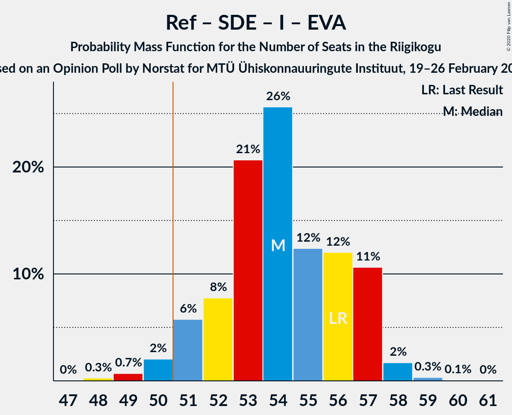
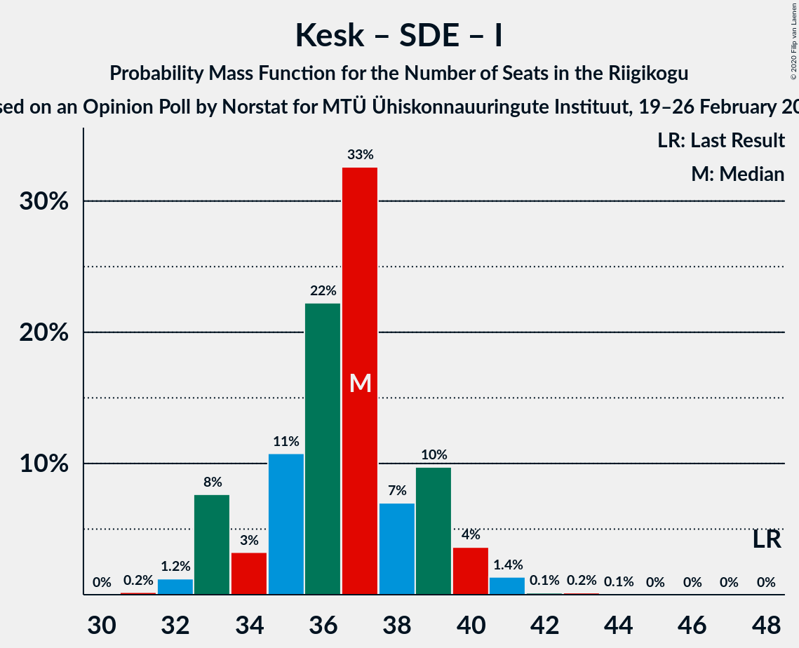

# Opinion Poll by Norstat for MTÜ Ühiskonnauuringute Instituut, 19–26 February 2020

<a href="#voting-intentions">Voting Intentions</a> | <a href="#seats">Seats</a> | <a href="#coalitions">Coalitions</a> | <a href="#technical-information">Technical Information</a>

## Voting Intentions

### Confidence Intervals

| Party | Last Result | Poll Result | 80% Confidence Interval | 90% Confidence Interval | 95% Confidence Interval | 99% Confidence Interval |
|:-----:|:-----------:|:-----------:|:-----------------------:|:-----------------------:|:-----------------------:|:-----------------------:|
| Eesti Reformierakond | 28.9% | 33.2% | 31.3–35.1% |30.8–35.7% |30.3–36.2% |29.5–37.1% |
| Eesti Keskerakond | 23.1% | 19.3% | 17.8–21.0% |17.3–21.5% |17.0–21.9% |16.3–22.7% |
| Eesti Konservatiivne Rahvaerakond | 17.8% | 18.4% | 16.9–20.1% |16.5–20.5% |16.1–20.9% |15.4–21.7% |
| Sotsiaaldemokraatlik Erakond | 9.8% | 10.2% | 9.1–11.5% |8.7–11.9% |8.5–12.2% |8.0–12.9% |
| Eesti 200 | 4.4% | 7.5% | 6.5–8.7% |6.2–9.0% |6.0–9.3% |5.6–9.9% |
| Erakond Isamaa | 11.4% | 6.9% | 6.0–8.0% |5.7–8.4% |5.5–8.6% |5.1–9.2% |
| Erakond Eestimaa Rohelised | 1.8% | 2.1% | 1.6–2.8% |1.5–3.0% |1.4–3.2% |1.2–3.6% |
| Eesti Vabaerakond | 1.2% | 0.5% | 0.3–0.9% |0.3–1.1% |0.2–1.2% |0.2–1.4% |

*Note:* The poll result column reflects the actual value used in the calculations. Published results may vary slightly, and in addition be rounded to fewer digits.

## Seats

### Confidence Intervals

| Party | Last Result | Median | 80% Confidence Interval | 90% Confidence Interval | 95% Confidence Interval | 99% Confidence Interval |
|:-----:|:-----------:|:------:|:-----------------------:|:-----------------------:|:-----------------------:|:-----------------------:|
| <a href="#eesti-reformierakond">Eesti Reformierakond</a> | 34 | 38 | 37–39 |35–40 |34–42 |33–43 |
| <a href="#eesti-keskerakond">Eesti Keskerakond</a> | 26 | 21 | 19–22 |18–23 |18–24 |17–25 |
| <a href="#eesti-konservatiivne-rahvaerakond">Eesti Konservatiivne Rahvaerakond</a> | 19 | 19 | 18–21 |17–22 |17–22 |16–23 |
| <a href="#sotsiaaldemokraatlik-erakond">Sotsiaaldemokraatlik Erakond</a> | 10 | 10 | 8–11 |8–12 |8–12 |7–13 |
| <a href="#eesti-200">Eesti 200</a> | 0 | 7 | 6–8 |5–9 |5–9 |5–9 |
| <a href="#erakond-isamaa">Erakond Isamaa</a> | 12 | 6 | 5–7 |5–8 |5–8 |0–9 |
| <a href="#erakond-eestimaa-rohelised">Erakond Eestimaa Rohelised</a> | 0 | 0 | 0 |0 |0 |0 |
| <a href="#eesti-vabaerakond">Eesti Vabaerakond</a> | 0 | 0 | 0 |0 |0 |0 |

### Eesti Reformierakond

*For a full overview of the results for this party, see the [Eesti Reformierakond](party-eestireformierakond.html) page.*

| Number of Seats | Probability | Accumulated | Special Marks |
|:---------------:|:-----------:|:-----------:|:-------------:|
| 33 | 0.9% | 100% |  |
| 34 | 4% | 99.1% | Last Result |
| 35 | 4% | 95% |  |
| 36 | 1.5% | 92% |  |
| 37 | 9% | 90% |  |
| 38 | 42% | 81% | Median |
| 39 | 30% | 38% |  |
| 40 | 5% | 9% |  |
| 41 | 0.8% | 4% |  |
| 42 | 3% | 4% |  |
| 43 | 0.6% | 0.8% |  |
| 44 | 0.1% | 0.2% |  |
| 45 | 0% | 0% |  |

### Eesti Keskerakond

*For a full overview of the results for this party, see the [Eesti Keskerakond](party-eestikeskerakond.html) page.*

| Number of Seats | Probability | Accumulated | Special Marks |
|:---------------:|:-----------:|:-----------:|:-------------:|
| 16 | 0.2% | 100% |  |
| 17 | 2% | 99.8% |  |
| 18 | 6% | 98% |  |
| 19 | 18% | 92% |  |
| 20 | 14% | 74% |  |
| 21 | 39% | 60% | Median |
| 22 | 13% | 21% |  |
| 23 | 5% | 8% |  |
| 24 | 3% | 3% |  |
| 25 | 0.4% | 0.5% |  |
| 26 | 0.1% | 0.1% | Last Result |
| 27 | 0% | 0% |  |

### Eesti Konservatiivne Rahvaerakond

*For a full overview of the results for this party, see the [Eesti Konservatiivne Rahvaerakond](party-eestikonservatiivnerahvaerakond.html) page.*

| Number of Seats | Probability | Accumulated | Special Marks |
|:---------------:|:-----------:|:-----------:|:-------------:|
| 15 | 0.2% | 100% |  |
| 16 | 1.4% | 99.8% |  |
| 17 | 5% | 98% |  |
| 18 | 18% | 93% |  |
| 19 | 30% | 75% | Last Result, Median |
| 20 | 20% | 45% |  |
| 21 | 17% | 25% |  |
| 22 | 6% | 8% |  |
| 23 | 1.4% | 2% |  |
| 24 | 0.2% | 0.3% |  |
| 25 | 0.1% | 0.1% |  |
| 26 | 0% | 0% |  |

### Sotsiaaldemokraatlik Erakond

*For a full overview of the results for this party, see the [Sotsiaaldemokraatlik Erakond](party-sotsiaaldemokraatlikerakond.html) page.*

| Number of Seats | Probability | Accumulated | Special Marks |
|:---------------:|:-----------:|:-----------:|:-------------:|
| 7 | 0.6% | 100% |  |
| 8 | 14% | 99.4% |  |
| 9 | 25% | 85% |  |
| 10 | 36% | 61% | Last Result, Median |
| 11 | 17% | 25% |  |
| 12 | 7% | 8% |  |
| 13 | 1.1% | 1.2% |  |
| 14 | 0.1% | 0.1% |  |
| 15 | 0% | 0% |  |

### Eesti 200

*For a full overview of the results for this party, see the [Eesti 200](party-eesti200.html) page.*

| Number of Seats | Probability | Accumulated | Special Marks |
|:---------------:|:-----------:|:-----------:|:-------------:|
| 0 | 0% | 100% | Last Result |
| 1 | 0% | 100% |  |
| 2 | 0% | 100% |  |
| 3 | 0% | 100% |  |
| 4 | 0% | 100% |  |
| 5 | 9% | 99.9% |  |
| 6 | 33% | 91% |  |
| 7 | 25% | 58% | Median |
| 8 | 27% | 33% |  |
| 9 | 6% | 6% |  |
| 10 | 0.2% | 0.2% |  |
| 11 | 0% | 0% |  |

### Erakond Isamaa

*For a full overview of the results for this party, see the [Erakond Isamaa](party-erakondisamaa.html) page.*

| Number of Seats | Probability | Accumulated | Special Marks |
|:---------------:|:-----------:|:-----------:|:-------------:|
| 0 | 0.8% | 100% |  |
| 1 | 0% | 99.2% |  |
| 2 | 0% | 99.2% |  |
| 3 | 0% | 99.2% |  |
| 4 | 2% | 99.2% |  |
| 5 | 18% | 98% |  |
| 6 | 43% | 80% | Median |
| 7 | 30% | 36% |  |
| 8 | 5% | 6% |  |
| 9 | 1.0% | 1.1% |  |
| 10 | 0% | 0% |  |
| 11 | 0% | 0% |  |
| 12 | 0% | 0% | Last Result |

### Erakond Eestimaa Rohelised

*For a full overview of the results for this party, see the [Erakond Eestimaa Rohelised](party-erakondeestimaarohelised.html) page.*

| Number of Seats | Probability | Accumulated | Special Marks |
|:---------------:|:-----------:|:-----------:|:-------------:|
| 0 | 100% | 100% | Last Result, Median |

### Eesti Vabaerakond

*For a full overview of the results for this party, see the [Eesti Vabaerakond](party-eestivabaerakond.html) page.*

| Number of Seats | Probability | Accumulated | Special Marks |
|:---------------:|:-----------:|:-----------:|:-------------:|
| 0 | 100% | 100% | Last Result, Median |

## Coalitions

### Confidence Intervals

| Coalition | Last Result | Median | Majority? | 80% Confidence Interval | 90% Confidence Interval | 95% Confidence Interval | 99% Confidence Interval |
|:---------:|:-----------:|:------:|:---------:|:-----------------------:|:-----------------------:|:-----------------------:|:-----------------------:|
| Eesti Reformierakond – Eesti Keskerakond – Eesti Konservatiivne Rahvaerakond | 79 | 78 | 100% | 76–80 | 76–81 | 75–82 | 73–83 |
| Eesti Reformierakond – Eesti Konservatiivne Rahvaerakond – Erakond Isamaa | 65 | 64 | 100% | 62–66 | 61–67 | 60–67 | 59–68 |
| Eesti Reformierakond – Eesti Keskerakond | 60 | 59 | 100% | 57–60 | 55–61 | 55–62 | 54–63 |
| Eesti Reformierakond – Eesti Konservatiivne Rahvaerakond | 53 | 57 | 100% | 55–60 | 55–61 | 54–61 | 52–62 |
| Eesti Reformierakond – Sotsiaaldemokraatlik Erakond – Erakond Isamaa – Eesti Vabaerakond | 56 | 54 | 97% | 52–57 | 51–57 | 50–57 | 49–58 |
| Eesti Reformierakond – Sotsiaaldemokraatlik Erakond – Erakond Isamaa | 56 | 54 | 97% | 52–57 | 51–57 | 50–57 | 49–58 |
| Eesti Reformierakond – Sotsiaaldemokraatlik Erakond | 44 | 48 | 8% | 46–50 | 45–51 | 44–51 | 43–52 |
| Eesti Keskerakond – Eesti Konservatiivne Rahvaerakond – Erakond Isamaa | 57 | 46 | 1.2% | 44–48 | 43–49 | 43–50 | 41–51 |
| Eesti Reformierakond – Erakond Isamaa | 46 | 44 | 0% | 42–46 | 41–47 | 40–48 | 39–49 |
| Eesti Keskerakond – Eesti Konservatiivne Rahvaerakond | 45 | 40 | 0% | 38–42 | 37–43 | 36–44 | 36–45 |
| Eesti Keskerakond – Sotsiaaldemokraatlik Erakond – Erakond Isamaa | 48 | 37 | 0% | 34–39 | 33–40 | 33–40 | 32–41 |
| Eesti Keskerakond – Sotsiaaldemokraatlik Erakond | 36 | 31 | 0% | 28–33 | 28–33 | 27–33 | 26–35 |
| Eesti Konservatiivne Rahvaerakond – Sotsiaaldemokraatlik Erakond | 29 | 29 | 0% | 27–31 | 26–32 | 26–33 | 25–34 |

### Eesti Reformierakond – Eesti Keskerakond – Eesti Konservatiivne Rahvaerakond

| Number of Seats | Probability | Accumulated | Special Marks |
|:---------------:|:-----------:|:-----------:|:-------------:|
| 72 | 0.1% | 100% |  |
| 73 | 0.5% | 99.9% |  |
| 74 | 2% | 99.4% |  |
| 75 | 3% | 98% |  |
| 76 | 11% | 95% |  |
| 77 | 12% | 84% |  |
| 78 | 36% | 72% | Median |
| 79 | 16% | 36% | Last Result |
| 80 | 13% | 20% |  |
| 81 | 3% | 7% |  |
| 82 | 3% | 3% |  |
| 83 | 0.6% | 0.6% |  |
| 84 | 0% | 0.1% |  |
| 85 | 0% | 0% |  |

### Eesti Reformierakond – Eesti Konservatiivne Rahvaerakond – Erakond Isamaa

| Number of Seats | Probability | Accumulated | Special Marks |
|:---------------:|:-----------:|:-----------:|:-------------:|
| 57 | 0.1% | 100% |  |
| 58 | 0.1% | 99.9% |  |
| 59 | 0.8% | 99.8% |  |
| 60 | 2% | 99.0% |  |
| 61 | 6% | 97% |  |
| 62 | 14% | 91% |  |
| 63 | 24% | 77% | Median |
| 64 | 21% | 53% |  |
| 65 | 16% | 33% | Last Result |
| 66 | 9% | 16% |  |
| 67 | 5% | 7% |  |
| 68 | 2% | 2% |  |
| 69 | 0.1% | 0.1% |  |
| 70 | 0% | 0% |  |

### Eesti Reformierakond – Eesti Keskerakond

| Number of Seats | Probability | Accumulated | Special Marks |
|:---------------:|:-----------:|:-----------:|:-------------:|
| 52 | 0.1% | 100% |  |
| 53 | 0.2% | 99.9% |  |
| 54 | 2% | 99.8% |  |
| 55 | 3% | 98% |  |
| 56 | 4% | 95% |  |
| 57 | 7% | 90% |  |
| 58 | 21% | 83% |  |
| 59 | 38% | 62% | Median |
| 60 | 15% | 25% | Last Result |
| 61 | 5% | 9% |  |
| 62 | 2% | 4% |  |
| 63 | 2% | 2% |  |
| 64 | 0.1% | 0.2% |  |
| 65 | 0.1% | 0.1% |  |
| 66 | 0% | 0% |  |

### Eesti Reformierakond – Eesti Konservatiivne Rahvaerakond

| Number of Seats | Probability | Accumulated | Special Marks |
|:---------------:|:-----------:|:-----------:|:-------------:|
| 51 | 0.1% | 100% | Majority |
| 52 | 0.6% | 99.8% |  |
| 53 | 1.0% | 99.2% | Last Result |
| 54 | 3% | 98% |  |
| 55 | 6% | 95% |  |
| 56 | 14% | 89% |  |
| 57 | 30% | 75% | Median |
| 58 | 12% | 45% |  |
| 59 | 15% | 33% |  |
| 60 | 13% | 18% |  |
| 61 | 5% | 5% |  |
| 62 | 0.4% | 0.6% |  |
| 63 | 0.1% | 0.2% |  |
| 64 | 0% | 0% |  |

### Eesti Reformierakond – Sotsiaaldemokraatlik Erakond – Erakond Isamaa – Eesti Vabaerakond

| Number of Seats | Probability | Accumulated | Special Marks |
|:---------------:|:-----------:|:-----------:|:-------------:|
| 48 | 0.3% | 100% |  |
| 49 | 0.7% | 99.7% |  |
| 50 | 2% | 99.0% |  |
| 51 | 6% | 97% | Majority |
| 52 | 8% | 91% |  |
| 53 | 21% | 83% |  |
| 54 | 26% | 63% | Median |
| 55 | 12% | 37% |  |
| 56 | 12% | 25% | Last Result |
| 57 | 11% | 13% |  |
| 58 | 2% | 2% |  |
| 59 | 0.3% | 0.4% |  |
| 60 | 0.1% | 0.1% |  |
| 61 | 0% | 0% |  |

### Eesti Reformierakond – Sotsiaaldemokraatlik Erakond – Erakond Isamaa

| Number of Seats | Probability | Accumulated | Special Marks |
|:---------------:|:-----------:|:-----------:|:-------------:|
| 48 | 0.3% | 100% |  |
| 49 | 0.7% | 99.7% |  |
| 50 | 2% | 99.0% |  |
| 51 | 6% | 97% | Majority |
| 52 | 8% | 91% |  |
| 53 | 21% | 83% |  |
| 54 | 26% | 63% | Median |
| 55 | 12% | 37% |  |
| 56 | 12% | 25% | Last Result |
| 57 | 11% | 13% |  |
| 58 | 2% | 2% |  |
| 59 | 0.3% | 0.4% |  |
| 60 | 0.1% | 0.1% |  |
| 61 | 0% | 0% |  |

### Eesti Reformierakond – Sotsiaaldemokraatlik Erakond

| Number of Seats | Probability | Accumulated | Special Marks |
|:---------------:|:-----------:|:-----------:|:-------------:|
| 41 | 0.1% | 100% |  |
| 42 | 0.2% | 99.9% |  |
| 43 | 0.9% | 99.7% |  |
| 44 | 3% | 98.8% | Last Result |
| 45 | 3% | 96% |  |
| 46 | 16% | 93% |  |
| 47 | 11% | 77% |  |
| 48 | 34% | 66% | Median |
| 49 | 12% | 32% |  |
| 50 | 12% | 20% |  |
| 51 | 5% | 8% | Majority |
| 52 | 2% | 2% |  |
| 53 | 0.2% | 0.3% |  |
| 54 | 0.1% | 0.1% |  |
| 55 | 0% | 0.1% |  |
| 56 | 0% | 0% |  |

### Eesti Keskerakond – Eesti Konservatiivne Rahvaerakond – Erakond Isamaa

| Number of Seats | Probability | Accumulated | Special Marks |
|:---------------:|:-----------:|:-----------:|:-------------:|
| 39 | 0.1% | 100% |  |
| 40 | 0.1% | 99.9% |  |
| 41 | 0.3% | 99.8% |  |
| 42 | 1.1% | 99.5% |  |
| 43 | 8% | 98% |  |
| 44 | 5% | 91% |  |
| 45 | 18% | 86% |  |
| 46 | 26% | 68% | Median |
| 47 | 19% | 41% |  |
| 48 | 13% | 22% |  |
| 49 | 7% | 9% |  |
| 50 | 1.4% | 3% |  |
| 51 | 0.9% | 1.2% | Majority |
| 52 | 0.2% | 0.3% |  |
| 53 | 0.1% | 0.1% |  |
| 54 | 0% | 0% |  |
| 55 | 0% | 0% |  |
| 56 | 0% | 0% |  |
| 57 | 0% | 0% | Last Result |

### Eesti Reformierakond – Erakond Isamaa

| Number of Seats | Probability | Accumulated | Special Marks |
|:---------------:|:-----------:|:-----------:|:-------------:|
| 38 | 0.2% | 100% |  |
| 39 | 0.5% | 99.8% |  |
| 40 | 3% | 99.3% |  |
| 41 | 3% | 97% |  |
| 42 | 5% | 93% |  |
| 43 | 13% | 89% |  |
| 44 | 33% | 76% | Median |
| 45 | 21% | 43% |  |
| 46 | 13% | 22% | Last Result |
| 47 | 6% | 9% |  |
| 48 | 2% | 3% |  |
| 49 | 0.6% | 0.8% |  |
| 50 | 0.2% | 0.2% |  |
| 51 | 0% | 0% | Majority |

### Eesti Keskerakond – Eesti Konservatiivne Rahvaerakond

| Number of Seats | Probability | Accumulated | Special Marks |
|:---------------:|:-----------:|:-----------:|:-------------:|
| 34 | 0.1% | 100% |  |
| 35 | 0.2% | 99.9% |  |
| 36 | 2% | 99.7% |  |
| 37 | 5% | 97% |  |
| 38 | 7% | 92% |  |
| 39 | 22% | 85% |  |
| 40 | 30% | 62% | Median |
| 41 | 14% | 32% |  |
| 42 | 9% | 18% |  |
| 43 | 4% | 9% |  |
| 44 | 4% | 5% |  |
| 45 | 0.3% | 0.7% | Last Result |
| 46 | 0.3% | 0.4% |  |
| 47 | 0% | 0% |  |

### Eesti Keskerakond – Sotsiaaldemokraatlik Erakond – Erakond Isamaa

| Number of Seats | Probability | Accumulated | Special Marks |
|:---------------:|:-----------:|:-----------:|:-------------:|
| 31 | 0.2% | 100% |  |
| 32 | 1.2% | 99.8% |  |
| 33 | 8% | 98.6% |  |
| 34 | 3% | 91% |  |
| 35 | 11% | 88% |  |
| 36 | 22% | 77% |  |
| 37 | 33% | 55% | Median |
| 38 | 7% | 22% |  |
| 39 | 10% | 15% |  |
| 40 | 4% | 5% |  |
| 41 | 1.4% | 2% |  |
| 42 | 0.1% | 0.3% |  |
| 43 | 0.2% | 0.2% |  |
| 44 | 0.1% | 0.1% |  |
| 45 | 0% | 0% |  |
| 46 | 0% | 0% |  |
| 47 | 0% | 0% |  |
| 48 | 0% | 0% | Last Result |

### Eesti Keskerakond – Sotsiaaldemokraatlik Erakond

| Number of Seats | Probability | Accumulated | Special Marks |
|:---------------:|:-----------:|:-----------:|:-------------:|
| 25 | 0.1% | 100% |  |
| 26 | 0.6% | 99.9% |  |
| 27 | 3% | 99.3% |  |
| 28 | 12% | 96% |  |
| 29 | 14% | 84% |  |
| 30 | 16% | 69% |  |
| 31 | 35% | 54% | Median |
| 32 | 8% | 19% |  |
| 33 | 8% | 10% |  |
| 34 | 1.0% | 2% |  |
| 35 | 1.3% | 1.5% |  |
| 36 | 0.1% | 0.2% | Last Result |
| 37 | 0% | 0% |  |

### Eesti Konservatiivne Rahvaerakond – Sotsiaaldemokraatlik Erakond

| Number of Seats | Probability | Accumulated | Special Marks |
|:---------------:|:-----------:|:-----------:|:-------------:|
| 24 | 0.1% | 100% |  |
| 25 | 0.5% | 99.9% |  |
| 26 | 5% | 99.3% |  |
| 27 | 11% | 95% |  |
| 28 | 14% | 84% |  |
| 29 | 22% | 70% | Last Result, Median |
| 30 | 30% | 48% |  |
| 31 | 12% | 18% |  |
| 32 | 3% | 6% |  |
| 33 | 2% | 3% |  |
| 34 | 0.9% | 1.0% |  |
| 35 | 0.1% | 0.1% |  |
| 36 | 0% | 0% |  |

## Technical Information

### Opinion Poll

+ **Polling firm:** Norstat
+ **Commissioner(s):** MTÜ Ühiskonnauuringute Instituut
+ **Fieldwork period:** 19–26 February 2020

### Calculations

+ **Sample size:** 1000
+ **Simulations done:** 131,072
+ **Error estimate:** 1.20%

