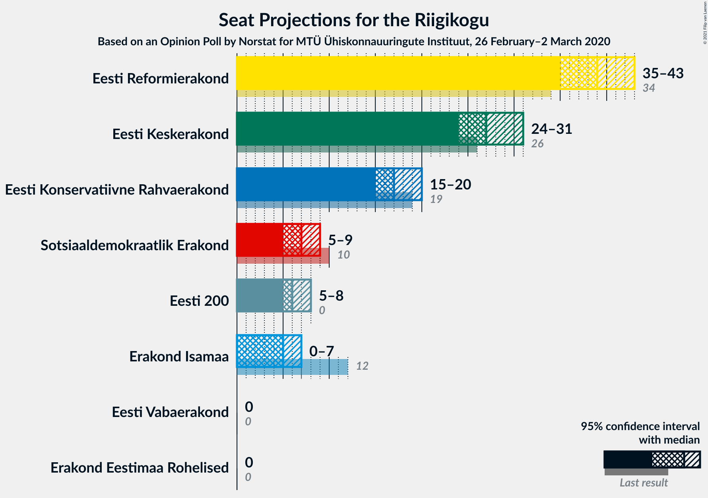
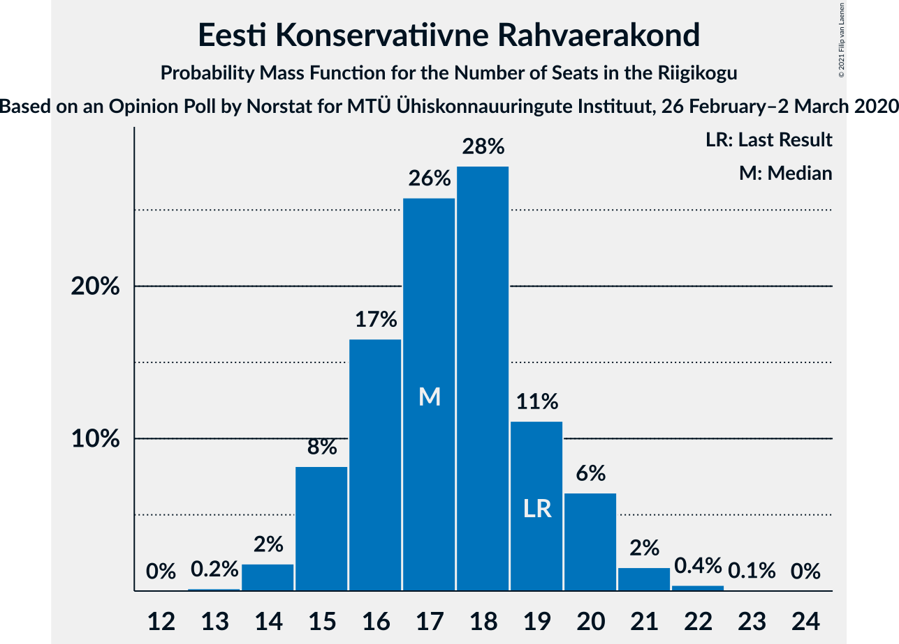
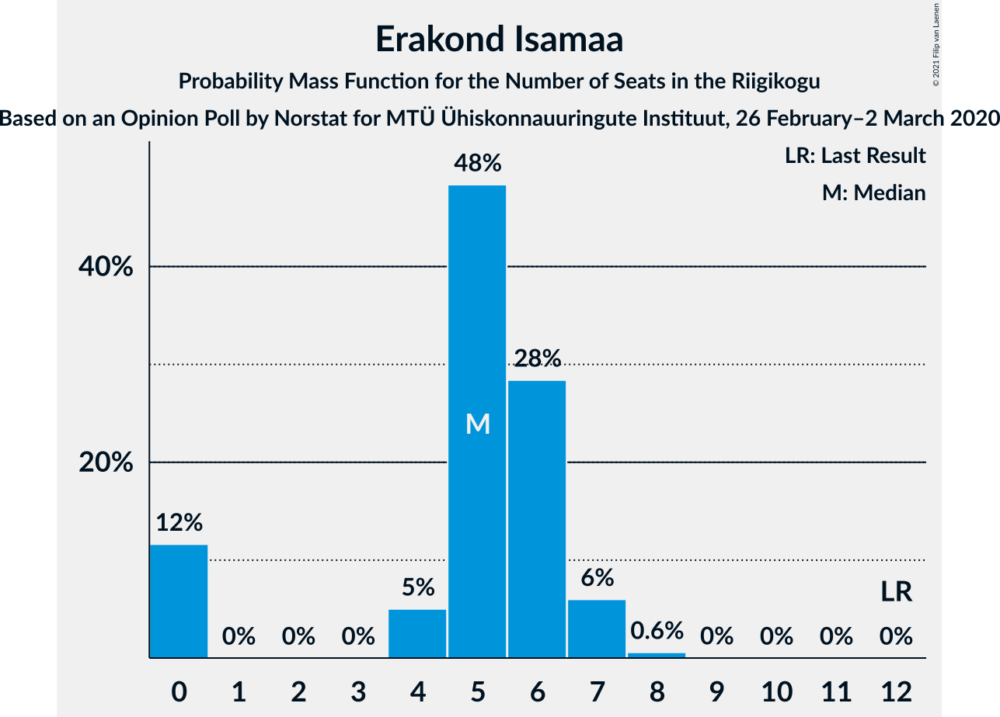
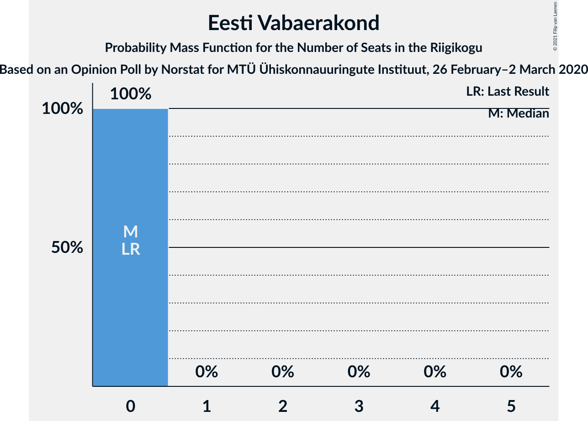

# Opinion Poll by Norstat for MTÜ Ühiskonnauuringute Instituut, 26 February–2 March 2020

<a href="#voting-intentions">Voting Intentions</a> | <a href="#seats">Seats</a> | <a href="#coalitions">Coalitions</a> | <a href="#technical-information">Technical Information</a>

## Voting Intentions

### Confidence Intervals

| Party | Last Result | Poll Result | 80% Confidence Interval | 90% Confidence Interval | 95% Confidence Interval | 99% Confidence Interval |
|:-----:|:-----------:|:-----------:|:-----------------------:|:-----------------------:|:-----------------------:|:-----------------------:|
| Eesti Reformierakond | 28.9% | 33.2% | 31.3–35.1% |30.8–35.7% |30.3–36.2% |29.5–37.1% |
| Eesti Keskerakond | 23.1% | 24.2% | 22.5–26.0% |22.1–26.5% |21.6–27.0% |20.9–27.8% |
| Eesti Konservatiivne Rahvaerakond | 17.8% | 16.3% | 14.9–17.9% |14.5–18.3% |14.1–18.7% |13.5–19.5% |
| Sotsiaaldemokraatlik Erakond | 9.8% | 7.0% | 6.1–8.2% |5.8–8.5% |5.6–8.8% |5.2–9.3% |
| Eesti 200 | 4.4% | 6.6% | 5.7–7.7% |5.4–8.0% |5.2–8.3% |4.8–8.9% |
| Erakond Isamaa | 11.4% | 5.8% | 5.0–6.9% |4.7–7.2% |4.5–7.4% |4.1–8.0% |
| Erakond Eestimaa Rohelised | 1.8% | 2.5% | 2.0–3.3% |1.8–3.5% |1.7–3.7% |1.5–4.1% |
| Eesti Vabaerakond | 1.2% | 0.7% | 0.5–1.2% |0.4–1.3% |0.3–1.4% |0.2–1.7% |

*Note:* The poll result column reflects the actual value used in the calculations. Published results may vary slightly, and in addition be rounded to fewer digits.

## Seats

### Confidence Intervals

| Party | Last Result | Median | 80% Confidence Interval | 90% Confidence Interval | 95% Confidence Interval | 99% Confidence Interval |
|:-----:|:-----------:|:------:|:-----------------------:|:-----------------------:|:-----------------------:|:-----------------------:|
| <a href="#eesti-reformierakond">Eesti Reformierakond</a> | 34 | 38 | 36–41 |35–43 |35–43 |34–44 |
| <a href="#eesti-keskerakond">Eesti Keskerakond</a> | 26 | 27 | 25–29 |25–30 |24–31 |23–32 |
| <a href="#eesti-konservatiivne-rahvaerakond">Eesti Konservatiivne Rahvaerakond</a> | 19 | 17 | 15–19 |15–20 |15–20 |14–21 |
| <a href="#sotsiaaldemokraatlik-erakond">Sotsiaaldemokraatlik Erakond</a> | 10 | 7 | 6–8 |5–8 |5–8 |4–9 |
| <a href="#eesti-200">Eesti 200</a> | 0 | 6 | 5–7 |5–8 |5–8 |0–9 |
| <a href="#erakond-isamaa">Erakond Isamaa</a> | 12 | 6 | 4–6 |0–7 |0–7 |0–8 |
| <a href="#erakond-eestimaa-rohelised">Erakond Eestimaa Rohelised</a> | 0 | 0 | 0 |0 |0 |0 |
| <a href="#eesti-vabaerakond">Eesti Vabaerakond</a> | 0 | 0 | 0 |0 |0 |0 |

### Eesti Reformierakond

*For a full overview of the results for this party, see the [Eesti Reformierakond](party-eestireformierakond.html) page.*

| Number of Seats | Probability | Accumulated | Special Marks |
|:---------------:|:-----------:|:-----------:|:-------------:|
| 33 | 0.4% | 100% |  |
| 34 | 2% | 99.6% | Last Result |
| 35 | 4% | 98% |  |
| 36 | 21% | 94% |  |
| 37 | 10% | 73% |  |
| 38 | 17% | 63% | Median |
| 39 | 11% | 46% |  |
| 40 | 15% | 35% |  |
| 41 | 10% | 20% |  |
| 42 | 4% | 10% |  |
| 43 | 4% | 6% |  |
| 44 | 1.0% | 1.3% |  |
| 45 | 0.1% | 0.3% |  |
| 46 | 0.1% | 0.2% |  |
| 47 | 0% | 0% |  |

### Eesti Keskerakond

*For a full overview of the results for this party, see the [Eesti Keskerakond](party-eestikeskerakond.html) page.*

| Number of Seats | Probability | Accumulated | Special Marks |
|:---------------:|:-----------:|:-----------:|:-------------:|
| 22 | 0.4% | 100% |  |
| 23 | 0.6% | 99.6% |  |
| 24 | 3% | 98.9% |  |
| 25 | 15% | 96% |  |
| 26 | 18% | 81% | Last Result |
| 27 | 16% | 63% | Median |
| 28 | 13% | 47% |  |
| 29 | 24% | 34% |  |
| 30 | 7% | 10% |  |
| 31 | 2% | 3% |  |
| 32 | 0.7% | 0.9% |  |
| 33 | 0.1% | 0.2% |  |
| 34 | 0.1% | 0.1% |  |
| 35 | 0% | 0% |  |

### Eesti Konservatiivne Rahvaerakond

*For a full overview of the results for this party, see the [Eesti Konservatiivne Rahvaerakond](party-eestikonservatiivnerahvaerakond.html) page.*

| Number of Seats | Probability | Accumulated | Special Marks |
|:---------------:|:-----------:|:-----------:|:-------------:|
| 13 | 0.1% | 100% |  |
| 14 | 2% | 99.9% |  |
| 15 | 12% | 98% |  |
| 16 | 11% | 86% |  |
| 17 | 37% | 75% | Median |
| 18 | 23% | 38% |  |
| 19 | 8% | 15% | Last Result |
| 20 | 6% | 7% |  |
| 21 | 1.4% | 2% |  |
| 22 | 0.3% | 0.3% |  |
| 23 | 0.1% | 0.1% |  |
| 24 | 0% | 0% |  |

### Sotsiaaldemokraatlik Erakond

*For a full overview of the results for this party, see the [Sotsiaaldemokraatlik Erakond](party-sotsiaaldemokraatlikerakond.html) page.*

| Number of Seats | Probability | Accumulated | Special Marks |
|:---------------:|:-----------:|:-----------:|:-------------:|
| 0 | 0.3% | 100% |  |
| 1 | 0% | 99.7% |  |
| 2 | 0% | 99.7% |  |
| 3 | 0% | 99.7% |  |
| 4 | 0.5% | 99.7% |  |
| 5 | 6% | 99.3% |  |
| 6 | 28% | 93% |  |
| 7 | 49% | 65% | Median |
| 8 | 15% | 16% |  |
| 9 | 2% | 2% |  |
| 10 | 0.1% | 0.1% | Last Result |
| 11 | 0% | 0% |  |

### Eesti 200

*For a full overview of the results for this party, see the [Eesti 200](party-eesti200.html) page.*

| Number of Seats | Probability | Accumulated | Special Marks |
|:---------------:|:-----------:|:-----------:|:-------------:|
| 0 | 2% | 100% | Last Result |
| 1 | 0% | 98% |  |
| 2 | 0% | 98% |  |
| 3 | 0% | 98% |  |
| 4 | 0.8% | 98% |  |
| 5 | 20% | 98% |  |
| 6 | 45% | 78% | Median |
| 7 | 27% | 33% |  |
| 8 | 5% | 5% |  |
| 9 | 0.9% | 0.9% |  |
| 10 | 0% | 0% |  |

### Erakond Isamaa

*For a full overview of the results for this party, see the [Erakond Isamaa](party-erakondisamaa.html) page.*

| Number of Seats | Probability | Accumulated | Special Marks |
|:---------------:|:-----------:|:-----------:|:-------------:|
| 0 | 9% | 100% |  |
| 1 | 0% | 91% |  |
| 2 | 0% | 91% |  |
| 3 | 0% | 91% |  |
| 4 | 3% | 91% |  |
| 5 | 37% | 88% |  |
| 6 | 43% | 51% | Median |
| 7 | 6% | 7% |  |
| 8 | 0.8% | 0.8% |  |
| 9 | 0% | 0% |  |
| 10 | 0% | 0% |  |
| 11 | 0% | 0% |  |
| 12 | 0% | 0% | Last Result |

### Erakond Eestimaa Rohelised

*For a full overview of the results for this party, see the [Erakond Eestimaa Rohelised](party-erakondeestimaarohelised.html) page.*

| Number of Seats | Probability | Accumulated | Special Marks |
|:---------------:|:-----------:|:-----------:|:-------------:|
| 0 | 100% | 100% | Last Result, Median |

### Eesti Vabaerakond

*For a full overview of the results for this party, see the [Eesti Vabaerakond](party-eestivabaerakond.html) page.*

| Number of Seats | Probability | Accumulated | Special Marks |
|:---------------:|:-----------:|:-----------:|:-------------:|
| 0 | 100% | 100% | Last Result, Median |

## Coalitions

### Confidence Intervals

| Coalition | Last Result | Median | Majority? | 80% Confidence Interval | 90% Confidence Interval | 95% Confidence Interval | 99% Confidence Interval |
|:---------:|:-----------:|:------:|:---------:|:-----------------------:|:-----------------------:|:-----------------------:|:-----------------------:|
| Eesti Reformierakond – Eesti Keskerakond – Eesti Konservatiivne Rahvaerakond | 79 | 82 | 100% | 81–86 | 80–88 | 80–88 | 78–90 |
| Eesti Reformierakond – Eesti Keskerakond | 60 | 66 | 100% | 63–69 | 62–70 | 62–70 | 60–72 |
| Eesti Reformierakond – Eesti Konservatiivne Rahvaerakond – Erakond Isamaa | 65 | 61 | 100% | 59–64 | 57–64 | 57–65 | 55–67 |
| Eesti Reformierakond – Eesti Konservatiivne Rahvaerakond | 53 | 55 | 99.6% | 53–59 | 53–60 | 52–61 | 51–63 |
| Eesti Reformierakond – Sotsiaaldemokraatlik Erakond – Erakond Isamaa – Eesti Vabaerakond | 56 | 50 | 43% | 48–53 | 47–54 | 46–55 | 44–56 |
| Eesti Reformierakond – Sotsiaaldemokraatlik Erakond – Erakond Isamaa | 56 | 50 | 43% | 48–53 | 47–54 | 46–55 | 44–56 |
| Eesti Keskerakond – Eesti Konservatiivne Rahvaerakond – Erakond Isamaa | 57 | 50 | 41% | 47–52 | 45–53 | 45–53 | 43–55 |
| Eesti Reformierakond – Sotsiaaldemokraatlik Erakond | 44 | 45 | 2% | 43–48 | 42–50 | 41–50 | 40–51 |
| Eesti Keskerakond – Eesti Konservatiivne Rahvaerakond | 45 | 45 | 0.3% | 41–47 | 41–48 | 41–48 | 39–50 |
| Eesti Reformierakond – Erakond Isamaa | 46 | 43 | 0.1% | 41–46 | 40–47 | 39–48 | 37–50 |
| Eesti Keskerakond – Sotsiaaldemokraatlik Erakond – Erakond Isamaa | 48 | 39 | 0% | 36–42 | 34–42 | 34–42 | 31–44 |
| Eesti Keskerakond – Sotsiaaldemokraatlik Erakond | 36 | 34 | 0% | 31–36 | 31–37 | 31–38 | 29–39 |
| Eesti Konservatiivne Rahvaerakond – Sotsiaaldemokraatlik Erakond | 29 | 24 | 0% | 22–26 | 22–27 | 21–27 | 20–29 |

### Eesti Reformierakond – Eesti Keskerakond – Eesti Konservatiivne Rahvaerakond

| Number of Seats | Probability | Accumulated | Special Marks |
|:---------------:|:-----------:|:-----------:|:-------------:|
| 77 | 0.3% | 100% |  |
| 78 | 0.3% | 99.7% |  |
| 79 | 1.1% | 99.4% | Last Result |
| 80 | 5% | 98% |  |
| 81 | 17% | 93% |  |
| 82 | 27% | 76% | Median |
| 83 | 15% | 48% |  |
| 84 | 14% | 34% |  |
| 85 | 8% | 20% |  |
| 86 | 2% | 11% |  |
| 87 | 2% | 9% |  |
| 88 | 5% | 7% |  |
| 89 | 0.7% | 2% |  |
| 90 | 0.8% | 1.0% |  |
| 91 | 0.1% | 0.2% |  |
| 92 | 0% | 0.1% |  |
| 93 | 0% | 0.1% |  |
| 94 | 0% | 0% |  |

### Eesti Reformierakond – Eesti Keskerakond

| Number of Seats | Probability | Accumulated | Special Marks |
|:---------------:|:-----------:|:-----------:|:-------------:|
| 60 | 0.6% | 100% | Last Result |
| 61 | 0.4% | 99.3% |  |
| 62 | 6% | 99.0% |  |
| 63 | 7% | 93% |  |
| 64 | 7% | 86% |  |
| 65 | 28% | 79% | Median |
| 66 | 24% | 52% |  |
| 67 | 5% | 27% |  |
| 68 | 10% | 22% |  |
| 69 | 6% | 11% |  |
| 70 | 3% | 5% |  |
| 71 | 1.1% | 2% |  |
| 72 | 0.5% | 0.9% |  |
| 73 | 0.1% | 0.4% |  |
| 74 | 0.3% | 0.3% |  |
| 75 | 0% | 0% |  |

### Eesti Reformierakond – Eesti Konservatiivne Rahvaerakond – Erakond Isamaa

| Number of Seats | Probability | Accumulated | Special Marks |
|:---------------:|:-----------:|:-----------:|:-------------:|
| 53 | 0.2% | 100% |  |
| 54 | 0.1% | 99.8% |  |
| 55 | 0.4% | 99.8% |  |
| 56 | 1.0% | 99.3% |  |
| 57 | 4% | 98% |  |
| 58 | 3% | 94% |  |
| 59 | 28% | 91% |  |
| 60 | 9% | 63% |  |
| 61 | 22% | 54% | Median |
| 62 | 11% | 33% |  |
| 63 | 9% | 22% |  |
| 64 | 10% | 13% |  |
| 65 | 1.3% | 3% | Last Result |
| 66 | 1.5% | 2% |  |
| 67 | 0.3% | 0.5% |  |
| 68 | 0.1% | 0.3% |  |
| 69 | 0.1% | 0.1% |  |
| 70 | 0% | 0% |  |

### Eesti Reformierakond – Eesti Konservatiivne Rahvaerakond

| Number of Seats | Probability | Accumulated | Special Marks |
|:---------------:|:-----------:|:-----------:|:-------------:|
| 50 | 0.3% | 100% |  |
| 51 | 0.9% | 99.6% | Majority |
| 52 | 2% | 98.7% |  |
| 53 | 23% | 96% | Last Result |
| 54 | 12% | 73% |  |
| 55 | 19% | 61% | Median |
| 56 | 7% | 42% |  |
| 57 | 10% | 35% |  |
| 58 | 6% | 26% |  |
| 59 | 13% | 19% |  |
| 60 | 2% | 7% |  |
| 61 | 4% | 5% |  |
| 62 | 0.3% | 1.0% |  |
| 63 | 0.6% | 0.7% |  |
| 64 | 0% | 0.1% |  |
| 65 | 0.1% | 0.1% |  |
| 66 | 0% | 0% |  |

### Eesti Reformierakond – Sotsiaaldemokraatlik Erakond – Erakond Isamaa – Eesti Vabaerakond

| Number of Seats | Probability | Accumulated | Special Marks |
|:---------------:|:-----------:|:-----------:|:-------------:|
| 43 | 0.3% | 100% |  |
| 44 | 0.3% | 99.7% |  |
| 45 | 1.0% | 99.4% |  |
| 46 | 1.0% | 98% |  |
| 47 | 7% | 97% |  |
| 48 | 5% | 90% |  |
| 49 | 26% | 85% |  |
| 50 | 15% | 59% |  |
| 51 | 14% | 43% | Median, Majority |
| 52 | 15% | 30% |  |
| 53 | 8% | 15% |  |
| 54 | 3% | 6% |  |
| 55 | 0.9% | 3% |  |
| 56 | 2% | 2% | Last Result |
| 57 | 0.1% | 0.2% |  |
| 58 | 0% | 0% |  |

### Eesti Reformierakond – Sotsiaaldemokraatlik Erakond – Erakond Isamaa

| Number of Seats | Probability | Accumulated | Special Marks |
|:---------------:|:-----------:|:-----------:|:-------------:|
| 43 | 0.3% | 100% |  |
| 44 | 0.3% | 99.7% |  |
| 45 | 1.0% | 99.4% |  |
| 46 | 1.0% | 98% |  |
| 47 | 7% | 97% |  |
| 48 | 5% | 90% |  |
| 49 | 26% | 85% |  |
| 50 | 15% | 59% |  |
| 51 | 14% | 43% | Median, Majority |
| 52 | 15% | 30% |  |
| 53 | 8% | 15% |  |
| 54 | 3% | 6% |  |
| 55 | 0.9% | 3% |  |
| 56 | 2% | 2% | Last Result |
| 57 | 0.1% | 0.2% |  |
| 58 | 0% | 0% |  |

### Eesti Keskerakond – Eesti Konservatiivne Rahvaerakond – Erakond Isamaa

| Number of Seats | Probability | Accumulated | Special Marks |
|:---------------:|:-----------:|:-----------:|:-------------:|
| 41 | 0.1% | 100% |  |
| 42 | 0.1% | 99.9% |  |
| 43 | 0.3% | 99.8% |  |
| 44 | 0.5% | 99.4% |  |
| 45 | 4% | 98.9% |  |
| 46 | 4% | 95% |  |
| 47 | 10% | 91% |  |
| 48 | 15% | 81% |  |
| 49 | 13% | 66% |  |
| 50 | 12% | 52% | Median |
| 51 | 11% | 41% | Majority |
| 52 | 25% | 30% |  |
| 53 | 4% | 6% |  |
| 54 | 1.2% | 2% |  |
| 55 | 0.8% | 1.0% |  |
| 56 | 0.2% | 0.3% |  |
| 57 | 0% | 0.1% | Last Result |
| 58 | 0% | 0% |  |

### Eesti Reformierakond – Sotsiaaldemokraatlik Erakond

| Number of Seats | Probability | Accumulated | Special Marks |
|:---------------:|:-----------:|:-----------:|:-------------:|
| 39 | 0.1% | 100% |  |
| 40 | 0.7% | 99.9% |  |
| 41 | 3% | 99.2% |  |
| 42 | 4% | 96% |  |
| 43 | 23% | 92% |  |
| 44 | 11% | 69% | Last Result |
| 45 | 16% | 58% | Median |
| 46 | 8% | 42% |  |
| 47 | 21% | 34% |  |
| 48 | 4% | 12% |  |
| 49 | 2% | 9% |  |
| 50 | 4% | 6% |  |
| 51 | 1.4% | 2% | Majority |
| 52 | 0.2% | 0.3% |  |
| 53 | 0% | 0.1% |  |
| 54 | 0.1% | 0.1% |  |
| 55 | 0% | 0% |  |

### Eesti Keskerakond – Eesti Konservatiivne Rahvaerakond

| Number of Seats | Probability | Accumulated | Special Marks |
|:---------------:|:-----------:|:-----------:|:-------------:|
| 38 | 0.1% | 100% |  |
| 39 | 0.5% | 99.9% |  |
| 40 | 2% | 99.4% |  |
| 41 | 9% | 98% |  |
| 42 | 5% | 88% |  |
| 43 | 18% | 84% |  |
| 44 | 9% | 65% | Median |
| 45 | 17% | 56% | Last Result |
| 46 | 26% | 40% |  |
| 47 | 8% | 14% |  |
| 48 | 4% | 6% |  |
| 49 | 1.0% | 2% |  |
| 50 | 0.7% | 1.0% |  |
| 51 | 0.2% | 0.3% | Majority |
| 52 | 0.1% | 0.1% |  |
| 53 | 0% | 0% |  |

### Eesti Reformierakond – Erakond Isamaa

| Number of Seats | Probability | Accumulated | Special Marks |
|:---------------:|:-----------:|:-----------:|:-------------:|
| 35 | 0.1% | 100% |  |
| 36 | 0.2% | 99.9% |  |
| 37 | 0.3% | 99.7% |  |
| 38 | 0.6% | 99.4% |  |
| 39 | 2% | 98.7% |  |
| 40 | 5% | 97% |  |
| 41 | 5% | 92% |  |
| 42 | 23% | 88% |  |
| 43 | 19% | 64% |  |
| 44 | 11% | 45% | Median |
| 45 | 10% | 34% |  |
| 46 | 17% | 23% | Last Result |
| 47 | 3% | 7% |  |
| 48 | 2% | 3% |  |
| 49 | 0.8% | 1.4% |  |
| 50 | 0.6% | 0.7% |  |
| 51 | 0% | 0.1% | Majority |
| 52 | 0% | 0% |  |

### Eesti Keskerakond – Sotsiaaldemokraatlik Erakond – Erakond Isamaa

| Number of Seats | Probability | Accumulated | Special Marks |
|:---------------:|:-----------:|:-----------:|:-------------:|
| 30 | 0.1% | 100% |  |
| 31 | 0.4% | 99.9% |  |
| 32 | 0.2% | 99.5% |  |
| 33 | 0.6% | 99.3% |  |
| 34 | 4% | 98.7% |  |
| 35 | 1.1% | 95% |  |
| 36 | 12% | 94% |  |
| 37 | 5% | 81% |  |
| 38 | 7% | 76% |  |
| 39 | 26% | 69% |  |
| 40 | 9% | 43% | Median |
| 41 | 9% | 34% |  |
| 42 | 23% | 25% |  |
| 43 | 1.5% | 2% |  |
| 44 | 0.9% | 1.0% |  |
| 45 | 0.1% | 0.1% |  |
| 46 | 0% | 0% |  |
| 47 | 0% | 0% |  |
| 48 | 0% | 0% | Last Result |

### Eesti Keskerakond – Sotsiaaldemokraatlik Erakond

| Number of Seats | Probability | Accumulated | Special Marks |
|:---------------:|:-----------:|:-----------:|:-------------:|
| 26 | 0.1% | 100% |  |
| 27 | 0% | 99.9% |  |
| 28 | 0.3% | 99.9% |  |
| 29 | 0.4% | 99.5% |  |
| 30 | 1.4% | 99.2% |  |
| 31 | 12% | 98% |  |
| 32 | 5% | 86% |  |
| 33 | 22% | 81% |  |
| 34 | 18% | 59% | Median |
| 35 | 9% | 41% |  |
| 36 | 24% | 32% | Last Result |
| 37 | 6% | 8% |  |
| 38 | 2% | 3% |  |
| 39 | 0.5% | 0.7% |  |
| 40 | 0% | 0.2% |  |
| 41 | 0.1% | 0.1% |  |
| 42 | 0% | 0% |  |

### Eesti Konservatiivne Rahvaerakond – Sotsiaaldemokraatlik Erakond

| Number of Seats | Probability | Accumulated | Special Marks |
|:---------------:|:-----------:|:-----------:|:-------------:|
| 17 | 0.1% | 100% |  |
| 18 | 0% | 99.9% |  |
| 19 | 0.2% | 99.9% |  |
| 20 | 1.5% | 99.7% |  |
| 21 | 3% | 98% |  |
| 22 | 15% | 95% |  |
| 23 | 13% | 80% |  |
| 24 | 38% | 67% | Median |
| 25 | 9% | 29% |  |
| 26 | 14% | 19% |  |
| 27 | 4% | 6% |  |
| 28 | 1.2% | 2% |  |
| 29 | 0.6% | 0.7% | Last Result |
| 30 | 0.1% | 0.1% |  |
| 31 | 0% | 0% |  |

## Technical Information

### Opinion Poll

+ **Polling firm:** Norstat
+ **Commissioner(s):** MTÜ Ühiskonnauuringute Instituut
+ **Fieldwork period:** 26 February–2 March 2020

### Calculations

+ **Sample size:** 1000
+ **Simulations done:** 131,072
+ **Error estimate:** 3.23%

