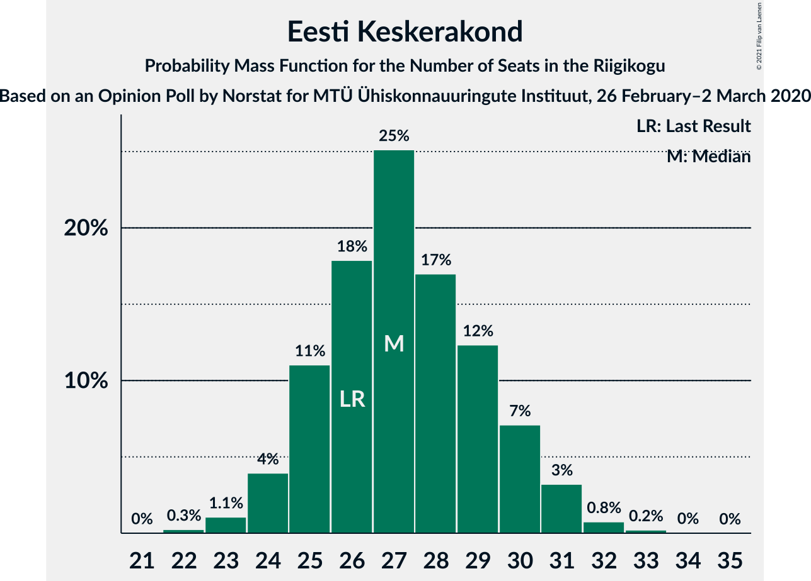
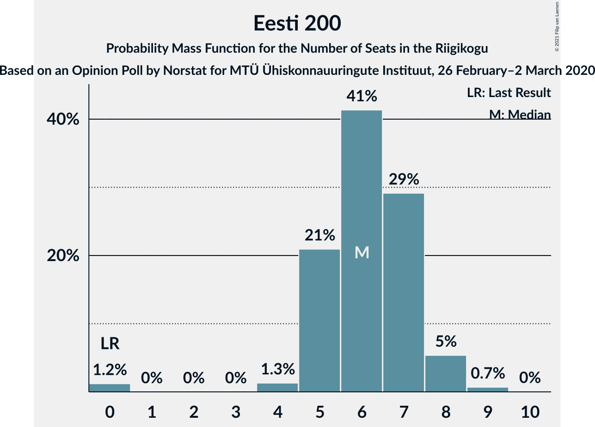
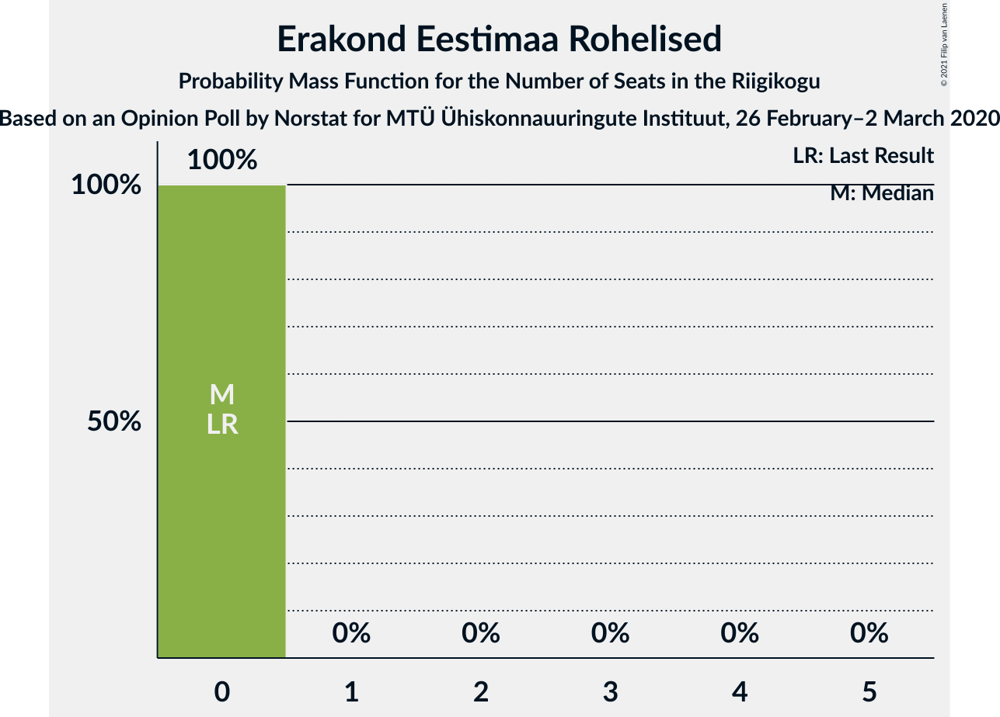
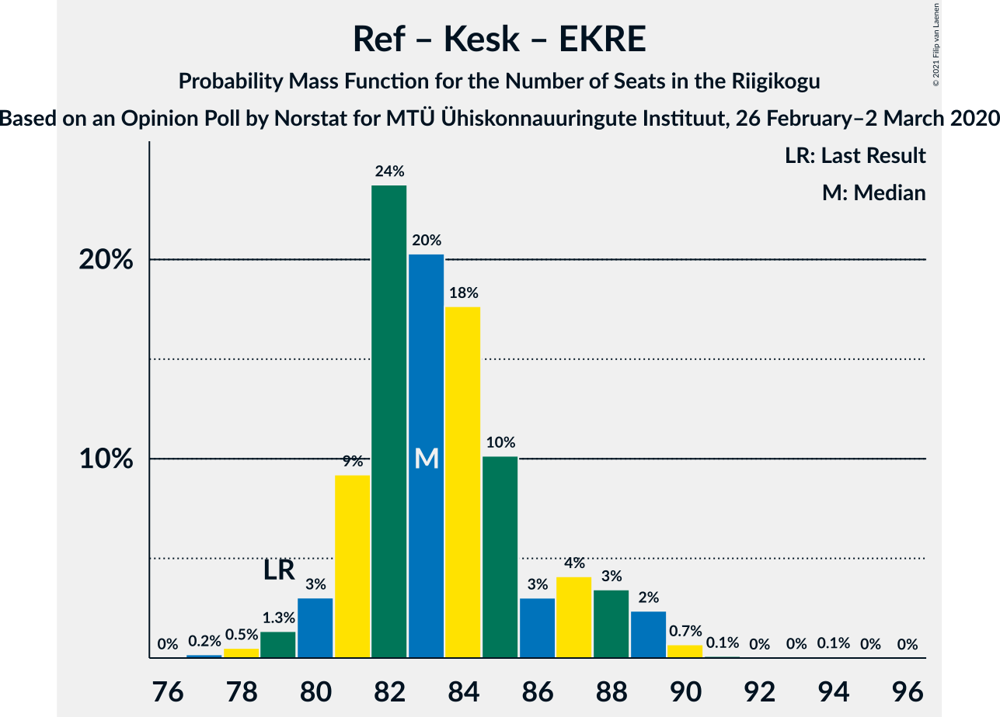

# Opinion Poll by Norstat for MTÜ Ühiskonnauuringute Instituut, 26 February–2 March 2020

<a href="#voting-intentions">Voting Intentions</a> | <a href="#seats">Seats</a> | <a href="#coalitions">Coalitions</a> | <a href="#technical-information">Technical Information</a>

## Voting Intentions

### Confidence Intervals

| Party | Last Result | Poll Result | 80% Confidence Interval | 90% Confidence Interval | 95% Confidence Interval | 99% Confidence Interval |
|:-----:|:-----------:|:-----------:|:-----------------------:|:-----------------------:|:-----------------------:|:-----------------------:|
| Eesti Reformierakond | 28.9% | 33.2% | 31.3–35.1% |30.8–35.7% |30.3–36.2% |29.5–37.1% |
| Eesti Keskerakond | 23.1% | 24.2% | 22.5–26.0% |22.1–26.5% |21.6–27.0% |20.9–27.8% |
| Eesti Konservatiivne Rahvaerakond | 17.8% | 16.3% | 14.9–17.9% |14.5–18.3% |14.1–18.7% |13.5–19.5% |
| Sotsiaaldemokraatlik Erakond | 9.8% | 7.0% | 6.1–8.2% |5.8–8.5% |5.6–8.8% |5.2–9.3% |
| Eesti 200 | 4.4% | 6.6% | 5.7–7.7% |5.4–8.0% |5.2–8.3% |4.8–8.9% |
| Erakond Isamaa | 11.4% | 5.8% | 5.0–6.9% |4.7–7.2% |4.5–7.4% |4.1–8.0% |
| Erakond Eestimaa Rohelised | 1.8% | 2.5% | 2.0–3.3% |1.8–3.5% |1.7–3.7% |1.5–4.1% |
| Eesti Vabaerakond | 1.2% | 0.7% | 0.5–1.2% |0.4–1.3% |0.3–1.4% |0.2–1.7% |

*Note:* The poll result column reflects the actual value used in the calculations. Published results may vary slightly, and in addition be rounded to fewer digits.

## Seats

### Confidence Intervals

| Party | Last Result | Median | 80% Confidence Interval | 90% Confidence Interval | 95% Confidence Interval | 99% Confidence Interval |
|:-----:|:-----------:|:------:|:-----------------------:|:-----------------------:|:-----------------------:|:-----------------------:|
| <a href="#eesti-reformierakond">Eesti Reformierakond</a> | 34 | 39 | 36–41 |36–42 |35–43 |34–45 |
| <a href="#eesti-keskerakond">Eesti Keskerakond</a> | 26 | 27 | 25–30 |24–30 |24–31 |23–32 |
| <a href="#eesti-konservatiivne-rahvaerakond">Eesti Konservatiivne Rahvaerakond</a> | 19 | 17 | 15–19 |15–20 |15–20 |14–21 |
| <a href="#sotsiaaldemokraatlik-erakond">Sotsiaaldemokraatlik Erakond</a> | 10 | 7 | 5–8 |5–8 |5–9 |5–9 |
| <a href="#eesti-200">Eesti 200</a> | 0 | 6 | 5–7 |5–8 |5–8 |0–9 |
| <a href="#erakond-isamaa">Erakond Isamaa</a> | 12 | 5 | 0–6 |0–7 |0–7 |0–8 |
| <a href="#erakond-eestimaa-rohelised">Erakond Eestimaa Rohelised</a> | 0 | 0 | 0 |0 |0 |0 |
| <a href="#eesti-vabaerakond">Eesti Vabaerakond</a> | 0 | 0 | 0 |0 |0 |0 |

### Eesti Reformierakond

*For a full overview of the results for this party, see the [Eesti Reformierakond](party-eestireformierakond.html) page.*

| Number of Seats | Probability | Accumulated | Special Marks |
|:---------------:|:-----------:|:-----------:|:-------------:|
| 33 | 0.2% | 100% |  |
| 34 | 1.0% | 99.7% | Last Result |
| 35 | 3% | 98.8% |  |
| 36 | 10% | 96% |  |
| 37 | 12% | 86% |  |
| 38 | 18% | 74% |  |
| 39 | 20% | 55% | Median |
| 40 | 18% | 36% |  |
| 41 | 8% | 18% |  |
| 42 | 5% | 10% |  |
| 43 | 3% | 4% |  |
| 44 | 0.8% | 1.4% |  |
| 45 | 0.4% | 0.5% |  |
| 46 | 0.1% | 0.1% |  |
| 47 | 0% | 0% |  |

### Eesti Keskerakond

*For a full overview of the results for this party, see the [Eesti Keskerakond](party-eestikeskerakond.html) page.*

| Number of Seats | Probability | Accumulated | Special Marks |
|:---------------:|:-----------:|:-----------:|:-------------:|
| 22 | 0.3% | 100% |  |
| 23 | 1.1% | 99.7% |  |
| 24 | 4% | 98.7% |  |
| 25 | 11% | 95% |  |
| 26 | 18% | 84% | Last Result |
| 27 | 25% | 66% | Median |
| 28 | 17% | 41% |  |
| 29 | 12% | 24% |  |
| 30 | 7% | 11% |  |
| 31 | 3% | 4% |  |
| 32 | 0.8% | 1.0% |  |
| 33 | 0.2% | 0.3% |  |
| 34 | 0% | 0.1% |  |
| 35 | 0% | 0% |  |

### Eesti Konservatiivne Rahvaerakond

*For a full overview of the results for this party, see the [Eesti Konservatiivne Rahvaerakond](party-eestikonservatiivnerahvaerakond.html) page.*

| Number of Seats | Probability | Accumulated | Special Marks |
|:---------------:|:-----------:|:-----------:|:-------------:|
| 13 | 0.2% | 100% |  |
| 14 | 2% | 99.8% |  |
| 15 | 8% | 98% |  |
| 16 | 17% | 90% |  |
| 17 | 26% | 73% | Median |
| 18 | 28% | 48% |  |
| 19 | 11% | 20% | Last Result |
| 20 | 6% | 8% |  |
| 21 | 2% | 2% |  |
| 22 | 0.4% | 0.5% |  |
| 23 | 0.1% | 0.1% |  |
| 24 | 0% | 0% |  |

### Sotsiaaldemokraatlik Erakond

*For a full overview of the results for this party, see the [Sotsiaaldemokraatlik Erakond](party-sotsiaaldemokraatlikerakond.html) page.*

| Number of Seats | Probability | Accumulated | Special Marks |
|:---------------:|:-----------:|:-----------:|:-------------:|
| 0 | 0.2% | 100% |  |
| 1 | 0% | 99.8% |  |
| 2 | 0% | 99.8% |  |
| 3 | 0% | 99.8% |  |
| 4 | 0.2% | 99.8% |  |
| 5 | 13% | 99.5% |  |
| 6 | 34% | 87% |  |
| 7 | 38% | 53% | Median |
| 8 | 13% | 15% |  |
| 9 | 2% | 3% |  |
| 10 | 0.2% | 0.2% | Last Result |
| 11 | 0% | 0% |  |

### Eesti 200

*For a full overview of the results for this party, see the [Eesti 200](party-eesti200.html) page.*

| Number of Seats | Probability | Accumulated | Special Marks |
|:---------------:|:-----------:|:-----------:|:-------------:|
| 0 | 1.2% | 100% | Last Result |
| 1 | 0% | 98.8% |  |
| 2 | 0% | 98.8% |  |
| 3 | 0% | 98.8% |  |
| 4 | 1.3% | 98.8% |  |
| 5 | 21% | 98% |  |
| 6 | 41% | 77% | Median |
| 7 | 29% | 35% |  |
| 8 | 5% | 6% |  |
| 9 | 0.7% | 0.7% |  |
| 10 | 0% | 0% |  |

### Erakond Isamaa

*For a full overview of the results for this party, see the [Erakond Isamaa](party-erakondisamaa.html) page.*

| Number of Seats | Probability | Accumulated | Special Marks |
|:---------------:|:-----------:|:-----------:|:-------------:|
| 0 | 12% | 100% |  |
| 1 | 0% | 88% |  |
| 2 | 0% | 88% |  |
| 3 | 0% | 88% |  |
| 4 | 5% | 88% |  |
| 5 | 48% | 83% | Median |
| 6 | 28% | 35% |  |
| 7 | 6% | 7% |  |
| 8 | 0.6% | 0.6% |  |
| 9 | 0% | 0% |  |
| 10 | 0% | 0% |  |
| 11 | 0% | 0% |  |
| 12 | 0% | 0% | Last Result |

### Erakond Eestimaa Rohelised

*For a full overview of the results for this party, see the [Erakond Eestimaa Rohelised](party-erakondeestimaarohelised.html) page.*

| Number of Seats | Probability | Accumulated | Special Marks |
|:---------------:|:-----------:|:-----------:|:-------------:|
| 0 | 100% | 100% | Last Result, Median |

### Eesti Vabaerakond

*For a full overview of the results for this party, see the [Eesti Vabaerakond](party-eestivabaerakond.html) page.*

| Number of Seats | Probability | Accumulated | Special Marks |
|:---------------:|:-----------:|:-----------:|:-------------:|
| 0 | 100% | 100% | Last Result, Median |

## Coalitions

### Confidence Intervals

| Coalition | Last Result | Median | Majority? | 80% Confidence Interval | 90% Confidence Interval | 95% Confidence Interval | 99% Confidence Interval |
|:---------:|:-----------:|:------:|:---------:|:-----------------------:|:-----------------------:|:-----------------------:|:-----------------------:|
| Eesti Reformierakond – Eesti Keskerakond – Eesti Konservatiivne Rahvaerakond | 79 | 83 | 100% | 81–87 | 80–88 | 80–89 | 78–90 |
| Eesti Reformierakond – Eesti Keskerakond | 60 | 66 | 100% | 63–69 | 63–70 | 62–71 | 61–73 |
| Eesti Reformierakond – Eesti Konservatiivne Rahvaerakond – Erakond Isamaa | 65 | 61 | 100% | 58–64 | 57–64 | 57–65 | 55–67 |
| Eesti Reformierakond – Eesti Konservatiivne Rahvaerakond | 53 | 56 | 99.7% | 53–59 | 53–60 | 52–61 | 51–63 |
| Eesti Reformierakond – Sotsiaaldemokraatlik Erakond – Erakond Isamaa – Eesti Vabaerakond | 56 | 50 | 43% | 47–53 | 46–54 | 46–54 | 44–56 |
| Eesti Reformierakond – Sotsiaaldemokraatlik Erakond – Erakond Isamaa | 56 | 50 | 43% | 47–53 | 46–54 | 46–54 | 44–56 |
| Eesti Keskerakond – Eesti Konservatiivne Rahvaerakond – Erakond Isamaa | 57 | 50 | 31% | 46–52 | 46–53 | 45–53 | 43–55 |
| Eesti Reformierakond – Sotsiaaldemokraatlik Erakond | 44 | 45 | 1.2% | 43–48 | 42–49 | 41–50 | 40–51 |
| Eesti Keskerakond – Eesti Konservatiivne Rahvaerakond | 45 | 45 | 0.5% | 42–47 | 41–48 | 41–49 | 39–50 |
| Eesti Reformierakond – Erakond Isamaa | 46 | 44 | 0.1% | 41–46 | 40–47 | 39–48 | 37–49 |
| Eesti Keskerakond – Sotsiaaldemokraatlik Erakond – Erakond Isamaa | 48 | 39 | 0% | 36–41 | 35–42 | 34–43 | 32–44 |
| Eesti Keskerakond – Sotsiaaldemokraatlik Erakond | 36 | 34 | 0% | 31–36 | 31–37 | 30–38 | 29–39 |
| Eesti Konservatiivne Rahvaerakond – Sotsiaaldemokraatlik Erakond | 29 | 24 | 0% | 22–26 | 21–27 | 21–27 | 20–29 |

### Eesti Reformierakond – Eesti Keskerakond – Eesti Konservatiivne Rahvaerakond

| Number of Seats | Probability | Accumulated | Special Marks |
|:---------------:|:-----------:|:-----------:|:-------------:|
| 77 | 0.2% | 100% |  |
| 78 | 0.5% | 99.8% |  |
| 79 | 1.3% | 99.3% | Last Result |
| 80 | 3% | 98% |  |
| 81 | 9% | 95% |  |
| 82 | 24% | 86% |  |
| 83 | 20% | 62% | Median |
| 84 | 18% | 42% |  |
| 85 | 10% | 24% |  |
| 86 | 3% | 14% |  |
| 87 | 4% | 11% |  |
| 88 | 3% | 7% |  |
| 89 | 2% | 3% |  |
| 90 | 0.7% | 0.9% |  |
| 91 | 0.1% | 0.3% |  |
| 92 | 0% | 0.2% |  |
| 93 | 0% | 0.1% |  |
| 94 | 0.1% | 0.1% |  |
| 95 | 0% | 0% |  |

### Eesti Reformierakond – Eesti Keskerakond

| Number of Seats | Probability | Accumulated | Special Marks |
|:---------------:|:-----------:|:-----------:|:-------------:|
| 59 | 0.1% | 100% |  |
| 60 | 0.3% | 99.9% | Last Result |
| 61 | 0.9% | 99.6% |  |
| 62 | 3% | 98.7% |  |
| 63 | 6% | 95% |  |
| 64 | 14% | 89% |  |
| 65 | 16% | 75% |  |
| 66 | 22% | 59% | Median |
| 67 | 15% | 37% |  |
| 68 | 9% | 22% |  |
| 69 | 6% | 13% |  |
| 70 | 4% | 8% |  |
| 71 | 2% | 4% |  |
| 72 | 1.2% | 2% |  |
| 73 | 0.3% | 0.6% |  |
| 74 | 0.2% | 0.3% |  |
| 75 | 0% | 0.1% |  |
| 76 | 0% | 0% |  |

### Eesti Reformierakond – Eesti Konservatiivne Rahvaerakond – Erakond Isamaa

| Number of Seats | Probability | Accumulated | Special Marks |
|:---------------:|:-----------:|:-----------:|:-------------:|
| 53 | 0.1% | 100% |  |
| 54 | 0.1% | 99.9% |  |
| 55 | 0.4% | 99.8% |  |
| 56 | 1.3% | 99.3% |  |
| 57 | 4% | 98% |  |
| 58 | 6% | 94% |  |
| 59 | 14% | 89% |  |
| 60 | 16% | 75% |  |
| 61 | 18% | 60% | Median |
| 62 | 19% | 42% |  |
| 63 | 12% | 23% |  |
| 64 | 7% | 11% |  |
| 65 | 2% | 4% | Last Result |
| 66 | 0.9% | 1.4% |  |
| 67 | 0.3% | 0.5% |  |
| 68 | 0.1% | 0.2% |  |
| 69 | 0% | 0.1% |  |
| 70 | 0% | 0% |  |

### Eesti Reformierakond – Eesti Konservatiivne Rahvaerakond

| Number of Seats | Probability | Accumulated | Special Marks |
|:---------------:|:-----------:|:-----------:|:-------------:|
| 49 | 0% | 100% |  |
| 50 | 0.2% | 99.9% |  |
| 51 | 0.9% | 99.7% | Majority |
| 52 | 2% | 98.8% |  |
| 53 | 8% | 97% | Last Result |
| 54 | 10% | 89% |  |
| 55 | 18% | 78% |  |
| 56 | 18% | 60% | Median |
| 57 | 16% | 42% |  |
| 58 | 12% | 26% |  |
| 59 | 8% | 14% |  |
| 60 | 2% | 6% |  |
| 61 | 2% | 4% |  |
| 62 | 1.0% | 2% |  |
| 63 | 0.3% | 0.5% |  |
| 64 | 0.1% | 0.2% |  |
| 65 | 0.1% | 0.1% |  |
| 66 | 0% | 0% |  |

### Eesti Reformierakond – Sotsiaaldemokraatlik Erakond – Erakond Isamaa – Eesti Vabaerakond

| Number of Seats | Probability | Accumulated | Special Marks |
|:---------------:|:-----------:|:-----------:|:-------------:|
| 42 | 0.1% | 100% |  |
| 43 | 0.2% | 99.9% |  |
| 44 | 0.7% | 99.8% |  |
| 45 | 1.1% | 99.1% |  |
| 46 | 3% | 98% |  |
| 47 | 6% | 95% |  |
| 48 | 11% | 89% |  |
| 49 | 15% | 78% |  |
| 50 | 21% | 63% |  |
| 51 | 15% | 43% | Median, Majority |
| 52 | 14% | 28% |  |
| 53 | 8% | 14% |  |
| 54 | 4% | 6% |  |
| 55 | 1.2% | 2% |  |
| 56 | 0.5% | 0.7% | Last Result |
| 57 | 0.2% | 0.2% |  |
| 58 | 0% | 0% |  |

### Eesti Reformierakond – Sotsiaaldemokraatlik Erakond – Erakond Isamaa

| Number of Seats | Probability | Accumulated | Special Marks |
|:---------------:|:-----------:|:-----------:|:-------------:|
| 42 | 0.1% | 100% |  |
| 43 | 0.2% | 99.9% |  |
| 44 | 0.7% | 99.8% |  |
| 45 | 1.1% | 99.1% |  |
| 46 | 3% | 98% |  |
| 47 | 6% | 95% |  |
| 48 | 11% | 89% |  |
| 49 | 15% | 78% |  |
| 50 | 21% | 63% |  |
| 51 | 15% | 43% | Median, Majority |
| 52 | 14% | 28% |  |
| 53 | 8% | 14% |  |
| 54 | 4% | 6% |  |
| 55 | 1.2% | 2% |  |
| 56 | 0.5% | 0.7% | Last Result |
| 57 | 0.2% | 0.2% |  |
| 58 | 0% | 0% |  |

### Eesti Keskerakond – Eesti Konservatiivne Rahvaerakond – Erakond Isamaa

| Number of Seats | Probability | Accumulated | Special Marks |
|:---------------:|:-----------:|:-----------:|:-------------:|
| 41 | 0% | 100% |  |
| 42 | 0.1% | 99.9% |  |
| 43 | 0.5% | 99.8% |  |
| 44 | 1.0% | 99.4% |  |
| 45 | 2% | 98% |  |
| 46 | 6% | 96% |  |
| 47 | 10% | 90% |  |
| 48 | 12% | 80% |  |
| 49 | 17% | 68% | Median |
| 50 | 20% | 51% |  |
| 51 | 14% | 31% | Majority |
| 52 | 10% | 18% |  |
| 53 | 5% | 7% |  |
| 54 | 2% | 2% |  |
| 55 | 0.5% | 0.7% |  |
| 56 | 0.2% | 0.2% |  |
| 57 | 0.1% | 0.1% | Last Result |
| 58 | 0% | 0% |  |

### Eesti Reformierakond – Sotsiaaldemokraatlik Erakond

| Number of Seats | Probability | Accumulated | Special Marks |
|:---------------:|:-----------:|:-----------:|:-------------:|
| 39 | 0.1% | 100% |  |
| 40 | 0.6% | 99.8% |  |
| 41 | 2% | 99.2% |  |
| 42 | 5% | 97% |  |
| 43 | 12% | 92% |  |
| 44 | 14% | 80% | Last Result |
| 45 | 22% | 66% |  |
| 46 | 15% | 44% | Median |
| 47 | 15% | 30% |  |
| 48 | 7% | 15% |  |
| 49 | 4% | 7% |  |
| 50 | 2% | 3% |  |
| 51 | 0.8% | 1.2% | Majority |
| 52 | 0.4% | 0.5% |  |
| 53 | 0.1% | 0.1% |  |
| 54 | 0% | 0% |  |

### Eesti Keskerakond – Eesti Konservatiivne Rahvaerakond

| Number of Seats | Probability | Accumulated | Special Marks |
|:---------------:|:-----------:|:-----------:|:-------------:|
| 38 | 0.1% | 100% |  |
| 39 | 0.4% | 99.9% |  |
| 40 | 1.4% | 99.5% |  |
| 41 | 6% | 98% |  |
| 42 | 8% | 92% |  |
| 43 | 14% | 84% |  |
| 44 | 17% | 70% | Median |
| 45 | 19% | 53% | Last Result |
| 46 | 17% | 34% |  |
| 47 | 9% | 18% |  |
| 48 | 5% | 9% |  |
| 49 | 2% | 3% |  |
| 50 | 1.1% | 2% |  |
| 51 | 0.3% | 0.5% | Majority |
| 52 | 0.1% | 0.1% |  |
| 53 | 0% | 0% |  |

### Eesti Reformierakond – Erakond Isamaa

| Number of Seats | Probability | Accumulated | Special Marks |
|:---------------:|:-----------:|:-----------:|:-------------:|
| 35 | 0.1% | 100% |  |
| 36 | 0.1% | 99.9% |  |
| 37 | 0.5% | 99.8% |  |
| 38 | 1.0% | 99.3% |  |
| 39 | 2% | 98% |  |
| 40 | 4% | 96% |  |
| 41 | 9% | 92% |  |
| 42 | 13% | 83% |  |
| 43 | 17% | 70% |  |
| 44 | 16% | 53% | Median |
| 45 | 19% | 37% |  |
| 46 | 10% | 18% | Last Result |
| 47 | 5% | 8% |  |
| 48 | 2% | 3% |  |
| 49 | 0.8% | 1.1% |  |
| 50 | 0.2% | 0.3% |  |
| 51 | 0.1% | 0.1% | Majority |
| 52 | 0% | 0% |  |

### Eesti Keskerakond – Sotsiaaldemokraatlik Erakond – Erakond Isamaa

| Number of Seats | Probability | Accumulated | Special Marks |
|:---------------:|:-----------:|:-----------:|:-------------:|
| 30 | 0% | 100% |  |
| 31 | 0.2% | 99.9% |  |
| 32 | 0.5% | 99.8% |  |
| 33 | 1.2% | 99.3% |  |
| 34 | 2% | 98% |  |
| 35 | 4% | 96% |  |
| 36 | 7% | 91% |  |
| 37 | 12% | 84% |  |
| 38 | 19% | 72% |  |
| 39 | 18% | 53% | Median |
| 40 | 16% | 35% |  |
| 41 | 9% | 19% |  |
| 42 | 7% | 10% |  |
| 43 | 2% | 3% |  |
| 44 | 0.7% | 0.9% |  |
| 45 | 0.2% | 0.2% |  |
| 46 | 0% | 0% |  |
| 47 | 0% | 0% |  |
| 48 | 0% | 0% | Last Result |

### Eesti Keskerakond – Sotsiaaldemokraatlik Erakond

| Number of Seats | Probability | Accumulated | Special Marks |
|:---------------:|:-----------:|:-----------:|:-------------:|
| 27 | 0.1% | 100% |  |
| 28 | 0.2% | 99.9% |  |
| 29 | 0.9% | 99.7% |  |
| 30 | 3% | 98.9% |  |
| 31 | 7% | 96% |  |
| 32 | 16% | 89% |  |
| 33 | 19% | 74% |  |
| 34 | 19% | 55% | Median |
| 35 | 16% | 35% |  |
| 36 | 10% | 19% | Last Result |
| 37 | 5% | 9% |  |
| 38 | 2% | 4% |  |
| 39 | 0.9% | 1.1% |  |
| 40 | 0.2% | 0.3% |  |
| 41 | 0.1% | 0.1% |  |
| 42 | 0% | 0% |  |

### Eesti Konservatiivne Rahvaerakond – Sotsiaaldemokraatlik Erakond

| Number of Seats | Probability | Accumulated | Special Marks |
|:---------------:|:-----------:|:-----------:|:-------------:|
| 17 | 0% | 100% |  |
| 18 | 0% | 99.9% |  |
| 19 | 0.2% | 99.9% |  |
| 20 | 1.3% | 99.7% |  |
| 21 | 5% | 98% |  |
| 22 | 13% | 93% |  |
| 23 | 19% | 80% |  |
| 24 | 25% | 62% | Median |
| 25 | 20% | 37% |  |
| 26 | 11% | 17% |  |
| 27 | 4% | 6% |  |
| 28 | 1.4% | 2% |  |
| 29 | 0.5% | 0.6% | Last Result |
| 30 | 0.1% | 0.1% |  |
| 31 | 0% | 0% |  |

## Technical Information

### Opinion Poll

+ **Polling firm:** Norstat
+ **Commissioner(s):** MTÜ Ühiskonnauuringute Instituut
+ **Fieldwork period:** 26 February–2 March 2020

### Calculations

+ **Sample size:** 1000
+ **Simulations done:** 1,048,576
+ **Error estimate:** 1.33%

