# Opinion Poll by Norstat for MTÜ Ühiskonnauuringute Instituut, 4–9 March 2020

<a href="#voting-intentions">Voting Intentions</a> | <a href="#seats">Seats</a> | <a href="#coalitions">Coalitions</a> | <a href="#technical-information">Technical Information</a>

## Voting Intentions

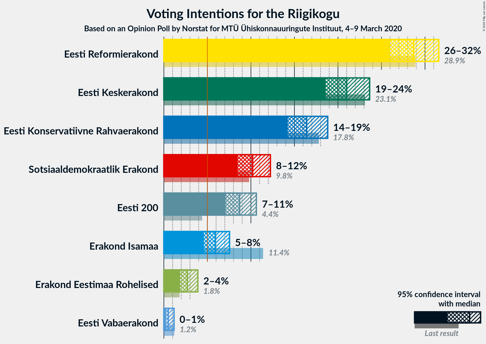

### Confidence Intervals

| Party | Last Result | Poll Result | 80% Confidence Interval | 90% Confidence Interval | 95% Confidence Interval | 99% Confidence Interval |
|:-----:|:-----------:|:-----------:|:-----------------------:|:-----------------------:|:-----------------------:|:-----------------------:|
| Eesti Reformierakond | 28.9% | 28.7% | 26.9–30.6% |26.4–31.1% |26.0–31.6% |25.1–32.5% |
| Eesti Keskerakond | 23.1% | 21.0% | 19.4–22.7% |19.0–23.2% |18.6–23.6% |17.8–24.5% |
| Eesti Konservatiivne Rahvaerakond | 17.8% | 16.4% | 15.0–18.0% |14.6–18.4% |14.2–18.8% |13.6–19.6% |
| Sotsiaaldemokraatlik Erakond | 9.8% | 10.2% | 9.1–11.5% |8.7–11.9% |8.5–12.2% |8.0–12.9% |
| Eesti 200 | 4.4% | 8.7% | 7.7–10.0% |7.3–10.3% |7.1–10.6% |6.6–11.2% |
| Erakond Isamaa | 11.4% | 5.9% | 5.0–7.0% |4.8–7.3% |4.6–7.5% |4.2–8.1% |
| Erakond Eestimaa Rohelised | 1.8% | 2.7% | 2.1–3.5% |2.0–3.7% |1.9–3.9% |1.6–4.3% |
| Eesti Vabaerakond | 1.2% | 0.5% | 0.3–0.9% |0.3–1.1% |0.2–1.2% |0.2–1.4% |

*Note:* The poll result column reflects the actual value used in the calculations. Published results may vary slightly, and in addition be rounded to fewer digits.

## Seats

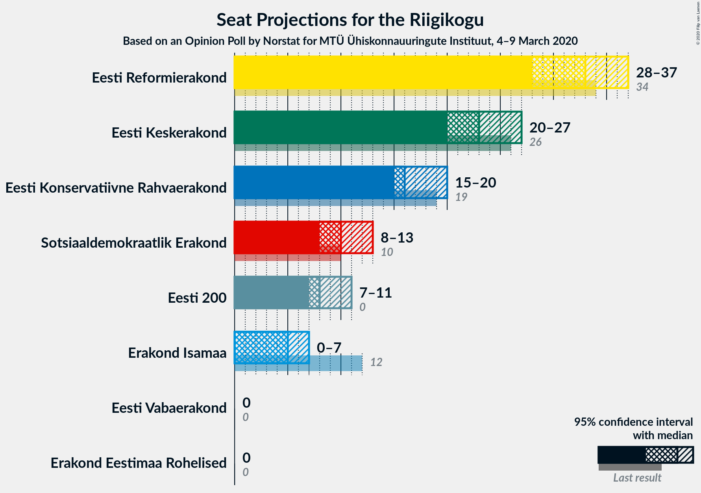

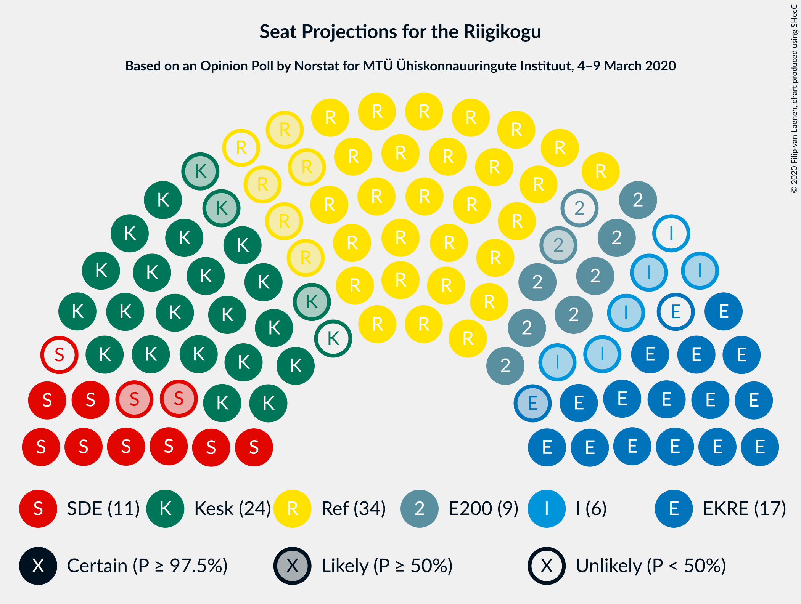

### Confidence Intervals

| Party | Last Result | Median | 80% Confidence Interval | 90% Confidence Interval | 95% Confidence Interval | 99% Confidence Interval |
|:-----:|:-----------:|:------:|:-----------------------:|:-----------------------:|:-----------------------:|:-----------------------:|
| <a href="#eesti-reformierakond">Eesti Reformierakond</a> | 34 | 33 | 30–36 |29–37 |28–37 |28–37 |
| <a href="#eesti-keskerakond">Eesti Keskerakond</a> | 26 | 23 | 21–25 |20–26 |20–27 |19–28 |
| <a href="#eesti-konservatiivne-rahvaerakond">Eesti Konservatiivne Rahvaerakond</a> | 19 | 16 | 15–19 |15–20 |15–20 |14–22 |
| <a href="#sotsiaaldemokraatlik-erakond">Sotsiaaldemokraatlik Erakond</a> | 10 | 10 | 9–11 |8–12 |8–13 |7–13 |
| <a href="#eesti-200">Eesti 200</a> | 0 | 8 | 7–10 |7–10 |7–11 |6–11 |
| <a href="#erakond-isamaa">Erakond Isamaa</a> | 12 | 5 | 4–6 |0–7 |0–7 |0–8 |
| <a href="#erakond-eestimaa-rohelised">Erakond Eestimaa Rohelised</a> | 0 | 0 | 0 |0 |0 |0 |
| <a href="#eesti-vabaerakond">Eesti Vabaerakond</a> | 0 | 0 | 0 |0 |0 |0 |

### Eesti Reformierakond

*For a full overview of the results for this party, see the [Eesti Reformierakond](party-eestireformierakond.html) page.*

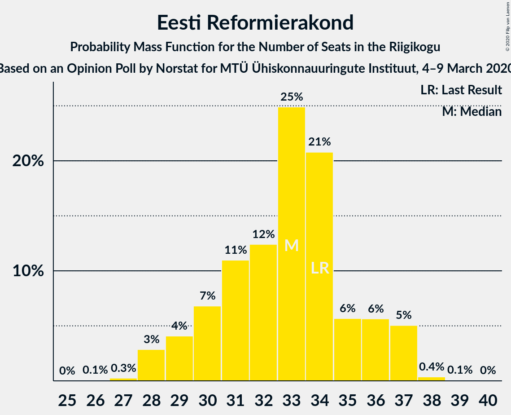

| Number of Seats | Probability | Accumulated | Special Marks |
|:---------------:|:-----------:|:-----------:|:-------------:|
| 26 | 0.1% | 100% |  |
| 27 | 0.3% | 99.9% |  |
| 28 | 3% | 99.7% |  |
| 29 | 4% | 97% |  |
| 30 | 7% | 93% |  |
| 31 | 11% | 86% |  |
| 32 | 12% | 75% |  |
| 33 | 25% | 63% | Median |
| 34 | 21% | 38% | Last Result |
| 35 | 6% | 17% |  |
| 36 | 6% | 11% |  |
| 37 | 5% | 6% |  |
| 38 | 0.4% | 0.5% |  |
| 39 | 0.1% | 0.1% |  |
| 40 | 0% | 0% |  |

### Eesti Keskerakond

*For a full overview of the results for this party, see the [Eesti Keskerakond](party-eestikeskerakond.html) page.*

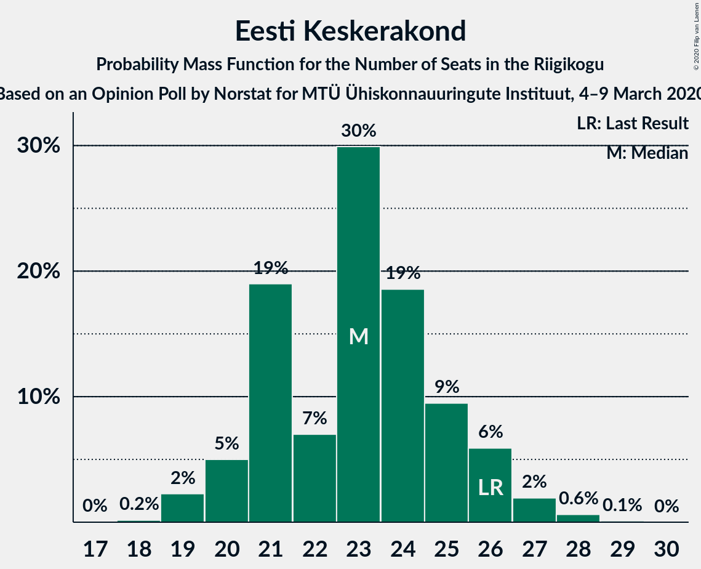

| Number of Seats | Probability | Accumulated | Special Marks |
|:---------------:|:-----------:|:-----------:|:-------------:|
| 18 | 0.2% | 100% |  |
| 19 | 2% | 99.8% |  |
| 20 | 5% | 98% |  |
| 21 | 19% | 93% |  |
| 22 | 7% | 74% |  |
| 23 | 30% | 67% | Median |
| 24 | 19% | 37% |  |
| 25 | 9% | 18% |  |
| 26 | 6% | 9% | Last Result |
| 27 | 2% | 3% |  |
| 28 | 0.6% | 0.7% |  |
| 29 | 0.1% | 0.1% |  |
| 30 | 0% | 0% |  |

### Eesti Konservatiivne Rahvaerakond

*For a full overview of the results for this party, see the [Eesti Konservatiivne Rahvaerakond](party-eestikonservatiivnerahvaerakond.html) page.*

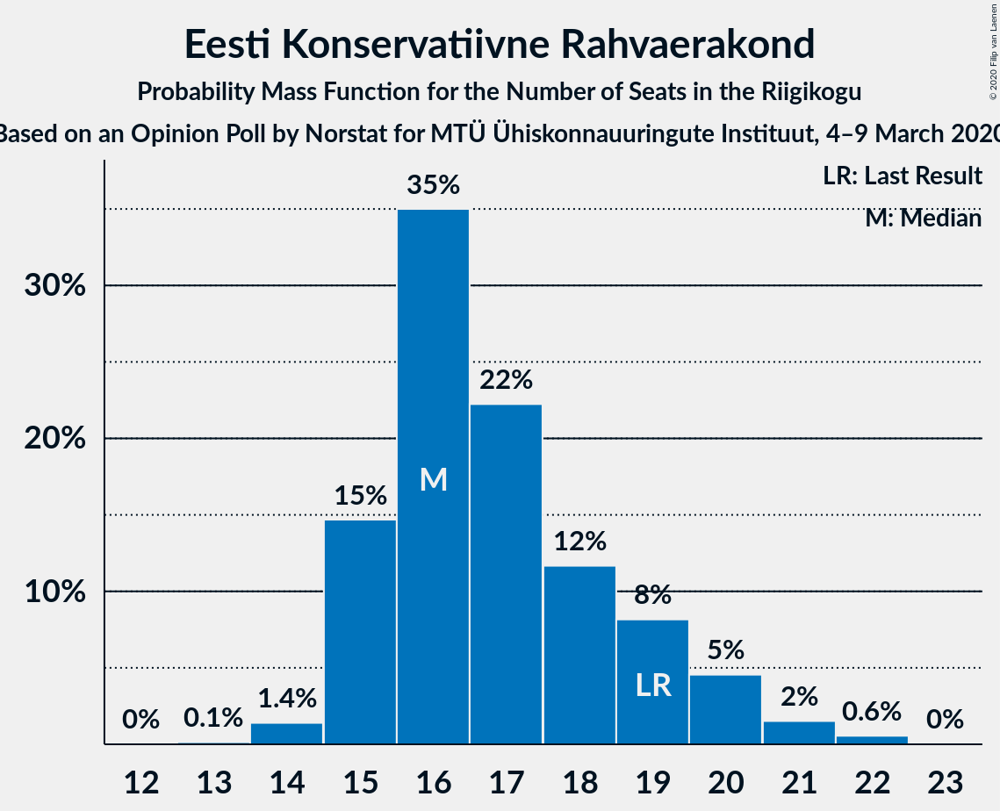

| Number of Seats | Probability | Accumulated | Special Marks |
|:---------------:|:-----------:|:-----------:|:-------------:|
| 13 | 0.1% | 100% |  |
| 14 | 1.4% | 99.8% |  |
| 15 | 15% | 98% |  |
| 16 | 35% | 84% | Median |
| 17 | 22% | 49% |  |
| 18 | 12% | 27% |  |
| 19 | 8% | 15% | Last Result |
| 20 | 5% | 7% |  |
| 21 | 2% | 2% |  |
| 22 | 0.6% | 0.6% |  |
| 23 | 0% | 0% |  |

### Sotsiaaldemokraatlik Erakond

*For a full overview of the results for this party, see the [Sotsiaaldemokraatlik Erakond](party-sotsiaaldemokraatlikerakond.html) page.*

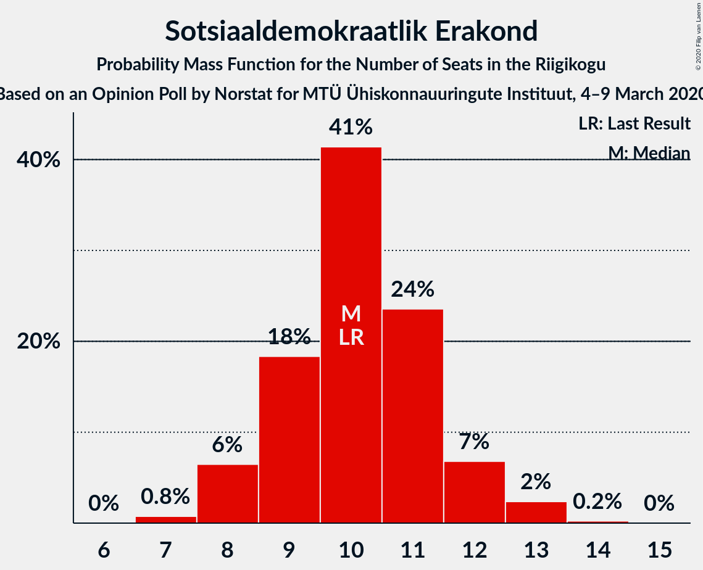

| Number of Seats | Probability | Accumulated | Special Marks |
|:---------------:|:-----------:|:-----------:|:-------------:|
| 7 | 0.8% | 100% |  |
| 8 | 6% | 99.2% |  |
| 9 | 18% | 93% |  |
| 10 | 41% | 74% | Last Result, Median |
| 11 | 24% | 33% |  |
| 12 | 7% | 9% |  |
| 13 | 2% | 3% |  |
| 14 | 0.2% | 0.3% |  |
| 15 | 0% | 0% |  |

### Eesti 200

*For a full overview of the results for this party, see the [Eesti 200](party-eesti200.html) page.*

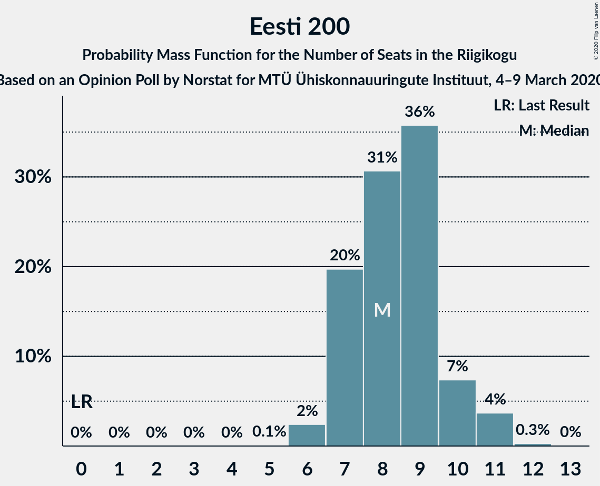

| Number of Seats | Probability | Accumulated | Special Marks |
|:---------------:|:-----------:|:-----------:|:-------------:|
| 0 | 0% | 100% | Last Result |
| 1 | 0% | 100% |  |
| 2 | 0% | 100% |  |
| 3 | 0% | 100% |  |
| 4 | 0% | 100% |  |
| 5 | 0.1% | 100% |  |
| 6 | 2% | 99.9% |  |
| 7 | 20% | 98% |  |
| 8 | 31% | 78% | Median |
| 9 | 36% | 47% |  |
| 10 | 7% | 11% |  |
| 11 | 4% | 4% |  |
| 12 | 0.3% | 0.3% |  |
| 13 | 0% | 0% |  |

### Erakond Isamaa

*For a full overview of the results for this party, see the [Erakond Isamaa](party-erakondisamaa.html) page.*

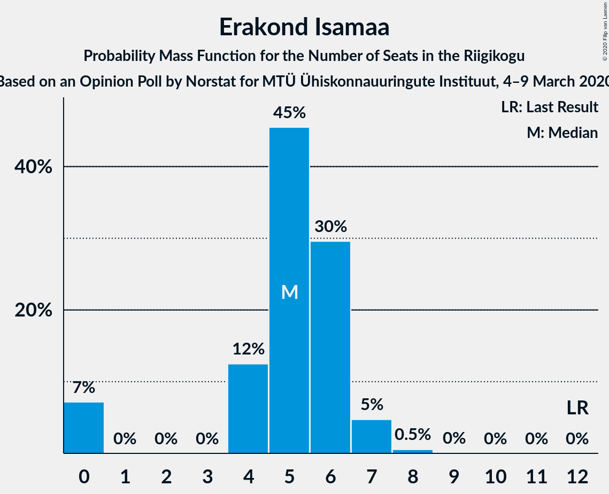

| Number of Seats | Probability | Accumulated | Special Marks |
|:---------------:|:-----------:|:-----------:|:-------------:|
| 0 | 7% | 100% |  |
| 1 | 0% | 93% |  |
| 2 | 0% | 93% |  |
| 3 | 0% | 93% |  |
| 4 | 12% | 93% |  |
| 5 | 45% | 80% | Median |
| 6 | 30% | 35% |  |
| 7 | 5% | 5% |  |
| 8 | 0.5% | 0.6% |  |
| 9 | 0% | 0% |  |
| 10 | 0% | 0% |  |
| 11 | 0% | 0% |  |
| 12 | 0% | 0% | Last Result |

### Erakond Eestimaa Rohelised

*For a full overview of the results for this party, see the [Erakond Eestimaa Rohelised](party-erakondeestimaarohelised.html) page.*

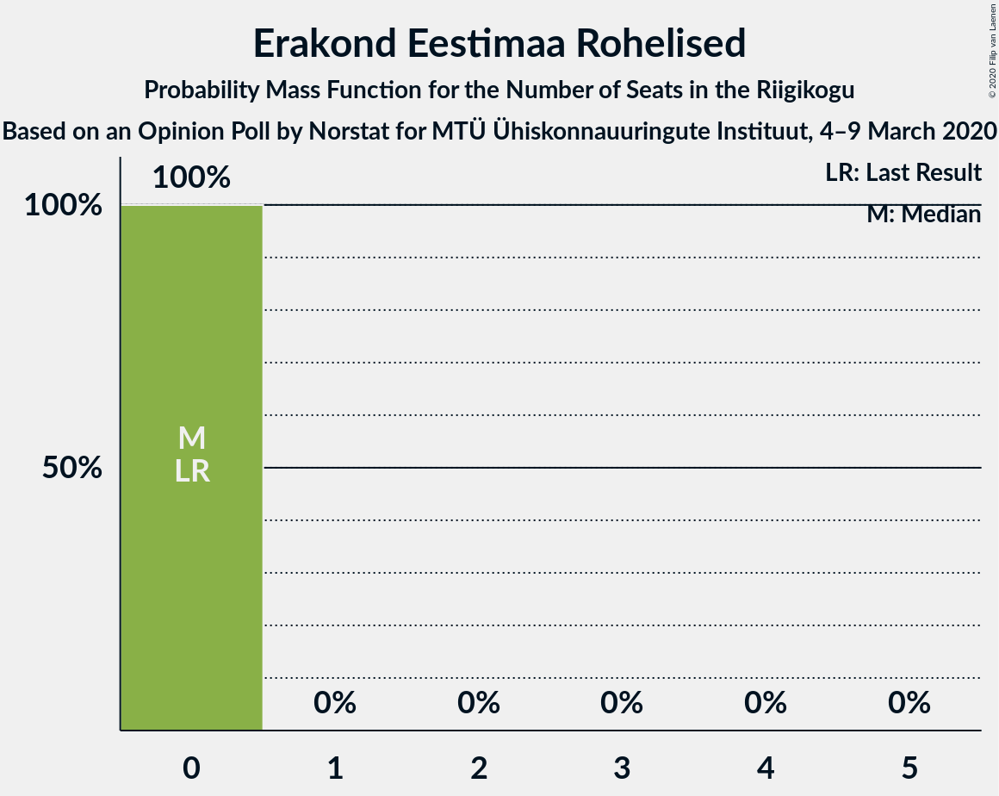

| Number of Seats | Probability | Accumulated | Special Marks |
|:---------------:|:-----------:|:-----------:|:-------------:|
| 0 | 100% | 100% | Last Result, Median |

### Eesti Vabaerakond

*For a full overview of the results for this party, see the [Eesti Vabaerakond](party-eestivabaerakond.html) page.*

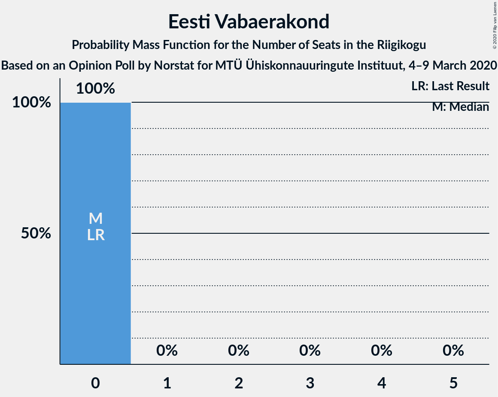

| Number of Seats | Probability | Accumulated | Special Marks |
|:---------------:|:-----------:|:-----------:|:-------------:|
| 0 | 100% | 100% | Last Result, Median |

## Coalitions

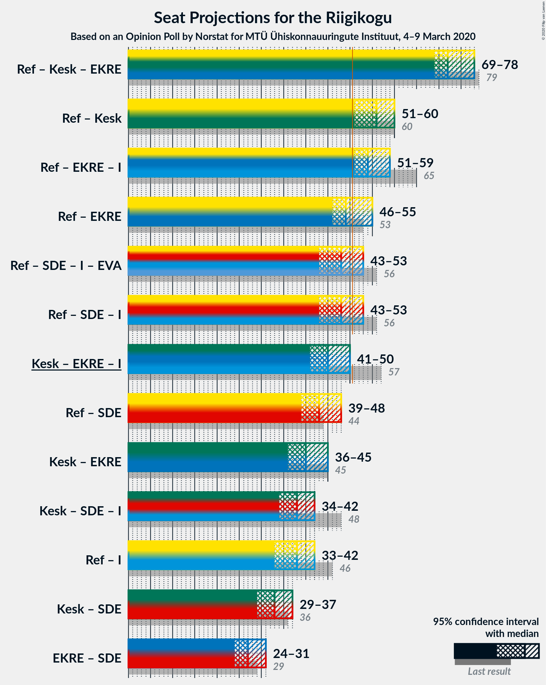

### Confidence Intervals

| Coalition | Last Result | Median | Majority? | 80% Confidence Interval | 90% Confidence Interval | 95% Confidence Interval | 99% Confidence Interval |
|:---------:|:-----------:|:------:|:---------:|:-----------------------:|:-----------------------:|:-----------------------:|:-----------------------:|
| Eesti Reformierakond – Eesti Keskerakond – Eesti Konservatiivne Rahvaerakond | 79 | 72 | 100% | 70–76 | 69–78 | 69–78 | 68–80 |
| Eesti Reformierakond – Eesti Keskerakond | 60 | 56 | 98.9% | 53–59 | 52–60 | 51–60 | 50–62 |
| Eesti Reformierakond – Eesti Konservatiivne Rahvaerakond – Erakond Isamaa | 65 | 54 | 98% | 52–58 | 51–59 | 51–59 | 50–60 |
| Eesti Reformierakond – Eesti Konservatiivne Rahvaerakond | 53 | 49 | 27% | 47–53 | 46–54 | 46–55 | 45–56 |
| Eesti Reformierakond – Sotsiaaldemokraatlik Erakond – Erakond Isamaa – Eesti Vabaerakond | 56 | 48 | 12% | 45–51 | 44–52 | 43–53 | 42–53 |
| Eesti Reformierakond – Sotsiaaldemokraatlik Erakond – Erakond Isamaa | 56 | 48 | 12% | 45–51 | 44–52 | 43–53 | 42–53 |
| Eesti Keskerakond – Eesti Konservatiivne Rahvaerakond – Erakond Isamaa | 57 | 45 | 1.1% | 42–48 | 41–49 | 41–50 | 38–51 |
| Eesti Reformierakond – Sotsiaaldemokraatlik Erakond | 44 | 43 | 0% | 40–46 | 39–48 | 39–48 | 37–48 |
| Eesti Keskerakond – Eesti Konservatiivne Rahvaerakond | 45 | 40 | 0% | 37–43 | 37–44 | 36–45 | 35–46 |
| Eesti Keskerakond – Sotsiaaldemokraatlik Erakond – Erakond Isamaa | 48 | 38 | 0% | 35–41 | 34–41 | 34–42 | 31–43 |
| Eesti Reformierakond – Erakond Isamaa | 46 | 38 | 0% | 35–41 | 34–41 | 33–42 | 31–42 |
| Eesti Keskerakond – Sotsiaaldemokraatlik Erakond | 36 | 33 | 0% | 31–35 | 30–36 | 29–37 | 28–38 |
| Eesti Konservatiivne Rahvaerakond – Sotsiaaldemokraatlik Erakond | 29 | 27 | 0% | 25–29 | 24–30 | 24–31 | 23–33 |

### Eesti Reformierakond – Eesti Keskerakond – Eesti Konservatiivne Rahvaerakond

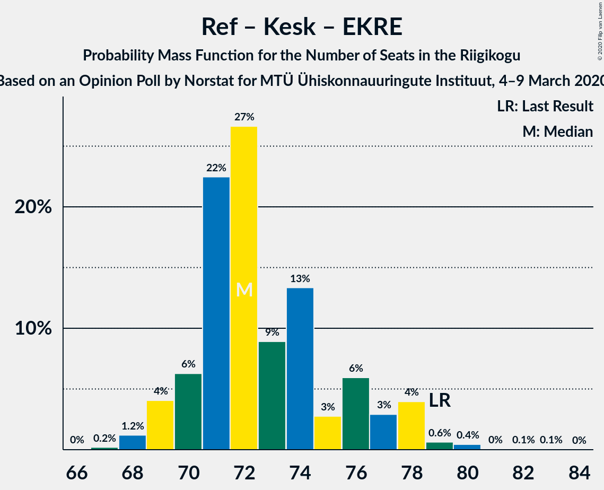

| Number of Seats | Probability | Accumulated | Special Marks |
|:---------------:|:-----------:|:-----------:|:-------------:|
| 67 | 0.2% | 100% |  |
| 68 | 1.2% | 99.8% |  |
| 69 | 4% | 98.6% |  |
| 70 | 6% | 95% |  |
| 71 | 22% | 88% |  |
| 72 | 27% | 66% | Median |
| 73 | 9% | 39% |  |
| 74 | 13% | 30% |  |
| 75 | 3% | 17% |  |
| 76 | 6% | 14% |  |
| 77 | 3% | 8% |  |
| 78 | 4% | 5% |  |
| 79 | 0.6% | 1.3% | Last Result |
| 80 | 0.4% | 0.6% |  |
| 81 | 0% | 0.2% |  |
| 82 | 0.1% | 0.2% |  |
| 83 | 0.1% | 0.1% |  |
| 84 | 0% | 0% |  |

### Eesti Reformierakond – Eesti Keskerakond

| Number of Seats | Probability | Accumulated | Special Marks |
|:---------------:|:-----------:|:-----------:|:-------------:|
| 49 | 0.1% | 100% |  |
| 50 | 1.0% | 99.9% |  |
| 51 | 2% | 98.9% | Majority |
| 52 | 4% | 97% |  |
| 53 | 10% | 92% |  |
| 54 | 6% | 83% |  |
| 55 | 25% | 76% |  |
| 56 | 14% | 52% | Median |
| 57 | 15% | 38% |  |
| 58 | 11% | 23% |  |
| 59 | 5% | 12% |  |
| 60 | 5% | 7% | Last Result |
| 61 | 1.2% | 2% |  |
| 62 | 0.5% | 0.7% |  |
| 63 | 0% | 0.2% |  |
| 64 | 0% | 0.2% |  |
| 65 | 0.1% | 0.1% |  |
| 66 | 0% | 0% |  |

### Eesti Reformierakond – Eesti Konservatiivne Rahvaerakond – Erakond Isamaa

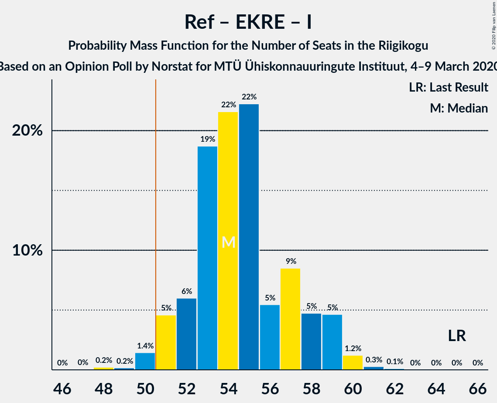

| Number of Seats | Probability | Accumulated | Special Marks |
|:---------------:|:-----------:|:-----------:|:-------------:|
| 47 | 0% | 100% |  |
| 48 | 0.2% | 99.9% |  |
| 49 | 0.2% | 99.7% |  |
| 50 | 1.4% | 99.5% |  |
| 51 | 5% | 98% | Majority |
| 52 | 6% | 94% |  |
| 53 | 19% | 88% |  |
| 54 | 22% | 69% | Median |
| 55 | 22% | 47% |  |
| 56 | 5% | 25% |  |
| 57 | 9% | 20% |  |
| 58 | 5% | 11% |  |
| 59 | 5% | 6% |  |
| 60 | 1.2% | 2% |  |
| 61 | 0.3% | 0.4% |  |
| 62 | 0.1% | 0.1% |  |
| 63 | 0% | 0% |  |
| 64 | 0% | 0% |  |
| 65 | 0% | 0% | Last Result |

### Eesti Reformierakond – Eesti Konservatiivne Rahvaerakond

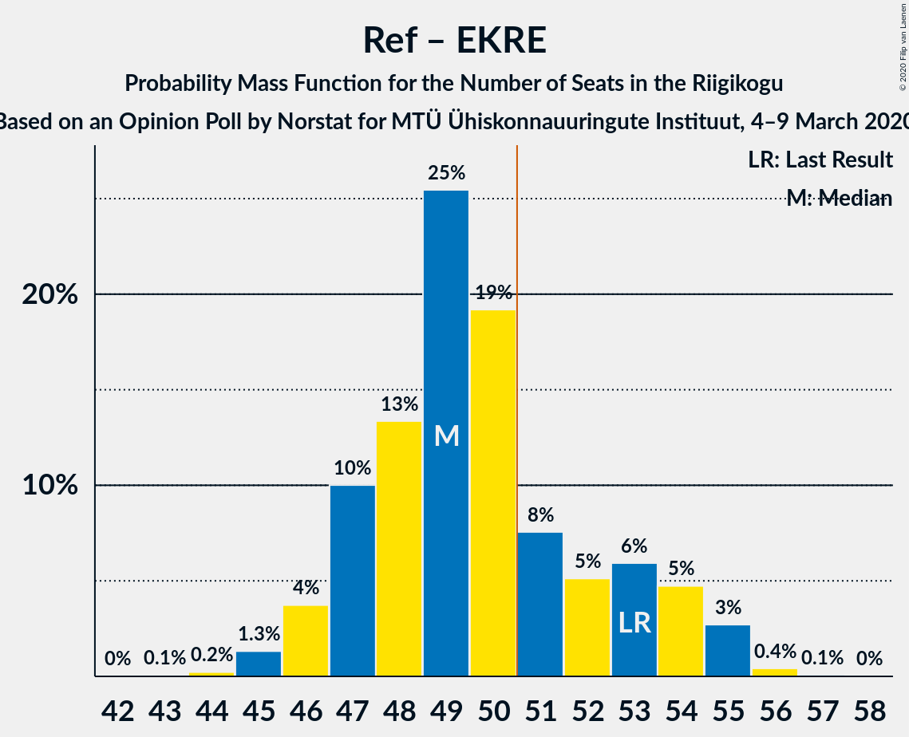

| Number of Seats | Probability | Accumulated | Special Marks |
|:---------------:|:-----------:|:-----------:|:-------------:|
| 43 | 0.1% | 100% |  |
| 44 | 0.2% | 99.9% |  |
| 45 | 1.3% | 99.7% |  |
| 46 | 4% | 98% |  |
| 47 | 10% | 95% |  |
| 48 | 13% | 85% |  |
| 49 | 25% | 71% | Median |
| 50 | 19% | 46% |  |
| 51 | 8% | 27% | Majority |
| 52 | 5% | 19% |  |
| 53 | 6% | 14% | Last Result |
| 54 | 5% | 8% |  |
| 55 | 3% | 3% |  |
| 56 | 0.4% | 0.6% |  |
| 57 | 0.1% | 0.1% |  |
| 58 | 0% | 0% |  |

### Eesti Reformierakond – Sotsiaaldemokraatlik Erakond – Erakond Isamaa – Eesti Vabaerakond

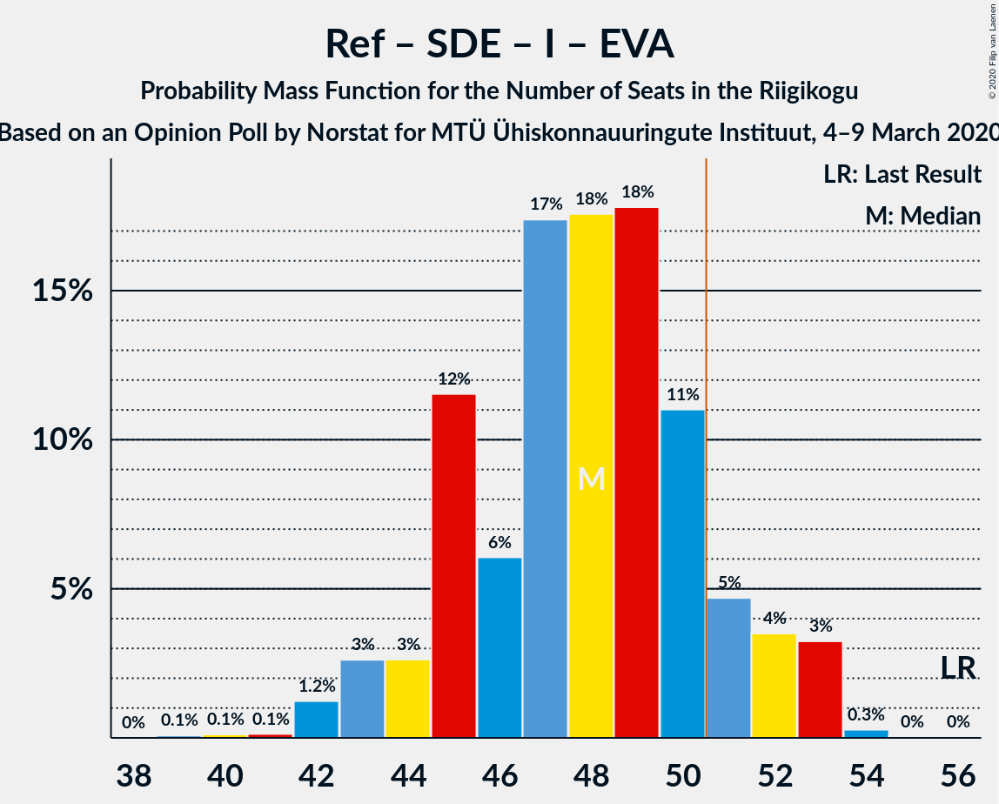

| Number of Seats | Probability | Accumulated | Special Marks |
|:---------------:|:-----------:|:-----------:|:-------------:|
| 39 | 0.1% | 100% |  |
| 40 | 0.1% | 99.9% |  |
| 41 | 0.1% | 99.8% |  |
| 42 | 1.2% | 99.7% |  |
| 43 | 3% | 98% |  |
| 44 | 3% | 96% |  |
| 45 | 12% | 93% |  |
| 46 | 6% | 82% |  |
| 47 | 17% | 76% |  |
| 48 | 18% | 58% | Median |
| 49 | 18% | 41% |  |
| 50 | 11% | 23% |  |
| 51 | 5% | 12% | Majority |
| 52 | 4% | 7% |  |
| 53 | 3% | 4% |  |
| 54 | 0.3% | 0.4% |  |
| 55 | 0% | 0.1% |  |
| 56 | 0% | 0% | Last Result |

### Eesti Reformierakond – Sotsiaaldemokraatlik Erakond – Erakond Isamaa

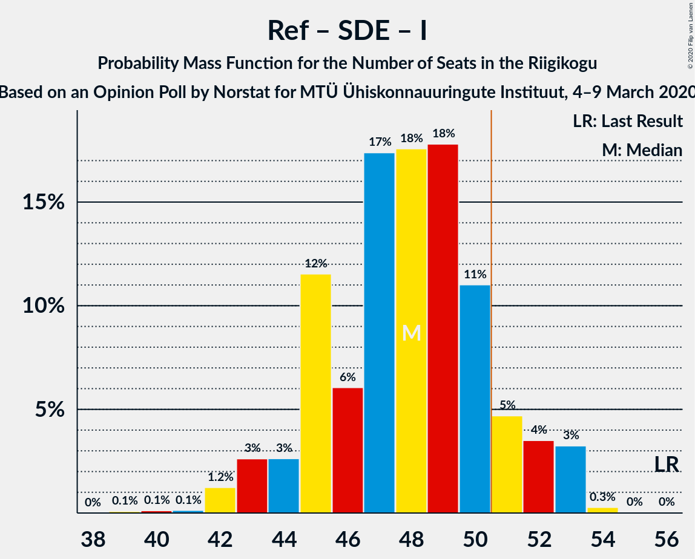

| Number of Seats | Probability | Accumulated | Special Marks |
|:---------------:|:-----------:|:-----------:|:-------------:|
| 39 | 0.1% | 100% |  |
| 40 | 0.1% | 99.9% |  |
| 41 | 0.1% | 99.8% |  |
| 42 | 1.2% | 99.7% |  |
| 43 | 3% | 98% |  |
| 44 | 3% | 96% |  |
| 45 | 12% | 93% |  |
| 46 | 6% | 82% |  |
| 47 | 17% | 76% |  |
| 48 | 18% | 58% | Median |
| 49 | 18% | 41% |  |
| 50 | 11% | 23% |  |
| 51 | 5% | 12% | Majority |
| 52 | 4% | 7% |  |
| 53 | 3% | 4% |  |
| 54 | 0.3% | 0.4% |  |
| 55 | 0% | 0.1% |  |
| 56 | 0% | 0% | Last Result |

### Eesti Keskerakond – Eesti Konservatiivne Rahvaerakond – Erakond Isamaa

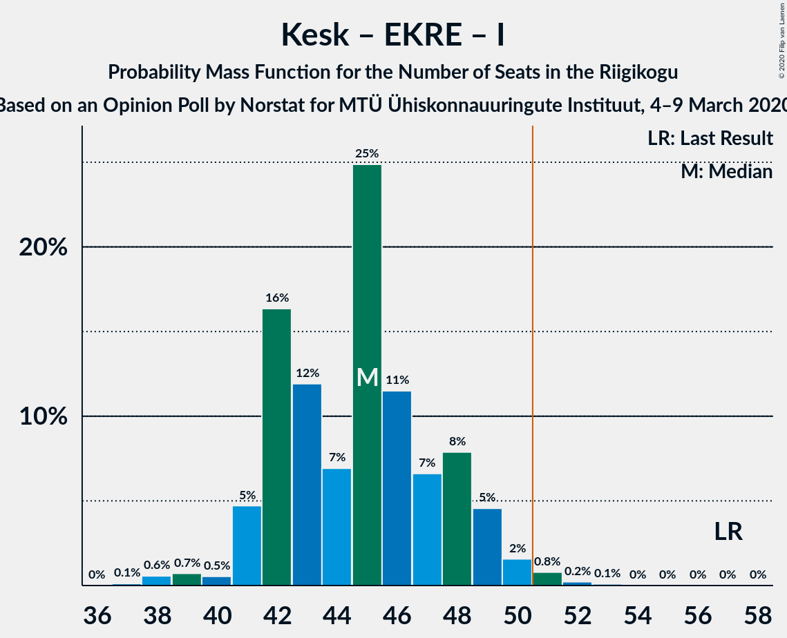

| Number of Seats | Probability | Accumulated | Special Marks |
|:---------------:|:-----------:|:-----------:|:-------------:|
| 37 | 0.1% | 100% |  |
| 38 | 0.6% | 99.9% |  |
| 39 | 0.7% | 99.3% |  |
| 40 | 0.5% | 98.6% |  |
| 41 | 5% | 98% |  |
| 42 | 16% | 93% |  |
| 43 | 12% | 77% |  |
| 44 | 7% | 65% | Median |
| 45 | 25% | 58% |  |
| 46 | 11% | 33% |  |
| 47 | 7% | 22% |  |
| 48 | 8% | 15% |  |
| 49 | 5% | 7% |  |
| 50 | 2% | 3% |  |
| 51 | 0.8% | 1.1% | Majority |
| 52 | 0.2% | 0.3% |  |
| 53 | 0.1% | 0.1% |  |
| 54 | 0% | 0% |  |
| 55 | 0% | 0% |  |
| 56 | 0% | 0% |  |
| 57 | 0% | 0% | Last Result |

### Eesti Reformierakond – Sotsiaaldemokraatlik Erakond

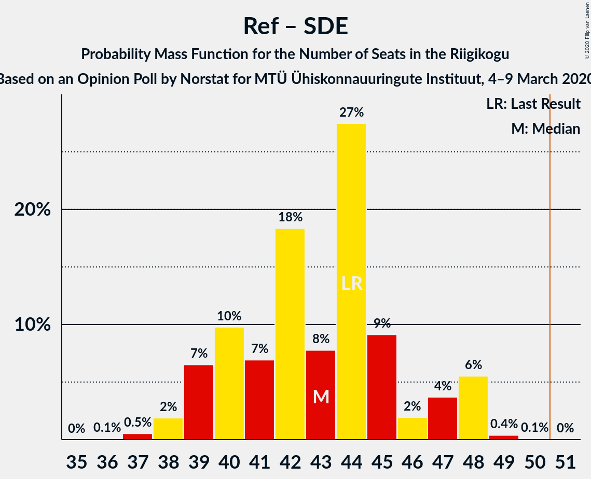

| Number of Seats | Probability | Accumulated | Special Marks |
|:---------------:|:-----------:|:-----------:|:-------------:|
| 36 | 0.1% | 100% |  |
| 37 | 0.5% | 99.9% |  |
| 38 | 2% | 99.4% |  |
| 39 | 7% | 98% |  |
| 40 | 10% | 91% |  |
| 41 | 7% | 81% |  |
| 42 | 18% | 74% |  |
| 43 | 8% | 56% | Median |
| 44 | 27% | 48% | Last Result |
| 45 | 9% | 21% |  |
| 46 | 2% | 12% |  |
| 47 | 4% | 10% |  |
| 48 | 6% | 6% |  |
| 49 | 0.4% | 0.5% |  |
| 50 | 0.1% | 0.1% |  |
| 51 | 0% | 0% | Majority |

### Eesti Keskerakond – Eesti Konservatiivne Rahvaerakond

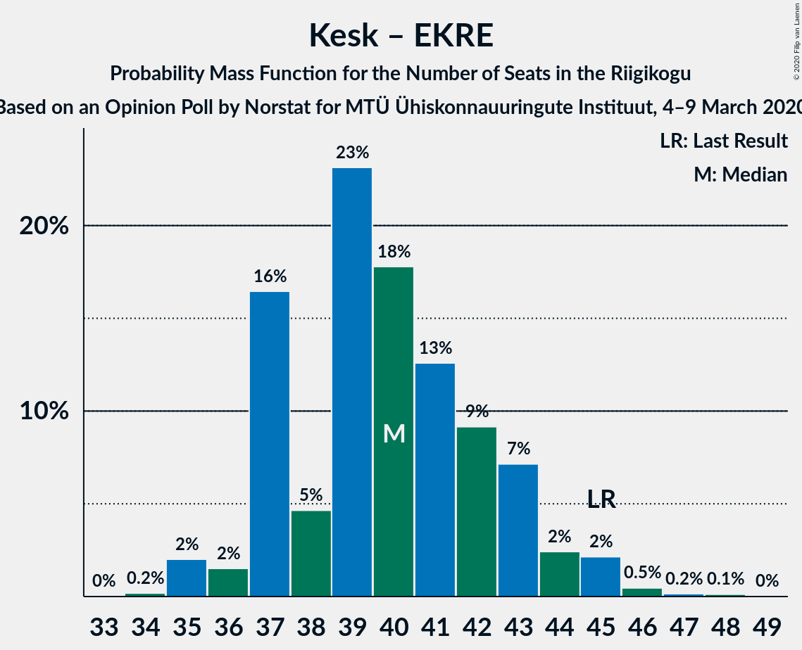

| Number of Seats | Probability | Accumulated | Special Marks |
|:---------------:|:-----------:|:-----------:|:-------------:|
| 34 | 0.2% | 100% |  |
| 35 | 2% | 99.8% |  |
| 36 | 2% | 98% |  |
| 37 | 16% | 96% |  |
| 38 | 5% | 80% |  |
| 39 | 23% | 75% | Median |
| 40 | 18% | 52% |  |
| 41 | 13% | 34% |  |
| 42 | 9% | 22% |  |
| 43 | 7% | 12% |  |
| 44 | 2% | 5% |  |
| 45 | 2% | 3% | Last Result |
| 46 | 0.5% | 0.8% |  |
| 47 | 0.2% | 0.3% |  |
| 48 | 0.1% | 0.1% |  |
| 49 | 0% | 0% |  |

### Eesti Keskerakond – Sotsiaaldemokraatlik Erakond – Erakond Isamaa

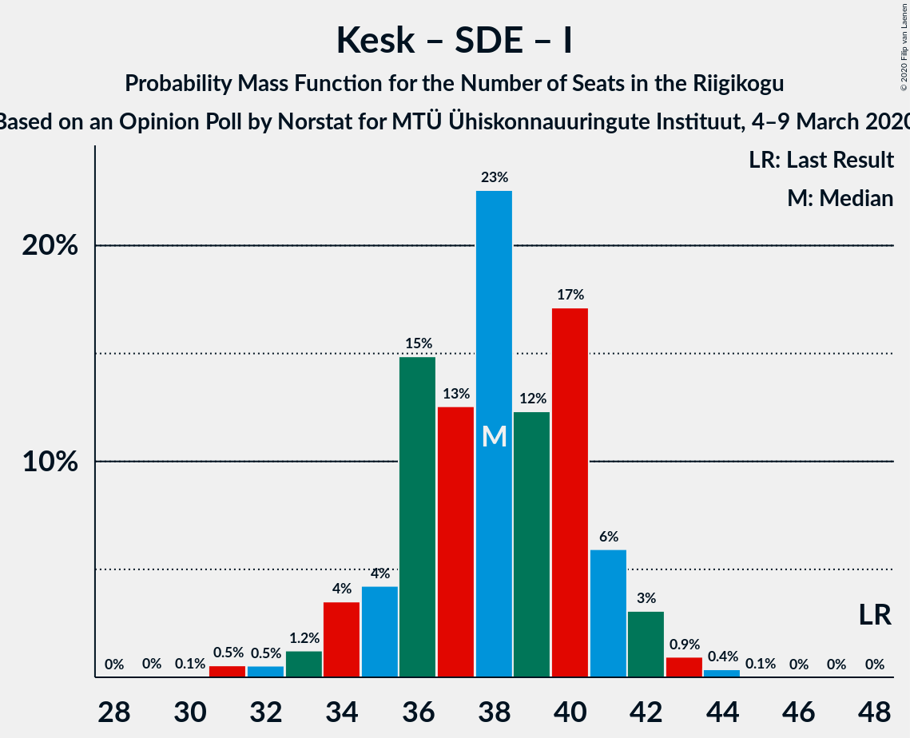

| Number of Seats | Probability | Accumulated | Special Marks |
|:---------------:|:-----------:|:-----------:|:-------------:|
| 30 | 0.1% | 100% |  |
| 31 | 0.5% | 99.9% |  |
| 32 | 0.5% | 99.3% |  |
| 33 | 1.2% | 98.8% |  |
| 34 | 4% | 98% |  |
| 35 | 4% | 94% |  |
| 36 | 15% | 90% |  |
| 37 | 13% | 75% |  |
| 38 | 23% | 62% | Median |
| 39 | 12% | 40% |  |
| 40 | 17% | 28% |  |
| 41 | 6% | 10% |  |
| 42 | 3% | 4% |  |
| 43 | 0.9% | 1.4% |  |
| 44 | 0.4% | 0.4% |  |
| 45 | 0.1% | 0.1% |  |
| 46 | 0% | 0% |  |
| 47 | 0% | 0% |  |
| 48 | 0% | 0% | Last Result |

### Eesti Reformierakond – Erakond Isamaa

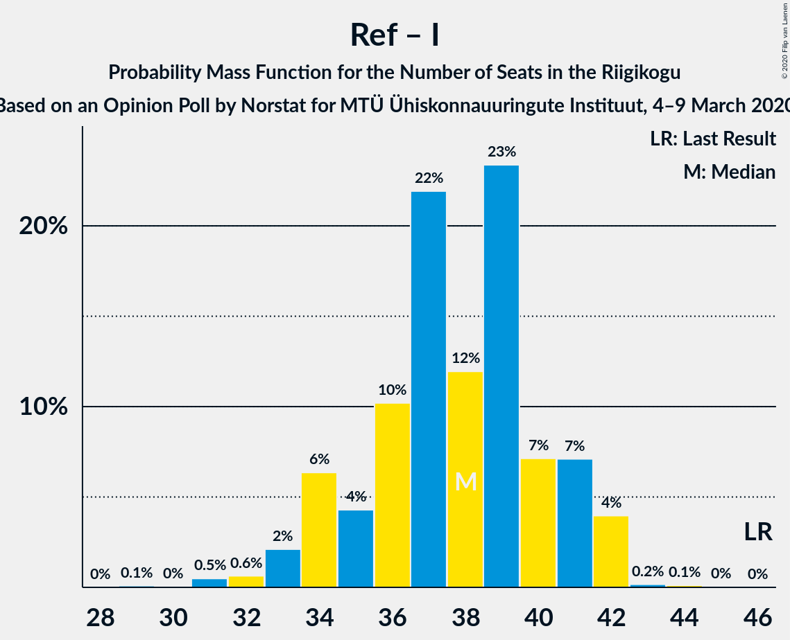

| Number of Seats | Probability | Accumulated | Special Marks |
|:---------------:|:-----------:|:-----------:|:-------------:|
| 29 | 0.1% | 100% |  |
| 30 | 0% | 99.9% |  |
| 31 | 0.5% | 99.9% |  |
| 32 | 0.6% | 99.4% |  |
| 33 | 2% | 98.7% |  |
| 34 | 6% | 97% |  |
| 35 | 4% | 90% |  |
| 36 | 10% | 86% |  |
| 37 | 22% | 76% |  |
| 38 | 12% | 54% | Median |
| 39 | 23% | 42% |  |
| 40 | 7% | 19% |  |
| 41 | 7% | 11% |  |
| 42 | 4% | 4% |  |
| 43 | 0.2% | 0.3% |  |
| 44 | 0.1% | 0.1% |  |
| 45 | 0% | 0% |  |
| 46 | 0% | 0% | Last Result |

### Eesti Keskerakond – Sotsiaaldemokraatlik Erakond

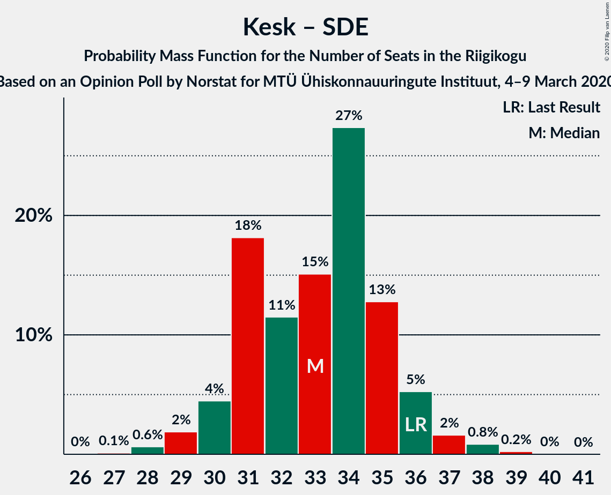

| Number of Seats | Probability | Accumulated | Special Marks |
|:---------------:|:-----------:|:-----------:|:-------------:|
| 27 | 0.1% | 100% |  |
| 28 | 0.6% | 99.9% |  |
| 29 | 2% | 99.2% |  |
| 30 | 4% | 97% |  |
| 31 | 18% | 93% |  |
| 32 | 11% | 75% |  |
| 33 | 15% | 63% | Median |
| 34 | 27% | 48% |  |
| 35 | 13% | 21% |  |
| 36 | 5% | 8% | Last Result |
| 37 | 2% | 3% |  |
| 38 | 0.8% | 1.1% |  |
| 39 | 0.2% | 0.3% |  |
| 40 | 0% | 0.1% |  |
| 41 | 0% | 0% |  |

### Eesti Konservatiivne Rahvaerakond – Sotsiaaldemokraatlik Erakond

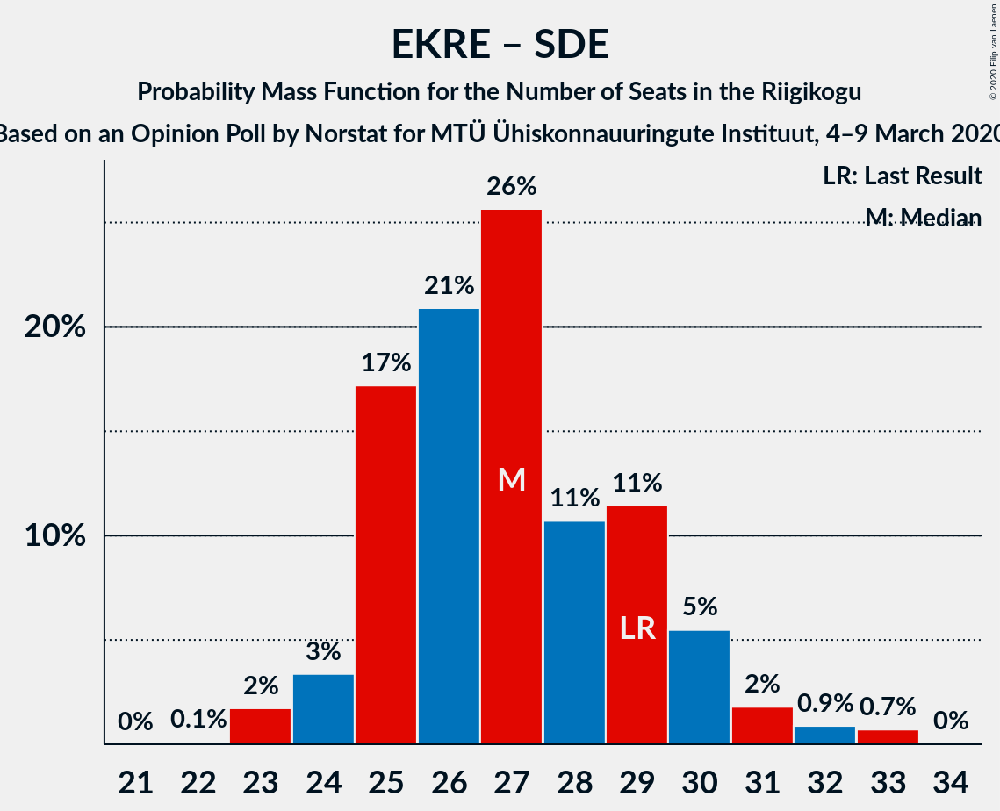

| Number of Seats | Probability | Accumulated | Special Marks |
|:---------------:|:-----------:|:-----------:|:-------------:|
| 22 | 0.1% | 100% |  |
| 23 | 2% | 99.9% |  |
| 24 | 3% | 98% |  |
| 25 | 17% | 95% |  |
| 26 | 21% | 78% | Median |
| 27 | 26% | 57% |  |
| 28 | 11% | 31% |  |
| 29 | 11% | 20% | Last Result |
| 30 | 5% | 9% |  |
| 31 | 2% | 3% |  |
| 32 | 0.9% | 2% |  |
| 33 | 0.7% | 0.7% |  |
| 34 | 0% | 0% |  |

## Technical Information

### Opinion Poll

+ **Polling firm:** Norstat
+ **Commissioner(s):** MTÜ Ühiskonnauuringute Instituut
+ **Fieldwork period:** 4–9 March 2020

### Calculations

+ **Sample size:** 1000
+ **Simulations done:** 131,072
+ **Error estimate:** 2.62%

