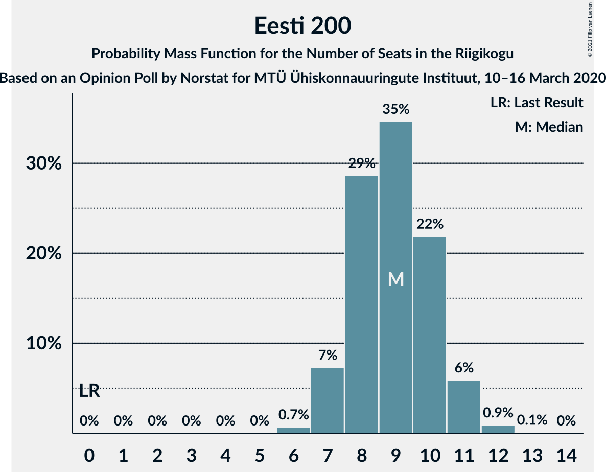
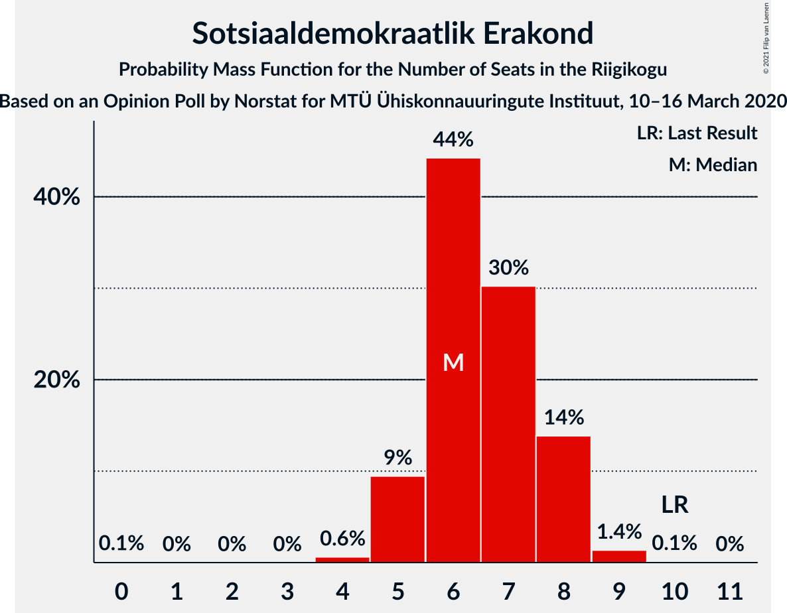
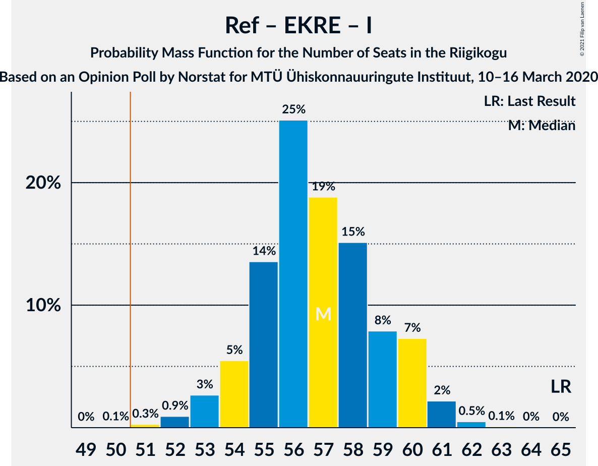
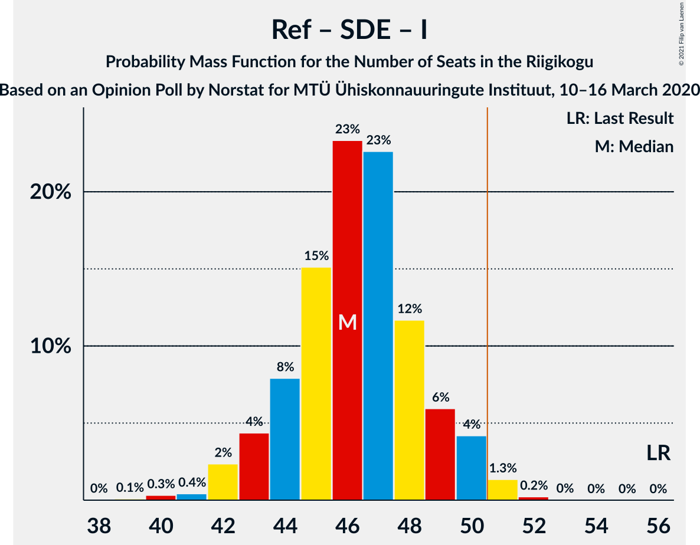

# Opinion Poll by Norstat for MTÜ Ühiskonnauuringute Instituut, 10–16 March 2020

<a href="#voting-intentions">Voting Intentions</a> | <a href="#seats">Seats</a> | <a href="#coalitions">Coalitions</a> | <a href="#technical-information">Technical Information</a>

## Voting Intentions

### Confidence Intervals

| Party | Last Result | Poll Result | 80% Confidence Interval | 90% Confidence Interval | 95% Confidence Interval | 99% Confidence Interval |
|:-----:|:-----------:|:-----------:|:-----------------------:|:-----------------------:|:-----------------------:|:-----------------------:|
| Eesti Reformierakond | 28.9% | 30.8% | 29.0–32.7% |28.5–33.3% |28.0–33.7% |27.2–34.7% |
| Eesti Keskerakond | 23.1% | 26.3% | 24.6–28.2% |24.1–28.7% |23.7–29.1% |22.8–30.0% |
| Eesti Konservatiivne Rahvaerakond | 17.8% | 16.6% | 15.2–18.2% |14.8–18.6% |14.4–19.0% |13.8–19.8% |
| Eesti 200 | 4.4% | 9.4% | 8.3–10.7% |8.0–11.1% |7.7–11.4% |7.2–12.0% |
| Sotsiaaldemokraatlik Erakond | 9.8% | 7.2% | 6.2–8.4% |6.0–8.7% |5.7–9.0% |5.3–9.6% |
| Erakond Isamaa | 11.4% | 6.3% | 5.4–7.4% |5.2–7.7% |5.0–8.0% |4.6–8.5% |
| Erakond Eestimaa Rohelised | 1.8% | 1.8% | 1.4–2.5% |1.2–2.7% |1.1–2.8% |1.0–3.2% |
| Eesti Vabaerakond | 1.2% | 0.2% | 0.1–0.5% |0.1–0.6% |0.1–0.7% |0.0–0.9% |

*Note:* The poll result column reflects the actual value used in the calculations. Published results may vary slightly, and in addition be rounded to fewer digits.

## Seats

### Confidence Intervals

| Party | Last Result | Median | 80% Confidence Interval | 90% Confidence Interval | 95% Confidence Interval | 99% Confidence Interval |
|:-----:|:-----------:|:------:|:-----------------------:|:-----------------------:|:-----------------------:|:-----------------------:|
| <a href="#eesti-reformierakond">Eesti Reformierakond</a> | 34 | 34 | 32–37 |31–37 |31–38 |30–39 |
| <a href="#eesti-keskerakond">Eesti Keskerakond</a> | 26 | 29 | 27–31 |26–32 |25–32 |24–33 |
| <a href="#eesti-konservatiivne-rahvaerakond">Eesti Konservatiivne Rahvaerakond</a> | 19 | 17 | 15–19 |15–19 |15–20 |14–21 |
| <a href="#eesti-200">Eesti 200</a> | 0 | 9 | 8–10 |7–11 |7–11 |6–12 |
| <a href="#sotsiaaldemokraatlik-erakond">Sotsiaaldemokraatlik Erakond</a> | 10 | 6 | 5–8 |5–8 |5–8 |4–9 |
| <a href="#erakond-isamaa">Erakond Isamaa</a> | 12 | 6 | 4–7 |4–7 |0–7 |0–8 |
| <a href="#erakond-eestimaa-rohelised">Erakond Eestimaa Rohelised</a> | 0 | 0 | 0 |0 |0 |0 |
| <a href="#eesti-vabaerakond">Eesti Vabaerakond</a> | 0 | 0 | 0 |0 |0 |0 |

### Eesti Reformierakond

*For a full overview of the results for this party, see the [Eesti Reformierakond](party-eestireformierakond.html) page.*

| Number of Seats | Probability | Accumulated | Special Marks |
|:---------------:|:-----------:|:-----------:|:-------------:|
| 29 | 0.2% | 100% |  |
| 30 | 1.4% | 99.7% |  |
| 31 | 4% | 98% |  |
| 32 | 10% | 94% |  |
| 33 | 17% | 85% |  |
| 34 | 19% | 68% | Last Result, Median |
| 35 | 22% | 48% |  |
| 36 | 14% | 26% |  |
| 37 | 8% | 12% |  |
| 38 | 3% | 5% |  |
| 39 | 1.1% | 1.4% |  |
| 40 | 0.2% | 0.3% |  |
| 41 | 0.1% | 0.1% |  |
| 42 | 0% | 0% |  |

### Eesti Keskerakond

*For a full overview of the results for this party, see the [Eesti Keskerakond](party-eestikeskerakond.html) page.*

| Number of Seats | Probability | Accumulated | Special Marks |
|:---------------:|:-----------:|:-----------:|:-------------:|
| 23 | 0.1% | 100% |  |
| 24 | 0.5% | 99.9% |  |
| 25 | 2% | 99.4% |  |
| 26 | 6% | 97% | Last Result |
| 27 | 14% | 91% |  |
| 28 | 22% | 78% |  |
| 29 | 20% | 56% | Median |
| 30 | 21% | 36% |  |
| 31 | 9% | 14% |  |
| 32 | 4% | 5% |  |
| 33 | 1.4% | 2% |  |
| 34 | 0.3% | 0.4% |  |
| 35 | 0.1% | 0.1% |  |
| 36 | 0% | 0% |  |

### Eesti Konservatiivne Rahvaerakond

*For a full overview of the results for this party, see the [Eesti Konservatiivne Rahvaerakond](party-eestikonservatiivnerahvaerakond.html) page.*

| Number of Seats | Probability | Accumulated | Special Marks |
|:---------------:|:-----------:|:-----------:|:-------------:|
| 13 | 0.3% | 100% |  |
| 14 | 2% | 99.7% |  |
| 15 | 10% | 98% |  |
| 16 | 23% | 88% |  |
| 17 | 33% | 64% | Median |
| 18 | 16% | 31% |  |
| 19 | 10% | 14% | Last Result |
| 20 | 3% | 4% |  |
| 21 | 0.9% | 1.0% |  |
| 22 | 0.1% | 0.1% |  |
| 23 | 0% | 0% |  |

### Eesti 200

*For a full overview of the results for this party, see the [Eesti 200](party-eesti200.html) page.*

| Number of Seats | Probability | Accumulated | Special Marks |
|:---------------:|:-----------:|:-----------:|:-------------:|
| 0 | 0% | 100% | Last Result |
| 1 | 0% | 100% |  |
| 2 | 0% | 100% |  |
| 3 | 0% | 100% |  |
| 4 | 0% | 100% |  |
| 5 | 0% | 100% |  |
| 6 | 0.7% | 100% |  |
| 7 | 7% | 99.3% |  |
| 8 | 29% | 92% |  |
| 9 | 35% | 63% | Median |
| 10 | 22% | 29% |  |
| 11 | 6% | 7% |  |
| 12 | 0.9% | 1.0% |  |
| 13 | 0.1% | 0.1% |  |
| 14 | 0% | 0% |  |

### Sotsiaaldemokraatlik Erakond

*For a full overview of the results for this party, see the [Sotsiaaldemokraatlik Erakond](party-sotsiaaldemokraatlikerakond.html) page.*

| Number of Seats | Probability | Accumulated | Special Marks |
|:---------------:|:-----------:|:-----------:|:-------------:|
| 0 | 0.1% | 100% |  |
| 1 | 0% | 99.9% |  |
| 2 | 0% | 99.9% |  |
| 3 | 0% | 99.9% |  |
| 4 | 0.6% | 99.9% |  |
| 5 | 9% | 99.3% |  |
| 6 | 44% | 90% | Median |
| 7 | 30% | 46% |  |
| 8 | 14% | 15% |  |
| 9 | 1.4% | 1.5% |  |
| 10 | 0.1% | 0.1% | Last Result |
| 11 | 0% | 0% |  |

### Erakond Isamaa

*For a full overview of the results for this party, see the [Erakond Isamaa](party-erakondisamaa.html) page.*

| Number of Seats | Probability | Accumulated | Special Marks |
|:---------------:|:-----------:|:-----------:|:-------------:|
| 0 | 3% | 100% |  |
| 1 | 0% | 97% |  |
| 2 | 0% | 97% |  |
| 3 | 0% | 97% |  |
| 4 | 8% | 97% |  |
| 5 | 37% | 89% |  |
| 6 | 40% | 52% | Median |
| 7 | 11% | 12% |  |
| 8 | 1.4% | 1.4% |  |
| 9 | 0.1% | 0.1% |  |
| 10 | 0% | 0% |  |
| 11 | 0% | 0% |  |
| 12 | 0% | 0% | Last Result |

### Erakond Eestimaa Rohelised

*For a full overview of the results for this party, see the [Erakond Eestimaa Rohelised](party-erakondeestimaarohelised.html) page.*

| Number of Seats | Probability | Accumulated | Special Marks |
|:---------------:|:-----------:|:-----------:|:-------------:|
| 0 | 100% | 100% | Last Result, Median |

### Eesti Vabaerakond

*For a full overview of the results for this party, see the [Eesti Vabaerakond](party-eestivabaerakond.html) page.*

| Number of Seats | Probability | Accumulated | Special Marks |
|:---------------:|:-----------:|:-----------:|:-------------:|
| 0 | 100% | 100% | Last Result, Median |

## Coalitions

### Confidence Intervals

| Coalition | Last Result | Median | Majority? | 80% Confidence Interval | 90% Confidence Interval | 95% Confidence Interval | 99% Confidence Interval |
|:---------:|:-----------:|:------:|:---------:|:-----------------------:|:-----------------------:|:-----------------------:|:-----------------------:|
| Eesti Reformierakond – Eesti Keskerakond – Eesti Konservatiivne Rahvaerakond | 79 | 80 | 100% | 78–82 | 77–83 | 77–85 | 76–86 |
| Eesti Reformierakond – Eesti Keskerakond | 60 | 63 | 100% | 61–65 | 60–66 | 59–67 | 58–69 |
| Eesti Reformierakond – Eesti Konservatiivne Rahvaerakond – Erakond Isamaa | 65 | 57 | 99.9% | 55–60 | 54–60 | 53–61 | 52–62 |
| Eesti Reformierakond – Eesti Konservatiivne Rahvaerakond | 53 | 51 | 67% | 49–54 | 48–55 | 48–56 | 46–57 |
| Eesti Keskerakond – Eesti Konservatiivne Rahvaerakond – Erakond Isamaa | 57 | 51 | 63% | 49–54 | 48–54 | 47–55 | 46–56 |
| Eesti Keskerakond – Eesti Konservatiivne Rahvaerakond | 45 | 46 | 0.9% | 43–48 | 43–49 | 42–50 | 41–51 |
| Eesti Reformierakond – Sotsiaaldemokraatlik Erakond – Erakond Isamaa – Eesti Vabaerakond | 56 | 46 | 2% | 44–49 | 43–50 | 42–50 | 41–51 |
| Eesti Reformierakond – Sotsiaaldemokraatlik Erakond – Erakond Isamaa | 56 | 46 | 2% | 44–49 | 43–50 | 42–50 | 41–51 |
| Eesti Reformierakond – Sotsiaaldemokraatlik Erakond | 44 | 41 | 0% | 39–43 | 38–44 | 37–45 | 36–46 |
| Eesti Keskerakond – Sotsiaaldemokraatlik Erakond – Erakond Isamaa | 48 | 41 | 0% | 38–43 | 37–44 | 37–44 | 35–46 |
| Eesti Reformierakond – Erakond Isamaa | 46 | 40 | 0% | 37–42 | 37–43 | 36–44 | 34–45 |
| Eesti Keskerakond – Sotsiaaldemokraatlik Erakond | 36 | 35 | 0% | 33–37 | 32–38 | 32–39 | 31–40 |
| Eesti Konservatiivne Rahvaerakond – Sotsiaaldemokraatlik Erakond | 29 | 23 | 0% | 22–26 | 21–26 | 21–27 | 20–28 |

### Eesti Reformierakond – Eesti Keskerakond – Eesti Konservatiivne Rahvaerakond

| Number of Seats | Probability | Accumulated | Special Marks |
|:---------------:|:-----------:|:-----------:|:-------------:|
| 75 | 0.2% | 100% |  |
| 76 | 1.0% | 99.8% |  |
| 77 | 4% | 98.8% |  |
| 78 | 9% | 95% |  |
| 79 | 24% | 86% | Last Result |
| 80 | 19% | 62% | Median |
| 81 | 26% | 43% |  |
| 82 | 10% | 17% |  |
| 83 | 3% | 6% |  |
| 84 | 1.1% | 4% |  |
| 85 | 0.8% | 3% |  |
| 86 | 1.4% | 2% |  |
| 87 | 0.3% | 0.4% |  |
| 88 | 0% | 0.1% |  |
| 89 | 0% | 0% |  |

### Eesti Reformierakond – Eesti Keskerakond

| Number of Seats | Probability | Accumulated | Special Marks |
|:---------------:|:-----------:|:-----------:|:-------------:|
| 57 | 0.1% | 100% |  |
| 58 | 0.6% | 99.9% |  |
| 59 | 2% | 99.2% |  |
| 60 | 5% | 97% | Last Result |
| 61 | 11% | 92% |  |
| 62 | 19% | 82% |  |
| 63 | 16% | 62% | Median |
| 64 | 24% | 46% |  |
| 65 | 13% | 22% |  |
| 66 | 5% | 9% |  |
| 67 | 2% | 4% |  |
| 68 | 1.5% | 2% |  |
| 69 | 0.3% | 0.6% |  |
| 70 | 0.2% | 0.3% |  |
| 71 | 0% | 0.1% |  |
| 72 | 0% | 0% |  |

### Eesti Reformierakond – Eesti Konservatiivne Rahvaerakond – Erakond Isamaa

| Number of Seats | Probability | Accumulated | Special Marks |
|:---------------:|:-----------:|:-----------:|:-------------:|
| 50 | 0.1% | 100% |  |
| 51 | 0.3% | 99.9% | Majority |
| 52 | 0.9% | 99.7% |  |
| 53 | 3% | 98.7% |  |
| 54 | 5% | 96% |  |
| 55 | 14% | 91% |  |
| 56 | 25% | 77% |  |
| 57 | 19% | 52% | Median |
| 58 | 15% | 33% |  |
| 59 | 8% | 18% |  |
| 60 | 7% | 10% |  |
| 61 | 2% | 3% |  |
| 62 | 0.5% | 0.6% |  |
| 63 | 0.1% | 0.1% |  |
| 64 | 0% | 0% |  |
| 65 | 0% | 0% | Last Result |

### Eesti Reformierakond – Eesti Konservatiivne Rahvaerakond

| Number of Seats | Probability | Accumulated | Special Marks |
|:---------------:|:-----------:|:-----------:|:-------------:|
| 45 | 0.1% | 100% |  |
| 46 | 0.4% | 99.9% |  |
| 47 | 2% | 99.5% |  |
| 48 | 5% | 98% |  |
| 49 | 10% | 93% |  |
| 50 | 16% | 83% |  |
| 51 | 24% | 67% | Median, Majority |
| 52 | 14% | 43% |  |
| 53 | 14% | 29% | Last Result |
| 54 | 9% | 15% |  |
| 55 | 3% | 6% |  |
| 56 | 2% | 3% |  |
| 57 | 0.3% | 0.6% |  |
| 58 | 0.2% | 0.3% |  |
| 59 | 0.1% | 0.1% |  |
| 60 | 0% | 0% |  |

### Eesti Keskerakond – Eesti Konservatiivne Rahvaerakond – Erakond Isamaa

| Number of Seats | Probability | Accumulated | Special Marks |
|:---------------:|:-----------:|:-----------:|:-------------:|
| 45 | 0.1% | 100% |  |
| 46 | 0.9% | 99.8% |  |
| 47 | 2% | 98.9% |  |
| 48 | 4% | 97% |  |
| 49 | 11% | 93% |  |
| 50 | 19% | 82% |  |
| 51 | 19% | 63% | Majority |
| 52 | 18% | 44% | Median |
| 53 | 15% | 26% |  |
| 54 | 7% | 11% |  |
| 55 | 2% | 4% |  |
| 56 | 1.3% | 2% |  |
| 57 | 0.3% | 0.4% | Last Result |
| 58 | 0% | 0% |  |

### Eesti Keskerakond – Eesti Konservatiivne Rahvaerakond

| Number of Seats | Probability | Accumulated | Special Marks |
|:---------------:|:-----------:|:-----------:|:-------------:|
| 40 | 0.2% | 100% |  |
| 41 | 1.3% | 99.8% |  |
| 42 | 2% | 98% |  |
| 43 | 7% | 96% |  |
| 44 | 14% | 89% |  |
| 45 | 18% | 75% | Last Result |
| 46 | 24% | 57% | Median |
| 47 | 18% | 33% |  |
| 48 | 7% | 15% |  |
| 49 | 5% | 8% |  |
| 50 | 2% | 3% |  |
| 51 | 0.6% | 0.9% | Majority |
| 52 | 0.2% | 0.3% |  |
| 53 | 0.1% | 0.1% |  |
| 54 | 0% | 0% |  |

### Eesti Reformierakond – Sotsiaaldemokraatlik Erakond – Erakond Isamaa – Eesti Vabaerakond

| Number of Seats | Probability | Accumulated | Special Marks |
|:---------------:|:-----------:|:-----------:|:-------------:|
| 39 | 0.1% | 100% |  |
| 40 | 0.3% | 99.9% |  |
| 41 | 0.4% | 99.6% |  |
| 42 | 2% | 99.1% |  |
| 43 | 4% | 97% |  |
| 44 | 8% | 92% |  |
| 45 | 15% | 84% |  |
| 46 | 23% | 69% | Median |
| 47 | 23% | 46% |  |
| 48 | 12% | 23% |  |
| 49 | 6% | 12% |  |
| 50 | 4% | 6% |  |
| 51 | 1.3% | 2% | Majority |
| 52 | 0.2% | 0.3% |  |
| 53 | 0% | 0% |  |
| 54 | 0% | 0% |  |
| 55 | 0% | 0% |  |
| 56 | 0% | 0% | Last Result |

### Eesti Reformierakond – Sotsiaaldemokraatlik Erakond – Erakond Isamaa

| Number of Seats | Probability | Accumulated | Special Marks |
|:---------------:|:-----------:|:-----------:|:-------------:|
| 39 | 0.1% | 100% |  |
| 40 | 0.3% | 99.9% |  |
| 41 | 0.4% | 99.6% |  |
| 42 | 2% | 99.1% |  |
| 43 | 4% | 97% |  |
| 44 | 8% | 92% |  |
| 45 | 15% | 84% |  |
| 46 | 23% | 69% | Median |
| 47 | 23% | 46% |  |
| 48 | 12% | 23% |  |
| 49 | 6% | 12% |  |
| 50 | 4% | 6% |  |
| 51 | 1.3% | 2% | Majority |
| 52 | 0.2% | 0.3% |  |
| 53 | 0% | 0% |  |
| 54 | 0% | 0% |  |
| 55 | 0% | 0% |  |
| 56 | 0% | 0% | Last Result |

### Eesti Reformierakond – Sotsiaaldemokraatlik Erakond

| Number of Seats | Probability | Accumulated | Special Marks |
|:---------------:|:-----------:|:-----------:|:-------------:|
| 35 | 0.2% | 100% |  |
| 36 | 0.9% | 99.8% |  |
| 37 | 2% | 98.8% |  |
| 38 | 7% | 97% |  |
| 39 | 12% | 90% |  |
| 40 | 20% | 78% | Median |
| 41 | 19% | 58% |  |
| 42 | 22% | 39% |  |
| 43 | 8% | 17% |  |
| 44 | 6% | 9% | Last Result |
| 45 | 2% | 3% |  |
| 46 | 0.7% | 0.9% |  |
| 47 | 0.1% | 0.2% |  |
| 48 | 0% | 0% |  |

### Eesti Keskerakond – Sotsiaaldemokraatlik Erakond – Erakond Isamaa

| Number of Seats | Probability | Accumulated | Special Marks |
|:---------------:|:-----------:|:-----------:|:-------------:|
| 33 | 0% | 100% |  |
| 34 | 0.3% | 99.9% |  |
| 35 | 0.4% | 99.6% |  |
| 36 | 1.0% | 99.2% |  |
| 37 | 5% | 98% |  |
| 38 | 6% | 94% |  |
| 39 | 17% | 87% |  |
| 40 | 14% | 71% |  |
| 41 | 17% | 57% | Median |
| 42 | 24% | 40% |  |
| 43 | 9% | 16% |  |
| 44 | 5% | 7% |  |
| 45 | 2% | 2% |  |
| 46 | 0.5% | 0.6% |  |
| 47 | 0.1% | 0.1% |  |
| 48 | 0% | 0% | Last Result |

### Eesti Reformierakond – Erakond Isamaa

| Number of Seats | Probability | Accumulated | Special Marks |
|:---------------:|:-----------:|:-----------:|:-------------:|
| 32 | 0% | 100% |  |
| 33 | 0.1% | 99.9% |  |
| 34 | 0.5% | 99.8% |  |
| 35 | 1.0% | 99.4% |  |
| 36 | 3% | 98% |  |
| 37 | 7% | 95% |  |
| 38 | 12% | 88% |  |
| 39 | 20% | 77% |  |
| 40 | 19% | 56% | Median |
| 41 | 22% | 37% |  |
| 42 | 7% | 15% |  |
| 43 | 6% | 9% |  |
| 44 | 2% | 3% |  |
| 45 | 0.5% | 0.6% |  |
| 46 | 0.1% | 0.1% | Last Result |
| 47 | 0% | 0% |  |

### Eesti Keskerakond – Sotsiaaldemokraatlik Erakond

| Number of Seats | Probability | Accumulated | Special Marks |
|:---------------:|:-----------:|:-----------:|:-------------:|
| 29 | 0.1% | 100% |  |
| 30 | 0.4% | 99.9% |  |
| 31 | 1.3% | 99.6% |  |
| 32 | 5% | 98% |  |
| 33 | 10% | 93% |  |
| 34 | 16% | 83% |  |
| 35 | 19% | 67% | Median |
| 36 | 22% | 48% | Last Result |
| 37 | 17% | 26% |  |
| 38 | 6% | 9% |  |
| 39 | 2% | 3% |  |
| 40 | 0.9% | 1.2% |  |
| 41 | 0.2% | 0.3% |  |
| 42 | 0.1% | 0.1% |  |
| 43 | 0% | 0% |  |

### Eesti Konservatiivne Rahvaerakond – Sotsiaaldemokraatlik Erakond

| Number of Seats | Probability | Accumulated | Special Marks |
|:---------------:|:-----------:|:-----------:|:-------------:|
| 18 | 0% | 100% |  |
| 19 | 0.3% | 99.9% |  |
| 20 | 2% | 99.6% |  |
| 21 | 8% | 98% |  |
| 22 | 18% | 90% |  |
| 23 | 24% | 73% | Median |
| 24 | 23% | 49% |  |
| 25 | 15% | 25% |  |
| 26 | 6% | 10% |  |
| 27 | 3% | 4% |  |
| 28 | 0.7% | 0.9% |  |
| 29 | 0.1% | 0.2% | Last Result |
| 30 | 0% | 0% |  |

## Technical Information

### Opinion Poll

+ **Polling firm:** Norstat
+ **Commissioner(s):** MTÜ Ühiskonnauuringute Instituut
+ **Fieldwork period:** 10–16 March 2020

### Calculations

+ **Sample size:** 1000
+ **Simulations done:** 1,048,576
+ **Error estimate:** 1.02%

