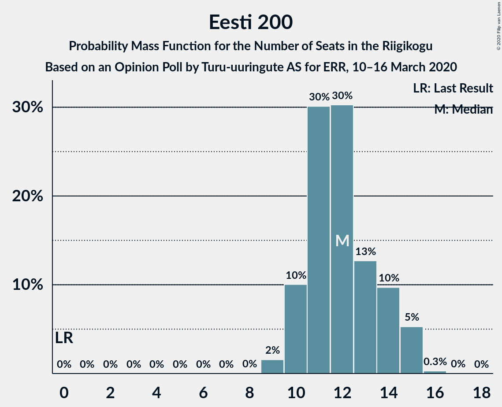
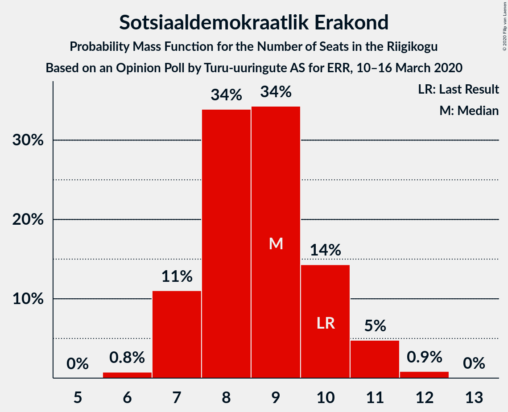
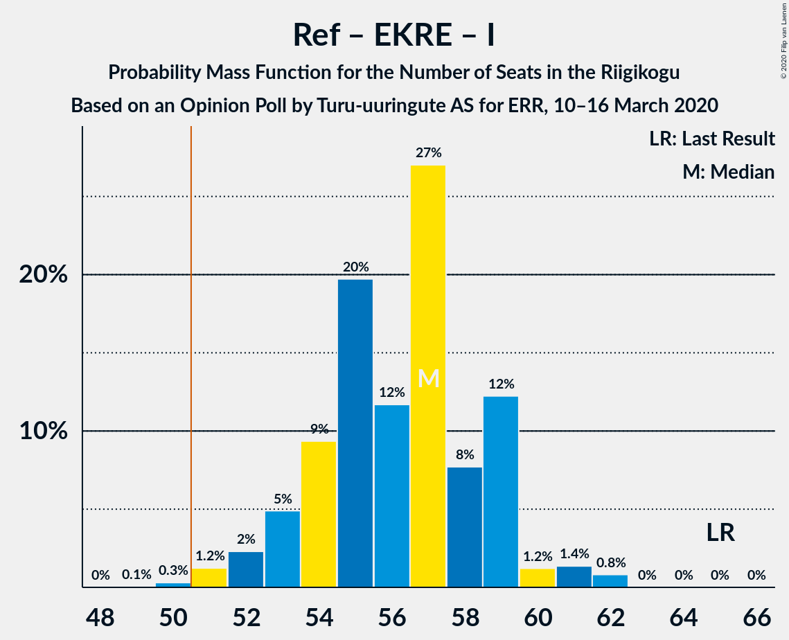

# Opinion Poll by Turu-uuringute AS for ERR, 10–16 March 2020

<a href="#voting-intentions">Voting Intentions</a> | <a href="#seats">Seats</a> | <a href="#coalitions">Coalitions</a> | <a href="#technical-information">Technical Information</a>

## Voting Intentions

### Confidence Intervals

| Party | Last Result | Poll Result | 80% Confidence Interval | 90% Confidence Interval | 95% Confidence Interval | 99% Confidence Interval |
|:-----:|:-----------:|:-----------:|:-----------------------:|:-----------------------:|:-----------------------:|:-----------------------:|
| Eesti Reformierakond | 28.9% | 26.2% | 24.5–28.0% |24.1–28.5% |23.7–29.0% |22.9–29.8% |
| Eesti Keskerakond | 23.1% | 22.2% | 20.6–23.9% |20.1–24.3% |19.8–24.8% |19.0–25.6% |
| Eesti Konservatiivne Rahvaerakond | 17.8% | 20.2% | 18.7–21.8% |18.2–22.3% |17.9–22.7% |17.1–23.5% |
| Eesti 200 | 4.4% | 12.1% | 10.9–13.5% |10.6–13.9% |10.3–14.2% |9.7–14.9% |
| Sotsiaaldemokraatlik Erakond | 9.8% | 9.1% | 8.0–10.3% |7.7–10.7% |7.5–11.0% |7.0–11.6% |
| Erakond Isamaa | 11.4% | 6.1% | 5.2–7.1% |5.0–7.4% |4.8–7.7% |4.4–8.2% |
| Erakond Eestimaa Rohelised | 1.8% | 3.0% | 2.5–3.8% |2.3–4.1% |2.1–4.3% |1.9–4.7% |
| Eesti Vabaerakond | 1.2% | 1.0% | 0.7–1.6% |0.7–1.7% |0.6–1.9% |0.5–2.1% |

*Note:* The poll result column reflects the actual value used in the calculations. Published results may vary slightly, and in addition be rounded to fewer digits.

## Seats

### Confidence Intervals

| Party | Last Result | Median | 80% Confidence Interval | 90% Confidence Interval | 95% Confidence Interval | 99% Confidence Interval |
|:-----:|:-----------:|:------:|:-----------------------:|:-----------------------:|:-----------------------:|:-----------------------:|
| <a href="#eesti-reformierakond">Eesti Reformierakond</a> | 34 | 29 | 27–31 |27–32 |26–33 |25–34 |
| <a href="#eesti-keskerakond">Eesti Keskerakond</a> | 26 | 25 | 21–26 |21–27 |21–27 |20–28 |
| <a href="#eesti-konservatiivne-rahvaerakond">Eesti Konservatiivne Rahvaerakond</a> | 19 | 22 | 19–24 |18–25 |18–25 |18–26 |
| <a href="#eesti-200">Eesti 200</a> | 0 | 12 | 10–14 |10–15 |10–15 |9–15 |
| <a href="#sotsiaaldemokraatlik-erakond">Sotsiaaldemokraatlik Erakond</a> | 10 | 9 | 7–10 |7–11 |7–11 |6–12 |
| <a href="#erakond-isamaa">Erakond Isamaa</a> | 12 | 5 | 4–6 |0–7 |0–7 |0–8 |
| <a href="#erakond-eestimaa-rohelised">Erakond Eestimaa Rohelised</a> | 0 | 0 | 0 |0 |0 |0 |
| <a href="#eesti-vabaerakond">Eesti Vabaerakond</a> | 0 | 0 | 0 |0 |0 |0 |

### Eesti Reformierakond

*For a full overview of the results for this party, see the [Eesti Reformierakond](party-eestireformierakond.html) page.*

| Number of Seats | Probability | Accumulated | Special Marks |
|:---------------:|:-----------:|:-----------:|:-------------:|
| 24 | 0.2% | 100% |  |
| 25 | 2% | 99.7% |  |
| 26 | 2% | 98% |  |
| 27 | 14% | 96% |  |
| 28 | 15% | 82% |  |
| 29 | 24% | 66% | Median |
| 30 | 21% | 42% |  |
| 31 | 12% | 22% |  |
| 32 | 6% | 10% |  |
| 33 | 2% | 4% |  |
| 34 | 1.3% | 2% | Last Result |
| 35 | 0.2% | 0.2% |  |
| 36 | 0% | 0% |  |

### Eesti Keskerakond

*For a full overview of the results for this party, see the [Eesti Keskerakond](party-eestikeskerakond.html) page.*

| Number of Seats | Probability | Accumulated | Special Marks |
|:---------------:|:-----------:|:-----------:|:-------------:|
| 19 | 0.1% | 100% |  |
| 20 | 2% | 99.9% |  |
| 21 | 9% | 98% |  |
| 22 | 11% | 89% |  |
| 23 | 13% | 79% |  |
| 24 | 14% | 65% |  |
| 25 | 32% | 52% | Median |
| 26 | 12% | 20% | Last Result |
| 27 | 5% | 7% |  |
| 28 | 1.4% | 2% |  |
| 29 | 0.3% | 0.4% |  |
| 30 | 0.1% | 0.1% |  |
| 31 | 0% | 0% |  |

### Eesti Konservatiivne Rahvaerakond

*For a full overview of the results for this party, see the [Eesti Konservatiivne Rahvaerakond](party-eestikonservatiivnerahvaerakond.html) page.*

| Number of Seats | Probability | Accumulated | Special Marks |
|:---------------:|:-----------:|:-----------:|:-------------:|
| 17 | 0.2% | 100% |  |
| 18 | 5% | 99.8% |  |
| 19 | 6% | 94% | Last Result |
| 20 | 10% | 88% |  |
| 21 | 17% | 79% |  |
| 22 | 20% | 61% | Median |
| 23 | 20% | 41% |  |
| 24 | 16% | 22% |  |
| 25 | 5% | 6% |  |
| 26 | 1.0% | 1.1% |  |
| 27 | 0.1% | 0.1% |  |
| 28 | 0% | 0% |  |

### Eesti 200

*For a full overview of the results for this party, see the [Eesti 200](party-eesti200.html) page.*

| Number of Seats | Probability | Accumulated | Special Marks |
|:---------------:|:-----------:|:-----------:|:-------------:|
| 0 | 0% | 100% | Last Result |
| 1 | 0% | 100% |  |
| 2 | 0% | 100% |  |
| 3 | 0% | 100% |  |
| 4 | 0% | 100% |  |
| 5 | 0% | 100% |  |
| 6 | 0% | 100% |  |
| 7 | 0% | 100% |  |
| 8 | 0% | 100% |  |
| 9 | 2% | 100% |  |
| 10 | 10% | 98% |  |
| 11 | 30% | 88% |  |
| 12 | 30% | 58% | Median |
| 13 | 13% | 28% |  |
| 14 | 10% | 15% |  |
| 15 | 5% | 6% |  |
| 16 | 0.3% | 0.3% |  |
| 17 | 0% | 0% |  |

### Sotsiaaldemokraatlik Erakond

*For a full overview of the results for this party, see the [Sotsiaaldemokraatlik Erakond](party-sotsiaaldemokraatlikerakond.html) page.*

| Number of Seats | Probability | Accumulated | Special Marks |
|:---------------:|:-----------:|:-----------:|:-------------:|
| 6 | 0.8% | 100% |  |
| 7 | 11% | 99.2% |  |
| 8 | 34% | 88% |  |
| 9 | 34% | 54% | Median |
| 10 | 14% | 20% | Last Result |
| 11 | 5% | 6% |  |
| 12 | 0.9% | 0.9% |  |
| 13 | 0% | 0% |  |

### Erakond Isamaa

*For a full overview of the results for this party, see the [Erakond Isamaa](party-erakondisamaa.html) page.*

| Number of Seats | Probability | Accumulated | Special Marks |
|:---------------:|:-----------:|:-----------:|:-------------:|
| 0 | 7% | 100% |  |
| 1 | 0% | 93% |  |
| 2 | 0% | 93% |  |
| 3 | 0% | 93% |  |
| 4 | 5% | 93% |  |
| 5 | 50% | 89% | Median |
| 6 | 30% | 39% |  |
| 7 | 8% | 9% |  |
| 8 | 1.2% | 1.2% |  |
| 9 | 0% | 0% |  |
| 10 | 0% | 0% |  |
| 11 | 0% | 0% |  |
| 12 | 0% | 0% | Last Result |

### Erakond Eestimaa Rohelised

*For a full overview of the results for this party, see the [Erakond Eestimaa Rohelised](party-erakondeestimaarohelised.html) page.*

| Number of Seats | Probability | Accumulated | Special Marks |
|:---------------:|:-----------:|:-----------:|:-------------:|
| 0 | 99.9% | 100% | Last Result, Median |
| 1 | 0% | 0.1% |  |
| 2 | 0% | 0.1% |  |
| 3 | 0% | 0.1% |  |
| 4 | 0.1% | 0.1% |  |
| 5 | 0% | 0% |  |

### Eesti Vabaerakond

*For a full overview of the results for this party, see the [Eesti Vabaerakond](party-eestivabaerakond.html) page.*

| Number of Seats | Probability | Accumulated | Special Marks |
|:---------------:|:-----------:|:-----------:|:-------------:|
| 0 | 100% | 100% | Last Result, Median |

## Coalitions

### Confidence Intervals

| Coalition | Last Result | Median | Majority? | 80% Confidence Interval | 90% Confidence Interval | 95% Confidence Interval | 99% Confidence Interval |
|:---------:|:-----------:|:------:|:---------:|:-----------------------:|:-----------------------:|:-----------------------:|:-----------------------:|
| Eesti Reformierakond – Eesti Keskerakond – Eesti Konservatiivne Rahvaerakond | 79 | 75 | 100% | 73–78 | 72–79 | 72–81 | 71–81 |
| Eesti Reformierakond – Eesti Konservatiivne Rahvaerakond – Erakond Isamaa | 65 | 57 | 99.6% | 54–59 | 53–59 | 52–60 | 51–62 |
| Eesti Reformierakond – Eesti Keskerakond | 60 | 54 | 93% | 51–56 | 50–57 | 50–57 | 48–59 |
| Eesti Reformierakond – Eesti Konservatiivne Rahvaerakond | 53 | 51 | 56% | 49–54 | 47–55 | 47–56 | 46–57 |
| Eesti Keskerakond – Eesti Konservatiivne Rahvaerakond – Erakond Isamaa | 57 | 51 | 60% | 48–53 | 48–55 | 47–55 | 45–56 |
| Eesti Keskerakond – Eesti Konservatiivne Rahvaerakond | 45 | 46 | 1.2% | 43–49 | 42–50 | 42–50 | 41–51 |
| Eesti Reformierakond – Sotsiaaldemokraatlik Erakond – Erakond Isamaa – Eesti Vabaerakond | 56 | 43 | 0% | 40–46 | 40–46 | 39–47 | 37–48 |
| Eesti Reformierakond – Sotsiaaldemokraatlik Erakond – Erakond Isamaa | 56 | 43 | 0% | 40–46 | 40–46 | 39–47 | 37–48 |
| Eesti Reformierakond – Sotsiaaldemokraatlik Erakond | 44 | 38 | 0% | 36–40 | 35–41 | 34–42 | 33–44 |
| Eesti Keskerakond – Sotsiaaldemokraatlik Erakond – Erakond Isamaa | 48 | 38 | 0% | 35–40 | 34–41 | 33–42 | 32–43 |
| Eesti Reformierakond – Erakond Isamaa | 46 | 34 | 0% | 32–37 | 31–38 | 30–38 | 28–39 |
| Eesti Keskerakond – Sotsiaaldemokraatlik Erakond | 36 | 33 | 0% | 30–35 | 29–36 | 29–36 | 28–38 |
| Eesti Konservatiivne Rahvaerakond – Sotsiaaldemokraatlik Erakond | 29 | 31 | 0% | 28–33 | 27–34 | 27–34 | 26–35 |

### Eesti Reformierakond – Eesti Keskerakond – Eesti Konservatiivne Rahvaerakond

| Number of Seats | Probability | Accumulated | Special Marks |
|:---------------:|:-----------:|:-----------:|:-------------:|
| 69 | 0.1% | 100% |  |
| 70 | 0.4% | 99.9% |  |
| 71 | 1.5% | 99.5% |  |
| 72 | 6% | 98% |  |
| 73 | 11% | 92% |  |
| 74 | 17% | 81% |  |
| 75 | 19% | 63% |  |
| 76 | 19% | 44% | Median |
| 77 | 15% | 25% |  |
| 78 | 4% | 10% |  |
| 79 | 2% | 6% | Last Result |
| 80 | 0.8% | 4% |  |
| 81 | 3% | 3% |  |
| 82 | 0.2% | 0.2% |  |
| 83 | 0% | 0% |  |

### Eesti Reformierakond – Eesti Konservatiivne Rahvaerakond – Erakond Isamaa

| Number of Seats | Probability | Accumulated | Special Marks |
|:---------------:|:-----------:|:-----------:|:-------------:|
| 49 | 0.1% | 100% |  |
| 50 | 0.3% | 99.9% |  |
| 51 | 1.2% | 99.6% | Majority |
| 52 | 2% | 98% |  |
| 53 | 5% | 96% |  |
| 54 | 9% | 91% |  |
| 55 | 20% | 82% |  |
| 56 | 12% | 62% | Median |
| 57 | 27% | 50% |  |
| 58 | 8% | 23% |  |
| 59 | 12% | 16% |  |
| 60 | 1.2% | 3% |  |
| 61 | 1.4% | 2% |  |
| 62 | 0.8% | 0.8% |  |
| 63 | 0% | 0% |  |
| 64 | 0% | 0% |  |
| 65 | 0% | 0% | Last Result |

### Eesti Reformierakond – Eesti Keskerakond

| Number of Seats | Probability | Accumulated | Special Marks |
|:---------------:|:-----------:|:-----------:|:-------------:|
| 47 | 0.1% | 100% |  |
| 48 | 0.5% | 99.8% |  |
| 49 | 1.1% | 99.3% |  |
| 50 | 5% | 98% |  |
| 51 | 14% | 93% | Majority |
| 52 | 21% | 79% |  |
| 53 | 8% | 58% |  |
| 54 | 22% | 50% | Median |
| 55 | 13% | 28% |  |
| 56 | 5% | 15% |  |
| 57 | 8% | 9% |  |
| 58 | 1.0% | 2% |  |
| 59 | 0.6% | 0.8% |  |
| 60 | 0% | 0.1% | Last Result |
| 61 | 0.1% | 0.1% |  |
| 62 | 0% | 0% |  |

### Eesti Reformierakond – Eesti Konservatiivne Rahvaerakond

| Number of Seats | Probability | Accumulated | Special Marks |
|:---------------:|:-----------:|:-----------:|:-------------:|
| 45 | 0.2% | 100% |  |
| 46 | 2% | 99.8% |  |
| 47 | 4% | 98% |  |
| 48 | 4% | 94% |  |
| 49 | 12% | 90% |  |
| 50 | 22% | 78% |  |
| 51 | 12% | 56% | Median, Majority |
| 52 | 18% | 44% |  |
| 53 | 12% | 26% | Last Result |
| 54 | 8% | 15% |  |
| 55 | 3% | 7% |  |
| 56 | 4% | 4% |  |
| 57 | 0.3% | 0.5% |  |
| 58 | 0% | 0.2% |  |
| 59 | 0.2% | 0.2% |  |
| 60 | 0% | 0% |  |

### Eesti Keskerakond – Eesti Konservatiivne Rahvaerakond – Erakond Isamaa

| Number of Seats | Probability | Accumulated | Special Marks |
|:---------------:|:-----------:|:-----------:|:-------------:|
| 43 | 0% | 100% |  |
| 44 | 0.2% | 99.9% |  |
| 45 | 0.6% | 99.7% |  |
| 46 | 1.0% | 99.1% |  |
| 47 | 3% | 98% |  |
| 48 | 6% | 95% |  |
| 49 | 9% | 89% |  |
| 50 | 19% | 80% |  |
| 51 | 14% | 60% | Majority |
| 52 | 14% | 46% | Median |
| 53 | 23% | 32% |  |
| 54 | 4% | 9% |  |
| 55 | 4% | 5% |  |
| 56 | 0.9% | 1.3% |  |
| 57 | 0.4% | 0.5% | Last Result |
| 58 | 0% | 0% |  |

### Eesti Keskerakond – Eesti Konservatiivne Rahvaerakond

| Number of Seats | Probability | Accumulated | Special Marks |
|:---------------:|:-----------:|:-----------:|:-------------:|
| 40 | 0.4% | 100% |  |
| 41 | 0.6% | 99.5% |  |
| 42 | 4% | 99.0% |  |
| 43 | 6% | 95% |  |
| 44 | 15% | 89% |  |
| 45 | 16% | 74% | Last Result |
| 46 | 17% | 58% |  |
| 47 | 11% | 42% | Median |
| 48 | 21% | 31% |  |
| 49 | 5% | 10% |  |
| 50 | 4% | 5% |  |
| 51 | 0.9% | 1.2% | Majority |
| 52 | 0.2% | 0.3% |  |
| 53 | 0.1% | 0.1% |  |
| 54 | 0% | 0% |  |

### Eesti Reformierakond – Sotsiaaldemokraatlik Erakond – Erakond Isamaa – Eesti Vabaerakond

| Number of Seats | Probability | Accumulated | Special Marks |
|:---------------:|:-----------:|:-----------:|:-------------:|
| 35 | 0.1% | 100% |  |
| 36 | 0.1% | 99.9% |  |
| 37 | 0.4% | 99.8% |  |
| 38 | 0.8% | 99.4% |  |
| 39 | 3% | 98.6% |  |
| 40 | 8% | 96% |  |
| 41 | 11% | 88% |  |
| 42 | 18% | 77% |  |
| 43 | 14% | 59% | Median |
| 44 | 22% | 45% |  |
| 45 | 13% | 23% |  |
| 46 | 7% | 10% |  |
| 47 | 2% | 3% |  |
| 48 | 0.9% | 1.1% |  |
| 49 | 0.1% | 0.2% |  |
| 50 | 0% | 0% |  |
| 51 | 0% | 0% | Majority |
| 52 | 0% | 0% |  |
| 53 | 0% | 0% |  |
| 54 | 0% | 0% |  |
| 55 | 0% | 0% |  |
| 56 | 0% | 0% | Last Result |

### Eesti Reformierakond – Sotsiaaldemokraatlik Erakond – Erakond Isamaa

| Number of Seats | Probability | Accumulated | Special Marks |
|:---------------:|:-----------:|:-----------:|:-------------:|
| 35 | 0.1% | 100% |  |
| 36 | 0.1% | 99.9% |  |
| 37 | 0.4% | 99.8% |  |
| 38 | 0.8% | 99.4% |  |
| 39 | 3% | 98.6% |  |
| 40 | 8% | 96% |  |
| 41 | 11% | 88% |  |
| 42 | 18% | 77% |  |
| 43 | 14% | 59% | Median |
| 44 | 22% | 45% |  |
| 45 | 13% | 23% |  |
| 46 | 7% | 10% |  |
| 47 | 2% | 3% |  |
| 48 | 0.9% | 1.1% |  |
| 49 | 0.1% | 0.2% |  |
| 50 | 0% | 0% |  |
| 51 | 0% | 0% | Majority |
| 52 | 0% | 0% |  |
| 53 | 0% | 0% |  |
| 54 | 0% | 0% |  |
| 55 | 0% | 0% |  |
| 56 | 0% | 0% | Last Result |

### Eesti Reformierakond – Sotsiaaldemokraatlik Erakond

| Number of Seats | Probability | Accumulated | Special Marks |
|:---------------:|:-----------:|:-----------:|:-------------:|
| 32 | 0.1% | 100% |  |
| 33 | 0.8% | 99.9% |  |
| 34 | 4% | 99.1% |  |
| 35 | 4% | 95% |  |
| 36 | 13% | 91% |  |
| 37 | 22% | 78% |  |
| 38 | 18% | 56% | Median |
| 39 | 21% | 38% |  |
| 40 | 9% | 17% |  |
| 41 | 4% | 9% |  |
| 42 | 2% | 4% |  |
| 43 | 1.3% | 2% |  |
| 44 | 0.5% | 0.7% | Last Result |
| 45 | 0.1% | 0.1% |  |
| 46 | 0% | 0% |  |

### Eesti Keskerakond – Sotsiaaldemokraatlik Erakond – Erakond Isamaa

| Number of Seats | Probability | Accumulated | Special Marks |
|:---------------:|:-----------:|:-----------:|:-------------:|
| 30 | 0.2% | 100% |  |
| 31 | 0.1% | 99.8% |  |
| 32 | 0.5% | 99.7% |  |
| 33 | 3% | 99.2% |  |
| 34 | 3% | 96% |  |
| 35 | 9% | 94% |  |
| 36 | 9% | 85% |  |
| 37 | 14% | 75% |  |
| 38 | 21% | 61% |  |
| 39 | 13% | 40% | Median |
| 40 | 17% | 27% |  |
| 41 | 6% | 10% |  |
| 42 | 4% | 4% |  |
| 43 | 0.6% | 0.7% |  |
| 44 | 0.1% | 0.1% |  |
| 45 | 0% | 0% |  |
| 46 | 0% | 0% |  |
| 47 | 0% | 0% |  |
| 48 | 0% | 0% | Last Result |

### Eesti Reformierakond – Erakond Isamaa

| Number of Seats | Probability | Accumulated | Special Marks |
|:---------------:|:-----------:|:-----------:|:-------------:|
| 26 | 0.1% | 100% |  |
| 27 | 0.2% | 99.9% |  |
| 28 | 0.6% | 99.7% |  |
| 29 | 0.5% | 99.1% |  |
| 30 | 1.1% | 98.6% |  |
| 31 | 3% | 97% |  |
| 32 | 14% | 95% |  |
| 33 | 11% | 81% |  |
| 34 | 23% | 70% | Median |
| 35 | 19% | 46% |  |
| 36 | 15% | 28% |  |
| 37 | 7% | 12% |  |
| 38 | 4% | 5% |  |
| 39 | 1.1% | 1.3% |  |
| 40 | 0.2% | 0.3% |  |
| 41 | 0% | 0% |  |
| 42 | 0% | 0% |  |
| 43 | 0% | 0% |  |
| 44 | 0% | 0% |  |
| 45 | 0% | 0% |  |
| 46 | 0% | 0% | Last Result |

### Eesti Keskerakond – Sotsiaaldemokraatlik Erakond

| Number of Seats | Probability | Accumulated | Special Marks |
|:---------------:|:-----------:|:-----------:|:-------------:|
| 27 | 0.1% | 100% |  |
| 28 | 1.2% | 99.9% |  |
| 29 | 4% | 98.7% |  |
| 30 | 9% | 95% |  |
| 31 | 12% | 86% |  |
| 32 | 15% | 74% |  |
| 33 | 21% | 59% |  |
| 34 | 19% | 38% | Median |
| 35 | 9% | 18% |  |
| 36 | 7% | 9% | Last Result |
| 37 | 1.0% | 2% |  |
| 38 | 0.6% | 0.7% |  |
| 39 | 0.1% | 0.1% |  |
| 40 | 0% | 0% |  |

### Eesti Konservatiivne Rahvaerakond – Sotsiaaldemokraatlik Erakond

| Number of Seats | Probability | Accumulated | Special Marks |
|:---------------:|:-----------:|:-----------:|:-------------:|
| 25 | 0.2% | 100% |  |
| 26 | 2% | 99.8% |  |
| 27 | 7% | 98% |  |
| 28 | 8% | 90% |  |
| 29 | 10% | 82% | Last Result |
| 30 | 15% | 72% |  |
| 31 | 20% | 57% | Median |
| 32 | 20% | 37% |  |
| 33 | 12% | 18% |  |
| 34 | 5% | 6% |  |
| 35 | 0.8% | 1.0% |  |
| 36 | 0.2% | 0.3% |  |
| 37 | 0% | 0% |  |

## Technical Information

### Opinion Poll

+ **Polling firm:** Turu-uuringute AS
+ **Commissioner(s):** ERR
+ **Fieldwork period:** 10–16 March 2020

### Calculations

+ **Sample size:** 1056
+ **Simulations done:** 524,288
+ **Error estimate:** 1.69%

