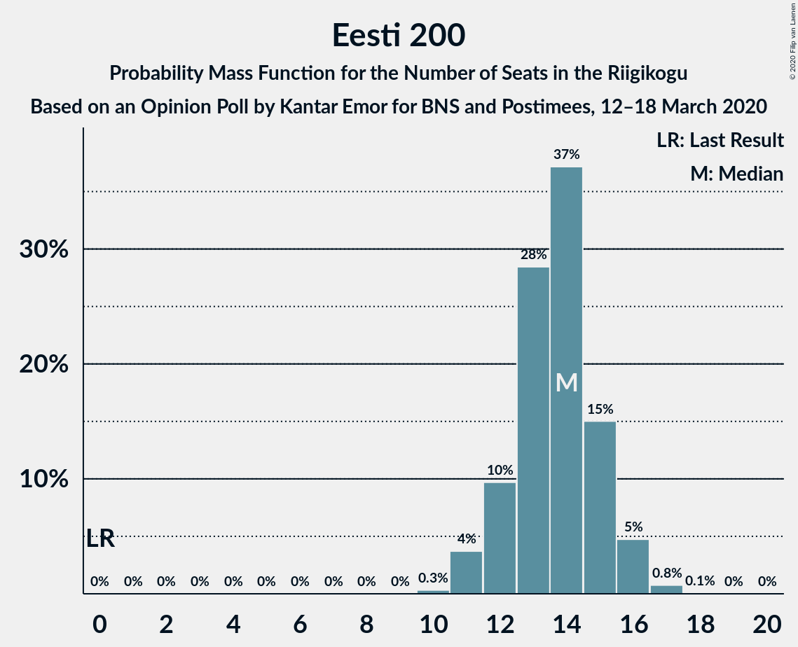
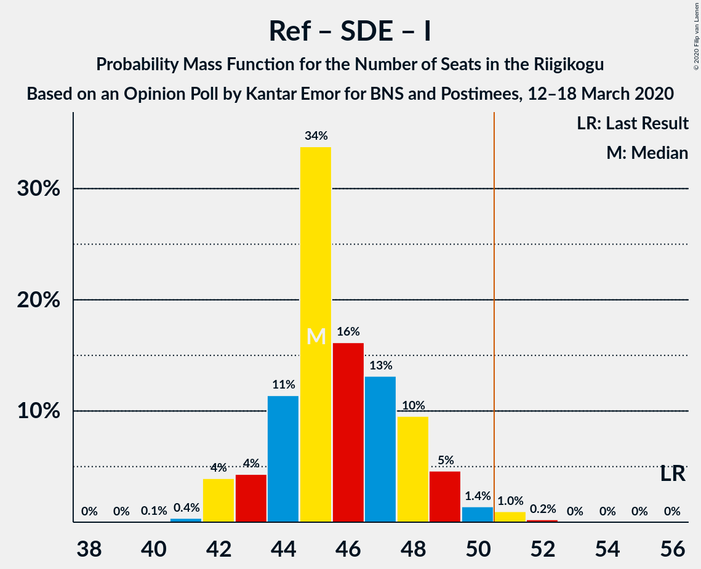
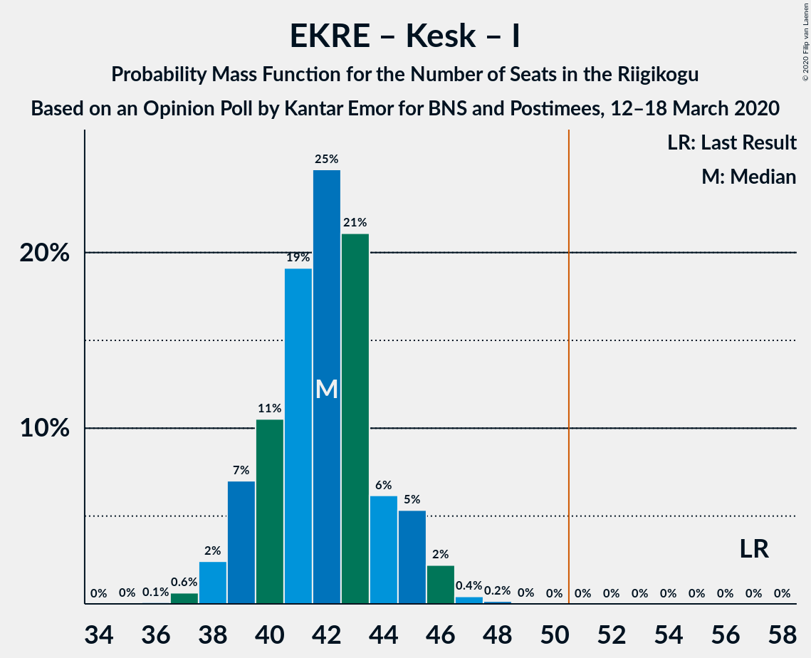

# Opinion Poll by Kantar Emor for BNS and Postimees, 12–18 March 2020

<a href="#voting-intentions">Voting Intentions</a> | <a href="#seats">Seats</a> | <a href="#coalitions">Coalitions</a> | <a href="#technical-information">Technical Information</a>

## Voting Intentions

### Confidence Intervals

| Party | Last Result | Poll Result | 80% Confidence Interval | 90% Confidence Interval | 95% Confidence Interval | 99% Confidence Interval |
|:-----:|:-----------:|:-----------:|:-----------------------:|:-----------------------:|:-----------------------:|:-----------------------:|
| Eesti Reformierakond | 28.9% | 28.9% | 27.2–30.7% |26.7–31.2% |26.3–31.6% |25.5–32.5% |
| Eesti Konservatiivne Rahvaerakond | 17.8% | 20.9% | 19.4–22.6% |19.0–23.0% |18.6–23.4% |17.9–24.2% |
| Eesti Keskerakond | 23.1% | 17.0% | 15.6–18.5% |15.2–18.9% |14.9–19.3% |14.3–20.1% |
| Eesti 200 | 4.4% | 13.0% | 11.8–14.3% |11.4–14.7% |11.1–15.1% |10.6–15.8% |
| Sotsiaaldemokraatlik Erakond | 9.8% | 12.0% | 10.8–13.3% |10.5–13.7% |10.2–14.0% |9.7–14.7% |
| Erakond Isamaa | 11.4% | 4.0% | 3.4–4.9% |3.2–5.1% |3.0–5.3% |2.7–5.8% |
| Erakond Eestimaa Rohelised | 1.8% | 3.0% | 2.4–3.7% |2.2–3.9% |2.1–4.1% |1.9–4.5% |
| Eesti Vabaerakond | 1.2% | 0.3% | 0.2–0.6% |0.1–0.7% |0.1–0.8% |0.0–1.0% |

*Note:* The poll result column reflects the actual value used in the calculations. Published results may vary slightly, and in addition be rounded to fewer digits.

## Seats

### Confidence Intervals

| Party | Last Result | Median | 80% Confidence Interval | 90% Confidence Interval | 95% Confidence Interval | 99% Confidence Interval |
|:-----:|:-----------:|:------:|:-----------------------:|:-----------------------:|:-----------------------:|:-----------------------:|
| <a href="#eesti-reformierakond">Eesti Reformierakond</a> | 34 | 33 | 31–35 |31–36 |30–36 |29–38 |
| <a href="#eesti-konservatiivne-rahvaerakond">Eesti Konservatiivne Rahvaerakond</a> | 19 | 24 | 22–25 |21–26 |21–26 |20–27 |
| <a href="#eesti-keskerakond">Eesti Keskerakond</a> | 26 | 18 | 17–20 |16–20 |16–21 |15–22 |
| <a href="#eesti-200">Eesti 200</a> | 0 | 14 | 12–15 |12–16 |11–16 |11–17 |
| <a href="#sotsiaaldemokraatlik-erakond">Sotsiaaldemokraatlik Erakond</a> | 10 | 12 | 11–14 |11–14 |10–15 |10–16 |
| <a href="#erakond-isamaa">Erakond Isamaa</a> | 12 | 0 | 0 |0–4 |0–5 |0–5 |
| <a href="#erakond-eestimaa-rohelised">Erakond Eestimaa Rohelised</a> | 0 | 0 | 0 |0 |0 |0 |
| <a href="#eesti-vabaerakond">Eesti Vabaerakond</a> | 0 | 0 | 0 |0 |0 |0 |

### Eesti Reformierakond

*For a full overview of the results for this party, see the [Eesti Reformierakond](party-eestireformierakond.html) page.*

| Number of Seats | Probability | Accumulated | Special Marks |
|:---------------:|:-----------:|:-----------:|:-------------:|
| 28 | 0.1% | 100% |  |
| 29 | 2% | 99.8% |  |
| 30 | 3% | 98% |  |
| 31 | 8% | 96% |  |
| 32 | 23% | 87% |  |
| 33 | 18% | 64% | Median |
| 34 | 24% | 47% | Last Result |
| 35 | 14% | 23% |  |
| 36 | 6% | 9% |  |
| 37 | 2% | 2% |  |
| 38 | 0.8% | 0.9% |  |
| 39 | 0.1% | 0.1% |  |
| 40 | 0% | 0% |  |

### Eesti Konservatiivne Rahvaerakond

*For a full overview of the results for this party, see the [Eesti Konservatiivne Rahvaerakond](party-eestikonservatiivnerahvaerakond.html) page.*

| Number of Seats | Probability | Accumulated | Special Marks |
|:---------------:|:-----------:|:-----------:|:-------------:|
| 19 | 0.4% | 100% | Last Result |
| 20 | 1.5% | 99.5% |  |
| 21 | 7% | 98% |  |
| 22 | 20% | 91% |  |
| 23 | 21% | 71% |  |
| 24 | 32% | 51% | Median |
| 25 | 9% | 18% |  |
| 26 | 7% | 9% |  |
| 27 | 1.4% | 2% |  |
| 28 | 0.4% | 0.5% |  |
| 29 | 0.1% | 0.1% |  |
| 30 | 0% | 0% |  |

### Eesti Keskerakond

*For a full overview of the results for this party, see the [Eesti Keskerakond](party-eestikeskerakond.html) page.*

| Number of Seats | Probability | Accumulated | Special Marks |
|:---------------:|:-----------:|:-----------:|:-------------:|
| 14 | 0.2% | 100% |  |
| 15 | 2% | 99.8% |  |
| 16 | 8% | 98% |  |
| 17 | 17% | 90% |  |
| 18 | 32% | 73% | Median |
| 19 | 26% | 41% |  |
| 20 | 10% | 15% |  |
| 21 | 4% | 5% |  |
| 22 | 0.8% | 0.9% |  |
| 23 | 0.1% | 0.2% |  |
| 24 | 0% | 0% |  |
| 25 | 0% | 0% |  |
| 26 | 0% | 0% | Last Result |

### Eesti 200

*For a full overview of the results for this party, see the [Eesti 200](party-eesti200.html) page.*

| Number of Seats | Probability | Accumulated | Special Marks |
|:---------------:|:-----------:|:-----------:|:-------------:|
| 0 | 0% | 100% | Last Result |
| 1 | 0% | 100% |  |
| 2 | 0% | 100% |  |
| 3 | 0% | 100% |  |
| 4 | 0% | 100% |  |
| 5 | 0% | 100% |  |
| 6 | 0% | 100% |  |
| 7 | 0% | 100% |  |
| 8 | 0% | 100% |  |
| 9 | 0% | 100% |  |
| 10 | 0.3% | 100% |  |
| 11 | 4% | 99.7% |  |
| 12 | 10% | 96% |  |
| 13 | 28% | 86% |  |
| 14 | 37% | 58% | Median |
| 15 | 15% | 21% |  |
| 16 | 5% | 6% |  |
| 17 | 0.8% | 0.9% |  |
| 18 | 0.1% | 0.1% |  |
| 19 | 0% | 0% |  |

### Sotsiaaldemokraatlik Erakond

*For a full overview of the results for this party, see the [Sotsiaaldemokraatlik Erakond](party-sotsiaaldemokraatlikerakond.html) page.*

| Number of Seats | Probability | Accumulated | Special Marks |
|:---------------:|:-----------:|:-----------:|:-------------:|
| 9 | 0.5% | 100% |  |
| 10 | 4% | 99.5% | Last Result |
| 11 | 31% | 96% |  |
| 12 | 21% | 65% | Median |
| 13 | 31% | 43% |  |
| 14 | 9% | 12% |  |
| 15 | 2% | 3% |  |
| 16 | 0.5% | 0.5% |  |
| 17 | 0% | 0.1% |  |
| 18 | 0% | 0% |  |

### Erakond Isamaa

*For a full overview of the results for this party, see the [Erakond Isamaa](party-erakondisamaa.html) page.*

| Number of Seats | Probability | Accumulated | Special Marks |
|:---------------:|:-----------:|:-----------:|:-------------:|
| 0 | 95% | 100% | Median |
| 1 | 0% | 5% |  |
| 2 | 0% | 5% |  |
| 3 | 0% | 5% |  |
| 4 | 3% | 5% |  |
| 5 | 3% | 3% |  |
| 6 | 0.1% | 0.1% |  |
| 7 | 0% | 0% |  |
| 8 | 0% | 0% |  |
| 9 | 0% | 0% |  |
| 10 | 0% | 0% |  |
| 11 | 0% | 0% |  |
| 12 | 0% | 0% | Last Result |

### Erakond Eestimaa Rohelised

*For a full overview of the results for this party, see the [Erakond Eestimaa Rohelised](party-erakondeestimaarohelised.html) page.*

| Number of Seats | Probability | Accumulated | Special Marks |
|:---------------:|:-----------:|:-----------:|:-------------:|
| 0 | 100% | 100% | Last Result, Median |

### Eesti Vabaerakond

*For a full overview of the results for this party, see the [Eesti Vabaerakond](party-eestivabaerakond.html) page.*

| Number of Seats | Probability | Accumulated | Special Marks |
|:---------------:|:-----------:|:-----------:|:-------------:|
| 0 | 100% | 100% | Last Result, Median |

## Coalitions

### Confidence Intervals

| Coalition | Last Result | Median | Majority? | 80% Confidence Interval | 90% Confidence Interval | 95% Confidence Interval | 99% Confidence Interval |
|:---------:|:-----------:|:------:|:---------:|:-----------------------:|:-----------------------:|:-----------------------:|:-----------------------:|
| Eesti Reformierakond – Eesti Konservatiivne Rahvaerakond – Eesti Keskerakond | 79 | 75 | 100% | 73–77 | 72–77 | 71–78 | 69–79 |
| Eesti Reformierakond – Eesti Konservatiivne Rahvaerakond – Erakond Isamaa | 65 | 57 | 100% | 54–59 | 54–60 | 54–61 | 52–62 |
| Eesti Reformierakond – Eesti Konservatiivne Rahvaerakond | 53 | 57 | 99.9% | 54–59 | 54–60 | 53–60 | 52–61 |
| Eesti Reformierakond – Eesti Keskerakond | 60 | 52 | 75% | 49–54 | 48–54 | 47–55 | 47–56 |
| Eesti Reformierakond – Sotsiaaldemokraatlik Erakond – Erakond Isamaa – Eesti Vabaerakond | 56 | 45 | 1.3% | 44–48 | 43–49 | 42–50 | 42–51 |
| Eesti Reformierakond – Sotsiaaldemokraatlik Erakond – Erakond Isamaa | 56 | 45 | 1.3% | 44–48 | 43–49 | 42–50 | 42–51 |
| Eesti Reformierakond – Sotsiaaldemokraatlik Erakond | 44 | 45 | 0.7% | 43–48 | 42–48 | 42–49 | 41–51 |
| Eesti Konservatiivne Rahvaerakond – Eesti Keskerakond – Erakond Isamaa | 57 | 42 | 0% | 39–44 | 39–45 | 38–46 | 37–47 |
| Eesti Konservatiivne Rahvaerakond – Eesti Keskerakond | 45 | 42 | 0% | 39–44 | 39–45 | 38–45 | 37–46 |
| Eesti Konservatiivne Rahvaerakond – Sotsiaaldemokraatlik Erakond | 29 | 35 | 0% | 33–38 | 33–38 | 32–39 | 31–40 |
| Eesti Reformierakond – Erakond Isamaa | 46 | 34 | 0% | 31–36 | 31–36 | 30–38 | 29–39 |
| Eesti Keskerakond – Sotsiaaldemokraatlik Erakond – Erakond Isamaa | 48 | 30 | 0% | 29–33 | 28–34 | 28–34 | 27–36 |
| Eesti Keskerakond – Sotsiaaldemokraatlik Erakond | 36 | 30 | 0% | 28–33 | 28–33 | 27–34 | 26–35 |

### Eesti Reformierakond – Eesti Konservatiivne Rahvaerakond – Eesti Keskerakond

| Number of Seats | Probability | Accumulated | Special Marks |
|:---------------:|:-----------:|:-----------:|:-------------:|
| 68 | 0.2% | 100% |  |
| 69 | 0.5% | 99.8% |  |
| 70 | 0.3% | 99.3% |  |
| 71 | 2% | 99.0% |  |
| 72 | 6% | 97% |  |
| 73 | 11% | 91% |  |
| 74 | 16% | 80% |  |
| 75 | 22% | 64% | Median |
| 76 | 29% | 42% |  |
| 77 | 8% | 13% |  |
| 78 | 4% | 5% |  |
| 79 | 0.8% | 0.9% | Last Result |
| 80 | 0.1% | 0.1% |  |
| 81 | 0% | 0% |  |

### Eesti Reformierakond – Eesti Konservatiivne Rahvaerakond – Erakond Isamaa

| Number of Seats | Probability | Accumulated | Special Marks |
|:---------------:|:-----------:|:-----------:|:-------------:|
| 51 | 0.1% | 100% | Majority |
| 52 | 0.5% | 99.9% |  |
| 53 | 2% | 99.4% |  |
| 54 | 9% | 98% |  |
| 55 | 9% | 89% |  |
| 56 | 22% | 80% |  |
| 57 | 19% | 58% | Median |
| 58 | 24% | 40% |  |
| 59 | 8% | 16% |  |
| 60 | 5% | 8% |  |
| 61 | 2% | 3% |  |
| 62 | 0.7% | 0.9% |  |
| 63 | 0.3% | 0.3% |  |
| 64 | 0% | 0% |  |
| 65 | 0% | 0% | Last Result |

### Eesti Reformierakond – Eesti Konservatiivne Rahvaerakond

| Number of Seats | Probability | Accumulated | Special Marks |
|:---------------:|:-----------:|:-----------:|:-------------:|
| 50 | 0.1% | 100% |  |
| 51 | 0.3% | 99.9% | Majority |
| 52 | 0.7% | 99.6% |  |
| 53 | 4% | 98.9% | Last Result |
| 54 | 9% | 95% |  |
| 55 | 10% | 86% |  |
| 56 | 22% | 76% |  |
| 57 | 18% | 54% | Median |
| 58 | 24% | 36% |  |
| 59 | 7% | 13% |  |
| 60 | 4% | 6% |  |
| 61 | 1.4% | 2% |  |
| 62 | 0.4% | 0.4% |  |
| 63 | 0% | 0% |  |

### Eesti Reformierakond – Eesti Keskerakond

| Number of Seats | Probability | Accumulated | Special Marks |
|:---------------:|:-----------:|:-----------:|:-------------:|
| 45 | 0.1% | 100% |  |
| 46 | 0.3% | 99.9% |  |
| 47 | 3% | 99.7% |  |
| 48 | 3% | 97% |  |
| 49 | 8% | 95% |  |
| 50 | 12% | 87% |  |
| 51 | 24% | 75% | Median, Majority |
| 52 | 25% | 51% |  |
| 53 | 14% | 26% |  |
| 54 | 8% | 12% |  |
| 55 | 3% | 5% |  |
| 56 | 1.0% | 1.4% |  |
| 57 | 0.3% | 0.4% |  |
| 58 | 0.1% | 0.1% |  |
| 59 | 0% | 0% |  |
| 60 | 0% | 0% | Last Result |

### Eesti Reformierakond – Sotsiaaldemokraatlik Erakond – Erakond Isamaa – Eesti Vabaerakond

| Number of Seats | Probability | Accumulated | Special Marks |
|:---------------:|:-----------:|:-----------:|:-------------:|
| 40 | 0.1% | 100% |  |
| 41 | 0.4% | 99.9% |  |
| 42 | 4% | 99.5% |  |
| 43 | 4% | 96% |  |
| 44 | 11% | 91% |  |
| 45 | 34% | 80% | Median |
| 46 | 16% | 46% |  |
| 47 | 13% | 30% |  |
| 48 | 10% | 17% |  |
| 49 | 5% | 7% |  |
| 50 | 1.4% | 3% |  |
| 51 | 1.0% | 1.3% | Majority |
| 52 | 0.2% | 0.3% |  |
| 53 | 0% | 0% |  |
| 54 | 0% | 0% |  |
| 55 | 0% | 0% |  |
| 56 | 0% | 0% | Last Result |

### Eesti Reformierakond – Sotsiaaldemokraatlik Erakond – Erakond Isamaa

| Number of Seats | Probability | Accumulated | Special Marks |
|:---------------:|:-----------:|:-----------:|:-------------:|
| 40 | 0.1% | 100% |  |
| 41 | 0.4% | 99.9% |  |
| 42 | 4% | 99.5% |  |
| 43 | 4% | 96% |  |
| 44 | 11% | 91% |  |
| 45 | 34% | 80% | Median |
| 46 | 16% | 46% |  |
| 47 | 13% | 30% |  |
| 48 | 10% | 17% |  |
| 49 | 5% | 7% |  |
| 50 | 1.4% | 3% |  |
| 51 | 1.0% | 1.3% | Majority |
| 52 | 0.2% | 0.3% |  |
| 53 | 0% | 0% |  |
| 54 | 0% | 0% |  |
| 55 | 0% | 0% |  |
| 56 | 0% | 0% | Last Result |

### Eesti Reformierakond – Sotsiaaldemokraatlik Erakond

| Number of Seats | Probability | Accumulated | Special Marks |
|:---------------:|:-----------:|:-----------:|:-------------:|
| 39 | 0.1% | 100% |  |
| 40 | 0.2% | 99.9% |  |
| 41 | 1.3% | 99.7% |  |
| 42 | 5% | 98% |  |
| 43 | 5% | 94% |  |
| 44 | 12% | 89% | Last Result |
| 45 | 34% | 76% | Median |
| 46 | 16% | 42% |  |
| 47 | 13% | 27% |  |
| 48 | 9% | 14% |  |
| 49 | 4% | 5% |  |
| 50 | 0.7% | 1.4% |  |
| 51 | 0.6% | 0.7% | Majority |
| 52 | 0.1% | 0.1% |  |
| 53 | 0% | 0% |  |

### Eesti Konservatiivne Rahvaerakond – Eesti Keskerakond – Erakond Isamaa

| Number of Seats | Probability | Accumulated | Special Marks |
|:---------------:|:-----------:|:-----------:|:-------------:|
| 36 | 0.1% | 100% |  |
| 37 | 0.6% | 99.9% |  |
| 38 | 2% | 99.3% |  |
| 39 | 7% | 97% |  |
| 40 | 11% | 90% |  |
| 41 | 19% | 79% |  |
| 42 | 25% | 60% | Median |
| 43 | 21% | 35% |  |
| 44 | 6% | 14% |  |
| 45 | 5% | 8% |  |
| 46 | 2% | 3% |  |
| 47 | 0.4% | 0.6% |  |
| 48 | 0.2% | 0.2% |  |
| 49 | 0% | 0.1% |  |
| 50 | 0% | 0% |  |
| 51 | 0% | 0% | Majority |
| 52 | 0% | 0% |  |
| 53 | 0% | 0% |  |
| 54 | 0% | 0% |  |
| 55 | 0% | 0% |  |
| 56 | 0% | 0% |  |
| 57 | 0% | 0% | Last Result |

### Eesti Konservatiivne Rahvaerakond – Eesti Keskerakond

| Number of Seats | Probability | Accumulated | Special Marks |
|:---------------:|:-----------:|:-----------:|:-------------:|
| 35 | 0.1% | 100% |  |
| 36 | 0.2% | 99.9% |  |
| 37 | 1.0% | 99.8% |  |
| 38 | 3% | 98.8% |  |
| 39 | 8% | 96% |  |
| 40 | 12% | 88% |  |
| 41 | 19% | 76% |  |
| 42 | 25% | 56% | Median |
| 43 | 20% | 31% |  |
| 44 | 5% | 11% |  |
| 45 | 4% | 6% | Last Result |
| 46 | 1.2% | 1.4% |  |
| 47 | 0.2% | 0.2% |  |
| 48 | 0.1% | 0.1% |  |
| 49 | 0% | 0% |  |

### Eesti Konservatiivne Rahvaerakond – Sotsiaaldemokraatlik Erakond

| Number of Seats | Probability | Accumulated | Special Marks |
|:---------------:|:-----------:|:-----------:|:-------------:|
| 29 | 0% | 100% | Last Result |
| 30 | 0.2% | 100% |  |
| 31 | 0.8% | 99.8% |  |
| 32 | 2% | 99.0% |  |
| 33 | 8% | 97% |  |
| 34 | 13% | 89% |  |
| 35 | 27% | 76% |  |
| 36 | 16% | 49% | Median |
| 37 | 22% | 33% |  |
| 38 | 7% | 11% |  |
| 39 | 3% | 4% |  |
| 40 | 1.2% | 1.5% |  |
| 41 | 0.2% | 0.2% |  |
| 42 | 0% | 0% |  |

### Eesti Reformierakond – Erakond Isamaa

| Number of Seats | Probability | Accumulated | Special Marks |
|:---------------:|:-----------:|:-----------:|:-------------:|
| 28 | 0.1% | 100% |  |
| 29 | 1.0% | 99.9% |  |
| 30 | 2% | 99.0% |  |
| 31 | 7% | 97% |  |
| 32 | 22% | 89% |  |
| 33 | 17% | 68% | Median |
| 34 | 24% | 51% |  |
| 35 | 14% | 27% |  |
| 36 | 8% | 13% |  |
| 37 | 2% | 5% |  |
| 38 | 2% | 3% |  |
| 39 | 0.6% | 0.8% |  |
| 40 | 0.2% | 0.2% |  |
| 41 | 0% | 0.1% |  |
| 42 | 0% | 0% |  |
| 43 | 0% | 0% |  |
| 44 | 0% | 0% |  |
| 45 | 0% | 0% |  |
| 46 | 0% | 0% | Last Result |

### Eesti Keskerakond – Sotsiaaldemokraatlik Erakond – Erakond Isamaa

| Number of Seats | Probability | Accumulated | Special Marks |
|:---------------:|:-----------:|:-----------:|:-------------:|
| 25 | 0.1% | 100% |  |
| 26 | 0.3% | 99.9% |  |
| 27 | 2% | 99.6% |  |
| 28 | 7% | 98% |  |
| 29 | 21% | 91% |  |
| 30 | 21% | 70% | Median |
| 31 | 14% | 49% |  |
| 32 | 19% | 35% |  |
| 33 | 10% | 16% |  |
| 34 | 3% | 5% |  |
| 35 | 1.0% | 2% |  |
| 36 | 0.4% | 0.8% |  |
| 37 | 0.4% | 0.4% |  |
| 38 | 0% | 0.1% |  |
| 39 | 0% | 0% |  |
| 40 | 0% | 0% |  |
| 41 | 0% | 0% |  |
| 42 | 0% | 0% |  |
| 43 | 0% | 0% |  |
| 44 | 0% | 0% |  |
| 45 | 0% | 0% |  |
| 46 | 0% | 0% |  |
| 47 | 0% | 0% |  |
| 48 | 0% | 0% | Last Result |

### Eesti Keskerakond – Sotsiaaldemokraatlik Erakond

| Number of Seats | Probability | Accumulated | Special Marks |
|:---------------:|:-----------:|:-----------:|:-------------:|
| 25 | 0.1% | 100% |  |
| 26 | 0.5% | 99.9% |  |
| 27 | 2% | 99.4% |  |
| 28 | 8% | 97% |  |
| 29 | 22% | 89% |  |
| 30 | 22% | 67% | Median |
| 31 | 14% | 44% |  |
| 32 | 18% | 30% |  |
| 33 | 9% | 12% |  |
| 34 | 2% | 3% |  |
| 35 | 0.7% | 0.8% |  |
| 36 | 0.2% | 0.2% | Last Result |
| 37 | 0% | 0% |  |

## Technical Information

### Opinion Poll

+ **Polling firm:** Kantar Emor
+ **Commissioner(s):** BNS and Postimees
+ **Fieldwork period:** 12–18 March 2020

### Calculations

+ **Sample size:** 1118
+ **Simulations done:** 524,288
+ **Error estimate:** 1.78%

