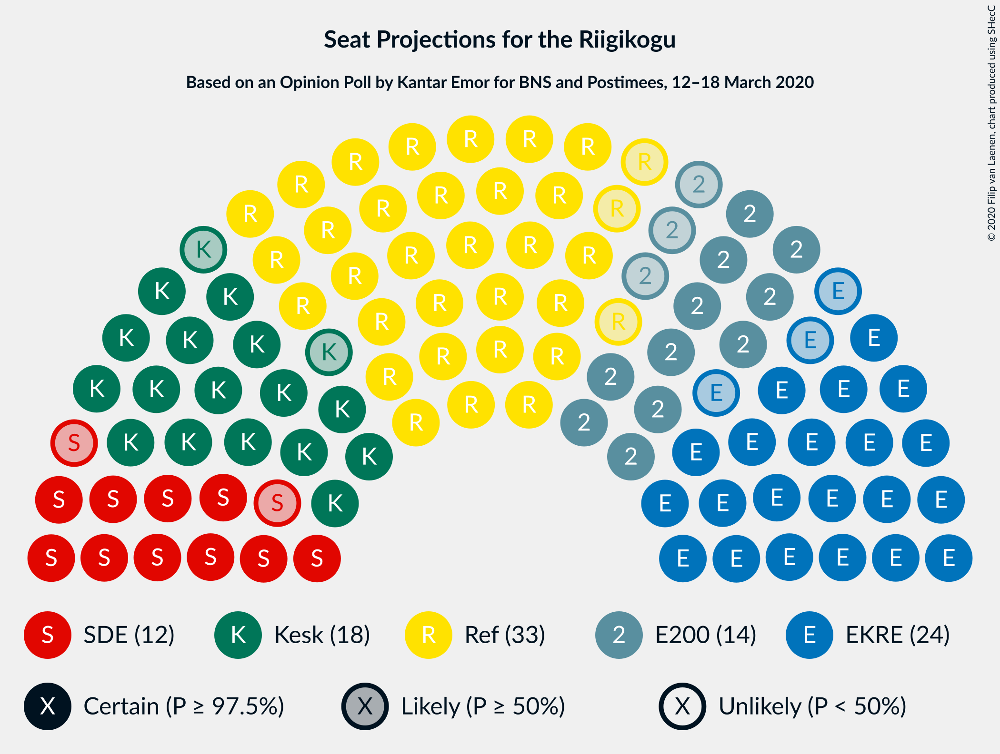
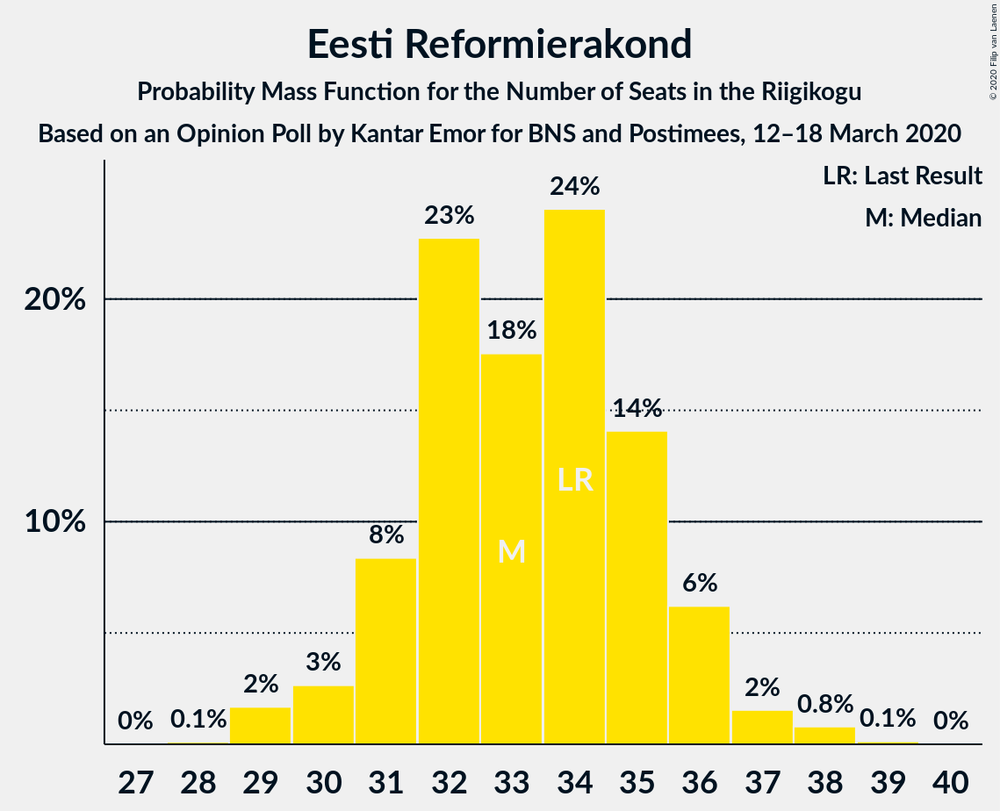
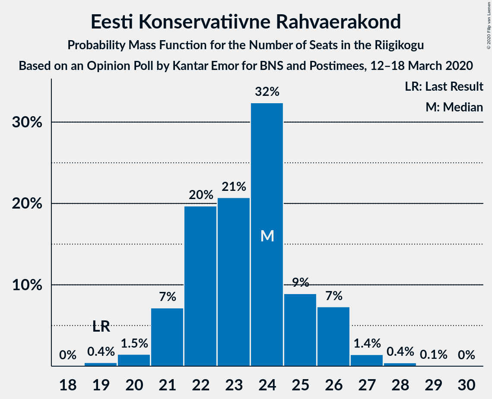
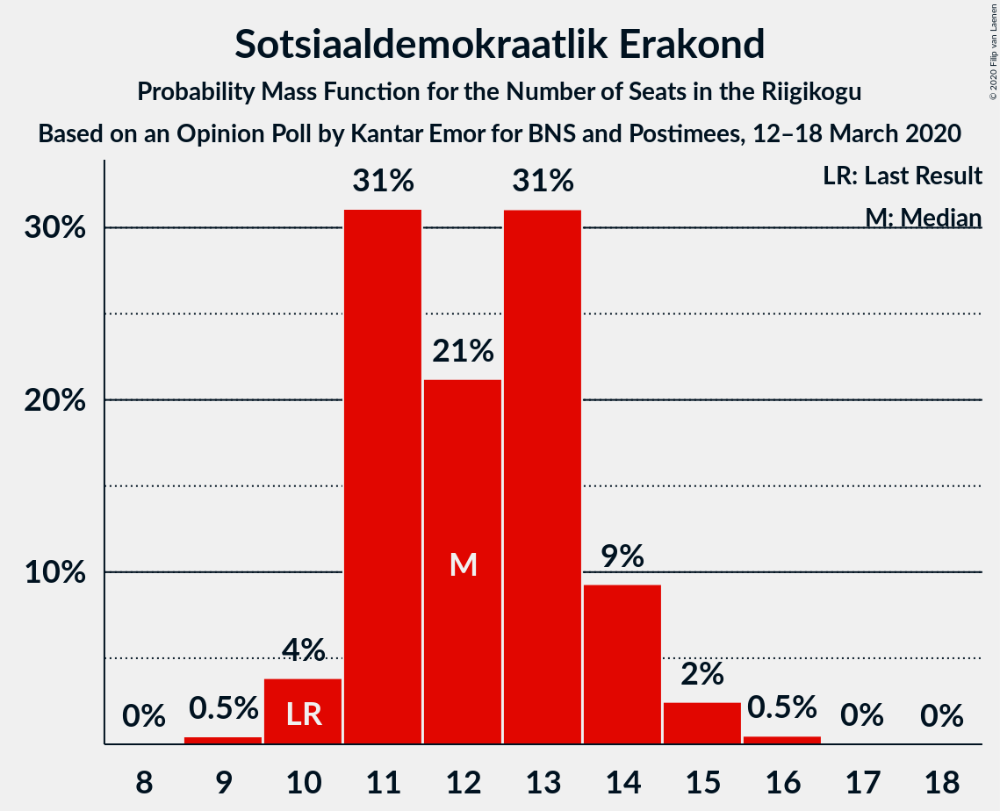
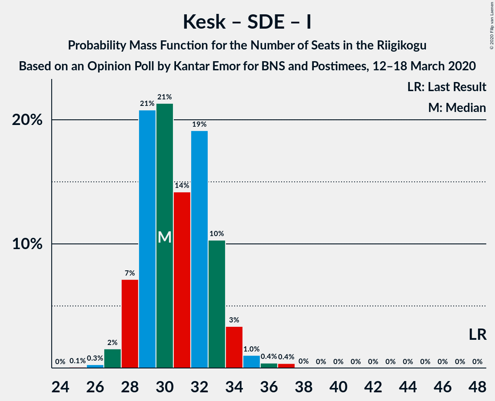

# Opinion Poll by Kantar Emor for BNS and Postimees, 12–18 March 2020

<a href="#voting-intentions">Voting Intentions</a> | <a href="#seats">Seats</a> | <a href="#coalitions">Coalitions</a> | <a href="#technical-information">Technical Information</a>

## Voting Intentions

### Confidence Intervals

| Party | Last Result | Poll Result | 80% Confidence Interval | 90% Confidence Interval | 95% Confidence Interval | 99% Confidence Interval |
|:-----:|:-----------:|:-----------:|:-----------------------:|:-----------------------:|:-----------------------:|:-----------------------:|
| Eesti Reformierakond | 28.9% | 28.9% | 27.2–30.7% |26.7–31.2% |26.3–31.6% |25.5–32.5% |
| Eesti Konservatiivne Rahvaerakond | 17.8% | 20.9% | 19.4–22.6% |19.0–23.0% |18.6–23.4% |17.9–24.2% |
| Eesti Keskerakond | 23.1% | 17.0% | 15.6–18.5% |15.2–18.9% |14.9–19.3% |14.3–20.1% |
| Eesti 200 | 4.4% | 13.0% | 11.8–14.3% |11.4–14.7% |11.1–15.1% |10.6–15.8% |
| Sotsiaaldemokraatlik Erakond | 9.8% | 12.0% | 10.8–13.3% |10.5–13.7% |10.2–14.0% |9.7–14.7% |
| Erakond Isamaa | 11.4% | 4.0% | 3.4–4.9% |3.2–5.1% |3.0–5.3% |2.7–5.8% |
| Erakond Eestimaa Rohelised | 1.8% | 3.0% | 2.4–3.7% |2.2–3.9% |2.1–4.1% |1.9–4.5% |
| Eesti Vabaerakond | 1.2% | 0.3% | 0.2–0.6% |0.1–0.7% |0.1–0.8% |0.0–1.0% |

*Note:* The poll result column reflects the actual value used in the calculations. Published results may vary slightly, and in addition be rounded to fewer digits.

## Seats

### Confidence Intervals

| Party | Last Result | Median | 80% Confidence Interval | 90% Confidence Interval | 95% Confidence Interval | 99% Confidence Interval |
|:-----:|:-----------:|:------:|:-----------------------:|:-----------------------:|:-----------------------:|:-----------------------:|
| <a href="#eesti-reformierakond">Eesti Reformierakond</a> | 34 | 32 | 31–34 |31–34 |31–36 |29–37 |
| <a href="#eesti-konservatiivne-rahvaerakond">Eesti Konservatiivne Rahvaerakond</a> | 19 | 24 | 22–25 |21–25 |20–25 |20–27 |
| <a href="#eesti-keskerakond">Eesti Keskerakond</a> | 26 | 19 | 18–19 |16–19 |16–21 |16–22 |
| <a href="#eesti-200">Eesti 200</a> | 0 | 13 | 13–14 |13–14 |12–16 |11–16 |
| <a href="#sotsiaaldemokraatlik-erakond">Sotsiaaldemokraatlik Erakond</a> | 10 | 13 | 11–13 |11–13 |10–15 |10–15 |
| <a href="#erakond-isamaa">Erakond Isamaa</a> | 12 | 0 | 0 |0–5 |0–5 |0–5 |
| <a href="#erakond-eestimaa-rohelised">Erakond Eestimaa Rohelised</a> | 0 | 0 | 0 |0 |0 |0 |
| <a href="#eesti-vabaerakond">Eesti Vabaerakond</a> | 0 | 0 | 0 |0 |0 |0 |

### Eesti Reformierakond

*For a full overview of the results for this party, see the [Eesti Reformierakond](party-eestireformierakond.html) page.*

| Number of Seats | Probability | Accumulated | Special Marks |
|:---------------:|:-----------:|:-----------:|:-------------:|
| 29 | 2% | 100% |  |
| 30 | 0.8% | 98% |  |
| 31 | 8% | 98% |  |
| 32 | 70% | 89% | Median |
| 33 | 5% | 19% |  |
| 34 | 9% | 14% | Last Result |
| 35 | 2% | 5% |  |
| 36 | 1.2% | 3% |  |
| 37 | 1.1% | 2% |  |
| 38 | 0.5% | 0.5% |  |
| 39 | 0% | 0% |  |

### Eesti Konservatiivne Rahvaerakond

*For a full overview of the results for this party, see the [Eesti Konservatiivne Rahvaerakond](party-eestikonservatiivnerahvaerakond.html) page.*

| Number of Seats | Probability | Accumulated | Special Marks |
|:---------------:|:-----------:|:-----------:|:-------------:|
| 19 | 0.3% | 100% | Last Result |
| 20 | 3% | 99.7% |  |
| 21 | 2% | 97% |  |
| 22 | 10% | 95% |  |
| 23 | 4% | 85% |  |
| 24 | 71% | 81% | Median |
| 25 | 9% | 10% |  |
| 26 | 0.2% | 2% |  |
| 27 | 1.1% | 2% |  |
| 28 | 0.4% | 0.5% |  |
| 29 | 0.1% | 0.1% |  |
| 30 | 0% | 0% |  |

### Eesti Keskerakond

*For a full overview of the results for this party, see the [Eesti Keskerakond](party-eestikeskerakond.html) page.*

| Number of Seats | Probability | Accumulated | Special Marks |
|:---------------:|:-----------:|:-----------:|:-------------:|
| 15 | 0.2% | 100% |  |
| 16 | 8% | 99.8% |  |
| 17 | 1.2% | 92% |  |
| 18 | 14% | 91% |  |
| 19 | 72% | 77% | Median |
| 20 | 2% | 5% |  |
| 21 | 1.3% | 3% |  |
| 22 | 2% | 2% |  |
| 23 | 0% | 0.1% |  |
| 24 | 0.1% | 0.1% |  |
| 25 | 0% | 0% |  |
| 26 | 0% | 0% | Last Result |

### Eesti 200

*For a full overview of the results for this party, see the [Eesti 200](party-eesti200.html) page.*

| Number of Seats | Probability | Accumulated | Special Marks |
|:---------------:|:-----------:|:-----------:|:-------------:|
| 0 | 0% | 100% | Last Result |
| 1 | 0% | 100% |  |
| 2 | 0% | 100% |  |
| 3 | 0% | 100% |  |
| 4 | 0% | 100% |  |
| 5 | 0% | 100% |  |
| 6 | 0% | 100% |  |
| 7 | 0% | 100% |  |
| 8 | 0% | 100% |  |
| 9 | 0% | 100% |  |
| 10 | 0.1% | 100% |  |
| 11 | 2% | 99.9% |  |
| 12 | 3% | 98% |  |
| 13 | 81% | 95% | Median |
| 14 | 10% | 14% |  |
| 15 | 0.2% | 4% |  |
| 16 | 3% | 3% |  |
| 17 | 0.2% | 0.2% |  |
| 18 | 0% | 0% |  |

### Sotsiaaldemokraatlik Erakond

*For a full overview of the results for this party, see the [Sotsiaaldemokraatlik Erakond](party-sotsiaaldemokraatlikerakond.html) page.*

| Number of Seats | Probability | Accumulated | Special Marks |
|:---------------:|:-----------:|:-----------:|:-------------:|
| 9 | 0.3% | 100% |  |
| 10 | 3% | 99.7% | Last Result |
| 11 | 10% | 97% |  |
| 12 | 5% | 87% |  |
| 13 | 79% | 82% | Median |
| 14 | 1.0% | 4% |  |
| 15 | 2% | 3% |  |
| 16 | 0.1% | 0.1% |  |
| 17 | 0% | 0% |  |

### Erakond Isamaa

*For a full overview of the results for this party, see the [Erakond Isamaa](party-erakondisamaa.html) page.*

| Number of Seats | Probability | Accumulated | Special Marks |
|:---------------:|:-----------:|:-----------:|:-------------:|
| 0 | 91% | 100% | Median |
| 1 | 0% | 9% |  |
| 2 | 0% | 9% |  |
| 3 | 0% | 9% |  |
| 4 | 2% | 9% |  |
| 5 | 7% | 7% |  |
| 6 | 0% | 0% |  |
| 7 | 0% | 0% |  |
| 8 | 0% | 0% |  |
| 9 | 0% | 0% |  |
| 10 | 0% | 0% |  |
| 11 | 0% | 0% |  |
| 12 | 0% | 0% | Last Result |

### Erakond Eestimaa Rohelised

*For a full overview of the results for this party, see the [Erakond Eestimaa Rohelised](party-erakondeestimaarohelised.html) page.*

| Number of Seats | Probability | Accumulated | Special Marks |
|:---------------:|:-----------:|:-----------:|:-------------:|
| 0 | 100% | 100% | Last Result, Median |

### Eesti Vabaerakond

*For a full overview of the results for this party, see the [Eesti Vabaerakond](party-eestivabaerakond.html) page.*

| Number of Seats | Probability | Accumulated | Special Marks |
|:---------------:|:-----------:|:-----------:|:-------------:|
| 0 | 100% | 100% | Last Result, Median |

## Coalitions

### Confidence Intervals

| Coalition | Last Result | Median | Majority? | 80% Confidence Interval | 90% Confidence Interval | 95% Confidence Interval | 99% Confidence Interval |
|:---------:|:-----------:|:------:|:---------:|:-----------------------:|:-----------------------:|:-----------------------:|:-----------------------:|
| Eesti Reformierakond – Eesti Konservatiivne Rahvaerakond – Eesti Keskerakond | 79 | 75 | 100% | 73–77 | 69–77 | 69–78 | 68–79 |
| Eesti Reformierakond – Eesti Konservatiivne Rahvaerakond – Erakond Isamaa | 65 | 56 | 100% | 56–59 | 55–59 | 54–59 | 53–61 |
| Eesti Reformierakond – Eesti Konservatiivne Rahvaerakond | 53 | 56 | 98.8% | 55–58 | 53–59 | 53–59 | 50–61 |
| Eesti Reformierakond – Eesti Keskerakond | 60 | 51 | 90% | 50–52 | 47–54 | 47–55 | 47–56 |
| Eesti Reformierakond – Sotsiaaldemokraatlik Erakond – Erakond Isamaa – Eesti Vabaerakond | 56 | 45 | 0.8% | 45–48 | 44–49 | 43–50 | 42–51 |
| Eesti Reformierakond – Sotsiaaldemokraatlik Erakond – Erakond Isamaa | 56 | 45 | 0.8% | 45–48 | 44–49 | 43–50 | 42–51 |
| Eesti Reformierakond – Sotsiaaldemokraatlik Erakond | 44 | 45 | 0.7% | 44–45 | 44–46 | 43–48 | 42–51 |
| Eesti Konservatiivne Rahvaerakond – Eesti Keskerakond – Erakond Isamaa | 57 | 43 | 0% | 43 | 40–44 | 39–45 | 38–46 |
| Eesti Konservatiivne Rahvaerakond – Eesti Keskerakond | 45 | 43 | 0% | 39–43 | 38–44 | 38–45 | 38–46 |
| Eesti Konservatiivne Rahvaerakond – Sotsiaaldemokraatlik Erakond | 29 | 37 | 0% | 35–37 | 33–37 | 33–38 | 32–40 |
| Eesti Reformierakond – Erakond Isamaa | 46 | 32 | 0% | 32–36 | 32–36 | 31–36 | 30–39 |
| Eesti Keskerakond – Sotsiaaldemokraatlik Erakond – Erakond Isamaa | 48 | 32 | 0% | 30–34 | 29–34 | 29–34 | 28–37 |
| Eesti Keskerakond – Sotsiaaldemokraatlik Erakond | 36 | 32 | 0% | 29–32 | 29–32 | 29–33 | 27–35 |

### Eesti Reformierakond – Eesti Konservatiivne Rahvaerakond – Eesti Keskerakond

| Number of Seats | Probability | Accumulated | Special Marks |
|:---------------:|:-----------:|:-----------:|:-------------:|
| 68 | 1.2% | 100% |  |
| 69 | 6% | 98.8% |  |
| 70 | 0.4% | 93% |  |
| 71 | 0.3% | 92% |  |
| 72 | 0.8% | 92% |  |
| 73 | 3% | 91% |  |
| 74 | 3% | 88% |  |
| 75 | 70% | 84% | Median |
| 76 | 1.4% | 14% |  |
| 77 | 10% | 13% |  |
| 78 | 2% | 3% |  |
| 79 | 0.9% | 0.9% | Last Result |
| 80 | 0% | 0% |  |

### Eesti Reformierakond – Eesti Konservatiivne Rahvaerakond – Erakond Isamaa

| Number of Seats | Probability | Accumulated | Special Marks |
|:---------------:|:-----------:|:-----------:|:-------------:|
| 52 | 0.5% | 100% |  |
| 53 | 0.2% | 99.5% |  |
| 54 | 2% | 99.3% |  |
| 55 | 5% | 97% |  |
| 56 | 71% | 92% | Median |
| 57 | 2% | 21% |  |
| 58 | 8% | 19% |  |
| 59 | 9% | 11% |  |
| 60 | 0.6% | 2% |  |
| 61 | 2% | 2% |  |
| 62 | 0.1% | 0.1% |  |
| 63 | 0% | 0% |  |
| 64 | 0% | 0% |  |
| 65 | 0% | 0% | Last Result |

### Eesti Reformierakond – Eesti Konservatiivne Rahvaerakond

| Number of Seats | Probability | Accumulated | Special Marks |
|:---------------:|:-----------:|:-----------:|:-------------:|
| 49 | 0.1% | 100% |  |
| 50 | 1.2% | 99.9% |  |
| 51 | 0.2% | 98.8% | Majority |
| 52 | 0.6% | 98.6% |  |
| 53 | 7% | 98% | Last Result |
| 54 | 1.1% | 91% |  |
| 55 | 6% | 90% |  |
| 56 | 71% | 84% | Median |
| 57 | 2% | 13% |  |
| 58 | 1.3% | 11% |  |
| 59 | 8% | 10% |  |
| 60 | 0.1% | 2% |  |
| 61 | 1.5% | 2% |  |
| 62 | 0.1% | 0.1% |  |
| 63 | 0% | 0% |  |

### Eesti Reformierakond – Eesti Keskerakond

| Number of Seats | Probability | Accumulated | Special Marks |
|:---------------:|:-----------:|:-----------:|:-------------:|
| 46 | 0.1% | 100% |  |
| 47 | 8% | 99.9% |  |
| 48 | 0.2% | 92% |  |
| 49 | 0.7% | 92% |  |
| 50 | 2% | 91% |  |
| 51 | 73% | 90% | Median, Majority |
| 52 | 9% | 16% |  |
| 53 | 1.5% | 7% |  |
| 54 | 3% | 5% |  |
| 55 | 2% | 3% |  |
| 56 | 0.5% | 1.0% |  |
| 57 | 0.4% | 0.4% |  |
| 58 | 0.1% | 0.1% |  |
| 59 | 0% | 0% |  |
| 60 | 0% | 0% | Last Result |

### Eesti Reformierakond – Sotsiaaldemokraatlik Erakond – Erakond Isamaa – Eesti Vabaerakond

| Number of Seats | Probability | Accumulated | Special Marks |
|:---------------:|:-----------:|:-----------:|:-------------:|
| 41 | 0.1% | 100% |  |
| 42 | 1.1% | 99.9% |  |
| 43 | 2% | 98.8% |  |
| 44 | 3% | 97% |  |
| 45 | 79% | 94% | Median |
| 46 | 2% | 15% |  |
| 47 | 0.5% | 13% |  |
| 48 | 3% | 13% |  |
| 49 | 7% | 9% |  |
| 50 | 2% | 3% |  |
| 51 | 0.7% | 0.8% | Majority |
| 52 | 0% | 0% |  |
| 53 | 0% | 0% |  |
| 54 | 0% | 0% |  |
| 55 | 0% | 0% |  |
| 56 | 0% | 0% | Last Result |

### Eesti Reformierakond – Sotsiaaldemokraatlik Erakond – Erakond Isamaa

| Number of Seats | Probability | Accumulated | Special Marks |
|:---------------:|:-----------:|:-----------:|:-------------:|
| 41 | 0.1% | 100% |  |
| 42 | 1.1% | 99.9% |  |
| 43 | 2% | 98.8% |  |
| 44 | 3% | 97% |  |
| 45 | 79% | 94% | Median |
| 46 | 2% | 15% |  |
| 47 | 0.5% | 13% |  |
| 48 | 3% | 13% |  |
| 49 | 7% | 9% |  |
| 50 | 2% | 3% |  |
| 51 | 0.7% | 0.8% | Majority |
| 52 | 0% | 0% |  |
| 53 | 0% | 0% |  |
| 54 | 0% | 0% |  |
| 55 | 0% | 0% |  |
| 56 | 0% | 0% | Last Result |

### Eesti Reformierakond – Sotsiaaldemokraatlik Erakond

| Number of Seats | Probability | Accumulated | Special Marks |
|:---------------:|:-----------:|:-----------:|:-------------:|
| 40 | 0% | 100% |  |
| 41 | 0.1% | 99.9% |  |
| 42 | 2% | 99.9% |  |
| 43 | 2% | 98% |  |
| 44 | 10% | 96% | Last Result |
| 45 | 80% | 85% | Median |
| 46 | 1.1% | 6% |  |
| 47 | 0.3% | 5% |  |
| 48 | 2% | 5% |  |
| 49 | 0.4% | 2% |  |
| 50 | 1.2% | 2% |  |
| 51 | 0.7% | 0.7% | Majority |
| 52 | 0% | 0% |  |

### Eesti Konservatiivne Rahvaerakond – Eesti Keskerakond – Erakond Isamaa

| Number of Seats | Probability | Accumulated | Special Marks |
|:---------------:|:-----------:|:-----------:|:-------------:|
| 37 | 0.2% | 100% |  |
| 38 | 1.1% | 99.8% |  |
| 39 | 2% | 98.7% |  |
| 40 | 4% | 97% |  |
| 41 | 0.5% | 93% |  |
| 42 | 0.9% | 93% |  |
| 43 | 85% | 92% | Median |
| 44 | 2% | 6% |  |
| 45 | 2% | 4% |  |
| 46 | 2% | 2% |  |
| 47 | 0.1% | 0.2% |  |
| 48 | 0.1% | 0.1% |  |
| 49 | 0% | 0% |  |
| 50 | 0% | 0% |  |
| 51 | 0% | 0% | Majority |
| 52 | 0% | 0% |  |
| 53 | 0% | 0% |  |
| 54 | 0% | 0% |  |
| 55 | 0% | 0% |  |
| 56 | 0% | 0% |  |
| 57 | 0% | 0% | Last Result |

### Eesti Konservatiivne Rahvaerakond – Eesti Keskerakond

| Number of Seats | Probability | Accumulated | Special Marks |
|:---------------:|:-----------:|:-----------:|:-------------:|
| 37 | 0.2% | 100% |  |
| 38 | 8% | 99.7% |  |
| 39 | 4% | 92% |  |
| 40 | 4% | 88% |  |
| 41 | 0.6% | 85% |  |
| 42 | 2% | 84% |  |
| 43 | 77% | 83% | Median |
| 44 | 2% | 5% |  |
| 45 | 2% | 3% | Last Result |
| 46 | 2% | 2% |  |
| 47 | 0.1% | 0.1% |  |
| 48 | 0% | 0% |  |

### Eesti Konservatiivne Rahvaerakond – Sotsiaaldemokraatlik Erakond

| Number of Seats | Probability | Accumulated | Special Marks |
|:---------------:|:-----------:|:-----------:|:-------------:|
| 29 | 0% | 100% | Last Result |
| 30 | 0.1% | 100% |  |
| 31 | 0.2% | 99.9% |  |
| 32 | 1.3% | 99.7% |  |
| 33 | 4% | 98% |  |
| 34 | 4% | 94% |  |
| 35 | 8% | 91% |  |
| 36 | 10% | 83% |  |
| 37 | 70% | 73% | Median |
| 38 | 2% | 3% |  |
| 39 | 0.5% | 1.0% |  |
| 40 | 0.4% | 0.5% |  |
| 41 | 0.1% | 0.1% |  |
| 42 | 0.1% | 0.1% |  |
| 43 | 0% | 0% |  |

### Eesti Reformierakond – Erakond Isamaa

| Number of Seats | Probability | Accumulated | Special Marks |
|:---------------:|:-----------:|:-----------:|:-------------:|
| 29 | 0.4% | 100% |  |
| 30 | 0.7% | 99.5% |  |
| 31 | 2% | 98.8% |  |
| 32 | 69% | 97% | Median |
| 33 | 6% | 28% |  |
| 34 | 8% | 21% |  |
| 35 | 2% | 13% |  |
| 36 | 8% | 11% |  |
| 37 | 1.3% | 2% |  |
| 38 | 0.5% | 1.1% |  |
| 39 | 0.5% | 0.5% |  |
| 40 | 0% | 0% |  |
| 41 | 0% | 0% |  |
| 42 | 0% | 0% |  |
| 43 | 0% | 0% |  |
| 44 | 0% | 0% |  |
| 45 | 0% | 0% |  |
| 46 | 0% | 0% | Last Result |

### Eesti Keskerakond – Sotsiaaldemokraatlik Erakond – Erakond Isamaa

| Number of Seats | Probability | Accumulated | Special Marks |
|:---------------:|:-----------:|:-----------:|:-------------:|
| 26 | 0.2% | 100% |  |
| 27 | 0.3% | 99.8% |  |
| 28 | 0.4% | 99.5% |  |
| 29 | 9% | 99.1% |  |
| 30 | 5% | 91% |  |
| 31 | 2% | 85% |  |
| 32 | 72% | 84% | Median |
| 33 | 2% | 12% |  |
| 34 | 8% | 10% |  |
| 35 | 0.2% | 2% |  |
| 36 | 0.6% | 2% |  |
| 37 | 1.3% | 1.4% |  |
| 38 | 0.1% | 0.1% |  |
| 39 | 0% | 0% |  |
| 40 | 0% | 0% |  |
| 41 | 0% | 0% |  |
| 42 | 0% | 0% |  |
| 43 | 0% | 0% |  |
| 44 | 0% | 0% |  |
| 45 | 0% | 0% |  |
| 46 | 0% | 0% |  |
| 47 | 0% | 0% |  |
| 48 | 0% | 0% | Last Result |

### Eesti Keskerakond – Sotsiaaldemokraatlik Erakond

| Number of Seats | Probability | Accumulated | Special Marks |
|:---------------:|:-----------:|:-----------:|:-------------:|
| 26 | 0.2% | 100% |  |
| 27 | 0.4% | 99.8% |  |
| 28 | 0.9% | 99.4% |  |
| 29 | 16% | 98% |  |
| 30 | 5% | 83% |  |
| 31 | 2% | 78% |  |
| 32 | 72% | 76% | Median |
| 33 | 2% | 4% |  |
| 34 | 1.4% | 2% |  |
| 35 | 0.2% | 0.7% |  |
| 36 | 0.5% | 0.5% | Last Result |
| 37 | 0% | 0% |  |

## Technical Information

### Opinion Poll

+ **Polling firm:** Kantar Emor
+ **Commissioner(s):** BNS and Postimees
+ **Fieldwork period:** 12–18 March 2020

### Calculations

+ **Sample size:** 1118
+ **Simulations done:** 16,384
+ **Error estimate:** 2.26%

