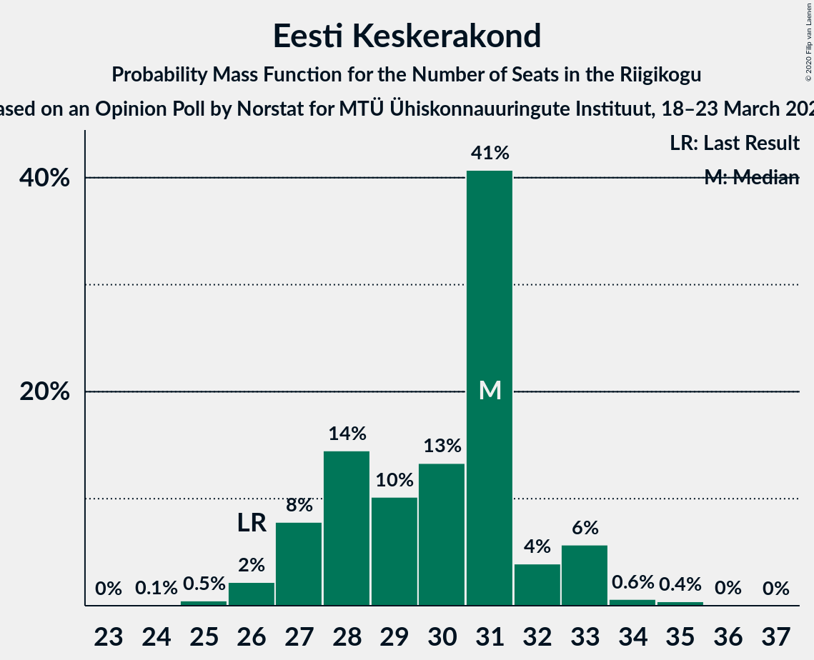

# Opinion Poll by Norstat for MTÜ Ühiskonnauuringute Instituut, 18–23 March 2020

<a href="#voting-intentions">Voting Intentions</a> | <a href="#seats">Seats</a> | <a href="#coalitions">Coalitions</a> | <a href="#technical-information">Technical Information</a>

## Voting Intentions

### Confidence Intervals

| Party | Last Result | Poll Result | 80% Confidence Interval | 90% Confidence Interval | 95% Confidence Interval | 99% Confidence Interval |
|:-----:|:-----------:|:-----------:|:-----------------------:|:-----------------------:|:-----------------------:|:-----------------------:|
| Eesti Reformierakond | 28.9% | 29.6% | 27.8–31.5% |27.3–32.0% |26.9–32.5% |26.0–33.4% |
| Eesti Keskerakond | 23.1% | 26.1% | 24.4–27.9% |23.9–28.5% |23.5–28.9% |22.7–29.8% |
| Eesti Konservatiivne Rahvaerakond | 17.8% | 16.9% | 15.5–18.5% |15.0–19.0% |14.7–19.4% |14.0–20.1% |
| Sotsiaaldemokraatlik Erakond | 9.8% | 8.6% | 7.6–9.8% |7.3–10.2% |7.0–10.5% |6.5–11.1% |
| Eesti 200 | 4.4% | 7.2% | 6.2–8.4% |6.0–8.7% |5.7–9.0% |5.3–9.6% |
| Erakond Isamaa | 11.4% | 5.4% | 4.6–6.4% |4.4–6.7% |4.2–7.0% |3.8–7.5% |
| Erakond Eestimaa Rohelised | 1.8% | 3.2% | 2.6–4.0% |2.4–4.3% |2.3–4.5% |2.0–4.9% |
| Eesti Vabaerakond | 1.2% | 0.3% | 0.2–0.7% |0.1–0.8% |0.1–0.9% |0.1–1.1% |

*Note:* The poll result column reflects the actual value used in the calculations. Published results may vary slightly, and in addition be rounded to fewer digits.

## Seats

### Confidence Intervals

| Party | Last Result | Median | 80% Confidence Interval | 90% Confidence Interval | 95% Confidence Interval | 99% Confidence Interval |
|:-----:|:-----------:|:------:|:-----------------------:|:-----------------------:|:-----------------------:|:-----------------------:|
| <a href="#eesti-reformierakond">Eesti Reformierakond</a> | 34 | 34 | 31–37 |31–38 |30–39 |30–40 |
| <a href="#eesti-keskerakond">Eesti Keskerakond</a> | 26 | 31 | 27–32 |27–33 |26–33 |25–34 |
| <a href="#eesti-konservatiivne-rahvaerakond">Eesti Konservatiivne Rahvaerakond</a> | 19 | 18 | 16–20 |16–21 |15–21 |15–22 |
| <a href="#sotsiaaldemokraatlik-erakond">Sotsiaaldemokraatlik Erakond</a> | 10 | 9 | 7–10 |7–10 |6–11 |6–11 |
| <a href="#eesti-200">Eesti 200</a> | 0 | 7 | 6–8 |5–9 |5–9 |5–9 |
| <a href="#erakond-isamaa">Erakond Isamaa</a> | 12 | 4 | 0–5 |0–6 |0–6 |0–7 |
| <a href="#erakond-eestimaa-rohelised">Erakond Eestimaa Rohelised</a> | 0 | 0 | 0 |0 |0 |0 |
| <a href="#eesti-vabaerakond">Eesti Vabaerakond</a> | 0 | 0 | 0 |0 |0 |0 |

### Eesti Reformierakond

*For a full overview of the results for this party, see the [Eesti Reformierakond](party-eestireformierakond.html) page.*

| Number of Seats | Probability | Accumulated | Special Marks |
|:---------------:|:-----------:|:-----------:|:-------------:|
| 28 | 0.1% | 100% |  |
| 29 | 0.2% | 99.9% |  |
| 30 | 3% | 99.7% |  |
| 31 | 9% | 97% |  |
| 32 | 4% | 87% |  |
| 33 | 13% | 83% |  |
| 34 | 27% | 70% | Last Result, Median |
| 35 | 12% | 42% |  |
| 36 | 4% | 30% |  |
| 37 | 21% | 26% |  |
| 38 | 3% | 5% |  |
| 39 | 2% | 3% |  |
| 40 | 0.2% | 0.6% |  |
| 41 | 0.4% | 0.4% |  |
| 42 | 0% | 0% |  |

### Eesti Keskerakond

*For a full overview of the results for this party, see the [Eesti Keskerakond](party-eestikeskerakond.html) page.*

| Number of Seats | Probability | Accumulated | Special Marks |
|:---------------:|:-----------:|:-----------:|:-------------:|
| 24 | 0.1% | 100% |  |
| 25 | 0.5% | 99.9% |  |
| 26 | 2% | 99.4% | Last Result |
| 27 | 8% | 97% |  |
| 28 | 14% | 89% |  |
| 29 | 10% | 75% |  |
| 30 | 13% | 65% |  |
| 31 | 41% | 51% | Median |
| 32 | 4% | 11% |  |
| 33 | 6% | 7% |  |
| 34 | 0.6% | 1.1% |  |
| 35 | 0.4% | 0.5% |  |
| 36 | 0% | 0.1% |  |
| 37 | 0% | 0% |  |

### Eesti Konservatiivne Rahvaerakond

*For a full overview of the results for this party, see the [Eesti Konservatiivne Rahvaerakond](party-eestikonservatiivnerahvaerakond.html) page.*

| Number of Seats | Probability | Accumulated | Special Marks |
|:---------------:|:-----------:|:-----------:|:-------------:|
| 14 | 0.5% | 100% |  |
| 15 | 3% | 99.5% |  |
| 16 | 16% | 96% |  |
| 17 | 12% | 80% |  |
| 18 | 31% | 68% | Median |
| 19 | 24% | 37% | Last Result |
| 20 | 8% | 13% |  |
| 21 | 4% | 5% |  |
| 22 | 2% | 2% |  |
| 23 | 0.1% | 0.1% |  |
| 24 | 0% | 0% |  |

### Sotsiaaldemokraatlik Erakond

*For a full overview of the results for this party, see the [Sotsiaaldemokraatlik Erakond](party-sotsiaaldemokraatlikerakond.html) page.*

| Number of Seats | Probability | Accumulated | Special Marks |
|:---------------:|:-----------:|:-----------:|:-------------:|
| 5 | 0.1% | 100% |  |
| 6 | 3% | 99.9% |  |
| 7 | 10% | 97% |  |
| 8 | 35% | 87% |  |
| 9 | 37% | 52% | Median |
| 10 | 11% | 15% | Last Result |
| 11 | 4% | 4% |  |
| 12 | 0.3% | 0.4% |  |
| 13 | 0% | 0% |  |

### Eesti 200

*For a full overview of the results for this party, see the [Eesti 200](party-eesti200.html) page.*

| Number of Seats | Probability | Accumulated | Special Marks |
|:---------------:|:-----------:|:-----------:|:-------------:|
| 0 | 0.1% | 100% | Last Result |
| 1 | 0% | 99.9% |  |
| 2 | 0% | 99.9% |  |
| 3 | 0% | 99.9% |  |
| 4 | 0% | 99.9% |  |
| 5 | 9% | 99.8% |  |
| 6 | 30% | 91% |  |
| 7 | 32% | 61% | Median |
| 8 | 23% | 29% |  |
| 9 | 5% | 5% |  |
| 10 | 0.2% | 0.3% |  |
| 11 | 0.1% | 0.1% |  |
| 12 | 0% | 0% |  |

### Erakond Isamaa

*For a full overview of the results for this party, see the [Erakond Isamaa](party-erakondisamaa.html) page.*

| Number of Seats | Probability | Accumulated | Special Marks |
|:---------------:|:-----------:|:-----------:|:-------------:|
| 0 | 34% | 100% |  |
| 1 | 0% | 66% |  |
| 2 | 0% | 66% |  |
| 3 | 0% | 66% |  |
| 4 | 17% | 66% | Median |
| 5 | 42% | 49% |  |
| 6 | 5% | 7% |  |
| 7 | 1.2% | 1.2% |  |
| 8 | 0% | 0% |  |
| 9 | 0% | 0% |  |
| 10 | 0% | 0% |  |
| 11 | 0% | 0% |  |
| 12 | 0% | 0% | Last Result |

### Erakond Eestimaa Rohelised

*For a full overview of the results for this party, see the [Erakond Eestimaa Rohelised](party-erakondeestimaarohelised.html) page.*

| Number of Seats | Probability | Accumulated | Special Marks |
|:---------------:|:-----------:|:-----------:|:-------------:|
| 0 | 99.8% | 100% | Last Result, Median |
| 1 | 0% | 0.2% |  |
| 2 | 0% | 0.2% |  |
| 3 | 0% | 0.2% |  |
| 4 | 0.1% | 0.2% |  |
| 5 | 0.1% | 0.1% |  |
| 6 | 0% | 0% |  |

### Eesti Vabaerakond

*For a full overview of the results for this party, see the [Eesti Vabaerakond](party-eestivabaerakond.html) page.*

| Number of Seats | Probability | Accumulated | Special Marks |
|:---------------:|:-----------:|:-----------:|:-------------:|
| 0 | 100% | 100% | Last Result, Median |

## Coalitions

### Confidence Intervals

| Coalition | Last Result | Median | Majority? | 80% Confidence Interval | 90% Confidence Interval | 95% Confidence Interval | 99% Confidence Interval |
|:---------:|:-----------:|:------:|:---------:|:-----------------------:|:-----------------------:|:-----------------------:|:-----------------------:|
| Eesti Reformierakond – Eesti Keskerakond – Eesti Konservatiivne Rahvaerakond | 79 | 82 | 100% | 79–86 | 79–86 | 78–87 | 77–88 |
| Eesti Reformierakond – Eesti Keskerakond | 60 | 65 | 100% | 61–68 | 60–69 | 60–69 | 59–69 |
| Eesti Reformierakond – Eesti Konservatiivne Rahvaerakond – Erakond Isamaa | 65 | 55 | 99.6% | 53–58 | 53–59 | 53–59 | 51–61 |
| Eesti Reformierakond – Eesti Konservatiivne Rahvaerakond | 53 | 53 | 69% | 49–55 | 49–56 | 48–57 | 48–58 |
| Eesti Keskerakond – Eesti Konservatiivne Rahvaerakond – Erakond Isamaa | 57 | 51 | 65% | 49–54 | 48–54 | 46–55 | 45–57 |
| Eesti Keskerakond – Eesti Konservatiivne Rahvaerakond | 45 | 48 | 12% | 45–51 | 45–52 | 44–52 | 43–54 |
| Eesti Reformierakond – Sotsiaaldemokraatlik Erakond – Erakond Isamaa – Eesti Vabaerakond | 56 | 46 | 2% | 44–49 | 42–49 | 42–50 | 40–52 |
| Eesti Reformierakond – Sotsiaaldemokraatlik Erakond – Erakond Isamaa | 56 | 46 | 2% | 44–49 | 42–49 | 42–50 | 40–52 |
| Eesti Reformierakond – Sotsiaaldemokraatlik Erakond | 44 | 42 | 0% | 40–46 | 39–46 | 39–48 | 38–49 |
| Eesti Keskerakond – Sotsiaaldemokraatlik Erakond – Erakond Isamaa | 48 | 41 | 0% | 40–45 | 39–46 | 37–46 | 36–47 |
| Eesti Keskerakond – Sotsiaaldemokraatlik Erakond | 36 | 39 | 0% | 36–41 | 36–42 | 35–42 | 34–43 |
| Eesti Reformierakond – Erakond Isamaa | 46 | 38 | 0% | 35–40 | 33–41 | 33–42 | 31–43 |
| Eesti Konservatiivne Rahvaerakond – Sotsiaaldemokraatlik Erakond | 29 | 27 | 0% | 24–29 | 24–29 | 24–30 | 22–31 |

### Eesti Reformierakond – Eesti Keskerakond – Eesti Konservatiivne Rahvaerakond

| Number of Seats | Probability | Accumulated | Special Marks |
|:---------------:|:-----------:|:-----------:|:-------------:|
| 76 | 0.2% | 100% |  |
| 77 | 1.2% | 99.8% |  |
| 78 | 3% | 98.7% |  |
| 79 | 11% | 95% | Last Result |
| 80 | 9% | 84% |  |
| 81 | 25% | 75% |  |
| 82 | 10% | 51% |  |
| 83 | 4% | 41% | Median |
| 84 | 9% | 37% |  |
| 85 | 4% | 27% |  |
| 86 | 19% | 24% |  |
| 87 | 3% | 4% |  |
| 88 | 2% | 2% |  |
| 89 | 0.1% | 0.1% |  |
| 90 | 0% | 0% |  |

### Eesti Reformierakond – Eesti Keskerakond

| Number of Seats | Probability | Accumulated | Special Marks |
|:---------------:|:-----------:|:-----------:|:-------------:|
| 58 | 0.1% | 100% |  |
| 59 | 1.3% | 99.8% |  |
| 60 | 5% | 98.6% | Last Result |
| 61 | 16% | 94% |  |
| 62 | 15% | 78% |  |
| 63 | 2% | 64% |  |
| 64 | 9% | 61% |  |
| 65 | 17% | 53% | Median |
| 66 | 10% | 36% |  |
| 67 | 1.2% | 25% |  |
| 68 | 19% | 24% |  |
| 69 | 5% | 5% |  |
| 70 | 0.4% | 0.4% |  |
| 71 | 0% | 0% |  |

### Eesti Reformierakond – Eesti Konservatiivne Rahvaerakond – Erakond Isamaa

| Number of Seats | Probability | Accumulated | Special Marks |
|:---------------:|:-----------:|:-----------:|:-------------:|
| 49 | 0% | 100% |  |
| 50 | 0.3% | 99.9% |  |
| 51 | 0.7% | 99.6% | Majority |
| 52 | 0.4% | 98.9% |  |
| 53 | 10% | 98% |  |
| 54 | 11% | 89% |  |
| 55 | 37% | 78% |  |
| 56 | 5% | 41% | Median |
| 57 | 24% | 37% |  |
| 58 | 7% | 13% |  |
| 59 | 4% | 6% |  |
| 60 | 1.1% | 2% |  |
| 61 | 0.8% | 1.0% |  |
| 62 | 0.1% | 0.2% |  |
| 63 | 0.1% | 0.1% |  |
| 64 | 0% | 0% |  |
| 65 | 0% | 0% | Last Result |

### Eesti Reformierakond – Eesti Konservatiivne Rahvaerakond

| Number of Seats | Probability | Accumulated | Special Marks |
|:---------------:|:-----------:|:-----------:|:-------------:|
| 46 | 0.1% | 100% |  |
| 47 | 0.3% | 99.9% |  |
| 48 | 2% | 99.5% |  |
| 49 | 8% | 97% |  |
| 50 | 20% | 89% |  |
| 51 | 4% | 69% | Majority |
| 52 | 9% | 65% | Median |
| 53 | 22% | 55% | Last Result |
| 54 | 9% | 33% |  |
| 55 | 18% | 24% |  |
| 56 | 2% | 6% |  |
| 57 | 2% | 3% |  |
| 58 | 1.2% | 1.4% |  |
| 59 | 0.1% | 0.1% |  |
| 60 | 0% | 0.1% |  |
| 61 | 0% | 0% |  |

### Eesti Keskerakond – Eesti Konservatiivne Rahvaerakond – Erakond Isamaa

| Number of Seats | Probability | Accumulated | Special Marks |
|:---------------:|:-----------:|:-----------:|:-------------:|
| 45 | 0.6% | 100% |  |
| 46 | 2% | 99.4% |  |
| 47 | 0.4% | 97% |  |
| 48 | 5% | 97% |  |
| 49 | 19% | 92% |  |
| 50 | 9% | 73% |  |
| 51 | 23% | 65% | Majority |
| 52 | 15% | 41% |  |
| 53 | 9% | 26% | Median |
| 54 | 13% | 17% |  |
| 55 | 2% | 4% |  |
| 56 | 1.1% | 2% |  |
| 57 | 1.1% | 1.2% | Last Result |
| 58 | 0.1% | 0.1% |  |
| 59 | 0% | 0% |  |

### Eesti Keskerakond – Eesti Konservatiivne Rahvaerakond

| Number of Seats | Probability | Accumulated | Special Marks |
|:---------------:|:-----------:|:-----------:|:-------------:|
| 41 | 0.1% | 100% |  |
| 42 | 0.3% | 99.9% |  |
| 43 | 1.5% | 99.6% |  |
| 44 | 1.4% | 98% |  |
| 45 | 9% | 97% | Last Result |
| 46 | 10% | 87% |  |
| 47 | 22% | 78% |  |
| 48 | 7% | 56% |  |
| 49 | 35% | 49% | Median |
| 50 | 1.4% | 13% |  |
| 51 | 7% | 12% | Majority |
| 52 | 4% | 5% |  |
| 53 | 0.5% | 1.4% |  |
| 54 | 0.8% | 0.9% |  |
| 55 | 0.1% | 0.1% |  |
| 56 | 0% | 0% |  |

### Eesti Reformierakond – Sotsiaaldemokraatlik Erakond – Erakond Isamaa – Eesti Vabaerakond

| Number of Seats | Probability | Accumulated | Special Marks |
|:---------------:|:-----------:|:-----------:|:-------------:|
| 39 | 0.1% | 100% |  |
| 40 | 0.7% | 99.9% |  |
| 41 | 2% | 99.2% |  |
| 42 | 4% | 98% |  |
| 43 | 3% | 93% |  |
| 44 | 8% | 90% |  |
| 45 | 9% | 82% |  |
| 46 | 35% | 73% |  |
| 47 | 16% | 38% | Median |
| 48 | 9% | 22% |  |
| 49 | 9% | 13% |  |
| 50 | 2% | 5% |  |
| 51 | 1.5% | 2% | Majority |
| 52 | 0.8% | 0.9% |  |
| 53 | 0.1% | 0.1% |  |
| 54 | 0% | 0% |  |
| 55 | 0% | 0% |  |
| 56 | 0% | 0% | Last Result |

### Eesti Reformierakond – Sotsiaaldemokraatlik Erakond – Erakond Isamaa

| Number of Seats | Probability | Accumulated | Special Marks |
|:---------------:|:-----------:|:-----------:|:-------------:|
| 39 | 0.1% | 100% |  |
| 40 | 0.7% | 99.9% |  |
| 41 | 2% | 99.2% |  |
| 42 | 4% | 98% |  |
| 43 | 3% | 93% |  |
| 44 | 8% | 90% |  |
| 45 | 9% | 82% |  |
| 46 | 35% | 73% |  |
| 47 | 16% | 38% | Median |
| 48 | 9% | 22% |  |
| 49 | 9% | 13% |  |
| 50 | 2% | 5% |  |
| 51 | 1.5% | 2% | Majority |
| 52 | 0.8% | 0.9% |  |
| 53 | 0.1% | 0.1% |  |
| 54 | 0% | 0% |  |
| 55 | 0% | 0% |  |
| 56 | 0% | 0% | Last Result |

### Eesti Reformierakond – Sotsiaaldemokraatlik Erakond

| Number of Seats | Probability | Accumulated | Special Marks |
|:---------------:|:-----------:|:-----------:|:-------------:|
| 36 | 0.2% | 100% |  |
| 37 | 0.2% | 99.8% |  |
| 38 | 2% | 99.7% |  |
| 39 | 6% | 98% |  |
| 40 | 6% | 92% |  |
| 41 | 8% | 86% |  |
| 42 | 32% | 78% |  |
| 43 | 8% | 46% | Median |
| 44 | 12% | 38% | Last Result |
| 45 | 3% | 26% |  |
| 46 | 19% | 23% |  |
| 47 | 1.5% | 4% |  |
| 48 | 2% | 3% |  |
| 49 | 0.5% | 0.6% |  |
| 50 | 0.1% | 0.1% |  |
| 51 | 0% | 0% | Majority |

### Eesti Keskerakond – Sotsiaaldemokraatlik Erakond – Erakond Isamaa

| Number of Seats | Probability | Accumulated | Special Marks |
|:---------------:|:-----------:|:-----------:|:-------------:|
| 34 | 0.1% | 100% |  |
| 35 | 0.2% | 99.9% |  |
| 36 | 1.2% | 99.7% |  |
| 37 | 1.4% | 98.5% |  |
| 38 | 2% | 97% |  |
| 39 | 5% | 95% |  |
| 40 | 32% | 90% |  |
| 41 | 10% | 58% |  |
| 42 | 13% | 49% |  |
| 43 | 8% | 36% |  |
| 44 | 16% | 28% | Median |
| 45 | 6% | 12% |  |
| 46 | 6% | 6% |  |
| 47 | 0.4% | 0.7% |  |
| 48 | 0.2% | 0.3% | Last Result |
| 49 | 0.1% | 0.1% |  |
| 50 | 0% | 0% |  |

### Eesti Keskerakond – Sotsiaaldemokraatlik Erakond

| Number of Seats | Probability | Accumulated | Special Marks |
|:---------------:|:-----------:|:-----------:|:-------------:|
| 32 | 0.1% | 100% |  |
| 33 | 0.3% | 99.9% |  |
| 34 | 1.2% | 99.6% |  |
| 35 | 3% | 98% |  |
| 36 | 16% | 95% | Last Result |
| 37 | 15% | 80% |  |
| 38 | 8% | 65% |  |
| 39 | 19% | 57% |  |
| 40 | 26% | 37% | Median |
| 41 | 4% | 11% |  |
| 42 | 6% | 6% |  |
| 43 | 0.4% | 0.8% |  |
| 44 | 0.3% | 0.4% |  |
| 45 | 0.1% | 0.1% |  |
| 46 | 0% | 0% |  |

### Eesti Reformierakond – Erakond Isamaa

| Number of Seats | Probability | Accumulated | Special Marks |
|:---------------:|:-----------:|:-----------:|:-------------:|
| 31 | 0.7% | 100% |  |
| 32 | 0.5% | 99.2% |  |
| 33 | 5% | 98.7% |  |
| 34 | 1.4% | 94% |  |
| 35 | 6% | 92% |  |
| 36 | 9% | 86% |  |
| 37 | 25% | 77% |  |
| 38 | 17% | 52% | Median |
| 39 | 20% | 35% |  |
| 40 | 7% | 15% |  |
| 41 | 4% | 8% |  |
| 42 | 2% | 3% |  |
| 43 | 0.9% | 1.2% |  |
| 44 | 0.2% | 0.3% |  |
| 45 | 0% | 0% |  |
| 46 | 0% | 0% | Last Result |

### Eesti Konservatiivne Rahvaerakond – Sotsiaaldemokraatlik Erakond

| Number of Seats | Probability | Accumulated | Special Marks |
|:---------------:|:-----------:|:-----------:|:-------------:|
| 21 | 0.1% | 100% |  |
| 22 | 0.4% | 99.9% |  |
| 23 | 2% | 99.5% |  |
| 24 | 17% | 98% |  |
| 25 | 11% | 81% |  |
| 26 | 7% | 70% |  |
| 27 | 37% | 63% | Median |
| 28 | 15% | 26% |  |
| 29 | 7% | 11% | Last Result |
| 30 | 2% | 4% |  |
| 31 | 2% | 2% |  |
| 32 | 0.3% | 0.3% |  |
| 33 | 0% | 0% |  |

## Technical Information

### Opinion Poll

+ **Polling firm:** Norstat
+ **Commissioner(s):** MTÜ Ühiskonnauuringute Instituut
+ **Fieldwork period:** 18–23 March 2020

### Calculations

+ **Sample size:** 1000
+ **Simulations done:** 131,072
+ **Error estimate:** 1.66%

