# Opinion Poll by Norstat for MTÜ Ühiskonnauuringute Instituut, 24–30 March 2020

<a href="#voting-intentions">Voting Intentions</a> | <a href="#seats">Seats</a> | <a href="#coalitions">Coalitions</a> | <a href="#technical-information">Technical Information</a>

## Voting Intentions

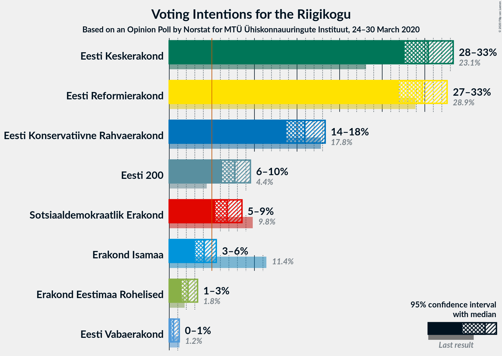

### Confidence Intervals

| Party | Last Result | Poll Result | 80% Confidence Interval | 90% Confidence Interval | 95% Confidence Interval | 99% Confidence Interval |
|:-----:|:-----------:|:-----------:|:-----------------------:|:-----------------------:|:-----------------------:|:-----------------------:|
| Eesti Keskerakond | 23.1% | 30.4% | 28.6–32.3% |28.1–32.9% |27.6–33.3% |26.8–34.3% |
| Eesti Reformierakond | 28.9% | 29.7% | 27.9–31.6% |27.4–32.1% |26.9–32.6% |26.1–33.5% |
| Eesti Konservatiivne Rahvaerakond | 17.8% | 15.9% | 14.5–17.5% |14.1–17.9% |13.8–18.3% |13.1–19.1% |
| Eesti 200 | 4.4% | 7.7% | 6.7–8.9% |6.4–9.2% |6.2–9.5% |5.8–10.1% |
| Sotsiaaldemokraatlik Erakond | 9.8% | 6.8% | 5.9–7.9% |5.6–8.3% |5.4–8.5% |5.0–9.1% |
| Erakond Isamaa | 11.4% | 4.1% | 3.4–5.0% |3.2–5.3% |3.0–5.5% |2.7–6.0% |
| Erakond Eestimaa Rohelised | 1.8% | 2.2% | 1.7–2.9% |1.6–3.1% |1.4–3.3% |1.2–3.7% |
| Eesti Vabaerakond | 1.2% | 0.5% | 0.3–0.9% |0.3–1.1% |0.2–1.2% |0.2–1.4% |

*Note:* The poll result column reflects the actual value used in the calculations. Published results may vary slightly, and in addition be rounded to fewer digits.

## Seats

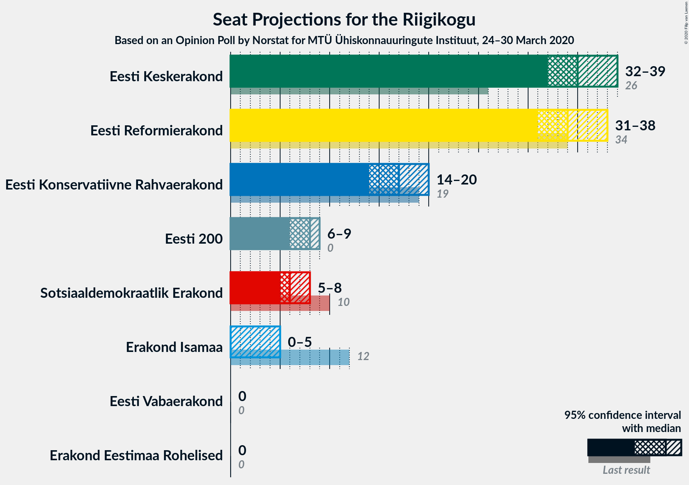

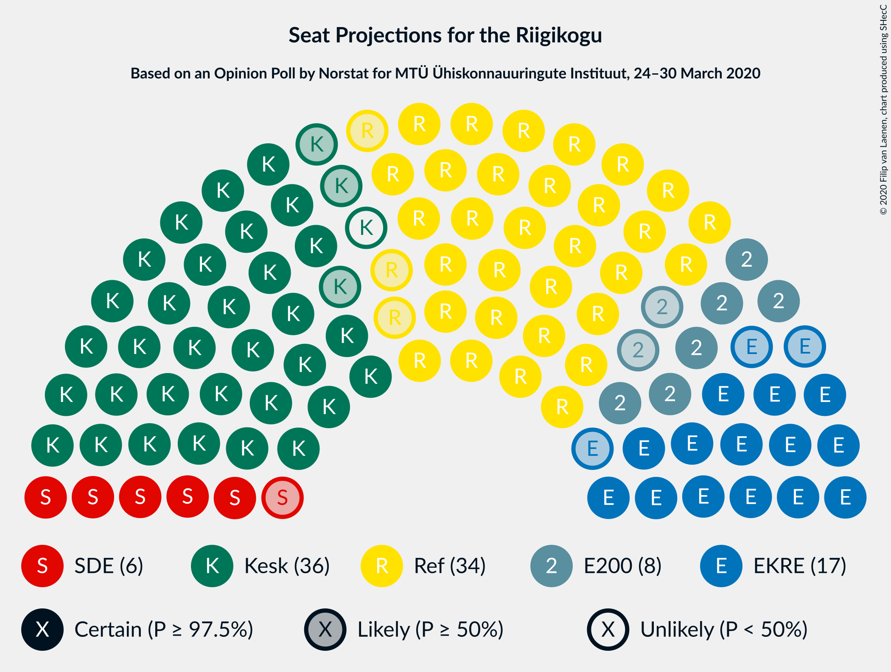

### Confidence Intervals

| Party | Last Result | Median | 80% Confidence Interval | 90% Confidence Interval | 95% Confidence Interval | 99% Confidence Interval |
|:-----:|:-----------:|:------:|:-----------------------:|:-----------------------:|:-----------------------:|:-----------------------:|
| <a href="#eesti-keskerakond">Eesti Keskerakond</a> | 26 | 35 | 33–38 |32–38 |32–39 |30–40 |
| <a href="#eesti-reformierakond">Eesti Reformierakond</a> | 34 | 34 | 32–37 |31–38 |31–38 |29–39 |
| <a href="#eesti-konservatiivne-rahvaerakond">Eesti Konservatiivne Rahvaerakond</a> | 19 | 17 | 15–19 |15–19 |14–20 |14–21 |
| <a href="#eesti-200">Eesti 200</a> | 0 | 8 | 6–9 |6–9 |6–9 |5–10 |
| <a href="#sotsiaaldemokraatlik-erakond">Sotsiaaldemokraatlik Erakond</a> | 10 | 6 | 5–8 |5–8 |5–8 |0–9 |
| <a href="#erakond-isamaa">Erakond Isamaa</a> | 12 | 0 | 0–4 |0–5 |0–5 |0–5 |
| <a href="#erakond-eestimaa-rohelised">Erakond Eestimaa Rohelised</a> | 0 | 0 | 0 |0 |0 |0 |
| <a href="#eesti-vabaerakond">Eesti Vabaerakond</a> | 0 | 0 | 0 |0 |0 |0 |

### Eesti Keskerakond

*For a full overview of the results for this party, see the [Eesti Keskerakond](party-eestikeskerakond.html) page.*

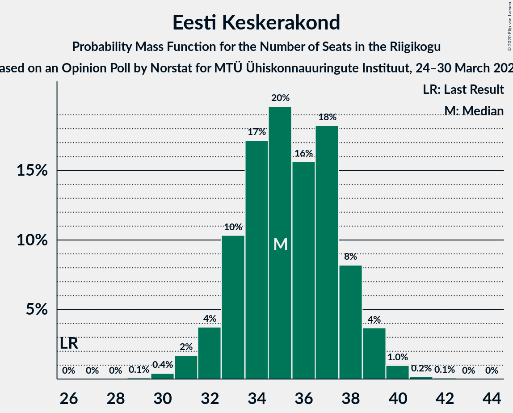

| Number of Seats | Probability | Accumulated | Special Marks |
|:---------------:|:-----------:|:-----------:|:-------------:|
| 26 | 0% | 100% | Last Result |
| 27 | 0% | 100% |  |
| 28 | 0% | 100% |  |
| 29 | 0.1% | 100% |  |
| 30 | 0.4% | 99.9% |  |
| 31 | 2% | 99.5% |  |
| 32 | 4% | 98% |  |
| 33 | 10% | 94% |  |
| 34 | 17% | 84% |  |
| 35 | 20% | 67% | Median |
| 36 | 16% | 47% |  |
| 37 | 18% | 31% |  |
| 38 | 8% | 13% |  |
| 39 | 4% | 5% |  |
| 40 | 1.0% | 1.2% |  |
| 41 | 0.2% | 0.3% |  |
| 42 | 0.1% | 0.1% |  |
| 43 | 0% | 0% |  |

### Eesti Reformierakond

*For a full overview of the results for this party, see the [Eesti Reformierakond](party-eestireformierakond.html) page.*

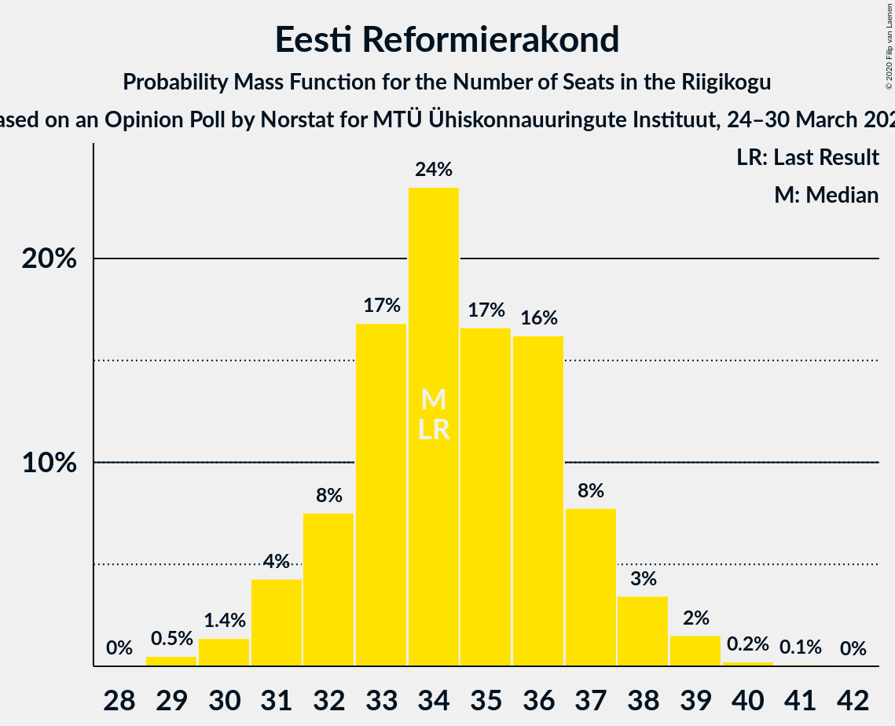

| Number of Seats | Probability | Accumulated | Special Marks |
|:---------------:|:-----------:|:-----------:|:-------------:|
| 28 | 0% | 100% |  |
| 29 | 0.5% | 99.9% |  |
| 30 | 1.4% | 99.4% |  |
| 31 | 4% | 98% |  |
| 32 | 8% | 94% |  |
| 33 | 17% | 86% |  |
| 34 | 24% | 69% | Last Result, Median |
| 35 | 17% | 46% |  |
| 36 | 16% | 29% |  |
| 37 | 8% | 13% |  |
| 38 | 3% | 5% |  |
| 39 | 2% | 2% |  |
| 40 | 0.2% | 0.3% |  |
| 41 | 0.1% | 0.1% |  |
| 42 | 0% | 0% |  |

### Eesti Konservatiivne Rahvaerakond

*For a full overview of the results for this party, see the [Eesti Konservatiivne Rahvaerakond](party-eestikonservatiivnerahvaerakond.html) page.*

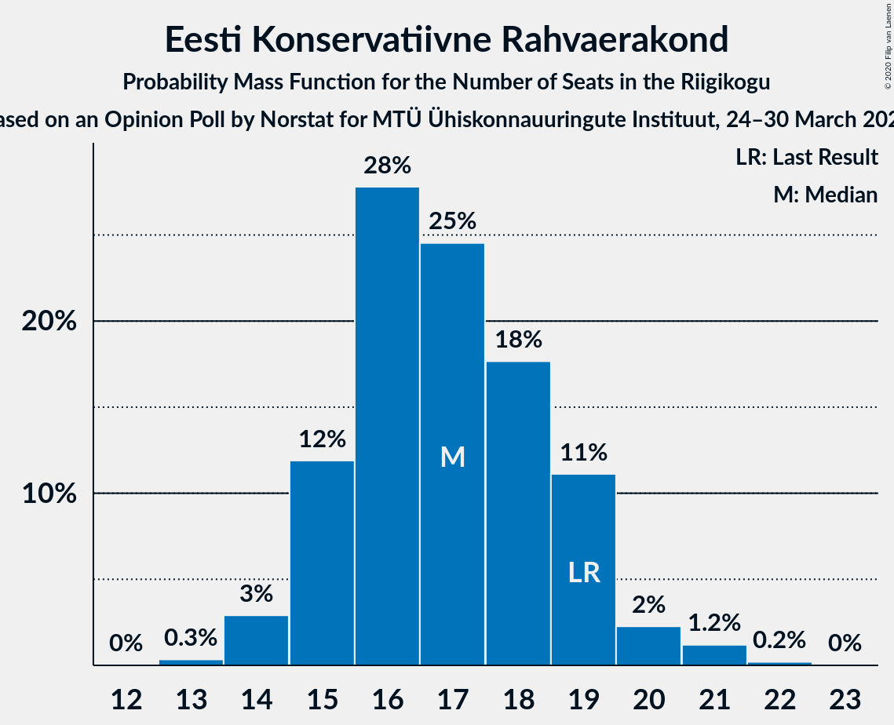

| Number of Seats | Probability | Accumulated | Special Marks |
|:---------------:|:-----------:|:-----------:|:-------------:|
| 13 | 0.3% | 100% |  |
| 14 | 3% | 99.6% |  |
| 15 | 12% | 97% |  |
| 16 | 28% | 85% |  |
| 17 | 25% | 57% | Median |
| 18 | 18% | 32% |  |
| 19 | 11% | 15% | Last Result |
| 20 | 2% | 4% |  |
| 21 | 1.2% | 1.4% |  |
| 22 | 0.2% | 0.2% |  |
| 23 | 0% | 0% |  |

### Eesti 200

*For a full overview of the results for this party, see the [Eesti 200](party-eesti200.html) page.*

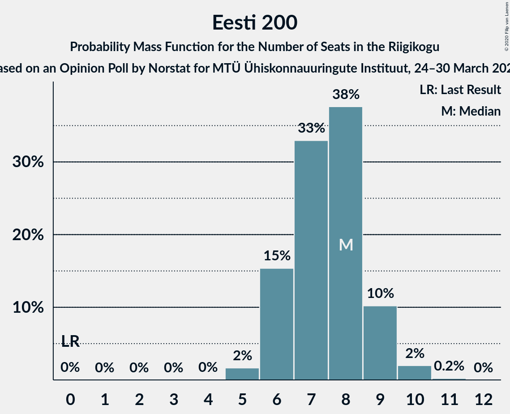

| Number of Seats | Probability | Accumulated | Special Marks |
|:---------------:|:-----------:|:-----------:|:-------------:|
| 0 | 0% | 100% | Last Result |
| 1 | 0% | 100% |  |
| 2 | 0% | 100% |  |
| 3 | 0% | 100% |  |
| 4 | 0% | 100% |  |
| 5 | 2% | 100% |  |
| 6 | 15% | 98% |  |
| 7 | 33% | 83% |  |
| 8 | 38% | 50% | Median |
| 9 | 10% | 12% |  |
| 10 | 2% | 2% |  |
| 11 | 0.2% | 0.2% |  |
| 12 | 0% | 0% |  |

### Sotsiaaldemokraatlik Erakond

*For a full overview of the results for this party, see the [Sotsiaaldemokraatlik Erakond](party-sotsiaaldemokraatlikerakond.html) page.*

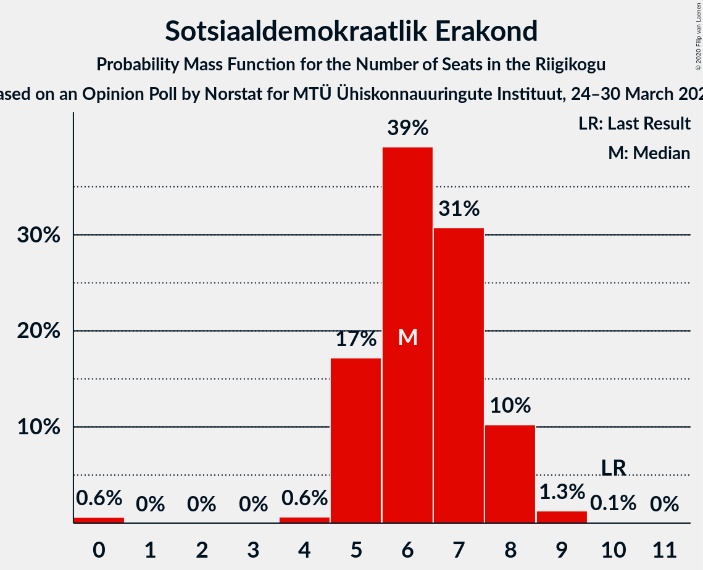

| Number of Seats | Probability | Accumulated | Special Marks |
|:---------------:|:-----------:|:-----------:|:-------------:|
| 0 | 0.6% | 100% |  |
| 1 | 0% | 99.4% |  |
| 2 | 0% | 99.4% |  |
| 3 | 0% | 99.4% |  |
| 4 | 0.6% | 99.4% |  |
| 5 | 17% | 98.7% |  |
| 6 | 39% | 82% | Median |
| 7 | 31% | 42% |  |
| 8 | 10% | 12% |  |
| 9 | 1.3% | 1.4% |  |
| 10 | 0.1% | 0.1% | Last Result |
| 11 | 0% | 0% |  |

### Erakond Isamaa

*For a full overview of the results for this party, see the [Erakond Isamaa](party-erakondisamaa.html) page.*

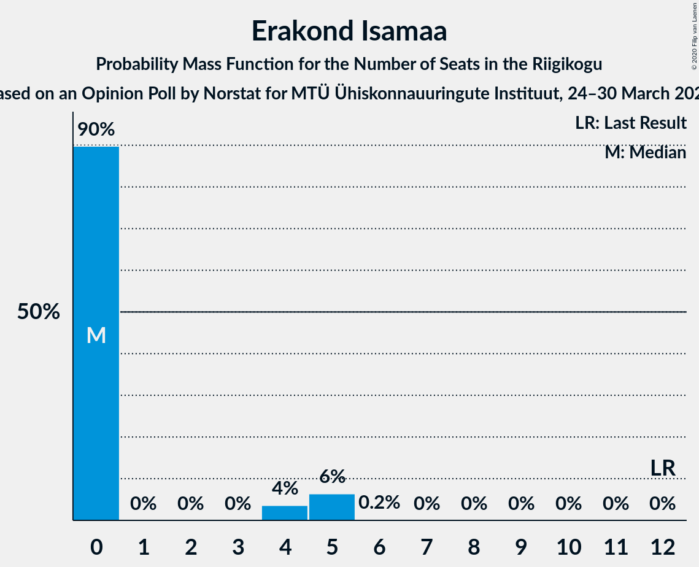

| Number of Seats | Probability | Accumulated | Special Marks |
|:---------------:|:-----------:|:-----------:|:-------------:|
| 0 | 90% | 100% | Median |
| 1 | 0% | 10% |  |
| 2 | 0% | 10% |  |
| 3 | 0% | 10% |  |
| 4 | 4% | 10% |  |
| 5 | 6% | 7% |  |
| 6 | 0.2% | 0.2% |  |
| 7 | 0% | 0% |  |
| 8 | 0% | 0% |  |
| 9 | 0% | 0% |  |
| 10 | 0% | 0% |  |
| 11 | 0% | 0% |  |
| 12 | 0% | 0% | Last Result |

### Erakond Eestimaa Rohelised

*For a full overview of the results for this party, see the [Erakond Eestimaa Rohelised](party-erakondeestimaarohelised.html) page.*

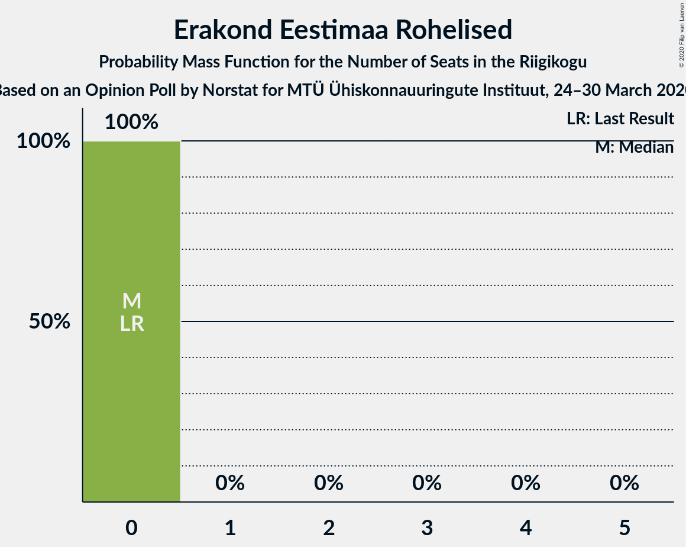

| Number of Seats | Probability | Accumulated | Special Marks |
|:---------------:|:-----------:|:-----------:|:-------------:|
| 0 | 100% | 100% | Last Result, Median |

### Eesti Vabaerakond

*For a full overview of the results for this party, see the [Eesti Vabaerakond](party-eestivabaerakond.html) page.*

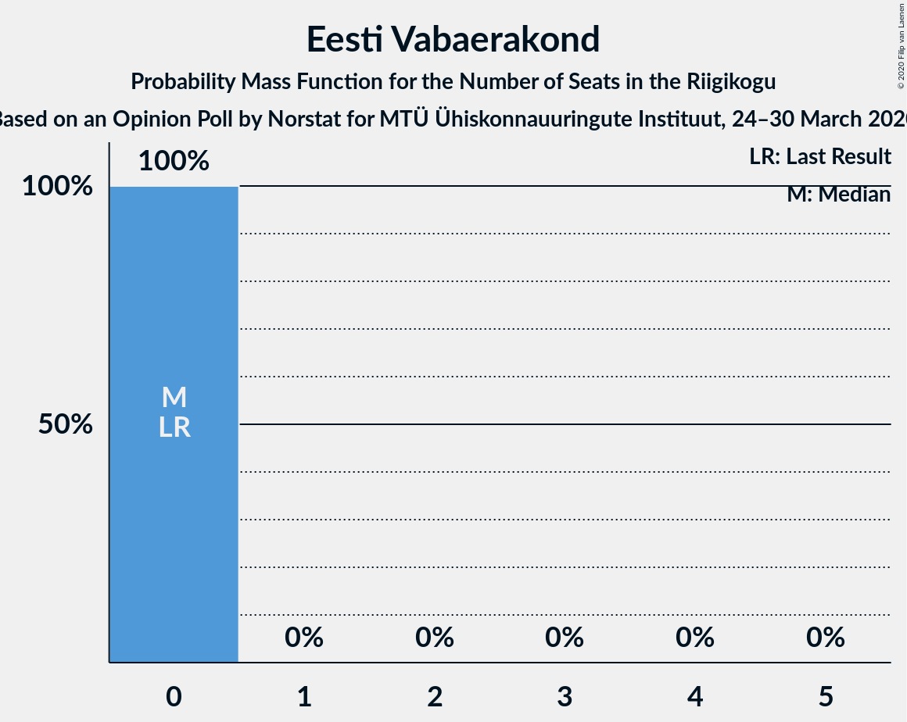

| Number of Seats | Probability | Accumulated | Special Marks |
|:---------------:|:-----------:|:-----------:|:-------------:|
| 0 | 100% | 100% | Last Result, Median |

## Coalitions

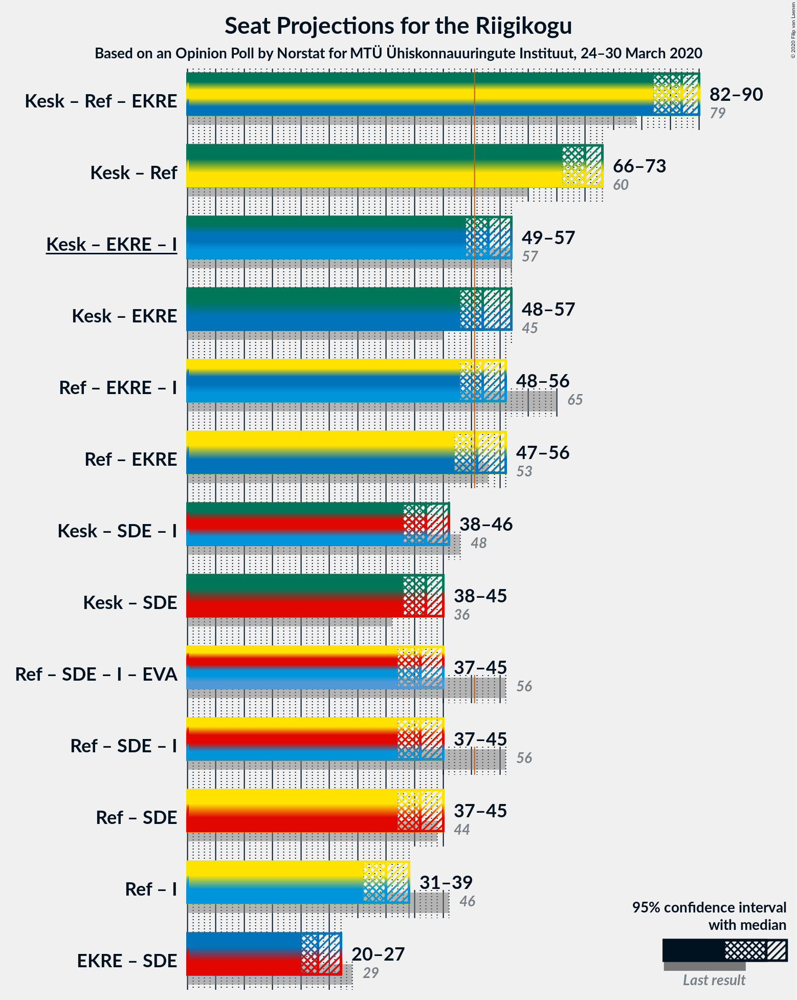

### Confidence Intervals

| Coalition | Last Result | Median | Majority? | 80% Confidence Interval | 90% Confidence Interval | 95% Confidence Interval | 99% Confidence Interval |
|:---------:|:-----------:|:------:|:---------:|:-----------------------:|:-----------------------:|:-----------------------:|:-----------------------:|
| Eesti Keskerakond – Eesti Reformierakond – Eesti Konservatiivne Rahvaerakond | 79 | 87 | 100% | 84–89 | 83–89 | 82–90 | 81–91 |
| Eesti Keskerakond – Eesti Reformierakond | 60 | 70 | 100% | 67–72 | 66–73 | 66–73 | 64–75 |
| Eesti Keskerakond – Eesti Konservatiivne Rahvaerakond – Erakond Isamaa | 57 | 53 | 89% | 50–55 | 49–56 | 49–57 | 48–58 |
| Eesti Keskerakond – Eesti Konservatiivne Rahvaerakond | 45 | 52 | 83% | 50–55 | 49–56 | 48–57 | 47–57 |
| Eesti Reformierakond – Eesti Konservatiivne Rahvaerakond – Erakond Isamaa | 65 | 52 | 71% | 49–55 | 49–55 | 48–56 | 47–57 |
| Eesti Reformierakond – Eesti Konservatiivne Rahvaerakond | 53 | 51 | 63% | 49–54 | 48–55 | 47–56 | 46–57 |
| Eesti Keskerakond – Sotsiaaldemokraatlik Erakond – Erakond Isamaa | 48 | 42 | 0% | 39–45 | 39–46 | 38–46 | 37–48 |
| Eesti Keskerakond – Sotsiaaldemokraatlik Erakond | 36 | 42 | 0% | 39–44 | 38–45 | 38–45 | 36–47 |
| Eesti Reformierakond – Sotsiaaldemokraatlik Erakond – Erakond Isamaa – Eesti Vabaerakond | 56 | 41 | 0% | 39–44 | 38–45 | 37–45 | 36–47 |
| Eesti Reformierakond – Sotsiaaldemokraatlik Erakond – Erakond Isamaa | 56 | 41 | 0% | 39–44 | 38–45 | 37–45 | 36–47 |
| Eesti Reformierakond – Sotsiaaldemokraatlik Erakond | 44 | 41 | 0% | 38–43 | 38–44 | 37–45 | 35–46 |
| Eesti Reformierakond – Erakond Isamaa | 46 | 35 | 0% | 32–38 | 32–38 | 31–39 | 30–41 |
| Eesti Konservatiivne Rahvaerakond – Sotsiaaldemokraatlik Erakond | 29 | 23 | 0% | 21–25 | 20–26 | 20–27 | 19–28 |

### Eesti Keskerakond – Eesti Reformierakond – Eesti Konservatiivne Rahvaerakond

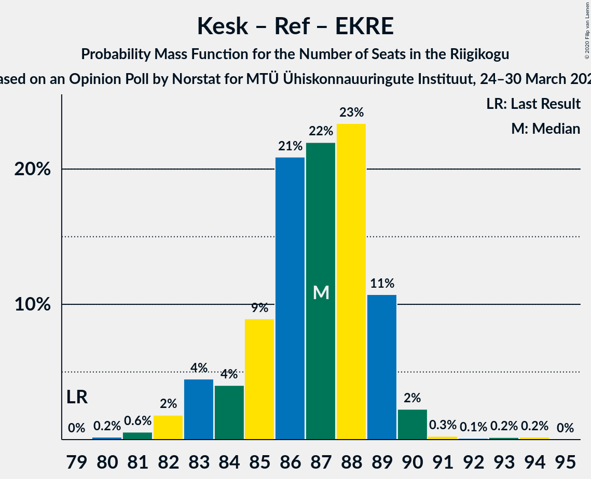

| Number of Seats | Probability | Accumulated | Special Marks |
|:---------------:|:-----------:|:-----------:|:-------------:|
| 79 | 0% | 100% | Last Result |
| 80 | 0.2% | 100% |  |
| 81 | 0.6% | 99.8% |  |
| 82 | 2% | 99.2% |  |
| 83 | 4% | 97% |  |
| 84 | 4% | 93% |  |
| 85 | 9% | 89% |  |
| 86 | 21% | 80% | Median |
| 87 | 22% | 59% |  |
| 88 | 23% | 37% |  |
| 89 | 11% | 14% |  |
| 90 | 2% | 3% |  |
| 91 | 0.3% | 0.7% |  |
| 92 | 0.1% | 0.5% |  |
| 93 | 0.2% | 0.4% |  |
| 94 | 0.2% | 0.2% |  |
| 95 | 0% | 0% |  |

### Eesti Keskerakond – Eesti Reformierakond

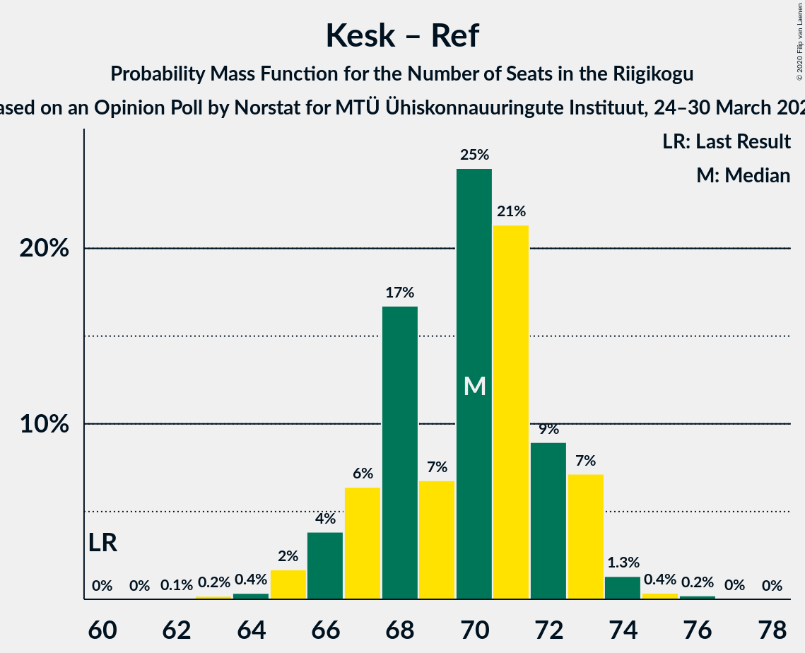

| Number of Seats | Probability | Accumulated | Special Marks |
|:---------------:|:-----------:|:-----------:|:-------------:|
| 60 | 0% | 100% | Last Result |
| 61 | 0% | 100% |  |
| 62 | 0.1% | 100% |  |
| 63 | 0.2% | 99.9% |  |
| 64 | 0.4% | 99.7% |  |
| 65 | 2% | 99.4% |  |
| 66 | 4% | 98% |  |
| 67 | 6% | 94% |  |
| 68 | 17% | 87% |  |
| 69 | 7% | 71% | Median |
| 70 | 25% | 64% |  |
| 71 | 21% | 39% |  |
| 72 | 9% | 18% |  |
| 73 | 7% | 9% |  |
| 74 | 1.3% | 2% |  |
| 75 | 0.4% | 0.6% |  |
| 76 | 0.2% | 0.3% |  |
| 77 | 0% | 0% |  |

### Eesti Keskerakond – Eesti Konservatiivne Rahvaerakond – Erakond Isamaa

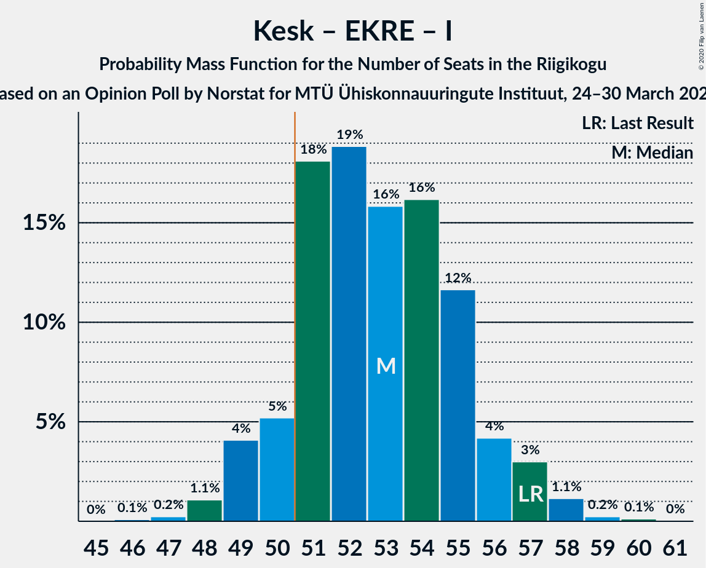

| Number of Seats | Probability | Accumulated | Special Marks |
|:---------------:|:-----------:|:-----------:|:-------------:|
| 46 | 0.1% | 100% |  |
| 47 | 0.2% | 99.9% |  |
| 48 | 1.1% | 99.7% |  |
| 49 | 4% | 98.6% |  |
| 50 | 5% | 95% |  |
| 51 | 18% | 89% | Majority |
| 52 | 19% | 71% | Median |
| 53 | 16% | 52% |  |
| 54 | 16% | 37% |  |
| 55 | 12% | 20% |  |
| 56 | 4% | 9% |  |
| 57 | 3% | 5% | Last Result |
| 58 | 1.1% | 2% |  |
| 59 | 0.2% | 0.4% |  |
| 60 | 0.1% | 0.2% |  |
| 61 | 0% | 0% |  |

### Eesti Keskerakond – Eesti Konservatiivne Rahvaerakond

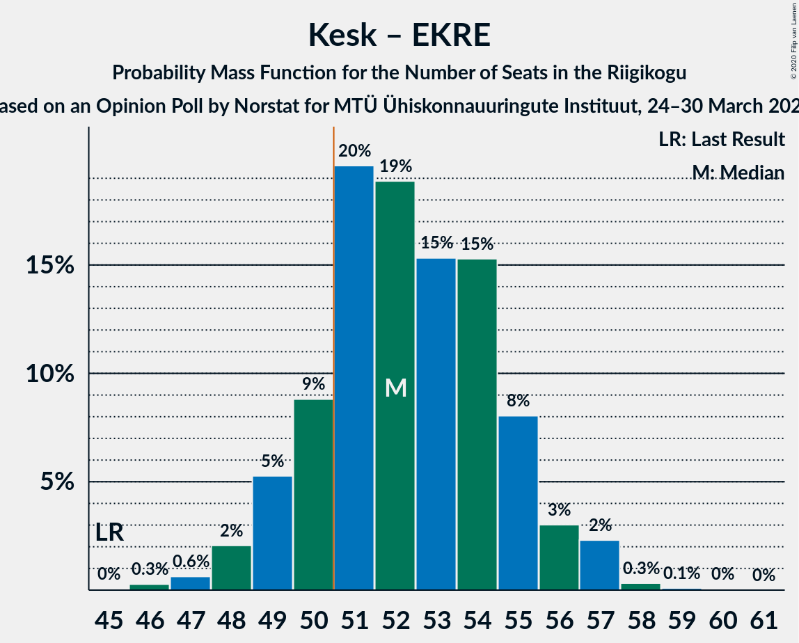

| Number of Seats | Probability | Accumulated | Special Marks |
|:---------------:|:-----------:|:-----------:|:-------------:|
| 45 | 0% | 100% | Last Result |
| 46 | 0.3% | 99.9% |  |
| 47 | 0.6% | 99.7% |  |
| 48 | 2% | 99.0% |  |
| 49 | 5% | 97% |  |
| 50 | 9% | 92% |  |
| 51 | 20% | 83% | Majority |
| 52 | 19% | 63% | Median |
| 53 | 15% | 44% |  |
| 54 | 15% | 29% |  |
| 55 | 8% | 14% |  |
| 56 | 3% | 6% |  |
| 57 | 2% | 3% |  |
| 58 | 0.3% | 0.5% |  |
| 59 | 0.1% | 0.1% |  |
| 60 | 0% | 0.1% |  |
| 61 | 0% | 0% |  |

### Eesti Reformierakond – Eesti Konservatiivne Rahvaerakond – Erakond Isamaa

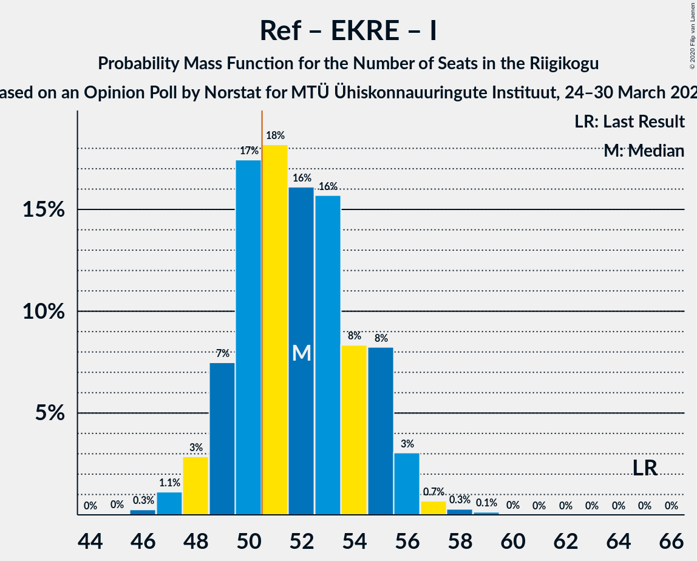

| Number of Seats | Probability | Accumulated | Special Marks |
|:---------------:|:-----------:|:-----------:|:-------------:|
| 45 | 0% | 100% |  |
| 46 | 0.3% | 99.9% |  |
| 47 | 1.1% | 99.7% |  |
| 48 | 3% | 98.6% |  |
| 49 | 7% | 96% |  |
| 50 | 17% | 88% |  |
| 51 | 18% | 71% | Median, Majority |
| 52 | 16% | 53% |  |
| 53 | 16% | 36% |  |
| 54 | 8% | 21% |  |
| 55 | 8% | 12% |  |
| 56 | 3% | 4% |  |
| 57 | 0.7% | 1.1% |  |
| 58 | 0.3% | 0.5% |  |
| 59 | 0.1% | 0.2% |  |
| 60 | 0% | 0% |  |
| 61 | 0% | 0% |  |
| 62 | 0% | 0% |  |
| 63 | 0% | 0% |  |
| 64 | 0% | 0% |  |
| 65 | 0% | 0% | Last Result |

### Eesti Reformierakond – Eesti Konservatiivne Rahvaerakond

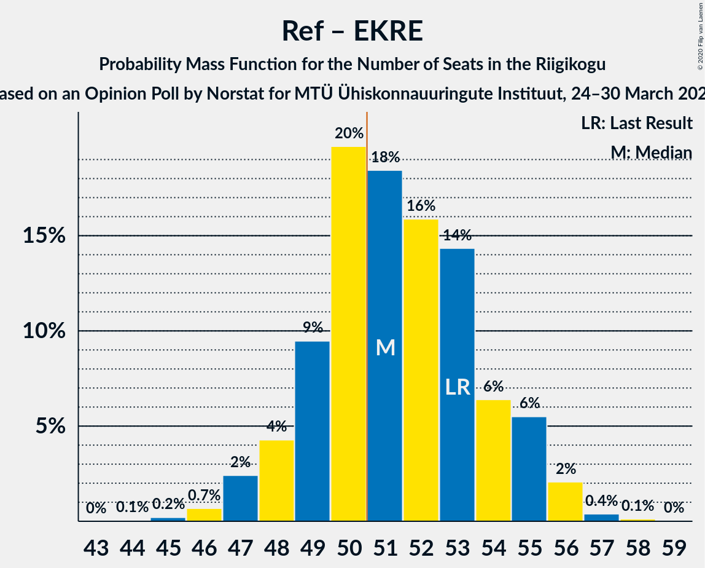

| Number of Seats | Probability | Accumulated | Special Marks |
|:---------------:|:-----------:|:-----------:|:-------------:|
| 44 | 0.1% | 100% |  |
| 45 | 0.2% | 99.9% |  |
| 46 | 0.7% | 99.7% |  |
| 47 | 2% | 99.1% |  |
| 48 | 4% | 97% |  |
| 49 | 9% | 92% |  |
| 50 | 20% | 83% |  |
| 51 | 18% | 63% | Median, Majority |
| 52 | 16% | 45% |  |
| 53 | 14% | 29% | Last Result |
| 54 | 6% | 15% |  |
| 55 | 6% | 8% |  |
| 56 | 2% | 3% |  |
| 57 | 0.4% | 0.6% |  |
| 58 | 0.1% | 0.2% |  |
| 59 | 0% | 0% |  |

### Eesti Keskerakond – Sotsiaaldemokraatlik Erakond – Erakond Isamaa

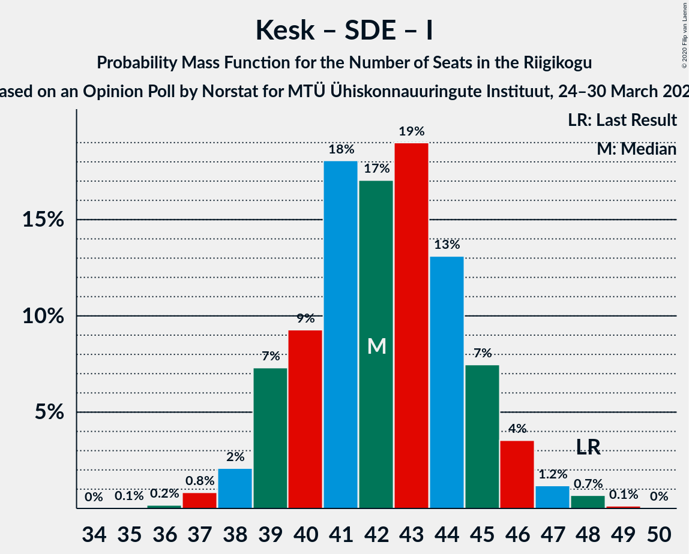

| Number of Seats | Probability | Accumulated | Special Marks |
|:---------------:|:-----------:|:-----------:|:-------------:|
| 35 | 0.1% | 100% |  |
| 36 | 0.2% | 99.9% |  |
| 37 | 0.8% | 99.7% |  |
| 38 | 2% | 98.9% |  |
| 39 | 7% | 97% |  |
| 40 | 9% | 90% |  |
| 41 | 18% | 80% | Median |
| 42 | 17% | 62% |  |
| 43 | 19% | 45% |  |
| 44 | 13% | 26% |  |
| 45 | 7% | 13% |  |
| 46 | 4% | 6% |  |
| 47 | 1.2% | 2% |  |
| 48 | 0.7% | 0.8% | Last Result |
| 49 | 0.1% | 0.2% |  |
| 50 | 0% | 0% |  |

### Eesti Keskerakond – Sotsiaaldemokraatlik Erakond

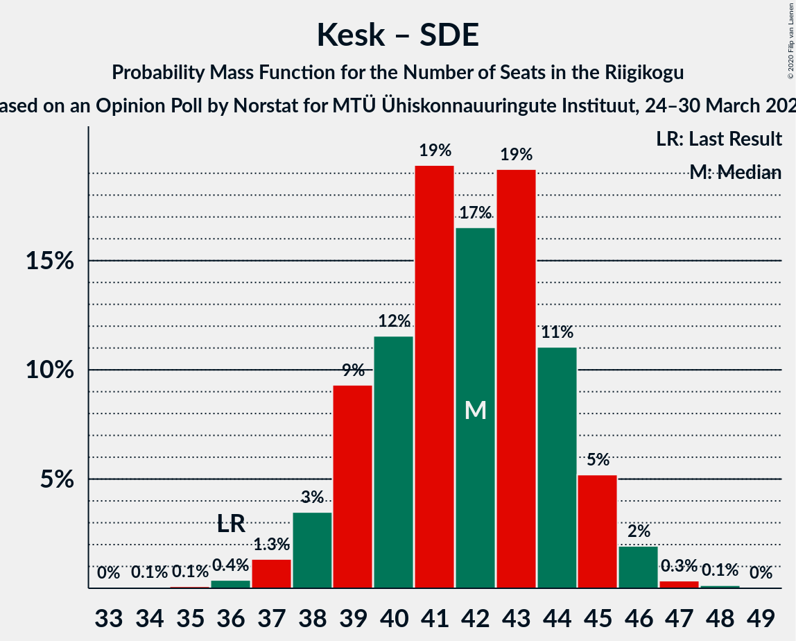

| Number of Seats | Probability | Accumulated | Special Marks |
|:---------------:|:-----------:|:-----------:|:-------------:|
| 34 | 0.1% | 100% |  |
| 35 | 0.1% | 99.9% |  |
| 36 | 0.4% | 99.8% | Last Result |
| 37 | 1.3% | 99.5% |  |
| 38 | 3% | 98% |  |
| 39 | 9% | 95% |  |
| 40 | 12% | 85% |  |
| 41 | 19% | 74% | Median |
| 42 | 17% | 54% |  |
| 43 | 19% | 38% |  |
| 44 | 11% | 19% |  |
| 45 | 5% | 8% |  |
| 46 | 2% | 2% |  |
| 47 | 0.3% | 0.5% |  |
| 48 | 0.1% | 0.2% |  |
| 49 | 0% | 0% |  |

### Eesti Reformierakond – Sotsiaaldemokraatlik Erakond – Erakond Isamaa – Eesti Vabaerakond

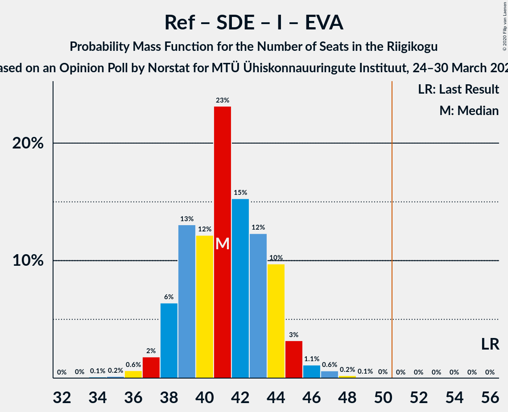

| Number of Seats | Probability | Accumulated | Special Marks |
|:---------------:|:-----------:|:-----------:|:-------------:|
| 34 | 0.1% | 100% |  |
| 35 | 0.2% | 99.9% |  |
| 36 | 0.6% | 99.7% |  |
| 37 | 2% | 99.1% |  |
| 38 | 6% | 97% |  |
| 39 | 13% | 91% |  |
| 40 | 12% | 78% | Median |
| 41 | 23% | 66% |  |
| 42 | 15% | 43% |  |
| 43 | 12% | 27% |  |
| 44 | 10% | 15% |  |
| 45 | 3% | 5% |  |
| 46 | 1.1% | 2% |  |
| 47 | 0.6% | 0.9% |  |
| 48 | 0.2% | 0.3% |  |
| 49 | 0.1% | 0.1% |  |
| 50 | 0% | 0% |  |
| 51 | 0% | 0% | Majority |
| 52 | 0% | 0% |  |
| 53 | 0% | 0% |  |
| 54 | 0% | 0% |  |
| 55 | 0% | 0% |  |
| 56 | 0% | 0% | Last Result |

### Eesti Reformierakond – Sotsiaaldemokraatlik Erakond – Erakond Isamaa

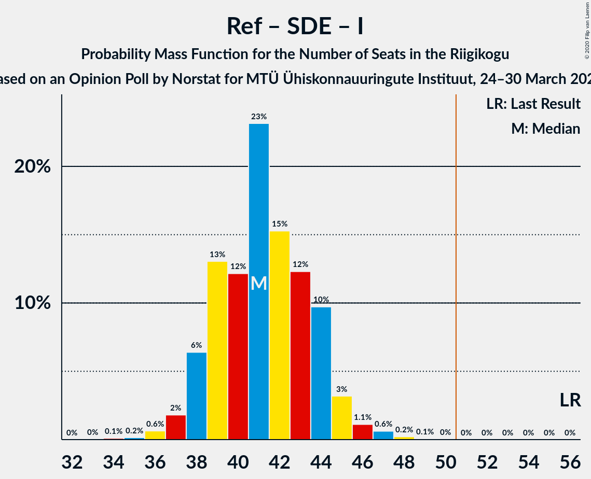

| Number of Seats | Probability | Accumulated | Special Marks |
|:---------------:|:-----------:|:-----------:|:-------------:|
| 34 | 0.1% | 100% |  |
| 35 | 0.2% | 99.9% |  |
| 36 | 0.6% | 99.7% |  |
| 37 | 2% | 99.1% |  |
| 38 | 6% | 97% |  |
| 39 | 13% | 91% |  |
| 40 | 12% | 78% | Median |
| 41 | 23% | 66% |  |
| 42 | 15% | 43% |  |
| 43 | 12% | 27% |  |
| 44 | 10% | 15% |  |
| 45 | 3% | 5% |  |
| 46 | 1.1% | 2% |  |
| 47 | 0.6% | 0.9% |  |
| 48 | 0.2% | 0.3% |  |
| 49 | 0.1% | 0.1% |  |
| 50 | 0% | 0% |  |
| 51 | 0% | 0% | Majority |
| 52 | 0% | 0% |  |
| 53 | 0% | 0% |  |
| 54 | 0% | 0% |  |
| 55 | 0% | 0% |  |
| 56 | 0% | 0% | Last Result |

### Eesti Reformierakond – Sotsiaaldemokraatlik Erakond

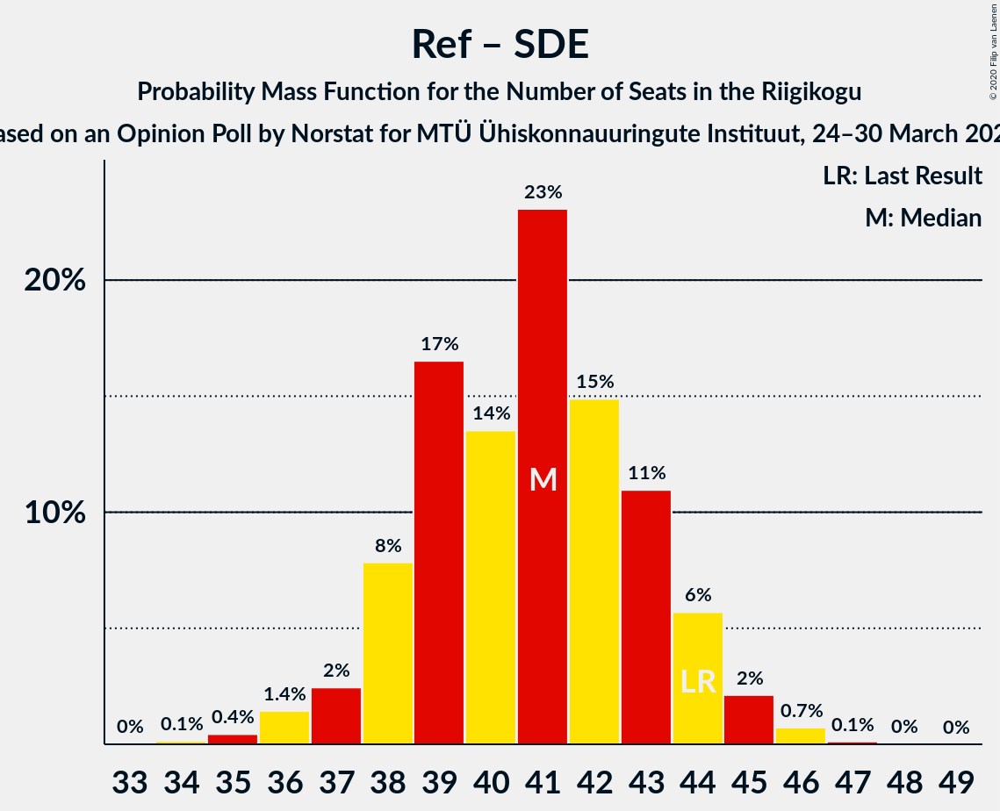

| Number of Seats | Probability | Accumulated | Special Marks |
|:---------------:|:-----------:|:-----------:|:-------------:|
| 34 | 0.1% | 100% |  |
| 35 | 0.4% | 99.8% |  |
| 36 | 1.4% | 99.4% |  |
| 37 | 2% | 98% |  |
| 38 | 8% | 96% |  |
| 39 | 17% | 88% |  |
| 40 | 14% | 71% | Median |
| 41 | 23% | 58% |  |
| 42 | 15% | 35% |  |
| 43 | 11% | 20% |  |
| 44 | 6% | 9% | Last Result |
| 45 | 2% | 3% |  |
| 46 | 0.7% | 0.9% |  |
| 47 | 0.1% | 0.2% |  |
| 48 | 0% | 0.1% |  |
| 49 | 0% | 0% |  |

### Eesti Reformierakond – Erakond Isamaa

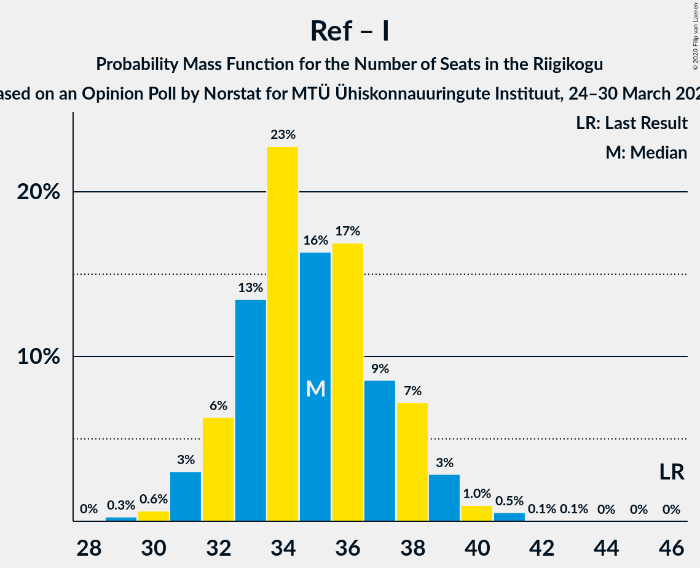

| Number of Seats | Probability | Accumulated | Special Marks |
|:---------------:|:-----------:|:-----------:|:-------------:|
| 29 | 0.3% | 100% |  |
| 30 | 0.6% | 99.7% |  |
| 31 | 3% | 99.1% |  |
| 32 | 6% | 96% |  |
| 33 | 13% | 90% |  |
| 34 | 23% | 76% | Median |
| 35 | 16% | 53% |  |
| 36 | 17% | 37% |  |
| 37 | 9% | 20% |  |
| 38 | 7% | 12% |  |
| 39 | 3% | 4% |  |
| 40 | 1.0% | 2% |  |
| 41 | 0.5% | 0.7% |  |
| 42 | 0.1% | 0.1% |  |
| 43 | 0.1% | 0.1% |  |
| 44 | 0% | 0% |  |
| 45 | 0% | 0% |  |
| 46 | 0% | 0% | Last Result |

### Eesti Konservatiivne Rahvaerakond – Sotsiaaldemokraatlik Erakond

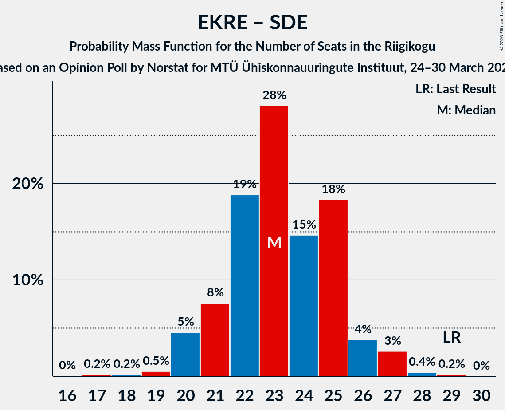

| Number of Seats | Probability | Accumulated | Special Marks |
|:---------------:|:-----------:|:-----------:|:-------------:|
| 16 | 0% | 100% |  |
| 17 | 0.2% | 99.9% |  |
| 18 | 0.2% | 99.8% |  |
| 19 | 0.5% | 99.6% |  |
| 20 | 5% | 99.1% |  |
| 21 | 8% | 95% |  |
| 22 | 19% | 87% |  |
| 23 | 28% | 68% | Median |
| 24 | 15% | 40% |  |
| 25 | 18% | 25% |  |
| 26 | 4% | 7% |  |
| 27 | 3% | 3% |  |
| 28 | 0.4% | 0.6% |  |
| 29 | 0.2% | 0.2% | Last Result |
| 30 | 0% | 0% |  |

## Technical Information

### Opinion Poll

+ **Polling firm:** Norstat
+ **Commissioner(s):** MTÜ Ühiskonnauuringute Instituut
+ **Fieldwork period:** 24–30 March 2020

### Calculations

+ **Sample size:** 1000
+ **Simulations done:** 524,288
+ **Error estimate:** 1.27%

