# Opinion Poll by Norstat for MTÜ Ühiskonnauuringute Instituut, 31 March–6 April 2020

<a href="#voting-intentions">Voting Intentions</a> | <a href="#seats">Seats</a> | <a href="#coalitions">Coalitions</a> | <a href="#technical-information">Technical Information</a>

## Voting Intentions

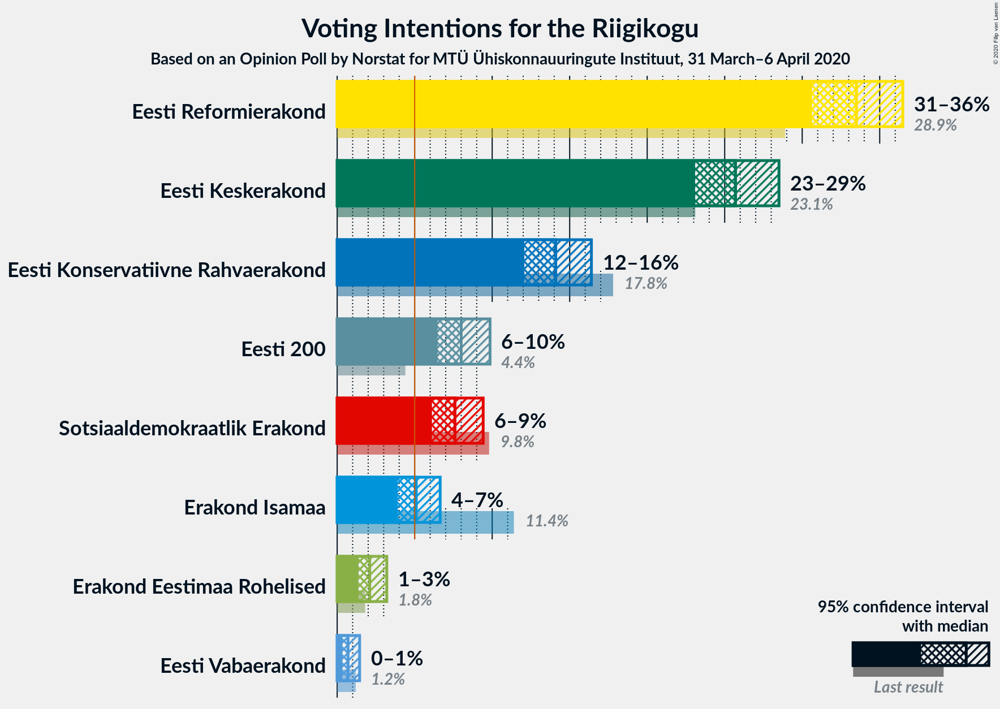

### Confidence Intervals

| Party | Last Result | Poll Result | 80% Confidence Interval | 90% Confidence Interval | 95% Confidence Interval | 99% Confidence Interval |
|:-----:|:-----------:|:-----------:|:-----------------------:|:-----------------------:|:-----------------------:|:-----------------------:|
| Eesti Reformierakond | 28.9% | 33.5% | 31.6–35.5% |31.1–36.0% |30.6–36.5% |29.8–37.4% |
| Eesti Keskerakond | 23.1% | 25.7% | 24.0–27.5% |23.5–28.1% |23.1–28.5% |22.3–29.4% |
| Eesti Konservatiivne Rahvaerakond | 17.8% | 14.1% | 12.8–15.6% |12.4–16.0% |12.1–16.4% |11.5–17.1% |
| Eesti 200 | 4.4% | 8.0% | 7.0–9.2% |6.7–9.6% |6.5–9.9% |6.0–10.5% |
| Sotsiaaldemokraatlik Erakond | 9.8% | 7.6% | 6.6–8.8% |6.3–9.1% |6.1–9.4% |5.7–10.0% |
| Erakond Isamaa | 11.4% | 5.1% | 4.3–6.1% |4.1–6.4% |3.9–6.6% |3.6–7.2% |
| Erakond Eestimaa Rohelised | 1.8% | 2.1% | 1.6–2.8% |1.5–3.0% |1.4–3.2% |1.2–3.6% |
| Eesti Vabaerakond | 1.2% | 0.7% | 0.5–1.2% |0.4–1.3% |0.3–1.4% |0.2–1.7% |

*Note:* The poll result column reflects the actual value used in the calculations. Published results may vary slightly, and in addition be rounded to fewer digits.

## Seats

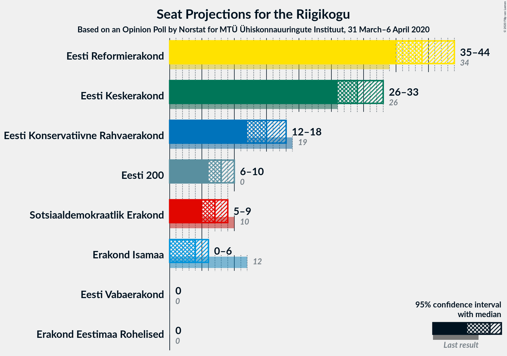

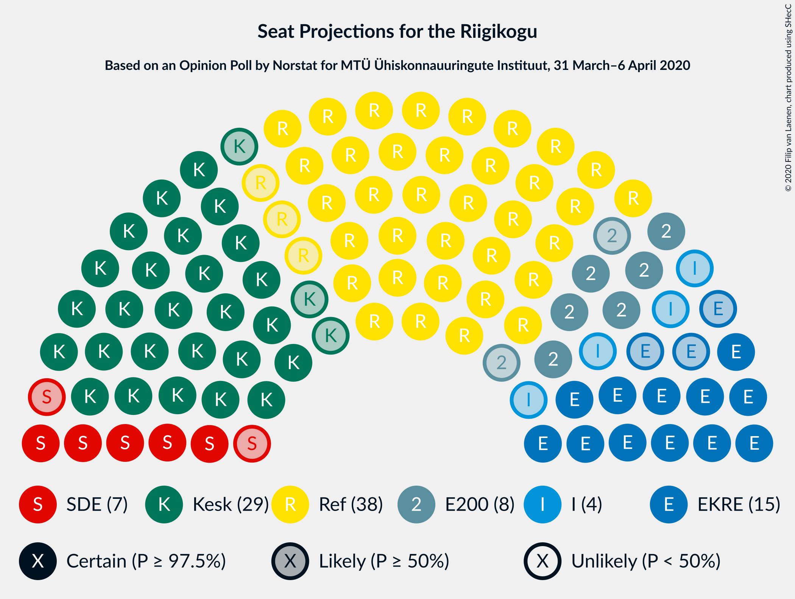

### Confidence Intervals

| Party | Last Result | Median | 80% Confidence Interval | 90% Confidence Interval | 95% Confidence Interval | 99% Confidence Interval |
|:-----:|:-----------:|:------:|:-----------------------:|:-----------------------:|:-----------------------:|:-----------------------:|
| <a href="#eesti-reformierakond">Eesti Reformierakond</a> | 34 | 39 | 36–42 |35–43 |35–44 |34–45 |
| <a href="#eesti-keskerakond">Eesti Keskerakond</a> | 26 | 29 | 27–32 |26–33 |26–33 |24–34 |
| <a href="#eesti-konservatiivne-rahvaerakond">Eesti Konservatiivne Rahvaerakond</a> | 19 | 15 | 13–17 |12–17 |12–18 |12–19 |
| <a href="#eesti-200">Eesti 200</a> | 0 | 8 | 7–9 |6–10 |6–10 |5–11 |
| <a href="#sotsiaaldemokraatlik-erakond">Sotsiaaldemokraatlik Erakond</a> | 10 | 7 | 6–9 |6–9 |5–9 |5–10 |
| <a href="#erakond-isamaa">Erakond Isamaa</a> | 12 | 4 | 0–5 |0–6 |0–6 |0–7 |
| <a href="#erakond-eestimaa-rohelised">Erakond Eestimaa Rohelised</a> | 0 | 0 | 0 |0 |0 |0 |
| <a href="#eesti-vabaerakond">Eesti Vabaerakond</a> | 0 | 0 | 0 |0 |0 |0 |

### Eesti Reformierakond

*For a full overview of the results for this party, see the [Eesti Reformierakond](party-eestireformierakond.html) page.*

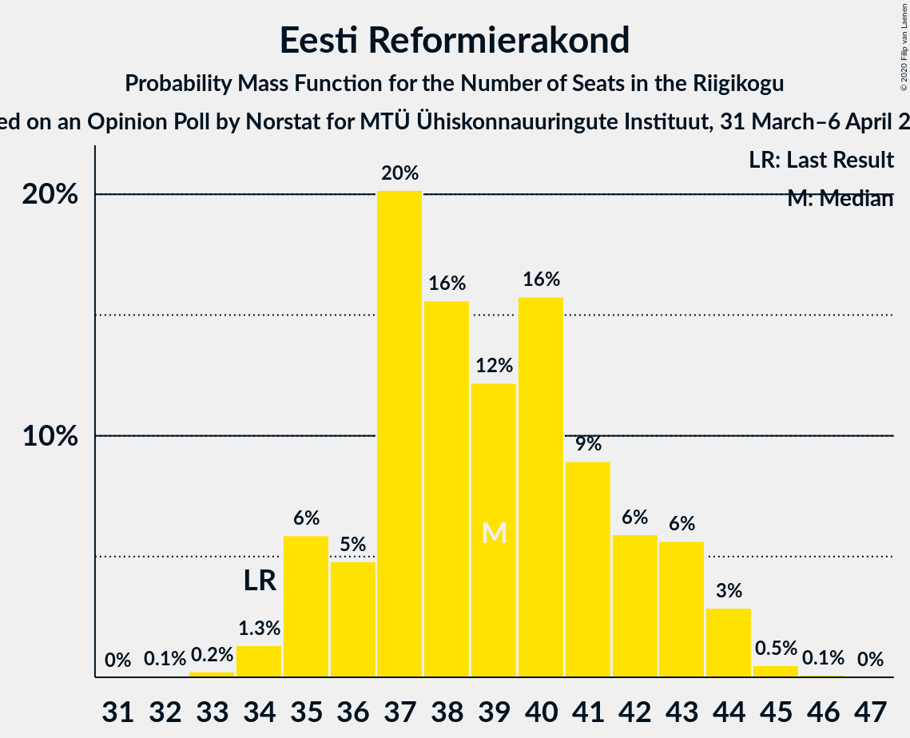

| Number of Seats | Probability | Accumulated | Special Marks |
|:---------------:|:-----------:|:-----------:|:-------------:|
| 32 | 0.1% | 100% |  |
| 33 | 0.2% | 99.9% |  |
| 34 | 1.3% | 99.7% | Last Result |
| 35 | 6% | 98% |  |
| 36 | 5% | 92% |  |
| 37 | 20% | 88% |  |
| 38 | 16% | 68% |  |
| 39 | 12% | 52% | Median |
| 40 | 16% | 40% |  |
| 41 | 9% | 24% |  |
| 42 | 6% | 15% |  |
| 43 | 6% | 9% |  |
| 44 | 3% | 3% |  |
| 45 | 0.5% | 0.6% |  |
| 46 | 0.1% | 0.1% |  |
| 47 | 0% | 0% |  |

### Eesti Keskerakond

*For a full overview of the results for this party, see the [Eesti Keskerakond](party-eestikeskerakond.html) page.*

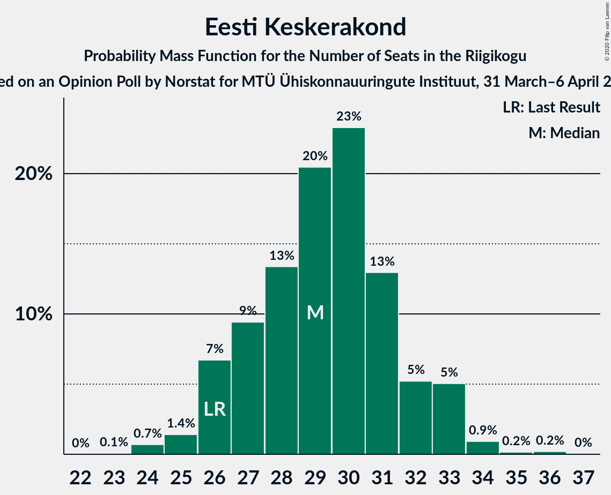

| Number of Seats | Probability | Accumulated | Special Marks |
|:---------------:|:-----------:|:-----------:|:-------------:|
| 23 | 0.1% | 100% |  |
| 24 | 0.7% | 99.9% |  |
| 25 | 1.4% | 99.2% |  |
| 26 | 7% | 98% | Last Result |
| 27 | 9% | 91% |  |
| 28 | 13% | 82% |  |
| 29 | 20% | 68% | Median |
| 30 | 23% | 48% |  |
| 31 | 13% | 25% |  |
| 32 | 5% | 12% |  |
| 33 | 5% | 6% |  |
| 34 | 0.9% | 1.3% |  |
| 35 | 0.2% | 0.4% |  |
| 36 | 0.2% | 0.2% |  |
| 37 | 0% | 0% |  |

### Eesti Konservatiivne Rahvaerakond

*For a full overview of the results for this party, see the [Eesti Konservatiivne Rahvaerakond](party-eestikonservatiivnerahvaerakond.html) page.*

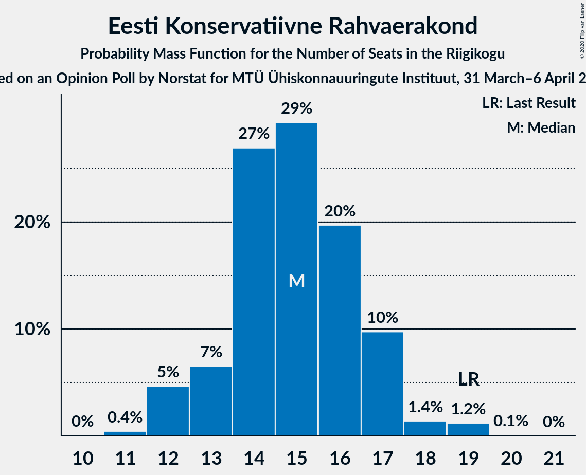

| Number of Seats | Probability | Accumulated | Special Marks |
|:---------------:|:-----------:|:-----------:|:-------------:|
| 11 | 0.4% | 100% |  |
| 12 | 5% | 99.5% |  |
| 13 | 7% | 95% |  |
| 14 | 27% | 88% |  |
| 15 | 29% | 61% | Median |
| 16 | 20% | 32% |  |
| 17 | 10% | 12% |  |
| 18 | 1.4% | 3% |  |
| 19 | 1.2% | 1.3% | Last Result |
| 20 | 0.1% | 0.1% |  |
| 21 | 0% | 0% |  |

### Eesti 200

*For a full overview of the results for this party, see the [Eesti 200](party-eesti200.html) page.*

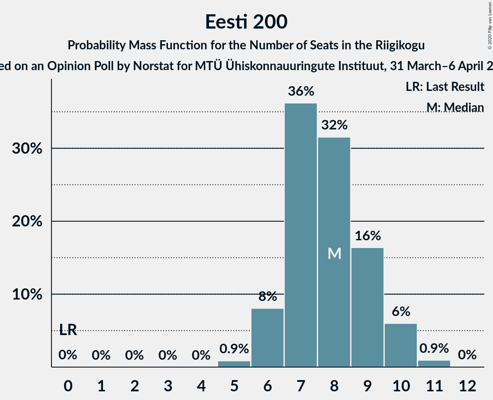

| Number of Seats | Probability | Accumulated | Special Marks |
|:---------------:|:-----------:|:-----------:|:-------------:|
| 0 | 0% | 100% | Last Result |
| 1 | 0% | 100% |  |
| 2 | 0% | 100% |  |
| 3 | 0% | 100% |  |
| 4 | 0% | 100% |  |
| 5 | 0.9% | 100% |  |
| 6 | 8% | 99.1% |  |
| 7 | 36% | 91% |  |
| 8 | 32% | 55% | Median |
| 9 | 16% | 23% |  |
| 10 | 6% | 7% |  |
| 11 | 0.9% | 1.0% |  |
| 12 | 0% | 0% |  |

### Sotsiaaldemokraatlik Erakond

*For a full overview of the results for this party, see the [Sotsiaaldemokraatlik Erakond](party-sotsiaaldemokraatlikerakond.html) page.*

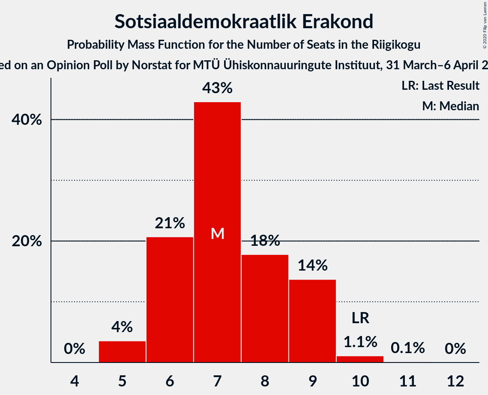

| Number of Seats | Probability | Accumulated | Special Marks |
|:---------------:|:-----------:|:-----------:|:-------------:|
| 4 | 0% | 100% |  |
| 5 | 4% | 99.9% |  |
| 6 | 21% | 96% |  |
| 7 | 43% | 76% | Median |
| 8 | 18% | 33% |  |
| 9 | 14% | 15% |  |
| 10 | 1.1% | 1.3% | Last Result |
| 11 | 0.1% | 0.2% |  |
| 12 | 0% | 0% |  |

### Erakond Isamaa

*For a full overview of the results for this party, see the [Erakond Isamaa](party-erakondisamaa.html) page.*

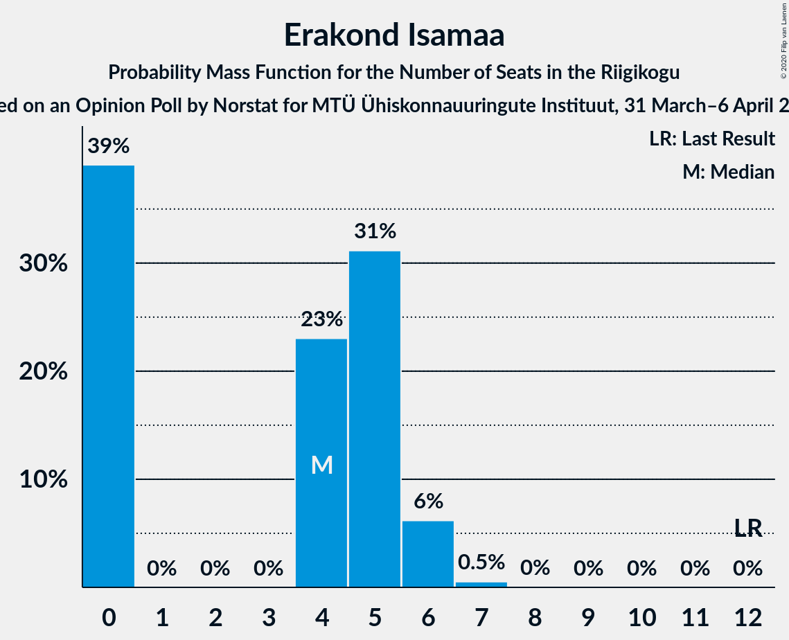

| Number of Seats | Probability | Accumulated | Special Marks |
|:---------------:|:-----------:|:-----------:|:-------------:|
| 0 | 39% | 100% |  |
| 1 | 0% | 61% |  |
| 2 | 0% | 61% |  |
| 3 | 0% | 61% |  |
| 4 | 23% | 61% | Median |
| 5 | 31% | 38% |  |
| 6 | 6% | 7% |  |
| 7 | 0.5% | 0.5% |  |
| 8 | 0% | 0% |  |
| 9 | 0% | 0% |  |
| 10 | 0% | 0% |  |
| 11 | 0% | 0% |  |
| 12 | 0% | 0% | Last Result |

### Erakond Eestimaa Rohelised

*For a full overview of the results for this party, see the [Erakond Eestimaa Rohelised](party-erakondeestimaarohelised.html) page.*

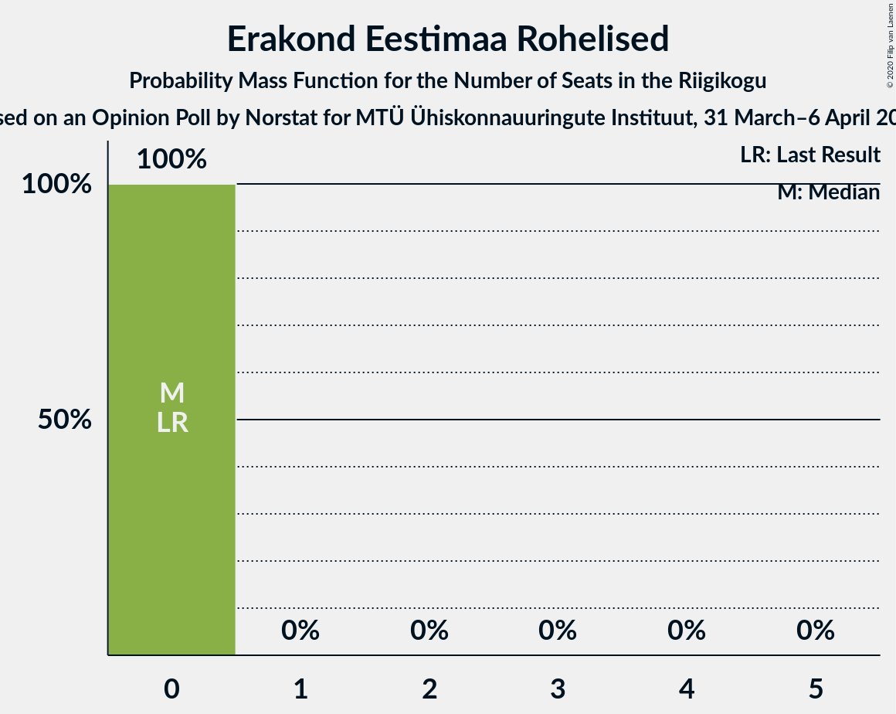

| Number of Seats | Probability | Accumulated | Special Marks |
|:---------------:|:-----------:|:-----------:|:-------------:|
| 0 | 100% | 100% | Last Result, Median |

### Eesti Vabaerakond

*For a full overview of the results for this party, see the [Eesti Vabaerakond](party-eestivabaerakond.html) page.*

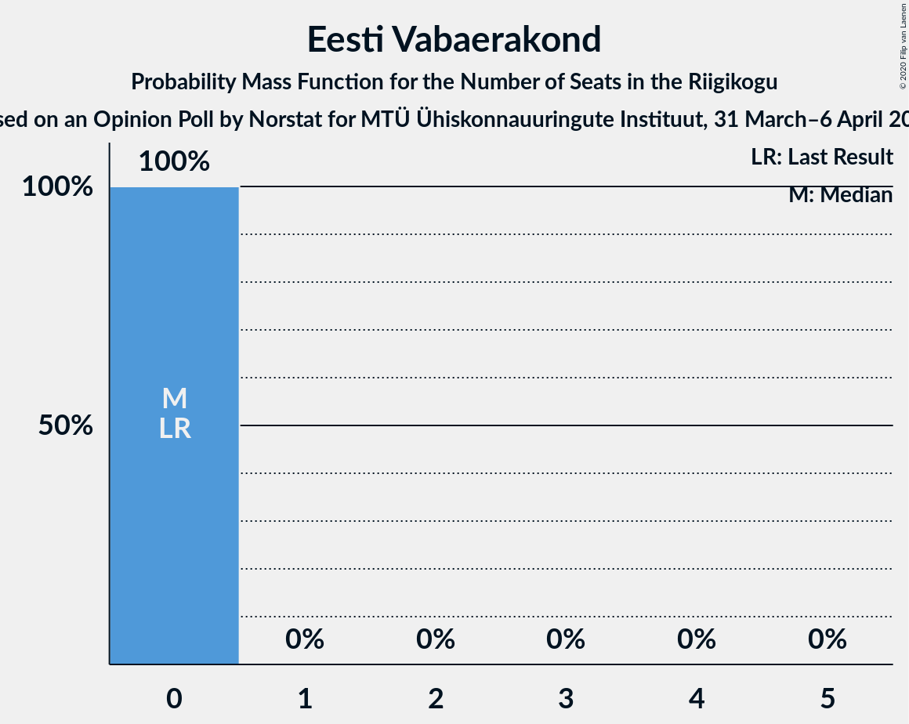

| Number of Seats | Probability | Accumulated | Special Marks |
|:---------------:|:-----------:|:-----------:|:-------------:|
| 0 | 100% | 100% | Last Result, Median |

## Coalitions

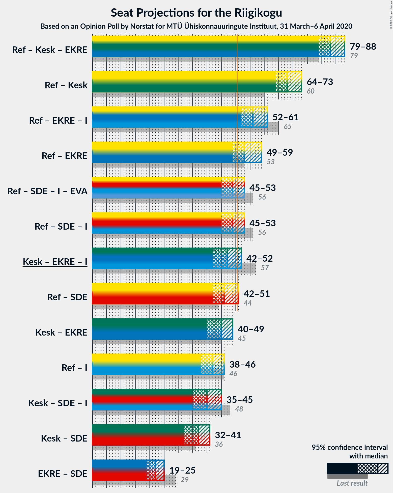

### Confidence Intervals

| Coalition | Last Result | Median | Majority? | 80% Confidence Interval | 90% Confidence Interval | 95% Confidence Interval | 99% Confidence Interval |
|:---------:|:-----------:|:------:|:---------:|:-----------------------:|:-----------------------:|:-----------------------:|:-----------------------:|
| Eesti Reformierakond – Eesti Keskerakond – Eesti Konservatiivne Rahvaerakond | 79 | 83 | 100% | 80–87 | 79–87 | 79–88 | 78–88 |
| Eesti Reformierakond – Eesti Keskerakond | 60 | 68 | 100% | 65–72 | 65–73 | 64–73 | 62–75 |
| Eesti Reformierakond – Eesti Konservatiivne Rahvaerakond – Erakond Isamaa | 65 | 56 | 99.6% | 54–59 | 53–60 | 52–61 | 51–62 |
| Eesti Reformierakond – Eesti Konservatiivne Rahvaerakond | 53 | 53 | 92% | 51–58 | 49–59 | 49–59 | 48–60 |
| Eesti Reformierakond – Sotsiaaldemokraatlik Erakond – Erakond Isamaa – Eesti Vabaerakond | 56 | 49 | 24% | 47–52 | 46–53 | 45–53 | 43–55 |
| Eesti Reformierakond – Sotsiaaldemokraatlik Erakond – Erakond Isamaa | 56 | 49 | 24% | 47–52 | 46–53 | 45–53 | 43–55 |
| Eesti Keskerakond – Eesti Konservatiivne Rahvaerakond – Erakond Isamaa | 57 | 47 | 7% | 44–50 | 43–51 | 42–52 | 41–53 |
| Eesti Reformierakond – Sotsiaaldemokraatlik Erakond | 44 | 46 | 7% | 43–49 | 43–51 | 42–51 | 41–53 |
| Eesti Keskerakond – Eesti Konservatiivne Rahvaerakond | 45 | 45 | 0.3% | 41–47 | 40–47 | 40–49 | 38–50 |
| Eesti Reformierakond – Erakond Isamaa | 46 | 42 | 0% | 39–45 | 39–46 | 38–46 | 36–48 |
| Eesti Keskerakond – Sotsiaaldemokraatlik Erakond – Erakond Isamaa | 48 | 40 | 0% | 35–42 | 35–44 | 35–45 | 33–45 |
| Eesti Keskerakond – Sotsiaaldemokraatlik Erakond | 36 | 37 | 0% | 34–39 | 33–40 | 32–41 | 31–42 |
| Eesti Konservatiivne Rahvaerakond – Sotsiaaldemokraatlik Erakond | 29 | 22 | 0% | 20–24 | 19–25 | 19–25 | 18–27 |

### Eesti Reformierakond – Eesti Keskerakond – Eesti Konservatiivne Rahvaerakond

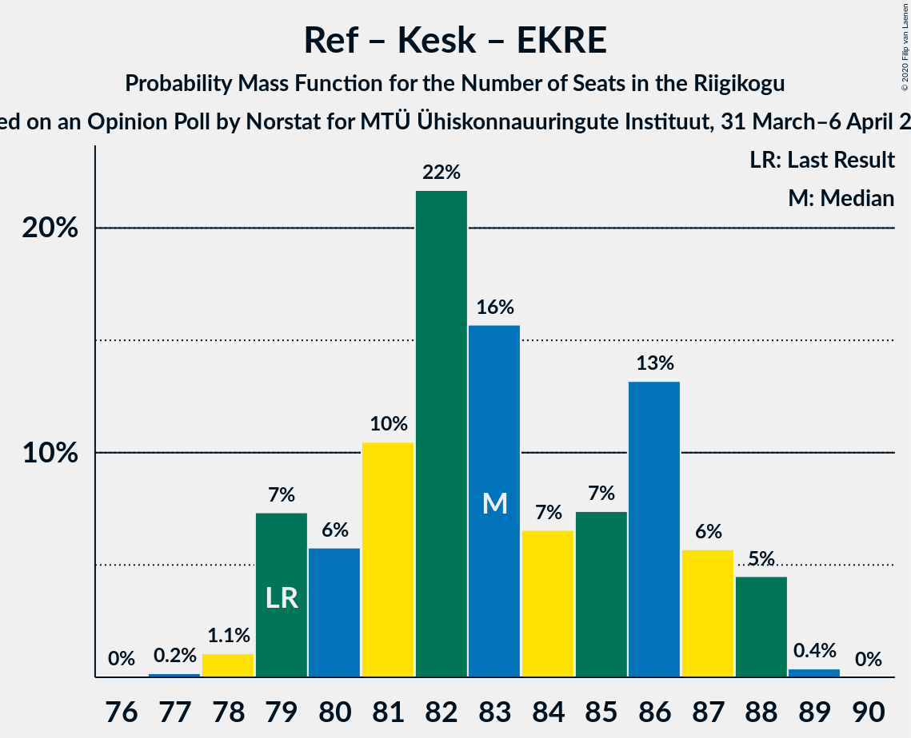

| Number of Seats | Probability | Accumulated | Special Marks |
|:---------------:|:-----------:|:-----------:|:-------------:|
| 77 | 0.2% | 100% |  |
| 78 | 1.1% | 99.8% |  |
| 79 | 7% | 98.7% | Last Result |
| 80 | 6% | 91% |  |
| 81 | 10% | 86% |  |
| 82 | 22% | 75% |  |
| 83 | 16% | 53% | Median |
| 84 | 7% | 38% |  |
| 85 | 7% | 31% |  |
| 86 | 13% | 24% |  |
| 87 | 6% | 11% |  |
| 88 | 5% | 5% |  |
| 89 | 0.4% | 0.4% |  |
| 90 | 0% | 0% |  |

### Eesti Reformierakond – Eesti Keskerakond

| Number of Seats | Probability | Accumulated | Special Marks |
|:---------------:|:-----------:|:-----------:|:-------------:|
| 60 | 0% | 100% | Last Result |
| 61 | 0.1% | 100% |  |
| 62 | 0.4% | 99.9% |  |
| 63 | 1.4% | 99.5% |  |
| 64 | 3% | 98% |  |
| 65 | 10% | 95% |  |
| 66 | 13% | 85% |  |
| 67 | 17% | 72% |  |
| 68 | 9% | 56% | Median |
| 69 | 15% | 47% |  |
| 70 | 15% | 32% |  |
| 71 | 5% | 17% |  |
| 72 | 6% | 11% |  |
| 73 | 4% | 5% |  |
| 74 | 0.2% | 1.2% |  |
| 75 | 0.9% | 1.0% |  |
| 76 | 0% | 0% |  |

### Eesti Reformierakond – Eesti Konservatiivne Rahvaerakond – Erakond Isamaa

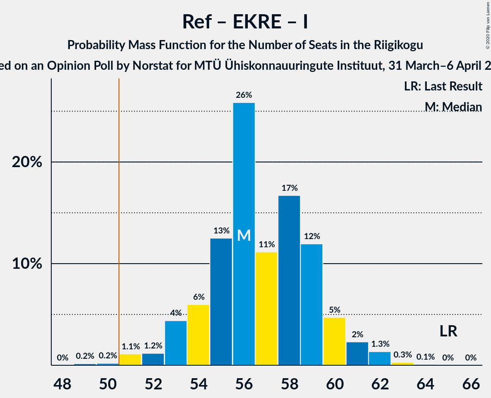

| Number of Seats | Probability | Accumulated | Special Marks |
|:---------------:|:-----------:|:-----------:|:-------------:|
| 49 | 0.2% | 100% |  |
| 50 | 0.2% | 99.8% |  |
| 51 | 1.1% | 99.6% | Majority |
| 52 | 1.2% | 98.5% |  |
| 53 | 4% | 97% |  |
| 54 | 6% | 93% |  |
| 55 | 13% | 87% |  |
| 56 | 26% | 74% |  |
| 57 | 11% | 49% |  |
| 58 | 17% | 37% | Median |
| 59 | 12% | 21% |  |
| 60 | 5% | 9% |  |
| 61 | 2% | 4% |  |
| 62 | 1.3% | 2% |  |
| 63 | 0.3% | 0.4% |  |
| 64 | 0.1% | 0.1% |  |
| 65 | 0% | 0% | Last Result |

### Eesti Reformierakond – Eesti Konservatiivne Rahvaerakond

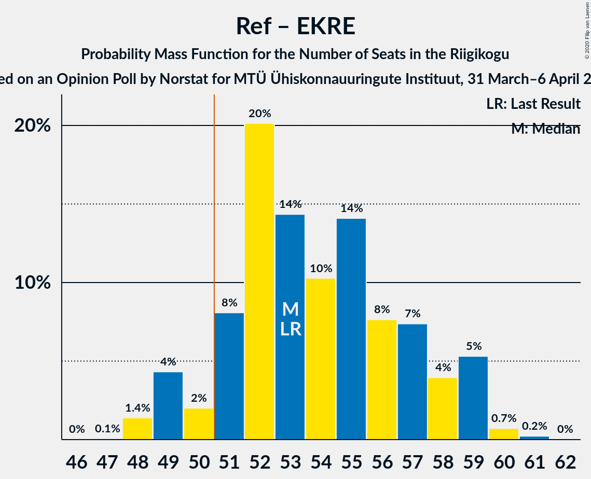

| Number of Seats | Probability | Accumulated | Special Marks |
|:---------------:|:-----------:|:-----------:|:-------------:|
| 47 | 0.1% | 100% |  |
| 48 | 1.4% | 99.9% |  |
| 49 | 4% | 98.5% |  |
| 50 | 2% | 94% |  |
| 51 | 8% | 92% | Majority |
| 52 | 20% | 84% |  |
| 53 | 14% | 64% | Last Result |
| 54 | 10% | 50% | Median |
| 55 | 14% | 39% |  |
| 56 | 8% | 25% |  |
| 57 | 7% | 18% |  |
| 58 | 4% | 10% |  |
| 59 | 5% | 6% |  |
| 60 | 0.7% | 1.0% |  |
| 61 | 0.2% | 0.3% |  |
| 62 | 0% | 0% |  |

### Eesti Reformierakond – Sotsiaaldemokraatlik Erakond – Erakond Isamaa – Eesti Vabaerakond

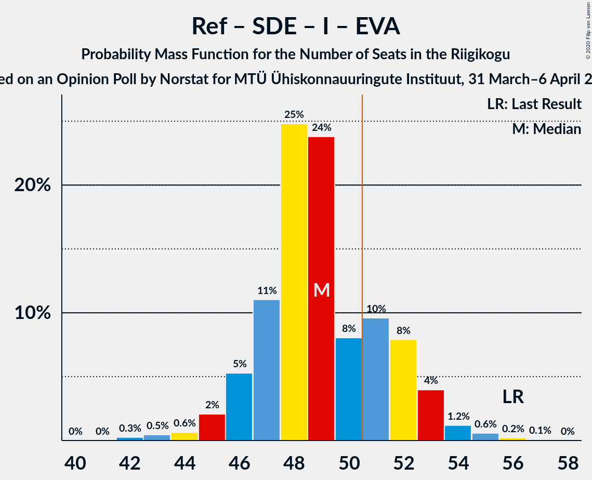

| Number of Seats | Probability | Accumulated | Special Marks |
|:---------------:|:-----------:|:-----------:|:-------------:|
| 42 | 0.3% | 100% |  |
| 43 | 0.5% | 99.7% |  |
| 44 | 0.6% | 99.3% |  |
| 45 | 2% | 98.6% |  |
| 46 | 5% | 97% |  |
| 47 | 11% | 91% |  |
| 48 | 25% | 80% |  |
| 49 | 24% | 55% |  |
| 50 | 8% | 32% | Median |
| 51 | 10% | 24% | Majority |
| 52 | 8% | 14% |  |
| 53 | 4% | 6% |  |
| 54 | 1.2% | 2% |  |
| 55 | 0.6% | 0.9% |  |
| 56 | 0.2% | 0.3% | Last Result |
| 57 | 0.1% | 0.1% |  |
| 58 | 0% | 0% |  |

### Eesti Reformierakond – Sotsiaaldemokraatlik Erakond – Erakond Isamaa

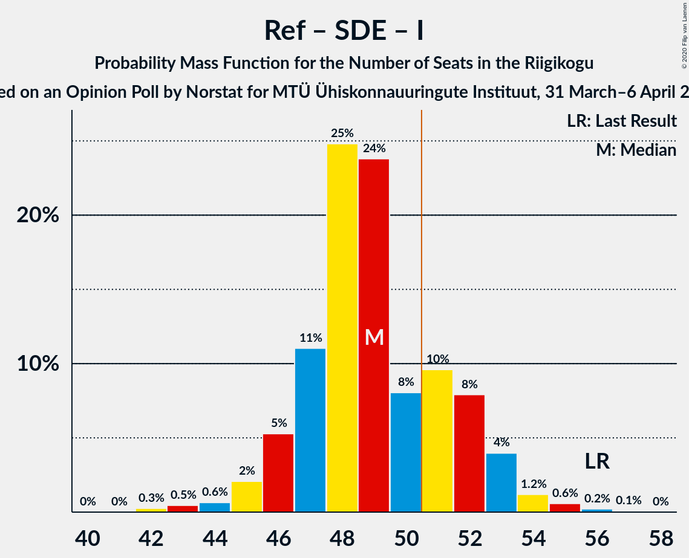

| Number of Seats | Probability | Accumulated | Special Marks |
|:---------------:|:-----------:|:-----------:|:-------------:|
| 42 | 0.3% | 100% |  |
| 43 | 0.5% | 99.7% |  |
| 44 | 0.6% | 99.3% |  |
| 45 | 2% | 98.6% |  |
| 46 | 5% | 97% |  |
| 47 | 11% | 91% |  |
| 48 | 25% | 80% |  |
| 49 | 24% | 55% |  |
| 50 | 8% | 32% | Median |
| 51 | 10% | 24% | Majority |
| 52 | 8% | 14% |  |
| 53 | 4% | 6% |  |
| 54 | 1.2% | 2% |  |
| 55 | 0.6% | 0.9% |  |
| 56 | 0.2% | 0.3% | Last Result |
| 57 | 0.1% | 0.1% |  |
| 58 | 0% | 0% |  |

### Eesti Keskerakond – Eesti Konservatiivne Rahvaerakond – Erakond Isamaa

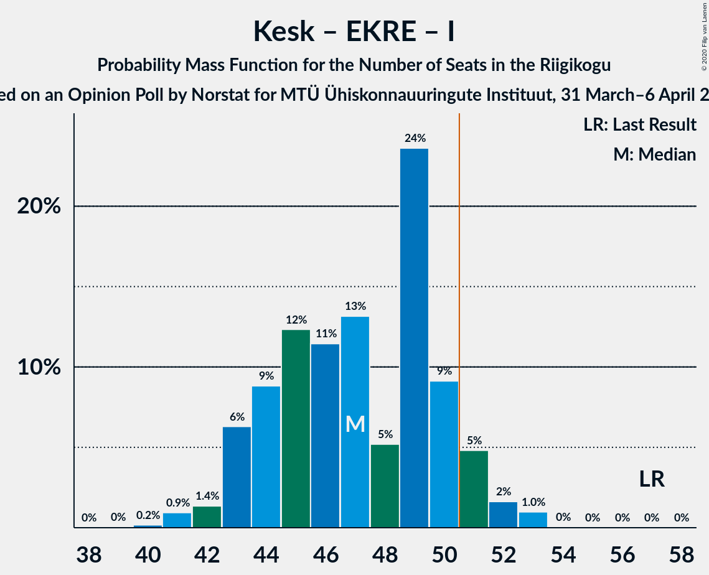

| Number of Seats | Probability | Accumulated | Special Marks |
|:---------------:|:-----------:|:-----------:|:-------------:|
| 39 | 0% | 100% |  |
| 40 | 0.2% | 99.9% |  |
| 41 | 0.9% | 99.8% |  |
| 42 | 1.4% | 98.8% |  |
| 43 | 6% | 97% |  |
| 44 | 9% | 91% |  |
| 45 | 12% | 82% |  |
| 46 | 11% | 70% |  |
| 47 | 13% | 59% |  |
| 48 | 5% | 45% | Median |
| 49 | 24% | 40% |  |
| 50 | 9% | 17% |  |
| 51 | 5% | 7% | Majority |
| 52 | 2% | 3% |  |
| 53 | 1.0% | 1.0% |  |
| 54 | 0% | 0.1% |  |
| 55 | 0% | 0% |  |
| 56 | 0% | 0% |  |
| 57 | 0% | 0% | Last Result |

### Eesti Reformierakond – Sotsiaaldemokraatlik Erakond

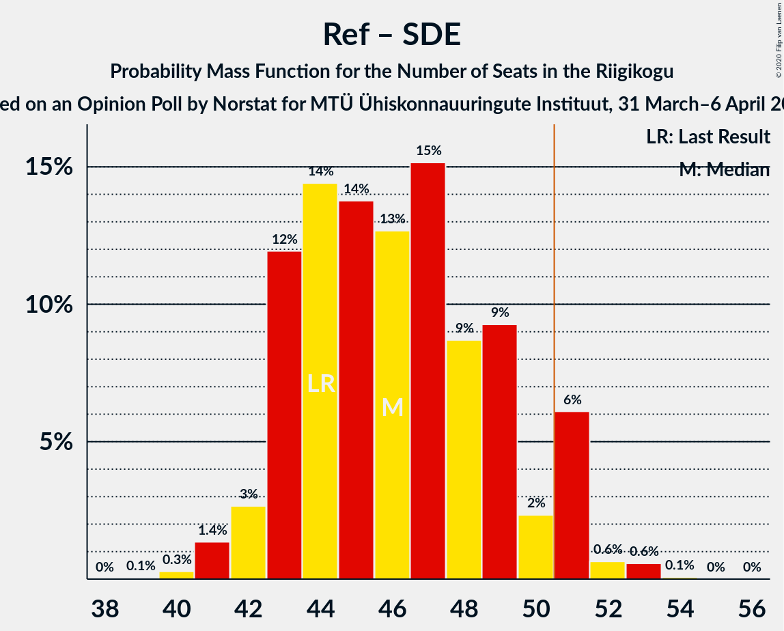

| Number of Seats | Probability | Accumulated | Special Marks |
|:---------------:|:-----------:|:-----------:|:-------------:|
| 39 | 0.1% | 100% |  |
| 40 | 0.3% | 99.9% |  |
| 41 | 1.4% | 99.7% |  |
| 42 | 3% | 98% |  |
| 43 | 12% | 96% |  |
| 44 | 14% | 84% | Last Result |
| 45 | 14% | 69% |  |
| 46 | 13% | 56% | Median |
| 47 | 15% | 43% |  |
| 48 | 9% | 28% |  |
| 49 | 9% | 19% |  |
| 50 | 2% | 10% |  |
| 51 | 6% | 7% | Majority |
| 52 | 0.6% | 1.3% |  |
| 53 | 0.6% | 0.7% |  |
| 54 | 0.1% | 0.1% |  |
| 55 | 0% | 0% |  |

### Eesti Keskerakond – Eesti Konservatiivne Rahvaerakond

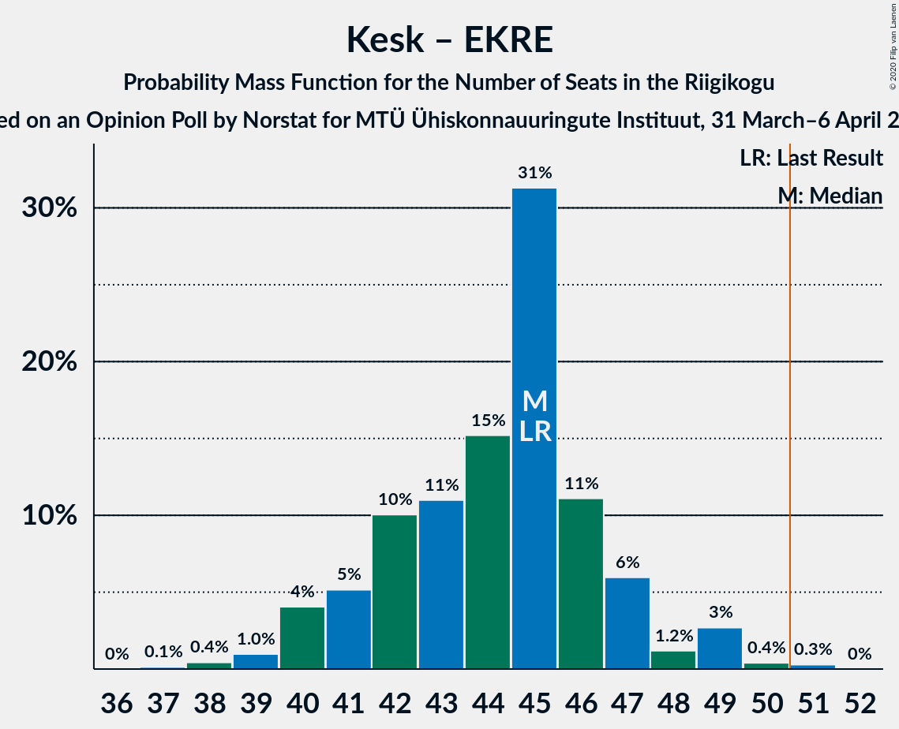

| Number of Seats | Probability | Accumulated | Special Marks |
|:---------------:|:-----------:|:-----------:|:-------------:|
| 37 | 0.1% | 100% |  |
| 38 | 0.4% | 99.8% |  |
| 39 | 1.0% | 99.4% |  |
| 40 | 4% | 98% |  |
| 41 | 5% | 94% |  |
| 42 | 10% | 89% |  |
| 43 | 11% | 79% |  |
| 44 | 15% | 68% | Median |
| 45 | 31% | 53% | Last Result |
| 46 | 11% | 22% |  |
| 47 | 6% | 11% |  |
| 48 | 1.2% | 5% |  |
| 49 | 3% | 3% |  |
| 50 | 0.4% | 0.7% |  |
| 51 | 0.3% | 0.3% | Majority |
| 52 | 0% | 0% |  |

### Eesti Reformierakond – Erakond Isamaa

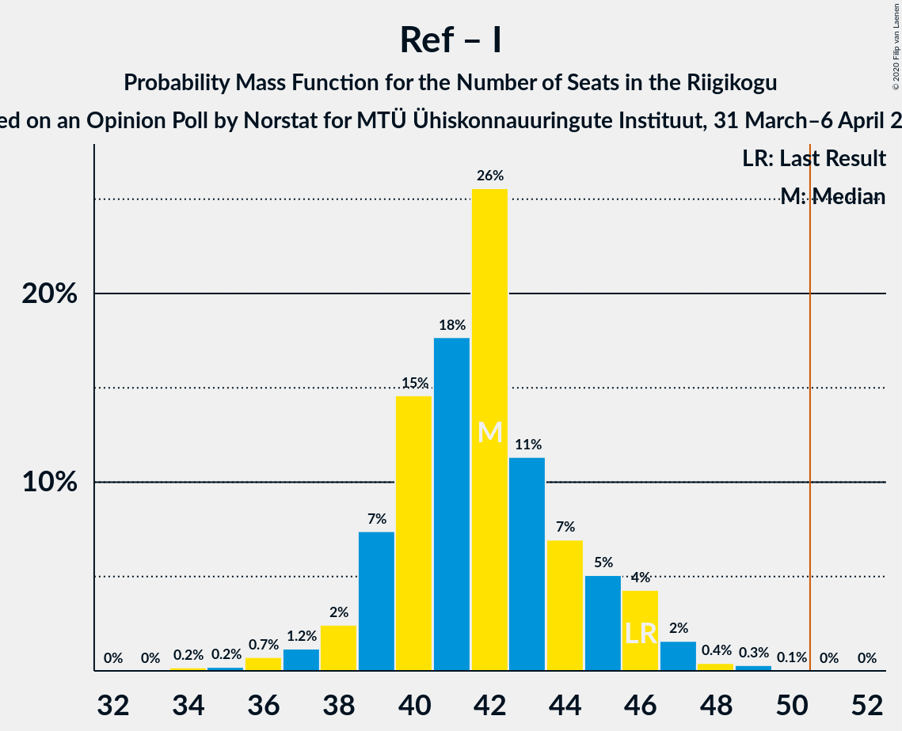

| Number of Seats | Probability | Accumulated | Special Marks |
|:---------------:|:-----------:|:-----------:|:-------------:|
| 34 | 0.2% | 100% |  |
| 35 | 0.2% | 99.8% |  |
| 36 | 0.7% | 99.6% |  |
| 37 | 1.2% | 98.9% |  |
| 38 | 2% | 98% |  |
| 39 | 7% | 95% |  |
| 40 | 15% | 88% |  |
| 41 | 18% | 73% |  |
| 42 | 26% | 56% |  |
| 43 | 11% | 30% | Median |
| 44 | 7% | 19% |  |
| 45 | 5% | 12% |  |
| 46 | 4% | 7% | Last Result |
| 47 | 2% | 2% |  |
| 48 | 0.4% | 0.8% |  |
| 49 | 0.3% | 0.4% |  |
| 50 | 0.1% | 0.1% |  |
| 51 | 0% | 0% | Majority |

### Eesti Keskerakond – Sotsiaaldemokraatlik Erakond – Erakond Isamaa

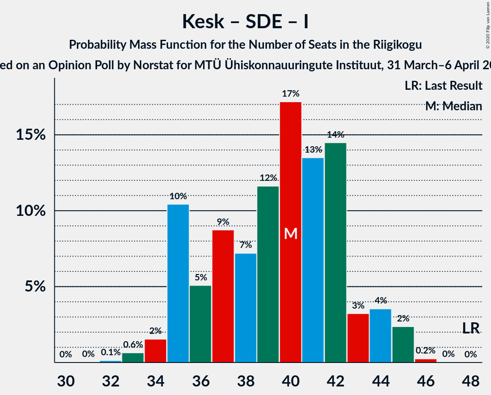

| Number of Seats | Probability | Accumulated | Special Marks |
|:---------------:|:-----------:|:-----------:|:-------------:|
| 32 | 0.1% | 100% |  |
| 33 | 0.6% | 99.8% |  |
| 34 | 2% | 99.2% |  |
| 35 | 10% | 98% |  |
| 36 | 5% | 87% |  |
| 37 | 9% | 82% |  |
| 38 | 7% | 73% |  |
| 39 | 12% | 66% |  |
| 40 | 17% | 55% | Median |
| 41 | 13% | 37% |  |
| 42 | 14% | 24% |  |
| 43 | 3% | 9% |  |
| 44 | 4% | 6% |  |
| 45 | 2% | 3% |  |
| 46 | 0.2% | 0.3% |  |
| 47 | 0% | 0% |  |
| 48 | 0% | 0% | Last Result |

### Eesti Keskerakond – Sotsiaaldemokraatlik Erakond

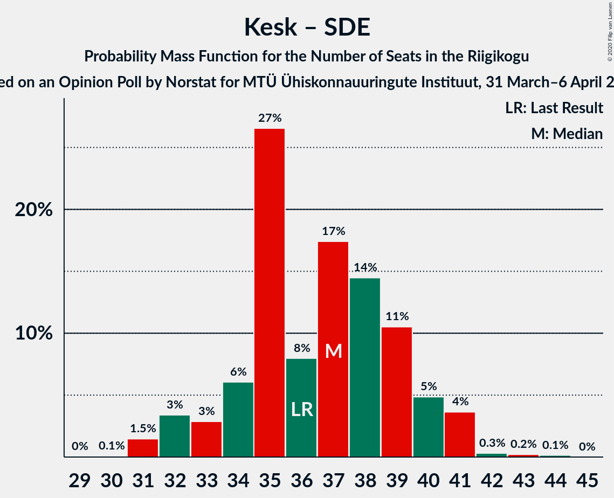

| Number of Seats | Probability | Accumulated | Special Marks |
|:---------------:|:-----------:|:-----------:|:-------------:|
| 30 | 0.1% | 100% |  |
| 31 | 1.5% | 99.9% |  |
| 32 | 3% | 98% |  |
| 33 | 3% | 95% |  |
| 34 | 6% | 92% |  |
| 35 | 27% | 86% |  |
| 36 | 8% | 60% | Last Result, Median |
| 37 | 17% | 52% |  |
| 38 | 14% | 34% |  |
| 39 | 11% | 20% |  |
| 40 | 5% | 9% |  |
| 41 | 4% | 4% |  |
| 42 | 0.3% | 0.7% |  |
| 43 | 0.2% | 0.4% |  |
| 44 | 0.1% | 0.2% |  |
| 45 | 0% | 0% |  |

### Eesti Konservatiivne Rahvaerakond – Sotsiaaldemokraatlik Erakond

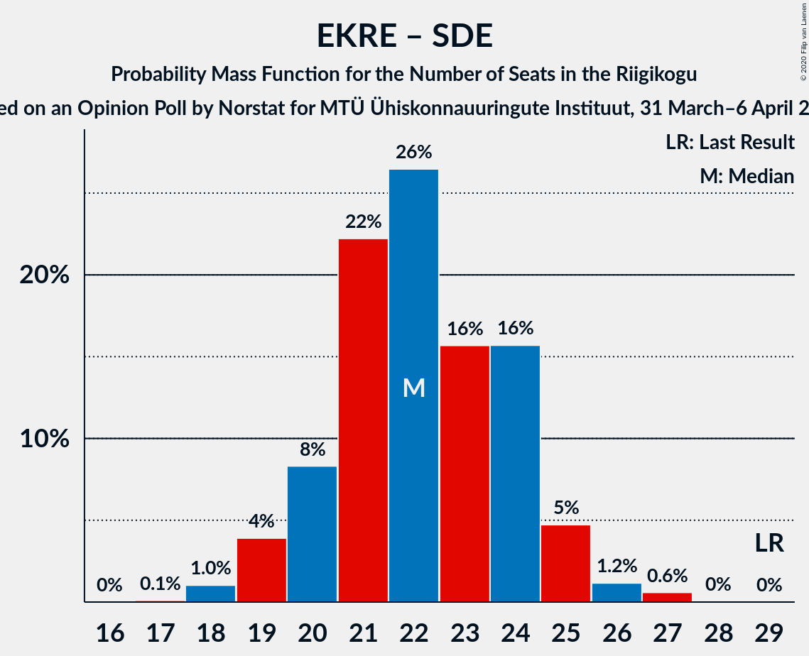

| Number of Seats | Probability | Accumulated | Special Marks |
|:---------------:|:-----------:|:-----------:|:-------------:|
| 17 | 0.1% | 100% |  |
| 18 | 1.0% | 99.9% |  |
| 19 | 4% | 98.8% |  |
| 20 | 8% | 95% |  |
| 21 | 22% | 87% |  |
| 22 | 26% | 64% | Median |
| 23 | 16% | 38% |  |
| 24 | 16% | 22% |  |
| 25 | 5% | 7% |  |
| 26 | 1.2% | 2% |  |
| 27 | 0.6% | 0.6% |  |
| 28 | 0% | 0.1% |  |
| 29 | 0% | 0% | Last Result |

## Technical Information

### Opinion Poll

+ **Polling firm:** Norstat
+ **Commissioner(s):** MTÜ Ühiskonnauuringute Instituut
+ **Fieldwork period:** 31 March–6 April 2020

### Calculations

+ **Sample size:** 1000
+ **Simulations done:** 131,072
+ **Error estimate:** 1.43%

