# Opinion Poll by Turu-uuringute AS for ERR, 6–7 April 2020

<a href="#voting-intentions">Voting Intentions</a> | <a href="#seats">Seats</a> | <a href="#coalitions">Coalitions</a> | <a href="#technical-information">Technical Information</a>

## Voting Intentions

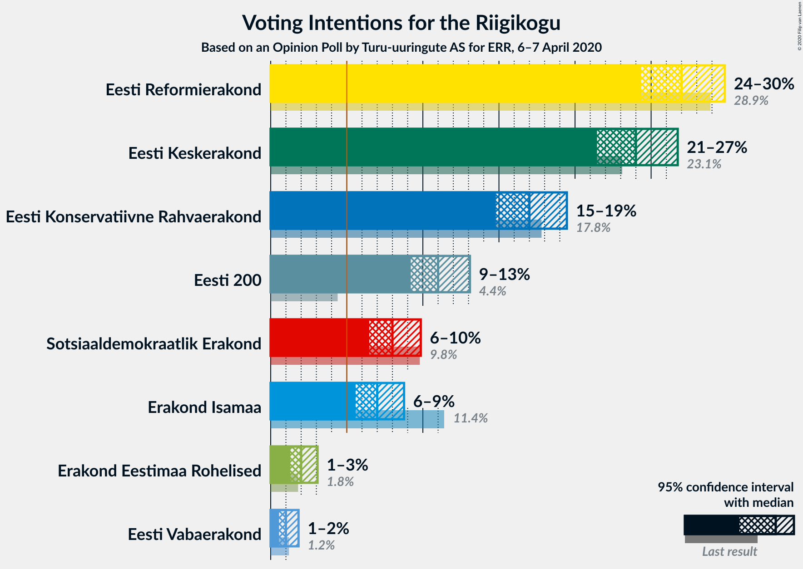

### Confidence Intervals

| Party | Last Result | Poll Result | 80% Confidence Interval | 90% Confidence Interval | 95% Confidence Interval | 99% Confidence Interval |
|:-----:|:-----------:|:-----------:|:-----------------------:|:-----------------------:|:-----------------------:|:-----------------------:|
| Eesti Reformierakond | 28.9% | 27.0% | 25.3–28.9% |24.8–29.4% |24.3–29.8% |23.5–30.7% |
| Eesti Keskerakond | 23.1% | 24.0% | 22.3–25.8% |21.9–26.3% |21.4–26.7% |20.7–27.6% |
| Eesti Konservatiivne Rahvaerakond | 17.8% | 17.0% | 15.5–18.6% |15.2–19.1% |14.8–19.5% |14.1–20.3% |
| Eesti 200 | 4.4% | 11.0% | 9.8–12.4% |9.5–12.8% |9.2–13.1% |8.7–13.8% |
| Sotsiaaldemokraatlik Erakond | 9.8% | 8.0% | 7.0–9.2% |6.7–9.6% |6.5–9.9% |6.0–10.5% |
| Erakond Isamaa | 11.4% | 7.0% | 6.1–8.2% |5.8–8.5% |5.6–8.8% |5.2–9.3% |
| Erakond Eestimaa Rohelised | 1.8% | 2.0% | 1.5–2.7% |1.4–2.9% |1.3–3.1% |1.1–3.4% |
| Eesti Vabaerakond | 1.2% | 1.0% | 0.7–1.5% |0.6–1.7% |0.5–1.8% |0.4–2.1% |

*Note:* The poll result column reflects the actual value used in the calculations. Published results may vary slightly, and in addition be rounded to fewer digits.

## Seats

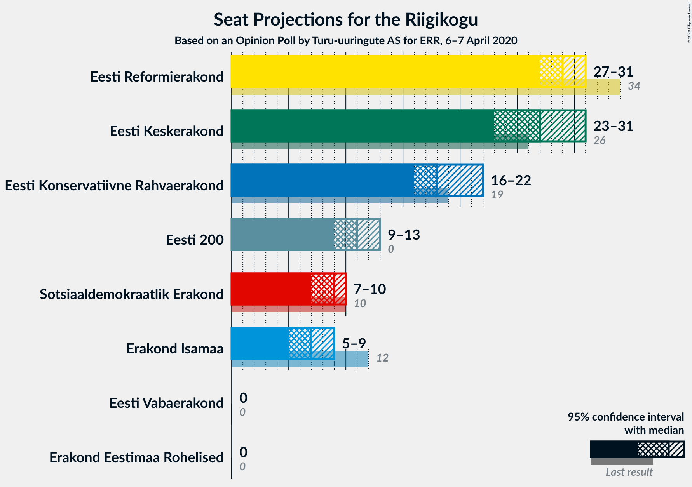

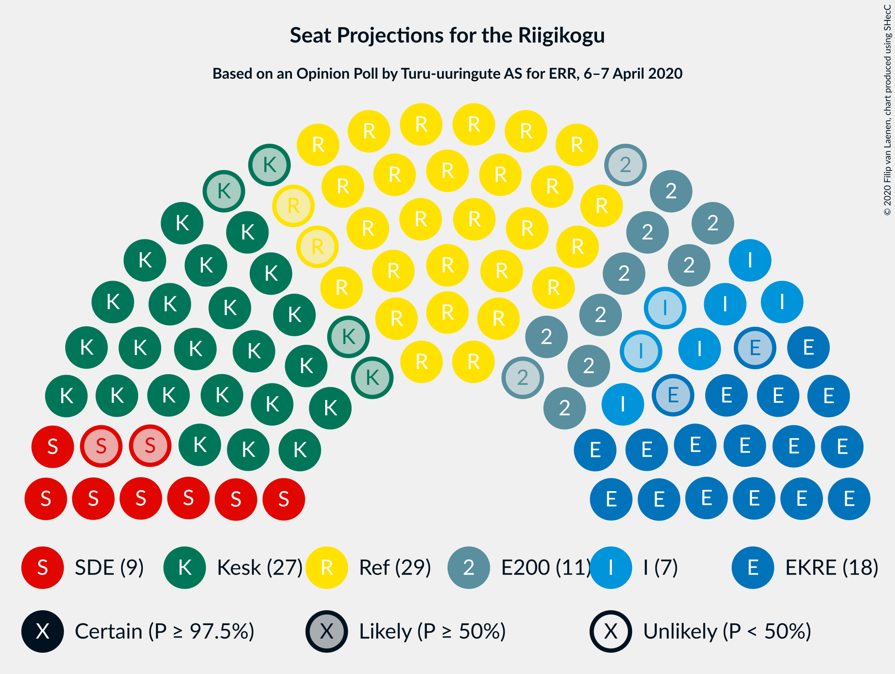

### Confidence Intervals

| Party | Last Result | Median | 80% Confidence Interval | 90% Confidence Interval | 95% Confidence Interval | 99% Confidence Interval |
|:-----:|:-----------:|:------:|:-----------------------:|:-----------------------:|:-----------------------:|:-----------------------:|
| <a href="#eesti-reformierakond">Eesti Reformierakond</a> | 34 | 29 | 27–30 |27–31 |27–31 |26–33 |
| <a href="#eesti-keskerakond">Eesti Keskerakond</a> | 26 | 27 | 25–30 |24–30 |23–31 |23–32 |
| <a href="#eesti-konservatiivne-rahvaerakond">Eesti Konservatiivne Rahvaerakond</a> | 19 | 18 | 16–21 |16–21 |16–22 |15–23 |
| <a href="#eesti-200">Eesti 200</a> | 0 | 11 | 10–12 |9–13 |9–13 |8–14 |
| <a href="#sotsiaaldemokraatlik-erakond">Sotsiaaldemokraatlik Erakond</a> | 10 | 9 | 8–9 |7–10 |7–10 |7–11 |
| <a href="#erakond-isamaa">Erakond Isamaa</a> | 12 | 7 | 5–8 |5–9 |5–9 |4–9 |
| <a href="#erakond-eestimaa-rohelised">Erakond Eestimaa Rohelised</a> | 0 | 0 | 0 |0 |0 |0 |
| <a href="#eesti-vabaerakond">Eesti Vabaerakond</a> | 0 | 0 | 0 |0 |0 |0 |

### Eesti Reformierakond

*For a full overview of the results for this party, see the [Eesti Reformierakond](party-eestireformierakond.html) page.*

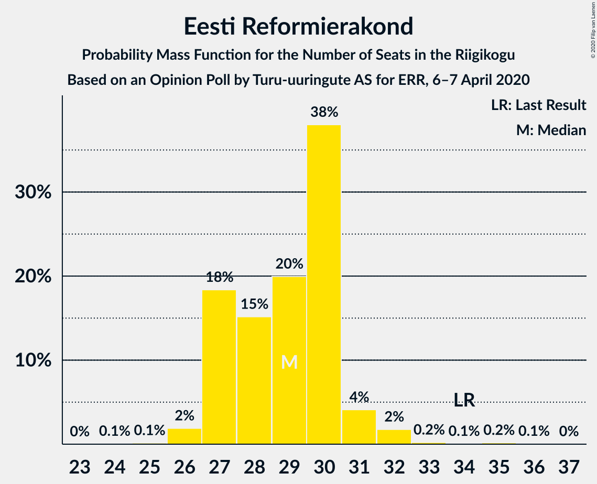

| Number of Seats | Probability | Accumulated | Special Marks |
|:---------------:|:-----------:|:-----------:|:-------------:|
| 24 | 0.1% | 100% |  |
| 25 | 0.1% | 99.9% |  |
| 26 | 2% | 99.8% |  |
| 27 | 18% | 98% |  |
| 28 | 15% | 80% |  |
| 29 | 20% | 64% | Median |
| 30 | 38% | 44% |  |
| 31 | 4% | 6% |  |
| 32 | 2% | 2% |  |
| 33 | 0.2% | 0.5% |  |
| 34 | 0.1% | 0.3% | Last Result |
| 35 | 0.2% | 0.3% |  |
| 36 | 0.1% | 0.1% |  |
| 37 | 0% | 0% |  |

### Eesti Keskerakond

*For a full overview of the results for this party, see the [Eesti Keskerakond](party-eestikeskerakond.html) page.*

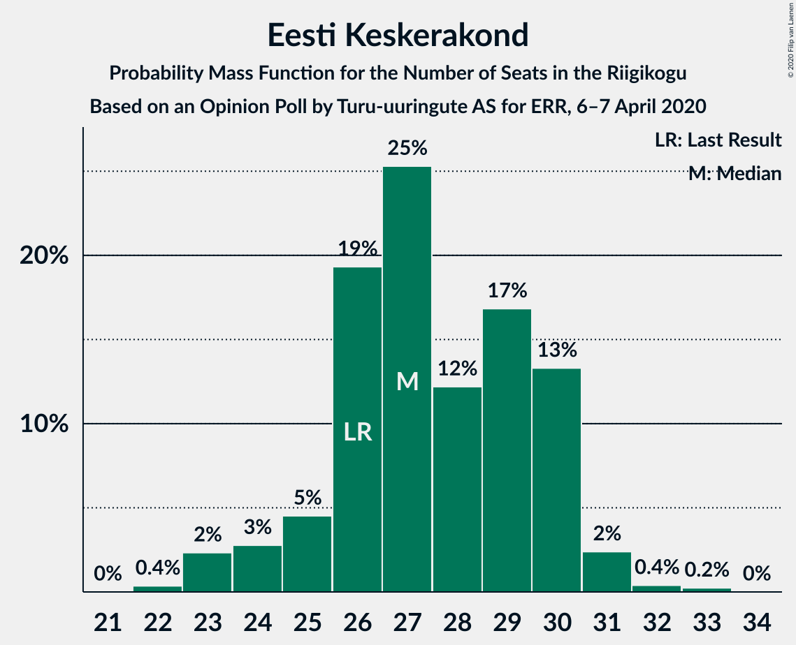

| Number of Seats | Probability | Accumulated | Special Marks |
|:---------------:|:-----------:|:-----------:|:-------------:|
| 22 | 0.4% | 100% |  |
| 23 | 2% | 99.6% |  |
| 24 | 3% | 97% |  |
| 25 | 5% | 95% |  |
| 26 | 19% | 90% | Last Result |
| 27 | 25% | 71% | Median |
| 28 | 12% | 45% |  |
| 29 | 17% | 33% |  |
| 30 | 13% | 16% |  |
| 31 | 2% | 3% |  |
| 32 | 0.4% | 0.6% |  |
| 33 | 0.2% | 0.3% |  |
| 34 | 0% | 0% |  |

### Eesti Konservatiivne Rahvaerakond

*For a full overview of the results for this party, see the [Eesti Konservatiivne Rahvaerakond](party-eestikonservatiivnerahvaerakond.html) page.*

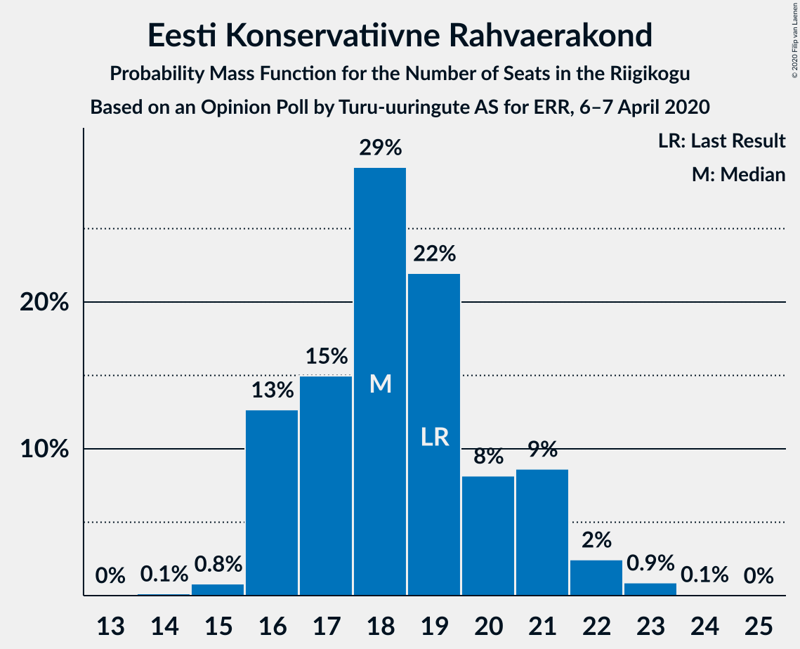

| Number of Seats | Probability | Accumulated | Special Marks |
|:---------------:|:-----------:|:-----------:|:-------------:|
| 14 | 0.1% | 100% |  |
| 15 | 0.8% | 99.8% |  |
| 16 | 13% | 99.0% |  |
| 17 | 15% | 86% |  |
| 18 | 29% | 71% | Median |
| 19 | 22% | 42% | Last Result |
| 20 | 8% | 20% |  |
| 21 | 9% | 12% |  |
| 22 | 2% | 3% |  |
| 23 | 0.9% | 1.0% |  |
| 24 | 0.1% | 0.1% |  |
| 25 | 0% | 0% |  |

### Eesti 200

*For a full overview of the results for this party, see the [Eesti 200](party-eesti200.html) page.*

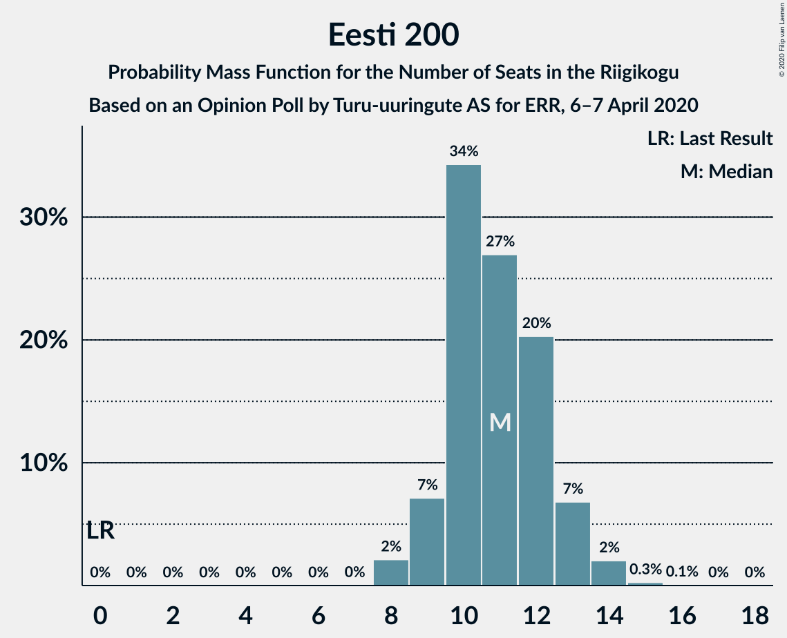

| Number of Seats | Probability | Accumulated | Special Marks |
|:---------------:|:-----------:|:-----------:|:-------------:|
| 0 | 0% | 100% | Last Result |
| 1 | 0% | 100% |  |
| 2 | 0% | 100% |  |
| 3 | 0% | 100% |  |
| 4 | 0% | 100% |  |
| 5 | 0% | 100% |  |
| 6 | 0% | 100% |  |
| 7 | 0% | 100% |  |
| 8 | 2% | 100% |  |
| 9 | 7% | 98% |  |
| 10 | 34% | 91% |  |
| 11 | 27% | 56% | Median |
| 12 | 20% | 29% |  |
| 13 | 7% | 9% |  |
| 14 | 2% | 2% |  |
| 15 | 0.3% | 0.3% |  |
| 16 | 0.1% | 0.1% |  |
| 17 | 0% | 0% |  |

### Sotsiaaldemokraatlik Erakond

*For a full overview of the results for this party, see the [Sotsiaaldemokraatlik Erakond](party-sotsiaaldemokraatlikerakond.html) page.*

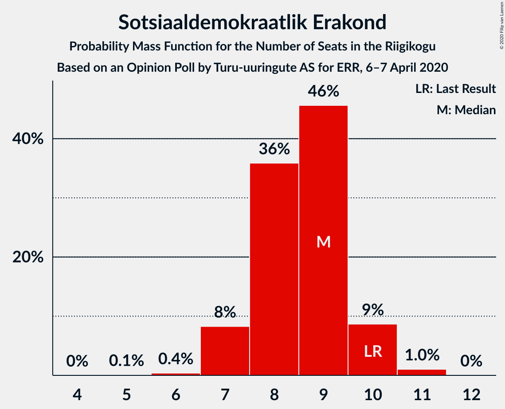

| Number of Seats | Probability | Accumulated | Special Marks |
|:---------------:|:-----------:|:-----------:|:-------------:|
| 5 | 0.1% | 100% |  |
| 6 | 0.4% | 99.9% |  |
| 7 | 8% | 99.5% |  |
| 8 | 36% | 91% |  |
| 9 | 46% | 55% | Median |
| 10 | 9% | 10% | Last Result |
| 11 | 1.0% | 1.1% |  |
| 12 | 0% | 0% |  |

### Erakond Isamaa

*For a full overview of the results for this party, see the [Erakond Isamaa](party-erakondisamaa.html) page.*

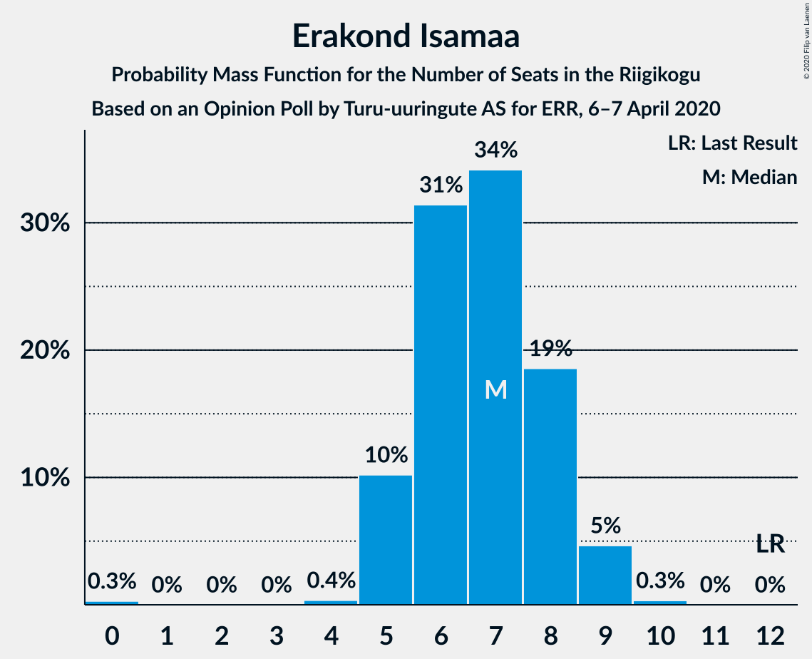

| Number of Seats | Probability | Accumulated | Special Marks |
|:---------------:|:-----------:|:-----------:|:-------------:|
| 0 | 0.3% | 100% |  |
| 1 | 0% | 99.7% |  |
| 2 | 0% | 99.7% |  |
| 3 | 0% | 99.7% |  |
| 4 | 0.4% | 99.7% |  |
| 5 | 10% | 99.3% |  |
| 6 | 31% | 89% |  |
| 7 | 34% | 58% | Median |
| 8 | 19% | 24% |  |
| 9 | 5% | 5% |  |
| 10 | 0.3% | 0.3% |  |
| 11 | 0% | 0% |  |
| 12 | 0% | 0% | Last Result |

### Erakond Eestimaa Rohelised

*For a full overview of the results for this party, see the [Erakond Eestimaa Rohelised](party-erakondeestimaarohelised.html) page.*

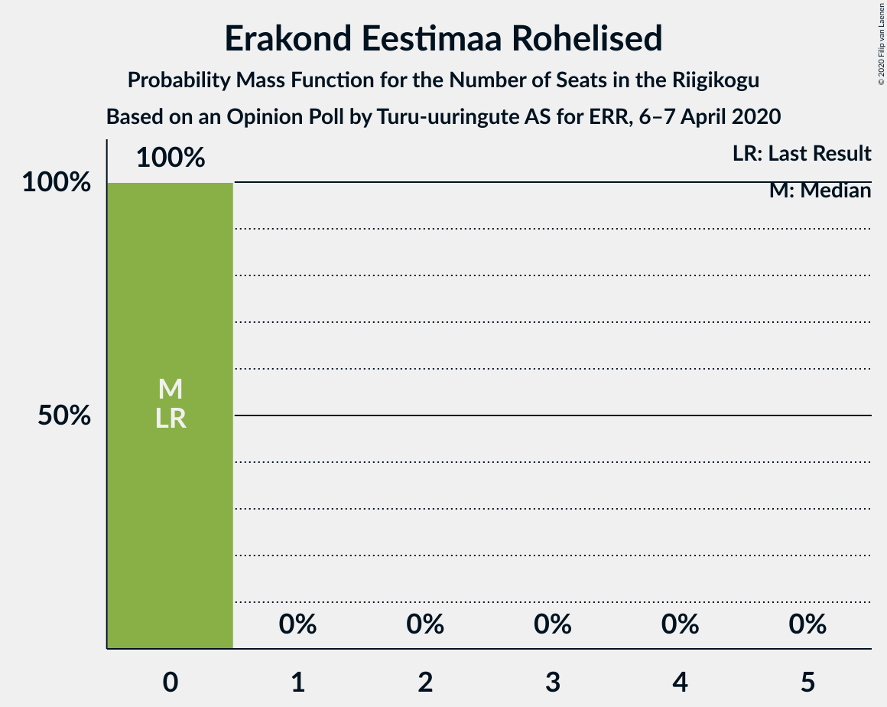

| Number of Seats | Probability | Accumulated | Special Marks |
|:---------------:|:-----------:|:-----------:|:-------------:|
| 0 | 100% | 100% | Last Result, Median |

### Eesti Vabaerakond

*For a full overview of the results for this party, see the [Eesti Vabaerakond](party-eestivabaerakond.html) page.*

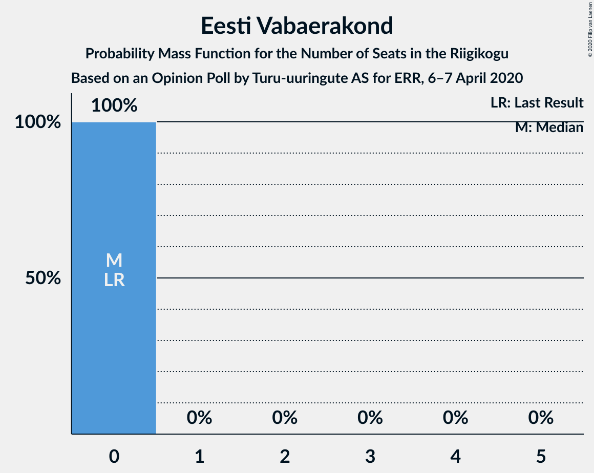

| Number of Seats | Probability | Accumulated | Special Marks |
|:---------------:|:-----------:|:-----------:|:-------------:|
| 0 | 100% | 100% | Last Result, Median |

## Coalitions

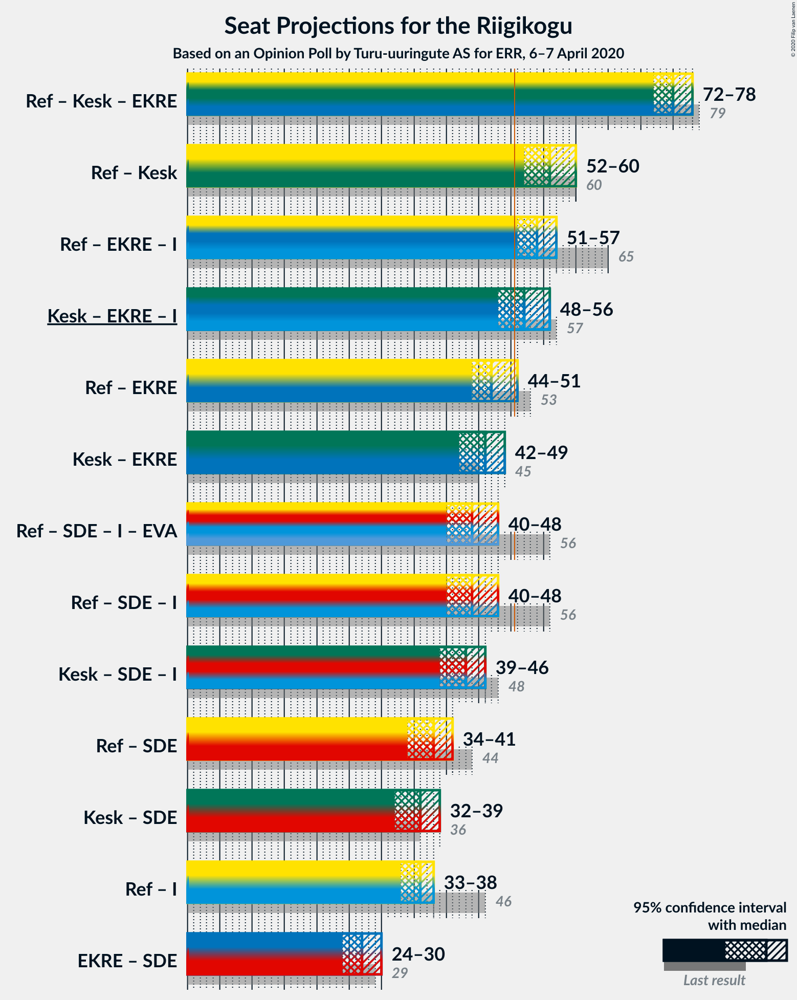

### Confidence Intervals

| Coalition | Last Result | Median | Majority? | 80% Confidence Interval | 90% Confidence Interval | 95% Confidence Interval | 99% Confidence Interval |
|:---------:|:-----------:|:------:|:---------:|:-----------------------:|:-----------------------:|:-----------------------:|:-----------------------:|
| Eesti Reformierakond – Eesti Keskerakond – Eesti Konservatiivne Rahvaerakond | 79 | 75 | 100% | 73–77 | 72–77 | 72–78 | 71–79 |
| Eesti Reformierakond – Eesti Keskerakond | 60 | 56 | 100% | 54–59 | 54–59 | 52–60 | 51–61 |
| Eesti Reformierakond – Eesti Konservatiivne Rahvaerakond – Erakond Isamaa | 65 | 54 | 98% | 52–56 | 51–57 | 51–57 | 50–59 |
| Eesti Keskerakond – Eesti Konservatiivne Rahvaerakond – Erakond Isamaa | 57 | 52 | 87% | 50–55 | 49–56 | 48–56 | 47–57 |
| Eesti Reformierakond – Eesti Konservatiivne Rahvaerakond | 53 | 47 | 3% | 45–49 | 44–50 | 44–51 | 43–52 |
| Eesti Keskerakond – Eesti Konservatiivne Rahvaerakond | 45 | 46 | 0.5% | 44–48 | 43–49 | 42–49 | 41–51 |
| Eesti Reformierakond – Sotsiaaldemokraatlik Erakond – Erakond Isamaa – Eesti Vabaerakond | 56 | 44 | 0.1% | 42–47 | 41–47 | 40–48 | 39–49 |
| Eesti Reformierakond – Sotsiaaldemokraatlik Erakond – Erakond Isamaa | 56 | 44 | 0.1% | 42–47 | 41–47 | 40–48 | 39–49 |
| Eesti Keskerakond – Sotsiaaldemokraatlik Erakond – Erakond Isamaa | 48 | 43 | 0% | 41–45 | 40–46 | 39–46 | 38–47 |
| Eesti Reformierakond – Sotsiaaldemokraatlik Erakond | 44 | 38 | 0% | 35–39 | 35–40 | 34–41 | 33–43 |
| Eesti Keskerakond – Sotsiaaldemokraatlik Erakond | 36 | 36 | 0% | 34–38 | 33–39 | 32–39 | 32–40 |
| Eesti Reformierakond – Erakond Isamaa | 46 | 36 | 0% | 34–38 | 33–38 | 33–38 | 32–40 |
| Eesti Konservatiivne Rahvaerakond – Sotsiaaldemokraatlik Erakond | 29 | 27 | 0% | 25–29 | 25–30 | 24–30 | 23–31 |

### Eesti Reformierakond – Eesti Keskerakond – Eesti Konservatiivne Rahvaerakond

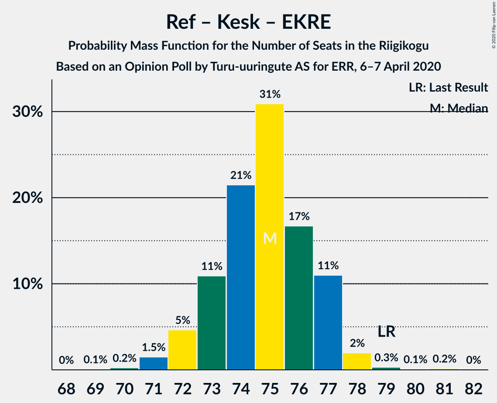

| Number of Seats | Probability | Accumulated | Special Marks |
|:---------------:|:-----------:|:-----------:|:-------------:|
| 69 | 0.1% | 100% |  |
| 70 | 0.2% | 99.9% |  |
| 71 | 1.5% | 99.7% |  |
| 72 | 5% | 98% |  |
| 73 | 11% | 94% |  |
| 74 | 21% | 83% | Median |
| 75 | 31% | 61% |  |
| 76 | 17% | 30% |  |
| 77 | 11% | 14% |  |
| 78 | 2% | 3% |  |
| 79 | 0.3% | 0.6% | Last Result |
| 80 | 0.1% | 0.3% |  |
| 81 | 0.2% | 0.2% |  |
| 82 | 0% | 0% |  |

### Eesti Reformierakond – Eesti Keskerakond

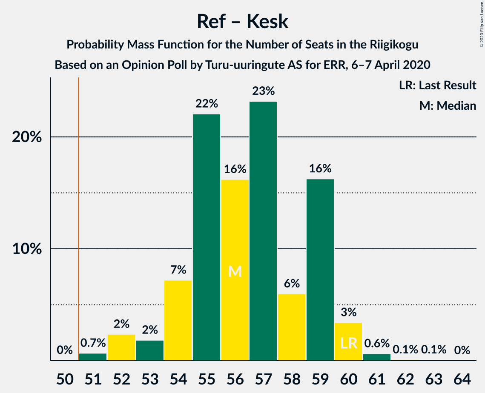

| Number of Seats | Probability | Accumulated | Special Marks |
|:---------------:|:-----------:|:-----------:|:-------------:|
| 51 | 0.7% | 100% | Majority |
| 52 | 2% | 99.3% |  |
| 53 | 2% | 97% |  |
| 54 | 7% | 95% |  |
| 55 | 22% | 88% |  |
| 56 | 16% | 66% | Median |
| 57 | 23% | 50% |  |
| 58 | 6% | 26% |  |
| 59 | 16% | 20% |  |
| 60 | 3% | 4% | Last Result |
| 61 | 0.6% | 0.8% |  |
| 62 | 0.1% | 0.2% |  |
| 63 | 0.1% | 0.1% |  |
| 64 | 0% | 0% |  |

### Eesti Reformierakond – Eesti Konservatiivne Rahvaerakond – Erakond Isamaa

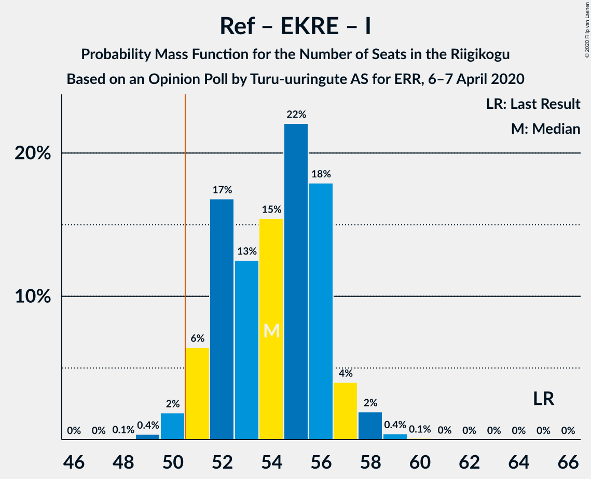

| Number of Seats | Probability | Accumulated | Special Marks |
|:---------------:|:-----------:|:-----------:|:-------------:|
| 48 | 0.1% | 100% |  |
| 49 | 0.4% | 99.9% |  |
| 50 | 2% | 99.6% |  |
| 51 | 6% | 98% | Majority |
| 52 | 17% | 91% |  |
| 53 | 13% | 74% |  |
| 54 | 15% | 62% | Median |
| 55 | 22% | 46% |  |
| 56 | 18% | 24% |  |
| 57 | 4% | 6% |  |
| 58 | 2% | 2% |  |
| 59 | 0.4% | 0.6% |  |
| 60 | 0.1% | 0.1% |  |
| 61 | 0% | 0% |  |
| 62 | 0% | 0% |  |
| 63 | 0% | 0% |  |
| 64 | 0% | 0% |  |
| 65 | 0% | 0% | Last Result |

### Eesti Keskerakond – Eesti Konservatiivne Rahvaerakond – Erakond Isamaa

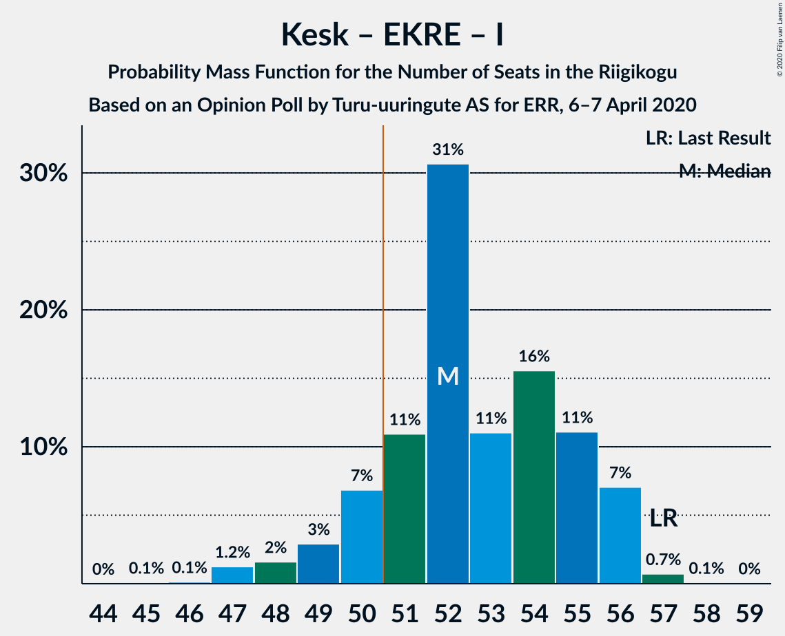

| Number of Seats | Probability | Accumulated | Special Marks |
|:---------------:|:-----------:|:-----------:|:-------------:|
| 45 | 0.1% | 100% |  |
| 46 | 0.1% | 99.9% |  |
| 47 | 1.2% | 99.8% |  |
| 48 | 2% | 98.5% |  |
| 49 | 3% | 97% |  |
| 50 | 7% | 94% |  |
| 51 | 11% | 87% | Majority |
| 52 | 31% | 76% | Median |
| 53 | 11% | 46% |  |
| 54 | 16% | 35% |  |
| 55 | 11% | 19% |  |
| 56 | 7% | 8% |  |
| 57 | 0.7% | 0.8% | Last Result |
| 58 | 0.1% | 0.1% |  |
| 59 | 0% | 0% |  |

### Eesti Reformierakond – Eesti Konservatiivne Rahvaerakond

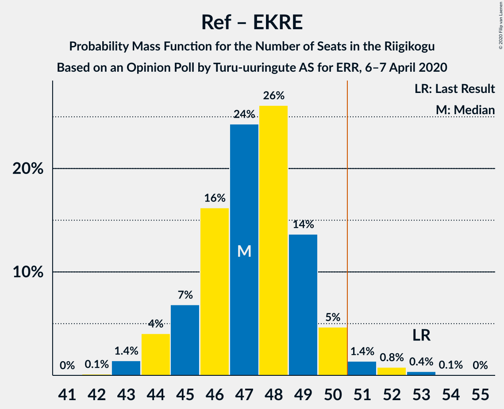

| Number of Seats | Probability | Accumulated | Special Marks |
|:---------------:|:-----------:|:-----------:|:-------------:|
| 42 | 0.1% | 100% |  |
| 43 | 1.4% | 99.9% |  |
| 44 | 4% | 98% |  |
| 45 | 7% | 94% |  |
| 46 | 16% | 88% |  |
| 47 | 24% | 71% | Median |
| 48 | 26% | 47% |  |
| 49 | 14% | 21% |  |
| 50 | 5% | 7% |  |
| 51 | 1.4% | 3% | Majority |
| 52 | 0.8% | 1.3% |  |
| 53 | 0.4% | 0.5% | Last Result |
| 54 | 0.1% | 0.1% |  |
| 55 | 0% | 0% |  |

### Eesti Keskerakond – Eesti Konservatiivne Rahvaerakond

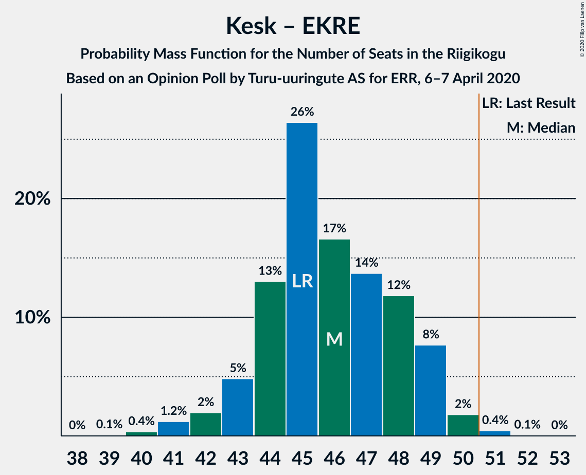

| Number of Seats | Probability | Accumulated | Special Marks |
|:---------------:|:-----------:|:-----------:|:-------------:|
| 39 | 0.1% | 100% |  |
| 40 | 0.4% | 99.9% |  |
| 41 | 1.2% | 99.5% |  |
| 42 | 2% | 98% |  |
| 43 | 5% | 96% |  |
| 44 | 13% | 92% |  |
| 45 | 26% | 79% | Last Result, Median |
| 46 | 17% | 52% |  |
| 47 | 14% | 36% |  |
| 48 | 12% | 22% |  |
| 49 | 8% | 10% |  |
| 50 | 2% | 2% |  |
| 51 | 0.4% | 0.5% | Majority |
| 52 | 0.1% | 0.1% |  |
| 53 | 0% | 0% |  |

### Eesti Reformierakond – Sotsiaaldemokraatlik Erakond – Erakond Isamaa – Eesti Vabaerakond

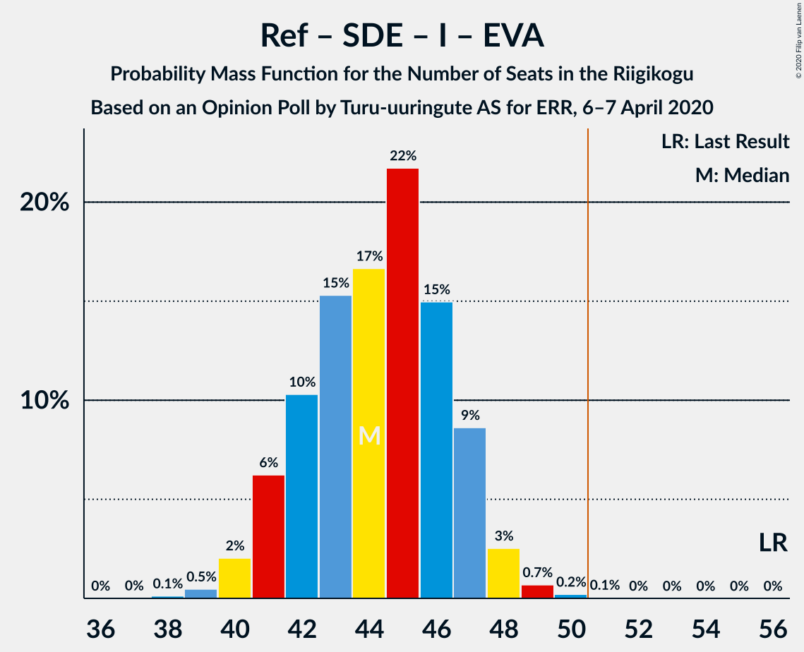

| Number of Seats | Probability | Accumulated | Special Marks |
|:---------------:|:-----------:|:-----------:|:-------------:|
| 38 | 0.1% | 100% |  |
| 39 | 0.5% | 99.8% |  |
| 40 | 2% | 99.4% |  |
| 41 | 6% | 97% |  |
| 42 | 10% | 91% |  |
| 43 | 15% | 81% |  |
| 44 | 17% | 65% |  |
| 45 | 22% | 49% | Median |
| 46 | 15% | 27% |  |
| 47 | 9% | 12% |  |
| 48 | 3% | 3% |  |
| 49 | 0.7% | 1.0% |  |
| 50 | 0.2% | 0.3% |  |
| 51 | 0.1% | 0.1% | Majority |
| 52 | 0% | 0% |  |
| 53 | 0% | 0% |  |
| 54 | 0% | 0% |  |
| 55 | 0% | 0% |  |
| 56 | 0% | 0% | Last Result |

### Eesti Reformierakond – Sotsiaaldemokraatlik Erakond – Erakond Isamaa

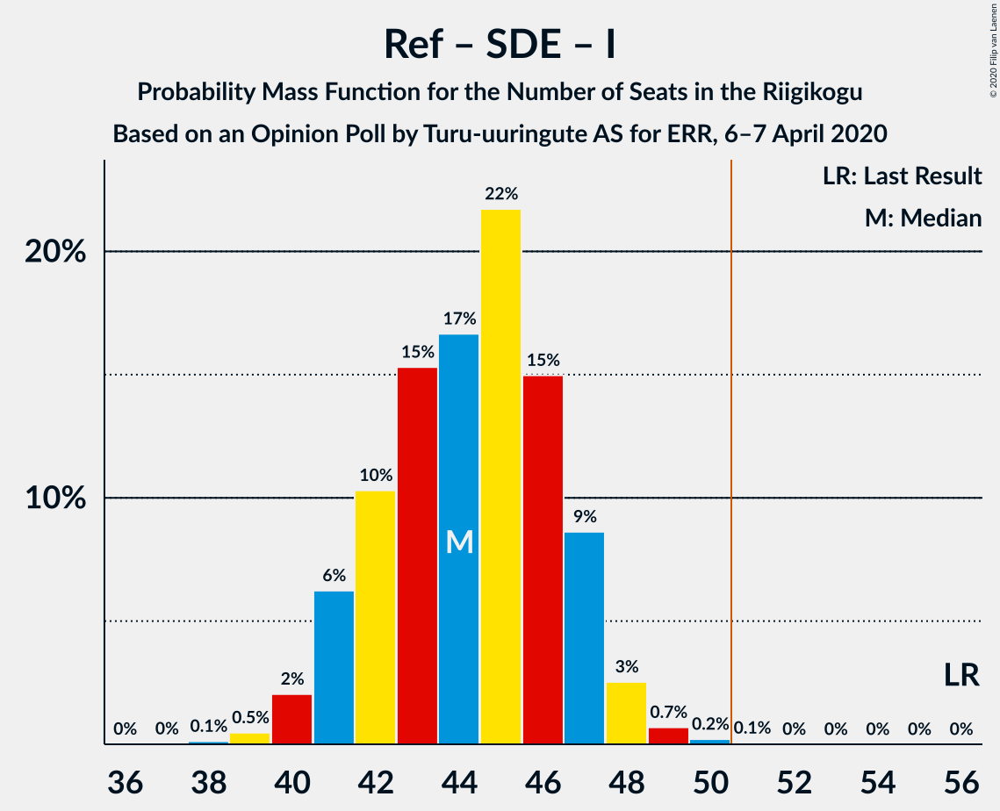

| Number of Seats | Probability | Accumulated | Special Marks |
|:---------------:|:-----------:|:-----------:|:-------------:|
| 38 | 0.1% | 100% |  |
| 39 | 0.5% | 99.8% |  |
| 40 | 2% | 99.4% |  |
| 41 | 6% | 97% |  |
| 42 | 10% | 91% |  |
| 43 | 15% | 81% |  |
| 44 | 17% | 65% |  |
| 45 | 22% | 49% | Median |
| 46 | 15% | 27% |  |
| 47 | 9% | 12% |  |
| 48 | 3% | 3% |  |
| 49 | 0.7% | 1.0% |  |
| 50 | 0.2% | 0.3% |  |
| 51 | 0.1% | 0.1% | Majority |
| 52 | 0% | 0% |  |
| 53 | 0% | 0% |  |
| 54 | 0% | 0% |  |
| 55 | 0% | 0% |  |
| 56 | 0% | 0% | Last Result |

### Eesti Keskerakond – Sotsiaaldemokraatlik Erakond – Erakond Isamaa

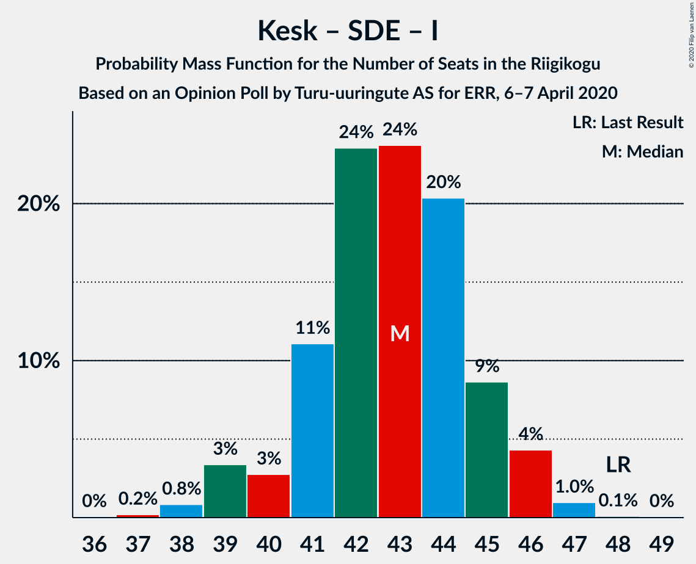

| Number of Seats | Probability | Accumulated | Special Marks |
|:---------------:|:-----------:|:-----------:|:-------------:|
| 36 | 0% | 100% |  |
| 37 | 0.2% | 99.9% |  |
| 38 | 0.8% | 99.7% |  |
| 39 | 3% | 98.9% |  |
| 40 | 3% | 96% |  |
| 41 | 11% | 93% |  |
| 42 | 24% | 82% |  |
| 43 | 24% | 58% | Median |
| 44 | 20% | 34% |  |
| 45 | 9% | 14% |  |
| 46 | 4% | 5% |  |
| 47 | 1.0% | 1.1% |  |
| 48 | 0.1% | 0.1% | Last Result |
| 49 | 0% | 0% |  |

### Eesti Reformierakond – Sotsiaaldemokraatlik Erakond

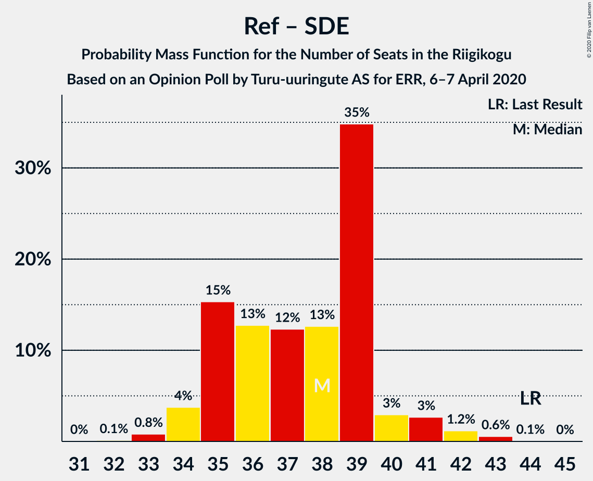

| Number of Seats | Probability | Accumulated | Special Marks |
|:---------------:|:-----------:|:-----------:|:-------------:|
| 32 | 0.1% | 100% |  |
| 33 | 0.8% | 99.8% |  |
| 34 | 4% | 99.0% |  |
| 35 | 15% | 95% |  |
| 36 | 13% | 80% |  |
| 37 | 12% | 67% |  |
| 38 | 13% | 55% | Median |
| 39 | 35% | 42% |  |
| 40 | 3% | 7% |  |
| 41 | 3% | 4% |  |
| 42 | 1.2% | 2% |  |
| 43 | 0.6% | 0.6% |  |
| 44 | 0.1% | 0.1% | Last Result |
| 45 | 0% | 0% |  |

### Eesti Keskerakond – Sotsiaaldemokraatlik Erakond

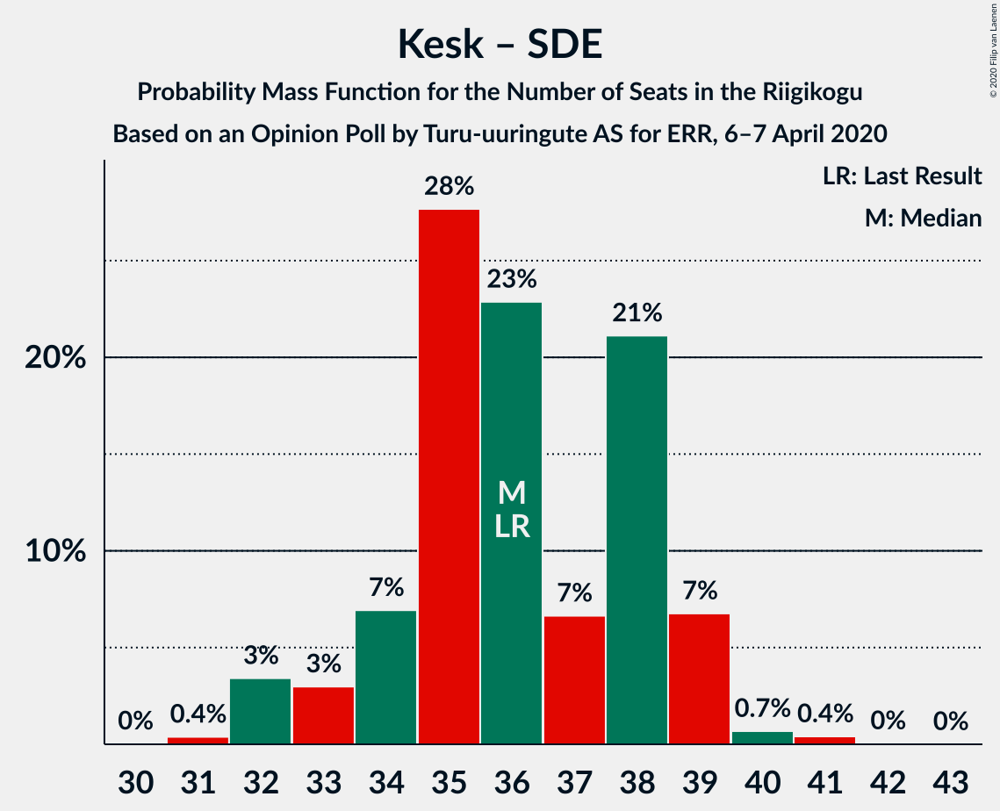

| Number of Seats | Probability | Accumulated | Special Marks |
|:---------------:|:-----------:|:-----------:|:-------------:|
| 30 | 0% | 100% |  |
| 31 | 0.4% | 99.9% |  |
| 32 | 3% | 99.6% |  |
| 33 | 3% | 96% |  |
| 34 | 7% | 93% |  |
| 35 | 28% | 86% |  |
| 36 | 23% | 59% | Last Result, Median |
| 37 | 7% | 36% |  |
| 38 | 21% | 29% |  |
| 39 | 7% | 8% |  |
| 40 | 0.7% | 1.1% |  |
| 41 | 0.4% | 0.5% |  |
| 42 | 0% | 0.1% |  |
| 43 | 0% | 0% |  |

### Eesti Reformierakond – Erakond Isamaa

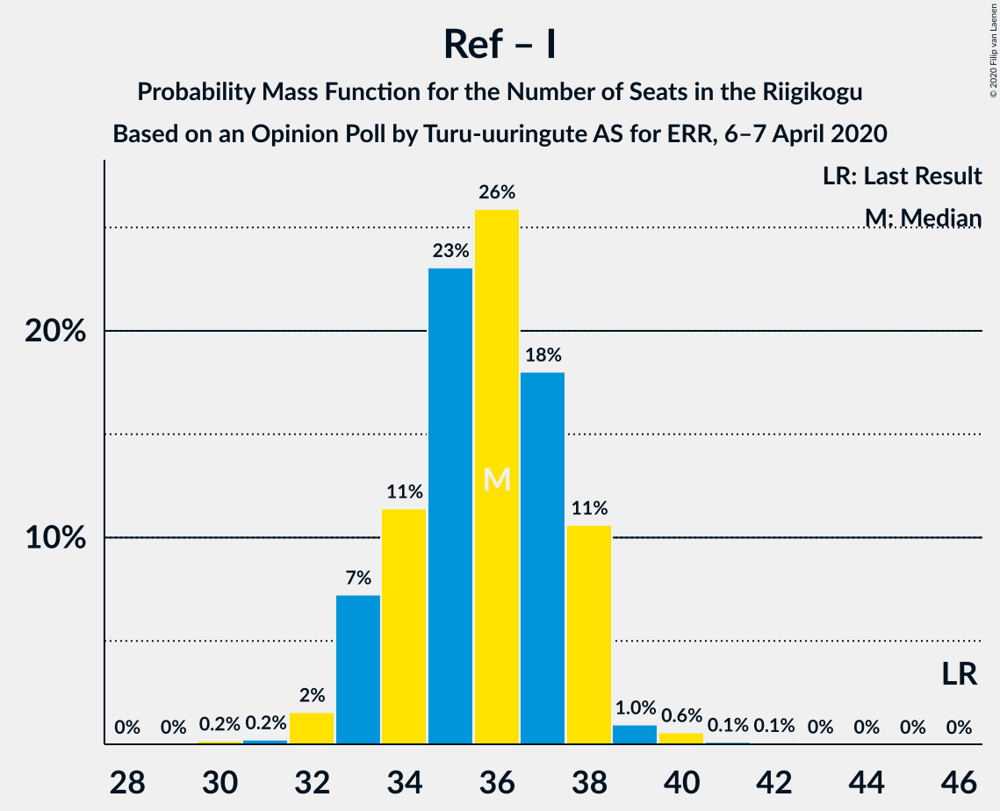

| Number of Seats | Probability | Accumulated | Special Marks |
|:---------------:|:-----------:|:-----------:|:-------------:|
| 30 | 0.2% | 100% |  |
| 31 | 0.2% | 99.8% |  |
| 32 | 2% | 99.6% |  |
| 33 | 7% | 98% |  |
| 34 | 11% | 91% |  |
| 35 | 23% | 79% |  |
| 36 | 26% | 56% | Median |
| 37 | 18% | 30% |  |
| 38 | 11% | 12% |  |
| 39 | 1.0% | 2% |  |
| 40 | 0.6% | 0.8% |  |
| 41 | 0.1% | 0.3% |  |
| 42 | 0.1% | 0.1% |  |
| 43 | 0% | 0.1% |  |
| 44 | 0% | 0% |  |
| 45 | 0% | 0% |  |
| 46 | 0% | 0% | Last Result |

### Eesti Konservatiivne Rahvaerakond – Sotsiaaldemokraatlik Erakond

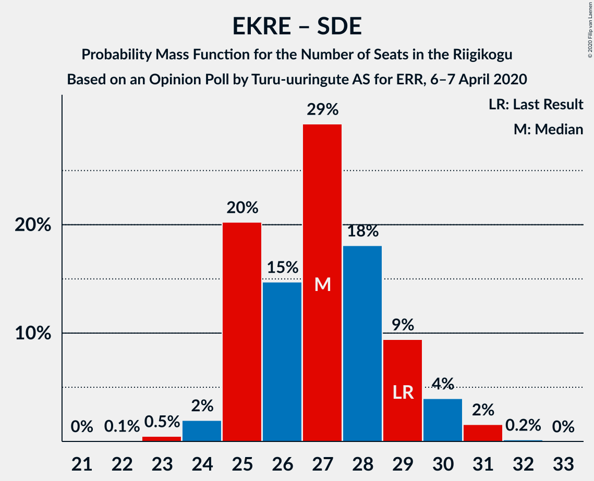

| Number of Seats | Probability | Accumulated | Special Marks |
|:---------------:|:-----------:|:-----------:|:-------------:|
| 22 | 0.1% | 100% |  |
| 23 | 0.5% | 99.9% |  |
| 24 | 2% | 99.4% |  |
| 25 | 20% | 97% |  |
| 26 | 15% | 77% |  |
| 27 | 29% | 63% | Median |
| 28 | 18% | 33% |  |
| 29 | 9% | 15% | Last Result |
| 30 | 4% | 6% |  |
| 31 | 2% | 2% |  |
| 32 | 0.2% | 0.2% |  |
| 33 | 0% | 0% |  |

## Technical Information

### Opinion Poll

+ **Polling firm:** Turu-uuringute AS
+ **Commissioner(s):** ERR
+ **Fieldwork period:** 6–7 April 2020

### Calculations

+ **Sample size:** 1000
+ **Simulations done:** 131,072
+ **Error estimate:** 2.38%

