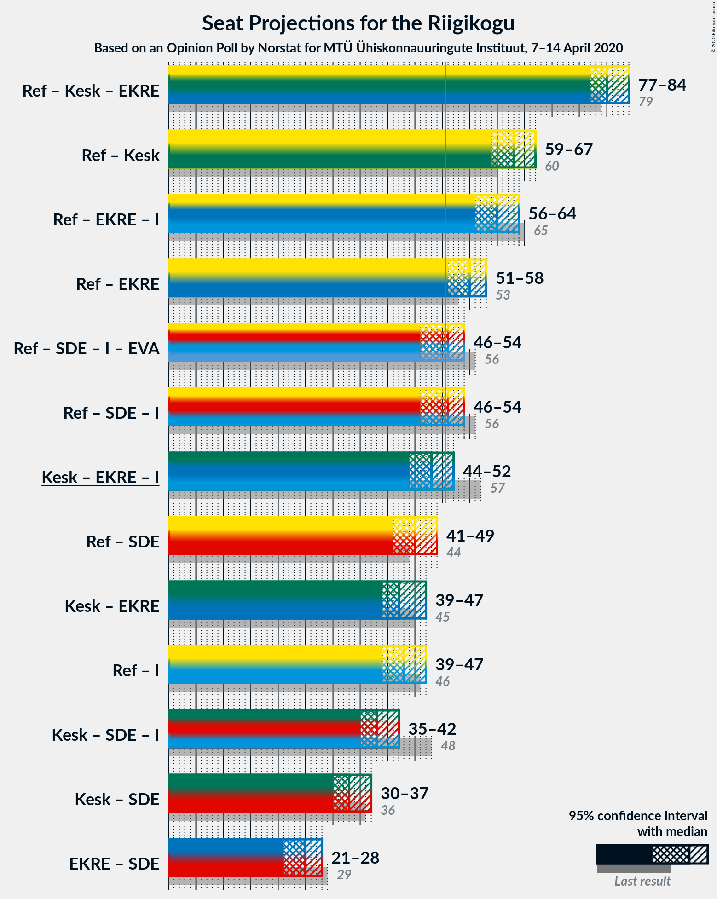

# Opinion Poll by Norstat for MTÜ Ühiskonnauuringute Instituut, 7–14 April 2020

<a href="#voting-intentions">Voting Intentions</a> | <a href="#seats">Seats</a> | <a href="#coalitions">Coalitions</a> | <a href="#technical-information">Technical Information</a>

## Voting Intentions

### Confidence Intervals

| Party | Last Result | Poll Result | 80% Confidence Interval | 90% Confidence Interval | 95% Confidence Interval | 99% Confidence Interval |
|:-----:|:-----------:|:-----------:|:-----------------------:|:-----------------------:|:-----------------------:|:-----------------------:|
| Eesti Reformierakond | 28.9% | 32.9% | 31.0–34.8% |30.5–35.4% |30.1–35.9% |29.2–36.8% |
| Eesti Keskerakond | 23.1% | 23.5% | 21.8–25.3% |21.4–25.8% |21.0–26.2% |20.2–27.1% |
| Eesti Konservatiivne Rahvaerakond | 17.8% | 16.3% | 14.9–17.9% |14.5–18.3% |14.1–18.7% |13.5–19.5% |
| Eesti 200 | 4.4% | 8.4% | 7.4–9.6% |7.1–10.0% |6.8–10.3% |6.4–10.9% |
| Sotsiaaldemokraatlik Erakond | 9.8% | 8.0% | 7.0–9.2% |6.7–9.6% |6.5–9.9% |6.0–10.5% |
| Erakond Isamaa | 11.4% | 6.3% | 5.4–7.4% |5.2–7.7% |5.0–8.0% |4.6–8.5% |
| Erakond Eestimaa Rohelised | 1.8% | 1.8% | 1.4–2.5% |1.2–2.7% |1.1–2.8% |1.0–3.2% |
| Eesti Vabaerakond | 1.2% | 0.4% | 0.2–0.8% |0.2–0.9% |0.2–1.0% |0.1–1.3% |

*Note:* The poll result column reflects the actual value used in the calculations. Published results may vary slightly, and in addition be rounded to fewer digits.

## Seats

### Confidence Intervals

| Party | Last Result | Median | 80% Confidence Interval | 90% Confidence Interval | 95% Confidence Interval | 99% Confidence Interval |
|:-----:|:-----------:|:------:|:-----------------------:|:-----------------------:|:-----------------------:|:-----------------------:|
| <a href="#eesti-reformierakond">Eesti Reformierakond</a> | 34 | 38 | 35–40 |35–41 |34–41 |33–42 |
| <a href="#eesti-keskerakond">Eesti Keskerakond</a> | 26 | 25 | 23–27 |23–28 |22–29 |22–30 |
| <a href="#eesti-konservatiivne-rahvaerakond">Eesti Konservatiivne Rahvaerakond</a> | 19 | 17 | 15–19 |15–19 |14–20 |14–21 |
| <a href="#eesti-200">Eesti 200</a> | 0 | 8 | 7–9 |6–10 |6–10 |6–11 |
| <a href="#sotsiaaldemokraatlik-erakond">Sotsiaaldemokraatlik Erakond</a> | 10 | 7 | 6–9 |6–9 |6–9 |5–10 |
| <a href="#erakond-isamaa">Erakond Isamaa</a> | 12 | 6 | 5–7 |4–7 |0–7 |0–8 |
| <a href="#erakond-eestimaa-rohelised">Erakond Eestimaa Rohelised</a> | 0 | 0 | 0 |0 |0 |0 |
| <a href="#eesti-vabaerakond">Eesti Vabaerakond</a> | 0 | 0 | 0 |0 |0 |0 |

### Eesti Reformierakond

*For a full overview of the results for this party, see the [Eesti Reformierakond](party-eestireformierakond.html) page.*

| Number of Seats | Probability | Accumulated | Special Marks |
|:---------------:|:-----------:|:-----------:|:-------------:|
| 32 | 0.2% | 100% |  |
| 33 | 0.7% | 99.7% |  |
| 34 | 4% | 99.0% | Last Result |
| 35 | 8% | 95% |  |
| 36 | 12% | 87% |  |
| 37 | 16% | 75% |  |
| 38 | 19% | 59% | Median |
| 39 | 22% | 39% |  |
| 40 | 11% | 17% |  |
| 41 | 4% | 6% |  |
| 42 | 1.3% | 2% |  |
| 43 | 0.2% | 0.4% |  |
| 44 | 0.2% | 0.2% |  |
| 45 | 0% | 0% |  |

### Eesti Keskerakond

*For a full overview of the results for this party, see the [Eesti Keskerakond](party-eestikeskerakond.html) page.*

| Number of Seats | Probability | Accumulated | Special Marks |
|:---------------:|:-----------:|:-----------:|:-------------:|
| 21 | 0.5% | 100% |  |
| 22 | 2% | 99.5% |  |
| 23 | 8% | 97% |  |
| 24 | 24% | 90% |  |
| 25 | 23% | 66% | Median |
| 26 | 16% | 43% | Last Result |
| 27 | 19% | 27% |  |
| 28 | 4% | 8% |  |
| 29 | 2% | 4% |  |
| 30 | 1.2% | 1.4% |  |
| 31 | 0.1% | 0.2% |  |
| 32 | 0% | 0.1% |  |
| 33 | 0% | 0% |  |

### Eesti Konservatiivne Rahvaerakond

*For a full overview of the results for this party, see the [Eesti Konservatiivne Rahvaerakond](party-eestikonservatiivnerahvaerakond.html) page.*

| Number of Seats | Probability | Accumulated | Special Marks |
|:---------------:|:-----------:|:-----------:|:-------------:|
| 13 | 0.3% | 100% |  |
| 14 | 3% | 99.7% |  |
| 15 | 8% | 97% |  |
| 16 | 19% | 88% |  |
| 17 | 30% | 70% | Median |
| 18 | 26% | 40% |  |
| 19 | 10% | 13% | Last Result |
| 20 | 3% | 4% |  |
| 21 | 0.6% | 0.7% |  |
| 22 | 0.1% | 0.1% |  |
| 23 | 0% | 0% |  |

### Eesti 200

*For a full overview of the results for this party, see the [Eesti 200](party-eesti200.html) page.*

| Number of Seats | Probability | Accumulated | Special Marks |
|:---------------:|:-----------:|:-----------:|:-------------:|
| 0 | 0% | 100% | Last Result |
| 1 | 0% | 100% |  |
| 2 | 0% | 100% |  |
| 3 | 0% | 100% |  |
| 4 | 0% | 100% |  |
| 5 | 0.3% | 100% |  |
| 6 | 6% | 99.7% |  |
| 7 | 32% | 94% |  |
| 8 | 36% | 62% | Median |
| 9 | 18% | 26% |  |
| 10 | 7% | 8% |  |
| 11 | 0.6% | 0.7% |  |
| 12 | 0.1% | 0.1% |  |
| 13 | 0% | 0% |  |

### Sotsiaaldemokraatlik Erakond

*For a full overview of the results for this party, see the [Sotsiaaldemokraatlik Erakond](party-sotsiaaldemokraatlikerakond.html) page.*

| Number of Seats | Probability | Accumulated | Special Marks |
|:---------------:|:-----------:|:-----------:|:-------------:|
| 5 | 1.1% | 100% |  |
| 6 | 18% | 98.9% |  |
| 7 | 34% | 81% | Median |
| 8 | 33% | 47% |  |
| 9 | 12% | 14% |  |
| 10 | 2% | 2% | Last Result |
| 11 | 0.2% | 0.2% |  |
| 12 | 0% | 0% |  |

### Erakond Isamaa

*For a full overview of the results for this party, see the [Erakond Isamaa](party-erakondisamaa.html) page.*

| Number of Seats | Probability | Accumulated | Special Marks |
|:---------------:|:-----------:|:-----------:|:-------------:|
| 0 | 4% | 100% |  |
| 1 | 0% | 96% |  |
| 2 | 0% | 96% |  |
| 3 | 0% | 96% |  |
| 4 | 4% | 96% |  |
| 5 | 41% | 92% |  |
| 6 | 38% | 51% | Median |
| 7 | 11% | 13% |  |
| 8 | 1.2% | 1.3% |  |
| 9 | 0.1% | 0.1% |  |
| 10 | 0% | 0% |  |
| 11 | 0% | 0% |  |
| 12 | 0% | 0% | Last Result |

### Erakond Eestimaa Rohelised

*For a full overview of the results for this party, see the [Erakond Eestimaa Rohelised](party-erakondeestimaarohelised.html) page.*

| Number of Seats | Probability | Accumulated | Special Marks |
|:---------------:|:-----------:|:-----------:|:-------------:|
| 0 | 100% | 100% | Last Result, Median |

### Eesti Vabaerakond

*For a full overview of the results for this party, see the [Eesti Vabaerakond](party-eestivabaerakond.html) page.*

| Number of Seats | Probability | Accumulated | Special Marks |
|:---------------:|:-----------:|:-----------:|:-------------:|
| 0 | 100% | 100% | Last Result, Median |

## Coalitions

### Confidence Intervals

| Coalition | Last Result | Median | Majority? | 80% Confidence Interval | 90% Confidence Interval | 95% Confidence Interval | 99% Confidence Interval |
|:---------:|:-----------:|:------:|:---------:|:-----------------------:|:-----------------------:|:-----------------------:|:-----------------------:|
| Eesti Reformierakond – Eesti Keskerakond – Eesti Konservatiivne Rahvaerakond | 79 | 80 | 100% | 78–82 | 77–83 | 77–84 | 76–86 |
| Eesti Reformierakond – Eesti Keskerakond | 60 | 63 | 100% | 60–66 | 60–66 | 59–67 | 58–69 |
| Eesti Reformierakond – Eesti Konservatiivne Rahvaerakond – Erakond Isamaa | 65 | 60 | 100% | 58–63 | 57–63 | 56–64 | 55–65 |
| Eesti Reformierakond – Eesti Konservatiivne Rahvaerakond | 53 | 55 | 98% | 52–57 | 52–58 | 51–58 | 50–60 |
| Eesti Reformierakond – Sotsiaaldemokraatlik Erakond – Erakond Isamaa – Eesti Vabaerakond | 56 | 51 | 53% | 48–53 | 47–54 | 46–54 | 46–55 |
| Eesti Reformierakond – Sotsiaaldemokraatlik Erakond – Erakond Isamaa | 56 | 51 | 53% | 48–53 | 47–54 | 46–54 | 46–55 |
| Eesti Keskerakond – Eesti Konservatiivne Rahvaerakond – Erakond Isamaa | 57 | 48 | 10% | 45–50 | 45–51 | 44–52 | 42–53 |
| Eesti Reformierakond – Sotsiaaldemokraatlik Erakond | 44 | 45 | 0.4% | 42–48 | 42–48 | 41–49 | 40–50 |
| Eesti Keskerakond – Eesti Konservatiivne Rahvaerakond | 45 | 42 | 0% | 40–45 | 40–46 | 39–47 | 38–47 |
| Eesti Reformierakond – Erakond Isamaa | 46 | 43 | 0% | 41–46 | 40–46 | 39–47 | 38–48 |
| Eesti Keskerakond – Sotsiaaldemokraatlik Erakond – Erakond Isamaa | 48 | 38 | 0% | 36–41 | 35–42 | 35–42 | 33–43 |
| Eesti Keskerakond – Sotsiaaldemokraatlik Erakond | 36 | 33 | 0% | 31–35 | 30–36 | 30–37 | 29–38 |
| Eesti Konservatiivne Rahvaerakond – Sotsiaaldemokraatlik Erakond | 29 | 25 | 0% | 22–27 | 22–27 | 21–28 | 21–29 |

### Eesti Reformierakond – Eesti Keskerakond – Eesti Konservatiivne Rahvaerakond

| Number of Seats | Probability | Accumulated | Special Marks |
|:---------------:|:-----------:|:-----------:|:-------------:|
| 75 | 0.2% | 100% |  |
| 76 | 0.7% | 99.8% |  |
| 77 | 6% | 99.1% |  |
| 78 | 8% | 93% |  |
| 79 | 19% | 85% | Last Result |
| 80 | 21% | 67% | Median |
| 81 | 23% | 46% |  |
| 82 | 15% | 23% |  |
| 83 | 5% | 8% |  |
| 84 | 1.3% | 3% |  |
| 85 | 1.1% | 2% |  |
| 86 | 0.4% | 0.8% |  |
| 87 | 0.2% | 0.3% |  |
| 88 | 0.1% | 0.1% |  |
| 89 | 0% | 0% |  |

### Eesti Reformierakond – Eesti Keskerakond

| Number of Seats | Probability | Accumulated | Special Marks |
|:---------------:|:-----------:|:-----------:|:-------------:|
| 57 | 0.1% | 100% |  |
| 58 | 0.5% | 99.9% |  |
| 59 | 2% | 99.5% |  |
| 60 | 9% | 97% | Last Result |
| 61 | 6% | 88% |  |
| 62 | 18% | 82% |  |
| 63 | 21% | 64% | Median |
| 64 | 19% | 43% |  |
| 65 | 13% | 24% |  |
| 66 | 7% | 11% |  |
| 67 | 3% | 4% |  |
| 68 | 0.6% | 1.3% |  |
| 69 | 0.5% | 0.7% |  |
| 70 | 0.1% | 0.2% |  |
| 71 | 0% | 0% |  |

### Eesti Reformierakond – Eesti Konservatiivne Rahvaerakond – Erakond Isamaa

| Number of Seats | Probability | Accumulated | Special Marks |
|:---------------:|:-----------:|:-----------:|:-------------:|
| 53 | 0% | 100% |  |
| 54 | 0.2% | 99.9% |  |
| 55 | 0.8% | 99.8% |  |
| 56 | 2% | 99.0% |  |
| 57 | 6% | 97% |  |
| 58 | 9% | 91% |  |
| 59 | 17% | 82% |  |
| 60 | 17% | 65% |  |
| 61 | 14% | 48% | Median |
| 62 | 23% | 34% |  |
| 63 | 7% | 11% |  |
| 64 | 3% | 4% |  |
| 65 | 0.5% | 0.6% | Last Result |
| 66 | 0.1% | 0.1% |  |
| 67 | 0% | 0% |  |

### Eesti Reformierakond – Eesti Konservatiivne Rahvaerakond

| Number of Seats | Probability | Accumulated | Special Marks |
|:---------------:|:-----------:|:-----------:|:-------------:|
| 48 | 0.1% | 100% |  |
| 49 | 0.4% | 99.9% |  |
| 50 | 1.1% | 99.5% |  |
| 51 | 3% | 98% | Majority |
| 52 | 6% | 95% |  |
| 53 | 15% | 89% | Last Result |
| 54 | 13% | 74% |  |
| 55 | 19% | 61% | Median |
| 56 | 23% | 42% |  |
| 57 | 11% | 19% |  |
| 58 | 6% | 8% |  |
| 59 | 1.1% | 2% |  |
| 60 | 0.8% | 1.0% |  |
| 61 | 0.2% | 0.2% |  |
| 62 | 0% | 0% |  |

### Eesti Reformierakond – Sotsiaaldemokraatlik Erakond – Erakond Isamaa – Eesti Vabaerakond

| Number of Seats | Probability | Accumulated | Special Marks |
|:---------------:|:-----------:|:-----------:|:-------------:|
| 43 | 0% | 100% |  |
| 44 | 0.1% | 99.9% |  |
| 45 | 0.3% | 99.8% |  |
| 46 | 3% | 99.5% |  |
| 47 | 4% | 97% |  |
| 48 | 8% | 93% |  |
| 49 | 10% | 85% |  |
| 50 | 22% | 75% |  |
| 51 | 20% | 53% | Median, Majority |
| 52 | 15% | 33% |  |
| 53 | 12% | 18% |  |
| 54 | 4% | 5% |  |
| 55 | 1.4% | 2% |  |
| 56 | 0.3% | 0.3% | Last Result |
| 57 | 0% | 0.1% |  |
| 58 | 0% | 0% |  |

### Eesti Reformierakond – Sotsiaaldemokraatlik Erakond – Erakond Isamaa

| Number of Seats | Probability | Accumulated | Special Marks |
|:---------------:|:-----------:|:-----------:|:-------------:|
| 43 | 0% | 100% |  |
| 44 | 0.1% | 99.9% |  |
| 45 | 0.3% | 99.8% |  |
| 46 | 3% | 99.5% |  |
| 47 | 4% | 97% |  |
| 48 | 8% | 93% |  |
| 49 | 10% | 85% |  |
| 50 | 22% | 75% |  |
| 51 | 20% | 53% | Median, Majority |
| 52 | 15% | 33% |  |
| 53 | 12% | 18% |  |
| 54 | 4% | 5% |  |
| 55 | 1.4% | 2% |  |
| 56 | 0.3% | 0.3% | Last Result |
| 57 | 0% | 0.1% |  |
| 58 | 0% | 0% |  |

### Eesti Keskerakond – Eesti Konservatiivne Rahvaerakond – Erakond Isamaa

| Number of Seats | Probability | Accumulated | Special Marks |
|:---------------:|:-----------:|:-----------:|:-------------:|
| 41 | 0.1% | 100% |  |
| 42 | 0.5% | 99.8% |  |
| 43 | 1.0% | 99.4% |  |
| 44 | 2% | 98% |  |
| 45 | 8% | 96% |  |
| 46 | 10% | 88% |  |
| 47 | 18% | 78% |  |
| 48 | 25% | 61% | Median |
| 49 | 19% | 36% |  |
| 50 | 6% | 16% |  |
| 51 | 6% | 10% | Majority |
| 52 | 3% | 4% |  |
| 53 | 0.6% | 0.7% |  |
| 54 | 0.1% | 0.2% |  |
| 55 | 0% | 0% |  |
| 56 | 0% | 0% |  |
| 57 | 0% | 0% | Last Result |

### Eesti Reformierakond – Sotsiaaldemokraatlik Erakond

| Number of Seats | Probability | Accumulated | Special Marks |
|:---------------:|:-----------:|:-----------:|:-------------:|
| 39 | 0.2% | 100% |  |
| 40 | 0.4% | 99.8% |  |
| 41 | 3% | 99.4% |  |
| 42 | 7% | 96% |  |
| 43 | 5% | 89% |  |
| 44 | 15% | 84% | Last Result |
| 45 | 26% | 69% | Median |
| 46 | 19% | 43% |  |
| 47 | 12% | 23% |  |
| 48 | 7% | 12% |  |
| 49 | 3% | 4% |  |
| 50 | 0.8% | 1.2% |  |
| 51 | 0.3% | 0.4% | Majority |
| 52 | 0.1% | 0.1% |  |
| 53 | 0% | 0% |  |

### Eesti Keskerakond – Eesti Konservatiivne Rahvaerakond

| Number of Seats | Probability | Accumulated | Special Marks |
|:---------------:|:-----------:|:-----------:|:-------------:|
| 36 | 0.1% | 100% |  |
| 37 | 0.3% | 99.9% |  |
| 38 | 1.1% | 99.7% |  |
| 39 | 3% | 98.6% |  |
| 40 | 10% | 96% |  |
| 41 | 14% | 85% |  |
| 42 | 27% | 72% | Median |
| 43 | 16% | 45% |  |
| 44 | 16% | 29% |  |
| 45 | 7% | 13% | Last Result |
| 46 | 4% | 6% |  |
| 47 | 2% | 3% |  |
| 48 | 0.3% | 0.5% |  |
| 49 | 0.1% | 0.2% |  |
| 50 | 0.1% | 0.1% |  |
| 51 | 0% | 0% | Majority |

### Eesti Reformierakond – Erakond Isamaa

| Number of Seats | Probability | Accumulated | Special Marks |
|:---------------:|:-----------:|:-----------:|:-------------:|
| 36 | 0.1% | 100% |  |
| 37 | 0.2% | 99.9% |  |
| 38 | 1.1% | 99.7% |  |
| 39 | 3% | 98.5% |  |
| 40 | 5% | 96% |  |
| 41 | 12% | 90% |  |
| 42 | 18% | 79% |  |
| 43 | 12% | 61% |  |
| 44 | 19% | 49% | Median |
| 45 | 18% | 30% |  |
| 46 | 10% | 12% | Last Result |
| 47 | 2% | 3% |  |
| 48 | 0.4% | 0.7% |  |
| 49 | 0.3% | 0.3% |  |
| 50 | 0% | 0% |  |

### Eesti Keskerakond – Sotsiaaldemokraatlik Erakond – Erakond Isamaa

| Number of Seats | Probability | Accumulated | Special Marks |
|:---------------:|:-----------:|:-----------:|:-------------:|
| 32 | 0.2% | 100% |  |
| 33 | 0.7% | 99.8% |  |
| 34 | 1.1% | 99.1% |  |
| 35 | 4% | 98% |  |
| 36 | 11% | 94% |  |
| 37 | 19% | 83% |  |
| 38 | 23% | 64% | Median |
| 39 | 20% | 41% |  |
| 40 | 10% | 21% |  |
| 41 | 6% | 11% |  |
| 42 | 3% | 5% |  |
| 43 | 1.3% | 2% |  |
| 44 | 0.3% | 0.5% |  |
| 45 | 0.1% | 0.1% |  |
| 46 | 0% | 0% |  |
| 47 | 0% | 0% |  |
| 48 | 0% | 0% | Last Result |

### Eesti Keskerakond – Sotsiaaldemokraatlik Erakond

| Number of Seats | Probability | Accumulated | Special Marks |
|:---------------:|:-----------:|:-----------:|:-------------:|
| 28 | 0.3% | 100% |  |
| 29 | 1.3% | 99.7% |  |
| 30 | 6% | 98% |  |
| 31 | 21% | 93% |  |
| 32 | 21% | 72% | Median |
| 33 | 15% | 51% |  |
| 34 | 21% | 37% |  |
| 35 | 8% | 16% |  |
| 36 | 4% | 7% | Last Result |
| 37 | 2% | 3% |  |
| 38 | 0.7% | 0.9% |  |
| 39 | 0.2% | 0.2% |  |
| 40 | 0% | 0% |  |

### Eesti Konservatiivne Rahvaerakond – Sotsiaaldemokraatlik Erakond

| Number of Seats | Probability | Accumulated | Special Marks |
|:---------------:|:-----------:|:-----------:|:-------------:|
| 19 | 0% | 100% |  |
| 20 | 0.4% | 99.9% |  |
| 21 | 3% | 99.6% |  |
| 22 | 7% | 97% |  |
| 23 | 15% | 90% |  |
| 24 | 24% | 74% | Median |
| 25 | 22% | 51% |  |
| 26 | 18% | 29% |  |
| 27 | 7% | 11% |  |
| 28 | 3% | 4% |  |
| 29 | 0.6% | 0.8% | Last Result |
| 30 | 0.1% | 0.1% |  |
| 31 | 0% | 0% |  |

## Technical Information

### Opinion Poll

+ **Polling firm:** Norstat
+ **Commissioner(s):** MTÜ Ühiskonnauuringute Instituut
+ **Fieldwork period:** 7–14 April 2020

### Calculations

+ **Sample size:** 1000
+ **Simulations done:** 524,288
+ **Error estimate:** 1.19%

