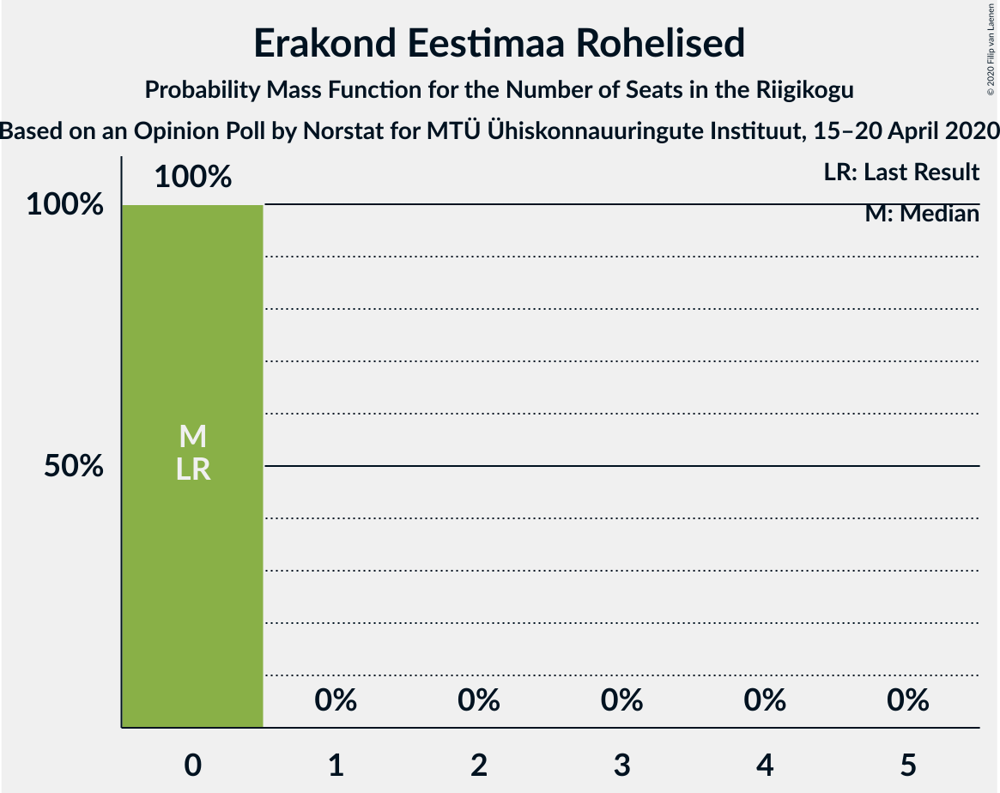

# Opinion Poll by Norstat for MTÜ Ühiskonnauuringute Instituut, 15–20 April 2020

<a href="#voting-intentions">Voting Intentions</a> | <a href="#seats">Seats</a> | <a href="#coalitions">Coalitions</a> | <a href="#technical-information">Technical Information</a>

## Voting Intentions

### Confidence Intervals

| Party | Last Result | Poll Result | 80% Confidence Interval | 90% Confidence Interval | 95% Confidence Interval | 99% Confidence Interval |
|:-----:|:-----------:|:-----------:|:-----------------------:|:-----------------------:|:-----------------------:|:-----------------------:|
| Eesti Reformierakond | 28.9% | 34.7% | 32.8–36.7% |32.3–37.2% |31.8–37.7% |30.9–38.7% |
| Eesti Keskerakond | 23.1% | 22.3% | 20.7–24.1% |20.2–24.6% |19.8–25.0% |19.1–25.8% |
| Eesti Konservatiivne Rahvaerakond | 17.8% | 18.1% | 16.6–19.7% |16.2–20.2% |15.8–20.6% |15.2–21.4% |
| Sotsiaaldemokraatlik Erakond | 9.8% | 8.2% | 7.2–9.4% |6.9–9.8% |6.6–10.1% |6.2–10.7% |
| Eesti 200 | 4.4% | 6.5% | 5.6–7.6% |5.3–7.9% |5.1–8.2% |4.7–8.8% |
| Erakond Isamaa | 11.4% | 5.2% | 4.4–6.2% |4.2–6.5% |4.0–6.8% |3.6–7.3% |
| Erakond Eestimaa Rohelised | 1.8% | 2.3% | 1.8–3.0% |1.6–3.2% |1.5–3.4% |1.3–3.8% |
| Eesti Vabaerakond | 1.2% | 0.2% | 0.1–0.5% |0.1–0.6% |0.1–0.7% |0.0–0.9% |

*Note:* The poll result column reflects the actual value used in the calculations. Published results may vary slightly, and in addition be rounded to fewer digits.

## Seats

### Confidence Intervals

| Party | Last Result | Median | 80% Confidence Interval | 90% Confidence Interval | 95% Confidence Interval | 99% Confidence Interval |
|:-----:|:-----------:|:------:|:-----------------------:|:-----------------------:|:-----------------------:|:-----------------------:|
| <a href="#eesti-reformierakond">Eesti Reformierakond</a> | 34 | 41 | 38–43 |38–44 |37–44 |35–46 |
| <a href="#eesti-keskerakond">Eesti Keskerakond</a> | 26 | 24 | 22–27 |22–28 |22–28 |21–28 |
| <a href="#eesti-konservatiivne-rahvaerakond">Eesti Konservatiivne Rahvaerakond</a> | 19 | 19 | 18–22 |17–22 |16–22 |16–23 |
| <a href="#sotsiaaldemokraatlik-erakond">Sotsiaaldemokraatlik Erakond</a> | 10 | 8 | 7–9 |6–9 |6–10 |6–10 |
| <a href="#eesti-200">Eesti 200</a> | 0 | 6 | 5–7 |5–8 |4–8 |0–8 |
| <a href="#erakond-isamaa">Erakond Isamaa</a> | 12 | 4 | 0–5 |0–6 |0–6 |0–6 |
| <a href="#erakond-eestimaa-rohelised">Erakond Eestimaa Rohelised</a> | 0 | 0 | 0 |0 |0 |0 |
| <a href="#eesti-vabaerakond">Eesti Vabaerakond</a> | 0 | 0 | 0 |0 |0 |0 |

### Eesti Reformierakond

*For a full overview of the results for this party, see the [Eesti Reformierakond](party-eestireformierakond.html) page.*

| Number of Seats | Probability | Accumulated | Special Marks |
|:---------------:|:-----------:|:-----------:|:-------------:|
| 34 | 0.3% | 100% | Last Result |
| 35 | 0.3% | 99.7% |  |
| 36 | 1.1% | 99.4% |  |
| 37 | 3% | 98% |  |
| 38 | 14% | 96% |  |
| 39 | 10% | 82% |  |
| 40 | 19% | 72% |  |
| 41 | 34% | 54% | Median |
| 42 | 6% | 20% |  |
| 43 | 9% | 14% |  |
| 44 | 4% | 5% |  |
| 45 | 0.6% | 1.4% |  |
| 46 | 0.4% | 0.7% |  |
| 47 | 0.3% | 0.4% |  |
| 48 | 0% | 0.1% |  |
| 49 | 0% | 0% |  |

### Eesti Keskerakond

*For a full overview of the results for this party, see the [Eesti Keskerakond](party-eestikeskerakond.html) page.*

| Number of Seats | Probability | Accumulated | Special Marks |
|:---------------:|:-----------:|:-----------:|:-------------:|
| 19 | 0.1% | 100% |  |
| 20 | 0.2% | 99.9% |  |
| 21 | 2% | 99.7% |  |
| 22 | 9% | 98% |  |
| 23 | 13% | 89% |  |
| 24 | 31% | 76% | Median |
| 25 | 8% | 45% |  |
| 26 | 22% | 38% | Last Result |
| 27 | 9% | 15% |  |
| 28 | 6% | 6% |  |
| 29 | 0.2% | 0.4% |  |
| 30 | 0.2% | 0.2% |  |
| 31 | 0% | 0% |  |

### Eesti Konservatiivne Rahvaerakond

*For a full overview of the results for this party, see the [Eesti Konservatiivne Rahvaerakond](party-eestikonservatiivnerahvaerakond.html) page.*

| Number of Seats | Probability | Accumulated | Special Marks |
|:---------------:|:-----------:|:-----------:|:-------------:|
| 15 | 0.3% | 100% |  |
| 16 | 3% | 99.7% |  |
| 17 | 4% | 97% |  |
| 18 | 31% | 94% |  |
| 19 | 26% | 62% | Last Result, Median |
| 20 | 15% | 36% |  |
| 21 | 11% | 21% |  |
| 22 | 9% | 10% |  |
| 23 | 1.0% | 1.4% |  |
| 24 | 0.3% | 0.4% |  |
| 25 | 0.1% | 0.1% |  |
| 26 | 0% | 0% |  |

### Sotsiaaldemokraatlik Erakond

*For a full overview of the results for this party, see the [Sotsiaaldemokraatlik Erakond](party-sotsiaaldemokraatlikerakond.html) page.*

| Number of Seats | Probability | Accumulated | Special Marks |
|:---------------:|:-----------:|:-----------:|:-------------:|
| 5 | 0.3% | 100% |  |
| 6 | 7% | 99.7% |  |
| 7 | 33% | 92% |  |
| 8 | 30% | 59% | Median |
| 9 | 26% | 30% |  |
| 10 | 3% | 4% | Last Result |
| 11 | 0.3% | 0.4% |  |
| 12 | 0% | 0% |  |

### Eesti 200

*For a full overview of the results for this party, see the [Eesti 200](party-eesti200.html) page.*

| Number of Seats | Probability | Accumulated | Special Marks |
|:---------------:|:-----------:|:-----------:|:-------------:|
| 0 | 1.2% | 100% | Last Result |
| 1 | 0% | 98.8% |  |
| 2 | 0% | 98.8% |  |
| 3 | 0% | 98.8% |  |
| 4 | 2% | 98.8% |  |
| 5 | 22% | 97% |  |
| 6 | 57% | 75% | Median |
| 7 | 11% | 18% |  |
| 8 | 7% | 7% |  |
| 9 | 0.1% | 0.1% |  |
| 10 | 0% | 0% |  |

### Erakond Isamaa

*For a full overview of the results for this party, see the [Erakond Isamaa](party-erakondisamaa.html) page.*

| Number of Seats | Probability | Accumulated | Special Marks |
|:---------------:|:-----------:|:-----------:|:-------------:|
| 0 | 42% | 100% |  |
| 1 | 0% | 58% |  |
| 2 | 0% | 58% |  |
| 3 | 0% | 58% |  |
| 4 | 12% | 58% | Median |
| 5 | 38% | 46% |  |
| 6 | 8% | 8% |  |
| 7 | 0.4% | 0.5% |  |
| 8 | 0% | 0% |  |
| 9 | 0% | 0% |  |
| 10 | 0% | 0% |  |
| 11 | 0% | 0% |  |
| 12 | 0% | 0% | Last Result |

### Erakond Eestimaa Rohelised

*For a full overview of the results for this party, see the [Erakond Eestimaa Rohelised](party-erakondeestimaarohelised.html) page.*

| Number of Seats | Probability | Accumulated | Special Marks |
|:---------------:|:-----------:|:-----------:|:-------------:|
| 0 | 100% | 100% | Last Result, Median |

### Eesti Vabaerakond

*For a full overview of the results for this party, see the [Eesti Vabaerakond](party-eestivabaerakond.html) page.*

| Number of Seats | Probability | Accumulated | Special Marks |
|:---------------:|:-----------:|:-----------:|:-------------:|
| 0 | 100% | 100% | Last Result, Median |

## Coalitions

### Confidence Intervals

| Coalition | Last Result | Median | Majority? | 80% Confidence Interval | 90% Confidence Interval | 95% Confidence Interval | 99% Confidence Interval |
|:---------:|:-----------:|:------:|:---------:|:-----------------------:|:-----------------------:|:-----------------------:|:-----------------------:|
| Eesti Reformierakond – Eesti Keskerakond – Eesti Konservatiivne Rahvaerakond | 79 | 84 | 100% | 82–87 | 81–88 | 80–89 | 79–92 |
| Eesti Reformierakond – Eesti Keskerakond | 60 | 65 | 100% | 63–67 | 62–68 | 60–69 | 59–71 |
| Eesti Reformierakond – Eesti Konservatiivne Rahvaerakond – Erakond Isamaa | 65 | 63 | 100% | 60–65 | 59–66 | 58–67 | 58–68 |
| Eesti Reformierakond – Eesti Konservatiivne Rahvaerakond | 53 | 60 | 100% | 57–62 | 56–64 | 56–64 | 54–66 |
| Eesti Reformierakond – Sotsiaaldemokraatlik Erakond – Erakond Isamaa – Eesti Vabaerakond | 56 | 51 | 63% | 48–54 | 48–55 | 47–56 | 45–57 |
| Eesti Reformierakond – Sotsiaaldemokraatlik Erakond – Erakond Isamaa | 56 | 51 | 63% | 48–54 | 48–55 | 47–56 | 45–57 |
| Eesti Reformierakond – Sotsiaaldemokraatlik Erakond | 44 | 48 | 14% | 46–51 | 45–53 | 44–53 | 43–54 |
| Eesti Keskerakond – Eesti Konservatiivne Rahvaerakond – Erakond Isamaa | 57 | 47 | 2% | 43–50 | 42–50 | 42–50 | 41–52 |
| Eesti Keskerakond – Eesti Konservatiivne Rahvaerakond | 45 | 44 | 0.1% | 42–47 | 40–48 | 40–49 | 39–50 |
| Eesti Reformierakond – Erakond Isamaa | 46 | 43 | 0% | 40–46 | 39–47 | 39–48 | 38–49 |
| Eesti Keskerakond – Sotsiaaldemokraatlik Erakond – Erakond Isamaa | 48 | 35 | 0% | 32–39 | 31–40 | 31–40 | 30–41 |
| Eesti Keskerakond – Sotsiaaldemokraatlik Erakond | 36 | 32 | 0% | 30–35 | 29–36 | 29–36 | 28–37 |
| Eesti Konservatiivne Rahvaerakond – Sotsiaaldemokraatlik Erakond | 29 | 27 | 0% | 25–29 | 24–31 | 24–31 | 23–32 |

### Eesti Reformierakond – Eesti Keskerakond – Eesti Konservatiivne Rahvaerakond

| Number of Seats | Probability | Accumulated | Special Marks |
|:---------------:|:-----------:|:-----------:|:-------------:|
| 78 | 0.1% | 100% |  |
| 79 | 0.6% | 99.9% | Last Result |
| 80 | 2% | 99.2% |  |
| 81 | 6% | 97% |  |
| 82 | 10% | 91% |  |
| 83 | 24% | 81% |  |
| 84 | 14% | 57% | Median |
| 85 | 8% | 43% |  |
| 86 | 19% | 36% |  |
| 87 | 12% | 17% |  |
| 88 | 2% | 5% |  |
| 89 | 3% | 4% |  |
| 90 | 0.1% | 0.9% |  |
| 91 | 0% | 0.8% |  |
| 92 | 0.7% | 0.8% |  |
| 93 | 0.1% | 0.1% |  |
| 94 | 0% | 0% |  |

### Eesti Reformierakond – Eesti Keskerakond

| Number of Seats | Probability | Accumulated | Special Marks |
|:---------------:|:-----------:|:-----------:|:-------------:|
| 58 | 0.1% | 100% |  |
| 59 | 1.3% | 99.9% |  |
| 60 | 1.3% | 98.6% | Last Result |
| 61 | 2% | 97% |  |
| 62 | 3% | 95% |  |
| 63 | 9% | 93% |  |
| 64 | 22% | 84% |  |
| 65 | 23% | 61% | Median |
| 66 | 10% | 38% |  |
| 67 | 21% | 29% |  |
| 68 | 6% | 8% |  |
| 69 | 0.8% | 3% |  |
| 70 | 0.5% | 2% |  |
| 71 | 1.1% | 1.3% |  |
| 72 | 0.1% | 0.2% |  |
| 73 | 0.1% | 0.1% |  |
| 74 | 0% | 0% |  |

### Eesti Reformierakond – Eesti Konservatiivne Rahvaerakond – Erakond Isamaa

| Number of Seats | Probability | Accumulated | Special Marks |
|:---------------:|:-----------:|:-----------:|:-------------:|
| 56 | 0% | 100% |  |
| 57 | 0.3% | 99.9% |  |
| 58 | 3% | 99.7% |  |
| 59 | 3% | 97% |  |
| 60 | 12% | 95% |  |
| 61 | 21% | 82% |  |
| 62 | 11% | 62% |  |
| 63 | 12% | 51% |  |
| 64 | 26% | 39% | Median |
| 65 | 4% | 14% | Last Result |
| 66 | 5% | 9% |  |
| 67 | 4% | 5% |  |
| 68 | 0.3% | 0.7% |  |
| 69 | 0.1% | 0.3% |  |
| 70 | 0.1% | 0.3% |  |
| 71 | 0% | 0.1% |  |
| 72 | 0.1% | 0.1% |  |
| 73 | 0% | 0% |  |

### Eesti Reformierakond – Eesti Konservatiivne Rahvaerakond

| Number of Seats | Probability | Accumulated | Special Marks |
|:---------------:|:-----------:|:-----------:|:-------------:|
| 53 | 0.1% | 100% | Last Result |
| 54 | 0.4% | 99.9% |  |
| 55 | 0.8% | 99.4% |  |
| 56 | 7% | 98.7% |  |
| 57 | 8% | 92% |  |
| 58 | 10% | 84% |  |
| 59 | 20% | 74% |  |
| 60 | 20% | 54% | Median |
| 61 | 17% | 33% |  |
| 62 | 9% | 16% |  |
| 63 | 2% | 7% |  |
| 64 | 3% | 5% |  |
| 65 | 1.4% | 2% |  |
| 66 | 0.3% | 0.6% |  |
| 67 | 0.3% | 0.4% |  |
| 68 | 0.1% | 0.1% |  |
| 69 | 0% | 0% |  |

### Eesti Reformierakond – Sotsiaaldemokraatlik Erakond – Erakond Isamaa – Eesti Vabaerakond

| Number of Seats | Probability | Accumulated | Special Marks |
|:---------------:|:-----------:|:-----------:|:-------------:|
| 43 | 0.1% | 100% |  |
| 44 | 0.1% | 99.9% |  |
| 45 | 0.4% | 99.8% |  |
| 46 | 0.5% | 99.4% |  |
| 47 | 4% | 98.9% |  |
| 48 | 12% | 95% |  |
| 49 | 7% | 84% |  |
| 50 | 14% | 77% |  |
| 51 | 19% | 63% | Majority |
| 52 | 10% | 44% |  |
| 53 | 23% | 34% | Median |
| 54 | 3% | 11% |  |
| 55 | 5% | 8% |  |
| 56 | 2% | 3% | Last Result |
| 57 | 0.3% | 0.5% |  |
| 58 | 0.2% | 0.2% |  |
| 59 | 0% | 0% |  |

### Eesti Reformierakond – Sotsiaaldemokraatlik Erakond – Erakond Isamaa

| Number of Seats | Probability | Accumulated | Special Marks |
|:---------------:|:-----------:|:-----------:|:-------------:|
| 43 | 0.1% | 100% |  |
| 44 | 0.1% | 99.9% |  |
| 45 | 0.4% | 99.8% |  |
| 46 | 0.5% | 99.4% |  |
| 47 | 4% | 98.9% |  |
| 48 | 12% | 95% |  |
| 49 | 7% | 84% |  |
| 50 | 14% | 77% |  |
| 51 | 19% | 63% | Majority |
| 52 | 10% | 44% |  |
| 53 | 23% | 34% | Median |
| 54 | 3% | 11% |  |
| 55 | 5% | 8% |  |
| 56 | 2% | 3% | Last Result |
| 57 | 0.3% | 0.5% |  |
| 58 | 0.2% | 0.2% |  |
| 59 | 0% | 0% |  |

### Eesti Reformierakond – Sotsiaaldemokraatlik Erakond

| Number of Seats | Probability | Accumulated | Special Marks |
|:---------------:|:-----------:|:-----------:|:-------------:|
| 42 | 0.1% | 100% |  |
| 43 | 1.1% | 99.8% |  |
| 44 | 2% | 98.8% | Last Result |
| 45 | 6% | 97% |  |
| 46 | 12% | 91% |  |
| 47 | 10% | 79% |  |
| 48 | 33% | 69% |  |
| 49 | 6% | 36% | Median |
| 50 | 16% | 30% |  |
| 51 | 7% | 14% | Majority |
| 52 | 2% | 7% |  |
| 53 | 4% | 5% |  |
| 54 | 0.4% | 0.7% |  |
| 55 | 0.2% | 0.3% |  |
| 56 | 0% | 0.1% |  |
| 57 | 0.1% | 0.1% |  |
| 58 | 0% | 0% |  |

### Eesti Keskerakond – Eesti Konservatiivne Rahvaerakond – Erakond Isamaa

| Number of Seats | Probability | Accumulated | Special Marks |
|:---------------:|:-----------:|:-----------:|:-------------:|
| 40 | 0.2% | 100% |  |
| 41 | 0.5% | 99.8% |  |
| 42 | 6% | 99.3% |  |
| 43 | 3% | 93% |  |
| 44 | 4% | 90% |  |
| 45 | 14% | 86% |  |
| 46 | 11% | 72% |  |
| 47 | 27% | 60% | Median |
| 48 | 11% | 33% |  |
| 49 | 4% | 23% |  |
| 50 | 16% | 18% |  |
| 51 | 0.8% | 2% | Majority |
| 52 | 1.3% | 2% |  |
| 53 | 0.2% | 0.3% |  |
| 54 | 0% | 0.1% |  |
| 55 | 0% | 0% |  |
| 56 | 0% | 0% |  |
| 57 | 0% | 0% | Last Result |

### Eesti Keskerakond – Eesti Konservatiivne Rahvaerakond

| Number of Seats | Probability | Accumulated | Special Marks |
|:---------------:|:-----------:|:-----------:|:-------------:|
| 37 | 0.1% | 100% |  |
| 38 | 0.1% | 99.9% |  |
| 39 | 2% | 99.8% |  |
| 40 | 5% | 98% |  |
| 41 | 3% | 93% |  |
| 42 | 26% | 90% |  |
| 43 | 9% | 65% | Median |
| 44 | 11% | 56% |  |
| 45 | 21% | 44% | Last Result |
| 46 | 11% | 23% |  |
| 47 | 7% | 12% |  |
| 48 | 3% | 5% |  |
| 49 | 2% | 3% |  |
| 50 | 0.6% | 0.8% |  |
| 51 | 0.1% | 0.1% | Majority |
| 52 | 0% | 0% |  |

### Eesti Reformierakond – Erakond Isamaa

| Number of Seats | Probability | Accumulated | Special Marks |
|:---------------:|:-----------:|:-----------:|:-------------:|
| 36 | 0.2% | 100% |  |
| 37 | 0.1% | 99.8% |  |
| 38 | 0.9% | 99.7% |  |
| 39 | 7% | 98.8% |  |
| 40 | 4% | 92% |  |
| 41 | 17% | 88% |  |
| 42 | 8% | 71% |  |
| 43 | 17% | 63% |  |
| 44 | 9% | 46% |  |
| 45 | 12% | 37% | Median |
| 46 | 17% | 25% | Last Result |
| 47 | 4% | 8% |  |
| 48 | 2% | 3% |  |
| 49 | 0.9% | 1.1% |  |
| 50 | 0.1% | 0.2% |  |
| 51 | 0% | 0% | Majority |

### Eesti Keskerakond – Sotsiaaldemokraatlik Erakond – Erakond Isamaa

| Number of Seats | Probability | Accumulated | Special Marks |
|:---------------:|:-----------:|:-----------:|:-------------:|
| 28 | 0.1% | 100% |  |
| 29 | 0.2% | 99.9% |  |
| 30 | 0.5% | 99.7% |  |
| 31 | 6% | 99.1% |  |
| 32 | 4% | 93% |  |
| 33 | 10% | 90% |  |
| 34 | 9% | 80% |  |
| 35 | 24% | 71% |  |
| 36 | 19% | 47% | Median |
| 37 | 12% | 28% |  |
| 38 | 6% | 16% |  |
| 39 | 4% | 10% |  |
| 40 | 5% | 6% |  |
| 41 | 0.4% | 0.6% |  |
| 42 | 0.2% | 0.2% |  |
| 43 | 0% | 0% |  |
| 44 | 0% | 0% |  |
| 45 | 0% | 0% |  |
| 46 | 0% | 0% |  |
| 47 | 0% | 0% |  |
| 48 | 0% | 0% | Last Result |

### Eesti Keskerakond – Sotsiaaldemokraatlik Erakond

| Number of Seats | Probability | Accumulated | Special Marks |
|:---------------:|:-----------:|:-----------:|:-------------:|
| 26 | 0.1% | 100% |  |
| 27 | 0.1% | 99.9% |  |
| 28 | 1.1% | 99.8% |  |
| 29 | 7% | 98.6% |  |
| 30 | 4% | 91% |  |
| 31 | 27% | 88% |  |
| 32 | 15% | 61% | Median |
| 33 | 10% | 46% |  |
| 34 | 12% | 36% |  |
| 35 | 19% | 24% |  |
| 36 | 3% | 6% | Last Result |
| 37 | 2% | 2% |  |
| 38 | 0.2% | 0.3% |  |
| 39 | 0% | 0% |  |

### Eesti Konservatiivne Rahvaerakond – Sotsiaaldemokraatlik Erakond

| Number of Seats | Probability | Accumulated | Special Marks |
|:---------------:|:-----------:|:-----------:|:-------------:|
| 22 | 0.1% | 100% |  |
| 23 | 0.6% | 99.9% |  |
| 24 | 5% | 99.3% |  |
| 25 | 14% | 94% |  |
| 26 | 16% | 80% |  |
| 27 | 27% | 63% | Median |
| 28 | 20% | 37% |  |
| 29 | 7% | 17% | Last Result |
| 30 | 4% | 10% |  |
| 31 | 5% | 6% |  |
| 32 | 0.5% | 0.8% |  |
| 33 | 0.2% | 0.2% |  |
| 34 | 0% | 0.1% |  |
| 35 | 0% | 0% |  |

## Technical Information

### Opinion Poll

+ **Polling firm:** Norstat
+ **Commissioner(s):** MTÜ Ühiskonnauuringute Instituut
+ **Fieldwork period:** 15–20 April 2020

### Calculations

+ **Sample size:** 1000
+ **Simulations done:** 131,072
+ **Error estimate:** 2.10%

