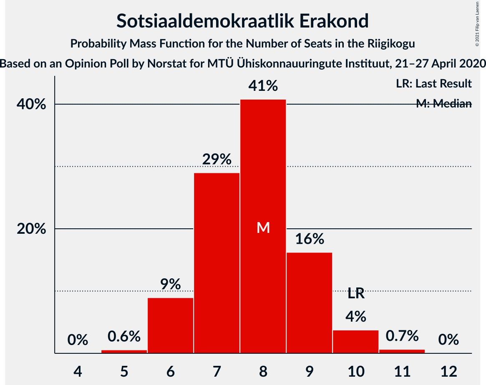

# Opinion Poll by Norstat for MTÜ Ühiskonnauuringute Instituut, 21–27 April 2020

<a href="#voting-intentions">Voting Intentions</a> | <a href="#seats">Seats</a> | <a href="#coalitions">Coalitions</a> | <a href="#technical-information">Technical Information</a>

## Voting Intentions

### Confidence Intervals

| Party | Last Result | Poll Result | 80% Confidence Interval | 90% Confidence Interval | 95% Confidence Interval | 99% Confidence Interval |
|:-----:|:-----------:|:-----------:|:-----------------------:|:-----------------------:|:-----------------------:|:-----------------------:|
| Eesti Reformierakond | 28.9% | 29.1% | 27.3–31.0% |26.8–31.5% |26.4–32.0% |25.5–32.9% |
| Eesti Keskerakond | 23.1% | 27.6% | 25.8–29.5% |25.3–30.0% |24.9–30.5% |24.1–31.4% |
| Eesti Konservatiivne Rahvaerakond | 17.8% | 18.0% | 16.5–19.6% |16.1–20.1% |15.7–20.5% |15.1–21.3% |
| Sotsiaaldemokraatlik Erakond | 9.8% | 8.1% | 7.1–9.3% |6.8–9.7% |6.6–10.0% |6.1–10.6% |
| Eesti 200 | 4.4% | 6.2% | 5.3–7.3% |5.1–7.6% |4.9–7.9% |4.5–8.4% |
| Erakond Isamaa | 11.4% | 5.3% | 4.5–6.3% |4.3–6.6% |4.1–6.9% |3.7–7.4% |
| Erakond Eestimaa Rohelised | 1.8% | 2.1% | 1.6–2.8% |1.5–3.0% |1.4–3.2% |1.2–3.6% |
| Eesti Vabaerakond | 1.2% | 0.7% | 0.5–1.2% |0.4–1.3% |0.3–1.4% |0.2–1.7% |

*Note:* The poll result column reflects the actual value used in the calculations. Published results may vary slightly, and in addition be rounded to fewer digits.

## Seats

### Confidence Intervals

| Party | Last Result | Median | 80% Confidence Interval | 90% Confidence Interval | 95% Confidence Interval | 99% Confidence Interval |
|:-----:|:-----------:|:------:|:-----------------------:|:-----------------------:|:-----------------------:|:-----------------------:|
| <a href="#eesti-reformierakond">Eesti Reformierakond</a> | 34 | 33 | 31–36 |30–37 |29–38 |28–39 |
| <a href="#eesti-keskerakond">Eesti Keskerakond</a> | 26 | 32 | 29–34 |28–35 |28–36 |27–37 |
| <a href="#eesti-konservatiivne-rahvaerakond">Eesti Konservatiivne Rahvaerakond</a> | 19 | 20 | 17–22 |17–22 |16–23 |16–24 |
| <a href="#sotsiaaldemokraatlik-erakond">Sotsiaaldemokraatlik Erakond</a> | 10 | 8 | 6–9 |6–10 |6–10 |5–11 |
| <a href="#eesti-200">Eesti 200</a> | 0 | 6 | 5–7 |0–7 |0–8 |0–8 |
| <a href="#erakond-isamaa">Erakond Isamaa</a> | 12 | 5 | 0–6 |0–6 |0–6 |0–7 |
| <a href="#erakond-eestimaa-rohelised">Erakond Eestimaa Rohelised</a> | 0 | 0 | 0 |0 |0 |0 |
| <a href="#eesti-vabaerakond">Eesti Vabaerakond</a> | 0 | 0 | 0 |0 |0 |0 |

### Eesti Reformierakond

*For a full overview of the results for this party, see the [Eesti Reformierakond](party-eestireformierakond.html) page.*

| Number of Seats | Probability | Accumulated | Special Marks |
|:---------------:|:-----------:|:-----------:|:-------------:|
| 27 | 0.1% | 100% |  |
| 28 | 0.7% | 99.9% |  |
| 29 | 2% | 99.2% |  |
| 30 | 5% | 97% |  |
| 31 | 9% | 93% |  |
| 32 | 19% | 84% |  |
| 33 | 18% | 65% | Median |
| 34 | 14% | 47% | Last Result |
| 35 | 18% | 34% |  |
| 36 | 6% | 15% |  |
| 37 | 6% | 9% |  |
| 38 | 2% | 3% |  |
| 39 | 0.7% | 1.0% |  |
| 40 | 0.2% | 0.3% |  |
| 41 | 0% | 0% |  |

### Eesti Keskerakond

*For a full overview of the results for this party, see the [Eesti Keskerakond](party-eestikeskerakond.html) page.*

| Number of Seats | Probability | Accumulated | Special Marks |
|:---------------:|:-----------:|:-----------:|:-------------:|
| 26 | 0.3% | 100% | Last Result |
| 27 | 1.2% | 99.7% |  |
| 28 | 5% | 98.5% |  |
| 29 | 13% | 93% |  |
| 30 | 10% | 81% |  |
| 31 | 16% | 70% |  |
| 32 | 26% | 54% | Median |
| 33 | 10% | 28% |  |
| 34 | 11% | 17% |  |
| 35 | 4% | 6% |  |
| 36 | 2% | 3% |  |
| 37 | 0.2% | 0.7% |  |
| 38 | 0.5% | 0.5% |  |
| 39 | 0% | 0% |  |

### Eesti Konservatiivne Rahvaerakond

*For a full overview of the results for this party, see the [Eesti Konservatiivne Rahvaerakond](party-eestikonservatiivnerahvaerakond.html) page.*

| Number of Seats | Probability | Accumulated | Special Marks |
|:---------------:|:-----------:|:-----------:|:-------------:|
| 15 | 0.3% | 100% |  |
| 16 | 3% | 99.7% |  |
| 17 | 10% | 96% |  |
| 18 | 14% | 86% |  |
| 19 | 21% | 72% | Last Result |
| 20 | 21% | 51% | Median |
| 21 | 19% | 30% |  |
| 22 | 7% | 11% |  |
| 23 | 4% | 4% |  |
| 24 | 0.6% | 0.7% |  |
| 25 | 0.1% | 0.1% |  |
| 26 | 0% | 0% |  |

### Sotsiaaldemokraatlik Erakond

*For a full overview of the results for this party, see the [Sotsiaaldemokraatlik Erakond](party-sotsiaaldemokraatlikerakond.html) page.*

| Number of Seats | Probability | Accumulated | Special Marks |
|:---------------:|:-----------:|:-----------:|:-------------:|
| 5 | 0.7% | 100% |  |
| 6 | 11% | 99.3% |  |
| 7 | 23% | 88% |  |
| 8 | 41% | 65% | Median |
| 9 | 19% | 24% |  |
| 10 | 5% | 5% | Last Result |
| 11 | 0.6% | 0.7% |  |
| 12 | 0.1% | 0.1% |  |
| 13 | 0% | 0% |  |

### Eesti 200

*For a full overview of the results for this party, see the [Eesti 200](party-eesti200.html) page.*

| Number of Seats | Probability | Accumulated | Special Marks |
|:---------------:|:-----------:|:-----------:|:-------------:|
| 0 | 6% | 100% | Last Result |
| 1 | 0% | 94% |  |
| 2 | 0% | 94% |  |
| 3 | 0% | 94% |  |
| 4 | 3% | 94% |  |
| 5 | 36% | 91% |  |
| 6 | 37% | 55% | Median |
| 7 | 15% | 18% |  |
| 8 | 3% | 3% |  |
| 9 | 0.2% | 0.2% |  |
| 10 | 0% | 0% |  |

### Erakond Isamaa

*For a full overview of the results for this party, see the [Erakond Isamaa](party-erakondisamaa.html) page.*

| Number of Seats | Probability | Accumulated | Special Marks |
|:---------------:|:-----------:|:-----------:|:-------------:|
| 0 | 36% | 100% |  |
| 1 | 0% | 64% |  |
| 2 | 0% | 64% |  |
| 3 | 0% | 64% |  |
| 4 | 10% | 64% |  |
| 5 | 40% | 54% | Median |
| 6 | 13% | 14% |  |
| 7 | 1.3% | 1.4% |  |
| 8 | 0.1% | 0.1% |  |
| 9 | 0% | 0% |  |
| 10 | 0% | 0% |  |
| 11 | 0% | 0% |  |
| 12 | 0% | 0% | Last Result |

### Erakond Eestimaa Rohelised

*For a full overview of the results for this party, see the [Erakond Eestimaa Rohelised](party-erakondeestimaarohelised.html) page.*

| Number of Seats | Probability | Accumulated | Special Marks |
|:---------------:|:-----------:|:-----------:|:-------------:|
| 0 | 100% | 100% | Last Result, Median |

### Eesti Vabaerakond

*For a full overview of the results for this party, see the [Eesti Vabaerakond](party-eestivabaerakond.html) page.*

| Number of Seats | Probability | Accumulated | Special Marks |
|:---------------:|:-----------:|:-----------:|:-------------:|
| 0 | 100% | 100% | Last Result, Median |

## Coalitions

### Confidence Intervals

| Coalition | Last Result | Median | Majority? | 80% Confidence Interval | 90% Confidence Interval | 95% Confidence Interval | 99% Confidence Interval |
|:---------:|:-----------:|:------:|:---------:|:-----------------------:|:-----------------------:|:-----------------------:|:-----------------------:|
| Eesti Reformierakond – Eesti Keskerakond – Eesti Konservatiivne Rahvaerakond | 79 | 84 | 100% | 81–88 | 81–89 | 80–92 | 80–93 |
| Eesti Reformierakond – Eesti Keskerakond | 60 | 65 | 100% | 61–68 | 61–70 | 60–71 | 59–72 |
| Eesti Reformierakond – Eesti Konservatiivne Rahvaerakond – Erakond Isamaa | 65 | 56 | 99.4% | 53–59 | 53–60 | 52–61 | 50–63 |
| Eesti Keskerakond – Eesti Konservatiivne Rahvaerakond – Erakond Isamaa | 57 | 54 | 95% | 52–57 | 50–58 | 49–59 | 48–60 |
| Eesti Reformierakond – Eesti Konservatiivne Rahvaerakond | 53 | 53 | 79% | 49–56 | 49–57 | 49–59 | 47–59 |
| Eesti Keskerakond – Eesti Konservatiivne Rahvaerakond | 45 | 51 | 57% | 48–54 | 47–55 | 47–56 | 45–57 |
| Eesti Reformierakond – Sotsiaaldemokraatlik Erakond – Erakond Isamaa – Eesti Vabaerakond | 56 | 45 | 0.7% | 41–48 | 40–49 | 40–49 | 38–51 |
| Eesti Reformierakond – Sotsiaaldemokraatlik Erakond – Erakond Isamaa | 56 | 45 | 0.7% | 41–48 | 40–49 | 40–49 | 38–51 |
| Eesti Keskerakond – Sotsiaaldemokraatlik Erakond – Erakond Isamaa | 48 | 42 | 0.1% | 39–46 | 38–47 | 38–47 | 37–48 |
| Eesti Reformierakond – Sotsiaaldemokraatlik Erakond | 44 | 41 | 0% | 38–44 | 38–45 | 37–46 | 36–47 |
| Eesti Keskerakond – Sotsiaaldemokraatlik Erakond | 36 | 39 | 0% | 37–42 | 36–43 | 35–43 | 34–46 |
| Eesti Reformierakond – Erakond Isamaa | 46 | 37 | 0% | 34–40 | 33–41 | 32–42 | 31–43 |
| Eesti Konservatiivne Rahvaerakond – Sotsiaaldemokraatlik Erakond | 29 | 28 | 0% | 25–30 | 24–30 | 24–31 | 23–32 |

### Eesti Reformierakond – Eesti Keskerakond – Eesti Konservatiivne Rahvaerakond

| Number of Seats | Probability | Accumulated | Special Marks |
|:---------------:|:-----------:|:-----------:|:-------------:|
| 78 | 0.1% | 100% |  |
| 79 | 0.4% | 99.9% | Last Result |
| 80 | 3% | 99.5% |  |
| 81 | 16% | 96% |  |
| 82 | 13% | 81% |  |
| 83 | 14% | 68% |  |
| 84 | 8% | 54% |  |
| 85 | 10% | 46% | Median |
| 86 | 8% | 36% |  |
| 87 | 7% | 28% |  |
| 88 | 13% | 21% |  |
| 89 | 5% | 8% |  |
| 90 | 0.5% | 3% |  |
| 91 | 0.1% | 3% |  |
| 92 | 0.4% | 3% |  |
| 93 | 2% | 2% |  |
| 94 | 0.1% | 0.1% |  |
| 95 | 0% | 0% |  |

### Eesti Reformierakond – Eesti Keskerakond

| Number of Seats | Probability | Accumulated | Special Marks |
|:---------------:|:-----------:|:-----------:|:-------------:|
| 58 | 0.1% | 100% |  |
| 59 | 0.7% | 99.9% |  |
| 60 | 2% | 99.2% | Last Result |
| 61 | 7% | 97% |  |
| 62 | 10% | 90% |  |
| 63 | 10% | 79% |  |
| 64 | 14% | 70% |  |
| 65 | 9% | 56% | Median |
| 66 | 19% | 47% |  |
| 67 | 15% | 28% |  |
| 68 | 4% | 13% |  |
| 69 | 2% | 9% |  |
| 70 | 3% | 7% |  |
| 71 | 3% | 3% |  |
| 72 | 0.4% | 0.6% |  |
| 73 | 0.1% | 0.2% |  |
| 74 | 0.1% | 0.1% |  |
| 75 | 0% | 0% |  |

### Eesti Reformierakond – Eesti Konservatiivne Rahvaerakond – Erakond Isamaa

| Number of Seats | Probability | Accumulated | Special Marks |
|:---------------:|:-----------:|:-----------:|:-------------:|
| 49 | 0.3% | 100% |  |
| 50 | 0.3% | 99.7% |  |
| 51 | 0.3% | 99.4% | Majority |
| 52 | 3% | 99.0% |  |
| 53 | 7% | 96% |  |
| 54 | 13% | 88% |  |
| 55 | 15% | 76% |  |
| 56 | 14% | 61% |  |
| 57 | 15% | 46% |  |
| 58 | 18% | 31% | Median |
| 59 | 8% | 13% |  |
| 60 | 2% | 5% |  |
| 61 | 1.4% | 4% |  |
| 62 | 1.2% | 2% |  |
| 63 | 0.7% | 1.1% |  |
| 64 | 0.4% | 0.4% |  |
| 65 | 0% | 0% | Last Result |

### Eesti Keskerakond – Eesti Konservatiivne Rahvaerakond – Erakond Isamaa

| Number of Seats | Probability | Accumulated | Special Marks |
|:---------------:|:-----------:|:-----------:|:-------------:|
| 47 | 0.2% | 100% |  |
| 48 | 0.5% | 99.8% |  |
| 49 | 2% | 99.3% |  |
| 50 | 3% | 97% |  |
| 51 | 4% | 95% | Majority |
| 52 | 11% | 91% |  |
| 53 | 19% | 79% |  |
| 54 | 18% | 60% |  |
| 55 | 10% | 42% |  |
| 56 | 14% | 32% |  |
| 57 | 11% | 18% | Last Result, Median |
| 58 | 4% | 7% |  |
| 59 | 2% | 3% |  |
| 60 | 1.3% | 2% |  |
| 61 | 0.2% | 0.3% |  |
| 62 | 0.1% | 0.1% |  |
| 63 | 0% | 0% |  |

### Eesti Reformierakond – Eesti Konservatiivne Rahvaerakond

| Number of Seats | Probability | Accumulated | Special Marks |
|:---------------:|:-----------:|:-----------:|:-------------:|
| 46 | 0.1% | 100% |  |
| 47 | 0.6% | 99.9% |  |
| 48 | 1.4% | 99.3% |  |
| 49 | 11% | 98% |  |
| 50 | 8% | 87% |  |
| 51 | 9% | 79% | Majority |
| 52 | 11% | 70% |  |
| 53 | 22% | 59% | Last Result, Median |
| 54 | 7% | 36% |  |
| 55 | 6% | 29% |  |
| 56 | 14% | 23% |  |
| 57 | 5% | 9% |  |
| 58 | 1.4% | 4% |  |
| 59 | 2% | 3% |  |
| 60 | 0.3% | 0.4% |  |
| 61 | 0% | 0.1% |  |
| 62 | 0.1% | 0.1% |  |
| 63 | 0% | 0% |  |

### Eesti Keskerakond – Eesti Konservatiivne Rahvaerakond

| Number of Seats | Probability | Accumulated | Special Marks |
|:---------------:|:-----------:|:-----------:|:-------------:|
| 44 | 0.1% | 100% |  |
| 45 | 0.4% | 99.9% | Last Result |
| 46 | 2% | 99.5% |  |
| 47 | 4% | 98% |  |
| 48 | 11% | 93% |  |
| 49 | 15% | 83% |  |
| 50 | 11% | 68% |  |
| 51 | 14% | 57% | Majority |
| 52 | 11% | 42% | Median |
| 53 | 17% | 31% |  |
| 54 | 5% | 14% |  |
| 55 | 5% | 9% |  |
| 56 | 3% | 4% |  |
| 57 | 0.6% | 0.9% |  |
| 58 | 0.2% | 0.3% |  |
| 59 | 0% | 0.1% |  |
| 60 | 0% | 0% |  |

### Eesti Reformierakond – Sotsiaaldemokraatlik Erakond – Erakond Isamaa – Eesti Vabaerakond

| Number of Seats | Probability | Accumulated | Special Marks |
|:---------------:|:-----------:|:-----------:|:-------------:|
| 37 | 0.2% | 100% |  |
| 38 | 0.3% | 99.8% |  |
| 39 | 0.5% | 99.5% |  |
| 40 | 4% | 98.9% |  |
| 41 | 6% | 95% |  |
| 42 | 7% | 89% |  |
| 43 | 20% | 82% |  |
| 44 | 7% | 63% |  |
| 45 | 25% | 56% |  |
| 46 | 8% | 31% | Median |
| 47 | 12% | 23% |  |
| 48 | 5% | 10% |  |
| 49 | 4% | 6% |  |
| 50 | 1.1% | 2% |  |
| 51 | 0.5% | 0.7% | Majority |
| 52 | 0.2% | 0.2% |  |
| 53 | 0% | 0% |  |
| 54 | 0% | 0% |  |
| 55 | 0% | 0% |  |
| 56 | 0% | 0% | Last Result |

### Eesti Reformierakond – Sotsiaaldemokraatlik Erakond – Erakond Isamaa

| Number of Seats | Probability | Accumulated | Special Marks |
|:---------------:|:-----------:|:-----------:|:-------------:|
| 37 | 0.2% | 100% |  |
| 38 | 0.3% | 99.8% |  |
| 39 | 0.5% | 99.5% |  |
| 40 | 4% | 98.9% |  |
| 41 | 6% | 95% |  |
| 42 | 7% | 89% |  |
| 43 | 20% | 82% |  |
| 44 | 7% | 63% |  |
| 45 | 25% | 56% |  |
| 46 | 8% | 31% | Median |
| 47 | 12% | 23% |  |
| 48 | 5% | 10% |  |
| 49 | 4% | 6% |  |
| 50 | 1.1% | 2% |  |
| 51 | 0.5% | 0.7% | Majority |
| 52 | 0.2% | 0.2% |  |
| 53 | 0% | 0% |  |
| 54 | 0% | 0% |  |
| 55 | 0% | 0% |  |
| 56 | 0% | 0% | Last Result |

### Eesti Keskerakond – Sotsiaaldemokraatlik Erakond – Erakond Isamaa

| Number of Seats | Probability | Accumulated | Special Marks |
|:---------------:|:-----------:|:-----------:|:-------------:|
| 35 | 0.1% | 100% |  |
| 36 | 0.2% | 99.9% |  |
| 37 | 1.2% | 99.7% |  |
| 38 | 4% | 98% |  |
| 39 | 6% | 95% |  |
| 40 | 14% | 89% |  |
| 41 | 8% | 76% |  |
| 42 | 18% | 67% |  |
| 43 | 12% | 50% |  |
| 44 | 13% | 37% |  |
| 45 | 11% | 24% | Median |
| 46 | 5% | 13% |  |
| 47 | 5% | 7% |  |
| 48 | 2% | 2% | Last Result |
| 49 | 0.2% | 0.4% |  |
| 50 | 0.2% | 0.3% |  |
| 51 | 0% | 0.1% | Majority |
| 52 | 0% | 0% |  |

### Eesti Reformierakond – Sotsiaaldemokraatlik Erakond

| Number of Seats | Probability | Accumulated | Special Marks |
|:---------------:|:-----------:|:-----------:|:-------------:|
| 35 | 0.2% | 100% |  |
| 36 | 1.4% | 99.7% |  |
| 37 | 2% | 98% |  |
| 38 | 9% | 96% |  |
| 39 | 9% | 87% |  |
| 40 | 17% | 78% |  |
| 41 | 14% | 62% | Median |
| 42 | 15% | 47% |  |
| 43 | 16% | 32% |  |
| 44 | 6% | 16% | Last Result |
| 45 | 7% | 10% |  |
| 46 | 2% | 3% |  |
| 47 | 0.7% | 0.9% |  |
| 48 | 0.1% | 0.2% |  |
| 49 | 0% | 0% |  |

### Eesti Keskerakond – Sotsiaaldemokraatlik Erakond

| Number of Seats | Probability | Accumulated | Special Marks |
|:---------------:|:-----------:|:-----------:|:-------------:|
| 33 | 0.1% | 100% |  |
| 34 | 1.4% | 99.9% |  |
| 35 | 1.2% | 98% |  |
| 36 | 4% | 97% | Last Result |
| 37 | 15% | 93% |  |
| 38 | 15% | 78% |  |
| 39 | 14% | 64% |  |
| 40 | 24% | 49% | Median |
| 41 | 8% | 26% |  |
| 42 | 10% | 17% |  |
| 43 | 5% | 7% |  |
| 44 | 1.4% | 2% |  |
| 45 | 0.3% | 0.9% |  |
| 46 | 0.3% | 0.5% |  |
| 47 | 0.2% | 0.2% |  |
| 48 | 0% | 0% |  |

### Eesti Reformierakond – Erakond Isamaa

| Number of Seats | Probability | Accumulated | Special Marks |
|:---------------:|:-----------:|:-----------:|:-------------:|
| 29 | 0.1% | 100% |  |
| 30 | 0.3% | 99.9% |  |
| 31 | 0.9% | 99.6% |  |
| 32 | 2% | 98.7% |  |
| 33 | 6% | 97% |  |
| 34 | 7% | 91% |  |
| 35 | 18% | 84% |  |
| 36 | 11% | 66% |  |
| 37 | 19% | 55% |  |
| 38 | 14% | 36% | Median |
| 39 | 8% | 22% |  |
| 40 | 7% | 13% |  |
| 41 | 4% | 7% |  |
| 42 | 2% | 3% |  |
| 43 | 0.3% | 0.5% |  |
| 44 | 0.2% | 0.2% |  |
| 45 | 0% | 0% |  |
| 46 | 0% | 0% | Last Result |

### Eesti Konservatiivne Rahvaerakond – Sotsiaaldemokraatlik Erakond

| Number of Seats | Probability | Accumulated | Special Marks |
|:---------------:|:-----------:|:-----------:|:-------------:|
| 22 | 0.5% | 100% |  |
| 23 | 1.3% | 99.5% |  |
| 24 | 4% | 98% |  |
| 25 | 17% | 94% |  |
| 26 | 16% | 77% |  |
| 27 | 11% | 61% |  |
| 28 | 15% | 50% | Median |
| 29 | 23% | 35% | Last Result |
| 30 | 9% | 12% |  |
| 31 | 2% | 3% |  |
| 32 | 0.8% | 1.1% |  |
| 33 | 0.2% | 0.3% |  |
| 34 | 0.1% | 0.1% |  |
| 35 | 0% | 0% |  |

## Technical Information

### Opinion Poll

+ **Polling firm:** Norstat
+ **Commissioner(s):** MTÜ Ühiskonnauuringute Instituut
+ **Fieldwork period:** 21–27 April 2020

### Calculations

+ **Sample size:** 1000
+ **Simulations done:** 262,144
+ **Error estimate:** 1.74%

