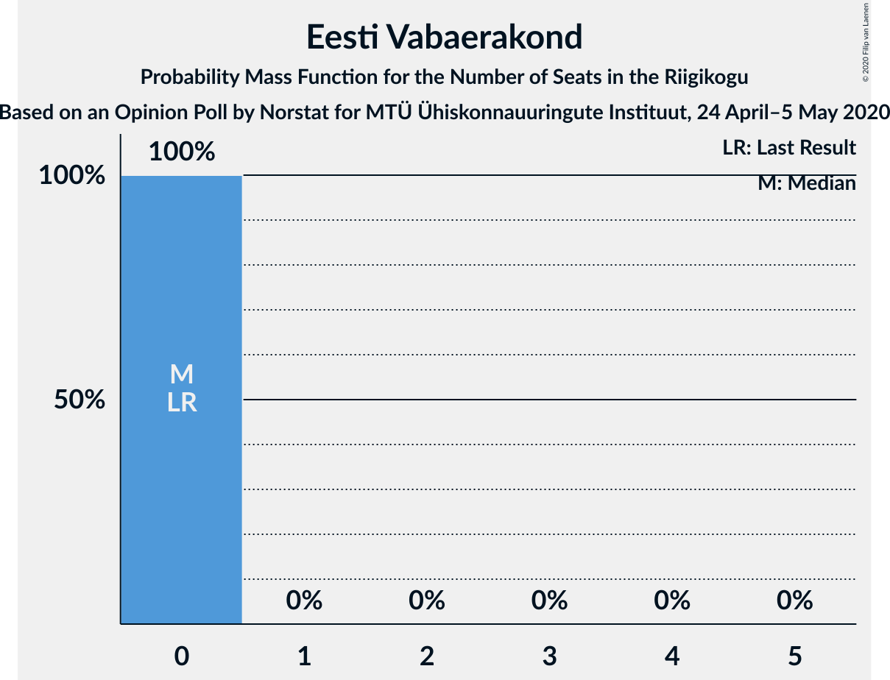

# Opinion Poll by Norstat for MTÜ Ühiskonnauuringute Instituut, 24 April–5 May 2020

<a href="#voting-intentions">Voting Intentions</a> | <a href="#seats">Seats</a> | <a href="#coalitions">Coalitions</a> | <a href="#technical-information">Technical Information</a>

## Voting Intentions

### Confidence Intervals

| Party | Last Result | Poll Result | 80% Confidence Interval | 90% Confidence Interval | 95% Confidence Interval | 99% Confidence Interval |
|:-----:|:-----------:|:-----------:|:-----------------------:|:-----------------------:|:-----------------------:|:-----------------------:|
| Eesti Reformierakond | 28.9% | 29.8% | 28.0–31.7% |27.5–32.3% |27.0–32.7% |26.2–33.6% |
| Eesti Keskerakond | 23.1% | 23.8% | 22.1–25.6% |21.7–26.1% |21.3–26.6% |20.5–27.4% |
| Eesti Konservatiivne Rahvaerakond | 17.8% | 19.2% | 17.7–20.9% |17.2–21.4% |16.9–21.8% |16.2–22.6% |
| Sotsiaaldemokraatlik Erakond | 9.8% | 9.3% | 8.2–10.6% |7.9–10.9% |7.7–11.3% |7.2–11.9% |
| Eesti 200 | 4.4% | 8.6% | 7.6–9.8% |7.3–10.2% |7.0–10.5% |6.5–11.1% |
| Erakond Isamaa | 11.4% | 4.6% | 3.9–5.6% |3.6–5.8% |3.5–6.1% |3.1–6.6% |
| Erakond Eestimaa Rohelised | 1.8% | 2.7% | 2.1–3.5% |2.0–3.7% |1.9–3.9% |1.6–4.3% |
| Eesti Vabaerakond | 1.2% | 0.8% | 0.5–1.3% |0.5–1.4% |0.4–1.6% |0.3–1.9% |

*Note:* The poll result column reflects the actual value used in the calculations. Published results may vary slightly, and in addition be rounded to fewer digits.

## Seats

### Confidence Intervals

| Party | Last Result | Median | 80% Confidence Interval | 90% Confidence Interval | 95% Confidence Interval | 99% Confidence Interval |
|:-----:|:-----------:|:------:|:-----------------------:|:-----------------------:|:-----------------------:|:-----------------------:|
| <a href="#eesti-reformierakond">Eesti Reformierakond</a> | 34 | 34 | 32–37 |31–38 |31–39 |30–40 |
| <a href="#eesti-keskerakond">Eesti Keskerakond</a> | 26 | 27 | 24–29 |24–29 |23–30 |23–32 |
| <a href="#eesti-konservatiivne-rahvaerakond">Eesti Konservatiivne Rahvaerakond</a> | 19 | 21 | 18–23 |18–24 |18–24 |17–25 |
| <a href="#sotsiaaldemokraatlik-erakond">Sotsiaaldemokraatlik Erakond</a> | 10 | 9 | 8–10 |8–11 |7–11 |6–12 |
| <a href="#eesti-200">Eesti 200</a> | 0 | 8 | 7–10 |7–10 |6–11 |6–11 |
| <a href="#erakond-isamaa">Erakond Isamaa</a> | 12 | 0 | 0–5 |0–5 |0–5 |0–6 |
| <a href="#erakond-eestimaa-rohelised">Erakond Eestimaa Rohelised</a> | 0 | 0 | 0 |0 |0 |0 |
| <a href="#eesti-vabaerakond">Eesti Vabaerakond</a> | 0 | 0 | 0 |0 |0 |0 |

### Eesti Reformierakond

*For a full overview of the results for this party, see the [Eesti Reformierakond](party-eestireformierakond.html) page.*

| Number of Seats | Probability | Accumulated | Special Marks |
|:---------------:|:-----------:|:-----------:|:-------------:|
| 28 | 0% | 100% |  |
| 29 | 0.3% | 99.9% |  |
| 30 | 1.3% | 99.6% |  |
| 31 | 3% | 98% |  |
| 32 | 9% | 95% |  |
| 33 | 30% | 86% |  |
| 34 | 22% | 56% | Last Result, Median |
| 35 | 12% | 34% |  |
| 36 | 10% | 22% |  |
| 37 | 6% | 12% |  |
| 38 | 2% | 6% |  |
| 39 | 2% | 3% |  |
| 40 | 0.7% | 0.8% |  |
| 41 | 0.1% | 0.1% |  |
| 42 | 0% | 0% |  |

### Eesti Keskerakond

*For a full overview of the results for this party, see the [Eesti Keskerakond](party-eestikeskerakond.html) page.*

| Number of Seats | Probability | Accumulated | Special Marks |
|:---------------:|:-----------:|:-----------:|:-------------:|
| 21 | 0% | 100% |  |
| 22 | 0.2% | 99.9% |  |
| 23 | 3% | 99.7% |  |
| 24 | 12% | 97% |  |
| 25 | 16% | 85% |  |
| 26 | 5% | 68% | Last Result |
| 27 | 15% | 63% | Median |
| 28 | 13% | 48% |  |
| 29 | 31% | 35% |  |
| 30 | 3% | 4% |  |
| 31 | 0.2% | 0.8% |  |
| 32 | 0.5% | 0.6% |  |
| 33 | 0.1% | 0.1% |  |
| 34 | 0% | 0% |  |

### Eesti Konservatiivne Rahvaerakond

*For a full overview of the results for this party, see the [Eesti Konservatiivne Rahvaerakond](party-eestikonservatiivnerahvaerakond.html) page.*

| Number of Seats | Probability | Accumulated | Special Marks |
|:---------------:|:-----------:|:-----------:|:-------------:|
| 16 | 0.1% | 100% |  |
| 17 | 0.7% | 99.9% |  |
| 18 | 10% | 99.1% |  |
| 19 | 9% | 89% | Last Result |
| 20 | 23% | 81% |  |
| 21 | 35% | 58% | Median |
| 22 | 7% | 23% |  |
| 23 | 7% | 16% |  |
| 24 | 7% | 9% |  |
| 25 | 1.0% | 1.5% |  |
| 26 | 0.4% | 0.5% |  |
| 27 | 0% | 0% |  |

### Sotsiaaldemokraatlik Erakond

*For a full overview of the results for this party, see the [Sotsiaaldemokraatlik Erakond](party-sotsiaaldemokraatlikerakond.html) page.*

| Number of Seats | Probability | Accumulated | Special Marks |
|:---------------:|:-----------:|:-----------:|:-------------:|
| 6 | 0.6% | 100% |  |
| 7 | 3% | 99.4% |  |
| 8 | 18% | 96% |  |
| 9 | 43% | 78% | Median |
| 10 | 26% | 35% | Last Result |
| 11 | 7% | 9% |  |
| 12 | 2% | 2% |  |
| 13 | 0.3% | 0.3% |  |
| 14 | 0% | 0% |  |

### Eesti 200

*For a full overview of the results for this party, see the [Eesti 200](party-eesti200.html) page.*

| Number of Seats | Probability | Accumulated | Special Marks |
|:---------------:|:-----------:|:-----------:|:-------------:|
| 0 | 0% | 100% | Last Result |
| 1 | 0% | 100% |  |
| 2 | 0% | 100% |  |
| 3 | 0% | 100% |  |
| 4 | 0% | 100% |  |
| 5 | 0.1% | 100% |  |
| 6 | 3% | 99.9% |  |
| 7 | 14% | 97% |  |
| 8 | 49% | 83% | Median |
| 9 | 23% | 34% |  |
| 10 | 8% | 11% |  |
| 11 | 3% | 3% |  |
| 12 | 0.2% | 0.2% |  |
| 13 | 0% | 0% |  |

### Erakond Isamaa

*For a full overview of the results for this party, see the [Erakond Isamaa](party-erakondisamaa.html) page.*

| Number of Seats | Probability | Accumulated | Special Marks |
|:---------------:|:-----------:|:-----------:|:-------------:|
| 0 | 67% | 100% | Median |
| 1 | 0% | 33% |  |
| 2 | 0% | 33% |  |
| 3 | 0% | 33% |  |
| 4 | 7% | 33% |  |
| 5 | 25% | 26% |  |
| 6 | 0.7% | 0.9% |  |
| 7 | 0.1% | 0.1% |  |
| 8 | 0% | 0% |  |
| 9 | 0% | 0% |  |
| 10 | 0% | 0% |  |
| 11 | 0% | 0% |  |
| 12 | 0% | 0% | Last Result |

### Erakond Eestimaa Rohelised

*For a full overview of the results for this party, see the [Erakond Eestimaa Rohelised](party-erakondeestimaarohelised.html) page.*

| Number of Seats | Probability | Accumulated | Special Marks |
|:---------------:|:-----------:|:-----------:|:-------------:|
| 0 | 100% | 100% | Last Result, Median |

### Eesti Vabaerakond

*For a full overview of the results for this party, see the [Eesti Vabaerakond](party-eestivabaerakond.html) page.*

| Number of Seats | Probability | Accumulated | Special Marks |
|:---------------:|:-----------:|:-----------:|:-------------:|
| 0 | 100% | 100% | Last Result, Median |

## Coalitions

### Confidence Intervals

| Coalition | Last Result | Median | Majority? | 80% Confidence Interval | 90% Confidence Interval | 95% Confidence Interval | 99% Confidence Interval |
|:---------:|:-----------:|:------:|:---------:|:-----------------------:|:-----------------------:|:-----------------------:|:-----------------------:|
| Eesti Reformierakond – Eesti Keskerakond – Eesti Konservatiivne Rahvaerakond | 79 | 83 | 100% | 78–85 | 78–85 | 77–86 | 76–86 |
| Eesti Reformierakond – Eesti Keskerakond | 60 | 61 | 100% | 59–64 | 57–64 | 57–65 | 55–66 |
| Eesti Reformierakond – Eesti Konservatiivne Rahvaerakond – Erakond Isamaa | 65 | 56 | 99.9% | 54–59 | 54–61 | 53–61 | 51–62 |
| Eesti Reformierakond – Eesti Konservatiivne Rahvaerakond | 53 | 54 | 99.3% | 52–59 | 51–59 | 51–60 | 50–60 |
| Eesti Keskerakond – Eesti Konservatiivne Rahvaerakond – Erakond Isamaa | 57 | 50 | 19% | 47–52 | 45–53 | 44–54 | 43–55 |
| Eesti Keskerakond – Eesti Konservatiivne Rahvaerakond | 45 | 48 | 8% | 45–50 | 44–51 | 43–52 | 42–54 |
| Eesti Reformierakond – Sotsiaaldemokraatlik Erakond – Erakond Isamaa – Eesti Vabaerakond | 56 | 44 | 0.3% | 43–48 | 41–49 | 41–50 | 39–50 |
| Eesti Reformierakond – Sotsiaaldemokraatlik Erakond – Erakond Isamaa | 56 | 44 | 0.3% | 43–48 | 41–49 | 41–50 | 39–50 |
| Eesti Reformierakond – Sotsiaaldemokraatlik Erakond | 44 | 43 | 0% | 41–46 | 41–47 | 39–48 | 38–49 |
| Eesti Keskerakond – Sotsiaaldemokraatlik Erakond – Erakond Isamaa | 48 | 38 | 0% | 34–41 | 33–42 | 33–42 | 32–43 |
| Eesti Reformierakond – Erakond Isamaa | 46 | 35 | 0% | 33–39 | 33–40 | 32–41 | 30–41 |
| Eesti Keskerakond – Sotsiaaldemokraatlik Erakond | 36 | 36 | 0% | 33–39 | 32–39 | 32–40 | 31–41 |
| Eesti Konservatiivne Rahvaerakond – Sotsiaaldemokraatlik Erakond | 29 | 30 | 0% | 27–32 | 27–33 | 27–34 | 25–35 |

### Eesti Reformierakond – Eesti Keskerakond – Eesti Konservatiivne Rahvaerakond

| Number of Seats | Probability | Accumulated | Special Marks |
|:---------------:|:-----------:|:-----------:|:-------------:|
| 75 | 0.1% | 100% |  |
| 76 | 0.4% | 99.8% |  |
| 77 | 2% | 99.5% |  |
| 78 | 10% | 97% |  |
| 79 | 8% | 88% | Last Result |
| 80 | 10% | 79% |  |
| 81 | 7% | 70% |  |
| 82 | 7% | 63% | Median |
| 83 | 29% | 56% |  |
| 84 | 16% | 27% |  |
| 85 | 8% | 10% |  |
| 86 | 2% | 3% |  |
| 87 | 0.2% | 0.2% |  |
| 88 | 0% | 0% |  |

### Eesti Reformierakond – Eesti Keskerakond

| Number of Seats | Probability | Accumulated | Special Marks |
|:---------------:|:-----------:|:-----------:|:-------------:|
| 54 | 0.2% | 100% |  |
| 55 | 0.3% | 99.8% |  |
| 56 | 1.4% | 99.5% |  |
| 57 | 4% | 98% |  |
| 58 | 2% | 95% |  |
| 59 | 16% | 93% |  |
| 60 | 17% | 77% | Last Result |
| 61 | 12% | 60% | Median |
| 62 | 23% | 49% |  |
| 63 | 14% | 26% |  |
| 64 | 8% | 12% |  |
| 65 | 3% | 4% |  |
| 66 | 1.0% | 1.3% |  |
| 67 | 0.3% | 0.3% |  |
| 68 | 0.1% | 0.1% |  |
| 69 | 0% | 0% |  |

### Eesti Reformierakond – Eesti Konservatiivne Rahvaerakond – Erakond Isamaa

| Number of Seats | Probability | Accumulated | Special Marks |
|:---------------:|:-----------:|:-----------:|:-------------:|
| 50 | 0.1% | 100% |  |
| 51 | 0.4% | 99.9% | Majority |
| 52 | 0.8% | 99.4% |  |
| 53 | 3% | 98.6% |  |
| 54 | 23% | 96% |  |
| 55 | 11% | 72% | Median |
| 56 | 16% | 62% |  |
| 57 | 13% | 46% |  |
| 58 | 6% | 33% |  |
| 59 | 18% | 27% |  |
| 60 | 4% | 9% |  |
| 61 | 4% | 5% |  |
| 62 | 0.8% | 0.9% |  |
| 63 | 0.1% | 0.1% |  |
| 64 | 0.1% | 0.1% |  |
| 65 | 0% | 0% | Last Result |

### Eesti Reformierakond – Eesti Konservatiivne Rahvaerakond

| Number of Seats | Probability | Accumulated | Special Marks |
|:---------------:|:-----------:|:-----------:|:-------------:|
| 49 | 0.3% | 100% |  |
| 50 | 0.4% | 99.7% |  |
| 51 | 9% | 99.3% | Majority |
| 52 | 7% | 90% |  |
| 53 | 4% | 83% | Last Result |
| 54 | 33% | 79% |  |
| 55 | 12% | 46% | Median |
| 56 | 8% | 34% |  |
| 57 | 11% | 26% |  |
| 58 | 4% | 16% |  |
| 59 | 8% | 12% |  |
| 60 | 3% | 3% |  |
| 61 | 0.2% | 0.4% |  |
| 62 | 0.1% | 0.1% |  |
| 63 | 0% | 0% |  |

### Eesti Keskerakond – Eesti Konservatiivne Rahvaerakond – Erakond Isamaa

| Number of Seats | Probability | Accumulated | Special Marks |
|:---------------:|:-----------:|:-----------:|:-------------:|
| 42 | 0.1% | 100% |  |
| 43 | 0.6% | 99.9% |  |
| 44 | 2% | 99.3% |  |
| 45 | 4% | 97% |  |
| 46 | 3% | 94% |  |
| 47 | 5% | 91% |  |
| 48 | 17% | 86% | Median |
| 49 | 6% | 68% |  |
| 50 | 43% | 62% |  |
| 51 | 7% | 19% | Majority |
| 52 | 5% | 12% |  |
| 53 | 4% | 7% |  |
| 54 | 2% | 3% |  |
| 55 | 0.7% | 0.8% |  |
| 56 | 0.1% | 0.1% |  |
| 57 | 0% | 0% | Last Result |

### Eesti Keskerakond – Eesti Konservatiivne Rahvaerakond

| Number of Seats | Probability | Accumulated | Special Marks |
|:---------------:|:-----------:|:-----------:|:-------------:|
| 41 | 0.1% | 100% |  |
| 42 | 0.4% | 99.9% |  |
| 43 | 3% | 99.5% |  |
| 44 | 6% | 97% |  |
| 45 | 18% | 91% | Last Result |
| 46 | 4% | 73% |  |
| 47 | 9% | 68% |  |
| 48 | 16% | 59% | Median |
| 49 | 7% | 43% |  |
| 50 | 29% | 36% |  |
| 51 | 5% | 8% | Majority |
| 52 | 2% | 3% |  |
| 53 | 0.2% | 0.7% |  |
| 54 | 0.5% | 0.5% |  |
| 55 | 0% | 0% |  |

### Eesti Reformierakond – Sotsiaaldemokraatlik Erakond – Erakond Isamaa – Eesti Vabaerakond

| Number of Seats | Probability | Accumulated | Special Marks |
|:---------------:|:-----------:|:-----------:|:-------------:|
| 38 | 0.2% | 100% |  |
| 39 | 0.5% | 99.8% |  |
| 40 | 0.5% | 99.3% |  |
| 41 | 4% | 98.8% |  |
| 42 | 4% | 94% |  |
| 43 | 27% | 90% | Median |
| 44 | 15% | 63% |  |
| 45 | 8% | 48% |  |
| 46 | 10% | 41% |  |
| 47 | 13% | 30% |  |
| 48 | 9% | 18% |  |
| 49 | 6% | 9% |  |
| 50 | 2% | 3% |  |
| 51 | 0.2% | 0.3% | Majority |
| 52 | 0.1% | 0.1% |  |
| 53 | 0% | 0% |  |
| 54 | 0% | 0% |  |
| 55 | 0% | 0% |  |
| 56 | 0% | 0% | Last Result |

### Eesti Reformierakond – Sotsiaaldemokraatlik Erakond – Erakond Isamaa

| Number of Seats | Probability | Accumulated | Special Marks |
|:---------------:|:-----------:|:-----------:|:-------------:|
| 38 | 0.2% | 100% |  |
| 39 | 0.5% | 99.8% |  |
| 40 | 0.5% | 99.3% |  |
| 41 | 4% | 98.8% |  |
| 42 | 4% | 94% |  |
| 43 | 27% | 90% | Median |
| 44 | 15% | 63% |  |
| 45 | 8% | 48% |  |
| 46 | 10% | 41% |  |
| 47 | 13% | 30% |  |
| 48 | 9% | 18% |  |
| 49 | 6% | 9% |  |
| 50 | 2% | 3% |  |
| 51 | 0.2% | 0.3% | Majority |
| 52 | 0.1% | 0.1% |  |
| 53 | 0% | 0% |  |
| 54 | 0% | 0% |  |
| 55 | 0% | 0% |  |
| 56 | 0% | 0% | Last Result |

### Eesti Reformierakond – Sotsiaaldemokraatlik Erakond

| Number of Seats | Probability | Accumulated | Special Marks |
|:---------------:|:-----------:|:-----------:|:-------------:|
| 37 | 0.1% | 100% |  |
| 38 | 0.7% | 99.9% |  |
| 39 | 2% | 99.2% |  |
| 40 | 2% | 97% |  |
| 41 | 10% | 95% |  |
| 42 | 13% | 85% |  |
| 43 | 35% | 72% | Median |
| 44 | 15% | 37% | Last Result |
| 45 | 11% | 22% |  |
| 46 | 5% | 12% |  |
| 47 | 3% | 6% |  |
| 48 | 1.0% | 3% |  |
| 49 | 2% | 2% |  |
| 50 | 0.4% | 0.4% |  |
| 51 | 0% | 0% | Majority |

### Eesti Keskerakond – Sotsiaaldemokraatlik Erakond – Erakond Isamaa

| Number of Seats | Probability | Accumulated | Special Marks |
|:---------------:|:-----------:|:-----------:|:-------------:|
| 31 | 0.1% | 100% |  |
| 32 | 2% | 99.9% |  |
| 33 | 6% | 98% |  |
| 34 | 7% | 92% |  |
| 35 | 6% | 86% |  |
| 36 | 7% | 80% | Median |
| 37 | 10% | 73% |  |
| 38 | 15% | 63% |  |
| 39 | 28% | 48% |  |
| 40 | 4% | 20% |  |
| 41 | 11% | 16% |  |
| 42 | 5% | 5% |  |
| 43 | 0.6% | 0.8% |  |
| 44 | 0.2% | 0.2% |  |
| 45 | 0% | 0% |  |
| 46 | 0% | 0% |  |
| 47 | 0% | 0% |  |
| 48 | 0% | 0% | Last Result |

### Eesti Reformierakond – Erakond Isamaa

| Number of Seats | Probability | Accumulated | Special Marks |
|:---------------:|:-----------:|:-----------:|:-------------:|
| 29 | 0.2% | 100% |  |
| 30 | 0.4% | 99.8% |  |
| 31 | 0.9% | 99.4% |  |
| 32 | 3% | 98% |  |
| 33 | 21% | 95% |  |
| 34 | 13% | 74% | Median |
| 35 | 11% | 61% |  |
| 36 | 12% | 50% |  |
| 37 | 7% | 37% |  |
| 38 | 13% | 30% |  |
| 39 | 11% | 18% |  |
| 40 | 2% | 7% |  |
| 41 | 4% | 4% |  |
| 42 | 0.4% | 0.4% |  |
| 43 | 0% | 0.1% |  |
| 44 | 0.1% | 0.1% |  |
| 45 | 0% | 0% |  |
| 46 | 0% | 0% | Last Result |

### Eesti Keskerakond – Sotsiaaldemokraatlik Erakond

| Number of Seats | Probability | Accumulated | Special Marks |
|:---------------:|:-----------:|:-----------:|:-------------:|
| 29 | 0% | 100% |  |
| 30 | 0.1% | 99.9% |  |
| 31 | 0.9% | 99.8% |  |
| 32 | 6% | 99.0% |  |
| 33 | 7% | 93% |  |
| 34 | 16% | 86% |  |
| 35 | 9% | 71% |  |
| 36 | 13% | 62% | Last Result, Median |
| 37 | 13% | 49% |  |
| 38 | 15% | 37% |  |
| 39 | 19% | 22% |  |
| 40 | 1.5% | 3% |  |
| 41 | 1.0% | 1.2% |  |
| 42 | 0.1% | 0.2% |  |
| 43 | 0.1% | 0.1% |  |
| 44 | 0% | 0% |  |

### Eesti Konservatiivne Rahvaerakond – Sotsiaaldemokraatlik Erakond

| Number of Seats | Probability | Accumulated | Special Marks |
|:---------------:|:-----------:|:-----------:|:-------------:|
| 24 | 0.1% | 100% |  |
| 25 | 0.6% | 99.9% |  |
| 26 | 1.4% | 99.4% |  |
| 27 | 10% | 98% |  |
| 28 | 8% | 88% |  |
| 29 | 23% | 80% | Last Result |
| 30 | 13% | 57% | Median |
| 31 | 27% | 44% |  |
| 32 | 9% | 17% |  |
| 33 | 6% | 9% |  |
| 34 | 2% | 3% |  |
| 35 | 1.1% | 1.2% |  |
| 36 | 0.1% | 0.1% |  |
| 37 | 0% | 0% |  |

## Technical Information

### Opinion Poll

+ **Polling firm:** Norstat
+ **Commissioner(s):** MTÜ Ühiskonnauuringute Instituut
+ **Fieldwork period:** 24 April–5 May 2020

### Calculations

+ **Sample size:** 1000
+ **Simulations done:** 131,072
+ **Error estimate:** 1.68%

