# Opinion Poll by Norstat for MTÜ Ühiskonnauuringute Instituut, 6–12 May 2020

<a href="#voting-intentions">Voting Intentions</a> | <a href="#seats">Seats</a> | <a href="#coalitions">Coalitions</a> | <a href="#technical-information">Technical Information</a>

## Voting Intentions

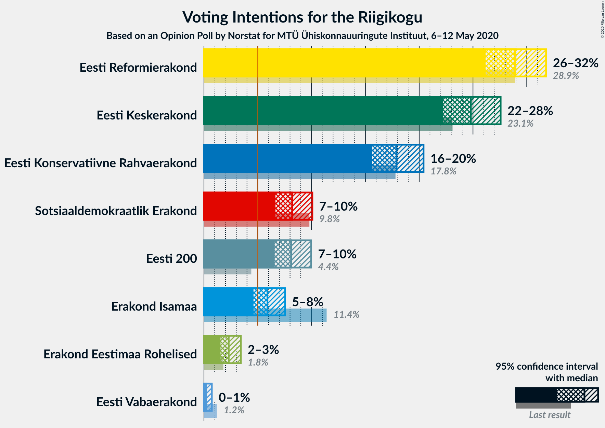

### Confidence Intervals

| Party | Last Result | Poll Result | 80% Confidence Interval | 90% Confidence Interval | 95% Confidence Interval | 99% Confidence Interval |
|:-----:|:-----------:|:-----------:|:-----------------------:|:-----------------------:|:-----------------------:|:-----------------------:|
| Eesti Reformierakond | 28.9% | 28.9% | 27.1–30.8% |26.6–31.3% |26.2–31.8% |25.3–32.7% |
| Eesti Keskerakond | 23.1% | 24.8% | 23.1–26.6% |22.6–27.1% |22.2–27.6% |21.4–28.5% |
| Eesti Konservatiivne Rahvaerakond | 17.8% | 17.9% | 16.4–19.5% |16.0–20.0% |15.6–20.4% |15.0–21.2% |
| Sotsiaaldemokraatlik Erakond | 9.8% | 8.2% | 7.2–9.4% |6.9–9.8% |6.6–10.1% |6.2–10.7% |
| Eesti 200 | 4.4% | 8.1% | 7.1–9.3% |6.8–9.7% |6.6–10.0% |6.1–10.6% |
| Erakond Isamaa | 11.4% | 5.9% | 5.0–7.0% |4.8–7.3% |4.6–7.5% |4.2–8.1% |
| Erakond Eestimaa Rohelised | 1.8% | 2.3% | 1.8–3.0% |1.6–3.2% |1.5–3.4% |1.3–3.8% |
| Eesti Vabaerakond | 1.2% | 0.2% | 0.1–0.5% |0.1–0.6% |0.1–0.7% |0.0–0.9% |

*Note:* The poll result column reflects the actual value used in the calculations. Published results may vary slightly, and in addition be rounded to fewer digits.

## Seats

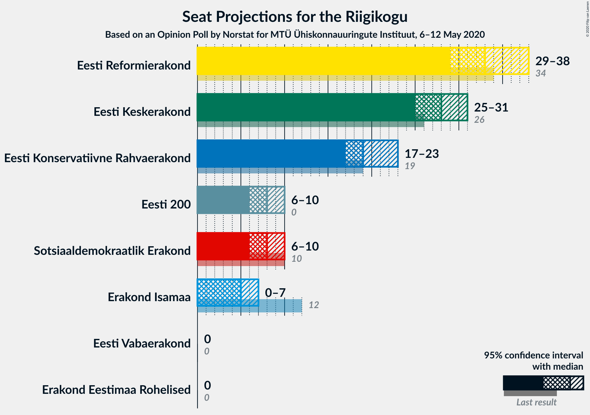

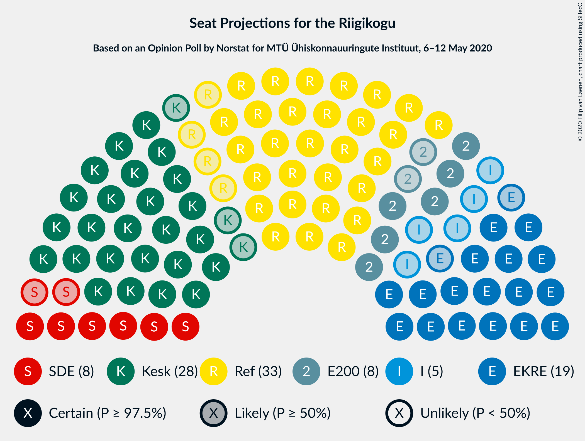

### Confidence Intervals

| Party | Last Result | Median | 80% Confidence Interval | 90% Confidence Interval | 95% Confidence Interval | 99% Confidence Interval |
|:-----:|:-----------:|:------:|:-----------------------:|:-----------------------:|:-----------------------:|:-----------------------:|
| <a href="#eesti-reformierakond">Eesti Reformierakond</a> | 34 | 33 | 31–35 |30–37 |29–38 |28–40 |
| <a href="#eesti-keskerakond">Eesti Keskerakond</a> | 26 | 28 | 26–30 |25–31 |25–31 |24–32 |
| <a href="#eesti-konservatiivne-rahvaerakond">Eesti Konservatiivne Rahvaerakond</a> | 19 | 19 | 18–21 |17–22 |17–23 |15–24 |
| <a href="#sotsiaaldemokraatlik-erakond">Sotsiaaldemokraatlik Erakond</a> | 10 | 8 | 7–9 |6–9 |6–10 |6–10 |
| <a href="#eesti-200">Eesti 200</a> | 0 | 8 | 7–9 |6–9 |6–10 |6–11 |
| <a href="#erakond-isamaa">Erakond Isamaa</a> | 12 | 5 | 4–6 |0–7 |0–7 |0–8 |
| <a href="#erakond-eestimaa-rohelised">Erakond Eestimaa Rohelised</a> | 0 | 0 | 0 |0 |0 |0 |
| <a href="#eesti-vabaerakond">Eesti Vabaerakond</a> | 0 | 0 | 0 |0 |0 |0 |

### Eesti Reformierakond

*For a full overview of the results for this party, see the [Eesti Reformierakond](party-eestireformierakond.html) page.*

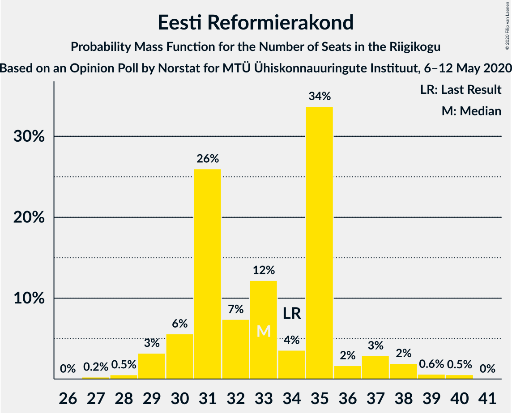

| Number of Seats | Probability | Accumulated | Special Marks |
|:---------------:|:-----------:|:-----------:|:-------------:|
| 27 | 0.2% | 100% |  |
| 28 | 0.5% | 99.7% |  |
| 29 | 3% | 99.2% |  |
| 30 | 6% | 96% |  |
| 31 | 26% | 90% |  |
| 32 | 7% | 64% |  |
| 33 | 12% | 57% | Median |
| 34 | 4% | 45% | Last Result |
| 35 | 34% | 41% |  |
| 36 | 2% | 8% |  |
| 37 | 3% | 6% |  |
| 38 | 2% | 3% |  |
| 39 | 0.6% | 1.2% |  |
| 40 | 0.5% | 0.6% |  |
| 41 | 0% | 0% |  |

### Eesti Keskerakond

*For a full overview of the results for this party, see the [Eesti Keskerakond](party-eestikeskerakond.html) page.*

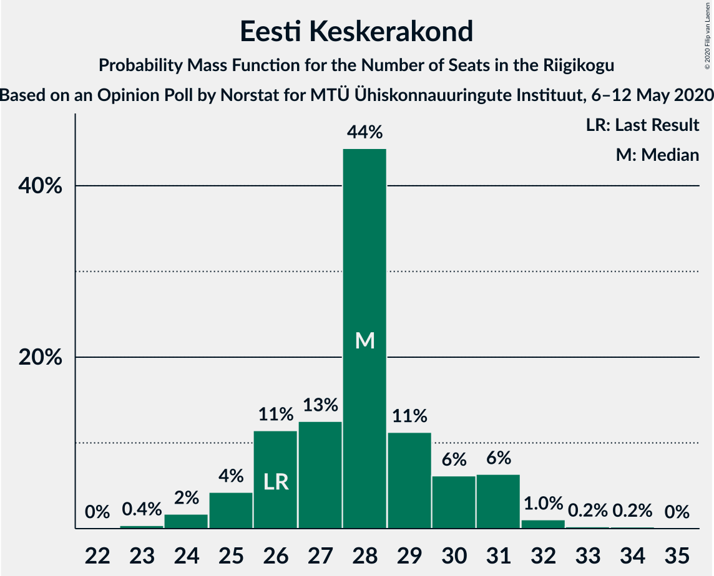

| Number of Seats | Probability | Accumulated | Special Marks |
|:---------------:|:-----------:|:-----------:|:-------------:|
| 22 | 0% | 100% |  |
| 23 | 0.4% | 99.9% |  |
| 24 | 2% | 99.6% |  |
| 25 | 4% | 98% |  |
| 26 | 11% | 94% | Last Result |
| 27 | 13% | 82% |  |
| 28 | 44% | 70% | Median |
| 29 | 11% | 25% |  |
| 30 | 6% | 14% |  |
| 31 | 6% | 8% |  |
| 32 | 1.0% | 2% |  |
| 33 | 0.2% | 0.5% |  |
| 34 | 0.2% | 0.2% |  |
| 35 | 0% | 0% |  |

### Eesti Konservatiivne Rahvaerakond

*For a full overview of the results for this party, see the [Eesti Konservatiivne Rahvaerakond](party-eestikonservatiivnerahvaerakond.html) page.*

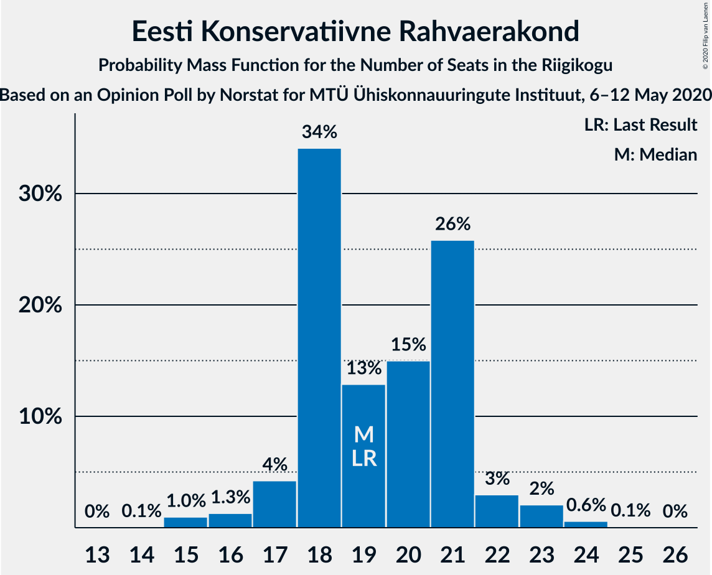

| Number of Seats | Probability | Accumulated | Special Marks |
|:---------------:|:-----------:|:-----------:|:-------------:|
| 14 | 0.1% | 100% |  |
| 15 | 1.0% | 99.9% |  |
| 16 | 1.3% | 99.0% |  |
| 17 | 4% | 98% |  |
| 18 | 34% | 93% |  |
| 19 | 13% | 59% | Last Result, Median |
| 20 | 15% | 47% |  |
| 21 | 26% | 32% |  |
| 22 | 3% | 6% |  |
| 23 | 2% | 3% |  |
| 24 | 0.6% | 0.7% |  |
| 25 | 0.1% | 0.1% |  |
| 26 | 0% | 0% |  |

### Sotsiaaldemokraatlik Erakond

*For a full overview of the results for this party, see the [Sotsiaaldemokraatlik Erakond](party-sotsiaaldemokraatlikerakond.html) page.*

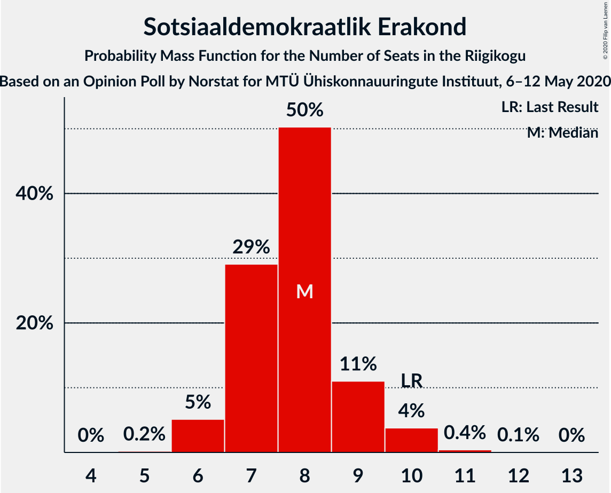

| Number of Seats | Probability | Accumulated | Special Marks |
|:---------------:|:-----------:|:-----------:|:-------------:|
| 5 | 0.2% | 100% |  |
| 6 | 5% | 99.8% |  |
| 7 | 29% | 95% |  |
| 8 | 50% | 66% | Median |
| 9 | 11% | 15% |  |
| 10 | 4% | 4% | Last Result |
| 11 | 0.4% | 0.5% |  |
| 12 | 0.1% | 0.1% |  |
| 13 | 0% | 0% |  |

### Eesti 200

*For a full overview of the results for this party, see the [Eesti 200](party-eesti200.html) page.*

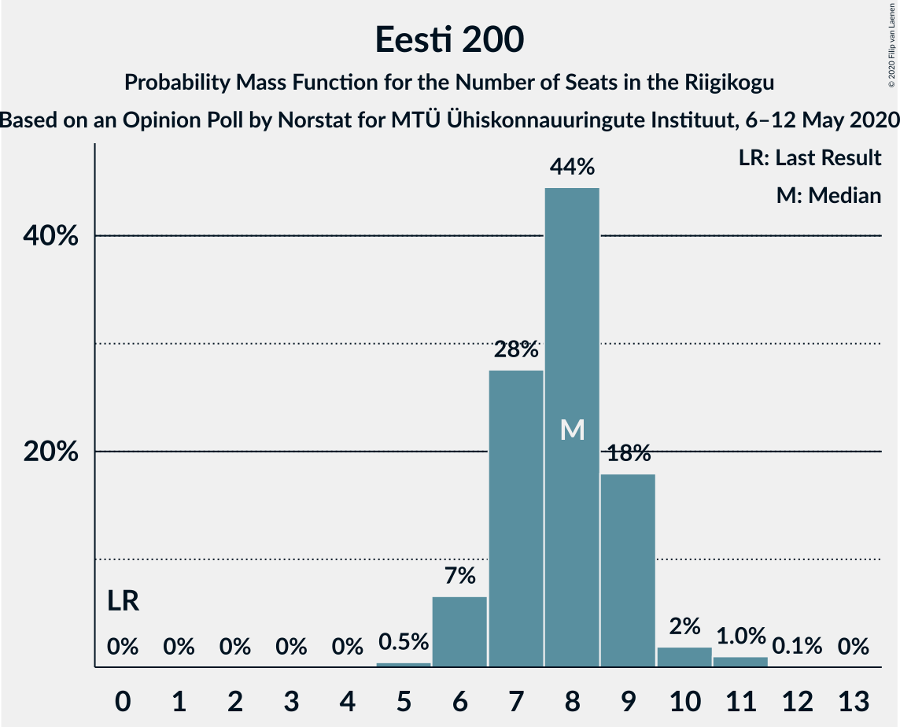

| Number of Seats | Probability | Accumulated | Special Marks |
|:---------------:|:-----------:|:-----------:|:-------------:|
| 0 | 0% | 100% | Last Result |
| 1 | 0% | 100% |  |
| 2 | 0% | 100% |  |
| 3 | 0% | 100% |  |
| 4 | 0% | 100% |  |
| 5 | 0.5% | 100% |  |
| 6 | 7% | 99.5% |  |
| 7 | 28% | 93% |  |
| 8 | 44% | 65% | Median |
| 9 | 18% | 21% |  |
| 10 | 2% | 3% |  |
| 11 | 1.0% | 1.1% |  |
| 12 | 0.1% | 0.1% |  |
| 13 | 0% | 0% |  |

### Erakond Isamaa

*For a full overview of the results for this party, see the [Erakond Isamaa](party-erakondisamaa.html) page.*

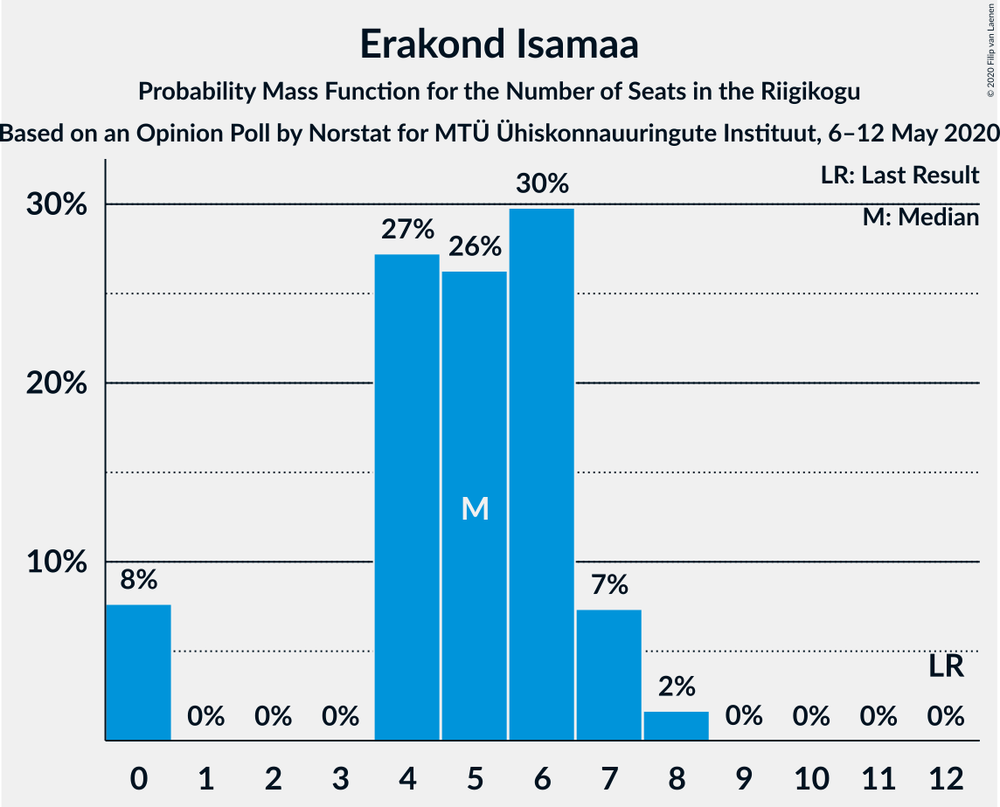

| Number of Seats | Probability | Accumulated | Special Marks |
|:---------------:|:-----------:|:-----------:|:-------------:|
| 0 | 8% | 100% |  |
| 1 | 0% | 92% |  |
| 2 | 0% | 92% |  |
| 3 | 0% | 92% |  |
| 4 | 27% | 92% |  |
| 5 | 26% | 65% | Median |
| 6 | 30% | 39% |  |
| 7 | 7% | 9% |  |
| 8 | 2% | 2% |  |
| 9 | 0% | 0% |  |
| 10 | 0% | 0% |  |
| 11 | 0% | 0% |  |
| 12 | 0% | 0% | Last Result |

### Erakond Eestimaa Rohelised

*For a full overview of the results for this party, see the [Erakond Eestimaa Rohelised](party-erakondeestimaarohelised.html) page.*

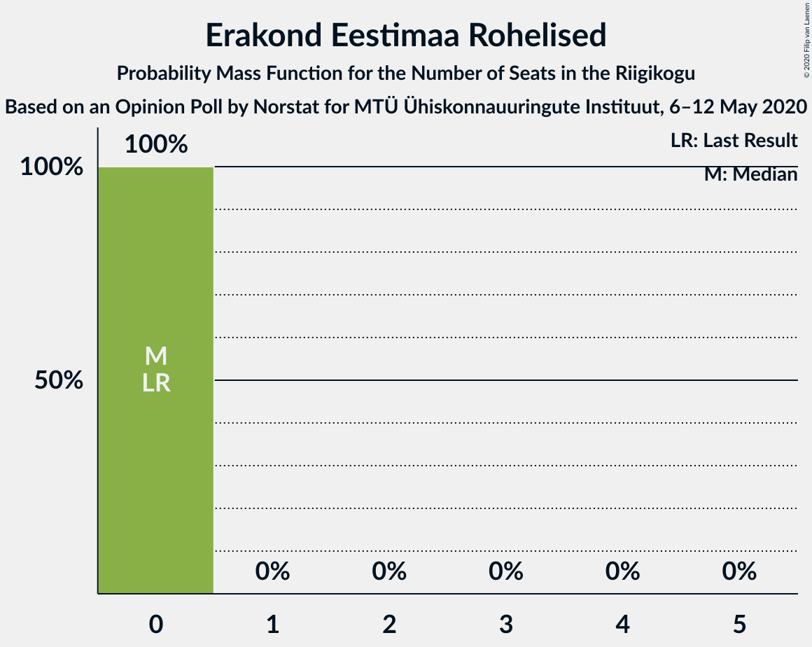

| Number of Seats | Probability | Accumulated | Special Marks |
|:---------------:|:-----------:|:-----------:|:-------------:|
| 0 | 100% | 100% | Last Result, Median |

### Eesti Vabaerakond

*For a full overview of the results for this party, see the [Eesti Vabaerakond](party-eestivabaerakond.html) page.*

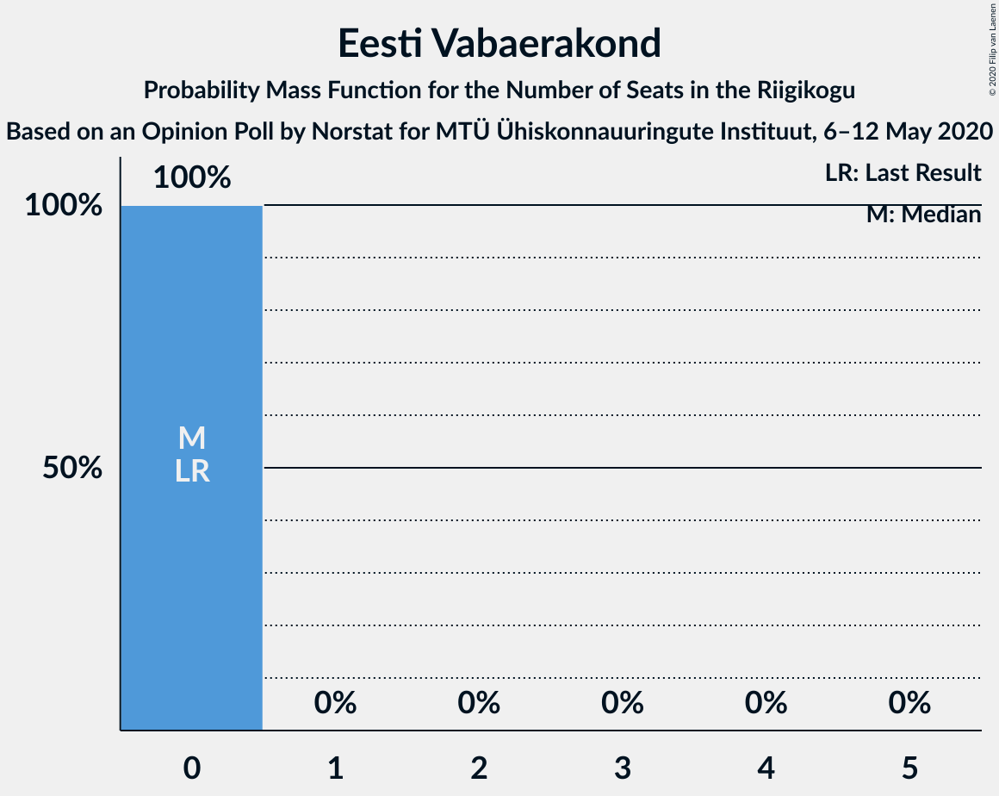

| Number of Seats | Probability | Accumulated | Special Marks |
|:---------------:|:-----------:|:-----------:|:-------------:|
| 0 | 100% | 100% | Last Result, Median |

## Coalitions

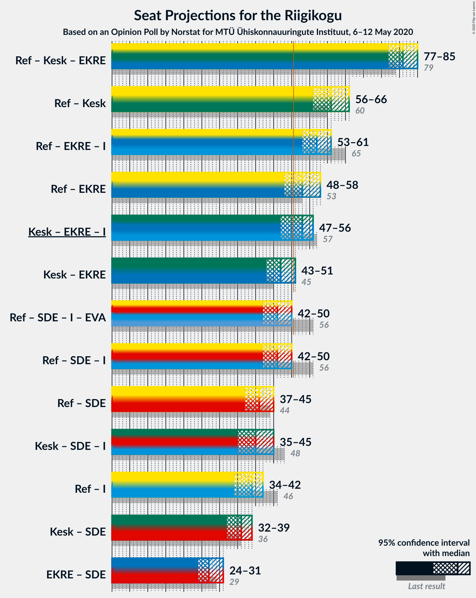

### Confidence Intervals

| Coalition | Last Result | Median | Majority? | 80% Confidence Interval | 90% Confidence Interval | 95% Confidence Interval | 99% Confidence Interval |
|:---------:|:-----------:|:------:|:---------:|:-----------------------:|:-----------------------:|:-----------------------:|:-----------------------:|
| Eesti Reformierakond – Eesti Keskerakond – Eesti Konservatiivne Rahvaerakond | 79 | 81 | 100% | 78–82 | 77–83 | 77–85 | 75–86 |
| Eesti Reformierakond – Eesti Keskerakond | 60 | 61 | 100% | 58–63 | 57–65 | 56–66 | 55–68 |
| Eesti Reformierakond – Eesti Konservatiivne Rahvaerakond – Erakond Isamaa | 65 | 57 | 99.9% | 55–60 | 54–60 | 53–61 | 52–63 |
| Eesti Reformierakond – Eesti Konservatiivne Rahvaerakond | 53 | 53 | 84% | 50–54 | 49–56 | 48–58 | 47–59 |
| Eesti Keskerakond – Eesti Konservatiivne Rahvaerakond – Erakond Isamaa | 57 | 53 | 61% | 49–55 | 48–56 | 47–56 | 45–57 |
| Eesti Keskerakond – Eesti Konservatiivne Rahvaerakond | 45 | 47 | 4% | 45–50 | 44–50 | 43–51 | 42–52 |
| Eesti Reformierakond – Sotsiaaldemokraatlik Erakond – Erakond Isamaa – Eesti Vabaerakond | 56 | 46 | 2% | 43–48 | 43–49 | 42–50 | 41–52 |
| Eesti Reformierakond – Sotsiaaldemokraatlik Erakond – Erakond Isamaa | 56 | 46 | 2% | 43–48 | 43–49 | 42–50 | 41–52 |
| Eesti Reformierakond – Sotsiaaldemokraatlik Erakond | 44 | 41 | 0% | 38–43 | 37–45 | 37–45 | 35–48 |
| Eesti Keskerakond – Sotsiaaldemokraatlik Erakond – Erakond Isamaa | 48 | 40 | 0% | 39–43 | 37–45 | 35–45 | 34–46 |
| Eesti Reformierakond – Erakond Isamaa | 46 | 39 | 0% | 35–40 | 35–41 | 34–42 | 32–44 |
| Eesti Keskerakond – Sotsiaaldemokraatlik Erakond | 36 | 36 | 0% | 34–38 | 33–39 | 32–39 | 31–41 |
| Eesti Konservatiivne Rahvaerakond – Sotsiaaldemokraatlik Erakond | 29 | 27 | 0% | 26–29 | 25–30 | 24–31 | 23–32 |

### Eesti Reformierakond – Eesti Keskerakond – Eesti Konservatiivne Rahvaerakond

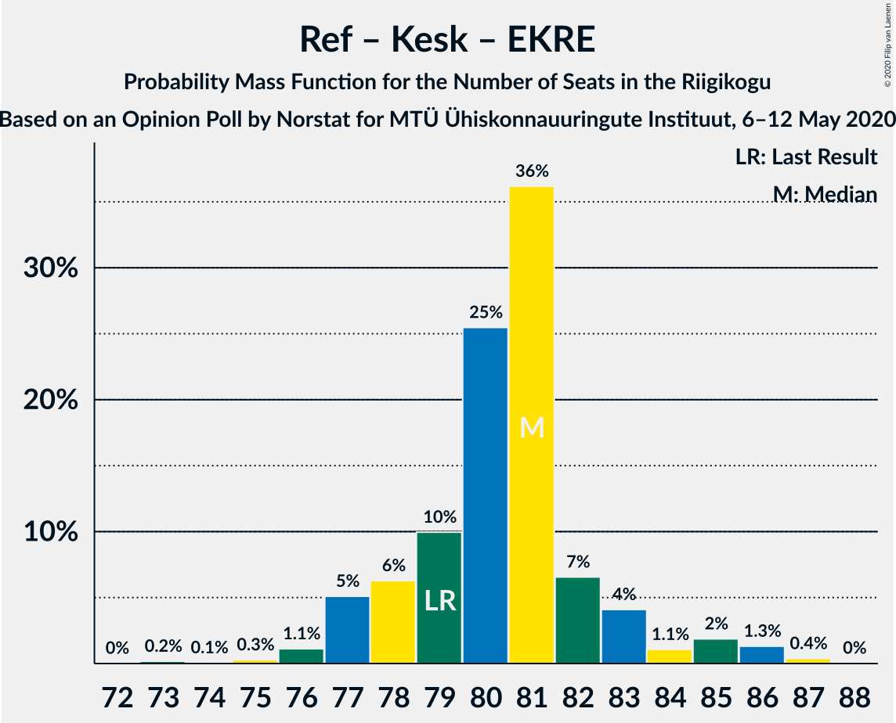

| Number of Seats | Probability | Accumulated | Special Marks |
|:---------------:|:-----------:|:-----------:|:-------------:|
| 73 | 0.2% | 100% |  |
| 74 | 0.1% | 99.8% |  |
| 75 | 0.3% | 99.7% |  |
| 76 | 1.1% | 99.5% |  |
| 77 | 5% | 98% |  |
| 78 | 6% | 93% |  |
| 79 | 10% | 87% | Last Result |
| 80 | 25% | 77% | Median |
| 81 | 36% | 52% |  |
| 82 | 7% | 15% |  |
| 83 | 4% | 9% |  |
| 84 | 1.1% | 5% |  |
| 85 | 2% | 4% |  |
| 86 | 1.3% | 2% |  |
| 87 | 0.4% | 0.4% |  |
| 88 | 0% | 0% |  |

### Eesti Reformierakond – Eesti Keskerakond

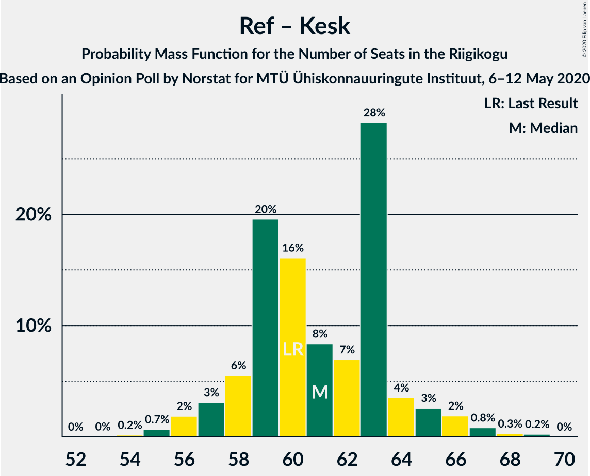

| Number of Seats | Probability | Accumulated | Special Marks |
|:---------------:|:-----------:|:-----------:|:-------------:|
| 54 | 0.2% | 100% |  |
| 55 | 0.7% | 99.8% |  |
| 56 | 2% | 99.1% |  |
| 57 | 3% | 97% |  |
| 58 | 6% | 94% |  |
| 59 | 20% | 89% |  |
| 60 | 16% | 69% | Last Result |
| 61 | 8% | 53% | Median |
| 62 | 7% | 45% |  |
| 63 | 28% | 38% |  |
| 64 | 4% | 9% |  |
| 65 | 3% | 6% |  |
| 66 | 2% | 3% |  |
| 67 | 0.8% | 1.4% |  |
| 68 | 0.3% | 0.5% |  |
| 69 | 0.2% | 0.3% |  |
| 70 | 0% | 0% |  |

### Eesti Reformierakond – Eesti Konservatiivne Rahvaerakond – Erakond Isamaa

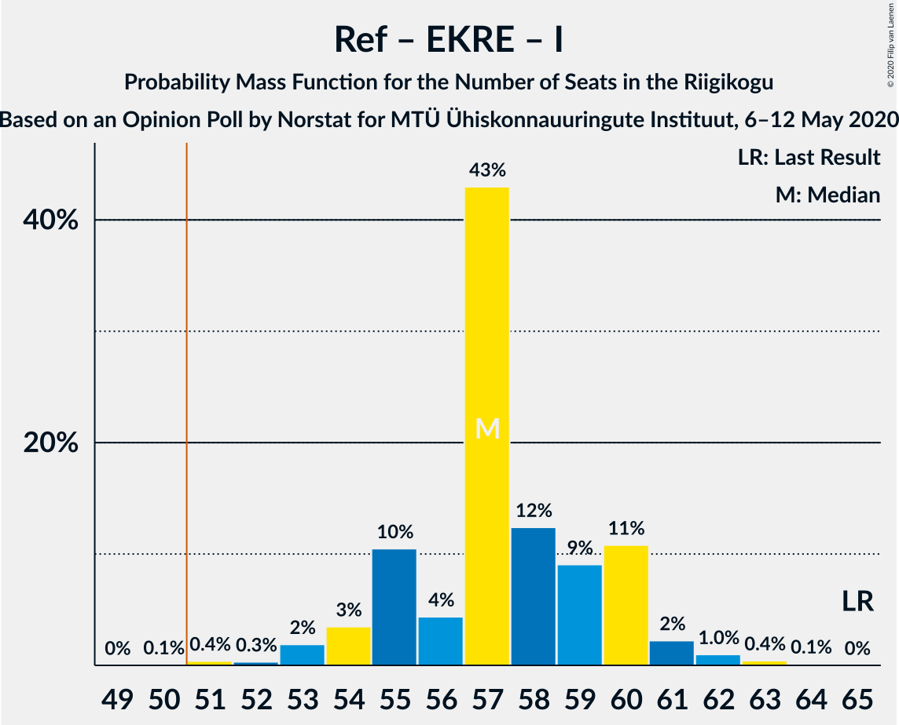

| Number of Seats | Probability | Accumulated | Special Marks |
|:---------------:|:-----------:|:-----------:|:-------------:|
| 50 | 0.1% | 100% |  |
| 51 | 0.4% | 99.9% | Majority |
| 52 | 0.3% | 99.5% |  |
| 53 | 2% | 99.2% |  |
| 54 | 3% | 97% |  |
| 55 | 10% | 94% |  |
| 56 | 4% | 83% |  |
| 57 | 43% | 79% | Median |
| 58 | 12% | 36% |  |
| 59 | 9% | 24% |  |
| 60 | 11% | 15% |  |
| 61 | 2% | 4% |  |
| 62 | 1.0% | 2% |  |
| 63 | 0.4% | 0.6% |  |
| 64 | 0.1% | 0.2% |  |
| 65 | 0% | 0% | Last Result |

### Eesti Reformierakond – Eesti Konservatiivne Rahvaerakond

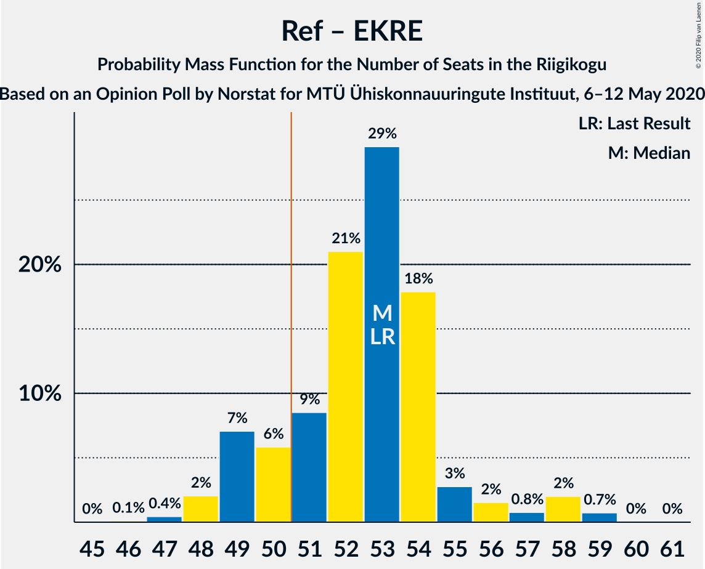

| Number of Seats | Probability | Accumulated | Special Marks |
|:---------------:|:-----------:|:-----------:|:-------------:|
| 46 | 0.1% | 100% |  |
| 47 | 0.4% | 99.9% |  |
| 48 | 2% | 99.4% |  |
| 49 | 7% | 97% |  |
| 50 | 6% | 90% |  |
| 51 | 9% | 84% | Majority |
| 52 | 21% | 76% | Median |
| 53 | 29% | 55% | Last Result |
| 54 | 18% | 26% |  |
| 55 | 3% | 8% |  |
| 56 | 2% | 5% |  |
| 57 | 0.8% | 4% |  |
| 58 | 2% | 3% |  |
| 59 | 0.7% | 0.8% |  |
| 60 | 0% | 0.1% |  |
| 61 | 0% | 0% |  |

### Eesti Keskerakond – Eesti Konservatiivne Rahvaerakond – Erakond Isamaa

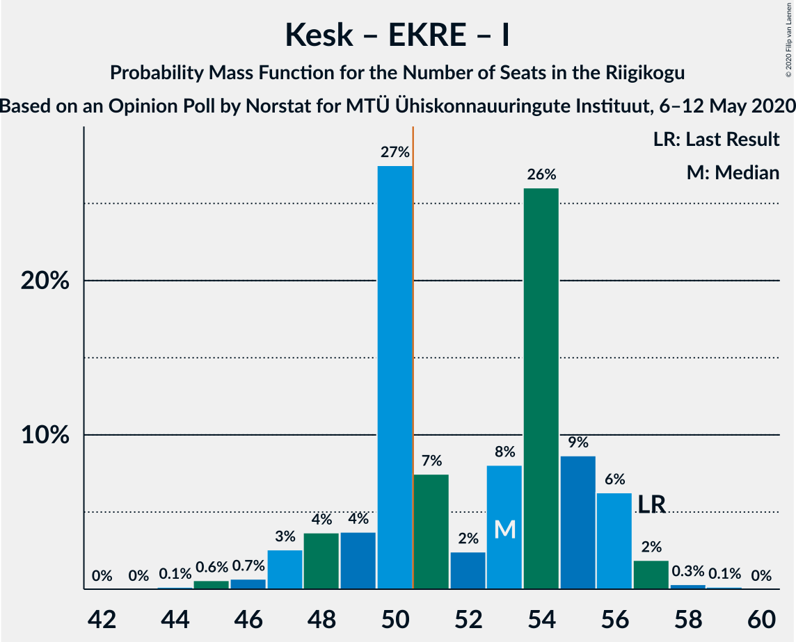

| Number of Seats | Probability | Accumulated | Special Marks |
|:---------------:|:-----------:|:-----------:|:-------------:|
| 44 | 0.1% | 100% |  |
| 45 | 0.6% | 99.9% |  |
| 46 | 0.7% | 99.3% |  |
| 47 | 3% | 98.6% |  |
| 48 | 4% | 96% |  |
| 49 | 4% | 92% |  |
| 50 | 27% | 89% |  |
| 51 | 7% | 61% | Majority |
| 52 | 2% | 54% | Median |
| 53 | 8% | 51% |  |
| 54 | 26% | 43% |  |
| 55 | 9% | 17% |  |
| 56 | 6% | 9% |  |
| 57 | 2% | 2% | Last Result |
| 58 | 0.3% | 0.5% |  |
| 59 | 0.1% | 0.2% |  |
| 60 | 0% | 0% |  |

### Eesti Keskerakond – Eesti Konservatiivne Rahvaerakond

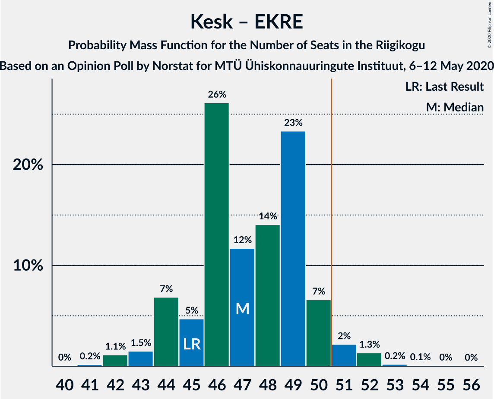

| Number of Seats | Probability | Accumulated | Special Marks |
|:---------------:|:-----------:|:-----------:|:-------------:|
| 40 | 0% | 100% |  |
| 41 | 0.2% | 99.9% |  |
| 42 | 1.1% | 99.8% |  |
| 43 | 1.5% | 98.7% |  |
| 44 | 7% | 97% |  |
| 45 | 5% | 90% | Last Result |
| 46 | 26% | 86% |  |
| 47 | 12% | 60% | Median |
| 48 | 14% | 48% |  |
| 49 | 23% | 34% |  |
| 50 | 7% | 10% |  |
| 51 | 2% | 4% | Majority |
| 52 | 1.3% | 2% |  |
| 53 | 0.2% | 0.3% |  |
| 54 | 0.1% | 0.2% |  |
| 55 | 0% | 0.1% |  |
| 56 | 0% | 0% |  |

### Eesti Reformierakond – Sotsiaaldemokraatlik Erakond – Erakond Isamaa – Eesti Vabaerakond

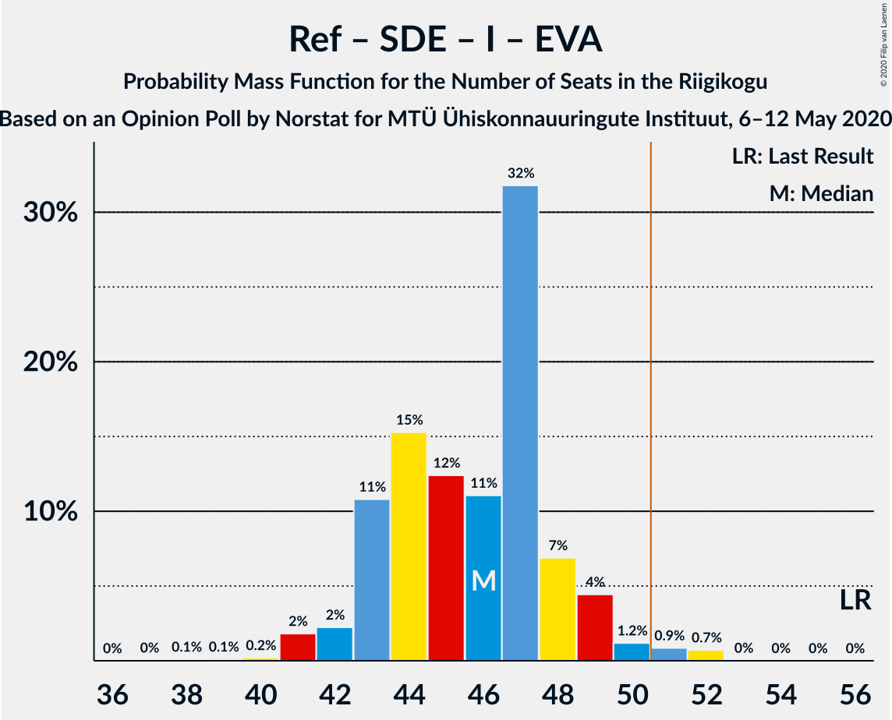

| Number of Seats | Probability | Accumulated | Special Marks |
|:---------------:|:-----------:|:-----------:|:-------------:|
| 38 | 0.1% | 100% |  |
| 39 | 0.1% | 99.9% |  |
| 40 | 0.2% | 99.7% |  |
| 41 | 2% | 99.5% |  |
| 42 | 2% | 98% |  |
| 43 | 11% | 95% |  |
| 44 | 15% | 85% |  |
| 45 | 12% | 69% |  |
| 46 | 11% | 57% | Median |
| 47 | 32% | 46% |  |
| 48 | 7% | 14% |  |
| 49 | 4% | 7% |  |
| 50 | 1.2% | 3% |  |
| 51 | 0.9% | 2% | Majority |
| 52 | 0.7% | 0.8% |  |
| 53 | 0% | 0% |  |
| 54 | 0% | 0% |  |
| 55 | 0% | 0% |  |
| 56 | 0% | 0% | Last Result |

### Eesti Reformierakond – Sotsiaaldemokraatlik Erakond – Erakond Isamaa

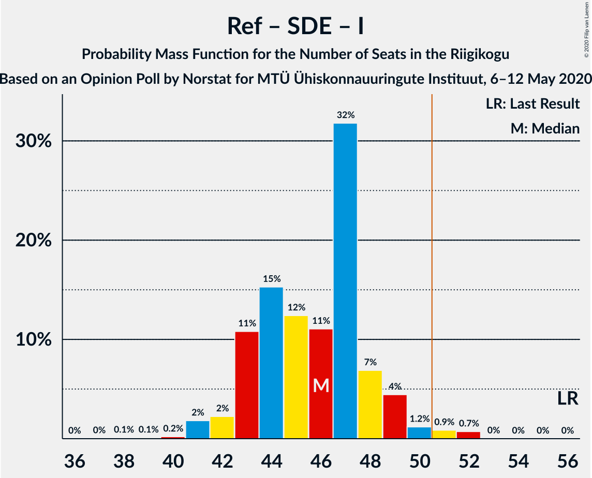

| Number of Seats | Probability | Accumulated | Special Marks |
|:---------------:|:-----------:|:-----------:|:-------------:|
| 38 | 0.1% | 100% |  |
| 39 | 0.1% | 99.9% |  |
| 40 | 0.2% | 99.7% |  |
| 41 | 2% | 99.5% |  |
| 42 | 2% | 98% |  |
| 43 | 11% | 95% |  |
| 44 | 15% | 85% |  |
| 45 | 12% | 69% |  |
| 46 | 11% | 57% | Median |
| 47 | 32% | 46% |  |
| 48 | 7% | 14% |  |
| 49 | 4% | 7% |  |
| 50 | 1.2% | 3% |  |
| 51 | 0.9% | 2% | Majority |
| 52 | 0.7% | 0.8% |  |
| 53 | 0% | 0% |  |
| 54 | 0% | 0% |  |
| 55 | 0% | 0% |  |
| 56 | 0% | 0% | Last Result |

### Eesti Reformierakond – Sotsiaaldemokraatlik Erakond

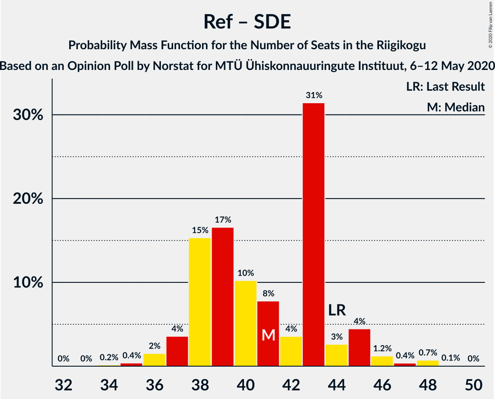

| Number of Seats | Probability | Accumulated | Special Marks |
|:---------------:|:-----------:|:-----------:|:-------------:|
| 34 | 0.2% | 100% |  |
| 35 | 0.4% | 99.8% |  |
| 36 | 2% | 99.5% |  |
| 37 | 4% | 98% |  |
| 38 | 15% | 94% |  |
| 39 | 17% | 79% |  |
| 40 | 10% | 62% |  |
| 41 | 8% | 52% | Median |
| 42 | 4% | 44% |  |
| 43 | 31% | 41% |  |
| 44 | 3% | 9% | Last Result |
| 45 | 4% | 7% |  |
| 46 | 1.2% | 2% |  |
| 47 | 0.4% | 1.2% |  |
| 48 | 0.7% | 0.8% |  |
| 49 | 0.1% | 0.1% |  |
| 50 | 0% | 0% |  |

### Eesti Keskerakond – Sotsiaaldemokraatlik Erakond – Erakond Isamaa

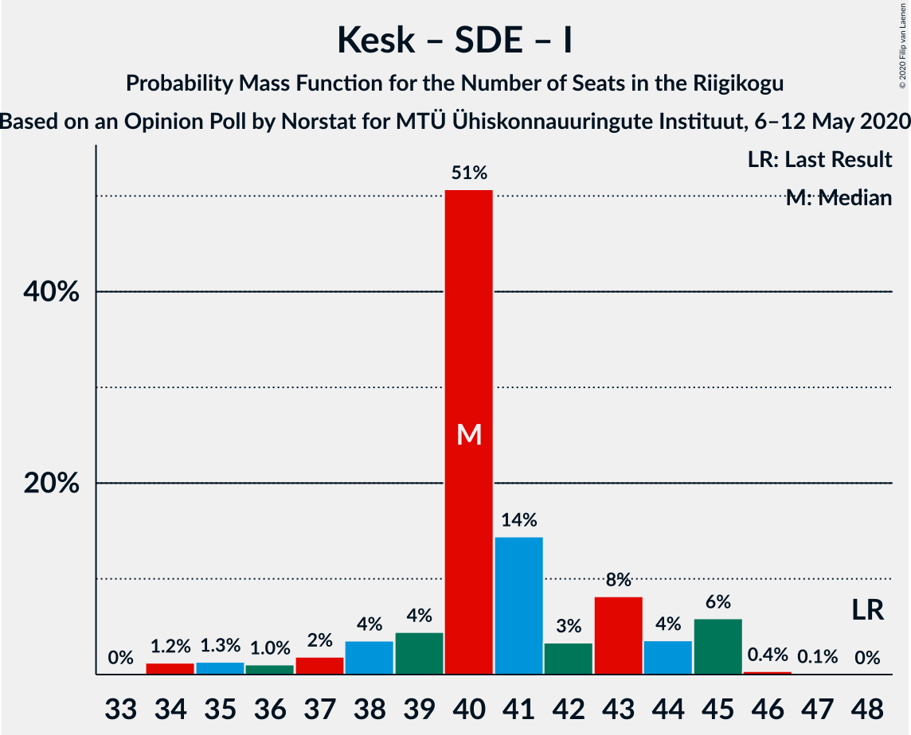

| Number of Seats | Probability | Accumulated | Special Marks |
|:---------------:|:-----------:|:-----------:|:-------------:|
| 33 | 0% | 100% |  |
| 34 | 1.2% | 99.9% |  |
| 35 | 1.3% | 98.7% |  |
| 36 | 1.0% | 97% |  |
| 37 | 2% | 96% |  |
| 38 | 4% | 94% |  |
| 39 | 4% | 91% |  |
| 40 | 51% | 87% |  |
| 41 | 14% | 36% | Median |
| 42 | 3% | 21% |  |
| 43 | 8% | 18% |  |
| 44 | 4% | 10% |  |
| 45 | 6% | 6% |  |
| 46 | 0.4% | 0.5% |  |
| 47 | 0.1% | 0.2% |  |
| 48 | 0% | 0% | Last Result |

### Eesti Reformierakond – Erakond Isamaa

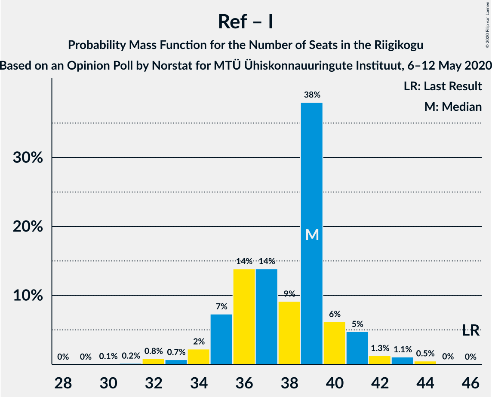

| Number of Seats | Probability | Accumulated | Special Marks |
|:---------------:|:-----------:|:-----------:|:-------------:|
| 30 | 0.1% | 100% |  |
| 31 | 0.2% | 99.9% |  |
| 32 | 0.8% | 99.7% |  |
| 33 | 0.7% | 98.9% |  |
| 34 | 2% | 98% |  |
| 35 | 7% | 96% |  |
| 36 | 14% | 89% |  |
| 37 | 14% | 75% |  |
| 38 | 9% | 61% | Median |
| 39 | 38% | 52% |  |
| 40 | 6% | 14% |  |
| 41 | 5% | 8% |  |
| 42 | 1.3% | 3% |  |
| 43 | 1.1% | 2% |  |
| 44 | 0.5% | 0.5% |  |
| 45 | 0% | 0.1% |  |
| 46 | 0% | 0% | Last Result |

### Eesti Keskerakond – Sotsiaaldemokraatlik Erakond

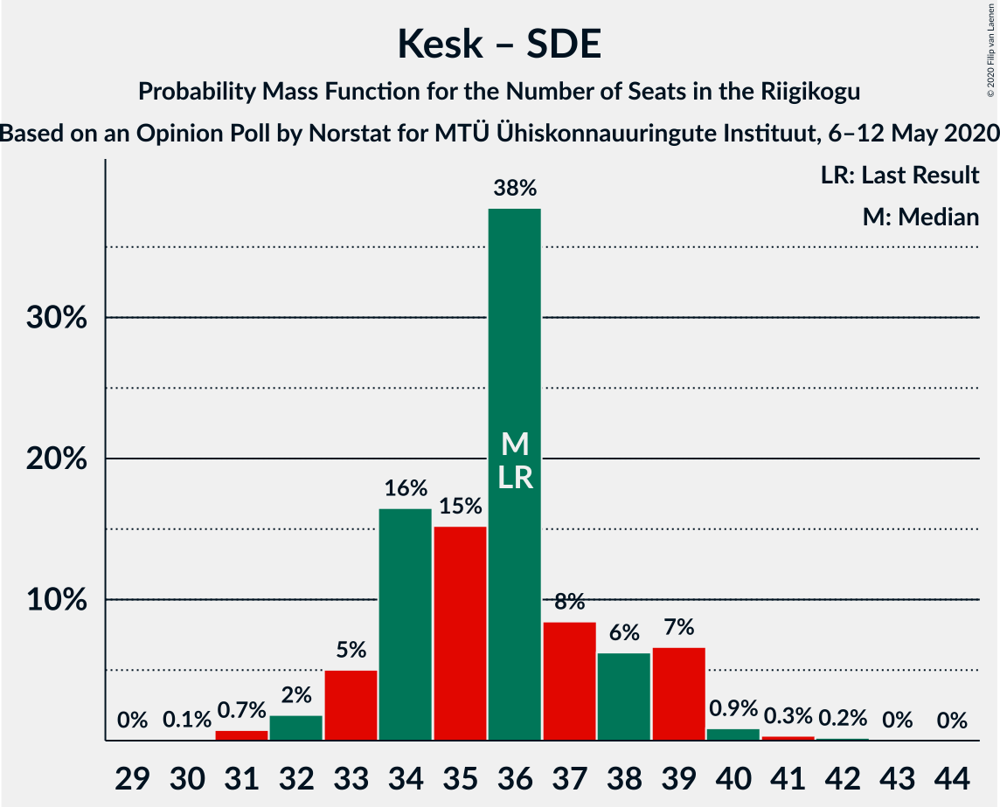

| Number of Seats | Probability | Accumulated | Special Marks |
|:---------------:|:-----------:|:-----------:|:-------------:|
| 30 | 0.1% | 100% |  |
| 31 | 0.7% | 99.9% |  |
| 32 | 2% | 99.1% |  |
| 33 | 5% | 97% |  |
| 34 | 16% | 92% |  |
| 35 | 15% | 76% |  |
| 36 | 38% | 61% | Last Result, Median |
| 37 | 8% | 23% |  |
| 38 | 6% | 14% |  |
| 39 | 7% | 8% |  |
| 40 | 0.9% | 1.5% |  |
| 41 | 0.3% | 0.6% |  |
| 42 | 0.2% | 0.3% |  |
| 43 | 0% | 0.1% |  |
| 44 | 0% | 0% |  |

### Eesti Konservatiivne Rahvaerakond – Sotsiaaldemokraatlik Erakond

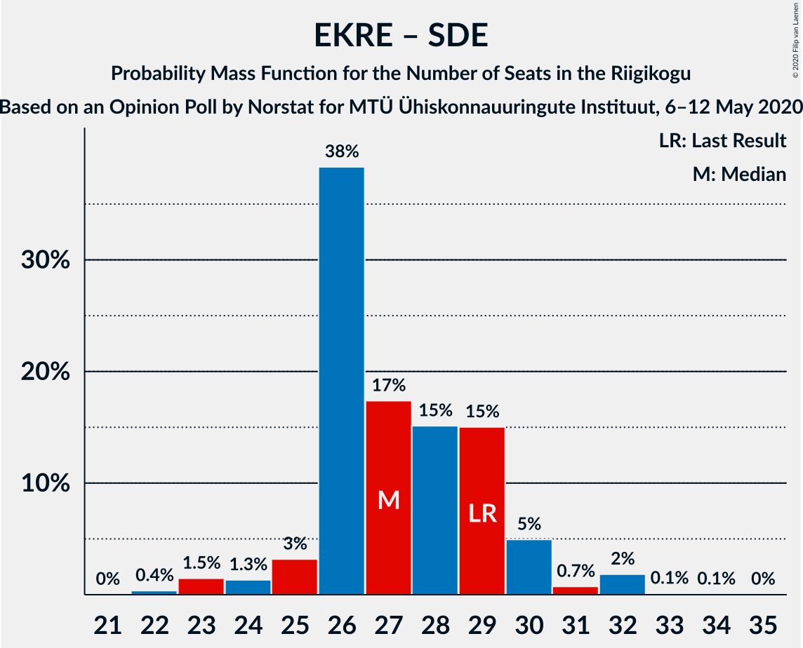

| Number of Seats | Probability | Accumulated | Special Marks |
|:---------------:|:-----------:|:-----------:|:-------------:|
| 22 | 0.4% | 100% |  |
| 23 | 1.5% | 99.6% |  |
| 24 | 1.3% | 98% |  |
| 25 | 3% | 97% |  |
| 26 | 38% | 94% |  |
| 27 | 17% | 55% | Median |
| 28 | 15% | 38% |  |
| 29 | 15% | 23% | Last Result |
| 30 | 5% | 8% |  |
| 31 | 0.7% | 3% |  |
| 32 | 2% | 2% |  |
| 33 | 0.1% | 0.2% |  |
| 34 | 0.1% | 0.1% |  |
| 35 | 0% | 0% |  |

## Technical Information

### Opinion Poll

+ **Polling firm:** Norstat
+ **Commissioner(s):** MTÜ Ühiskonnauuringute Instituut
+ **Fieldwork period:** 6–12 May 2020

### Calculations

+ **Sample size:** 1000
+ **Simulations done:** 131,072
+ **Error estimate:** 1.66%

