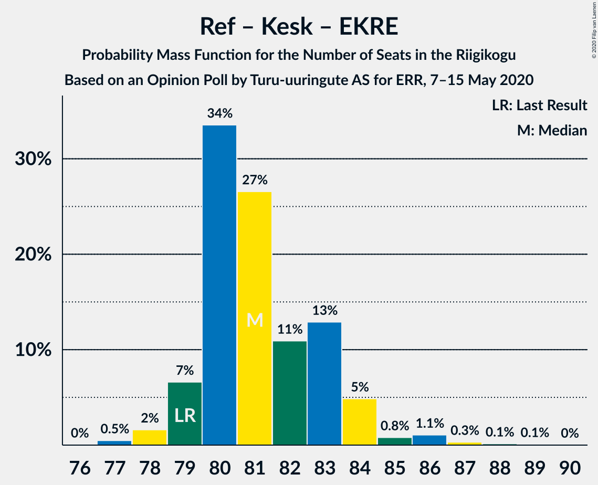
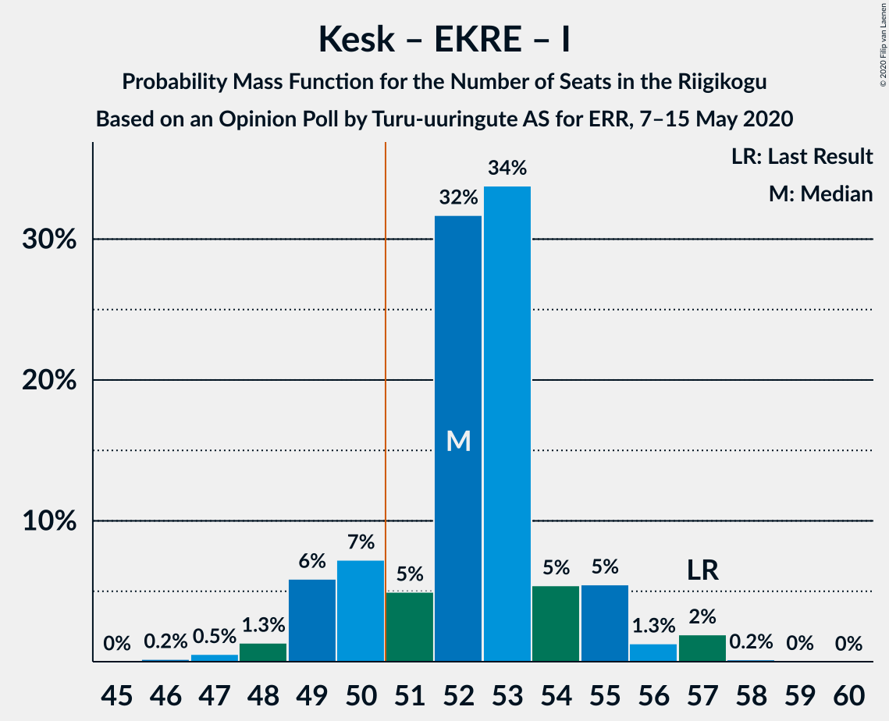

# Opinion Poll by Turu-uuringute AS for ERR, 7–15 May 2020

<a href="#voting-intentions">Voting Intentions</a> | <a href="#seats">Seats</a> | <a href="#coalitions">Coalitions</a> | <a href="#technical-information">Technical Information</a>

## Voting Intentions

### Confidence Intervals

| Party | Last Result | Poll Result | 80% Confidence Interval | 90% Confidence Interval | 95% Confidence Interval | 99% Confidence Interval |
|:-----:|:-----------:|:-----------:|:-----------------------:|:-----------------------:|:-----------------------:|:-----------------------:|
| Eesti Reformierakond | 28.9% | 31.2% | 29.3–33.1% |28.8–33.6% |28.4–34.1% |27.5–35.0% |
| Eesti Keskerakond | 23.1% | 28.1% | 26.3–30.0% |25.8–30.5% |25.4–31.0% |24.6–31.9% |
| Eesti Konservatiivne Rahvaerakond | 17.8% | 15.5% | 14.1–17.1% |13.8–17.5% |13.4–17.9% |12.8–18.7% |
| Eesti 200 | 4.4% | 8.3% | 7.2–9.5% |7.0–9.8% |6.7–10.1% |6.2–10.8% |
| Sotsiaaldemokraatlik Erakond | 9.8% | 7.3% | 6.3–8.4% |6.1–8.8% |5.8–9.1% |5.4–9.6% |
| Erakond Isamaa | 11.4% | 6.3% | 5.4–7.4% |5.1–7.7% |4.9–8.0% |4.5–8.5% |
| Erakond Eestimaa Rohelised | 1.8% | 2.1% | 1.6–2.8% |1.5–3.0% |1.4–3.2% |1.2–3.6% |
| Eesti Vabaerakond | 1.2% | 0.3% | 0.2–0.7% |0.1–0.8% |0.1–0.9% |0.1–1.1% |

*Note:* The poll result column reflects the actual value used in the calculations. Published results may vary slightly, and in addition be rounded to fewer digits.

## Seats

### Confidence Intervals

| Party | Last Result | Median | 80% Confidence Interval | 90% Confidence Interval | 95% Confidence Interval | 99% Confidence Interval |
|:-----:|:-----------:|:------:|:-----------------------:|:-----------------------:|:-----------------------:|:-----------------------:|
| <a href="#eesti-reformierakond">Eesti Reformierakond</a> | 34 | 34 | 33–37 |32–38 |31–38 |30–40 |
| <a href="#eesti-keskerakond">Eesti Keskerakond</a> | 26 | 31 | 29–34 |28–34 |28–35 |27–36 |
| <a href="#eesti-konservatiivne-rahvaerakond">Eesti Konservatiivne Rahvaerakond</a> | 19 | 16 | 14–17 |14–18 |13–19 |12–19 |
| <a href="#eesti-200">Eesti 200</a> | 0 | 8 | 6–9 |6–9 |6–10 |6–10 |
| <a href="#sotsiaaldemokraatlik-erakond">Sotsiaaldemokraatlik Erakond</a> | 10 | 6 | 6–8 |5–8 |5–9 |5–9 |
| <a href="#erakond-isamaa">Erakond Isamaa</a> | 12 | 5 | 5–6 |5–7 |4–7 |0–8 |
| <a href="#erakond-eestimaa-rohelised">Erakond Eestimaa Rohelised</a> | 0 | 0 | 0 |0 |0 |0 |
| <a href="#eesti-vabaerakond">Eesti Vabaerakond</a> | 0 | 0 | 0 |0 |0 |0 |

### Eesti Reformierakond

*For a full overview of the results for this party, see the [Eesti Reformierakond](party-eestireformierakond.html) page.*

| Number of Seats | Probability | Accumulated | Special Marks |
|:---------------:|:-----------:|:-----------:|:-------------:|
| 29 | 0.1% | 100% |  |
| 30 | 0.6% | 99.9% |  |
| 31 | 3% | 99.3% |  |
| 32 | 4% | 97% |  |
| 33 | 27% | 92% |  |
| 34 | 32% | 66% | Last Result, Median |
| 35 | 15% | 34% |  |
| 36 | 9% | 20% |  |
| 37 | 4% | 10% |  |
| 38 | 5% | 6% |  |
| 39 | 1.1% | 2% |  |
| 40 | 0.4% | 0.5% |  |
| 41 | 0.1% | 0.1% |  |
| 42 | 0.1% | 0.1% |  |
| 43 | 0% | 0% |  |

### Eesti Keskerakond

*For a full overview of the results for this party, see the [Eesti Keskerakond](party-eestikeskerakond.html) page.*

| Number of Seats | Probability | Accumulated | Special Marks |
|:---------------:|:-----------:|:-----------:|:-------------:|
| 25 | 0.1% | 100% |  |
| 26 | 0.4% | 99.9% | Last Result |
| 27 | 1.2% | 99.5% |  |
| 28 | 4% | 98% |  |
| 29 | 29% | 94% |  |
| 30 | 12% | 66% |  |
| 31 | 14% | 54% | Median |
| 32 | 23% | 40% |  |
| 33 | 3% | 17% |  |
| 34 | 10% | 13% |  |
| 35 | 2% | 3% |  |
| 36 | 0.5% | 0.6% |  |
| 37 | 0% | 0% |  |

### Eesti Konservatiivne Rahvaerakond

*For a full overview of the results for this party, see the [Eesti Konservatiivne Rahvaerakond](party-eestikonservatiivnerahvaerakond.html) page.*

| Number of Seats | Probability | Accumulated | Special Marks |
|:---------------:|:-----------:|:-----------:|:-------------:|
| 12 | 0.8% | 100% |  |
| 13 | 4% | 99.1% |  |
| 14 | 11% | 95% |  |
| 15 | 14% | 85% |  |
| 16 | 33% | 71% | Median |
| 17 | 30% | 37% |  |
| 18 | 3% | 7% |  |
| 19 | 3% | 4% | Last Result |
| 20 | 0.4% | 0.4% |  |
| 21 | 0.1% | 0.1% |  |
| 22 | 0% | 0% |  |

### Eesti 200

*For a full overview of the results for this party, see the [Eesti 200](party-eesti200.html) page.*

| Number of Seats | Probability | Accumulated | Special Marks |
|:---------------:|:-----------:|:-----------:|:-------------:|
| 0 | 0% | 100% | Last Result |
| 1 | 0% | 100% |  |
| 2 | 0% | 100% |  |
| 3 | 0% | 100% |  |
| 4 | 0% | 100% |  |
| 5 | 0.5% | 100% |  |
| 6 | 12% | 99.5% |  |
| 7 | 18% | 88% |  |
| 8 | 39% | 70% | Median |
| 9 | 28% | 31% |  |
| 10 | 3% | 3% |  |
| 11 | 0.3% | 0.3% |  |
| 12 | 0% | 0% |  |

### Sotsiaaldemokraatlik Erakond

*For a full overview of the results for this party, see the [Sotsiaaldemokraatlik Erakond](party-sotsiaaldemokraatlikerakond.html) page.*

| Number of Seats | Probability | Accumulated | Special Marks |
|:---------------:|:-----------:|:-----------:|:-------------:|
| 0 | 0.1% | 100% |  |
| 1 | 0% | 99.9% |  |
| 2 | 0% | 99.9% |  |
| 3 | 0% | 99.9% |  |
| 4 | 0.4% | 99.9% |  |
| 5 | 7% | 99.5% |  |
| 6 | 46% | 92% | Median |
| 7 | 35% | 46% |  |
| 8 | 8% | 11% |  |
| 9 | 3% | 3% |  |
| 10 | 0.2% | 0.2% | Last Result |
| 11 | 0% | 0% |  |

### Erakond Isamaa

*For a full overview of the results for this party, see the [Erakond Isamaa](party-erakondisamaa.html) page.*

| Number of Seats | Probability | Accumulated | Special Marks |
|:---------------:|:-----------:|:-----------:|:-------------:|
| 0 | 2% | 100% |  |
| 1 | 0% | 98% |  |
| 2 | 0% | 98% |  |
| 3 | 0% | 98% |  |
| 4 | 3% | 98% |  |
| 5 | 46% | 95% | Median |
| 6 | 40% | 50% |  |
| 7 | 8% | 9% |  |
| 8 | 1.4% | 1.5% |  |
| 9 | 0.1% | 0.1% |  |
| 10 | 0% | 0% |  |
| 11 | 0% | 0% |  |
| 12 | 0% | 0% | Last Result |

### Erakond Eestimaa Rohelised

*For a full overview of the results for this party, see the [Erakond Eestimaa Rohelised](party-erakondeestimaarohelised.html) page.*

| Number of Seats | Probability | Accumulated | Special Marks |
|:---------------:|:-----------:|:-----------:|:-------------:|
| 0 | 100% | 100% | Last Result, Median |

### Eesti Vabaerakond

*For a full overview of the results for this party, see the [Eesti Vabaerakond](party-eestivabaerakond.html) page.*

| Number of Seats | Probability | Accumulated | Special Marks |
|:---------------:|:-----------:|:-----------:|:-------------:|
| 0 | 100% | 100% | Last Result, Median |

## Coalitions

### Confidence Intervals

| Coalition | Last Result | Median | Majority? | 80% Confidence Interval | 90% Confidence Interval | 95% Confidence Interval | 99% Confidence Interval |
|:---------:|:-----------:|:------:|:---------:|:-----------------------:|:-----------------------:|:-----------------------:|:-----------------------:|
| Eesti Reformierakond – Eesti Keskerakond – Eesti Konservatiivne Rahvaerakond | 79 | 81 | 100% | 80–83 | 79–84 | 79–84 | 77–87 |
| Eesti Reformierakond – Eesti Keskerakond | 60 | 65 | 100% | 63–68 | 63–69 | 62–70 | 61–71 |
| Eesti Reformierakond – Eesti Konservatiivne Rahvaerakond – Erakond Isamaa | 65 | 56 | 99.8% | 54–58 | 53–59 | 53–59 | 51–61 |
| Eesti Keskerakond – Eesti Konservatiivne Rahvaerakond – Erakond Isamaa | 57 | 52 | 85% | 50–54 | 49–55 | 49–56 | 47–57 |
| Eesti Reformierakond – Eesti Konservatiivne Rahvaerakond | 53 | 50 | 48% | 48–53 | 48–54 | 48–54 | 46–56 |
| Eesti Keskerakond – Eesti Konservatiivne Rahvaerakond | 45 | 46 | 2% | 45–49 | 44–50 | 43–50 | 42–52 |
| Eesti Reformierakond – Sotsiaaldemokraatlik Erakond – Erakond Isamaa – Eesti Vabaerakond | 56 | 46 | 2% | 44–49 | 44–50 | 43–50 | 42–52 |
| Eesti Reformierakond – Sotsiaaldemokraatlik Erakond – Erakond Isamaa | 56 | 46 | 2% | 44–49 | 44–50 | 43–50 | 42–52 |
| Eesti Keskerakond – Sotsiaaldemokraatlik Erakond – Erakond Isamaa | 48 | 43 | 0% | 41–45 | 40–46 | 39–47 | 38–47 |
| Eesti Reformierakond – Sotsiaaldemokraatlik Erakond | 44 | 40 | 0% | 39–44 | 38–45 | 38–45 | 37–47 |
| Eesti Reformierakond – Erakond Isamaa | 46 | 40 | 0% | 38–42 | 37–43 | 37–44 | 35–45 |
| Eesti Keskerakond – Sotsiaaldemokraatlik Erakond | 36 | 37 | 0% | 35–40 | 35–41 | 34–41 | 32–42 |
| Eesti Konservatiivne Rahvaerakond – Sotsiaaldemokraatlik Erakond | 29 | 23 | 0% | 20–24 | 20–25 | 19–26 | 19–26 |

### Eesti Reformierakond – Eesti Keskerakond – Eesti Konservatiivne Rahvaerakond

| Number of Seats | Probability | Accumulated | Special Marks |
|:---------------:|:-----------:|:-----------:|:-------------:|
| 76 | 0% | 100% |  |
| 77 | 0.5% | 99.9% |  |
| 78 | 2% | 99.5% |  |
| 79 | 7% | 98% | Last Result |
| 80 | 34% | 91% |  |
| 81 | 27% | 58% | Median |
| 82 | 11% | 31% |  |
| 83 | 13% | 20% |  |
| 84 | 5% | 7% |  |
| 85 | 0.8% | 2% |  |
| 86 | 1.1% | 2% |  |
| 87 | 0.3% | 0.6% |  |
| 88 | 0.1% | 0.3% |  |
| 89 | 0.1% | 0.1% |  |
| 90 | 0% | 0% |  |

### Eesti Reformierakond – Eesti Keskerakond

| Number of Seats | Probability | Accumulated | Special Marks |
|:---------------:|:-----------:|:-----------:|:-------------:|
| 59 | 0.1% | 100% |  |
| 60 | 0.2% | 99.9% | Last Result |
| 61 | 1.1% | 99.7% |  |
| 62 | 2% | 98.5% |  |
| 63 | 27% | 97% |  |
| 64 | 6% | 69% |  |
| 65 | 30% | 63% | Median |
| 66 | 5% | 32% |  |
| 67 | 14% | 27% |  |
| 68 | 5% | 13% |  |
| 69 | 5% | 8% |  |
| 70 | 2% | 3% |  |
| 71 | 0.4% | 0.9% |  |
| 72 | 0.4% | 0.4% |  |
| 73 | 0% | 0.1% |  |
| 74 | 0.1% | 0.1% |  |
| 75 | 0% | 0% |  |

### Eesti Reformierakond – Eesti Konservatiivne Rahvaerakond – Erakond Isamaa

| Number of Seats | Probability | Accumulated | Special Marks |
|:---------------:|:-----------:|:-----------:|:-------------:|
| 49 | 0.1% | 100% |  |
| 50 | 0.1% | 99.9% |  |
| 51 | 0.6% | 99.8% | Majority |
| 52 | 1.0% | 99.1% |  |
| 53 | 6% | 98% |  |
| 54 | 32% | 93% |  |
| 55 | 9% | 61% | Median |
| 56 | 7% | 52% |  |
| 57 | 31% | 45% |  |
| 58 | 5% | 14% |  |
| 59 | 6% | 8% |  |
| 60 | 1.3% | 2% |  |
| 61 | 0.8% | 1.0% |  |
| 62 | 0.2% | 0.2% |  |
| 63 | 0% | 0% |  |
| 64 | 0% | 0% |  |
| 65 | 0% | 0% | Last Result |

### Eesti Keskerakond – Eesti Konservatiivne Rahvaerakond – Erakond Isamaa

| Number of Seats | Probability | Accumulated | Special Marks |
|:---------------:|:-----------:|:-----------:|:-------------:|
| 46 | 0.2% | 100% |  |
| 47 | 0.5% | 99.8% |  |
| 48 | 1.3% | 99.2% |  |
| 49 | 6% | 98% |  |
| 50 | 7% | 92% |  |
| 51 | 5% | 85% | Majority |
| 52 | 32% | 80% | Median |
| 53 | 34% | 48% |  |
| 54 | 5% | 14% |  |
| 55 | 5% | 9% |  |
| 56 | 1.3% | 3% |  |
| 57 | 2% | 2% | Last Result |
| 58 | 0.2% | 0.2% |  |
| 59 | 0% | 0.1% |  |
| 60 | 0% | 0% |  |

### Eesti Reformierakond – Eesti Konservatiivne Rahvaerakond

| Number of Seats | Probability | Accumulated | Special Marks |
|:---------------:|:-----------:|:-----------:|:-------------:|
| 44 | 0.1% | 100% |  |
| 45 | 0.2% | 99.9% |  |
| 46 | 0.7% | 99.7% |  |
| 47 | 0.5% | 99.0% |  |
| 48 | 12% | 98% |  |
| 49 | 31% | 86% |  |
| 50 | 7% | 55% | Median |
| 51 | 32% | 48% | Majority |
| 52 | 3% | 16% |  |
| 53 | 6% | 13% | Last Result |
| 54 | 5% | 7% |  |
| 55 | 1.3% | 2% |  |
| 56 | 0.9% | 1.0% |  |
| 57 | 0.1% | 0.1% |  |
| 58 | 0% | 0% |  |

### Eesti Keskerakond – Eesti Konservatiivne Rahvaerakond

| Number of Seats | Probability | Accumulated | Special Marks |
|:---------------:|:-----------:|:-----------:|:-------------:|
| 40 | 0.1% | 100% |  |
| 41 | 0.3% | 99.9% |  |
| 42 | 0.8% | 99.7% |  |
| 43 | 3% | 98.8% |  |
| 44 | 5% | 96% |  |
| 45 | 6% | 91% | Last Result |
| 46 | 36% | 85% |  |
| 47 | 6% | 48% | Median |
| 48 | 31% | 42% |  |
| 49 | 4% | 12% |  |
| 50 | 6% | 8% |  |
| 51 | 2% | 2% | Majority |
| 52 | 0.4% | 0.6% |  |
| 53 | 0.1% | 0.2% |  |
| 54 | 0% | 0% |  |

### Eesti Reformierakond – Sotsiaaldemokraatlik Erakond – Erakond Isamaa – Eesti Vabaerakond

| Number of Seats | Probability | Accumulated | Special Marks |
|:---------------:|:-----------:|:-----------:|:-------------:|
| 39 | 0% | 100% |  |
| 40 | 0.1% | 99.9% |  |
| 41 | 0.1% | 99.9% |  |
| 42 | 1.3% | 99.8% |  |
| 43 | 2% | 98% |  |
| 44 | 7% | 96% |  |
| 45 | 23% | 89% | Median |
| 46 | 30% | 66% |  |
| 47 | 18% | 36% |  |
| 48 | 6% | 18% |  |
| 49 | 3% | 12% |  |
| 50 | 8% | 9% |  |
| 51 | 0.9% | 2% | Majority |
| 52 | 0.5% | 0.6% |  |
| 53 | 0.1% | 0.1% |  |
| 54 | 0% | 0% |  |
| 55 | 0% | 0% |  |
| 56 | 0% | 0% | Last Result |

### Eesti Reformierakond – Sotsiaaldemokraatlik Erakond – Erakond Isamaa

| Number of Seats | Probability | Accumulated | Special Marks |
|:---------------:|:-----------:|:-----------:|:-------------:|
| 39 | 0% | 100% |  |
| 40 | 0.1% | 99.9% |  |
| 41 | 0.1% | 99.9% |  |
| 42 | 1.3% | 99.8% |  |
| 43 | 2% | 98% |  |
| 44 | 7% | 96% |  |
| 45 | 23% | 89% | Median |
| 46 | 30% | 66% |  |
| 47 | 18% | 36% |  |
| 48 | 6% | 18% |  |
| 49 | 3% | 12% |  |
| 50 | 8% | 9% |  |
| 51 | 0.9% | 2% | Majority |
| 52 | 0.5% | 0.6% |  |
| 53 | 0.1% | 0.1% |  |
| 54 | 0% | 0% |  |
| 55 | 0% | 0% |  |
| 56 | 0% | 0% | Last Result |

### Eesti Keskerakond – Sotsiaaldemokraatlik Erakond – Erakond Isamaa

| Number of Seats | Probability | Accumulated | Special Marks |
|:---------------:|:-----------:|:-----------:|:-------------:|
| 36 | 0.1% | 100% |  |
| 37 | 0.4% | 99.9% |  |
| 38 | 0.9% | 99.5% |  |
| 39 | 2% | 98.6% |  |
| 40 | 2% | 96% |  |
| 41 | 29% | 94% |  |
| 42 | 12% | 65% | Median |
| 43 | 7% | 52% |  |
| 44 | 24% | 45% |  |
| 45 | 13% | 22% |  |
| 46 | 6% | 9% |  |
| 47 | 2% | 3% |  |
| 48 | 0.3% | 0.4% | Last Result |
| 49 | 0.1% | 0.1% |  |
| 50 | 0% | 0% |  |

### Eesti Reformierakond – Sotsiaaldemokraatlik Erakond

| Number of Seats | Probability | Accumulated | Special Marks |
|:---------------:|:-----------:|:-----------:|:-------------:|
| 35 | 0% | 100% |  |
| 36 | 0.3% | 99.9% |  |
| 37 | 2% | 99.7% |  |
| 38 | 4% | 98% |  |
| 39 | 7% | 94% |  |
| 40 | 45% | 87% | Median |
| 41 | 17% | 42% |  |
| 42 | 10% | 25% |  |
| 43 | 5% | 15% |  |
| 44 | 4% | 10% | Last Result |
| 45 | 6% | 6% |  |
| 46 | 0.3% | 0.8% |  |
| 47 | 0.4% | 0.5% |  |
| 48 | 0.1% | 0.1% |  |
| 49 | 0% | 0% |  |

### Eesti Reformierakond – Erakond Isamaa

| Number of Seats | Probability | Accumulated | Special Marks |
|:---------------:|:-----------:|:-----------:|:-------------:|
| 33 | 0.1% | 100% |  |
| 34 | 0.3% | 99.9% |  |
| 35 | 0.7% | 99.6% |  |
| 36 | 0.9% | 98.9% |  |
| 37 | 4% | 98% |  |
| 38 | 25% | 94% |  |
| 39 | 6% | 69% | Median |
| 40 | 38% | 63% |  |
| 41 | 12% | 25% |  |
| 42 | 4% | 13% |  |
| 43 | 6% | 9% |  |
| 44 | 2% | 3% |  |
| 45 | 0.8% | 1.0% |  |
| 46 | 0.1% | 0.2% | Last Result |
| 47 | 0% | 0% |  |

### Eesti Keskerakond – Sotsiaaldemokraatlik Erakond

| Number of Seats | Probability | Accumulated | Special Marks |
|:---------------:|:-----------:|:-----------:|:-------------:|
| 32 | 0.6% | 100% |  |
| 33 | 0.5% | 99.4% |  |
| 34 | 3% | 98.9% |  |
| 35 | 26% | 96% |  |
| 36 | 11% | 71% | Last Result |
| 37 | 12% | 59% | Median |
| 38 | 8% | 48% |  |
| 39 | 23% | 40% |  |
| 40 | 11% | 17% |  |
| 41 | 5% | 6% |  |
| 42 | 0.8% | 1.1% |  |
| 43 | 0.2% | 0.2% |  |
| 44 | 0% | 0.1% |  |
| 45 | 0% | 0% |  |

### Eesti Konservatiivne Rahvaerakond – Sotsiaaldemokraatlik Erakond

| Number of Seats | Probability | Accumulated | Special Marks |
|:---------------:|:-----------:|:-----------:|:-------------:|
| 17 | 0.1% | 100% |  |
| 18 | 0.4% | 99.9% |  |
| 19 | 3% | 99.5% |  |
| 20 | 8% | 96% |  |
| 21 | 10% | 88% |  |
| 22 | 14% | 79% | Median |
| 23 | 52% | 65% |  |
| 24 | 6% | 13% |  |
| 25 | 4% | 7% |  |
| 26 | 2% | 3% |  |
| 27 | 0.3% | 0.4% |  |
| 28 | 0.1% | 0.1% |  |
| 29 | 0% | 0% | Last Result |

## Technical Information

### Opinion Poll

+ **Polling firm:** Turu-uuringute AS
+ **Commissioner(s):** ERR
+ **Fieldwork period:** 7–15 May 2020

### Calculations

+ **Sample size:** 1004
+ **Simulations done:** 131,072
+ **Error estimate:** 1.11%

