# Opinion Poll by Norstat for MTÜ Ühiskonnauuringute Instituut, 12–18 May 2020

<a href="#voting-intentions">Voting Intentions</a> | <a href="#seats">Seats</a> | <a href="#coalitions">Coalitions</a> | <a href="#technical-information">Technical Information</a>

## Voting Intentions

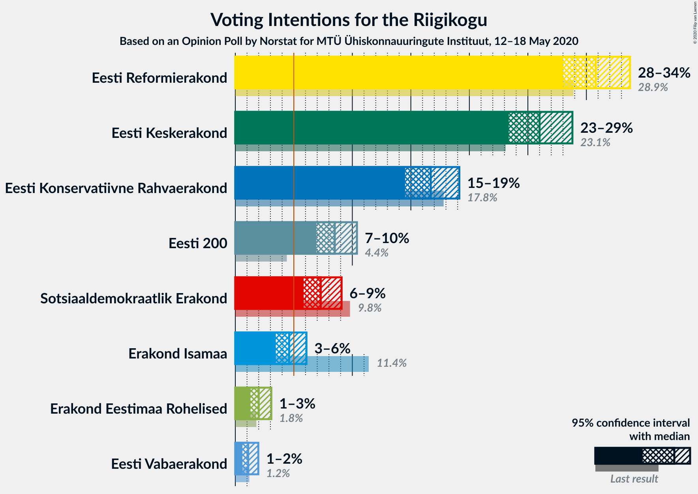

### Confidence Intervals

| Party | Last Result | Poll Result | 80% Confidence Interval | 90% Confidence Interval | 95% Confidence Interval | 99% Confidence Interval |
|:-----:|:-----------:|:-----------:|:-----------------------:|:-----------------------:|:-----------------------:|:-----------------------:|
| Eesti Reformierakond | 28.9% | 30.8% | 29.0–32.7% |28.5–33.3% |28.0–33.7% |27.2–34.7% |
| Eesti Keskerakond | 23.1% | 26.0% | 24.3–27.8% |23.8–28.4% |23.4–28.8% |22.6–29.7% |
| Eesti Konservatiivne Rahvaerakond | 17.8% | 16.7% | 15.3–18.3% |14.9–18.7% |14.5–19.1% |13.9–19.9% |
| Eesti 200 | 4.4% | 8.5% | 7.5–9.7% |7.2–10.1% |6.9–10.4% |6.5–11.0% |
| Sotsiaaldemokraatlik Erakond | 9.8% | 7.3% | 6.3–8.5% |6.1–8.8% |5.8–9.1% |5.4–9.7% |
| Erakond Isamaa | 11.4% | 4.6% | 3.9–5.6% |3.6–5.8% |3.5–6.1% |3.1–6.6% |
| Erakond Eestimaa Rohelised | 1.8% | 2.0% | 1.5–2.7% |1.4–2.9% |1.3–3.1% |1.1–3.4% |
| Eesti Vabaerakond | 1.2% | 1.1% | 0.8–1.7% |0.7–1.8% |0.6–2.0% |0.5–2.3% |

*Note:* The poll result column reflects the actual value used in the calculations. Published results may vary slightly, and in addition be rounded to fewer digits.

## Seats

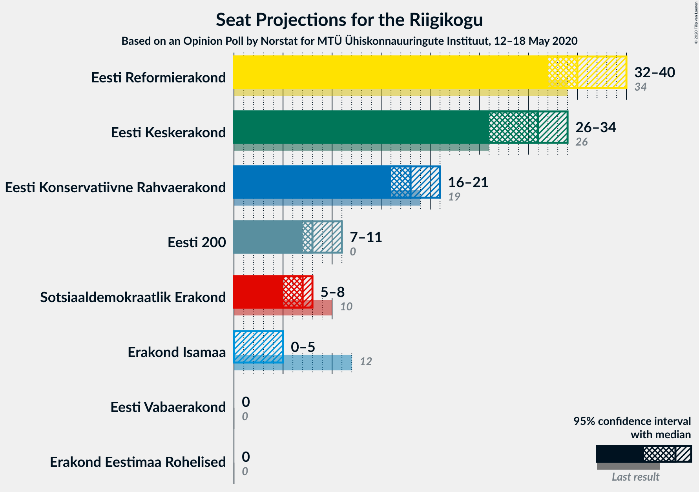

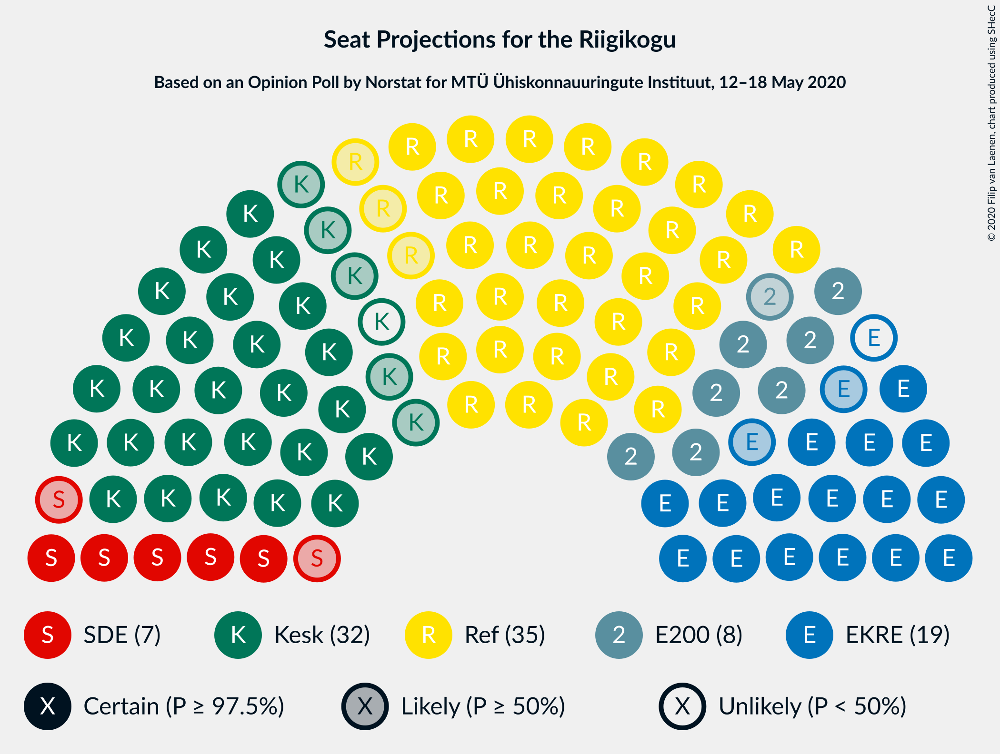

### Confidence Intervals

| Party | Last Result | Median | 80% Confidence Interval | 90% Confidence Interval | 95% Confidence Interval | 99% Confidence Interval |
|:-----:|:-----------:|:------:|:-----------------------:|:-----------------------:|:-----------------------:|:-----------------------:|
| <a href="#eesti-reformierakond">Eesti Reformierakond</a> | 34 | 35 | 33–39 |33–39 |32–40 |32–41 |
| <a href="#eesti-keskerakond">Eesti Keskerakond</a> | 26 | 31 | 28–32 |27–33 |26–34 |25–34 |
| <a href="#eesti-konservatiivne-rahvaerakond">Eesti Konservatiivne Rahvaerakond</a> | 19 | 18 | 16–20 |16–20 |16–21 |14–22 |
| <a href="#eesti-200">Eesti 200</a> | 0 | 8 | 7–10 |7–10 |7–11 |6–11 |
| <a href="#sotsiaaldemokraatlik-erakond">Sotsiaaldemokraatlik Erakond</a> | 10 | 7 | 7–8 |6–8 |5–8 |5–10 |
| <a href="#erakond-isamaa">Erakond Isamaa</a> | 12 | 0 | 0–5 |0–5 |0–5 |0–6 |
| <a href="#erakond-eestimaa-rohelised">Erakond Eestimaa Rohelised</a> | 0 | 0 | 0 |0 |0 |0 |
| <a href="#eesti-vabaerakond">Eesti Vabaerakond</a> | 0 | 0 | 0 |0 |0 |0 |

### Eesti Reformierakond

*For a full overview of the results for this party, see the [Eesti Reformierakond](party-eestireformierakond.html) page.*

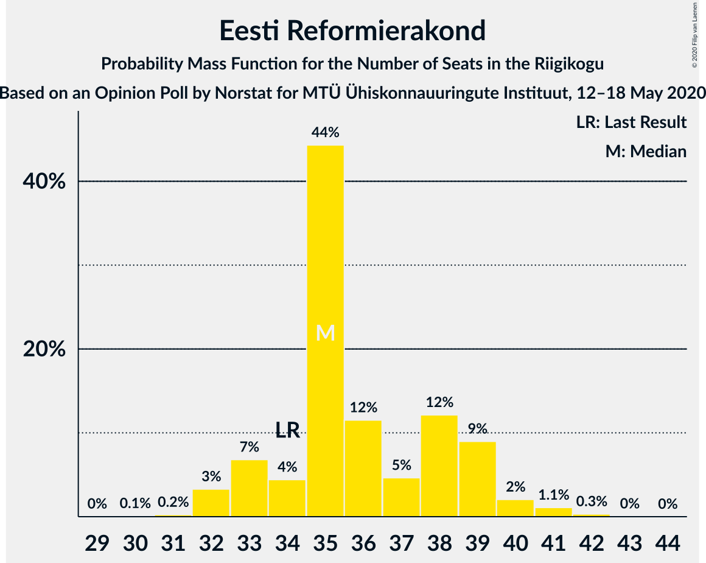

| Number of Seats | Probability | Accumulated | Special Marks |
|:---------------:|:-----------:|:-----------:|:-------------:|
| 30 | 0.1% | 100% |  |
| 31 | 0.2% | 99.9% |  |
| 32 | 3% | 99.6% |  |
| 33 | 7% | 96% |  |
| 34 | 4% | 90% | Last Result |
| 35 | 44% | 85% | Median |
| 36 | 12% | 41% |  |
| 37 | 5% | 29% |  |
| 38 | 12% | 25% |  |
| 39 | 9% | 12% |  |
| 40 | 2% | 4% |  |
| 41 | 1.1% | 1.5% |  |
| 42 | 0.3% | 0.4% |  |
| 43 | 0% | 0.1% |  |
| 44 | 0% | 0% |  |

### Eesti Keskerakond

*For a full overview of the results for this party, see the [Eesti Keskerakond](party-eestikeskerakond.html) page.*

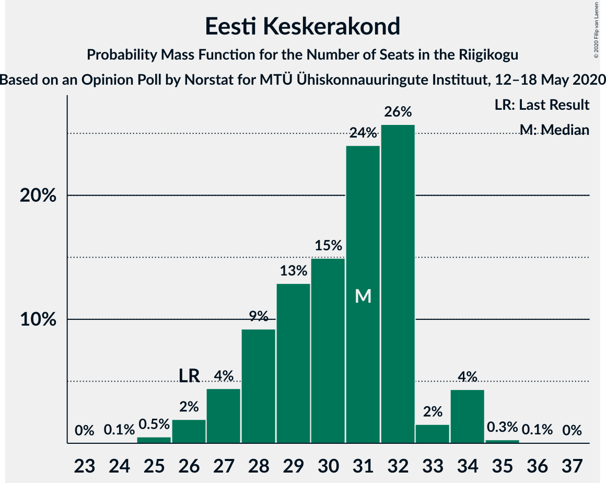

| Number of Seats | Probability | Accumulated | Special Marks |
|:---------------:|:-----------:|:-----------:|:-------------:|
| 24 | 0.1% | 100% |  |
| 25 | 0.5% | 99.9% |  |
| 26 | 2% | 99.4% | Last Result |
| 27 | 4% | 97% |  |
| 28 | 9% | 93% |  |
| 29 | 13% | 84% |  |
| 30 | 15% | 71% |  |
| 31 | 24% | 56% | Median |
| 32 | 26% | 32% |  |
| 33 | 2% | 6% |  |
| 34 | 4% | 5% |  |
| 35 | 0.3% | 0.4% |  |
| 36 | 0.1% | 0.1% |  |
| 37 | 0% | 0% |  |

### Eesti Konservatiivne Rahvaerakond

*For a full overview of the results for this party, see the [Eesti Konservatiivne Rahvaerakond](party-eestikonservatiivnerahvaerakond.html) page.*

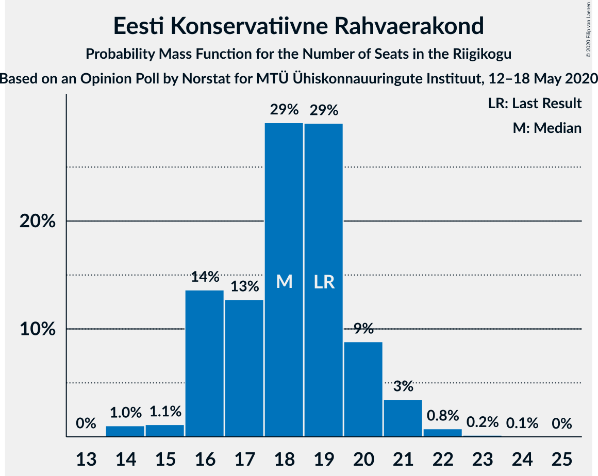

| Number of Seats | Probability | Accumulated | Special Marks |
|:---------------:|:-----------:|:-----------:|:-------------:|
| 14 | 1.0% | 100% |  |
| 15 | 1.1% | 98.9% |  |
| 16 | 14% | 98% |  |
| 17 | 13% | 84% |  |
| 18 | 29% | 71% | Median |
| 19 | 29% | 42% | Last Result |
| 20 | 9% | 13% |  |
| 21 | 3% | 4% |  |
| 22 | 0.8% | 1.0% |  |
| 23 | 0.2% | 0.2% |  |
| 24 | 0.1% | 0.1% |  |
| 25 | 0% | 0% |  |

### Eesti 200

*For a full overview of the results for this party, see the [Eesti 200](party-eesti200.html) page.*

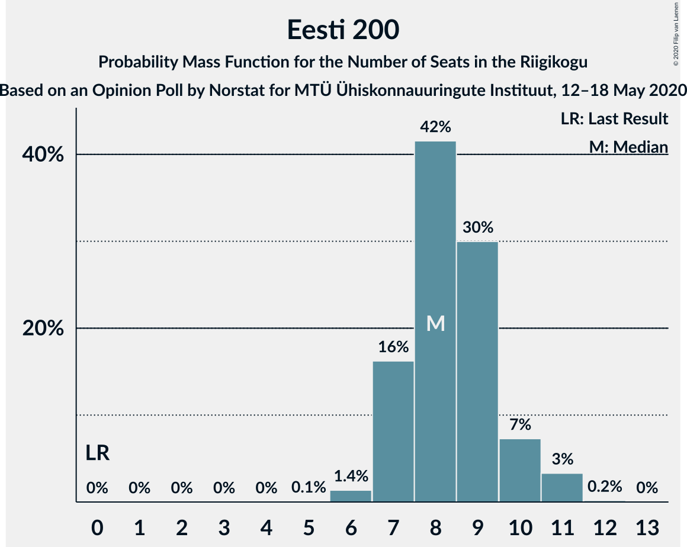

| Number of Seats | Probability | Accumulated | Special Marks |
|:---------------:|:-----------:|:-----------:|:-------------:|
| 0 | 0% | 100% | Last Result |
| 1 | 0% | 100% |  |
| 2 | 0% | 100% |  |
| 3 | 0% | 100% |  |
| 4 | 0% | 100% |  |
| 5 | 0.1% | 100% |  |
| 6 | 1.4% | 99.9% |  |
| 7 | 16% | 98.6% |  |
| 8 | 42% | 82% | Median |
| 9 | 30% | 41% |  |
| 10 | 7% | 11% |  |
| 11 | 3% | 4% |  |
| 12 | 0.2% | 0.2% |  |
| 13 | 0% | 0% |  |

### Sotsiaaldemokraatlik Erakond

*For a full overview of the results for this party, see the [Sotsiaaldemokraatlik Erakond](party-sotsiaaldemokraatlikerakond.html) page.*

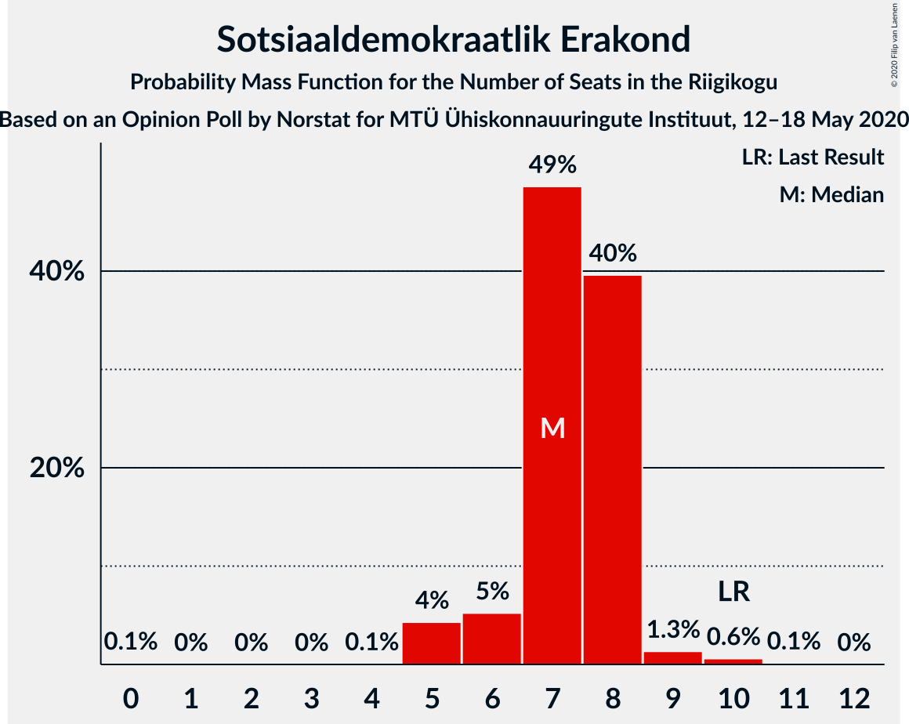

| Number of Seats | Probability | Accumulated | Special Marks |
|:---------------:|:-----------:|:-----------:|:-------------:|
| 0 | 0.1% | 100% |  |
| 1 | 0% | 99.9% |  |
| 2 | 0% | 99.9% |  |
| 3 | 0% | 99.9% |  |
| 4 | 0.1% | 99.9% |  |
| 5 | 4% | 99.8% |  |
| 6 | 5% | 96% |  |
| 7 | 49% | 90% | Median |
| 8 | 40% | 42% |  |
| 9 | 1.3% | 2% |  |
| 10 | 0.6% | 0.7% | Last Result |
| 11 | 0.1% | 0.2% |  |
| 12 | 0% | 0% |  |

### Erakond Isamaa

*For a full overview of the results for this party, see the [Erakond Isamaa](party-erakondisamaa.html) page.*

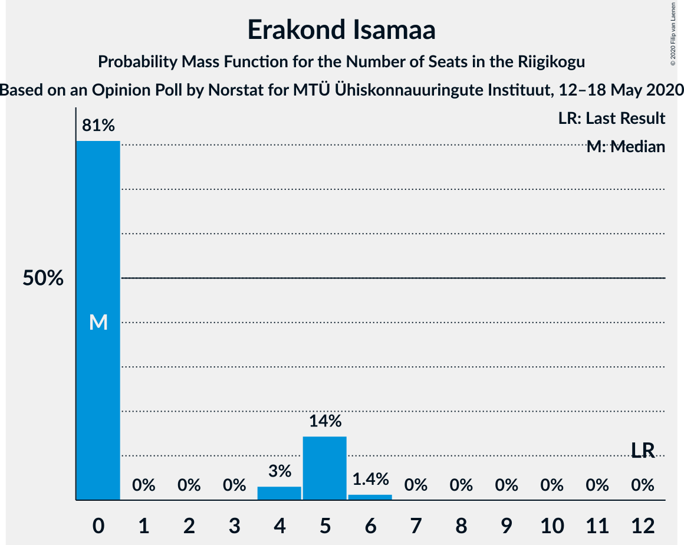

| Number of Seats | Probability | Accumulated | Special Marks |
|:---------------:|:-----------:|:-----------:|:-------------:|
| 0 | 81% | 100% | Median |
| 1 | 0% | 19% |  |
| 2 | 0% | 19% |  |
| 3 | 0% | 19% |  |
| 4 | 3% | 19% |  |
| 5 | 14% | 16% |  |
| 6 | 1.4% | 1.4% |  |
| 7 | 0% | 0% |  |
| 8 | 0% | 0% |  |
| 9 | 0% | 0% |  |
| 10 | 0% | 0% |  |
| 11 | 0% | 0% |  |
| 12 | 0% | 0% | Last Result |

### Erakond Eestimaa Rohelised

*For a full overview of the results for this party, see the [Erakond Eestimaa Rohelised](party-erakondeestimaarohelised.html) page.*

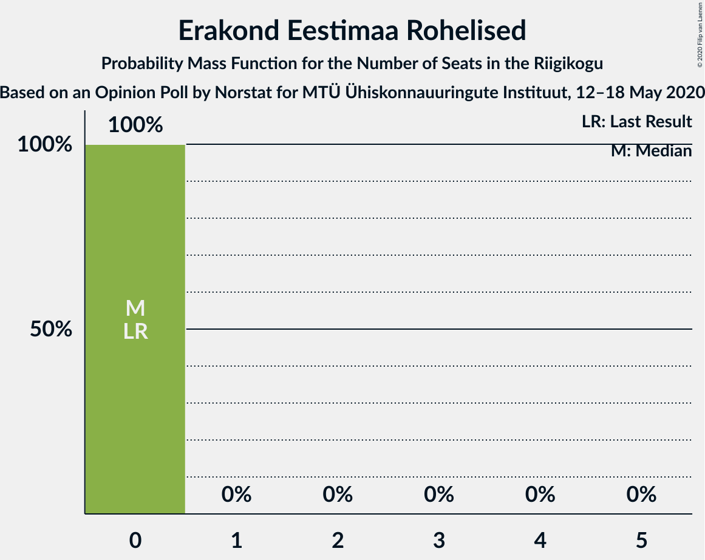

| Number of Seats | Probability | Accumulated | Special Marks |
|:---------------:|:-----------:|:-----------:|:-------------:|
| 0 | 100% | 100% | Last Result, Median |

### Eesti Vabaerakond

*For a full overview of the results for this party, see the [Eesti Vabaerakond](party-eestivabaerakond.html) page.*

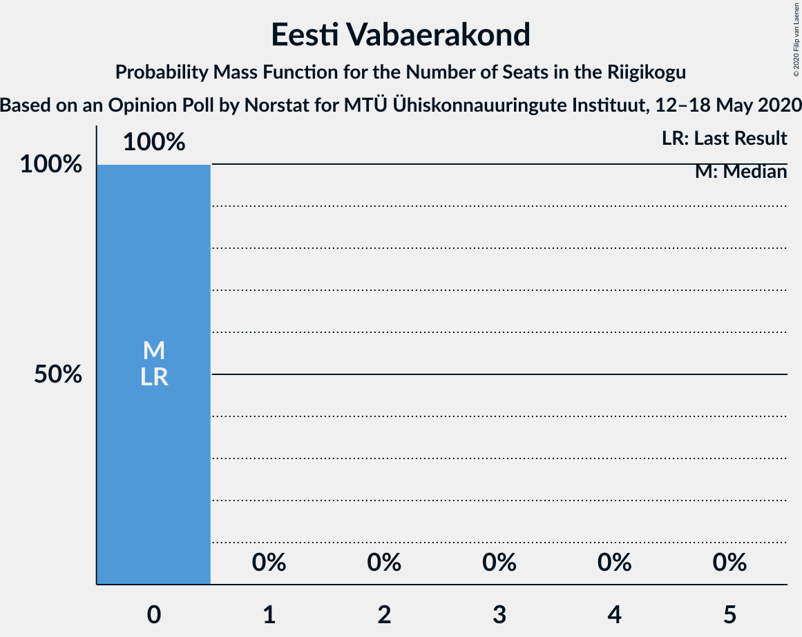

| Number of Seats | Probability | Accumulated | Special Marks |
|:---------------:|:-----------:|:-----------:|:-------------:|
| 0 | 100% | 100% | Last Result, Median |

## Coalitions

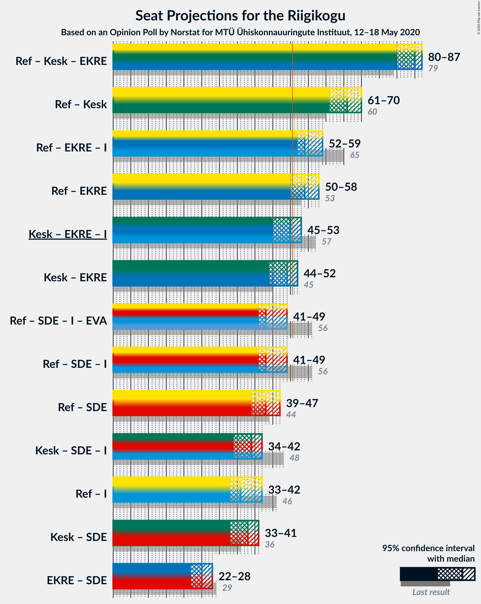

### Confidence Intervals

| Coalition | Last Result | Median | Majority? | 80% Confidence Interval | 90% Confidence Interval | 95% Confidence Interval | 99% Confidence Interval |
|:---------:|:-----------:|:------:|:---------:|:-----------------------:|:-----------------------:|:-----------------------:|:-----------------------:|
| Eesti Reformierakond – Eesti Keskerakond – Eesti Konservatiivne Rahvaerakond | 79 | 85 | 100% | 81–86 | 80–87 | 80–87 | 79–88 |
| Eesti Reformierakond – Eesti Keskerakond | 60 | 66 | 100% | 63–69 | 62–70 | 61–70 | 60–71 |
| Eesti Reformierakond – Eesti Konservatiivne Rahvaerakond – Erakond Isamaa | 65 | 54 | 99.4% | 53–58 | 52–59 | 52–59 | 50–61 |
| Eesti Reformierakond – Eesti Konservatiivne Rahvaerakond | 53 | 54 | 96% | 51–57 | 51–58 | 50–58 | 49–59 |
| Eesti Keskerakond – Eesti Konservatiivne Rahvaerakond – Erakond Isamaa | 57 | 50 | 21% | 47–52 | 46–53 | 45–53 | 44–55 |
| Eesti Keskerakond – Eesti Konservatiivne Rahvaerakond | 45 | 49 | 8% | 46–50 | 45–52 | 44–52 | 43–53 |
| Eesti Reformierakond – Sotsiaaldemokraatlik Erakond – Erakond Isamaa – Eesti Vabaerakond | 56 | 43 | 0.3% | 42–47 | 41–48 | 41–49 | 40–50 |
| Eesti Reformierakond – Sotsiaaldemokraatlik Erakond – Erakond Isamaa | 56 | 43 | 0.3% | 42–47 | 41–48 | 41–49 | 40–50 |
| Eesti Reformierakond – Sotsiaaldemokraatlik Erakond | 44 | 43 | 0% | 41–46 | 40–47 | 39–47 | 38–48 |
| Eesti Keskerakond – Sotsiaaldemokraatlik Erakond – Erakond Isamaa | 48 | 39 | 0% | 36–42 | 35–42 | 34–42 | 33–43 |
| Eesti Reformierakond – Erakond Isamaa | 46 | 36 | 0% | 35–40 | 34–41 | 33–42 | 33–43 |
| Eesti Keskerakond – Sotsiaaldemokraatlik Erakond | 36 | 38 | 0% | 35–39 | 34–40 | 33–41 | 32–42 |
| Eesti Konservatiivne Rahvaerakond – Sotsiaaldemokraatlik Erakond | 29 | 25 | 0% | 23–27 | 23–28 | 22–28 | 21–30 |

### Eesti Reformierakond – Eesti Keskerakond – Eesti Konservatiivne Rahvaerakond

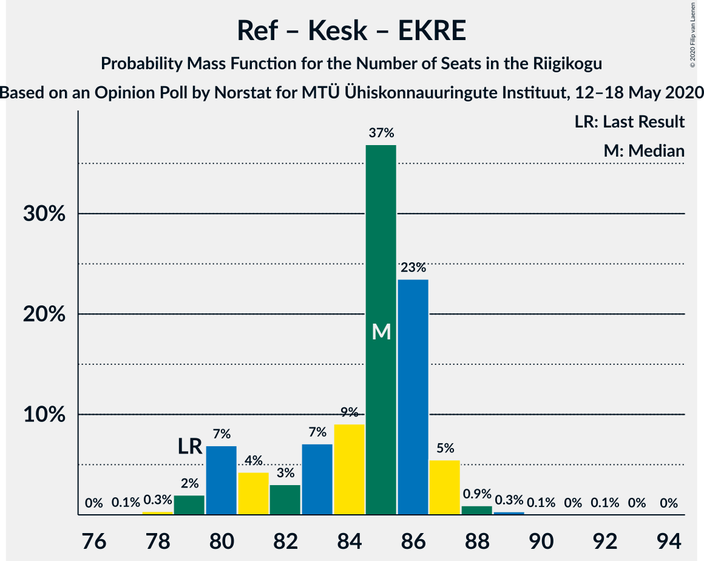

| Number of Seats | Probability | Accumulated | Special Marks |
|:---------------:|:-----------:|:-----------:|:-------------:|
| 77 | 0.1% | 100% |  |
| 78 | 0.3% | 99.9% |  |
| 79 | 2% | 99.6% | Last Result |
| 80 | 7% | 98% |  |
| 81 | 4% | 91% |  |
| 82 | 3% | 86% |  |
| 83 | 7% | 83% |  |
| 84 | 9% | 76% | Median |
| 85 | 37% | 67% |  |
| 86 | 23% | 30% |  |
| 87 | 5% | 7% |  |
| 88 | 0.9% | 1.4% |  |
| 89 | 0.3% | 0.5% |  |
| 90 | 0.1% | 0.2% |  |
| 91 | 0% | 0.1% |  |
| 92 | 0.1% | 0.1% |  |
| 93 | 0% | 0% |  |

### Eesti Reformierakond – Eesti Keskerakond

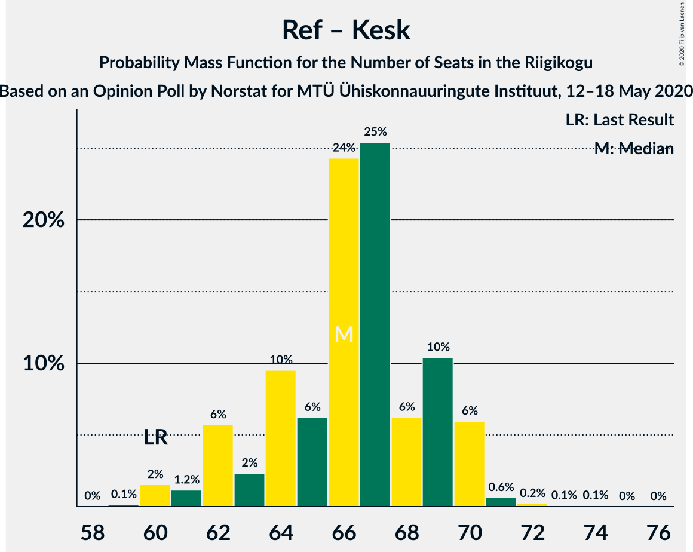

| Number of Seats | Probability | Accumulated | Special Marks |
|:---------------:|:-----------:|:-----------:|:-------------:|
| 59 | 0.1% | 100% |  |
| 60 | 2% | 99.8% | Last Result |
| 61 | 1.2% | 98% |  |
| 62 | 6% | 97% |  |
| 63 | 2% | 91% |  |
| 64 | 10% | 89% |  |
| 65 | 6% | 80% |  |
| 66 | 24% | 73% | Median |
| 67 | 25% | 49% |  |
| 68 | 6% | 24% |  |
| 69 | 10% | 17% |  |
| 70 | 6% | 7% |  |
| 71 | 0.6% | 1.0% |  |
| 72 | 0.2% | 0.4% |  |
| 73 | 0.1% | 0.1% |  |
| 74 | 0.1% | 0.1% |  |
| 75 | 0% | 0% |  |

### Eesti Reformierakond – Eesti Konservatiivne Rahvaerakond – Erakond Isamaa

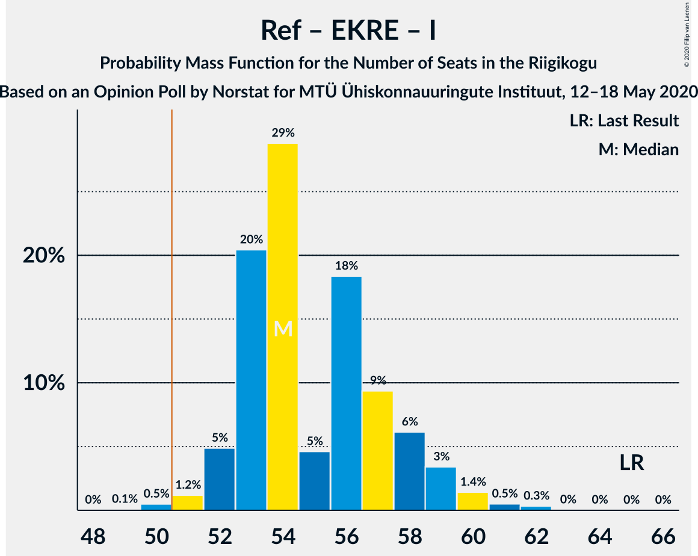

| Number of Seats | Probability | Accumulated | Special Marks |
|:---------------:|:-----------:|:-----------:|:-------------:|
| 49 | 0.1% | 100% |  |
| 50 | 0.5% | 99.9% |  |
| 51 | 1.2% | 99.4% | Majority |
| 52 | 5% | 98% |  |
| 53 | 20% | 93% | Median |
| 54 | 29% | 73% |  |
| 55 | 5% | 44% |  |
| 56 | 18% | 40% |  |
| 57 | 9% | 21% |  |
| 58 | 6% | 12% |  |
| 59 | 3% | 6% |  |
| 60 | 1.4% | 2% |  |
| 61 | 0.5% | 0.9% |  |
| 62 | 0.3% | 0.4% |  |
| 63 | 0% | 0.1% |  |
| 64 | 0% | 0% |  |
| 65 | 0% | 0% | Last Result |

### Eesti Reformierakond – Eesti Konservatiivne Rahvaerakond

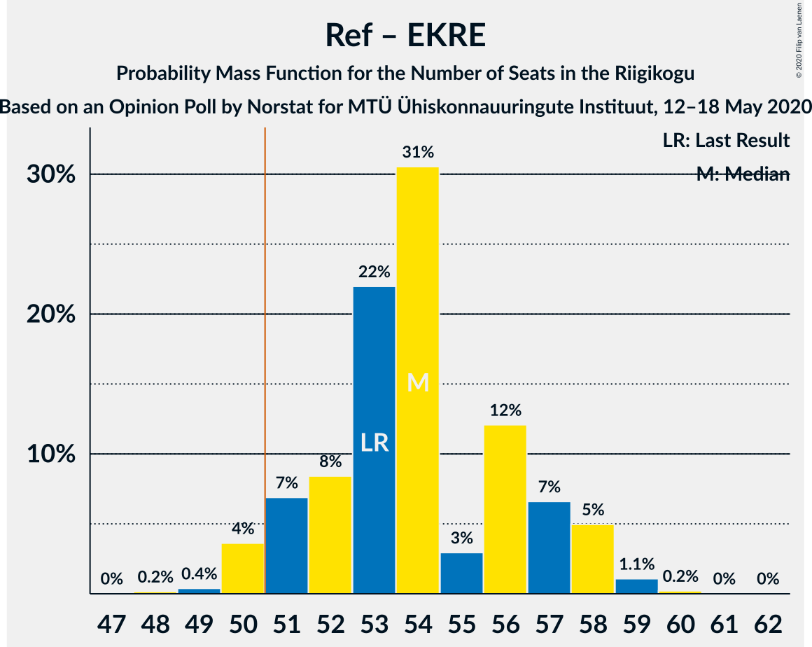

| Number of Seats | Probability | Accumulated | Special Marks |
|:---------------:|:-----------:|:-----------:|:-------------:|
| 47 | 0% | 100% |  |
| 48 | 0.2% | 99.9% |  |
| 49 | 0.4% | 99.8% |  |
| 50 | 4% | 99.4% |  |
| 51 | 7% | 96% | Majority |
| 52 | 8% | 89% |  |
| 53 | 22% | 80% | Last Result, Median |
| 54 | 31% | 58% |  |
| 55 | 3% | 28% |  |
| 56 | 12% | 25% |  |
| 57 | 7% | 13% |  |
| 58 | 5% | 6% |  |
| 59 | 1.1% | 1.3% |  |
| 60 | 0.2% | 0.3% |  |
| 61 | 0% | 0.1% |  |
| 62 | 0% | 0% |  |

### Eesti Keskerakond – Eesti Konservatiivne Rahvaerakond – Erakond Isamaa

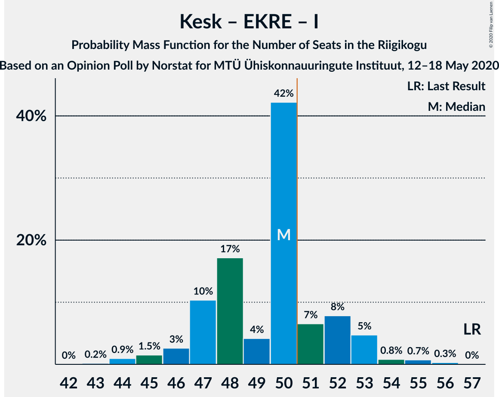

| Number of Seats | Probability | Accumulated | Special Marks |
|:---------------:|:-----------:|:-----------:|:-------------:|
| 43 | 0.2% | 100% |  |
| 44 | 0.9% | 99.8% |  |
| 45 | 1.5% | 98.9% |  |
| 46 | 3% | 97% |  |
| 47 | 10% | 95% |  |
| 48 | 17% | 84% |  |
| 49 | 4% | 67% | Median |
| 50 | 42% | 63% |  |
| 51 | 7% | 21% | Majority |
| 52 | 8% | 14% |  |
| 53 | 5% | 7% |  |
| 54 | 0.8% | 2% |  |
| 55 | 0.7% | 1.0% |  |
| 56 | 0.3% | 0.3% |  |
| 57 | 0% | 0% | Last Result |

### Eesti Keskerakond – Eesti Konservatiivne Rahvaerakond

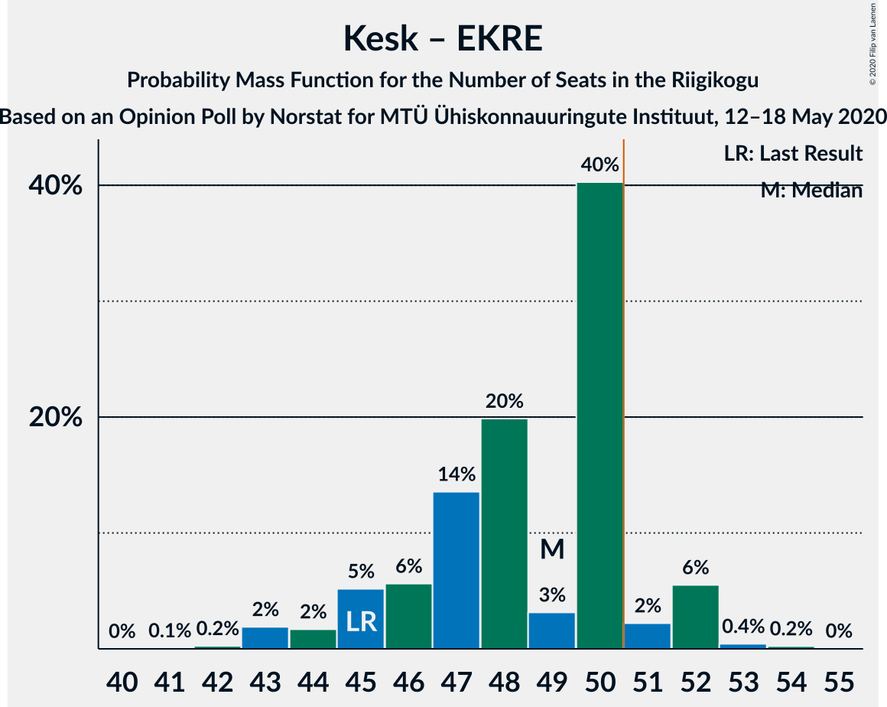

| Number of Seats | Probability | Accumulated | Special Marks |
|:---------------:|:-----------:|:-----------:|:-------------:|
| 41 | 0.1% | 100% |  |
| 42 | 0.2% | 99.9% |  |
| 43 | 2% | 99.7% |  |
| 44 | 2% | 98% |  |
| 45 | 5% | 96% | Last Result |
| 46 | 6% | 91% |  |
| 47 | 14% | 85% |  |
| 48 | 20% | 72% |  |
| 49 | 3% | 52% | Median |
| 50 | 40% | 49% |  |
| 51 | 2% | 8% | Majority |
| 52 | 6% | 6% |  |
| 53 | 0.4% | 0.7% |  |
| 54 | 0.2% | 0.3% |  |
| 55 | 0% | 0% |  |

### Eesti Reformierakond – Sotsiaaldemokraatlik Erakond – Erakond Isamaa – Eesti Vabaerakond

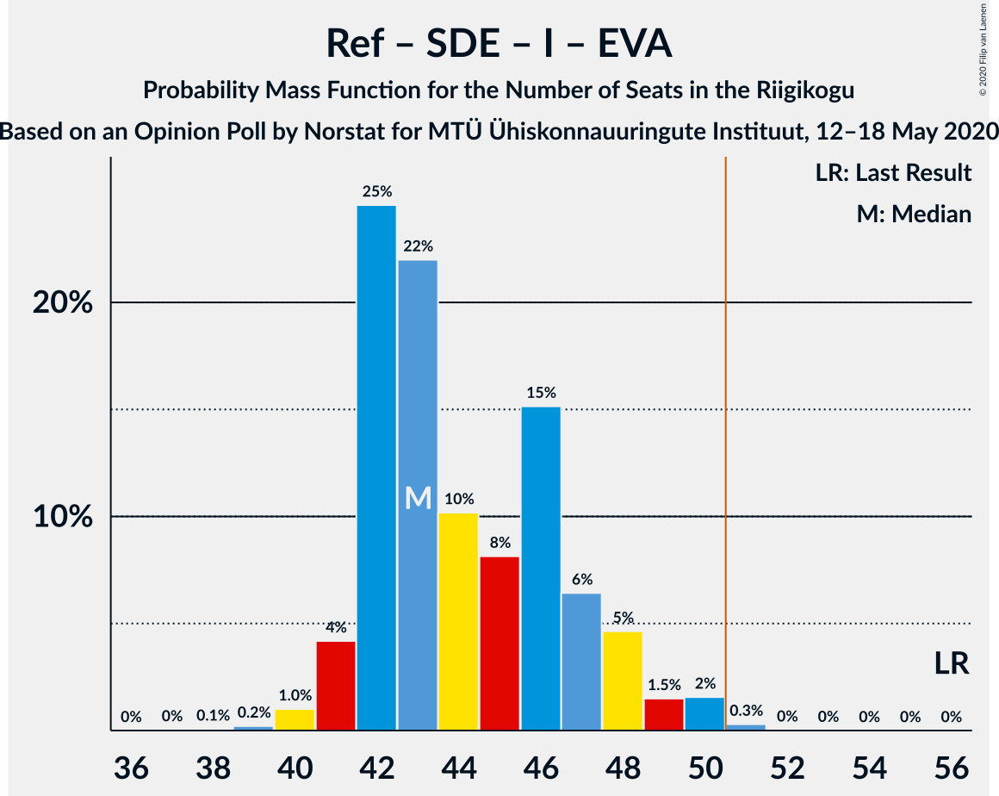

| Number of Seats | Probability | Accumulated | Special Marks |
|:---------------:|:-----------:|:-----------:|:-------------:|
| 38 | 0.1% | 100% |  |
| 39 | 0.2% | 99.9% |  |
| 40 | 1.0% | 99.7% |  |
| 41 | 4% | 98.7% |  |
| 42 | 25% | 94% | Median |
| 43 | 22% | 70% |  |
| 44 | 10% | 48% |  |
| 45 | 8% | 38% |  |
| 46 | 15% | 30% |  |
| 47 | 6% | 14% |  |
| 48 | 5% | 8% |  |
| 49 | 1.5% | 3% |  |
| 50 | 2% | 2% |  |
| 51 | 0.3% | 0.3% | Majority |
| 52 | 0% | 0% |  |
| 53 | 0% | 0% |  |
| 54 | 0% | 0% |  |
| 55 | 0% | 0% |  |
| 56 | 0% | 0% | Last Result |

### Eesti Reformierakond – Sotsiaaldemokraatlik Erakond – Erakond Isamaa

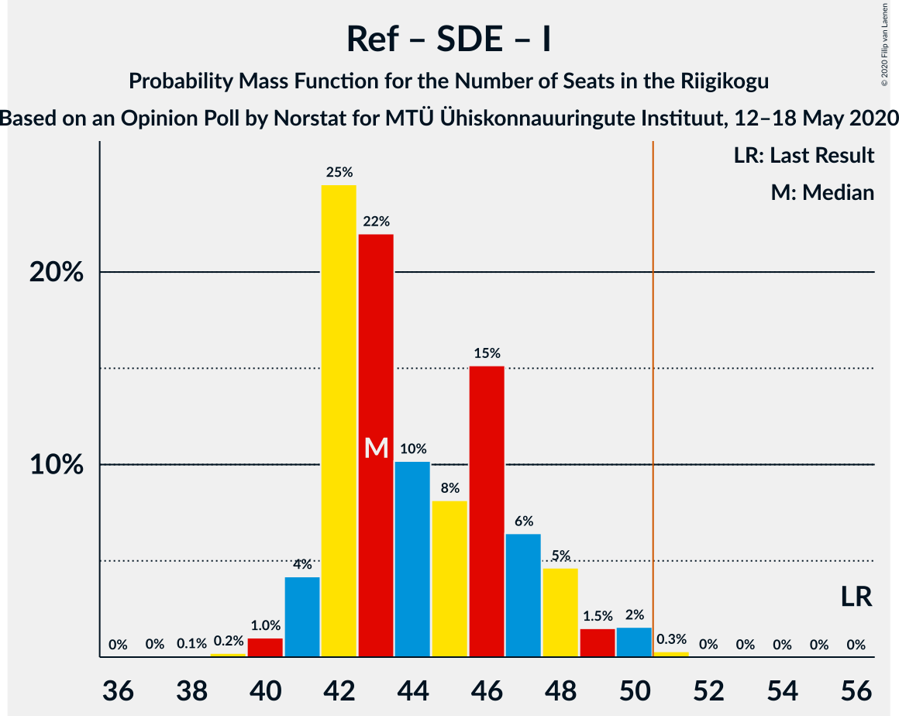

| Number of Seats | Probability | Accumulated | Special Marks |
|:---------------:|:-----------:|:-----------:|:-------------:|
| 38 | 0.1% | 100% |  |
| 39 | 0.2% | 99.9% |  |
| 40 | 1.0% | 99.7% |  |
| 41 | 4% | 98.7% |  |
| 42 | 25% | 94% | Median |
| 43 | 22% | 70% |  |
| 44 | 10% | 48% |  |
| 45 | 8% | 38% |  |
| 46 | 15% | 30% |  |
| 47 | 6% | 14% |  |
| 48 | 5% | 8% |  |
| 49 | 1.5% | 3% |  |
| 50 | 2% | 2% |  |
| 51 | 0.3% | 0.3% | Majority |
| 52 | 0% | 0% |  |
| 53 | 0% | 0% |  |
| 54 | 0% | 0% |  |
| 55 | 0% | 0% |  |
| 56 | 0% | 0% | Last Result |

### Eesti Reformierakond – Sotsiaaldemokraatlik Erakond

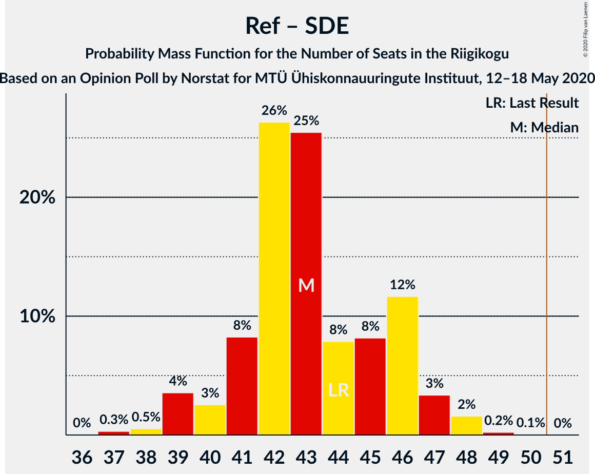

| Number of Seats | Probability | Accumulated | Special Marks |
|:---------------:|:-----------:|:-----------:|:-------------:|
| 37 | 0.3% | 100% |  |
| 38 | 0.5% | 99.6% |  |
| 39 | 4% | 99.1% |  |
| 40 | 3% | 96% |  |
| 41 | 8% | 93% |  |
| 42 | 26% | 85% | Median |
| 43 | 25% | 58% |  |
| 44 | 8% | 33% | Last Result |
| 45 | 8% | 25% |  |
| 46 | 12% | 17% |  |
| 47 | 3% | 5% |  |
| 48 | 2% | 2% |  |
| 49 | 0.2% | 0.3% |  |
| 50 | 0.1% | 0.1% |  |
| 51 | 0% | 0% | Majority |

### Eesti Keskerakond – Sotsiaaldemokraatlik Erakond – Erakond Isamaa

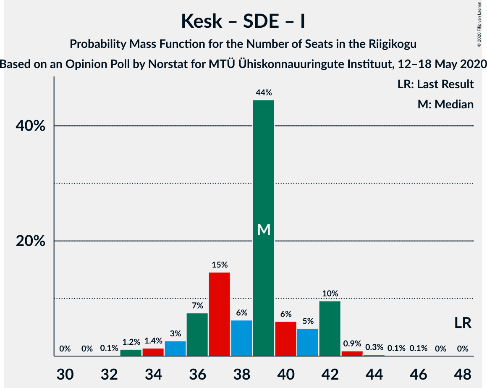

| Number of Seats | Probability | Accumulated | Special Marks |
|:---------------:|:-----------:|:-----------:|:-------------:|
| 32 | 0.1% | 100% |  |
| 33 | 1.2% | 99.8% |  |
| 34 | 1.4% | 98.7% |  |
| 35 | 3% | 97% |  |
| 36 | 7% | 95% |  |
| 37 | 15% | 87% |  |
| 38 | 6% | 73% | Median |
| 39 | 44% | 66% |  |
| 40 | 6% | 22% |  |
| 41 | 5% | 16% |  |
| 42 | 10% | 11% |  |
| 43 | 0.9% | 1.4% |  |
| 44 | 0.3% | 0.5% |  |
| 45 | 0.1% | 0.2% |  |
| 46 | 0.1% | 0.1% |  |
| 47 | 0% | 0% |  |
| 48 | 0% | 0% | Last Result |

### Eesti Reformierakond – Erakond Isamaa

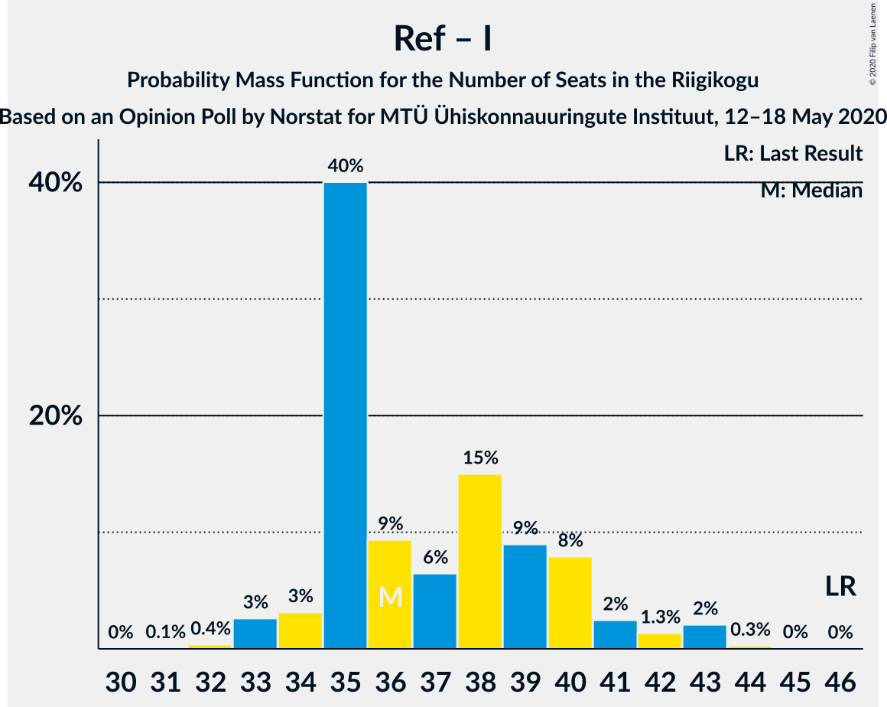

| Number of Seats | Probability | Accumulated | Special Marks |
|:---------------:|:-----------:|:-----------:|:-------------:|
| 31 | 0.1% | 100% |  |
| 32 | 0.4% | 99.9% |  |
| 33 | 3% | 99.6% |  |
| 34 | 3% | 97% |  |
| 35 | 40% | 94% | Median |
| 36 | 9% | 54% |  |
| 37 | 6% | 44% |  |
| 38 | 15% | 38% |  |
| 39 | 9% | 23% |  |
| 40 | 8% | 14% |  |
| 41 | 2% | 6% |  |
| 42 | 1.3% | 4% |  |
| 43 | 2% | 2% |  |
| 44 | 0.3% | 0.3% |  |
| 45 | 0% | 0.1% |  |
| 46 | 0% | 0% | Last Result |

### Eesti Keskerakond – Sotsiaaldemokraatlik Erakond

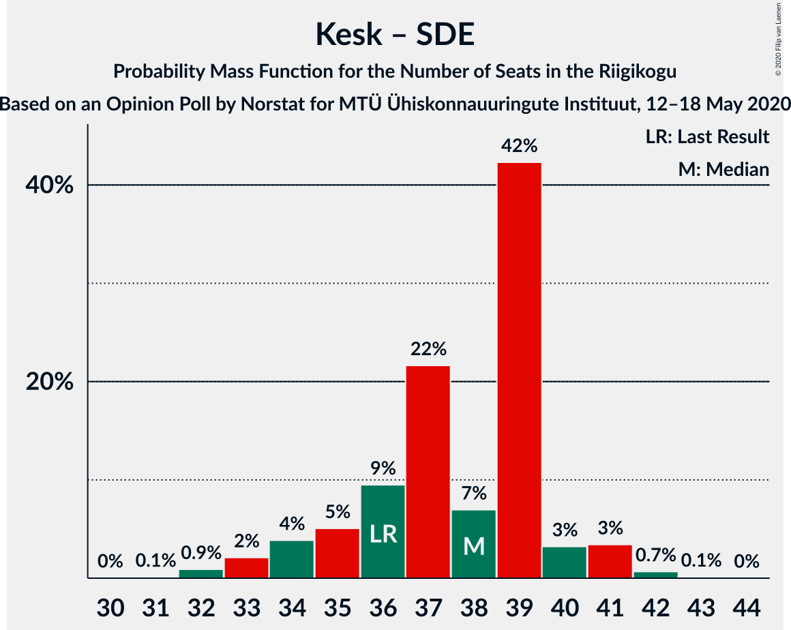

| Number of Seats | Probability | Accumulated | Special Marks |
|:---------------:|:-----------:|:-----------:|:-------------:|
| 30 | 0% | 100% |  |
| 31 | 0.1% | 99.9% |  |
| 32 | 0.9% | 99.8% |  |
| 33 | 2% | 98.9% |  |
| 34 | 4% | 97% |  |
| 35 | 5% | 93% |  |
| 36 | 9% | 88% | Last Result |
| 37 | 22% | 78% |  |
| 38 | 7% | 57% | Median |
| 39 | 42% | 50% |  |
| 40 | 3% | 7% |  |
| 41 | 3% | 4% |  |
| 42 | 0.7% | 0.8% |  |
| 43 | 0.1% | 0.2% |  |
| 44 | 0% | 0% |  |

### Eesti Konservatiivne Rahvaerakond – Sotsiaaldemokraatlik Erakond

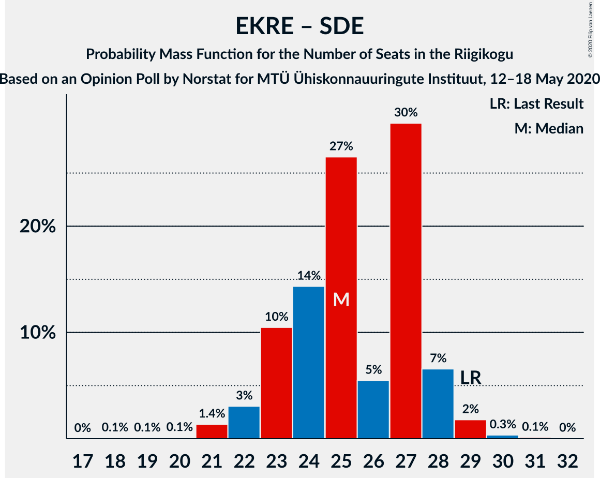

| Number of Seats | Probability | Accumulated | Special Marks |
|:---------------:|:-----------:|:-----------:|:-------------:|
| 18 | 0.1% | 100% |  |
| 19 | 0.1% | 99.9% |  |
| 20 | 0.1% | 99.9% |  |
| 21 | 1.4% | 99.8% |  |
| 22 | 3% | 98% |  |
| 23 | 10% | 95% |  |
| 24 | 14% | 85% |  |
| 25 | 27% | 71% | Median |
| 26 | 5% | 44% |  |
| 27 | 30% | 39% |  |
| 28 | 7% | 9% |  |
| 29 | 2% | 2% | Last Result |
| 30 | 0.3% | 0.5% |  |
| 31 | 0.1% | 0.2% |  |
| 32 | 0% | 0% |  |

## Technical Information

### Opinion Poll

+ **Polling firm:** Norstat
+ **Commissioner(s):** MTÜ Ühiskonnauuringute Instituut
+ **Fieldwork period:** 12–18 May 2020

### Calculations

+ **Sample size:** 1000
+ **Simulations done:** 131,072
+ **Error estimate:** 0.85%

