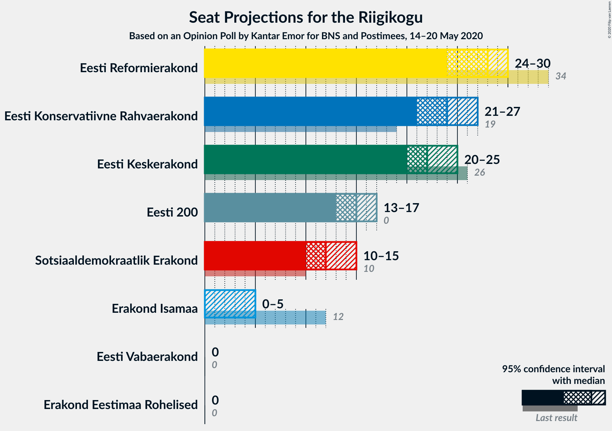

# Opinion Poll by Kantar Emor for BNS and Postimees, 14–20 May 2020

<a href="#voting-intentions">Voting Intentions</a> | <a href="#seats">Seats</a> | <a href="#coalitions">Coalitions</a> | <a href="#technical-information">Technical Information</a>

## Voting Intentions

### Confidence Intervals

| Party | Last Result | Poll Result | 80% Confidence Interval | 90% Confidence Interval | 95% Confidence Interval | 99% Confidence Interval |
|:-----:|:-----------:|:-----------:|:-----------------------:|:-----------------------:|:-----------------------:|:-----------------------:|
| Eesti Reformierakond | 28.9% | 24.0% | 22.5–25.6% |22.1–26.0% |21.7–26.4% |21.0–27.2% |
| Eesti Konservatiivne Rahvaerakond | 17.8% | 21.9% | 20.5–23.5% |20.1–23.9% |19.7–24.3% |19.1–25.0% |
| Eesti Keskerakond | 23.1% | 20.0% | 18.6–21.5% |18.2–21.9% |17.8–22.3% |17.2–23.0% |
| Eesti 200 | 4.4% | 14.0% | 12.8–15.3% |12.4–15.7% |12.2–16.0% |11.6–16.6% |
| Sotsiaaldemokraatlik Erakond | 9.8% | 12.0% | 10.9–13.2% |10.6–13.6% |10.3–13.9% |9.8–14.5% |
| Erakond Isamaa | 11.4% | 4.0% | 3.4–4.8% |3.2–5.1% |3.1–5.3% |2.8–5.7% |
| Erakond Eestimaa Rohelised | 1.8% | 2.0% | 1.6–2.6% |1.4–2.7% |1.3–2.9% |1.2–3.2% |
| Eesti Vabaerakond | 1.2% | 0.2% | 0.1–0.5% |0.1–0.6% |0.1–0.7% |0.0–0.9% |

*Note:* The poll result column reflects the actual value used in the calculations. Published results may vary slightly, and in addition be rounded to fewer digits.

## Seats

### Confidence Intervals

| Party | Last Result | Median | 80% Confidence Interval | 90% Confidence Interval | 95% Confidence Interval | 99% Confidence Interval |
|:-----:|:-----------:|:------:|:-----------------------:|:-----------------------:|:-----------------------:|:-----------------------:|
| <a href="#eesti-reformierakond">Eesti Reformierakond</a> | 34 | 28 | 25–29 |25–29 |24–30 |23–31 |
| <a href="#eesti-konservatiivne-rahvaerakond">Eesti Konservatiivne Rahvaerakond</a> | 19 | 24 | 22–26 |22–27 |21–27 |21–28 |
| <a href="#eesti-keskerakond">Eesti Keskerakond</a> | 26 | 22 | 20–24 |20–25 |20–25 |19–26 |
| <a href="#eesti-200">Eesti 200</a> | 0 | 15 | 13–16 |13–17 |13–17 |12–18 |
| <a href="#sotsiaaldemokraatlik-erakond">Sotsiaaldemokraatlik Erakond</a> | 10 | 12 | 11–14 |11–14 |10–15 |10–15 |
| <a href="#erakond-isamaa">Erakond Isamaa</a> | 12 | 0 | 0 |0 |0–5 |0–5 |
| <a href="#erakond-eestimaa-rohelised">Erakond Eestimaa Rohelised</a> | 0 | 0 | 0 |0 |0 |0 |
| <a href="#eesti-vabaerakond">Eesti Vabaerakond</a> | 0 | 0 | 0 |0 |0 |0 |

### Eesti Reformierakond

*For a full overview of the results for this party, see the [Eesti Reformierakond](party-eestireformierakond.html) page.*

| Number of Seats | Probability | Accumulated | Special Marks |
|:---------------:|:-----------:|:-----------:|:-------------:|
| 22 | 0.1% | 100% |  |
| 23 | 0.5% | 99.9% |  |
| 24 | 2% | 99.4% |  |
| 25 | 16% | 97% |  |
| 26 | 12% | 81% |  |
| 27 | 14% | 69% |  |
| 28 | 29% | 55% | Median |
| 29 | 22% | 26% |  |
| 30 | 2% | 3% |  |
| 31 | 1.1% | 2% |  |
| 32 | 0.4% | 0.4% |  |
| 33 | 0% | 0% |  |
| 34 | 0% | 0% | Last Result |

### Eesti Konservatiivne Rahvaerakond

*For a full overview of the results for this party, see the [Eesti Konservatiivne Rahvaerakond](party-eestikonservatiivnerahvaerakond.html) page.*

| Number of Seats | Probability | Accumulated | Special Marks |
|:---------------:|:-----------:|:-----------:|:-------------:|
| 19 | 0% | 100% | Last Result |
| 20 | 0.4% | 100% |  |
| 21 | 2% | 99.5% |  |
| 22 | 10% | 97% |  |
| 23 | 10% | 87% |  |
| 24 | 31% | 77% | Median |
| 25 | 25% | 46% |  |
| 26 | 14% | 21% |  |
| 27 | 5% | 7% |  |
| 28 | 1.4% | 2% |  |
| 29 | 0.3% | 0.3% |  |
| 30 | 0% | 0.1% |  |
| 31 | 0% | 0% |  |

### Eesti Keskerakond

*For a full overview of the results for this party, see the [Eesti Keskerakond](party-eestikeskerakond.html) page.*

| Number of Seats | Probability | Accumulated | Special Marks |
|:---------------:|:-----------:|:-----------:|:-------------:|
| 18 | 0.4% | 100% |  |
| 19 | 2% | 99.5% |  |
| 20 | 14% | 98% |  |
| 21 | 19% | 84% |  |
| 22 | 27% | 65% | Median |
| 23 | 24% | 38% |  |
| 24 | 9% | 14% |  |
| 25 | 4% | 5% |  |
| 26 | 1.1% | 1.3% | Last Result |
| 27 | 0.1% | 0.1% |  |
| 28 | 0% | 0% |  |

### Eesti 200

*For a full overview of the results for this party, see the [Eesti 200](party-eesti200.html) page.*

| Number of Seats | Probability | Accumulated | Special Marks |
|:---------------:|:-----------:|:-----------:|:-------------:|
| 0 | 0% | 100% | Last Result |
| 1 | 0% | 100% |  |
| 2 | 0% | 100% |  |
| 3 | 0% | 100% |  |
| 4 | 0% | 100% |  |
| 5 | 0% | 100% |  |
| 6 | 0% | 100% |  |
| 7 | 0% | 100% |  |
| 8 | 0% | 100% |  |
| 9 | 0% | 100% |  |
| 10 | 0% | 100% |  |
| 11 | 0.1% | 100% |  |
| 12 | 1.3% | 99.9% |  |
| 13 | 20% | 98.6% |  |
| 14 | 26% | 78% |  |
| 15 | 28% | 52% | Median |
| 16 | 18% | 24% |  |
| 17 | 5% | 7% |  |
| 18 | 1.2% | 1.3% |  |
| 19 | 0.1% | 0.1% |  |
| 20 | 0% | 0% |  |

### Sotsiaaldemokraatlik Erakond

*For a full overview of the results for this party, see the [Sotsiaaldemokraatlik Erakond](party-sotsiaaldemokraatlikerakond.html) page.*

| Number of Seats | Probability | Accumulated | Special Marks |
|:---------------:|:-----------:|:-----------:|:-------------:|
| 9 | 0.2% | 100% |  |
| 10 | 3% | 99.8% | Last Result |
| 11 | 17% | 97% |  |
| 12 | 33% | 80% | Median |
| 13 | 32% | 47% |  |
| 14 | 10% | 15% |  |
| 15 | 4% | 4% |  |
| 16 | 0.2% | 0.2% |  |
| 17 | 0% | 0% |  |

### Erakond Isamaa

*For a full overview of the results for this party, see the [Erakond Isamaa](party-erakondisamaa.html) page.*

| Number of Seats | Probability | Accumulated | Special Marks |
|:---------------:|:-----------:|:-----------:|:-------------:|
| 0 | 96% | 100% | Median |
| 1 | 0% | 4% |  |
| 2 | 0% | 4% |  |
| 3 | 0% | 4% |  |
| 4 | 1.2% | 4% |  |
| 5 | 3% | 3% |  |
| 6 | 0% | 0% |  |
| 7 | 0% | 0% |  |
| 8 | 0% | 0% |  |
| 9 | 0% | 0% |  |
| 10 | 0% | 0% |  |
| 11 | 0% | 0% |  |
| 12 | 0% | 0% | Last Result |

### Erakond Eestimaa Rohelised

*For a full overview of the results for this party, see the [Erakond Eestimaa Rohelised](party-erakondeestimaarohelised.html) page.*

| Number of Seats | Probability | Accumulated | Special Marks |
|:---------------:|:-----------:|:-----------:|:-------------:|
| 0 | 100% | 100% | Last Result, Median |

### Eesti Vabaerakond

*For a full overview of the results for this party, see the [Eesti Vabaerakond](party-eestivabaerakond.html) page.*

| Number of Seats | Probability | Accumulated | Special Marks |
|:---------------:|:-----------:|:-----------:|:-------------:|
| 0 | 100% | 100% | Last Result, Median |

## Coalitions

### Confidence Intervals

| Coalition | Last Result | Median | Majority? | 80% Confidence Interval | 90% Confidence Interval | 95% Confidence Interval | 99% Confidence Interval |
|:---------:|:-----------:|:------:|:---------:|:-----------------------:|:-----------------------:|:-----------------------:|:-----------------------:|
| Eesti Reformierakond – Eesti Konservatiivne Rahvaerakond – Eesti Keskerakond | 79 | 74 | 100% | 71–76 | 71–76 | 71–77 | 70–77 |
| Eesti Reformierakond – Eesti Konservatiivne Rahvaerakond – Erakond Isamaa | 65 | 52 | 72% | 50–54 | 50–55 | 49–56 | 48–56 |
| Eesti Reformierakond – Eesti Konservatiivne Rahvaerakond | 53 | 52 | 70% | 50–54 | 49–54 | 49–55 | 47–56 |
| Eesti Reformierakond – Eesti Keskerakond | 60 | 49 | 28% | 47–52 | 45–52 | 45–53 | 45–54 |
| Eesti Konservatiivne Rahvaerakond – Eesti Keskerakond | 45 | 46 | 0.9% | 44–49 | 43–49 | 43–50 | 42–51 |
| Eesti Konservatiivne Rahvaerakond – Eesti Keskerakond – Erakond Isamaa | 57 | 47 | 1.4% | 44–49 | 43–50 | 43–50 | 42–52 |
| Eesti Reformierakond – Sotsiaaldemokraatlik Erakond – Erakond Isamaa – Eesti Vabaerakond | 56 | 40 | 0% | 38–42 | 37–43 | 36–43 | 36–45 |
| Eesti Reformierakond – Sotsiaaldemokraatlik Erakond – Erakond Isamaa | 56 | 40 | 0% | 38–42 | 37–43 | 36–43 | 36–45 |
| Eesti Reformierakond – Sotsiaaldemokraatlik Erakond | 44 | 40 | 0% | 38–41 | 37–42 | 36–43 | 35–43 |
| Eesti Konservatiivne Rahvaerakond – Sotsiaaldemokraatlik Erakond | 29 | 37 | 0% | 35–39 | 34–40 | 34–40 | 32–41 |
| Eesti Keskerakond – Sotsiaaldemokraatlik Erakond – Erakond Isamaa | 48 | 35 | 0% | 33–37 | 32–37 | 32–38 | 30–39 |
| Eesti Keskerakond – Sotsiaaldemokraatlik Erakond | 36 | 35 | 0% | 33–37 | 32–37 | 31–38 | 30–39 |
| Eesti Reformierakond – Erakond Isamaa | 46 | 28 | 0% | 25–29 | 25–31 | 24–31 | 24–33 |

### Eesti Reformierakond – Eesti Konservatiivne Rahvaerakond – Eesti Keskerakond

| Number of Seats | Probability | Accumulated | Special Marks |
|:---------------:|:-----------:|:-----------:|:-------------:|
| 68 | 0.1% | 100% |  |
| 69 | 0.2% | 99.8% |  |
| 70 | 1.3% | 99.6% |  |
| 71 | 11% | 98% |  |
| 72 | 15% | 87% |  |
| 73 | 14% | 72% |  |
| 74 | 24% | 58% | Median |
| 75 | 11% | 33% |  |
| 76 | 19% | 23% |  |
| 77 | 3% | 4% |  |
| 78 | 0.3% | 0.4% |  |
| 79 | 0% | 0% | Last Result |

### Eesti Reformierakond – Eesti Konservatiivne Rahvaerakond – Erakond Isamaa

| Number of Seats | Probability | Accumulated | Special Marks |
|:---------------:|:-----------:|:-----------:|:-------------:|
| 46 | 0.1% | 100% |  |
| 47 | 0.3% | 99.9% |  |
| 48 | 1.3% | 99.6% |  |
| 49 | 3% | 98% |  |
| 50 | 24% | 96% |  |
| 51 | 16% | 72% | Majority |
| 52 | 12% | 56% | Median |
| 53 | 30% | 44% |  |
| 54 | 7% | 14% |  |
| 55 | 2% | 7% |  |
| 56 | 4% | 4% |  |
| 57 | 0.4% | 0.5% |  |
| 58 | 0.1% | 0.1% |  |
| 59 | 0% | 0% |  |
| 60 | 0% | 0% |  |
| 61 | 0% | 0% |  |
| 62 | 0% | 0% |  |
| 63 | 0% | 0% |  |
| 64 | 0% | 0% |  |
| 65 | 0% | 0% | Last Result |

### Eesti Reformierakond – Eesti Konservatiivne Rahvaerakond

| Number of Seats | Probability | Accumulated | Special Marks |
|:---------------:|:-----------:|:-----------:|:-------------:|
| 46 | 0.1% | 100% |  |
| 47 | 0.4% | 99.9% |  |
| 48 | 2% | 99.4% |  |
| 49 | 3% | 98% |  |
| 50 | 24% | 95% |  |
| 51 | 19% | 70% | Majority |
| 52 | 12% | 52% | Median |
| 53 | 30% | 40% | Last Result |
| 54 | 6% | 10% |  |
| 55 | 2% | 4% |  |
| 56 | 1.2% | 1.4% |  |
| 57 | 0.2% | 0.2% |  |
| 58 | 0% | 0% |  |

### Eesti Reformierakond – Eesti Keskerakond

| Number of Seats | Probability | Accumulated | Special Marks |
|:---------------:|:-----------:|:-----------:|:-------------:|
| 44 | 0.3% | 100% |  |
| 45 | 5% | 99.6% |  |
| 46 | 5% | 95% |  |
| 47 | 5% | 90% |  |
| 48 | 16% | 85% |  |
| 49 | 24% | 69% |  |
| 50 | 18% | 45% | Median |
| 51 | 6% | 28% | Majority |
| 52 | 17% | 21% |  |
| 53 | 3% | 4% |  |
| 54 | 0.6% | 0.7% |  |
| 55 | 0.1% | 0.1% |  |
| 56 | 0% | 0% |  |
| 57 | 0% | 0% |  |
| 58 | 0% | 0% |  |
| 59 | 0% | 0% |  |
| 60 | 0% | 0% | Last Result |

### Eesti Konservatiivne Rahvaerakond – Eesti Keskerakond

| Number of Seats | Probability | Accumulated | Special Marks |
|:---------------:|:-----------:|:-----------:|:-------------:|
| 41 | 0.3% | 100% |  |
| 42 | 0.8% | 99.6% |  |
| 43 | 6% | 98.8% |  |
| 44 | 8% | 93% |  |
| 45 | 13% | 85% | Last Result |
| 46 | 23% | 72% | Median |
| 47 | 22% | 50% |  |
| 48 | 17% | 28% |  |
| 49 | 7% | 11% |  |
| 50 | 3% | 4% |  |
| 51 | 0.6% | 0.9% | Majority |
| 52 | 0.3% | 0.3% |  |
| 53 | 0% | 0% |  |

### Eesti Konservatiivne Rahvaerakond – Eesti Keskerakond – Erakond Isamaa

| Number of Seats | Probability | Accumulated | Special Marks |
|:---------------:|:-----------:|:-----------:|:-------------:|
| 41 | 0.1% | 100% |  |
| 42 | 0.6% | 99.9% |  |
| 43 | 6% | 99.3% |  |
| 44 | 7% | 93% |  |
| 45 | 11% | 87% |  |
| 46 | 22% | 76% | Median |
| 47 | 22% | 53% |  |
| 48 | 17% | 31% |  |
| 49 | 9% | 15% |  |
| 50 | 5% | 6% |  |
| 51 | 0.8% | 1.4% | Majority |
| 52 | 0.6% | 0.6% |  |
| 53 | 0% | 0.1% |  |
| 54 | 0% | 0% |  |
| 55 | 0% | 0% |  |
| 56 | 0% | 0% |  |
| 57 | 0% | 0% | Last Result |

### Eesti Reformierakond – Sotsiaaldemokraatlik Erakond – Erakond Isamaa – Eesti Vabaerakond

| Number of Seats | Probability | Accumulated | Special Marks |
|:---------------:|:-----------:|:-----------:|:-------------:|
| 34 | 0.1% | 100% |  |
| 35 | 0.2% | 99.9% |  |
| 36 | 3% | 99.7% |  |
| 37 | 3% | 97% |  |
| 38 | 18% | 94% |  |
| 39 | 14% | 76% |  |
| 40 | 14% | 62% | Median |
| 41 | 34% | 47% |  |
| 42 | 8% | 13% |  |
| 43 | 3% | 5% |  |
| 44 | 1.1% | 2% |  |
| 45 | 0.5% | 0.7% |  |
| 46 | 0.1% | 0.1% |  |
| 47 | 0% | 0% |  |
| 48 | 0% | 0% |  |
| 49 | 0% | 0% |  |
| 50 | 0% | 0% |  |
| 51 | 0% | 0% | Majority |
| 52 | 0% | 0% |  |
| 53 | 0% | 0% |  |
| 54 | 0% | 0% |  |
| 55 | 0% | 0% |  |
| 56 | 0% | 0% | Last Result |

### Eesti Reformierakond – Sotsiaaldemokraatlik Erakond – Erakond Isamaa

| Number of Seats | Probability | Accumulated | Special Marks |
|:---------------:|:-----------:|:-----------:|:-------------:|
| 34 | 0.1% | 100% |  |
| 35 | 0.2% | 99.9% |  |
| 36 | 3% | 99.7% |  |
| 37 | 3% | 97% |  |
| 38 | 18% | 94% |  |
| 39 | 14% | 76% |  |
| 40 | 14% | 62% | Median |
| 41 | 34% | 47% |  |
| 42 | 8% | 13% |  |
| 43 | 3% | 5% |  |
| 44 | 1.1% | 2% |  |
| 45 | 0.5% | 0.7% |  |
| 46 | 0.1% | 0.1% |  |
| 47 | 0% | 0% |  |
| 48 | 0% | 0% |  |
| 49 | 0% | 0% |  |
| 50 | 0% | 0% |  |
| 51 | 0% | 0% | Majority |
| 52 | 0% | 0% |  |
| 53 | 0% | 0% |  |
| 54 | 0% | 0% |  |
| 55 | 0% | 0% |  |
| 56 | 0% | 0% | Last Result |

### Eesti Reformierakond – Sotsiaaldemokraatlik Erakond

| Number of Seats | Probability | Accumulated | Special Marks |
|:---------------:|:-----------:|:-----------:|:-------------:|
| 34 | 0.1% | 100% |  |
| 35 | 0.5% | 99.9% |  |
| 36 | 3% | 99.3% |  |
| 37 | 5% | 96% |  |
| 38 | 19% | 92% |  |
| 39 | 15% | 73% |  |
| 40 | 14% | 58% | Median |
| 41 | 34% | 44% |  |
| 42 | 6% | 9% |  |
| 43 | 3% | 4% |  |
| 44 | 0.4% | 0.5% | Last Result |
| 45 | 0.1% | 0.1% |  |
| 46 | 0% | 0% |  |

### Eesti Konservatiivne Rahvaerakond – Sotsiaaldemokraatlik Erakond

| Number of Seats | Probability | Accumulated | Special Marks |
|:---------------:|:-----------:|:-----------:|:-------------:|
| 29 | 0% | 100% | Last Result |
| 30 | 0% | 100% |  |
| 31 | 0.1% | 100% |  |
| 32 | 0.6% | 99.9% |  |
| 33 | 1.3% | 99.3% |  |
| 34 | 4% | 98% |  |
| 35 | 15% | 94% |  |
| 36 | 26% | 79% | Median |
| 37 | 19% | 52% |  |
| 38 | 16% | 33% |  |
| 39 | 8% | 17% |  |
| 40 | 8% | 9% |  |
| 41 | 0.4% | 0.5% |  |
| 42 | 0.1% | 0.1% |  |
| 43 | 0% | 0% |  |

### Eesti Keskerakond – Sotsiaaldemokraatlik Erakond – Erakond Isamaa

| Number of Seats | Probability | Accumulated | Special Marks |
|:---------------:|:-----------:|:-----------:|:-------------:|
| 30 | 0.7% | 100% |  |
| 31 | 1.4% | 99.3% |  |
| 32 | 4% | 98% |  |
| 33 | 19% | 94% |  |
| 34 | 18% | 75% | Median |
| 35 | 30% | 58% |  |
| 36 | 15% | 28% |  |
| 37 | 10% | 13% |  |
| 38 | 2% | 3% |  |
| 39 | 0.5% | 0.9% |  |
| 40 | 0.3% | 0.3% |  |
| 41 | 0.1% | 0.1% |  |
| 42 | 0% | 0% |  |
| 43 | 0% | 0% |  |
| 44 | 0% | 0% |  |
| 45 | 0% | 0% |  |
| 46 | 0% | 0% |  |
| 47 | 0% | 0% |  |
| 48 | 0% | 0% | Last Result |

### Eesti Keskerakond – Sotsiaaldemokraatlik Erakond

| Number of Seats | Probability | Accumulated | Special Marks |
|:---------------:|:-----------:|:-----------:|:-------------:|
| 29 | 0.2% | 100% |  |
| 30 | 0.8% | 99.8% |  |
| 31 | 3% | 99.0% |  |
| 32 | 5% | 96% |  |
| 33 | 20% | 91% |  |
| 34 | 17% | 71% | Median |
| 35 | 30% | 54% |  |
| 36 | 13% | 24% | Last Result |
| 37 | 8% | 11% |  |
| 38 | 2% | 3% |  |
| 39 | 0.4% | 0.5% |  |
| 40 | 0.1% | 0.1% |  |
| 41 | 0% | 0% |  |

### Eesti Reformierakond – Erakond Isamaa

| Number of Seats | Probability | Accumulated | Special Marks |
|:---------------:|:-----------:|:-----------:|:-------------:|
| 23 | 0.5% | 100% |  |
| 24 | 2% | 99.5% |  |
| 25 | 16% | 97% |  |
| 26 | 10% | 82% |  |
| 27 | 13% | 72% |  |
| 28 | 29% | 59% | Median |
| 29 | 22% | 29% |  |
| 30 | 2% | 7% |  |
| 31 | 3% | 5% |  |
| 32 | 1.0% | 2% |  |
| 33 | 0.6% | 0.7% |  |
| 34 | 0.1% | 0.1% |  |
| 35 | 0% | 0% |  |
| 36 | 0% | 0% |  |
| 37 | 0% | 0% |  |
| 38 | 0% | 0% |  |
| 39 | 0% | 0% |  |
| 40 | 0% | 0% |  |
| 41 | 0% | 0% |  |
| 42 | 0% | 0% |  |
| 43 | 0% | 0% |  |
| 44 | 0% | 0% |  |
| 45 | 0% | 0% |  |
| 46 | 0% | 0% | Last Result |

## Technical Information

### Opinion Poll

+ **Polling firm:** Kantar Emor
+ **Commissioner(s):** BNS and Postimees
+ **Fieldwork period:** 14–20 May 2020

### Calculations

+ **Sample size:** 1268
+ **Simulations done:** 131,072
+ **Error estimate:** 1.33%

