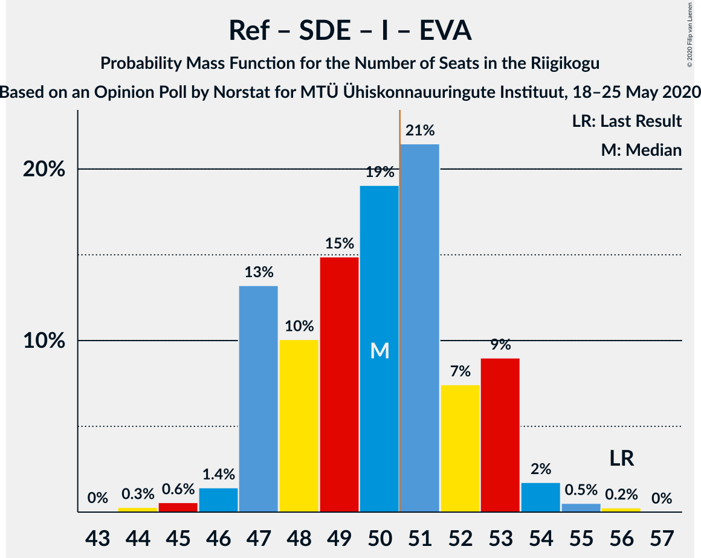

# Opinion Poll by Norstat for MTÜ Ühiskonnauuringute Instituut, 18–25 May 2020

<a href="#voting-intentions">Voting Intentions</a> | <a href="#seats">Seats</a> | <a href="#coalitions">Coalitions</a> | <a href="#technical-information">Technical Information</a>

## Voting Intentions

### Confidence Intervals

| Party | Last Result | Poll Result | 80% Confidence Interval | 90% Confidence Interval | 95% Confidence Interval | 99% Confidence Interval |
|:-----:|:-----------:|:-----------:|:-----------------------:|:-----------------------:|:-----------------------:|:-----------------------:|
| Eesti Reformierakond | 28.9% | 32.4% | 30.5–34.3% |30.0–34.9% |29.6–35.4% |28.7–36.3% |
| Eesti Keskerakond | 23.1% | 27.1% | 25.3–29.0% |24.9–29.5% |24.4–29.9% |23.6–30.8% |
| Eesti Konservatiivne Rahvaerakond | 17.8% | 12.4% | 11.1–13.8% |10.8–14.2% |10.5–14.6% |9.9–15.3% |
| Sotsiaaldemokraatlik Erakond | 9.8% | 7.4% | 6.4–8.6% |6.2–8.9% |5.9–9.2% |5.5–9.8% |
| Eesti 200 | 4.4% | 7.3% | 6.3–8.5% |6.1–8.8% |5.8–9.1% |5.4–9.7% |
| Erakond Isamaa | 11.4% | 6.3% | 5.4–7.4% |5.2–7.7% |5.0–8.0% |4.6–8.5% |
| Erakond Eestimaa Rohelised | 1.8% | 3.8% | 3.1–4.7% |2.9–5.0% |2.8–5.2% |2.5–5.6% |
| Eesti Vabaerakond | 1.2% | 0.4% | 0.2–0.8% |0.2–0.9% |0.2–1.0% |0.1–1.3% |

*Note:* The poll result column reflects the actual value used in the calculations. Published results may vary slightly, and in addition be rounded to fewer digits.

## Seats

### Confidence Intervals

| Party | Last Result | Median | 80% Confidence Interval | 90% Confidence Interval | 95% Confidence Interval | 99% Confidence Interval |
|:-----:|:-----------:|:------:|:-----------------------:|:-----------------------:|:-----------------------:|:-----------------------:|
| <a href="#eesti-reformierakond">Eesti Reformierakond</a> | 34 | 37 | 34–39 |34–40 |34–40 |33–42 |
| <a href="#eesti-keskerakond">Eesti Keskerakond</a> | 26 | 31 | 28–34 |28–34 |27–34 |27–36 |
| <a href="#eesti-konservatiivne-rahvaerakond">Eesti Konservatiivne Rahvaerakond</a> | 19 | 13 | 12–15 |11–16 |11–16 |10–16 |
| <a href="#sotsiaaldemokraatlik-erakond">Sotsiaaldemokraatlik Erakond</a> | 10 | 7 | 6–9 |6–9 |6–9 |5–10 |
| <a href="#eesti-200">Eesti 200</a> | 0 | 7 | 5–8 |5–8 |5–8 |5–9 |
| <a href="#erakond-isamaa">Erakond Isamaa</a> | 12 | 6 | 5–7 |5–7 |4–8 |0–8 |
| <a href="#erakond-eestimaa-rohelised">Erakond Eestimaa Rohelised</a> | 0 | 0 | 0 |0 |0 |0–5 |
| <a href="#eesti-vabaerakond">Eesti Vabaerakond</a> | 0 | 0 | 0 |0 |0 |0 |

### Eesti Reformierakond

*For a full overview of the results for this party, see the [Eesti Reformierakond](party-eestireformierakond.html) page.*

| Number of Seats | Probability | Accumulated | Special Marks |
|:---------------:|:-----------:|:-----------:|:-------------:|
| 31 | 0% | 100% |  |
| 32 | 0.3% | 99.9% |  |
| 33 | 1.5% | 99.7% |  |
| 34 | 11% | 98% | Last Result |
| 35 | 13% | 87% |  |
| 36 | 18% | 73% |  |
| 37 | 19% | 55% | Median |
| 38 | 21% | 36% |  |
| 39 | 7% | 15% |  |
| 40 | 6% | 8% |  |
| 41 | 2% | 2% |  |
| 42 | 0.5% | 0.9% |  |
| 43 | 0.2% | 0.4% |  |
| 44 | 0.1% | 0.2% |  |
| 45 | 0.1% | 0.1% |  |
| 46 | 0% | 0% |  |

### Eesti Keskerakond

*For a full overview of the results for this party, see the [Eesti Keskerakond](party-eestikeskerakond.html) page.*

| Number of Seats | Probability | Accumulated | Special Marks |
|:---------------:|:-----------:|:-----------:|:-------------:|
| 25 | 0.2% | 100% |  |
| 26 | 0.2% | 99.8% | Last Result |
| 27 | 3% | 99.6% |  |
| 28 | 7% | 97% |  |
| 29 | 8% | 90% |  |
| 30 | 25% | 82% |  |
| 31 | 15% | 57% | Median |
| 32 | 17% | 42% |  |
| 33 | 12% | 25% |  |
| 34 | 11% | 13% |  |
| 35 | 1.5% | 2% |  |
| 36 | 0.5% | 0.8% |  |
| 37 | 0.2% | 0.2% |  |
| 38 | 0% | 0% |  |

### Eesti Konservatiivne Rahvaerakond

*For a full overview of the results for this party, see the [Eesti Konservatiivne Rahvaerakond](party-eestikonservatiivnerahvaerakond.html) page.*

| Number of Seats | Probability | Accumulated | Special Marks |
|:---------------:|:-----------:|:-----------:|:-------------:|
| 9 | 0.1% | 100% |  |
| 10 | 1.1% | 99.9% |  |
| 11 | 5% | 98.8% |  |
| 12 | 20% | 94% |  |
| 13 | 31% | 74% | Median |
| 14 | 28% | 43% |  |
| 15 | 9% | 15% |  |
| 16 | 6% | 6% |  |
| 17 | 0.3% | 0.3% |  |
| 18 | 0% | 0% |  |
| 19 | 0% | 0% | Last Result |

### Sotsiaaldemokraatlik Erakond

*For a full overview of the results for this party, see the [Sotsiaaldemokraatlik Erakond](party-sotsiaaldemokraatlikerakond.html) page.*

| Number of Seats | Probability | Accumulated | Special Marks |
|:---------------:|:-----------:|:-----------:|:-------------:|
| 4 | 0% | 100% |  |
| 5 | 2% | 99.9% |  |
| 6 | 19% | 98% |  |
| 7 | 38% | 79% | Median |
| 8 | 30% | 41% |  |
| 9 | 9% | 11% |  |
| 10 | 1.5% | 2% | Last Result |
| 11 | 0.1% | 0.1% |  |
| 12 | 0% | 0% |  |

### Eesti 200

*For a full overview of the results for this party, see the [Eesti 200](party-eesti200.html) page.*

| Number of Seats | Probability | Accumulated | Special Marks |
|:---------------:|:-----------:|:-----------:|:-------------:|
| 0 | 0.1% | 100% | Last Result |
| 1 | 0% | 99.9% |  |
| 2 | 0% | 99.9% |  |
| 3 | 0% | 99.9% |  |
| 4 | 0.4% | 99.9% |  |
| 5 | 14% | 99.5% |  |
| 6 | 30% | 86% |  |
| 7 | 34% | 56% | Median |
| 8 | 20% | 22% |  |
| 9 | 1.5% | 2% |  |
| 10 | 0.2% | 0.2% |  |
| 11 | 0% | 0% |  |

### Erakond Isamaa

*For a full overview of the results for this party, see the [Erakond Isamaa](party-erakondisamaa.html) page.*

| Number of Seats | Probability | Accumulated | Special Marks |
|:---------------:|:-----------:|:-----------:|:-------------:|
| 0 | 2% | 100% |  |
| 1 | 0% | 98% |  |
| 2 | 0% | 98% |  |
| 3 | 0% | 98% |  |
| 4 | 2% | 98% |  |
| 5 | 25% | 95% |  |
| 6 | 51% | 70% | Median |
| 7 | 15% | 19% |  |
| 8 | 4% | 5% |  |
| 9 | 0.3% | 0.3% |  |
| 10 | 0% | 0% |  |
| 11 | 0% | 0% |  |
| 12 | 0% | 0% | Last Result |

### Erakond Eestimaa Rohelised

*For a full overview of the results for this party, see the [Erakond Eestimaa Rohelised](party-erakondeestimaarohelised.html) page.*

| Number of Seats | Probability | Accumulated | Special Marks |
|:---------------:|:-----------:|:-----------:|:-------------:|
| 0 | 98% | 100% | Last Result, Median |
| 1 | 0% | 2% |  |
| 2 | 0% | 2% |  |
| 3 | 0% | 2% |  |
| 4 | 1.0% | 2% |  |
| 5 | 0.7% | 0.7% |  |
| 6 | 0% | 0% |  |

### Eesti Vabaerakond

*For a full overview of the results for this party, see the [Eesti Vabaerakond](party-eestivabaerakond.html) page.*

| Number of Seats | Probability | Accumulated | Special Marks |
|:---------------:|:-----------:|:-----------:|:-------------:|
| 0 | 100% | 100% | Last Result, Median |

## Coalitions

### Confidence Intervals

| Coalition | Last Result | Median | Majority? | 80% Confidence Interval | 90% Confidence Interval | 95% Confidence Interval | 99% Confidence Interval |
|:---------:|:-----------:|:------:|:---------:|:-----------------------:|:-----------------------:|:-----------------------:|:-----------------------:|
| Eesti Reformierakond – Eesti Keskerakond – Eesti Konservatiivne Rahvaerakond | 79 | 81 | 100% | 79–83 | 78–84 | 78–85 | 77–87 |
| Eesti Reformierakond – Eesti Keskerakond | 60 | 68 | 100% | 65–70 | 65–71 | 64–71 | 63–74 |
| Eesti Reformierakond – Eesti Konservatiivne Rahvaerakond – Erakond Isamaa | 65 | 55 | 99.5% | 53–59 | 53–59 | 53–60 | 50–61 |
| Eesti Reformierakond – Sotsiaaldemokraatlik Erakond – Erakond Isamaa – Eesti Vabaerakond | 56 | 50 | 40% | 47–53 | 47–53 | 47–54 | 45–55 |
| Eesti Reformierakond – Sotsiaaldemokraatlik Erakond – Erakond Isamaa | 56 | 50 | 40% | 47–53 | 47–53 | 47–54 | 45–55 |
| Eesti Reformierakond – Eesti Konservatiivne Rahvaerakond | 53 | 50 | 40% | 47–53 | 47–54 | 46–54 | 45–56 |
| Eesti Keskerakond – Eesti Konservatiivne Rahvaerakond – Erakond Isamaa | 57 | 50 | 40% | 47–53 | 47–53 | 46–53 | 44–55 |
| Eesti Keskerakond – Eesti Konservatiivne Rahvaerakond | 45 | 44 | 0% | 42–47 | 41–47 | 41–48 | 39–49 |
| Eesti Reformierakond – Sotsiaaldemokraatlik Erakond | 44 | 44 | 0.2% | 41–47 | 41–47 | 41–48 | 39–50 |
| Eesti Keskerakond – Sotsiaaldemokraatlik Erakond – Erakond Isamaa | 48 | 44 | 0% | 41–47 | 41–48 | 40–48 | 38–49 |
| Eesti Reformierakond – Erakond Isamaa | 46 | 43 | 0% | 40–45 | 40–46 | 39–46 | 38–48 |
| Eesti Keskerakond – Sotsiaaldemokraatlik Erakond | 36 | 38 | 0% | 36–41 | 35–41 | 34–42 | 33–44 |
| Eesti Konservatiivne Rahvaerakond – Sotsiaaldemokraatlik Erakond | 29 | 20 | 0% | 19–22 | 19–23 | 17–23 | 16–24 |

### Eesti Reformierakond – Eesti Keskerakond – Eesti Konservatiivne Rahvaerakond

| Number of Seats | Probability | Accumulated | Special Marks |
|:---------------:|:-----------:|:-----------:|:-------------:|
| 75 | 0.2% | 100% |  |
| 76 | 0.2% | 99.8% |  |
| 77 | 0.6% | 99.6% |  |
| 78 | 5% | 99.0% |  |
| 79 | 12% | 94% | Last Result |
| 80 | 18% | 82% |  |
| 81 | 18% | 64% | Median |
| 82 | 29% | 46% |  |
| 83 | 9% | 17% |  |
| 84 | 5% | 8% |  |
| 85 | 0.7% | 3% |  |
| 86 | 0.5% | 2% |  |
| 87 | 0.9% | 1.4% |  |
| 88 | 0.2% | 0.4% |  |
| 89 | 0.2% | 0.2% |  |
| 90 | 0% | 0% |  |

### Eesti Reformierakond – Eesti Keskerakond

| Number of Seats | Probability | Accumulated | Special Marks |
|:---------------:|:-----------:|:-----------:|:-------------:|
| 60 | 0% | 100% | Last Result |
| 61 | 0% | 100% |  |
| 62 | 0.2% | 100% |  |
| 63 | 0.3% | 99.8% |  |
| 64 | 2% | 99.4% |  |
| 65 | 10% | 97% |  |
| 66 | 13% | 87% |  |
| 67 | 13% | 73% |  |
| 68 | 21% | 61% | Median |
| 69 | 21% | 39% |  |
| 70 | 13% | 18% |  |
| 71 | 3% | 5% |  |
| 72 | 1.2% | 2% |  |
| 73 | 0.6% | 1.2% |  |
| 74 | 0.5% | 0.7% |  |
| 75 | 0.1% | 0.2% |  |
| 76 | 0.1% | 0.1% |  |
| 77 | 0% | 0% |  |

### Eesti Reformierakond – Eesti Konservatiivne Rahvaerakond – Erakond Isamaa

| Number of Seats | Probability | Accumulated | Special Marks |
|:---------------:|:-----------:|:-----------:|:-------------:|
| 48 | 0.1% | 100% |  |
| 49 | 0% | 99.9% |  |
| 50 | 0.4% | 99.9% |  |
| 51 | 0.7% | 99.5% | Majority |
| 52 | 1.2% | 98.8% |  |
| 53 | 11% | 98% |  |
| 54 | 12% | 86% |  |
| 55 | 24% | 74% |  |
| 56 | 10% | 50% | Median |
| 57 | 14% | 40% |  |
| 58 | 16% | 27% |  |
| 59 | 6% | 11% |  |
| 60 | 4% | 5% |  |
| 61 | 0.9% | 1.1% |  |
| 62 | 0.1% | 0.2% |  |
| 63 | 0% | 0.1% |  |
| 64 | 0% | 0% |  |
| 65 | 0% | 0% | Last Result |

### Eesti Reformierakond – Sotsiaaldemokraatlik Erakond – Erakond Isamaa – Eesti Vabaerakond

| Number of Seats | Probability | Accumulated | Special Marks |
|:---------------:|:-----------:|:-----------:|:-------------:|
| 43 | 0% | 100% |  |
| 44 | 0.3% | 99.9% |  |
| 45 | 0.6% | 99.6% |  |
| 46 | 1.4% | 99.1% |  |
| 47 | 13% | 98% |  |
| 48 | 10% | 84% |  |
| 49 | 15% | 74% |  |
| 50 | 19% | 59% | Median |
| 51 | 21% | 40% | Majority |
| 52 | 7% | 19% |  |
| 53 | 9% | 12% |  |
| 54 | 2% | 3% |  |
| 55 | 0.5% | 0.8% |  |
| 56 | 0.2% | 0.3% | Last Result |
| 57 | 0% | 0% |  |

### Eesti Reformierakond – Sotsiaaldemokraatlik Erakond – Erakond Isamaa

| Number of Seats | Probability | Accumulated | Special Marks |
|:---------------:|:-----------:|:-----------:|:-------------:|
| 43 | 0% | 100% |  |
| 44 | 0.3% | 99.9% |  |
| 45 | 0.6% | 99.6% |  |
| 46 | 1.4% | 99.1% |  |
| 47 | 13% | 98% |  |
| 48 | 10% | 84% |  |
| 49 | 15% | 74% |  |
| 50 | 19% | 59% | Median |
| 51 | 21% | 40% | Majority |
| 52 | 7% | 19% |  |
| 53 | 9% | 12% |  |
| 54 | 2% | 3% |  |
| 55 | 0.5% | 0.8% |  |
| 56 | 0.2% | 0.3% | Last Result |
| 57 | 0% | 0% |  |

### Eesti Reformierakond – Eesti Konservatiivne Rahvaerakond

| Number of Seats | Probability | Accumulated | Special Marks |
|:---------------:|:-----------:|:-----------:|:-------------:|
| 44 | 0.1% | 100% |  |
| 45 | 0.4% | 99.8% |  |
| 46 | 4% | 99.4% |  |
| 47 | 9% | 96% |  |
| 48 | 7% | 86% |  |
| 49 | 23% | 80% |  |
| 50 | 17% | 57% | Median |
| 51 | 11% | 40% | Majority |
| 52 | 17% | 29% |  |
| 53 | 4% | 11% | Last Result |
| 54 | 5% | 7% |  |
| 55 | 1.0% | 2% |  |
| 56 | 0.9% | 1.2% |  |
| 57 | 0.2% | 0.2% |  |
| 58 | 0% | 0.1% |  |
| 59 | 0% | 0% |  |

### Eesti Keskerakond – Eesti Konservatiivne Rahvaerakond – Erakond Isamaa

| Number of Seats | Probability | Accumulated | Special Marks |
|:---------------:|:-----------:|:-----------:|:-------------:|
| 42 | 0.1% | 100% |  |
| 43 | 0.1% | 99.9% |  |
| 44 | 0.6% | 99.8% |  |
| 45 | 0.9% | 99.1% |  |
| 46 | 2% | 98% |  |
| 47 | 8% | 96% |  |
| 48 | 4% | 88% |  |
| 49 | 19% | 85% |  |
| 50 | 27% | 66% | Median |
| 51 | 12% | 40% | Majority |
| 52 | 10% | 27% |  |
| 53 | 15% | 17% |  |
| 54 | 0.7% | 2% |  |
| 55 | 0.7% | 1.0% |  |
| 56 | 0.3% | 0.3% |  |
| 57 | 0% | 0% | Last Result |

### Eesti Keskerakond – Eesti Konservatiivne Rahvaerakond

| Number of Seats | Probability | Accumulated | Special Marks |
|:---------------:|:-----------:|:-----------:|:-------------:|
| 37 | 0.1% | 100% |  |
| 38 | 0.3% | 99.9% |  |
| 39 | 0.6% | 99.6% |  |
| 40 | 1.0% | 99.0% |  |
| 41 | 6% | 98% |  |
| 42 | 6% | 92% |  |
| 43 | 16% | 86% |  |
| 44 | 30% | 71% | Median |
| 45 | 13% | 41% | Last Result |
| 46 | 10% | 28% |  |
| 47 | 15% | 18% |  |
| 48 | 2% | 3% |  |
| 49 | 1.0% | 1.5% |  |
| 50 | 0.4% | 0.5% |  |
| 51 | 0% | 0% | Majority |

### Eesti Reformierakond – Sotsiaaldemokraatlik Erakond

| Number of Seats | Probability | Accumulated | Special Marks |
|:---------------:|:-----------:|:-----------:|:-------------:|
| 38 | 0.1% | 100% |  |
| 39 | 0.7% | 99.9% |  |
| 40 | 0.5% | 99.2% |  |
| 41 | 14% | 98.8% |  |
| 42 | 6% | 85% |  |
| 43 | 22% | 79% |  |
| 44 | 19% | 58% | Last Result, Median |
| 45 | 10% | 39% |  |
| 46 | 15% | 29% |  |
| 47 | 9% | 13% |  |
| 48 | 2% | 4% |  |
| 49 | 1.3% | 2% |  |
| 50 | 0.4% | 0.6% |  |
| 51 | 0.1% | 0.2% | Majority |
| 52 | 0% | 0% |  |

### Eesti Keskerakond – Sotsiaaldemokraatlik Erakond – Erakond Isamaa

| Number of Seats | Probability | Accumulated | Special Marks |
|:---------------:|:-----------:|:-----------:|:-------------:|
| 36 | 0.1% | 100% |  |
| 37 | 0.1% | 99.9% |  |
| 38 | 0.6% | 99.8% |  |
| 39 | 1.2% | 99.2% |  |
| 40 | 3% | 98% |  |
| 41 | 5% | 95% |  |
| 42 | 13% | 90% |  |
| 43 | 13% | 77% |  |
| 44 | 19% | 64% | Median |
| 45 | 17% | 45% |  |
| 46 | 11% | 28% |  |
| 47 | 11% | 16% |  |
| 48 | 4% | 5% | Last Result |
| 49 | 0.5% | 0.6% |  |
| 50 | 0.1% | 0.1% |  |
| 51 | 0% | 0% | Majority |

### Eesti Reformierakond – Erakond Isamaa

| Number of Seats | Probability | Accumulated | Special Marks |
|:---------------:|:-----------:|:-----------:|:-------------:|
| 35 | 0% | 100% |  |
| 36 | 0.1% | 99.9% |  |
| 37 | 0.3% | 99.9% |  |
| 38 | 0.4% | 99.6% |  |
| 39 | 2% | 99.2% |  |
| 40 | 11% | 97% |  |
| 41 | 17% | 86% |  |
| 42 | 16% | 69% |  |
| 43 | 22% | 53% | Median |
| 44 | 15% | 31% |  |
| 45 | 10% | 16% |  |
| 46 | 5% | 6% | Last Result |
| 47 | 0.8% | 1.4% |  |
| 48 | 0.2% | 0.6% |  |
| 49 | 0.3% | 0.3% |  |
| 50 | 0.1% | 0.1% |  |
| 51 | 0% | 0% | Majority |

### Eesti Keskerakond – Sotsiaaldemokraatlik Erakond

| Number of Seats | Probability | Accumulated | Special Marks |
|:---------------:|:-----------:|:-----------:|:-------------:|
| 32 | 0.1% | 100% |  |
| 33 | 0.5% | 99.9% |  |
| 34 | 2% | 99.4% |  |
| 35 | 5% | 97% |  |
| 36 | 14% | 92% | Last Result |
| 37 | 11% | 78% |  |
| 38 | 20% | 67% | Median |
| 39 | 15% | 47% |  |
| 40 | 11% | 32% |  |
| 41 | 16% | 20% |  |
| 42 | 3% | 4% |  |
| 43 | 0.8% | 1.3% |  |
| 44 | 0.4% | 0.5% |  |
| 45 | 0% | 0.1% |  |
| 46 | 0.1% | 0.1% |  |
| 47 | 0% | 0% |  |

### Eesti Konservatiivne Rahvaerakond – Sotsiaaldemokraatlik Erakond

| Number of Seats | Probability | Accumulated | Special Marks |
|:---------------:|:-----------:|:-----------:|:-------------:|
| 15 | 0.2% | 100% |  |
| 16 | 0.9% | 99.8% |  |
| 17 | 2% | 98.9% |  |
| 18 | 2% | 97% |  |
| 19 | 8% | 96% |  |
| 20 | 40% | 88% | Median |
| 21 | 21% | 48% |  |
| 22 | 22% | 27% |  |
| 23 | 5% | 6% |  |
| 24 | 0.8% | 0.8% |  |
| 25 | 0% | 0% |  |
| 26 | 0% | 0% |  |
| 27 | 0% | 0% |  |
| 28 | 0% | 0% |  |
| 29 | 0% | 0% | Last Result |

## Technical Information

### Opinion Poll

+ **Polling firm:** Norstat
+ **Commissioner(s):** MTÜ Ühiskonnauuringute Instituut
+ **Fieldwork period:** 18–25 May 2020

### Calculations

+ **Sample size:** 1000
+ **Simulations done:** 131,072
+ **Error estimate:** 2.30%

