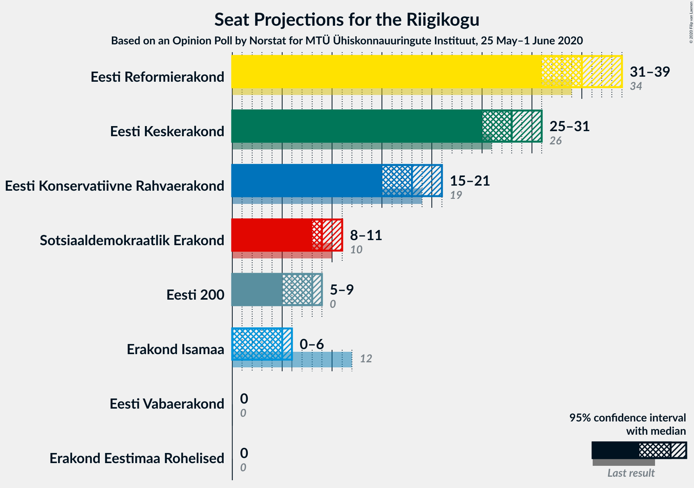
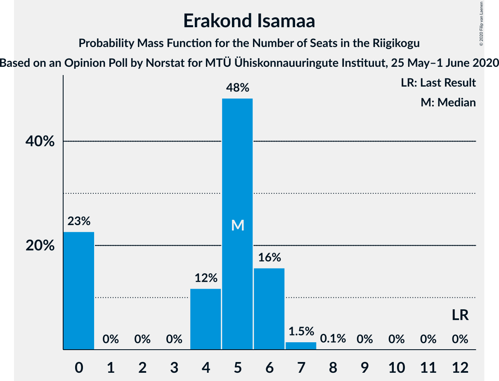
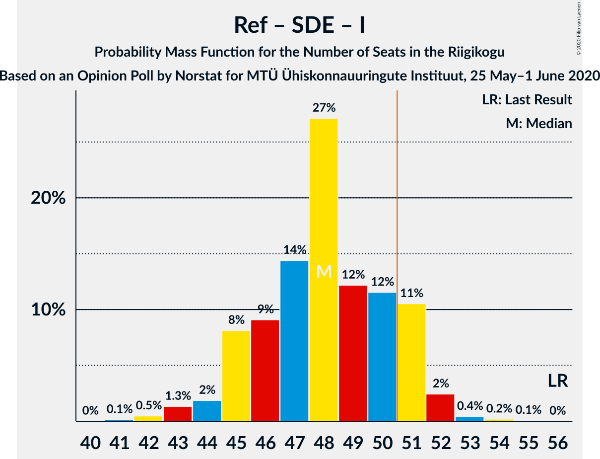

# Opinion Poll by Norstat for MTÜ Ühiskonnauuringute Instituut, 25 May–1 June 2020

<a href="#voting-intentions">Voting Intentions</a> | <a href="#seats">Seats</a> | <a href="#coalitions">Coalitions</a> | <a href="#technical-information">Technical Information</a>

## Voting Intentions

### Confidence Intervals

| Party | Last Result | Poll Result | 80% Confidence Interval | 90% Confidence Interval | 95% Confidence Interval | 99% Confidence Interval |
|:-----:|:-----------:|:-----------:|:-----------------------:|:-----------------------:|:-----------------------:|:-----------------------:|
| Eesti Reformierakond | 28.9% | 30.8% | 29.0–32.7% |28.5–33.3% |28.0–33.7% |27.2–34.7% |
| Eesti Keskerakond | 23.1% | 24.5% | 22.8–26.3% |22.3–26.8% |21.9–27.3% |21.1–28.2% |
| Eesti Konservatiivne Rahvaerakond | 17.8% | 16.7% | 15.3–18.3% |14.9–18.7% |14.5–19.1% |13.9–19.9% |
| Sotsiaaldemokraatlik Erakond | 9.8% | 9.3% | 8.2–10.6% |7.9–10.9% |7.7–11.3% |7.2–11.9% |
| Eesti 200 | 4.4% | 7.7% | 6.7–8.9% |6.4–9.2% |6.2–9.5% |5.8–10.1% |
| Erakond Isamaa | 11.4% | 5.6% | 4.8–6.6% |4.5–7.0% |4.3–7.2% |4.0–7.7% |
| Erakond Eestimaa Rohelised | 1.8% | 1.4% | 1.0–2.0% |0.9–2.2% |0.8–2.3% |0.7–2.7% |
| Eesti Vabaerakond | 1.2% | 0.3% | 0.2–0.7% |0.1–0.8% |0.1–0.9% |0.1–1.1% |

*Note:* The poll result column reflects the actual value used in the calculations. Published results may vary slightly, and in addition be rounded to fewer digits.

## Seats

### Confidence Intervals

| Party | Last Result | Median | 80% Confidence Interval | 90% Confidence Interval | 95% Confidence Interval | 99% Confidence Interval |
|:-----:|:-----------:|:------:|:-----------------------:|:-----------------------:|:-----------------------:|:-----------------------:|
| <a href="#eesti-reformierakond">Eesti Reformierakond</a> | 34 | 35 | 33–37 |32–38 |31–39 |31–40 |
| <a href="#eesti-keskerakond">Eesti Keskerakond</a> | 26 | 28 | 26–30 |26–30 |25–31 |23–32 |
| <a href="#eesti-konservatiivne-rahvaerakond">Eesti Konservatiivne Rahvaerakond</a> | 19 | 18 | 16–20 |15–20 |15–21 |14–21 |
| <a href="#sotsiaaldemokraatlik-erakond">Sotsiaaldemokraatlik Erakond</a> | 10 | 9 | 8–10 |8–11 |8–11 |7–12 |
| <a href="#eesti-200">Eesti 200</a> | 0 | 8 | 6–8 |6–9 |5–9 |5–10 |
| <a href="#erakond-isamaa">Erakond Isamaa</a> | 12 | 5 | 0–6 |0–6 |0–6 |0–7 |
| <a href="#erakond-eestimaa-rohelised">Erakond Eestimaa Rohelised</a> | 0 | 0 | 0 |0 |0 |0 |
| <a href="#eesti-vabaerakond">Eesti Vabaerakond</a> | 0 | 0 | 0 |0 |0 |0 |

### Eesti Reformierakond

*For a full overview of the results for this party, see the [Eesti Reformierakond](party-eestireformierakond.html) page.*

| Number of Seats | Probability | Accumulated | Special Marks |
|:---------------:|:-----------:|:-----------:|:-------------:|
| 29 | 0.1% | 100% |  |
| 30 | 0.2% | 99.9% |  |
| 31 | 3% | 99.7% |  |
| 32 | 3% | 97% |  |
| 33 | 11% | 94% |  |
| 34 | 20% | 83% | Last Result |
| 35 | 29% | 62% | Median |
| 36 | 13% | 34% |  |
| 37 | 12% | 21% |  |
| 38 | 5% | 9% |  |
| 39 | 4% | 4% |  |
| 40 | 0.6% | 0.7% |  |
| 41 | 0% | 0.1% |  |
| 42 | 0.1% | 0.1% |  |
| 43 | 0% | 0% |  |

### Eesti Keskerakond

*For a full overview of the results for this party, see the [Eesti Keskerakond](party-eestikeskerakond.html) page.*

| Number of Seats | Probability | Accumulated | Special Marks |
|:---------------:|:-----------:|:-----------:|:-------------:|
| 22 | 0.3% | 100% |  |
| 23 | 0.3% | 99.6% |  |
| 24 | 0.5% | 99.3% |  |
| 25 | 3% | 98.8% |  |
| 26 | 23% | 96% | Last Result |
| 27 | 19% | 73% |  |
| 28 | 28% | 55% | Median |
| 29 | 13% | 27% |  |
| 30 | 10% | 14% |  |
| 31 | 2% | 3% |  |
| 32 | 1.2% | 1.2% |  |
| 33 | 0% | 0% |  |

### Eesti Konservatiivne Rahvaerakond

*For a full overview of the results for this party, see the [Eesti Konservatiivne Rahvaerakond](party-eestikonservatiivnerahvaerakond.html) page.*

| Number of Seats | Probability | Accumulated | Special Marks |
|:---------------:|:-----------:|:-----------:|:-------------:|
| 13 | 0.3% | 100% |  |
| 14 | 0.6% | 99.7% |  |
| 15 | 6% | 99.0% |  |
| 16 | 8% | 93% |  |
| 17 | 29% | 84% |  |
| 18 | 16% | 56% | Median |
| 19 | 28% | 40% | Last Result |
| 20 | 9% | 12% |  |
| 21 | 3% | 4% |  |
| 22 | 0.4% | 0.4% |  |
| 23 | 0.1% | 0.1% |  |
| 24 | 0% | 0% |  |

### Sotsiaaldemokraatlik Erakond

*For a full overview of the results for this party, see the [Sotsiaaldemokraatlik Erakond](party-sotsiaaldemokraatlikerakond.html) page.*

| Number of Seats | Probability | Accumulated | Special Marks |
|:---------------:|:-----------:|:-----------:|:-------------:|
| 6 | 0.3% | 100% |  |
| 7 | 2% | 99.7% |  |
| 8 | 21% | 98% |  |
| 9 | 54% | 77% | Median |
| 10 | 16% | 23% | Last Result |
| 11 | 6% | 7% |  |
| 12 | 0.7% | 1.0% |  |
| 13 | 0.3% | 0.3% |  |
| 14 | 0% | 0% |  |

### Eesti 200

*For a full overview of the results for this party, see the [Eesti 200](party-eesti200.html) page.*

| Number of Seats | Probability | Accumulated | Special Marks |
|:---------------:|:-----------:|:-----------:|:-------------:|
| 0 | 0% | 100% | Last Result |
| 1 | 0% | 100% |  |
| 2 | 0% | 100% |  |
| 3 | 0% | 100% |  |
| 4 | 0% | 100% |  |
| 5 | 4% | 100% |  |
| 6 | 19% | 96% |  |
| 7 | 24% | 77% |  |
| 8 | 43% | 53% | Median |
| 9 | 9% | 10% |  |
| 10 | 0.5% | 0.5% |  |
| 11 | 0% | 0% |  |

### Erakond Isamaa

*For a full overview of the results for this party, see the [Erakond Isamaa](party-erakondisamaa.html) page.*

| Number of Seats | Probability | Accumulated | Special Marks |
|:---------------:|:-----------:|:-----------:|:-------------:|
| 0 | 23% | 100% |  |
| 1 | 0% | 77% |  |
| 2 | 0% | 77% |  |
| 3 | 0% | 77% |  |
| 4 | 12% | 77% |  |
| 5 | 48% | 66% | Median |
| 6 | 16% | 17% |  |
| 7 | 1.5% | 2% |  |
| 8 | 0.1% | 0.1% |  |
| 9 | 0% | 0% |  |
| 10 | 0% | 0% |  |
| 11 | 0% | 0% |  |
| 12 | 0% | 0% | Last Result |

### Erakond Eestimaa Rohelised

*For a full overview of the results for this party, see the [Erakond Eestimaa Rohelised](party-erakondeestimaarohelised.html) page.*

| Number of Seats | Probability | Accumulated | Special Marks |
|:---------------:|:-----------:|:-----------:|:-------------:|
| 0 | 100% | 100% | Last Result, Median |

### Eesti Vabaerakond

*For a full overview of the results for this party, see the [Eesti Vabaerakond](party-eestivabaerakond.html) page.*

| Number of Seats | Probability | Accumulated | Special Marks |
|:---------------:|:-----------:|:-----------:|:-------------:|
| 0 | 100% | 100% | Last Result, Median |

## Coalitions

### Confidence Intervals

| Coalition | Last Result | Median | Majority? | 80% Confidence Interval | 90% Confidence Interval | 95% Confidence Interval | 99% Confidence Interval |
|:---------:|:-----------:|:------:|:---------:|:-----------------------:|:-----------------------:|:-----------------------:|:-----------------------:|
| Eesti Reformierakond – Eesti Keskerakond – Eesti Konservatiivne Rahvaerakond | 79 | 80 | 100% | 78–84 | 78–85 | 77–85 | 76–87 |
| Eesti Reformierakond – Eesti Keskerakond | 60 | 63 | 100% | 60–67 | 60–67 | 59–67 | 58–69 |
| Eesti Reformierakond – Eesti Konservatiivne Rahvaerakond – Erakond Isamaa | 65 | 57 | 99.7% | 55–59 | 54–59 | 53–60 | 52–61 |
| Eesti Reformierakond – Eesti Konservatiivne Rahvaerakond | 53 | 53 | 88% | 50–56 | 49–56 | 49–57 | 48–58 |
| Eesti Keskerakond – Eesti Konservatiivne Rahvaerakond – Erakond Isamaa | 57 | 50 | 26% | 47–52 | 46–53 | 45–53 | 44–54 |
| Eesti Reformierakond – Sotsiaaldemokraatlik Erakond – Erakond Isamaa – Eesti Vabaerakond | 56 | 48 | 14% | 45–51 | 45–51 | 44–52 | 42–53 |
| Eesti Reformierakond – Sotsiaaldemokraatlik Erakond – Erakond Isamaa | 56 | 48 | 14% | 45–51 | 45–51 | 44–52 | 42–53 |
| Eesti Keskerakond – Eesti Konservatiivne Rahvaerakond | 45 | 45 | 0.4% | 43–48 | 43–48 | 42–49 | 40–50 |
| Eesti Reformierakond – Sotsiaaldemokraatlik Erakond | 44 | 44 | 0.1% | 42–46 | 41–48 | 40–48 | 39–50 |
| Eesti Keskerakond – Sotsiaaldemokraatlik Erakond – Erakond Isamaa | 48 | 41 | 0% | 37–43 | 37–44 | 36–45 | 36–46 |
| Eesti Reformierakond – Erakond Isamaa | 46 | 39 | 0% | 36–41 | 36–42 | 34–43 | 33–44 |
| Eesti Keskerakond – Sotsiaaldemokraatlik Erakond | 36 | 37 | 0% | 35–39 | 35–40 | 34–40 | 31–41 |
| Eesti Konservatiivne Rahvaerakond – Sotsiaaldemokraatlik Erakond | 29 | 27 | 0% | 25–29 | 24–29 | 23–30 | 23–32 |

### Eesti Reformierakond – Eesti Keskerakond – Eesti Konservatiivne Rahvaerakond

| Number of Seats | Probability | Accumulated | Special Marks |
|:---------------:|:-----------:|:-----------:|:-------------:|
| 73 | 0% | 100% |  |
| 74 | 0% | 99.9% |  |
| 75 | 0.3% | 99.9% |  |
| 76 | 1.1% | 99.6% |  |
| 77 | 3% | 98.6% |  |
| 78 | 11% | 95% |  |
| 79 | 27% | 84% | Last Result |
| 80 | 21% | 58% |  |
| 81 | 4% | 37% | Median |
| 82 | 7% | 32% |  |
| 83 | 7% | 26% |  |
| 84 | 10% | 19% |  |
| 85 | 8% | 9% |  |
| 86 | 0.5% | 1.0% |  |
| 87 | 0.5% | 0.5% |  |
| 88 | 0% | 0% |  |

### Eesti Reformierakond – Eesti Keskerakond

| Number of Seats | Probability | Accumulated | Special Marks |
|:---------------:|:-----------:|:-----------:|:-------------:|
| 56 | 0.1% | 100% |  |
| 57 | 0.1% | 99.9% |  |
| 58 | 2% | 99.8% |  |
| 59 | 1.3% | 98% |  |
| 60 | 21% | 96% | Last Result |
| 61 | 10% | 75% |  |
| 62 | 11% | 65% |  |
| 63 | 18% | 54% | Median |
| 64 | 19% | 36% |  |
| 65 | 3% | 17% |  |
| 66 | 3% | 14% |  |
| 67 | 9% | 11% |  |
| 68 | 1.3% | 2% |  |
| 69 | 0.8% | 1.1% |  |
| 70 | 0.3% | 0.3% |  |
| 71 | 0% | 0% |  |

### Eesti Reformierakond – Eesti Konservatiivne Rahvaerakond – Erakond Isamaa

| Number of Seats | Probability | Accumulated | Special Marks |
|:---------------:|:-----------:|:-----------:|:-------------:|
| 50 | 0.2% | 100% |  |
| 51 | 0.1% | 99.7% | Majority |
| 52 | 0.8% | 99.6% |  |
| 53 | 3% | 98.8% |  |
| 54 | 4% | 96% |  |
| 55 | 16% | 92% |  |
| 56 | 14% | 76% |  |
| 57 | 19% | 62% |  |
| 58 | 28% | 42% | Median |
| 59 | 10% | 15% |  |
| 60 | 2% | 4% |  |
| 61 | 2% | 2% |  |
| 62 | 0.2% | 0.4% |  |
| 63 | 0.1% | 0.2% |  |
| 64 | 0.1% | 0.1% |  |
| 65 | 0% | 0% | Last Result |

### Eesti Reformierakond – Eesti Konservatiivne Rahvaerakond

| Number of Seats | Probability | Accumulated | Special Marks |
|:---------------:|:-----------:|:-----------:|:-------------:|
| 47 | 0.2% | 100% |  |
| 48 | 2% | 99.8% |  |
| 49 | 5% | 98% |  |
| 50 | 6% | 93% |  |
| 51 | 9% | 88% | Majority |
| 52 | 21% | 79% |  |
| 53 | 21% | 58% | Last Result, Median |
| 54 | 16% | 37% |  |
| 55 | 9% | 22% |  |
| 56 | 8% | 13% |  |
| 57 | 4% | 4% |  |
| 58 | 0.4% | 0.7% |  |
| 59 | 0.2% | 0.3% |  |
| 60 | 0.1% | 0.1% |  |
| 61 | 0% | 0% |  |

### Eesti Keskerakond – Eesti Konservatiivne Rahvaerakond – Erakond Isamaa

| Number of Seats | Probability | Accumulated | Special Marks |
|:---------------:|:-----------:|:-----------:|:-------------:|
| 42 | 0% | 100% |  |
| 43 | 0.2% | 99.9% |  |
| 44 | 0.4% | 99.7% |  |
| 45 | 2% | 99.4% |  |
| 46 | 3% | 97% |  |
| 47 | 5% | 94% |  |
| 48 | 20% | 89% |  |
| 49 | 17% | 69% |  |
| 50 | 26% | 52% |  |
| 51 | 12% | 26% | Median, Majority |
| 52 | 9% | 15% |  |
| 53 | 4% | 5% |  |
| 54 | 1.3% | 2% |  |
| 55 | 0.3% | 0.4% |  |
| 56 | 0.1% | 0.1% |  |
| 57 | 0% | 0% | Last Result |

### Eesti Reformierakond – Sotsiaaldemokraatlik Erakond – Erakond Isamaa – Eesti Vabaerakond

| Number of Seats | Probability | Accumulated | Special Marks |
|:---------------:|:-----------:|:-----------:|:-------------:|
| 41 | 0.1% | 100% |  |
| 42 | 0.5% | 99.8% |  |
| 43 | 1.3% | 99.4% |  |
| 44 | 2% | 98% |  |
| 45 | 8% | 96% |  |
| 46 | 9% | 88% |  |
| 47 | 14% | 79% |  |
| 48 | 27% | 65% |  |
| 49 | 12% | 37% | Median |
| 50 | 12% | 25% |  |
| 51 | 11% | 14% | Majority |
| 52 | 2% | 3% |  |
| 53 | 0.4% | 0.7% |  |
| 54 | 0.2% | 0.3% |  |
| 55 | 0.1% | 0.1% |  |
| 56 | 0% | 0% | Last Result |

### Eesti Reformierakond – Sotsiaaldemokraatlik Erakond – Erakond Isamaa

| Number of Seats | Probability | Accumulated | Special Marks |
|:---------------:|:-----------:|:-----------:|:-------------:|
| 41 | 0.1% | 100% |  |
| 42 | 0.5% | 99.8% |  |
| 43 | 1.3% | 99.4% |  |
| 44 | 2% | 98% |  |
| 45 | 8% | 96% |  |
| 46 | 9% | 88% |  |
| 47 | 14% | 79% |  |
| 48 | 27% | 65% |  |
| 49 | 12% | 37% | Median |
| 50 | 12% | 25% |  |
| 51 | 11% | 14% | Majority |
| 52 | 2% | 3% |  |
| 53 | 0.4% | 0.7% |  |
| 54 | 0.2% | 0.3% |  |
| 55 | 0.1% | 0.1% |  |
| 56 | 0% | 0% | Last Result |

### Eesti Keskerakond – Eesti Konservatiivne Rahvaerakond

| Number of Seats | Probability | Accumulated | Special Marks |
|:---------------:|:-----------:|:-----------:|:-------------:|
| 38 | 0.1% | 100% |  |
| 39 | 0.1% | 99.9% |  |
| 40 | 0.4% | 99.8% |  |
| 41 | 0.3% | 99.4% |  |
| 42 | 2% | 99.1% |  |
| 43 | 12% | 97% |  |
| 44 | 9% | 85% |  |
| 45 | 36% | 76% | Last Result |
| 46 | 10% | 40% | Median |
| 47 | 6% | 30% |  |
| 48 | 19% | 23% |  |
| 49 | 3% | 4% |  |
| 50 | 1.2% | 2% |  |
| 51 | 0.3% | 0.4% | Majority |
| 52 | 0.1% | 0.1% |  |
| 53 | 0% | 0% |  |

### Eesti Reformierakond – Sotsiaaldemokraatlik Erakond

| Number of Seats | Probability | Accumulated | Special Marks |
|:---------------:|:-----------:|:-----------:|:-------------:|
| 38 | 0.3% | 100% |  |
| 39 | 0.4% | 99.7% |  |
| 40 | 2% | 99.3% |  |
| 41 | 4% | 97% |  |
| 42 | 7% | 94% |  |
| 43 | 32% | 86% |  |
| 44 | 17% | 54% | Last Result, Median |
| 45 | 12% | 37% |  |
| 46 | 16% | 25% |  |
| 47 | 4% | 9% |  |
| 48 | 3% | 5% |  |
| 49 | 1.3% | 2% |  |
| 50 | 0.9% | 1.0% |  |
| 51 | 0.1% | 0.1% | Majority |
| 52 | 0% | 0% |  |

### Eesti Keskerakond – Sotsiaaldemokraatlik Erakond – Erakond Isamaa

| Number of Seats | Probability | Accumulated | Special Marks |
|:---------------:|:-----------:|:-----------:|:-------------:|
| 32 | 0.1% | 100% |  |
| 33 | 0.1% | 99.9% |  |
| 34 | 0.1% | 99.9% |  |
| 35 | 0.2% | 99.8% |  |
| 36 | 3% | 99.6% |  |
| 37 | 7% | 97% |  |
| 38 | 3% | 89% |  |
| 39 | 9% | 87% |  |
| 40 | 22% | 78% |  |
| 41 | 27% | 56% |  |
| 42 | 9% | 28% | Median |
| 43 | 10% | 19% |  |
| 44 | 4% | 9% |  |
| 45 | 3% | 4% |  |
| 46 | 1.2% | 1.3% |  |
| 47 | 0.1% | 0.1% |  |
| 48 | 0% | 0% | Last Result |

### Eesti Reformierakond – Erakond Isamaa

| Number of Seats | Probability | Accumulated | Special Marks |
|:---------------:|:-----------:|:-----------:|:-------------:|
| 32 | 0.1% | 100% |  |
| 33 | 1.1% | 99.9% |  |
| 34 | 2% | 98.8% |  |
| 35 | 1.3% | 97% |  |
| 36 | 10% | 96% |  |
| 37 | 12% | 86% |  |
| 38 | 6% | 75% |  |
| 39 | 28% | 69% |  |
| 40 | 20% | 41% | Median |
| 41 | 11% | 21% |  |
| 42 | 6% | 10% |  |
| 43 | 2% | 4% |  |
| 44 | 2% | 2% |  |
| 45 | 0.1% | 0.2% |  |
| 46 | 0% | 0.1% | Last Result |
| 47 | 0% | 0% |  |

### Eesti Keskerakond – Sotsiaaldemokraatlik Erakond

| Number of Seats | Probability | Accumulated | Special Marks |
|:---------------:|:-----------:|:-----------:|:-------------:|
| 30 | 0.1% | 100% |  |
| 31 | 0.4% | 99.8% |  |
| 32 | 0.3% | 99.4% |  |
| 33 | 0.4% | 99.1% |  |
| 34 | 2% | 98.7% |  |
| 35 | 24% | 96% |  |
| 36 | 17% | 72% | Last Result |
| 37 | 29% | 55% | Median |
| 38 | 7% | 25% |  |
| 39 | 11% | 18% |  |
| 40 | 4% | 7% |  |
| 41 | 2% | 2% |  |
| 42 | 0.1% | 0.2% |  |
| 43 | 0.1% | 0.1% |  |
| 44 | 0% | 0% |  |

### Eesti Konservatiivne Rahvaerakond – Sotsiaaldemokraatlik Erakond

| Number of Seats | Probability | Accumulated | Special Marks |
|:---------------:|:-----------:|:-----------:|:-------------:|
| 21 | 0.1% | 100% |  |
| 22 | 0.3% | 99.9% |  |
| 23 | 3% | 99.6% |  |
| 24 | 2% | 97% |  |
| 25 | 14% | 95% |  |
| 26 | 23% | 81% |  |
| 27 | 15% | 58% | Median |
| 28 | 27% | 42% |  |
| 29 | 11% | 16% | Last Result |
| 30 | 3% | 5% |  |
| 31 | 0.9% | 2% |  |
| 32 | 0.9% | 0.9% |  |
| 33 | 0% | 0.1% |  |
| 34 | 0% | 0% |  |

## Technical Information

### Opinion Poll

+ **Polling firm:** Norstat
+ **Commissioner(s):** MTÜ Ühiskonnauuringute Instituut
+ **Fieldwork period:** 25 May–1 June 2020

### Calculations

+ **Sample size:** 1000
+ **Simulations done:** 131,072
+ **Error estimate:** 2.18%

