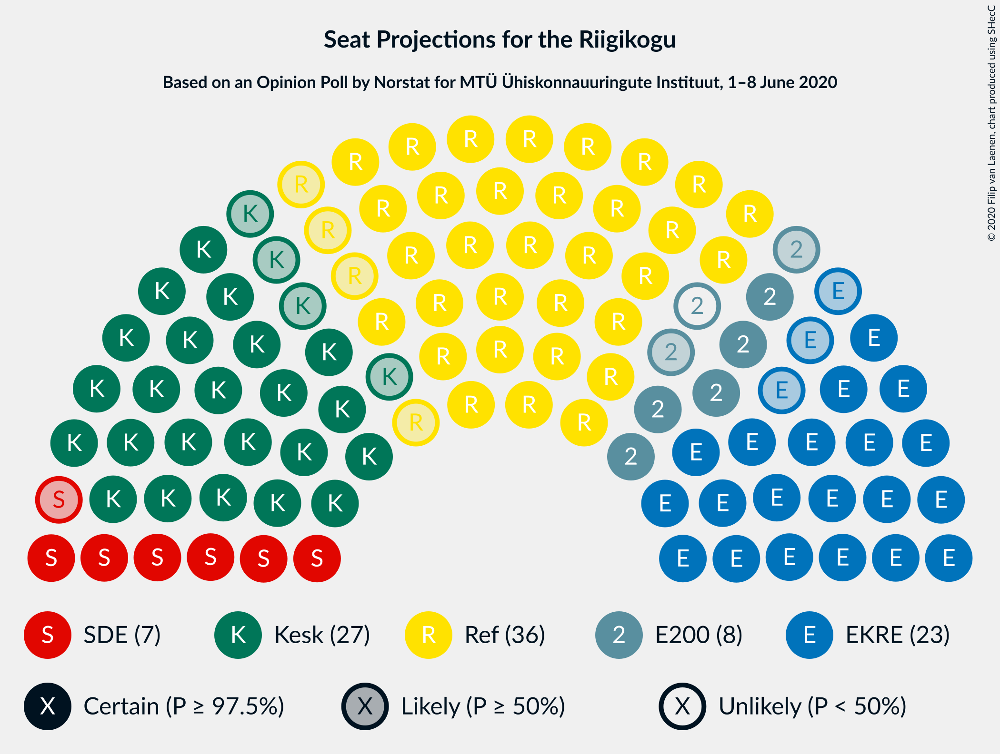
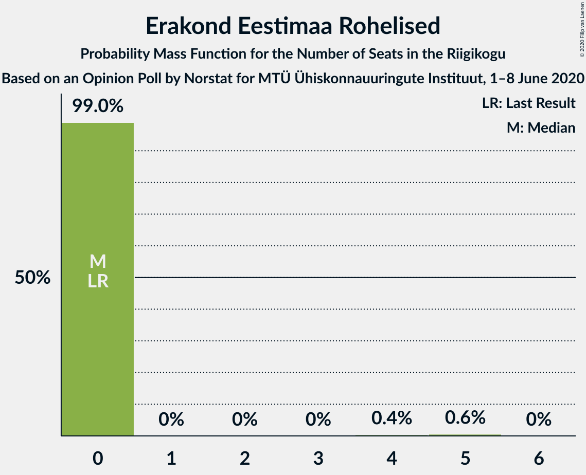
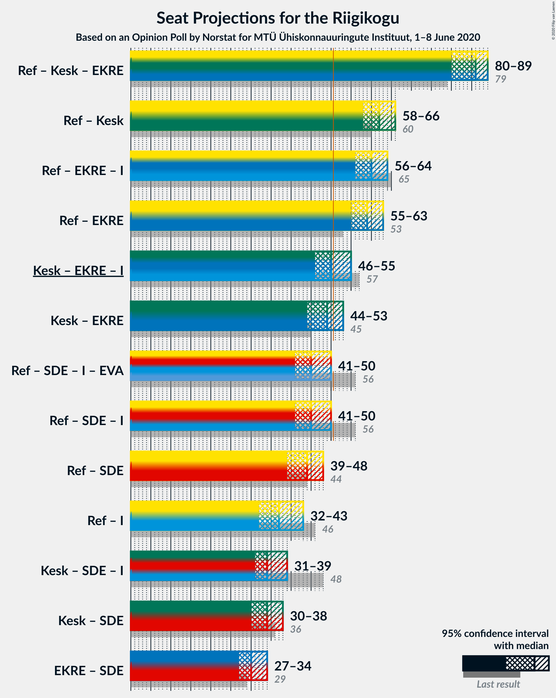

# Opinion Poll by Norstat for MTÜ Ühiskonnauuringute Instituut, 1–8 June 2020

<a href="#voting-intentions">Voting Intentions</a> | <a href="#seats">Seats</a> | <a href="#coalitions">Coalitions</a> | <a href="#technical-information">Technical Information</a>

## Voting Intentions

### Confidence Intervals

| Party | Last Result | Poll Result | 80% Confidence Interval | 90% Confidence Interval | 95% Confidence Interval | 99% Confidence Interval |
|:-----:|:-----------:|:-----------:|:-----------------------:|:-----------------------:|:-----------------------:|:-----------------------:|
| Eesti Reformierakond | 28.9% | 30.3% | 28.5–32.2% |28.0–32.8% |27.5–33.2% |26.7–34.2% |
| Eesti Keskerakond | 23.1% | 22.8% | 21.2–24.6% |20.7–25.1% |20.3–25.5% |19.5–26.4% |
| Eesti Konservatiivne Rahvaerakond | 17.8% | 20.3% | 18.7–22.0% |18.3–22.5% |17.9–22.9% |17.2–23.7% |
| Sotsiaaldemokraatlik Erakond | 9.8% | 7.6% | 6.6–8.8% |6.3–9.1% |6.1–9.4% |5.7–10.0% |
| Eesti 200 | 4.4% | 7.2% | 6.2–8.4% |6.0–8.7% |5.7–9.0% |5.3–9.6% |
| Erakond Isamaa | 11.4% | 4.7% | 3.9–5.7% |3.7–6.0% |3.6–6.2% |3.2–6.7% |
| Erakond Eestimaa Rohelised | 1.8% | 3.4% | 2.8–4.3% |2.6–4.5% |2.4–4.7% |2.2–5.2% |
| Eesti Vabaerakond | 1.2% | 0.4% | 0.2–0.8% |0.2–0.9% |0.2–1.0% |0.1–1.3% |

*Note:* The poll result column reflects the actual value used in the calculations. Published results may vary slightly, and in addition be rounded to fewer digits.

## Seats

### Confidence Intervals

| Party | Last Result | Median | 80% Confidence Interval | 90% Confidence Interval | 95% Confidence Interval | 99% Confidence Interval |
|:-----:|:-----------:|:------:|:-----------------------:|:-----------------------:|:-----------------------:|:-----------------------:|
| <a href="#eesti-reformierakond">Eesti Reformierakond</a> | 34 | 39 | 36–39 |35–39 |35–39 |33–39 |
| <a href="#eesti-keskerakond">Eesti Keskerakond</a> | 26 | 27 | 25–27 |22–27 |22–27 |22–27 |
| <a href="#eesti-konservatiivne-rahvaerakond">Eesti Konservatiivne Rahvaerakond</a> | 19 | 23 | 23 |22–24 |22–24 |22–24 |
| <a href="#sotsiaaldemokraatlik-erakond">Sotsiaaldemokraatlik Erakond</a> | 10 | 7 | 7–8 |7–8 |7–9 |7–9 |
| <a href="#eesti-200">Eesti 200</a> | 0 | 5 | 5–6 |5–6 |5–7 |5–7 |
| <a href="#erakond-isamaa">Erakond Isamaa</a> | 12 | 0 | 0 |0–6 |0–6 |0–6 |
| <a href="#erakond-eestimaa-rohelised">Erakond Eestimaa Rohelised</a> | 0 | 0 | 0 |0 |0 |0 |
| <a href="#eesti-vabaerakond">Eesti Vabaerakond</a> | 0 | 0 | 0 |0 |0 |0 |

### Eesti Reformierakond

*For a full overview of the results for this party, see the [Eesti Reformierakond](party-eestireformierakond.html) page.*

| Number of Seats | Probability | Accumulated | Special Marks |
|:---------------:|:-----------:|:-----------:|:-------------:|
| 32 | 0.5% | 100% |  |
| 33 | 0% | 99.5% |  |
| 34 | 0.3% | 99.5% | Last Result |
| 35 | 8% | 99.2% |  |
| 36 | 11% | 91% |  |
| 37 | 0% | 80% |  |
| 38 | 0.1% | 80% |  |
| 39 | 79% | 80% | Median |
| 40 | 0.1% | 0.1% |  |
| 41 | 0% | 0% |  |

### Eesti Keskerakond

*For a full overview of the results for this party, see the [Eesti Keskerakond](party-eestikeskerakond.html) page.*

| Number of Seats | Probability | Accumulated | Special Marks |
|:---------------:|:-----------:|:-----------:|:-------------:|
| 21 | 0% | 100% |  |
| 22 | 9% | 99.9% |  |
| 23 | 0% | 91% |  |
| 24 | 0.2% | 91% |  |
| 25 | 8% | 91% |  |
| 26 | 3% | 83% | Last Result |
| 27 | 80% | 80% | Median |
| 28 | 0% | 0.3% |  |
| 29 | 0.3% | 0.3% |  |
| 30 | 0% | 0% |  |

### Eesti Konservatiivne Rahvaerakond

*For a full overview of the results for this party, see the [Eesti Konservatiivne Rahvaerakond](party-eestikonservatiivnerahvaerakond.html) page.*

| Number of Seats | Probability | Accumulated | Special Marks |
|:---------------:|:-----------:|:-----------:|:-------------:|
| 17 | 0.2% | 100% |  |
| 18 | 0% | 99.8% |  |
| 19 | 0% | 99.8% | Last Result |
| 20 | 0% | 99.8% |  |
| 21 | 0% | 99.8% |  |
| 22 | 9% | 99.7% |  |
| 23 | 82% | 91% | Median |
| 24 | 8% | 9% |  |
| 25 | 0% | 0.3% |  |
| 26 | 0% | 0.3% |  |
| 27 | 0% | 0.3% |  |
| 28 | 0% | 0.3% |  |
| 29 | 0% | 0.3% |  |
| 30 | 0% | 0.3% |  |
| 31 | 0.3% | 0.3% |  |
| 32 | 0% | 0% |  |

### Sotsiaaldemokraatlik Erakond

*For a full overview of the results for this party, see the [Sotsiaaldemokraatlik Erakond](party-sotsiaaldemokraatlikerakond.html) page.*

| Number of Seats | Probability | Accumulated | Special Marks |
|:---------------:|:-----------:|:-----------:|:-------------:|
| 6 | 0.4% | 100% |  |
| 7 | 88% | 99.6% | Median |
| 8 | 8% | 11% |  |
| 9 | 3% | 3% |  |
| 10 | 0% | 0% | Last Result |

### Eesti 200

*For a full overview of the results for this party, see the [Eesti 200](party-eesti200.html) page.*

| Number of Seats | Probability | Accumulated | Special Marks |
|:---------------:|:-----------:|:-----------:|:-------------:|
| 0 | 0% | 100% | Last Result |
| 1 | 0% | 100% |  |
| 2 | 0% | 100% |  |
| 3 | 0% | 100% |  |
| 4 | 0% | 100% |  |
| 5 | 79% | 100% | Median |
| 6 | 17% | 21% |  |
| 7 | 4% | 4% |  |
| 8 | 0.3% | 0.3% |  |
| 9 | 0% | 0% |  |

### Erakond Isamaa

*For a full overview of the results for this party, see the [Erakond Isamaa](party-erakondisamaa.html) page.*

| Number of Seats | Probability | Accumulated | Special Marks |
|:---------------:|:-----------:|:-----------:|:-------------:|
| 0 | 91% | 100% | Median |
| 1 | 0% | 9% |  |
| 2 | 0% | 9% |  |
| 3 | 0% | 9% |  |
| 4 | 0.3% | 9% |  |
| 5 | 0.5% | 9% |  |
| 6 | 8% | 9% |  |
| 7 | 0.2% | 0.2% |  |
| 8 | 0% | 0% |  |
| 9 | 0% | 0% |  |
| 10 | 0% | 0% |  |
| 11 | 0% | 0% |  |
| 12 | 0% | 0% | Last Result |

### Erakond Eestimaa Rohelised

*For a full overview of the results for this party, see the [Erakond Eestimaa Rohelised](party-erakondeestimaarohelised.html) page.*

| Number of Seats | Probability | Accumulated | Special Marks |
|:---------------:|:-----------:|:-----------:|:-------------:|
| 0 | 99.9% | 100% | Last Result, Median |
| 1 | 0% | 0.1% |  |
| 2 | 0% | 0.1% |  |
| 3 | 0% | 0.1% |  |
| 4 | 0% | 0.1% |  |
| 5 | 0.1% | 0.1% |  |
| 6 | 0% | 0% |  |

### Eesti Vabaerakond

*For a full overview of the results for this party, see the [Eesti Vabaerakond](party-eestivabaerakond.html) page.*

| Number of Seats | Probability | Accumulated | Special Marks |
|:---------------:|:-----------:|:-----------:|:-------------:|
| 0 | 100% | 100% | Last Result, Median |

## Coalitions

### Confidence Intervals

| Coalition | Last Result | Median | Majority? | 80% Confidence Interval | 90% Confidence Interval | 95% Confidence Interval | 99% Confidence Interval |
|:---------:|:-----------:|:------:|:---------:|:-----------------------:|:-----------------------:|:-----------------------:|:-----------------------:|
| Eesti Reformierakond – Eesti Keskerakond – Eesti Konservatiivne Rahvaerakond | 79 | 89 | 100% | 82–89 | 82–89 | 82–89 | 82–89 |
| Eesti Reformierakond – Eesti Keskerakond | 60 | 66 | 100% | 60–66 | 58–66 | 58–66 | 57–66 |
| Eesti Reformierakond – Eesti Konservatiivne Rahvaerakond – Erakond Isamaa | 65 | 62 | 100% | 59–62 | 57–66 | 57–66 | 57–66 |
| Eesti Reformierakond – Eesti Konservatiivne Rahvaerakond | 53 | 62 | 100% | 59–62 | 57–62 | 57–62 | 56–62 |
| Eesti Keskerakond – Eesti Konservatiivne Rahvaerakond – Erakond Isamaa | 57 | 50 | 9% | 49–50 | 47–52 | 47–52 | 47–53 |
| Eesti Keskerakond – Eesti Konservatiivne Rahvaerakond | 45 | 50 | 0.6% | 47–50 | 46–50 | 46–50 | 46–51 |
| Eesti Reformierakond – Sotsiaaldemokraatlik Erakond – Erakond Isamaa – Eesti Vabaerakond | 56 | 46 | 0.2% | 45–46 | 43–49 | 43–49 | 43–49 |
| Eesti Reformierakond – Sotsiaaldemokraatlik Erakond – Erakond Isamaa | 56 | 46 | 0.2% | 45–46 | 43–49 | 43–49 | 43–49 |
| Eesti Reformierakond – Sotsiaaldemokraatlik Erakond | 44 | 46 | 0% | 43–46 | 43–46 | 43–46 | 41–46 |
| Eesti Reformierakond – Erakond Isamaa | 46 | 39 | 0% | 36–39 | 35–42 | 35–42 | 35–42 |
| Eesti Keskerakond – Sotsiaaldemokraatlik Erakond – Erakond Isamaa | 48 | 34 | 0% | 34–35 | 33–35 | 33–35 | 33–38 |
| Eesti Keskerakond – Sotsiaaldemokraatlik Erakond | 36 | 34 | 0% | 33–34 | 29–34 | 29–35 | 29–35 |
| Eesti Konservatiivne Rahvaerakond – Sotsiaaldemokraatlik Erakond | 29 | 30 | 0% | 30–31 | 30–31 | 30–32 | 28–32 |

### Eesti Reformierakond – Eesti Keskerakond – Eesti Konservatiivne Rahvaerakond

| Number of Seats | Probability | Accumulated | Special Marks |
|:---------------:|:-----------:|:-----------:|:-------------:|
| 78 | 0.2% | 100% |  |
| 79 | 0% | 99.8% | Last Result |
| 80 | 0.2% | 99.8% |  |
| 81 | 0% | 99.5% |  |
| 82 | 16% | 99.5% |  |
| 83 | 0.6% | 83% |  |
| 84 | 0% | 83% |  |
| 85 | 3% | 83% |  |
| 86 | 0% | 80% |  |
| 87 | 0% | 80% |  |
| 88 | 0.3% | 80% |  |
| 89 | 79% | 79% | Median |
| 90 | 0% | 0% |  |

### Eesti Reformierakond – Eesti Keskerakond

| Number of Seats | Probability | Accumulated | Special Marks |
|:---------------:|:-----------:|:-----------:|:-------------:|
| 54 | 0.2% | 100% |  |
| 55 | 0% | 99.8% |  |
| 56 | 0% | 99.8% |  |
| 57 | 0.3% | 99.8% |  |
| 58 | 8% | 99.5% |  |
| 59 | 0% | 91% |  |
| 60 | 8% | 91% | Last Result |
| 61 | 0.6% | 83% |  |
| 62 | 3% | 83% |  |
| 63 | 0.2% | 80% |  |
| 64 | 0% | 79% |  |
| 65 | 0% | 79% |  |
| 66 | 79% | 79% | Median |
| 67 | 0% | 0% |  |

### Eesti Reformierakond – Eesti Konservatiivne Rahvaerakond – Erakond Isamaa

| Number of Seats | Probability | Accumulated | Special Marks |
|:---------------:|:-----------:|:-----------:|:-------------:|
| 57 | 8% | 100% |  |
| 58 | 0% | 92% |  |
| 59 | 3% | 92% |  |
| 60 | 0.3% | 89% |  |
| 61 | 0% | 88% |  |
| 62 | 80% | 88% | Median |
| 63 | 0.2% | 9% |  |
| 64 | 0% | 9% |  |
| 65 | 0% | 9% | Last Result |
| 66 | 8% | 8% |  |
| 67 | 0% | 0% |  |

### Eesti Reformierakond – Eesti Konservatiivne Rahvaerakond

| Number of Seats | Probability | Accumulated | Special Marks |
|:---------------:|:-----------:|:-----------:|:-------------:|
| 53 | 0% | 100% | Last Result |
| 54 | 0.3% | 100% |  |
| 55 | 0% | 99.7% |  |
| 56 | 0.6% | 99.6% |  |
| 57 | 8% | 99.0% |  |
| 58 | 0.1% | 91% |  |
| 59 | 3% | 91% |  |
| 60 | 8% | 88% |  |
| 61 | 0% | 80% |  |
| 62 | 79% | 80% | Median |
| 63 | 0% | 0.3% |  |
| 64 | 0% | 0.3% |  |
| 65 | 0% | 0.3% |  |
| 66 | 0.3% | 0.3% |  |
| 67 | 0% | 0% |  |

### Eesti Keskerakond – Eesti Konservatiivne Rahvaerakond – Erakond Isamaa

| Number of Seats | Probability | Accumulated | Special Marks |
|:---------------:|:-----------:|:-----------:|:-------------:|
| 47 | 8% | 100% |  |
| 48 | 0% | 92% |  |
| 49 | 3% | 92% |  |
| 50 | 79% | 89% | Median |
| 51 | 0.1% | 9% | Majority |
| 52 | 8% | 9% |  |
| 53 | 0.7% | 1.1% |  |
| 54 | 0% | 0.3% |  |
| 55 | 0% | 0.3% |  |
| 56 | 0.3% | 0.3% |  |
| 57 | 0% | 0% | Last Result |

### Eesti Keskerakond – Eesti Konservatiivne Rahvaerakond

| Number of Seats | Probability | Accumulated | Special Marks |
|:---------------:|:-----------:|:-----------:|:-------------:|
| 41 | 0.1% | 100% |  |
| 42 | 0% | 99.9% |  |
| 43 | 0.1% | 99.8% |  |
| 44 | 0.1% | 99.8% |  |
| 45 | 0% | 99.7% | Last Result |
| 46 | 8% | 99.6% |  |
| 47 | 8% | 91% |  |
| 48 | 0% | 83% |  |
| 49 | 3% | 83% |  |
| 50 | 79% | 80% | Median |
| 51 | 0.3% | 0.6% | Majority |
| 52 | 0% | 0.3% |  |
| 53 | 0.3% | 0.3% |  |
| 54 | 0% | 0% |  |

### Eesti Reformierakond – Sotsiaaldemokraatlik Erakond – Erakond Isamaa – Eesti Vabaerakond

| Number of Seats | Probability | Accumulated | Special Marks |
|:---------------:|:-----------:|:-----------:|:-------------:|
| 42 | 0.3% | 100% |  |
| 43 | 8% | 99.7% |  |
| 44 | 0% | 91% |  |
| 45 | 3% | 91% |  |
| 46 | 79% | 88% | Median |
| 47 | 0.2% | 9% |  |
| 48 | 0% | 9% |  |
| 49 | 8% | 8% |  |
| 50 | 0.1% | 0.3% |  |
| 51 | 0% | 0.2% | Majority |
| 52 | 0.2% | 0.2% |  |
| 53 | 0% | 0% |  |
| 54 | 0% | 0% |  |
| 55 | 0% | 0% |  |
| 56 | 0% | 0% | Last Result |

### Eesti Reformierakond – Sotsiaaldemokraatlik Erakond – Erakond Isamaa

| Number of Seats | Probability | Accumulated | Special Marks |
|:---------------:|:-----------:|:-----------:|:-------------:|
| 42 | 0.3% | 100% |  |
| 43 | 8% | 99.7% |  |
| 44 | 0% | 91% |  |
| 45 | 3% | 91% |  |
| 46 | 79% | 88% | Median |
| 47 | 0.2% | 9% |  |
| 48 | 0% | 9% |  |
| 49 | 8% | 8% |  |
| 50 | 0.1% | 0.3% |  |
| 51 | 0% | 0.2% | Majority |
| 52 | 0.2% | 0.2% |  |
| 53 | 0% | 0% |  |
| 54 | 0% | 0% |  |
| 55 | 0% | 0% |  |
| 56 | 0% | 0% | Last Result |

### Eesti Reformierakond – Sotsiaaldemokraatlik Erakond

| Number of Seats | Probability | Accumulated | Special Marks |
|:---------------:|:-----------:|:-----------:|:-------------:|
| 38 | 0.3% | 100% |  |
| 39 | 0% | 99.7% |  |
| 40 | 0.2% | 99.7% |  |
| 41 | 0.3% | 99.5% |  |
| 42 | 0.3% | 99.2% |  |
| 43 | 16% | 98.9% |  |
| 44 | 0% | 83% | Last Result |
| 45 | 3% | 83% |  |
| 46 | 79% | 80% | Median |
| 47 | 0.1% | 0.1% |  |
| 48 | 0% | 0% |  |

### Eesti Reformierakond – Erakond Isamaa

| Number of Seats | Probability | Accumulated | Special Marks |
|:---------------:|:-----------:|:-----------:|:-------------:|
| 35 | 8% | 100% |  |
| 36 | 3% | 92% |  |
| 37 | 0.3% | 89% |  |
| 38 | 0.3% | 88% |  |
| 39 | 80% | 88% | Median |
| 40 | 0.1% | 9% |  |
| 41 | 0% | 8% |  |
| 42 | 8% | 8% |  |
| 43 | 0.1% | 0.3% |  |
| 44 | 0% | 0.2% |  |
| 45 | 0.2% | 0.2% |  |
| 46 | 0% | 0% | Last Result |

### Eesti Keskerakond – Sotsiaaldemokraatlik Erakond – Erakond Isamaa

| Number of Seats | Probability | Accumulated | Special Marks |
|:---------------:|:-----------:|:-----------:|:-------------:|
| 29 | 0.3% | 100% |  |
| 30 | 0% | 99.7% |  |
| 31 | 0% | 99.7% |  |
| 32 | 0% | 99.7% |  |
| 33 | 8% | 99.7% |  |
| 34 | 79% | 92% | Median |
| 35 | 11% | 12% |  |
| 36 | 0.1% | 1.1% |  |
| 37 | 0.3% | 1.0% |  |
| 38 | 0.3% | 0.7% |  |
| 39 | 0% | 0.4% |  |
| 40 | 0.3% | 0.3% |  |
| 41 | 0% | 0% |  |
| 42 | 0% | 0% |  |
| 43 | 0% | 0% |  |
| 44 | 0% | 0% |  |
| 45 | 0% | 0% |  |
| 46 | 0% | 0% |  |
| 47 | 0% | 0% |  |
| 48 | 0% | 0% | Last Result |

### Eesti Keskerakond – Sotsiaaldemokraatlik Erakond

| Number of Seats | Probability | Accumulated | Special Marks |
|:---------------:|:-----------:|:-----------:|:-------------:|
| 29 | 9% | 100% |  |
| 30 | 0.2% | 91% |  |
| 31 | 0.2% | 91% |  |
| 32 | 0% | 91% |  |
| 33 | 8% | 91% |  |
| 34 | 80% | 83% | Median |
| 35 | 3% | 3% |  |
| 36 | 0% | 0% | Last Result |

### Eesti Konservatiivne Rahvaerakond – Sotsiaaldemokraatlik Erakond

| Number of Seats | Probability | Accumulated | Special Marks |
|:---------------:|:-----------:|:-----------:|:-------------:|
| 24 | 0.2% | 100% |  |
| 25 | 0% | 99.8% |  |
| 26 | 0% | 99.8% |  |
| 27 | 0% | 99.8% |  |
| 28 | 0.4% | 99.8% |  |
| 29 | 0.3% | 99.4% | Last Result |
| 30 | 87% | 99.1% | Median |
| 31 | 8% | 12% |  |
| 32 | 3% | 4% |  |
| 33 | 0.1% | 0.4% |  |
| 34 | 0% | 0.3% |  |
| 35 | 0% | 0.3% |  |
| 36 | 0% | 0.3% |  |
| 37 | 0% | 0.3% |  |
| 38 | 0.3% | 0.3% |  |
| 39 | 0% | 0% |  |

## Technical Information

### Opinion Poll

+ **Polling firm:** Norstat
+ **Commissioner(s):** MTÜ Ühiskonnauuringute Instituut
+ **Fieldwork period:** 1–8 June 2020

### Calculations

+ **Sample size:** 1000
+ **Simulations done:** 1,024
+ **Error estimate:** 3.80%

