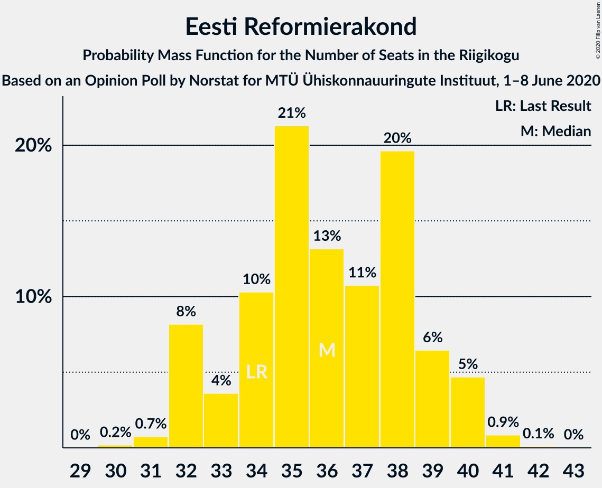
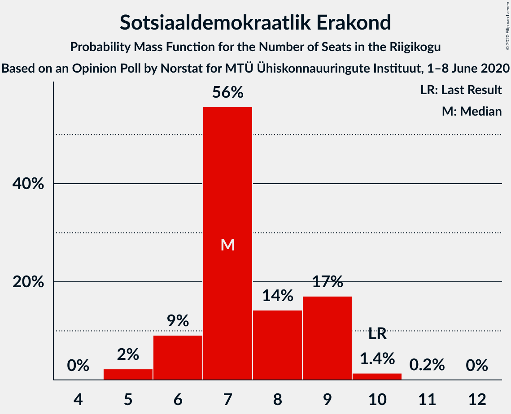
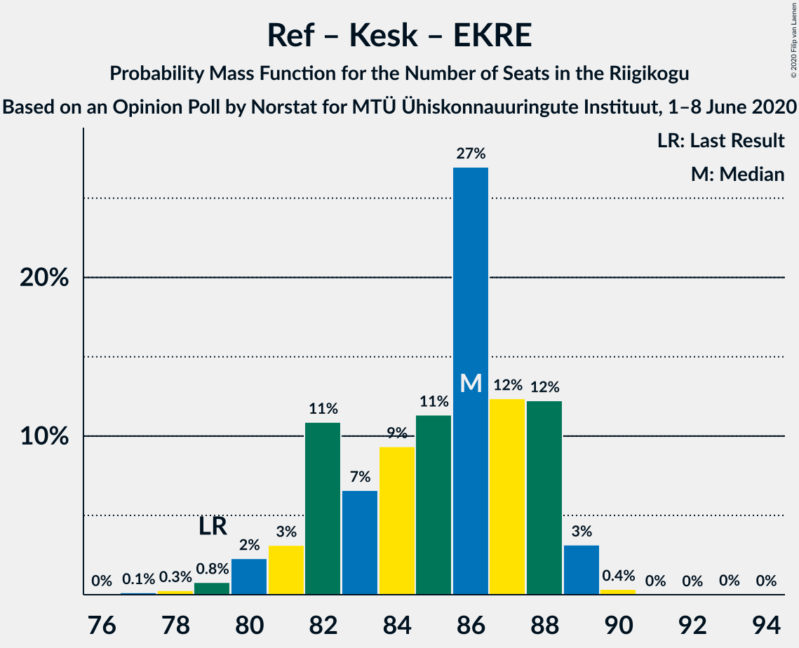
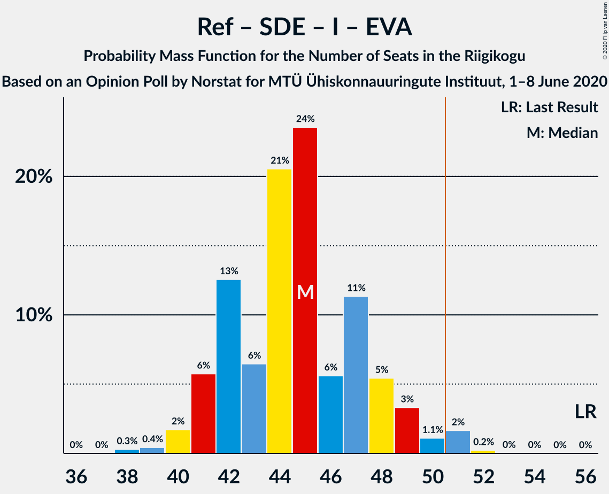

# Opinion Poll by Norstat for MTÜ Ühiskonnauuringute Instituut, 1–8 June 2020

<a href="#voting-intentions">Voting Intentions</a> | <a href="#seats">Seats</a> | <a href="#coalitions">Coalitions</a> | <a href="#technical-information">Technical Information</a>

## Voting Intentions

### Confidence Intervals

| Party | Last Result | Poll Result | 80% Confidence Interval | 90% Confidence Interval | 95% Confidence Interval | 99% Confidence Interval |
|:-----:|:-----------:|:-----------:|:-----------------------:|:-----------------------:|:-----------------------:|:-----------------------:|
| Eesti Reformierakond | 28.9% | 30.3% | 28.5–32.2% |28.0–32.8% |27.5–33.2% |26.7–34.2% |
| Eesti Keskerakond | 23.1% | 22.8% | 21.2–24.6% |20.7–25.1% |20.3–25.5% |19.5–26.4% |
| Eesti Konservatiivne Rahvaerakond | 17.8% | 20.3% | 18.7–22.0% |18.3–22.5% |17.9–22.9% |17.2–23.7% |
| Sotsiaaldemokraatlik Erakond | 9.8% | 7.6% | 6.6–8.8% |6.3–9.1% |6.1–9.4% |5.7–10.0% |
| Eesti 200 | 4.4% | 7.2% | 6.2–8.4% |6.0–8.7% |5.7–9.0% |5.3–9.6% |
| Erakond Isamaa | 11.4% | 4.7% | 3.9–5.7% |3.7–6.0% |3.6–6.2% |3.2–6.7% |
| Erakond Eestimaa Rohelised | 1.8% | 3.4% | 2.8–4.3% |2.6–4.5% |2.4–4.7% |2.2–5.2% |
| Eesti Vabaerakond | 1.2% | 0.4% | 0.2–0.8% |0.2–0.9% |0.2–1.0% |0.1–1.3% |

*Note:* The poll result column reflects the actual value used in the calculations. Published results may vary slightly, and in addition be rounded to fewer digits.

## Seats

### Confidence Intervals

| Party | Last Result | Median | 80% Confidence Interval | 90% Confidence Interval | 95% Confidence Interval | 99% Confidence Interval |
|:-----:|:-----------:|:------:|:-----------------------:|:-----------------------:|:-----------------------:|:-----------------------:|
| <a href="#eesti-reformierakond">Eesti Reformierakond</a> | 34 | 36 | 33–39 |32–40 |32–40 |31–41 |
| <a href="#eesti-keskerakond">Eesti Keskerakond</a> | 26 | 27 | 24–29 |24–29 |23–30 |22–31 |
| <a href="#eesti-konservatiivne-rahvaerakond">Eesti Konservatiivne Rahvaerakond</a> | 19 | 23 | 21–25 |20–26 |20–27 |19–28 |
| <a href="#sotsiaaldemokraatlik-erakond">Sotsiaaldemokraatlik Erakond</a> | 10 | 7 | 6–9 |6–9 |6–9 |5–10 |
| <a href="#eesti-200">Eesti 200</a> | 0 | 7 | 6–8 |6–9 |5–9 |5–10 |
| <a href="#erakond-isamaa">Erakond Isamaa</a> | 12 | 0 | 0–5 |0–5 |0–6 |0–6 |
| <a href="#erakond-eestimaa-rohelised">Erakond Eestimaa Rohelised</a> | 0 | 0 | 0 |0 |0 |0–5 |
| <a href="#eesti-vabaerakond">Eesti Vabaerakond</a> | 0 | 0 | 0 |0 |0 |0 |

### Eesti Reformierakond

*For a full overview of the results for this party, see the [Eesti Reformierakond](party-eestireformierakond.html) page.*

| Number of Seats | Probability | Accumulated | Special Marks |
|:---------------:|:-----------:|:-----------:|:-------------:|
| 30 | 0.2% | 100% |  |
| 31 | 0.7% | 99.8% |  |
| 32 | 8% | 99.0% |  |
| 33 | 4% | 91% |  |
| 34 | 10% | 87% | Last Result |
| 35 | 21% | 77% |  |
| 36 | 13% | 56% | Median |
| 37 | 11% | 43% |  |
| 38 | 20% | 32% |  |
| 39 | 6% | 12% |  |
| 40 | 5% | 6% |  |
| 41 | 0.9% | 1.0% |  |
| 42 | 0.1% | 0.1% |  |
| 43 | 0% | 0% |  |

### Eesti Keskerakond

*For a full overview of the results for this party, see the [Eesti Keskerakond](party-eestikeskerakond.html) page.*

| Number of Seats | Probability | Accumulated | Special Marks |
|:---------------:|:-----------:|:-----------:|:-------------:|
| 20 | 0.1% | 100% |  |
| 21 | 0.4% | 99.9% |  |
| 22 | 0.5% | 99.5% |  |
| 23 | 4% | 99.0% |  |
| 24 | 16% | 95% |  |
| 25 | 15% | 79% |  |
| 26 | 10% | 64% | Last Result |
| 27 | 29% | 54% | Median |
| 28 | 11% | 24% |  |
| 29 | 10% | 13% |  |
| 30 | 1.0% | 3% |  |
| 31 | 2% | 2% |  |
| 32 | 0.1% | 0.2% |  |
| 33 | 0% | 0% |  |

### Eesti Konservatiivne Rahvaerakond

*For a full overview of the results for this party, see the [Eesti Konservatiivne Rahvaerakond](party-eestikonservatiivnerahvaerakond.html) page.*

| Number of Seats | Probability | Accumulated | Special Marks |
|:---------------:|:-----------:|:-----------:|:-------------:|
| 17 | 0.1% | 100% |  |
| 18 | 0.4% | 99.9% |  |
| 19 | 1.1% | 99.6% | Last Result |
| 20 | 5% | 98% |  |
| 21 | 22% | 94% |  |
| 22 | 16% | 72% |  |
| 23 | 24% | 56% | Median |
| 24 | 16% | 32% |  |
| 25 | 8% | 16% |  |
| 26 | 5% | 8% |  |
| 27 | 2% | 3% |  |
| 28 | 0.7% | 0.8% |  |
| 29 | 0.1% | 0.1% |  |
| 30 | 0% | 0% |  |

### Sotsiaaldemokraatlik Erakond

*For a full overview of the results for this party, see the [Sotsiaaldemokraatlik Erakond](party-sotsiaaldemokraatlikerakond.html) page.*

| Number of Seats | Probability | Accumulated | Special Marks |
|:---------------:|:-----------:|:-----------:|:-------------:|
| 5 | 2% | 100% |  |
| 6 | 9% | 98% |  |
| 7 | 56% | 89% | Median |
| 8 | 14% | 33% |  |
| 9 | 17% | 19% |  |
| 10 | 1.4% | 2% | Last Result |
| 11 | 0.2% | 0.2% |  |
| 12 | 0% | 0% |  |

### Eesti 200

*For a full overview of the results for this party, see the [Eesti 200](party-eesti200.html) page.*

| Number of Seats | Probability | Accumulated | Special Marks |
|:---------------:|:-----------:|:-----------:|:-------------:|
| 0 | 0.1% | 100% | Last Result |
| 1 | 0% | 99.9% |  |
| 2 | 0% | 99.9% |  |
| 3 | 0% | 99.9% |  |
| 4 | 0% | 99.9% |  |
| 5 | 4% | 99.8% |  |
| 6 | 27% | 95% |  |
| 7 | 30% | 68% | Median |
| 8 | 30% | 39% |  |
| 9 | 8% | 9% |  |
| 10 | 0.5% | 0.6% |  |
| 11 | 0% | 0.1% |  |
| 12 | 0% | 0% |  |

### Erakond Isamaa

*For a full overview of the results for this party, see the [Erakond Isamaa](party-erakondisamaa.html) page.*

| Number of Seats | Probability | Accumulated | Special Marks |
|:---------------:|:-----------:|:-----------:|:-------------:|
| 0 | 75% | 100% | Median |
| 1 | 0% | 25% |  |
| 2 | 0% | 25% |  |
| 3 | 0% | 25% |  |
| 4 | 3% | 25% |  |
| 5 | 19% | 22% |  |
| 6 | 3% | 3% |  |
| 7 | 0.1% | 0.2% |  |
| 8 | 0% | 0% |  |
| 9 | 0% | 0% |  |
| 10 | 0% | 0% |  |
| 11 | 0% | 0% |  |
| 12 | 0% | 0% | Last Result |

### Erakond Eestimaa Rohelised

*For a full overview of the results for this party, see the [Erakond Eestimaa Rohelised](party-erakondeestimaarohelised.html) page.*

| Number of Seats | Probability | Accumulated | Special Marks |
|:---------------:|:-----------:|:-----------:|:-------------:|
| 0 | 99.0% | 100% | Last Result, Median |
| 1 | 0% | 1.0% |  |
| 2 | 0% | 1.0% |  |
| 3 | 0% | 1.0% |  |
| 4 | 0.4% | 1.0% |  |
| 5 | 0.6% | 0.6% |  |
| 6 | 0% | 0% |  |

### Eesti Vabaerakond

*For a full overview of the results for this party, see the [Eesti Vabaerakond](party-eestivabaerakond.html) page.*

| Number of Seats | Probability | Accumulated | Special Marks |
|:---------------:|:-----------:|:-----------:|:-------------:|
| 0 | 100% | 100% | Last Result, Median |

## Coalitions

### Confidence Intervals

| Coalition | Last Result | Median | Majority? | 80% Confidence Interval | 90% Confidence Interval | 95% Confidence Interval | 99% Confidence Interval |
|:---------:|:-----------:|:------:|:---------:|:-----------------------:|:-----------------------:|:-----------------------:|:-----------------------:|
| Eesti Reformierakond – Eesti Keskerakond – Eesti Konservatiivne Rahvaerakond | 79 | 86 | 100% | 82–88 | 81–88 | 80–89 | 79–89 |
| Eesti Reformierakond – Eesti Keskerakond | 60 | 62 | 100% | 59–65 | 58–66 | 58–66 | 56–68 |
| Eesti Reformierakond – Eesti Konservatiivne Rahvaerakond – Erakond Isamaa | 65 | 60 | 100% | 57–63 | 57–64 | 56–64 | 55–66 |
| Eesti Reformierakond – Eesti Konservatiivne Rahvaerakond | 53 | 59 | 100% | 56–62 | 55–63 | 55–63 | 53–64 |
| Eesti Keskerakond – Eesti Konservatiivne Rahvaerakond – Erakond Isamaa | 57 | 50 | 50% | 48–54 | 47–55 | 46–55 | 46–56 |
| Eesti Keskerakond – Eesti Konservatiivne Rahvaerakond | 45 | 49 | 30% | 46–52 | 45–53 | 44–53 | 43–54 |
| Eesti Reformierakond – Sotsiaaldemokraatlik Erakond – Erakond Isamaa – Eesti Vabaerakond | 56 | 45 | 2% | 42–48 | 41–49 | 41–50 | 39–51 |
| Eesti Reformierakond – Sotsiaaldemokraatlik Erakond – Erakond Isamaa | 56 | 45 | 2% | 42–48 | 41–49 | 41–50 | 39–51 |
| Eesti Reformierakond – Sotsiaaldemokraatlik Erakond | 44 | 44 | 0% | 40–46 | 39–47 | 39–48 | 38–48 |
| Eesti Reformierakond – Erakond Isamaa | 46 | 37 | 0% | 35–40 | 34–41 | 32–43 | 32–44 |
| Eesti Keskerakond – Sotsiaaldemokraatlik Erakond – Erakond Isamaa | 48 | 34 | 0% | 32–38 | 32–39 | 31–39 | 30–41 |
| Eesti Keskerakond – Sotsiaaldemokraatlik Erakond | 36 | 34 | 0% | 32–37 | 31–38 | 30–38 | 29–38 |
| Eesti Konservatiivne Rahvaerakond – Sotsiaaldemokraatlik Erakond | 29 | 30 | 0% | 28–33 | 27–33 | 27–34 | 25–35 |

### Eesti Reformierakond – Eesti Keskerakond – Eesti Konservatiivne Rahvaerakond

| Number of Seats | Probability | Accumulated | Special Marks |
|:---------------:|:-----------:|:-----------:|:-------------:|
| 77 | 0.1% | 100% |  |
| 78 | 0.3% | 99.8% |  |
| 79 | 0.8% | 99.6% | Last Result |
| 80 | 2% | 98.8% |  |
| 81 | 3% | 96% |  |
| 82 | 11% | 93% |  |
| 83 | 7% | 82% |  |
| 84 | 9% | 76% |  |
| 85 | 11% | 67% |  |
| 86 | 27% | 55% | Median |
| 87 | 12% | 28% |  |
| 88 | 12% | 16% |  |
| 89 | 3% | 4% |  |
| 90 | 0.4% | 0.5% |  |
| 91 | 0% | 0.1% |  |
| 92 | 0% | 0.1% |  |
| 93 | 0% | 0.1% |  |
| 94 | 0% | 0% |  |

### Eesti Reformierakond – Eesti Keskerakond

| Number of Seats | Probability | Accumulated | Special Marks |
|:---------------:|:-----------:|:-----------:|:-------------:|
| 54 | 0.1% | 100% |  |
| 55 | 0.2% | 99.9% |  |
| 56 | 0.3% | 99.7% |  |
| 57 | 1.3% | 99.4% |  |
| 58 | 6% | 98% |  |
| 59 | 8% | 92% |  |
| 60 | 10% | 85% | Last Result |
| 61 | 11% | 74% |  |
| 62 | 16% | 63% |  |
| 63 | 9% | 47% | Median |
| 64 | 9% | 38% |  |
| 65 | 23% | 29% |  |
| 66 | 5% | 7% |  |
| 67 | 0.2% | 2% |  |
| 68 | 1.3% | 1.5% |  |
| 69 | 0.2% | 0.2% |  |
| 70 | 0% | 0% |  |

### Eesti Reformierakond – Eesti Konservatiivne Rahvaerakond – Erakond Isamaa

| Number of Seats | Probability | Accumulated | Special Marks |
|:---------------:|:-----------:|:-----------:|:-------------:|
| 53 | 0% | 100% |  |
| 54 | 0.2% | 99.9% |  |
| 55 | 1.3% | 99.7% |  |
| 56 | 3% | 98% |  |
| 57 | 7% | 95% |  |
| 58 | 11% | 88% |  |
| 59 | 20% | 77% | Median |
| 60 | 17% | 57% |  |
| 61 | 12% | 40% |  |
| 62 | 11% | 28% |  |
| 63 | 12% | 17% |  |
| 64 | 4% | 6% |  |
| 65 | 0.7% | 2% | Last Result |
| 66 | 0.8% | 0.9% |  |
| 67 | 0.1% | 0.1% |  |
| 68 | 0.1% | 0.1% |  |
| 69 | 0% | 0% |  |

### Eesti Reformierakond – Eesti Konservatiivne Rahvaerakond

| Number of Seats | Probability | Accumulated | Special Marks |
|:---------------:|:-----------:|:-----------:|:-------------:|
| 51 | 0.1% | 100% | Majority |
| 52 | 0.2% | 99.9% |  |
| 53 | 1.0% | 99.7% | Last Result |
| 54 | 1.0% | 98.7% |  |
| 55 | 7% | 98% |  |
| 56 | 6% | 90% |  |
| 57 | 11% | 84% |  |
| 58 | 17% | 73% |  |
| 59 | 21% | 56% | Median |
| 60 | 12% | 36% |  |
| 61 | 10% | 24% |  |
| 62 | 7% | 14% |  |
| 63 | 5% | 7% |  |
| 64 | 1.3% | 2% |  |
| 65 | 0.4% | 0.4% |  |
| 66 | 0% | 0.1% |  |
| 67 | 0% | 0% |  |

### Eesti Keskerakond – Eesti Konservatiivne Rahvaerakond – Erakond Isamaa

| Number of Seats | Probability | Accumulated | Special Marks |
|:---------------:|:-----------:|:-----------:|:-------------:|
| 44 | 0.2% | 100% |  |
| 45 | 0.3% | 99.8% |  |
| 46 | 4% | 99.5% |  |
| 47 | 4% | 96% |  |
| 48 | 21% | 92% |  |
| 49 | 7% | 71% |  |
| 50 | 14% | 63% | Median |
| 51 | 19% | 50% | Majority |
| 52 | 10% | 30% |  |
| 53 | 10% | 20% |  |
| 54 | 5% | 11% |  |
| 55 | 5% | 6% |  |
| 56 | 0.9% | 1.1% |  |
| 57 | 0.2% | 0.3% | Last Result |
| 58 | 0.1% | 0.1% |  |
| 59 | 0% | 0% |  |

### Eesti Keskerakond – Eesti Konservatiivne Rahvaerakond

| Number of Seats | Probability | Accumulated | Special Marks |
|:---------------:|:-----------:|:-----------:|:-------------:|
| 42 | 0.1% | 100% |  |
| 43 | 0.7% | 99.9% |  |
| 44 | 2% | 99.1% |  |
| 45 | 2% | 97% | Last Result |
| 46 | 7% | 95% |  |
| 47 | 7% | 88% |  |
| 48 | 26% | 81% |  |
| 49 | 8% | 55% |  |
| 50 | 18% | 47% | Median |
| 51 | 17% | 30% | Majority |
| 52 | 7% | 13% |  |
| 53 | 4% | 6% |  |
| 54 | 2% | 2% |  |
| 55 | 0.2% | 0.5% |  |
| 56 | 0.2% | 0.3% |  |
| 57 | 0.1% | 0.1% |  |
| 58 | 0% | 0% |  |

### Eesti Reformierakond – Sotsiaaldemokraatlik Erakond – Erakond Isamaa – Eesti Vabaerakond

| Number of Seats | Probability | Accumulated | Special Marks |
|:---------------:|:-----------:|:-----------:|:-------------:|
| 38 | 0.3% | 100% |  |
| 39 | 0.4% | 99.7% |  |
| 40 | 2% | 99.3% |  |
| 41 | 6% | 98% |  |
| 42 | 13% | 92% |  |
| 43 | 6% | 79% | Median |
| 44 | 21% | 73% |  |
| 45 | 24% | 52% |  |
| 46 | 6% | 29% |  |
| 47 | 11% | 23% |  |
| 48 | 5% | 12% |  |
| 49 | 3% | 6% |  |
| 50 | 1.1% | 3% |  |
| 51 | 2% | 2% | Majority |
| 52 | 0.2% | 0.3% |  |
| 53 | 0% | 0% |  |
| 54 | 0% | 0% |  |
| 55 | 0% | 0% |  |
| 56 | 0% | 0% | Last Result |

### Eesti Reformierakond – Sotsiaaldemokraatlik Erakond – Erakond Isamaa

| Number of Seats | Probability | Accumulated | Special Marks |
|:---------------:|:-----------:|:-----------:|:-------------:|
| 38 | 0.3% | 100% |  |
| 39 | 0.4% | 99.7% |  |
| 40 | 2% | 99.3% |  |
| 41 | 6% | 98% |  |
| 42 | 13% | 92% |  |
| 43 | 6% | 79% | Median |
| 44 | 21% | 73% |  |
| 45 | 24% | 52% |  |
| 46 | 6% | 29% |  |
| 47 | 11% | 23% |  |
| 48 | 5% | 12% |  |
| 49 | 3% | 6% |  |
| 50 | 1.1% | 3% |  |
| 51 | 2% | 2% | Majority |
| 52 | 0.2% | 0.3% |  |
| 53 | 0% | 0% |  |
| 54 | 0% | 0% |  |
| 55 | 0% | 0% |  |
| 56 | 0% | 0% | Last Result |

### Eesti Reformierakond – Sotsiaaldemokraatlik Erakond

| Number of Seats | Probability | Accumulated | Special Marks |
|:---------------:|:-----------:|:-----------:|:-------------:|
| 36 | 0% | 100% |  |
| 37 | 0.1% | 99.9% |  |
| 38 | 0.8% | 99.8% |  |
| 39 | 6% | 99.0% |  |
| 40 | 4% | 93% |  |
| 41 | 9% | 89% |  |
| 42 | 18% | 81% |  |
| 43 | 8% | 62% | Median |
| 44 | 18% | 54% | Last Result |
| 45 | 22% | 36% |  |
| 46 | 4% | 14% |  |
| 47 | 6% | 10% |  |
| 48 | 3% | 4% |  |
| 49 | 0.2% | 0.3% |  |
| 50 | 0.1% | 0.1% |  |
| 51 | 0% | 0% | Majority |

### Eesti Reformierakond – Erakond Isamaa

| Number of Seats | Probability | Accumulated | Special Marks |
|:---------------:|:-----------:|:-----------:|:-------------:|
| 30 | 0.1% | 100% |  |
| 31 | 0.3% | 99.9% |  |
| 32 | 3% | 99.6% |  |
| 33 | 1.5% | 97% |  |
| 34 | 5% | 96% |  |
| 35 | 17% | 90% |  |
| 36 | 11% | 73% | Median |
| 37 | 15% | 63% |  |
| 38 | 20% | 47% |  |
| 39 | 11% | 28% |  |
| 40 | 8% | 17% |  |
| 41 | 4% | 9% |  |
| 42 | 2% | 5% |  |
| 43 | 2% | 3% |  |
| 44 | 0.5% | 0.7% |  |
| 45 | 0.1% | 0.2% |  |
| 46 | 0% | 0% | Last Result |

### Eesti Keskerakond – Sotsiaaldemokraatlik Erakond – Erakond Isamaa

| Number of Seats | Probability | Accumulated | Special Marks |
|:---------------:|:-----------:|:-----------:|:-------------:|
| 28 | 0.1% | 100% |  |
| 29 | 0.3% | 99.9% |  |
| 30 | 1.0% | 99.6% |  |
| 31 | 3% | 98.6% |  |
| 32 | 10% | 96% |  |
| 33 | 13% | 86% |  |
| 34 | 25% | 72% | Median |
| 35 | 9% | 47% |  |
| 36 | 6% | 38% |  |
| 37 | 14% | 32% |  |
| 38 | 10% | 17% |  |
| 39 | 6% | 8% |  |
| 40 | 0.8% | 2% |  |
| 41 | 1.1% | 1.4% |  |
| 42 | 0.2% | 0.2% |  |
| 43 | 0.1% | 0.1% |  |
| 44 | 0% | 0% |  |
| 45 | 0% | 0% |  |
| 46 | 0% | 0% |  |
| 47 | 0% | 0% |  |
| 48 | 0% | 0% | Last Result |

### Eesti Keskerakond – Sotsiaaldemokraatlik Erakond

| Number of Seats | Probability | Accumulated | Special Marks |
|:---------------:|:-----------:|:-----------:|:-------------:|
| 27 | 0.1% | 100% |  |
| 28 | 0.3% | 99.9% |  |
| 29 | 1.2% | 99.6% |  |
| 30 | 3% | 98% |  |
| 31 | 5% | 95% |  |
| 32 | 18% | 90% |  |
| 33 | 16% | 72% |  |
| 34 | 30% | 56% | Median |
| 35 | 9% | 26% |  |
| 36 | 5% | 17% | Last Result |
| 37 | 6% | 12% |  |
| 38 | 6% | 6% |  |
| 39 | 0.2% | 0.3% |  |
| 40 | 0.1% | 0.2% |  |
| 41 | 0% | 0% |  |

### Eesti Konservatiivne Rahvaerakond – Sotsiaaldemokraatlik Erakond

| Number of Seats | Probability | Accumulated | Special Marks |
|:---------------:|:-----------:|:-----------:|:-------------:|
| 24 | 0.1% | 100% |  |
| 25 | 0.7% | 99.9% |  |
| 26 | 1.3% | 99.2% |  |
| 27 | 3% | 98% |  |
| 28 | 22% | 95% |  |
| 29 | 9% | 73% | Last Result |
| 30 | 21% | 64% | Median |
| 31 | 17% | 43% |  |
| 32 | 11% | 26% |  |
| 33 | 10% | 15% |  |
| 34 | 3% | 5% |  |
| 35 | 1.2% | 2% |  |
| 36 | 0.3% | 0.3% |  |
| 37 | 0% | 0% |  |

## Technical Information

### Opinion Poll

+ **Polling firm:** Norstat
+ **Commissioner(s):** MTÜ Ühiskonnauuringute Instituut
+ **Fieldwork period:** 1–8 June 2020

### Calculations

+ **Sample size:** 1000
+ **Simulations done:** 131,072
+ **Error estimate:** 1.92%

