# Opinion Poll by Turu-uuringute AS for ERR, 9–15 June 2020

<a href="#voting-intentions">Voting Intentions</a> | <a href="#seats">Seats</a> | <a href="#coalitions">Coalitions</a> | <a href="#technical-information">Technical Information</a>

## Voting Intentions

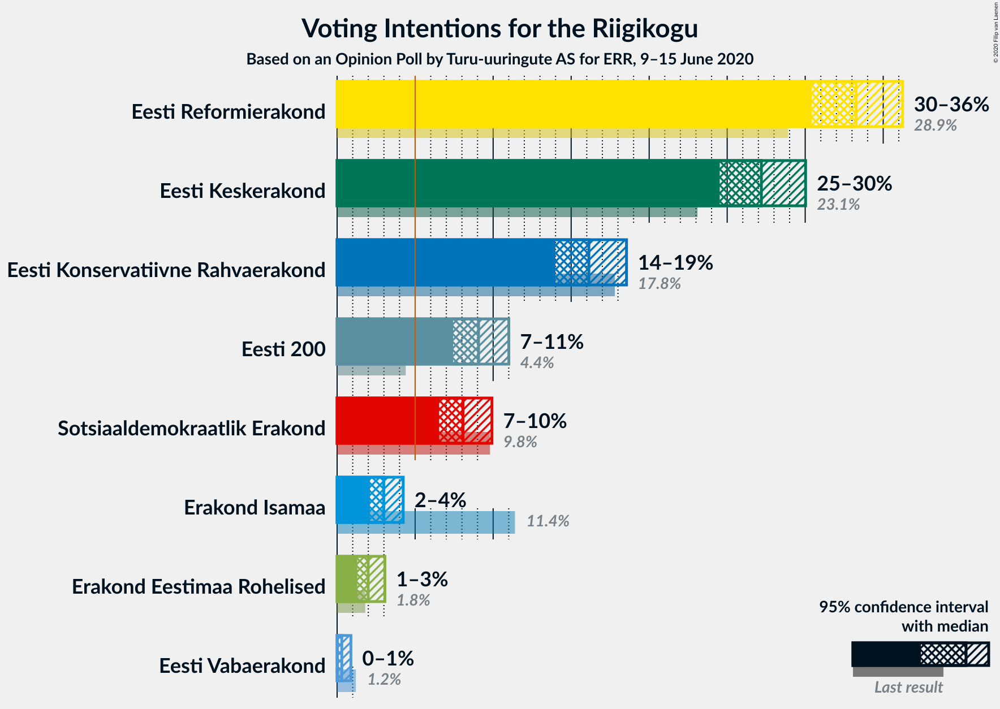

### Confidence Intervals

| Party | Last Result | Poll Result | 80% Confidence Interval | 90% Confidence Interval | 95% Confidence Interval | 99% Confidence Interval |
|:-----:|:-----------:|:-----------:|:-----------------------:|:-----------------------:|:-----------------------:|:-----------------------:|
| Eesti Reformierakond | 28.9% | 33.3% | 31.4–35.2% |30.9–35.8% |30.4–36.2% |29.5–37.2% |
| Eesti Keskerakond | 23.1% | 27.2% | 25.4–29.1% |25.0–29.6% |24.5–30.0% |23.7–30.9% |
| Eesti Konservatiivne Rahvaerakond | 17.8% | 16.1% | 14.7–17.7% |14.3–18.2% |14.0–18.5% |13.3–19.3% |
| Eesti 200 | 4.4% | 9.1% | 8.0–10.3% |7.7–10.7% |7.4–11.0% |7.0–11.6% |
| Sotsiaaldemokraatlik Erakond | 9.8% | 8.1% | 7.1–9.3% |6.8–9.6% |6.5–9.9% |6.1–10.5% |
| Erakond Isamaa | 11.4% | 3.0% | 2.4–3.8% |2.2–4.0% |2.1–4.2% |1.8–4.7% |
| Erakond Eestimaa Rohelised | 1.8% | 2.0% | 1.5–2.7% |1.4–2.9% |1.3–3.1% |1.1–3.4% |
| Eesti Vabaerakond | 1.2% | 0.3% | 0.2–0.7% |0.1–0.8% |0.1–0.9% |0.1–1.1% |

*Note:* The poll result column reflects the actual value used in the calculations. Published results may vary slightly, and in addition be rounded to fewer digits.

## Seats

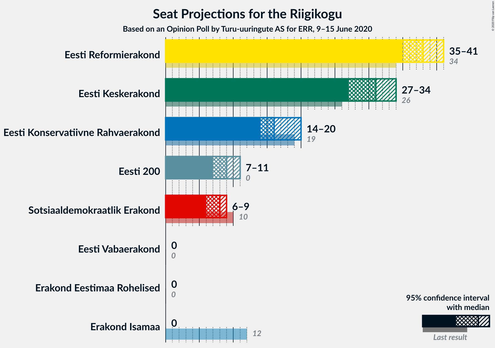

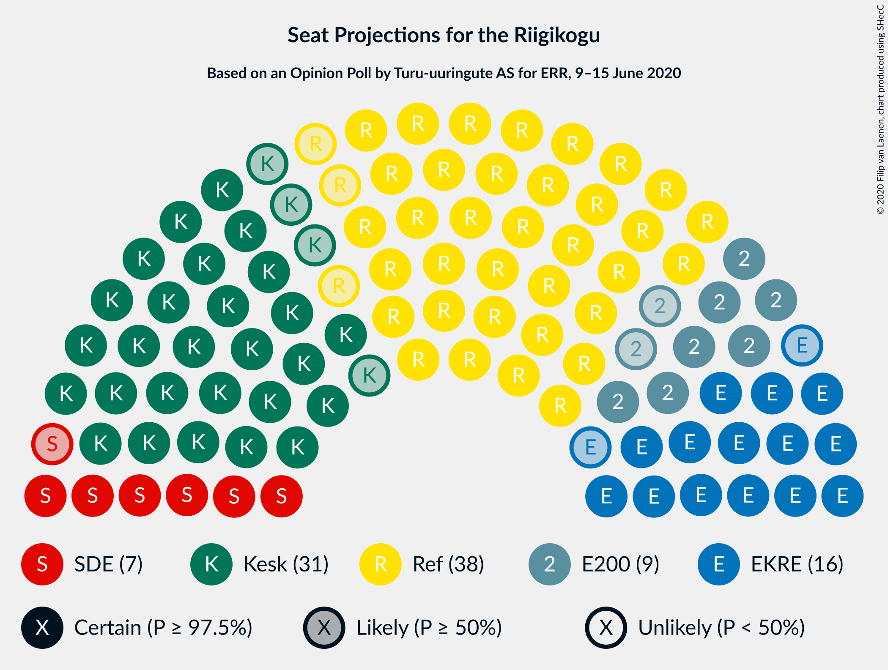

### Confidence Intervals

| Party | Last Result | Median | 80% Confidence Interval | 90% Confidence Interval | 95% Confidence Interval | 99% Confidence Interval |
|:-----:|:-----------:|:------:|:-----------------------:|:-----------------------:|:-----------------------:|:-----------------------:|
| <a href="#eesti-reformierakond">Eesti Reformierakond</a> | 34 | 38 | 36–40 |35–40 |35–41 |33–42 |
| <a href="#eesti-keskerakond">Eesti Keskerakond</a> | 26 | 31 | 28–32 |27–33 |27–34 |26–35 |
| <a href="#eesti-konservatiivne-rahvaerakond">Eesti Konservatiivne Rahvaerakond</a> | 19 | 16 | 15–19 |15–19 |14–20 |13–21 |
| <a href="#eesti-200">Eesti 200</a> | 0 | 9 | 7–10 |7–10 |7–11 |6–11 |
| <a href="#sotsiaaldemokraatlik-erakond">Sotsiaaldemokraatlik Erakond</a> | 10 | 8 | 6–9 |6–9 |6–9 |6–10 |
| <a href="#erakond-isamaa">Erakond Isamaa</a> | 12 | 0 | 0 |0 |0 |0 |
| <a href="#erakond-eestimaa-rohelised">Erakond Eestimaa Rohelised</a> | 0 | 0 | 0 |0 |0 |0 |
| <a href="#eesti-vabaerakond">Eesti Vabaerakond</a> | 0 | 0 | 0 |0 |0 |0 |

### Eesti Reformierakond

*For a full overview of the results for this party, see the [Eesti Reformierakond](party-eestireformierakond.html) page.*

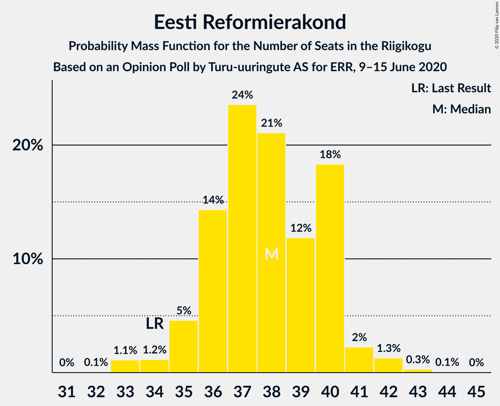

| Number of Seats | Probability | Accumulated | Special Marks |
|:---------------:|:-----------:|:-----------:|:-------------:|
| 32 | 0.1% | 100% |  |
| 33 | 1.1% | 99.9% |  |
| 34 | 1.2% | 98.8% | Last Result |
| 35 | 5% | 98% |  |
| 36 | 14% | 93% |  |
| 37 | 24% | 79% |  |
| 38 | 21% | 55% | Median |
| 39 | 12% | 34% |  |
| 40 | 18% | 22% |  |
| 41 | 2% | 4% |  |
| 42 | 1.3% | 2% |  |
| 43 | 0.3% | 0.4% |  |
| 44 | 0.1% | 0.1% |  |
| 45 | 0% | 0% |  |

### Eesti Keskerakond

*For a full overview of the results for this party, see the [Eesti Keskerakond](party-eestikeskerakond.html) page.*

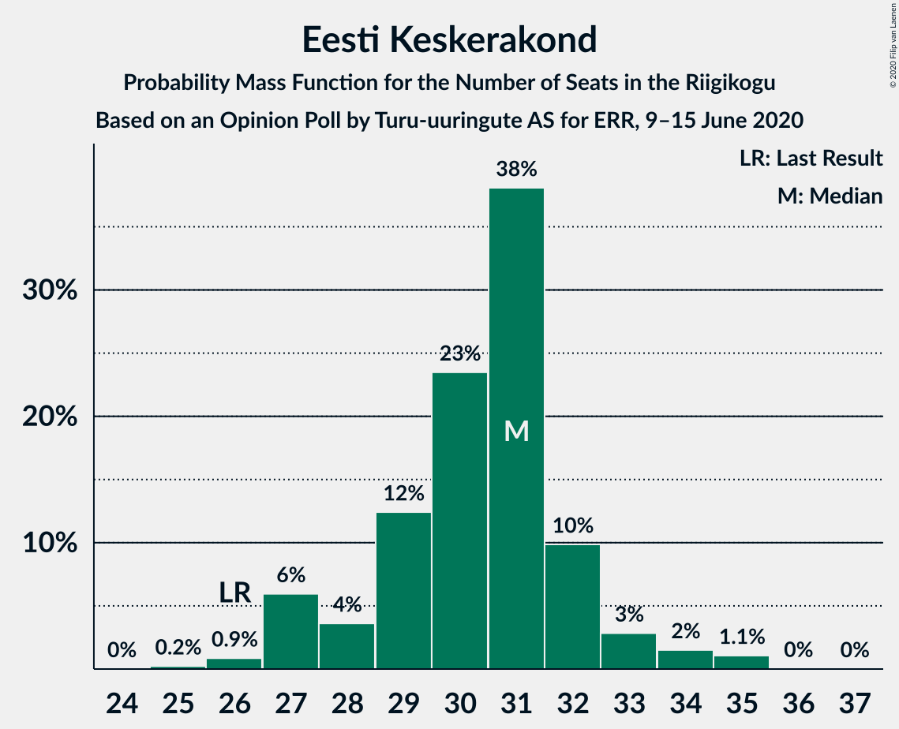

| Number of Seats | Probability | Accumulated | Special Marks |
|:---------------:|:-----------:|:-----------:|:-------------:|
| 25 | 0.2% | 100% |  |
| 26 | 0.9% | 99.8% | Last Result |
| 27 | 6% | 98.9% |  |
| 28 | 4% | 93% |  |
| 29 | 12% | 89% |  |
| 30 | 23% | 77% |  |
| 31 | 38% | 53% | Median |
| 32 | 10% | 15% |  |
| 33 | 3% | 5% |  |
| 34 | 2% | 3% |  |
| 35 | 1.1% | 1.1% |  |
| 36 | 0% | 0.1% |  |
| 37 | 0% | 0% |  |

### Eesti Konservatiivne Rahvaerakond

*For a full overview of the results for this party, see the [Eesti Konservatiivne Rahvaerakond](party-eestikonservatiivnerahvaerakond.html) page.*

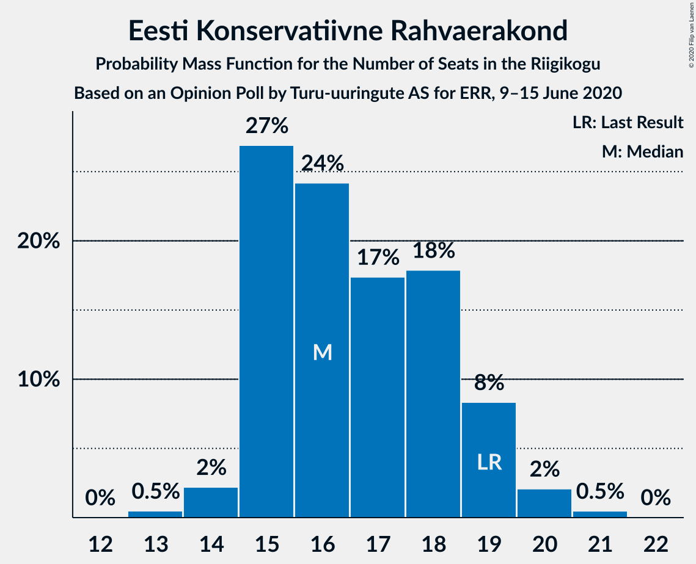

| Number of Seats | Probability | Accumulated | Special Marks |
|:---------------:|:-----------:|:-----------:|:-------------:|
| 13 | 0.5% | 100% |  |
| 14 | 2% | 99.5% |  |
| 15 | 27% | 97% |  |
| 16 | 24% | 70% | Median |
| 17 | 17% | 46% |  |
| 18 | 18% | 29% |  |
| 19 | 8% | 11% | Last Result |
| 20 | 2% | 3% |  |
| 21 | 0.5% | 0.5% |  |
| 22 | 0% | 0% |  |

### Eesti 200

*For a full overview of the results for this party, see the [Eesti 200](party-eesti200.html) page.*

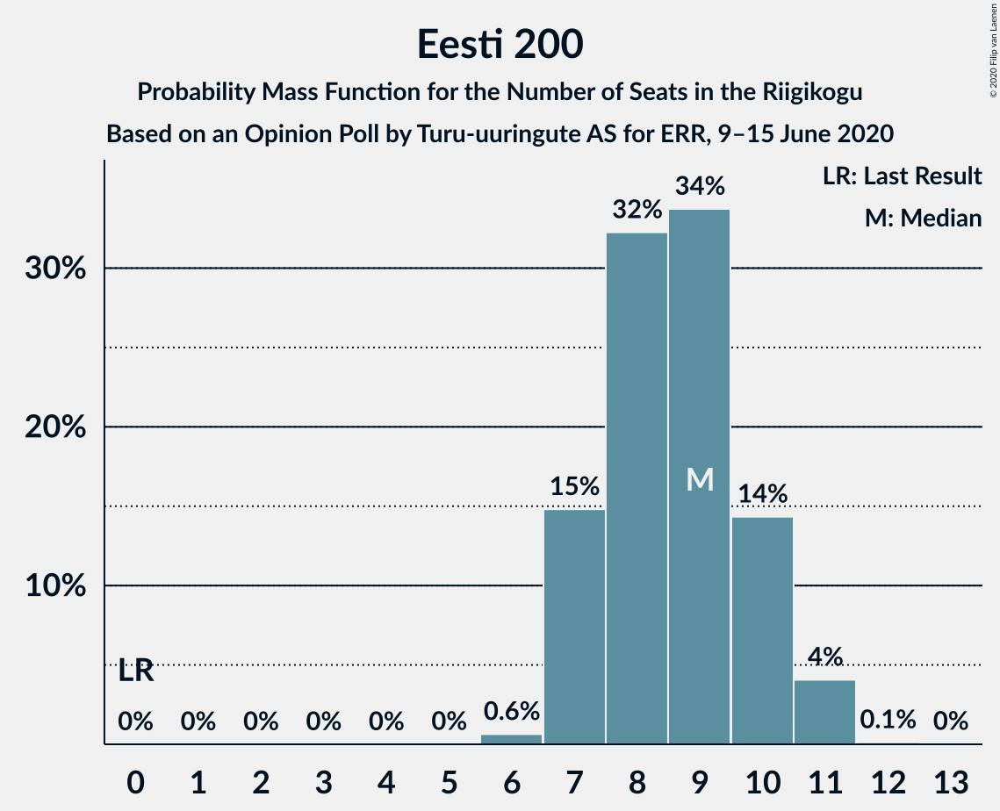

| Number of Seats | Probability | Accumulated | Special Marks |
|:---------------:|:-----------:|:-----------:|:-------------:|
| 0 | 0% | 100% | Last Result |
| 1 | 0% | 100% |  |
| 2 | 0% | 100% |  |
| 3 | 0% | 100% |  |
| 4 | 0% | 100% |  |
| 5 | 0% | 100% |  |
| 6 | 0.6% | 100% |  |
| 7 | 15% | 99.3% |  |
| 8 | 32% | 85% |  |
| 9 | 34% | 52% | Median |
| 10 | 14% | 19% |  |
| 11 | 4% | 4% |  |
| 12 | 0.1% | 0.1% |  |
| 13 | 0% | 0% |  |

### Sotsiaaldemokraatlik Erakond

*For a full overview of the results for this party, see the [Sotsiaaldemokraatlik Erakond](party-sotsiaaldemokraatlikerakond.html) page.*

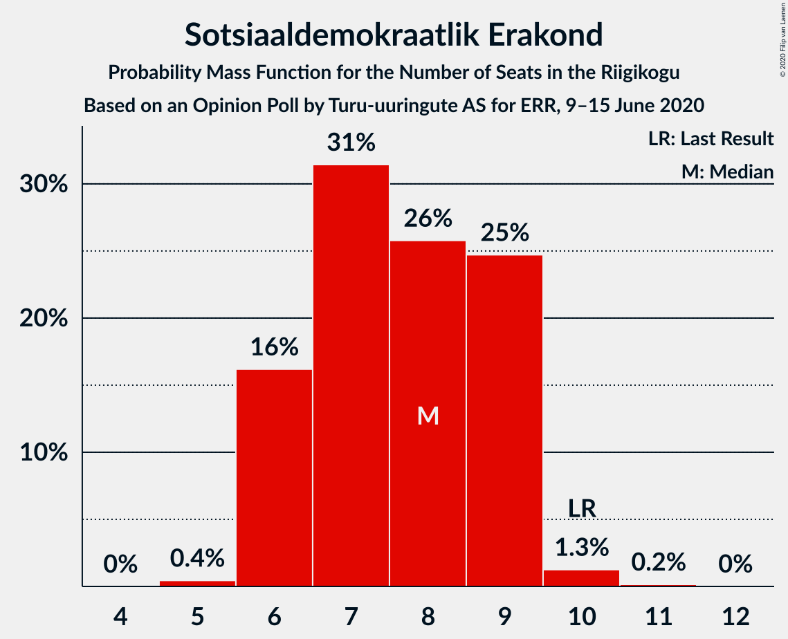

| Number of Seats | Probability | Accumulated | Special Marks |
|:---------------:|:-----------:|:-----------:|:-------------:|
| 5 | 0.4% | 100% |  |
| 6 | 16% | 99.5% |  |
| 7 | 31% | 83% |  |
| 8 | 26% | 52% | Median |
| 9 | 25% | 26% |  |
| 10 | 1.3% | 1.4% | Last Result |
| 11 | 0.2% | 0.2% |  |
| 12 | 0% | 0% |  |

### Erakond Isamaa

*For a full overview of the results for this party, see the [Erakond Isamaa](party-erakondisamaa.html) page.*

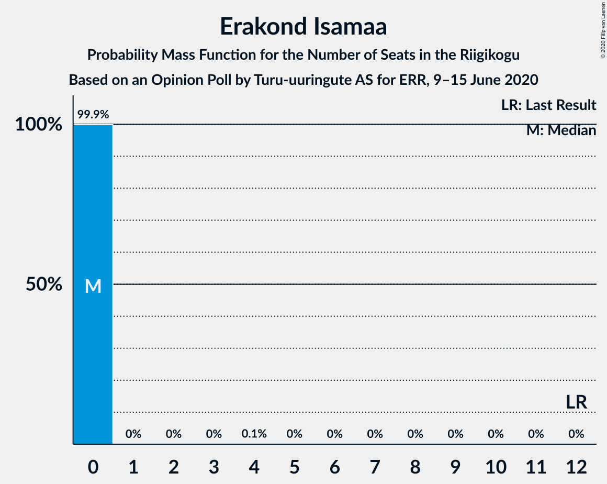

| Number of Seats | Probability | Accumulated | Special Marks |
|:---------------:|:-----------:|:-----------:|:-------------:|
| 0 | 99.9% | 100% | Median |
| 1 | 0% | 0.1% |  |
| 2 | 0% | 0.1% |  |
| 3 | 0% | 0.1% |  |
| 4 | 0.1% | 0.1% |  |
| 5 | 0% | 0% |  |
| 6 | 0% | 0% |  |
| 7 | 0% | 0% |  |
| 8 | 0% | 0% |  |
| 9 | 0% | 0% |  |
| 10 | 0% | 0% |  |
| 11 | 0% | 0% |  |
| 12 | 0% | 0% | Last Result |

### Erakond Eestimaa Rohelised

*For a full overview of the results for this party, see the [Erakond Eestimaa Rohelised](party-erakondeestimaarohelised.html) page.*

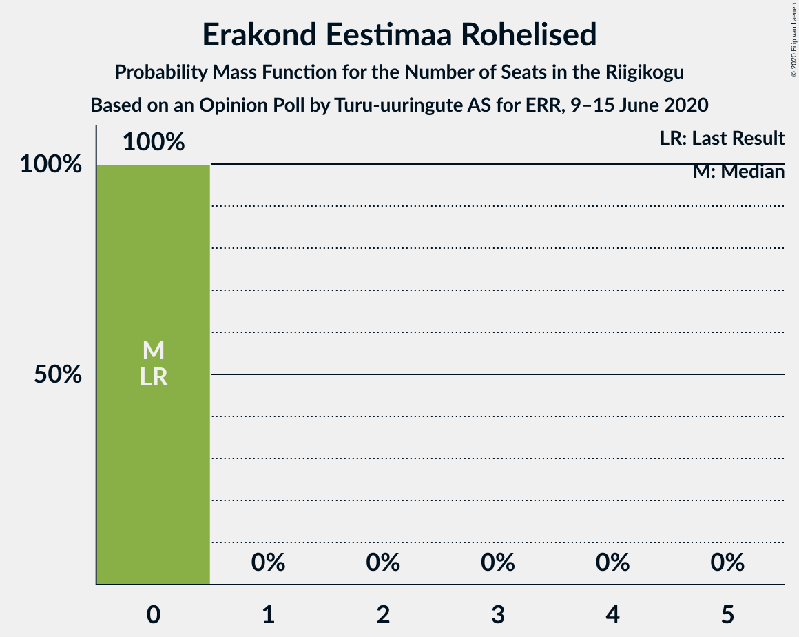

| Number of Seats | Probability | Accumulated | Special Marks |
|:---------------:|:-----------:|:-----------:|:-------------:|
| 0 | 100% | 100% | Last Result, Median |

### Eesti Vabaerakond

*For a full overview of the results for this party, see the [Eesti Vabaerakond](party-eestivabaerakond.html) page.*

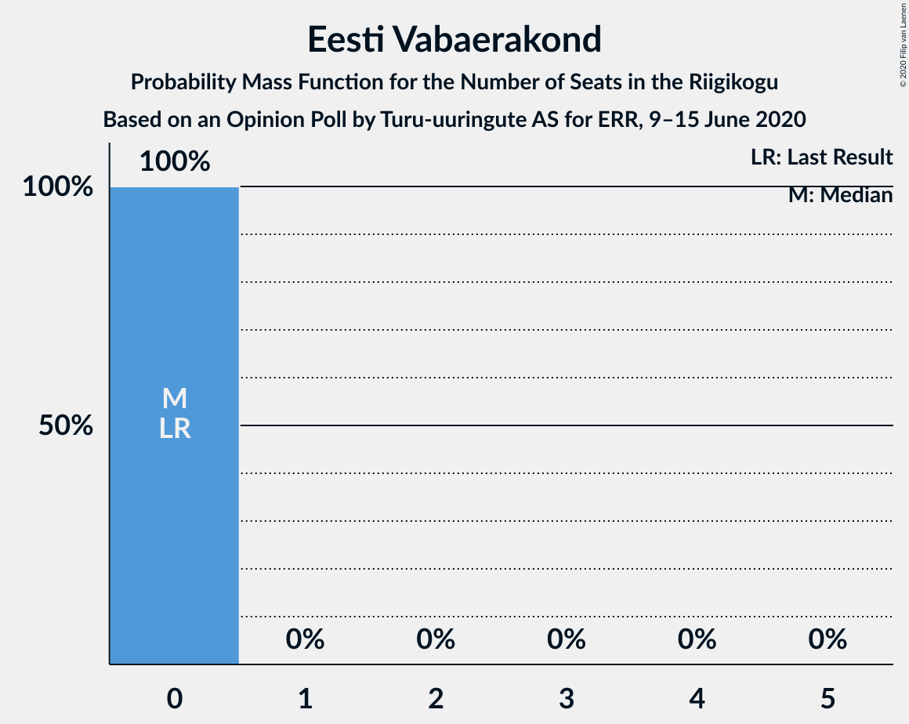

| Number of Seats | Probability | Accumulated | Special Marks |
|:---------------:|:-----------:|:-----------:|:-------------:|
| 0 | 100% | 100% | Last Result, Median |

## Coalitions

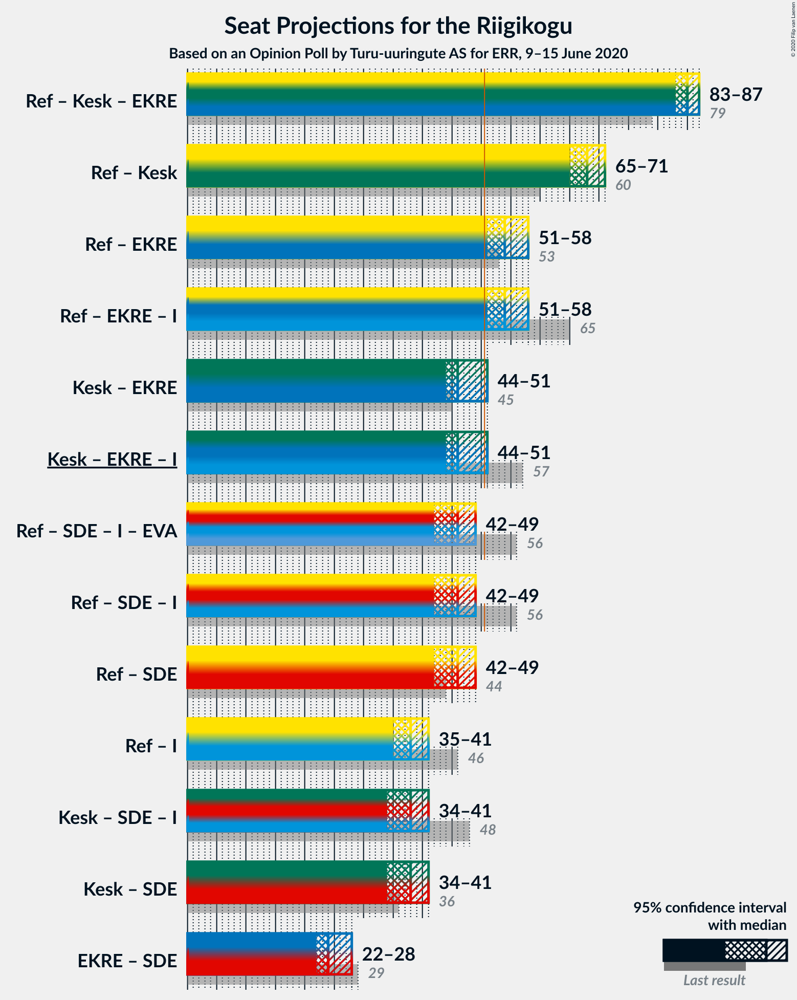

### Confidence Intervals

| Coalition | Last Result | Median | Majority? | 80% Confidence Interval | 90% Confidence Interval | 95% Confidence Interval | 99% Confidence Interval |
|:---------:|:-----------:|:------:|:---------:|:-----------------------:|:-----------------------:|:-----------------------:|:-----------------------:|
| Eesti Reformierakond – Eesti Keskerakond – Eesti Konservatiivne Rahvaerakond | 79 | 85 | 100% | 83–86 | 83–87 | 83–87 | 81–88 |
| Eesti Reformierakond – Eesti Keskerakond | 60 | 68 | 100% | 66–71 | 65–71 | 65–71 | 63–72 |
| Eesti Reformierakond – Eesti Konservatiivne Rahvaerakond | 53 | 54 | 99.0% | 52–57 | 52–57 | 51–58 | 50–59 |
| Eesti Reformierakond – Eesti Konservatiivne Rahvaerakond – Erakond Isamaa | 65 | 54 | 99.0% | 52–57 | 52–57 | 51–58 | 50–59 |
| Eesti Keskerakond – Eesti Konservatiivne Rahvaerakond | 45 | 46 | 4% | 45–49 | 44–50 | 44–51 | 43–52 |
| Eesti Keskerakond – Eesti Konservatiivne Rahvaerakond – Erakond Isamaa | 57 | 46 | 4% | 45–49 | 44–50 | 44–51 | 43–52 |
| Eesti Reformierakond – Sotsiaaldemokraatlik Erakond – Erakond Isamaa – Eesti Vabaerakond | 56 | 46 | 0.3% | 43–47 | 42–48 | 42–49 | 41–50 |
| Eesti Reformierakond – Sotsiaaldemokraatlik Erakond – Erakond Isamaa | 56 | 46 | 0.3% | 43–47 | 42–48 | 42–49 | 41–50 |
| Eesti Reformierakond – Sotsiaaldemokraatlik Erakond | 44 | 46 | 0.3% | 43–47 | 42–48 | 42–49 | 41–50 |
| Eesti Reformierakond – Erakond Isamaa | 46 | 38 | 0% | 36–40 | 35–40 | 35–41 | 33–42 |
| Eesti Keskerakond – Sotsiaaldemokraatlik Erakond – Erakond Isamaa | 48 | 38 | 0% | 36–40 | 35–40 | 34–41 | 33–42 |
| Eesti Keskerakond – Sotsiaaldemokraatlik Erakond | 36 | 38 | 0% | 36–40 | 35–40 | 34–41 | 33–42 |
| Eesti Konservatiivne Rahvaerakond – Sotsiaaldemokraatlik Erakond | 29 | 24 | 0% | 22–26 | 22–27 | 22–28 | 20–29 |

### Eesti Reformierakond – Eesti Keskerakond – Eesti Konservatiivne Rahvaerakond

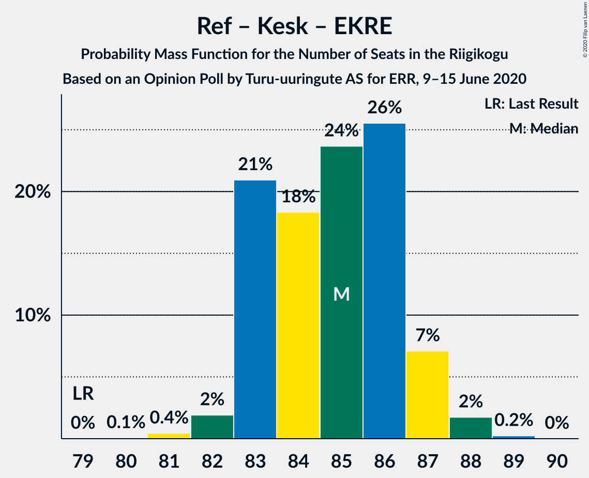

| Number of Seats | Probability | Accumulated | Special Marks |
|:---------------:|:-----------:|:-----------:|:-------------:|
| 79 | 0% | 100% | Last Result |
| 80 | 0.1% | 100% |  |
| 81 | 0.4% | 99.9% |  |
| 82 | 2% | 99.5% |  |
| 83 | 21% | 98% |  |
| 84 | 18% | 77% |  |
| 85 | 24% | 58% | Median |
| 86 | 26% | 35% |  |
| 87 | 7% | 9% |  |
| 88 | 2% | 2% |  |
| 89 | 0.2% | 0.2% |  |
| 90 | 0% | 0% |  |

### Eesti Reformierakond – Eesti Keskerakond

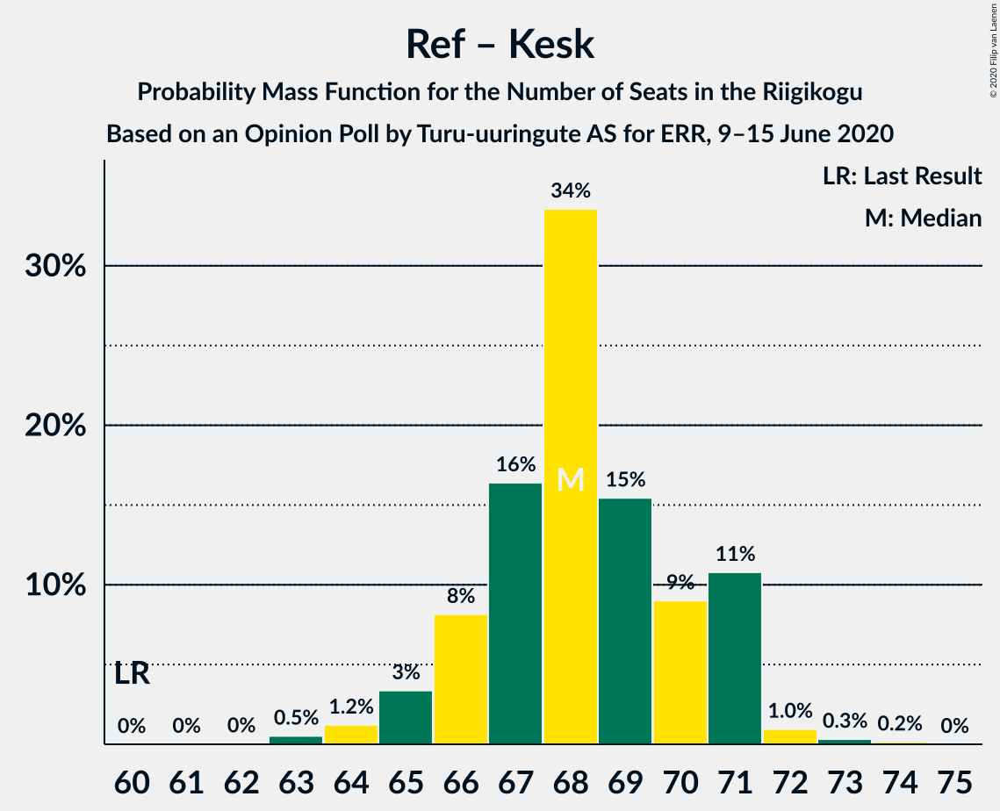

| Number of Seats | Probability | Accumulated | Special Marks |
|:---------------:|:-----------:|:-----------:|:-------------:|
| 60 | 0% | 100% | Last Result |
| 61 | 0% | 100% |  |
| 62 | 0% | 100% |  |
| 63 | 0.5% | 99.9% |  |
| 64 | 1.2% | 99.4% |  |
| 65 | 3% | 98% |  |
| 66 | 8% | 95% |  |
| 67 | 16% | 87% |  |
| 68 | 34% | 70% |  |
| 69 | 15% | 37% | Median |
| 70 | 9% | 21% |  |
| 71 | 11% | 12% |  |
| 72 | 1.0% | 1.4% |  |
| 73 | 0.3% | 0.5% |  |
| 74 | 0.2% | 0.2% |  |
| 75 | 0% | 0% |  |

### Eesti Reformierakond – Eesti Konservatiivne Rahvaerakond

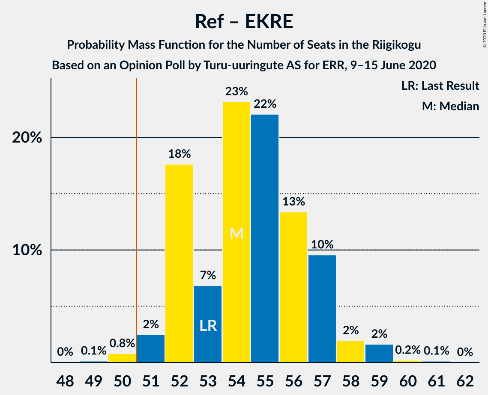

| Number of Seats | Probability | Accumulated | Special Marks |
|:---------------:|:-----------:|:-----------:|:-------------:|
| 49 | 0.1% | 100% |  |
| 50 | 0.8% | 99.8% |  |
| 51 | 2% | 99.0% | Majority |
| 52 | 18% | 97% |  |
| 53 | 7% | 79% | Last Result |
| 54 | 23% | 72% | Median |
| 55 | 22% | 49% |  |
| 56 | 13% | 27% |  |
| 57 | 10% | 13% |  |
| 58 | 2% | 4% |  |
| 59 | 2% | 2% |  |
| 60 | 0.2% | 0.3% |  |
| 61 | 0.1% | 0.1% |  |
| 62 | 0% | 0% |  |

### Eesti Reformierakond – Eesti Konservatiivne Rahvaerakond – Erakond Isamaa

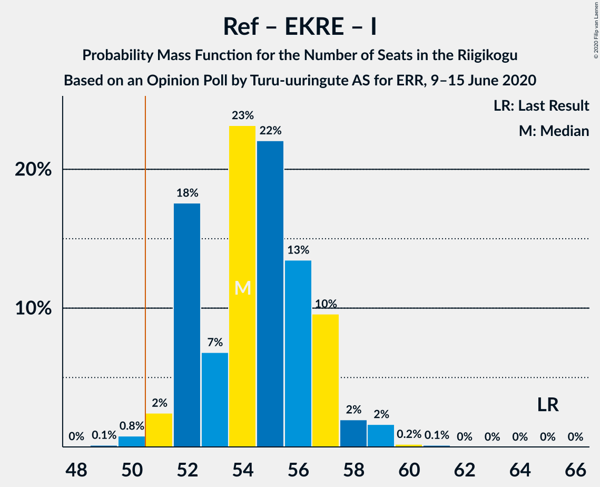

| Number of Seats | Probability | Accumulated | Special Marks |
|:---------------:|:-----------:|:-----------:|:-------------:|
| 49 | 0.1% | 100% |  |
| 50 | 0.8% | 99.8% |  |
| 51 | 2% | 99.0% | Majority |
| 52 | 18% | 97% |  |
| 53 | 7% | 79% |  |
| 54 | 23% | 72% | Median |
| 55 | 22% | 49% |  |
| 56 | 13% | 27% |  |
| 57 | 10% | 14% |  |
| 58 | 2% | 4% |  |
| 59 | 2% | 2% |  |
| 60 | 0.2% | 0.3% |  |
| 61 | 0.1% | 0.1% |  |
| 62 | 0% | 0% |  |
| 63 | 0% | 0% |  |
| 64 | 0% | 0% |  |
| 65 | 0% | 0% | Last Result |

### Eesti Keskerakond – Eesti Konservatiivne Rahvaerakond

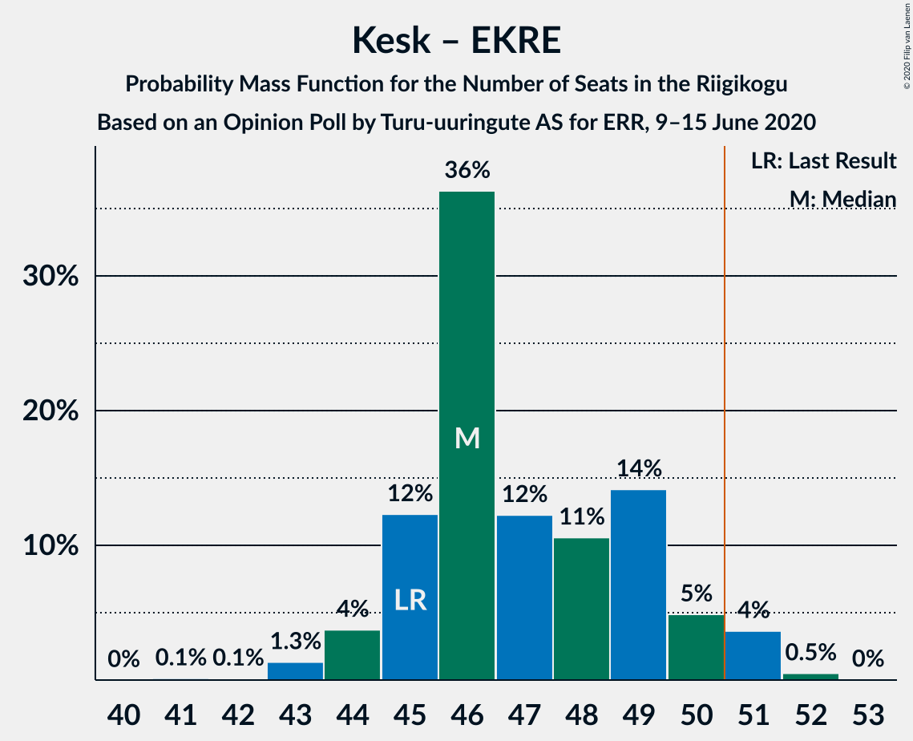

| Number of Seats | Probability | Accumulated | Special Marks |
|:---------------:|:-----------:|:-----------:|:-------------:|
| 41 | 0.1% | 100% |  |
| 42 | 0.1% | 99.9% |  |
| 43 | 1.3% | 99.7% |  |
| 44 | 4% | 98% |  |
| 45 | 12% | 95% | Last Result |
| 46 | 36% | 82% |  |
| 47 | 12% | 46% | Median |
| 48 | 11% | 34% |  |
| 49 | 14% | 23% |  |
| 50 | 5% | 9% |  |
| 51 | 4% | 4% | Majority |
| 52 | 0.5% | 0.6% |  |
| 53 | 0% | 0% |  |

### Eesti Keskerakond – Eesti Konservatiivne Rahvaerakond – Erakond Isamaa

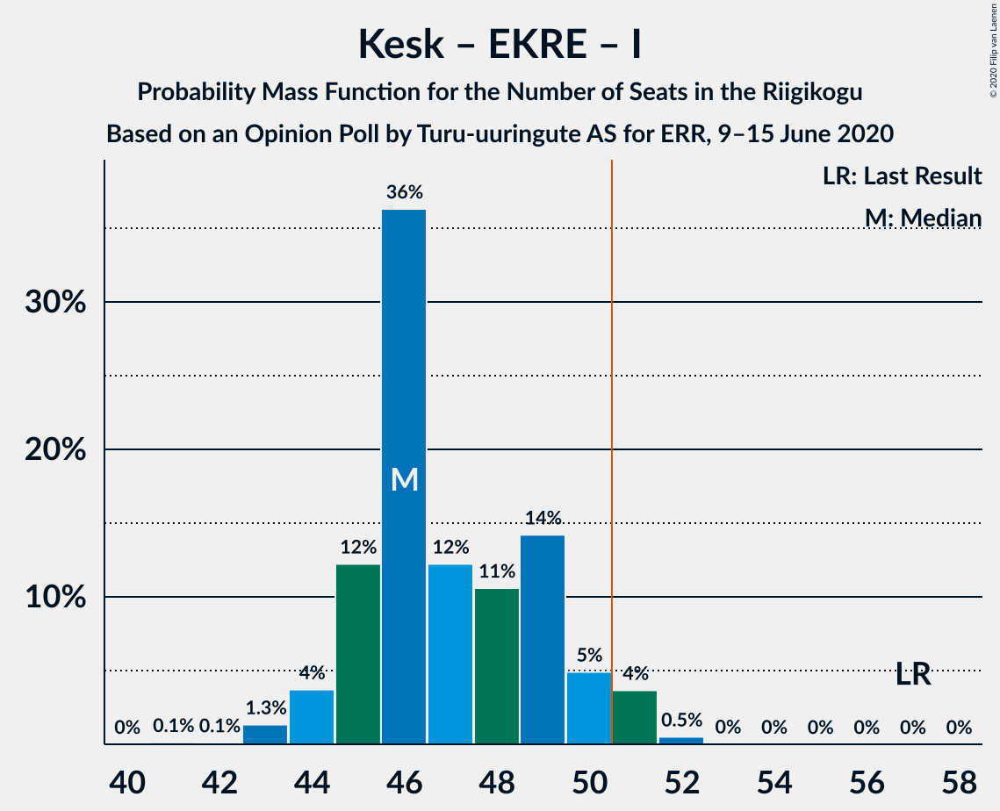

| Number of Seats | Probability | Accumulated | Special Marks |
|:---------------:|:-----------:|:-----------:|:-------------:|
| 41 | 0.1% | 100% |  |
| 42 | 0.1% | 99.9% |  |
| 43 | 1.3% | 99.8% |  |
| 44 | 4% | 98% |  |
| 45 | 12% | 95% |  |
| 46 | 36% | 82% |  |
| 47 | 12% | 46% | Median |
| 48 | 11% | 34% |  |
| 49 | 14% | 23% |  |
| 50 | 5% | 9% |  |
| 51 | 4% | 4% | Majority |
| 52 | 0.5% | 0.6% |  |
| 53 | 0% | 0% |  |
| 54 | 0% | 0% |  |
| 55 | 0% | 0% |  |
| 56 | 0% | 0% |  |
| 57 | 0% | 0% | Last Result |

### Eesti Reformierakond – Sotsiaaldemokraatlik Erakond – Erakond Isamaa – Eesti Vabaerakond

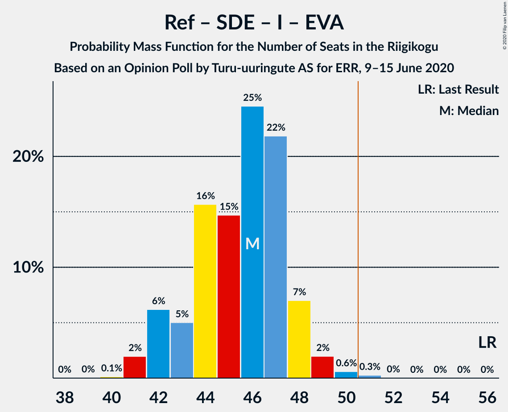

| Number of Seats | Probability | Accumulated | Special Marks |
|:---------------:|:-----------:|:-----------:|:-------------:|
| 39 | 0% | 100% |  |
| 40 | 0.1% | 99.9% |  |
| 41 | 2% | 99.8% |  |
| 42 | 6% | 98% |  |
| 43 | 5% | 92% |  |
| 44 | 16% | 87% |  |
| 45 | 15% | 71% |  |
| 46 | 25% | 56% | Median |
| 47 | 22% | 32% |  |
| 48 | 7% | 10% |  |
| 49 | 2% | 3% |  |
| 50 | 0.6% | 0.9% |  |
| 51 | 0.3% | 0.3% | Majority |
| 52 | 0% | 0% |  |
| 53 | 0% | 0% |  |
| 54 | 0% | 0% |  |
| 55 | 0% | 0% |  |
| 56 | 0% | 0% | Last Result |

### Eesti Reformierakond – Sotsiaaldemokraatlik Erakond – Erakond Isamaa

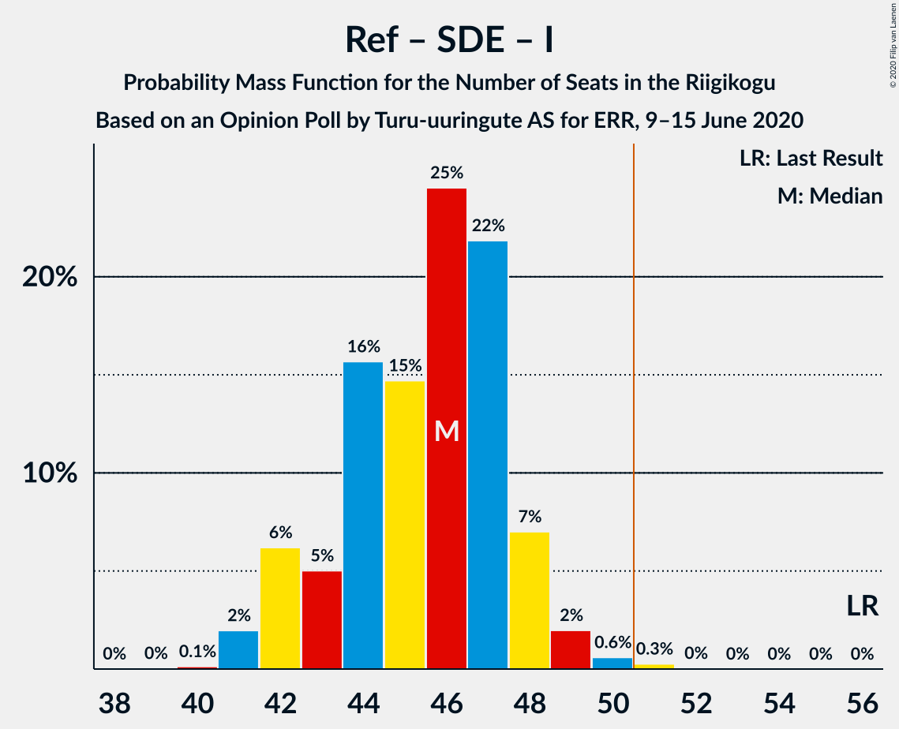

| Number of Seats | Probability | Accumulated | Special Marks |
|:---------------:|:-----------:|:-----------:|:-------------:|
| 39 | 0% | 100% |  |
| 40 | 0.1% | 99.9% |  |
| 41 | 2% | 99.8% |  |
| 42 | 6% | 98% |  |
| 43 | 5% | 92% |  |
| 44 | 16% | 87% |  |
| 45 | 15% | 71% |  |
| 46 | 25% | 56% | Median |
| 47 | 22% | 32% |  |
| 48 | 7% | 10% |  |
| 49 | 2% | 3% |  |
| 50 | 0.6% | 0.9% |  |
| 51 | 0.3% | 0.3% | Majority |
| 52 | 0% | 0% |  |
| 53 | 0% | 0% |  |
| 54 | 0% | 0% |  |
| 55 | 0% | 0% |  |
| 56 | 0% | 0% | Last Result |

### Eesti Reformierakond – Sotsiaaldemokraatlik Erakond

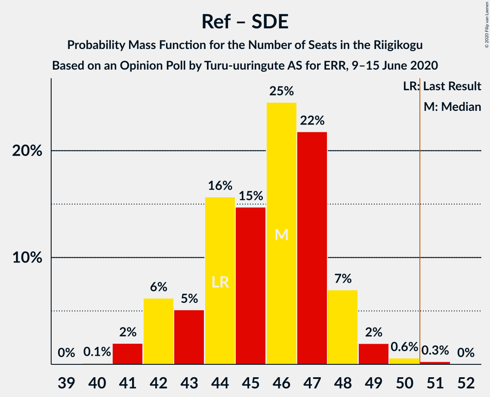

| Number of Seats | Probability | Accumulated | Special Marks |
|:---------------:|:-----------:|:-----------:|:-------------:|
| 39 | 0% | 100% |  |
| 40 | 0.1% | 99.9% |  |
| 41 | 2% | 99.8% |  |
| 42 | 6% | 98% |  |
| 43 | 5% | 92% |  |
| 44 | 16% | 87% | Last Result |
| 45 | 15% | 71% |  |
| 46 | 25% | 56% | Median |
| 47 | 22% | 32% |  |
| 48 | 7% | 10% |  |
| 49 | 2% | 3% |  |
| 50 | 0.6% | 0.9% |  |
| 51 | 0.3% | 0.3% | Majority |
| 52 | 0% | 0% |  |

### Eesti Reformierakond – Erakond Isamaa

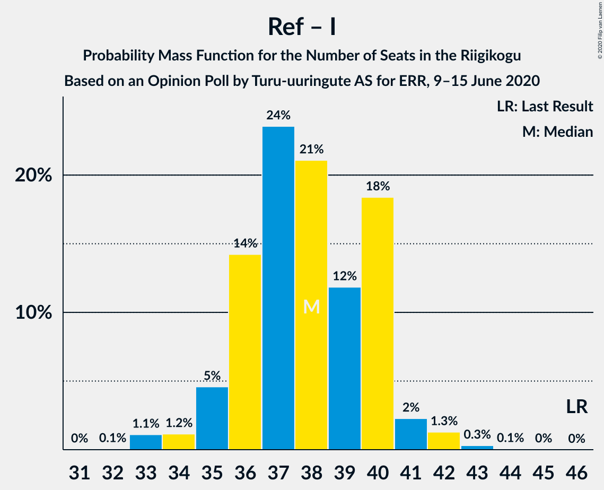

| Number of Seats | Probability | Accumulated | Special Marks |
|:---------------:|:-----------:|:-----------:|:-------------:|
| 32 | 0.1% | 100% |  |
| 33 | 1.1% | 99.9% |  |
| 34 | 1.2% | 98.8% |  |
| 35 | 5% | 98% |  |
| 36 | 14% | 93% |  |
| 37 | 24% | 79% |  |
| 38 | 21% | 55% | Median |
| 39 | 12% | 34% |  |
| 40 | 18% | 22% |  |
| 41 | 2% | 4% |  |
| 42 | 1.3% | 2% |  |
| 43 | 0.3% | 0.4% |  |
| 44 | 0.1% | 0.1% |  |
| 45 | 0% | 0% |  |
| 46 | 0% | 0% | Last Result |

### Eesti Keskerakond – Sotsiaaldemokraatlik Erakond – Erakond Isamaa

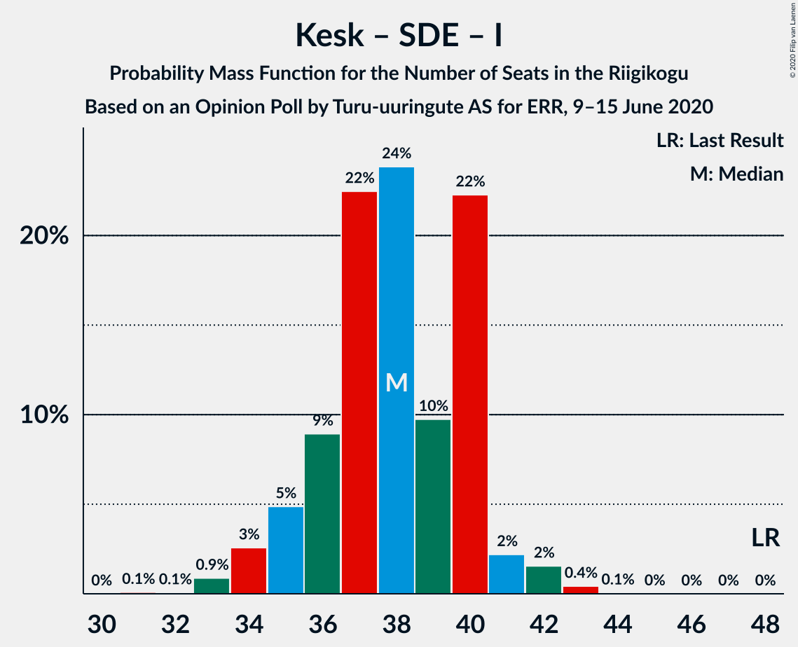

| Number of Seats | Probability | Accumulated | Special Marks |
|:---------------:|:-----------:|:-----------:|:-------------:|
| 31 | 0.1% | 100% |  |
| 32 | 0.1% | 99.9% |  |
| 33 | 0.9% | 99.8% |  |
| 34 | 3% | 99.0% |  |
| 35 | 5% | 96% |  |
| 36 | 9% | 92% |  |
| 37 | 22% | 83% |  |
| 38 | 24% | 60% |  |
| 39 | 10% | 36% | Median |
| 40 | 22% | 27% |  |
| 41 | 2% | 4% |  |
| 42 | 2% | 2% |  |
| 43 | 0.4% | 0.5% |  |
| 44 | 0.1% | 0.1% |  |
| 45 | 0% | 0% |  |
| 46 | 0% | 0% |  |
| 47 | 0% | 0% |  |
| 48 | 0% | 0% | Last Result |

### Eesti Keskerakond – Sotsiaaldemokraatlik Erakond

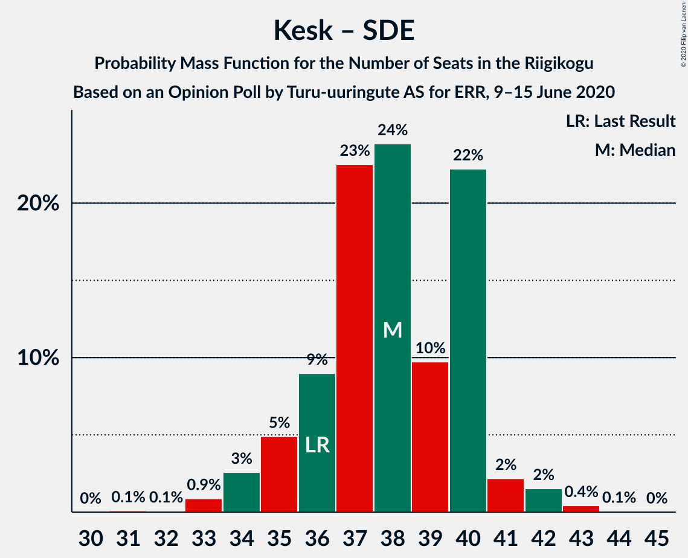

| Number of Seats | Probability | Accumulated | Special Marks |
|:---------------:|:-----------:|:-----------:|:-------------:|
| 31 | 0.1% | 100% |  |
| 32 | 0.1% | 99.9% |  |
| 33 | 0.9% | 99.8% |  |
| 34 | 3% | 99.0% |  |
| 35 | 5% | 96% |  |
| 36 | 9% | 91% | Last Result |
| 37 | 23% | 83% |  |
| 38 | 24% | 60% |  |
| 39 | 10% | 36% | Median |
| 40 | 22% | 26% |  |
| 41 | 2% | 4% |  |
| 42 | 2% | 2% |  |
| 43 | 0.4% | 0.5% |  |
| 44 | 0.1% | 0.1% |  |
| 45 | 0% | 0% |  |

### Eesti Konservatiivne Rahvaerakond – Sotsiaaldemokraatlik Erakond

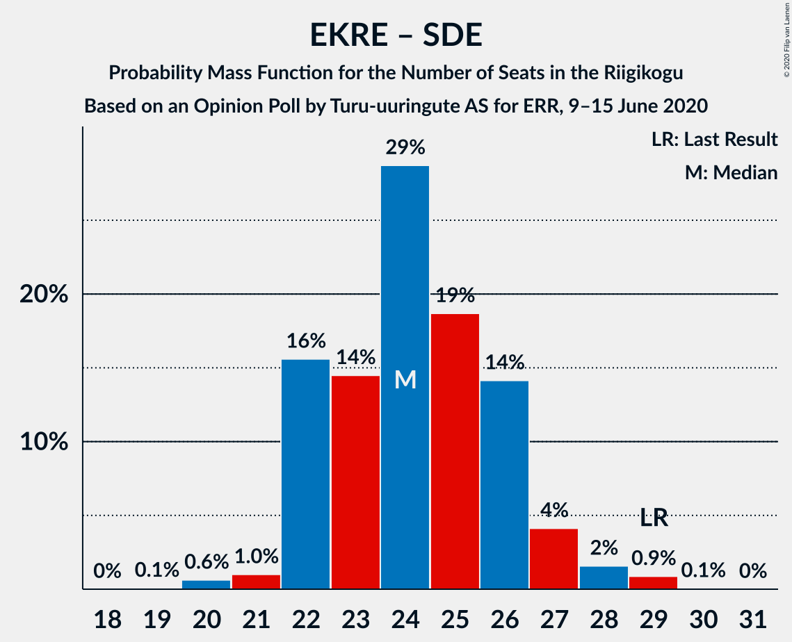

| Number of Seats | Probability | Accumulated | Special Marks |
|:---------------:|:-----------:|:-----------:|:-------------:|
| 19 | 0.1% | 100% |  |
| 20 | 0.6% | 99.9% |  |
| 21 | 1.0% | 99.3% |  |
| 22 | 16% | 98% |  |
| 23 | 14% | 83% |  |
| 24 | 29% | 68% | Median |
| 25 | 19% | 39% |  |
| 26 | 14% | 21% |  |
| 27 | 4% | 7% |  |
| 28 | 2% | 3% |  |
| 29 | 0.9% | 0.9% | Last Result |
| 30 | 0.1% | 0.1% |  |
| 31 | 0% | 0% |  |

## Technical Information

### Opinion Poll

+ **Polling firm:** Turu-uuringute AS
+ **Commissioner(s):** ERR
+ **Fieldwork period:** 9–15 June 2020

### Calculations

+ **Sample size:** 1004
+ **Simulations done:** 131,072
+ **Error estimate:** 1.80%

