# Opinion Poll by Norstat for MTÜ Ühiskonnauuringute Instituut, 9–16 June 2020

<a href="#voting-intentions">Voting Intentions</a> | <a href="#seats">Seats</a> | <a href="#coalitions">Coalitions</a> | <a href="#technical-information">Technical Information</a>

## Voting Intentions

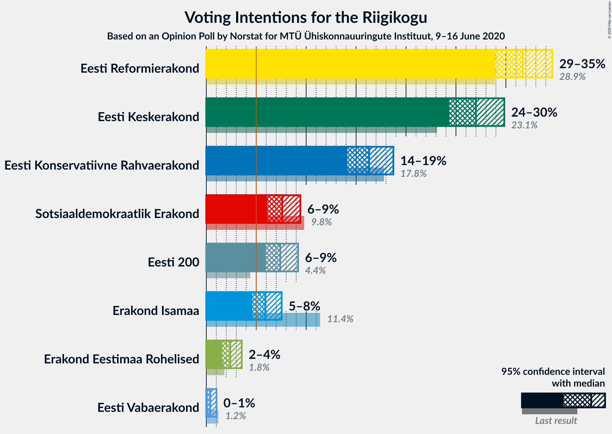

### Confidence Intervals

| Party | Last Result | Poll Result | 80% Confidence Interval | 90% Confidence Interval | 95% Confidence Interval | 99% Confidence Interval |
|:-----:|:-----------:|:-----------:|:-----------------------:|:-----------------------:|:-----------------------:|:-----------------------:|
| Eesti Reformierakond | 28.9% | 31.7% | 29.9–33.6% |29.3–34.2% |28.9–34.7% |28.0–35.6% |
| Eesti Keskerakond | 23.1% | 27.0% | 25.3–28.9% |24.8–29.4% |24.3–29.8% |23.5–30.7% |
| Eesti Konservatiivne Rahvaerakond | 17.8% | 16.3% | 14.9–17.9% |14.5–18.3% |14.1–18.7% |13.5–19.5% |
| Sotsiaaldemokraatlik Erakond | 9.8% | 7.6% | 6.6–8.8% |6.3–9.1% |6.1–9.4% |5.7–10.0% |
| Eesti 200 | 4.4% | 7.4% | 6.4–8.6% |6.2–8.9% |5.9–9.2% |5.5–9.8% |
| Erakond Isamaa | 11.4% | 5.9% | 5.0–7.0% |4.8–7.3% |4.6–7.5% |4.2–8.1% |
| Erakond Eestimaa Rohelised | 1.8% | 2.4% | 1.9–3.2% |1.7–3.4% |1.6–3.6% |1.4–3.9% |
| Eesti Vabaerakond | 1.2% | 0.4% | 0.2–0.8% |0.2–0.9% |0.2–1.0% |0.1–1.3% |

*Note:* The poll result column reflects the actual value used in the calculations. Published results may vary slightly, and in addition be rounded to fewer digits.

## Seats

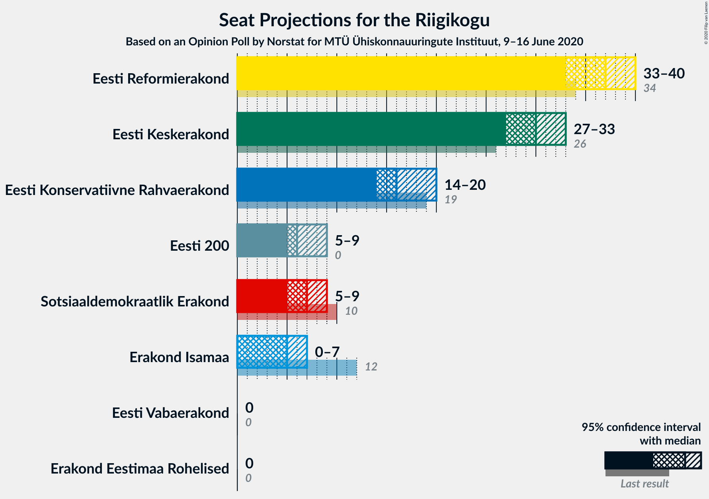

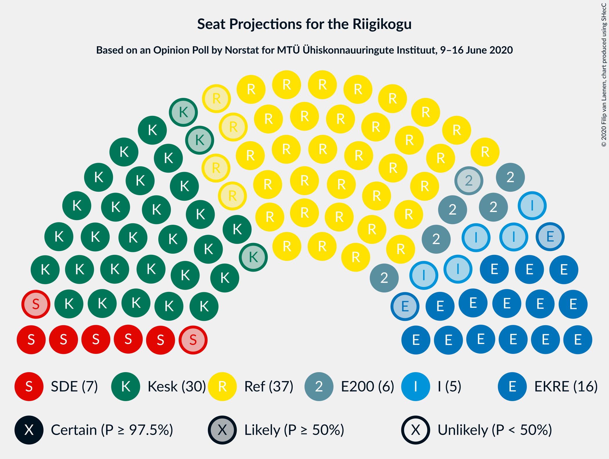

### Confidence Intervals

| Party | Last Result | Median | 80% Confidence Interval | 90% Confidence Interval | 95% Confidence Interval | 99% Confidence Interval |
|:-----:|:-----------:|:------:|:-----------------------:|:-----------------------:|:-----------------------:|:-----------------------:|
| <a href="#eesti-reformierakond">Eesti Reformierakond</a> | 34 | 37 | 34–38 |33–39 |33–40 |31–41 |
| <a href="#eesti-keskerakond">Eesti Keskerakond</a> | 26 | 30 | 28–31 |28–32 |27–33 |26–34 |
| <a href="#eesti-konservatiivne-rahvaerakond">Eesti Konservatiivne Rahvaerakond</a> | 19 | 16 | 15–19 |14–19 |14–20 |13–21 |
| <a href="#sotsiaaldemokraatlik-erakond">Sotsiaaldemokraatlik Erakond</a> | 10 | 7 | 6–8 |6–9 |5–9 |5–10 |
| <a href="#eesti-200">Eesti 200</a> | 0 | 6 | 5–8 |5–8 |5–9 |5–10 |
| <a href="#erakond-isamaa">Erakond Isamaa</a> | 12 | 5 | 4–6 |0–7 |0–7 |0–8 |
| <a href="#erakond-eestimaa-rohelised">Erakond Eestimaa Rohelised</a> | 0 | 0 | 0 |0 |0 |0 |
| <a href="#eesti-vabaerakond">Eesti Vabaerakond</a> | 0 | 0 | 0 |0 |0 |0 |

### Eesti Reformierakond

*For a full overview of the results for this party, see the [Eesti Reformierakond](party-eestireformierakond.html) page.*

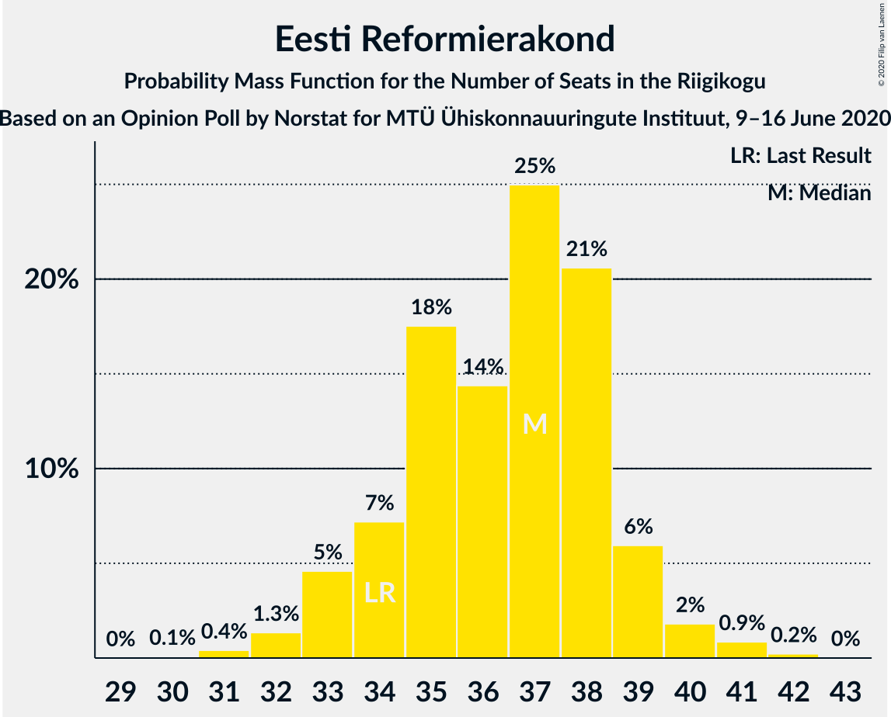

| Number of Seats | Probability | Accumulated | Special Marks |
|:---------------:|:-----------:|:-----------:|:-------------:|
| 30 | 0.1% | 100% |  |
| 31 | 0.4% | 99.9% |  |
| 32 | 1.3% | 99.5% |  |
| 33 | 5% | 98% |  |
| 34 | 7% | 94% | Last Result |
| 35 | 18% | 86% |  |
| 36 | 14% | 69% |  |
| 37 | 25% | 54% | Median |
| 38 | 21% | 29% |  |
| 39 | 6% | 9% |  |
| 40 | 2% | 3% |  |
| 41 | 0.9% | 1.1% |  |
| 42 | 0.2% | 0.3% |  |
| 43 | 0% | 0% |  |

### Eesti Keskerakond

*For a full overview of the results for this party, see the [Eesti Keskerakond](party-eestikeskerakond.html) page.*

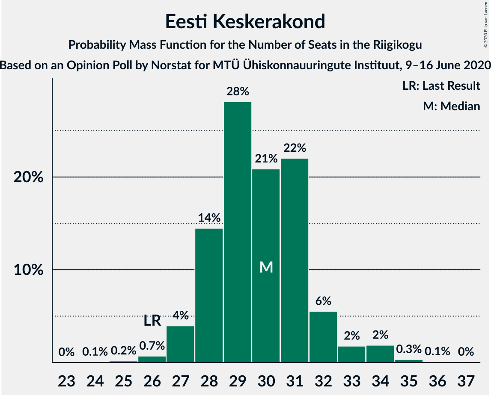

| Number of Seats | Probability | Accumulated | Special Marks |
|:---------------:|:-----------:|:-----------:|:-------------:|
| 24 | 0.1% | 100% |  |
| 25 | 0.2% | 99.9% |  |
| 26 | 0.7% | 99.8% | Last Result |
| 27 | 4% | 99.1% |  |
| 28 | 14% | 95% |  |
| 29 | 28% | 81% |  |
| 30 | 21% | 53% | Median |
| 31 | 22% | 32% |  |
| 32 | 6% | 10% |  |
| 33 | 2% | 4% |  |
| 34 | 2% | 2% |  |
| 35 | 0.3% | 0.5% |  |
| 36 | 0.1% | 0.1% |  |
| 37 | 0% | 0% |  |

### Eesti Konservatiivne Rahvaerakond

*For a full overview of the results for this party, see the [Eesti Konservatiivne Rahvaerakond](party-eestikonservatiivnerahvaerakond.html) page.*

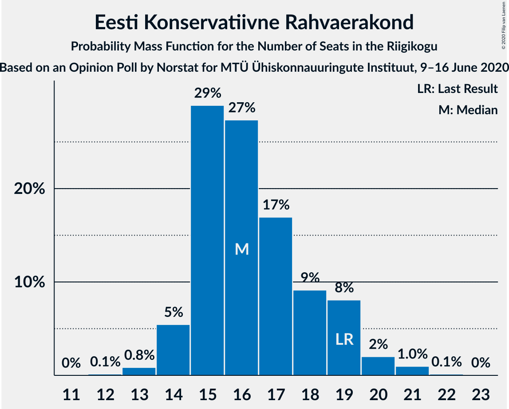

| Number of Seats | Probability | Accumulated | Special Marks |
|:---------------:|:-----------:|:-----------:|:-------------:|
| 12 | 0.1% | 100% |  |
| 13 | 0.8% | 99.9% |  |
| 14 | 5% | 99.0% |  |
| 15 | 29% | 94% |  |
| 16 | 27% | 65% | Median |
| 17 | 17% | 37% |  |
| 18 | 9% | 20% |  |
| 19 | 8% | 11% | Last Result |
| 20 | 2% | 3% |  |
| 21 | 1.0% | 1.1% |  |
| 22 | 0.1% | 0.2% |  |
| 23 | 0% | 0% |  |

### Sotsiaaldemokraatlik Erakond

*For a full overview of the results for this party, see the [Sotsiaaldemokraatlik Erakond](party-sotsiaaldemokraatlikerakond.html) page.*

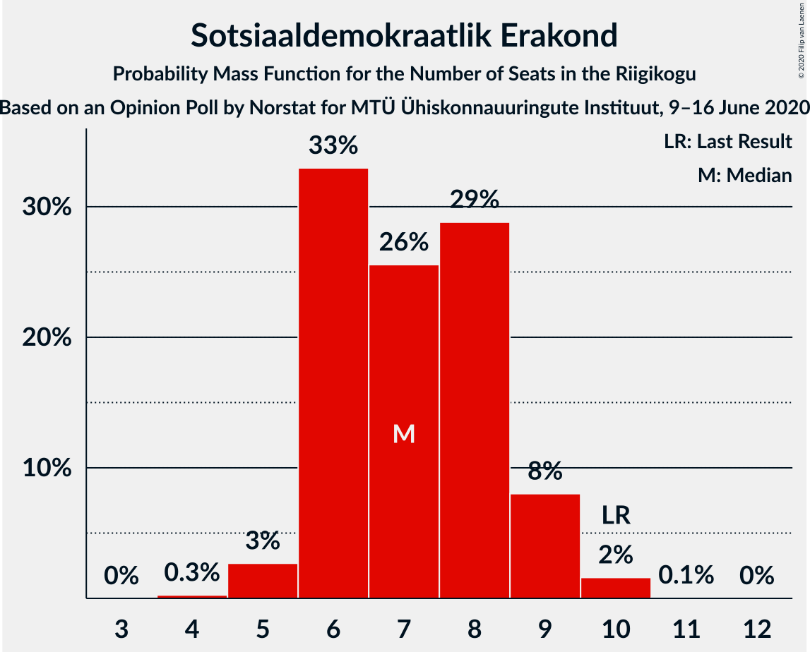

| Number of Seats | Probability | Accumulated | Special Marks |
|:---------------:|:-----------:|:-----------:|:-------------:|
| 4 | 0.3% | 100% |  |
| 5 | 3% | 99.7% |  |
| 6 | 33% | 97% |  |
| 7 | 26% | 64% | Median |
| 8 | 29% | 38% |  |
| 9 | 8% | 10% |  |
| 10 | 2% | 2% | Last Result |
| 11 | 0.1% | 0.1% |  |
| 12 | 0% | 0% |  |

### Eesti 200

*For a full overview of the results for this party, see the [Eesti 200](party-eesti200.html) page.*

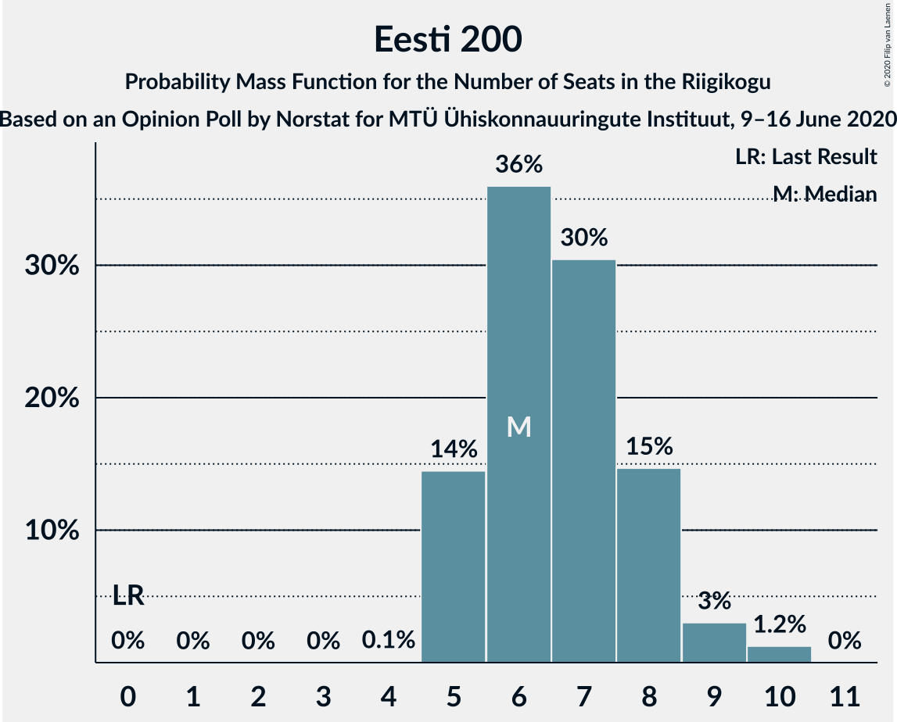

| Number of Seats | Probability | Accumulated | Special Marks |
|:---------------:|:-----------:|:-----------:|:-------------:|
| 0 | 0% | 100% | Last Result |
| 1 | 0% | 100% |  |
| 2 | 0% | 100% |  |
| 3 | 0% | 100% |  |
| 4 | 0.1% | 100% |  |
| 5 | 14% | 99.9% |  |
| 6 | 36% | 85% | Median |
| 7 | 30% | 49% |  |
| 8 | 15% | 19% |  |
| 9 | 3% | 4% |  |
| 10 | 1.2% | 1.3% |  |
| 11 | 0% | 0% |  |

### Erakond Isamaa

*For a full overview of the results for this party, see the [Erakond Isamaa](party-erakondisamaa.html) page.*

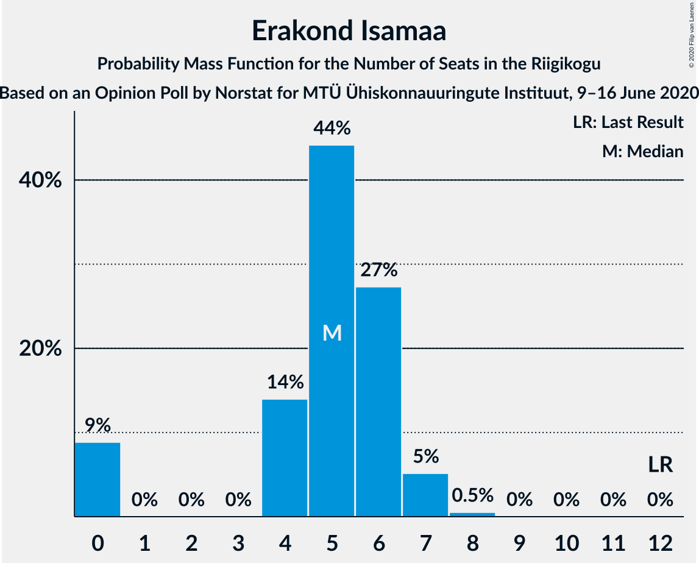

| Number of Seats | Probability | Accumulated | Special Marks |
|:---------------:|:-----------:|:-----------:|:-------------:|
| 0 | 9% | 100% |  |
| 1 | 0% | 91% |  |
| 2 | 0% | 91% |  |
| 3 | 0% | 91% |  |
| 4 | 14% | 91% |  |
| 5 | 44% | 77% | Median |
| 6 | 27% | 33% |  |
| 7 | 5% | 6% |  |
| 8 | 0.5% | 0.5% |  |
| 9 | 0% | 0% |  |
| 10 | 0% | 0% |  |
| 11 | 0% | 0% |  |
| 12 | 0% | 0% | Last Result |

### Erakond Eestimaa Rohelised

*For a full overview of the results for this party, see the [Erakond Eestimaa Rohelised](party-erakondeestimaarohelised.html) page.*

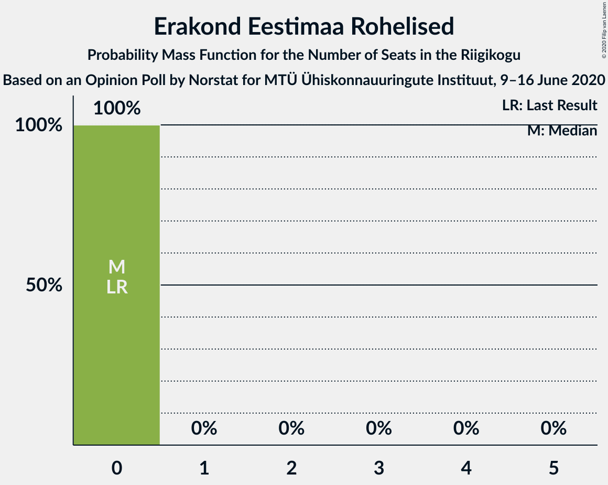

| Number of Seats | Probability | Accumulated | Special Marks |
|:---------------:|:-----------:|:-----------:|:-------------:|
| 0 | 100% | 100% | Last Result, Median |

### Eesti Vabaerakond

*For a full overview of the results for this party, see the [Eesti Vabaerakond](party-eestivabaerakond.html) page.*

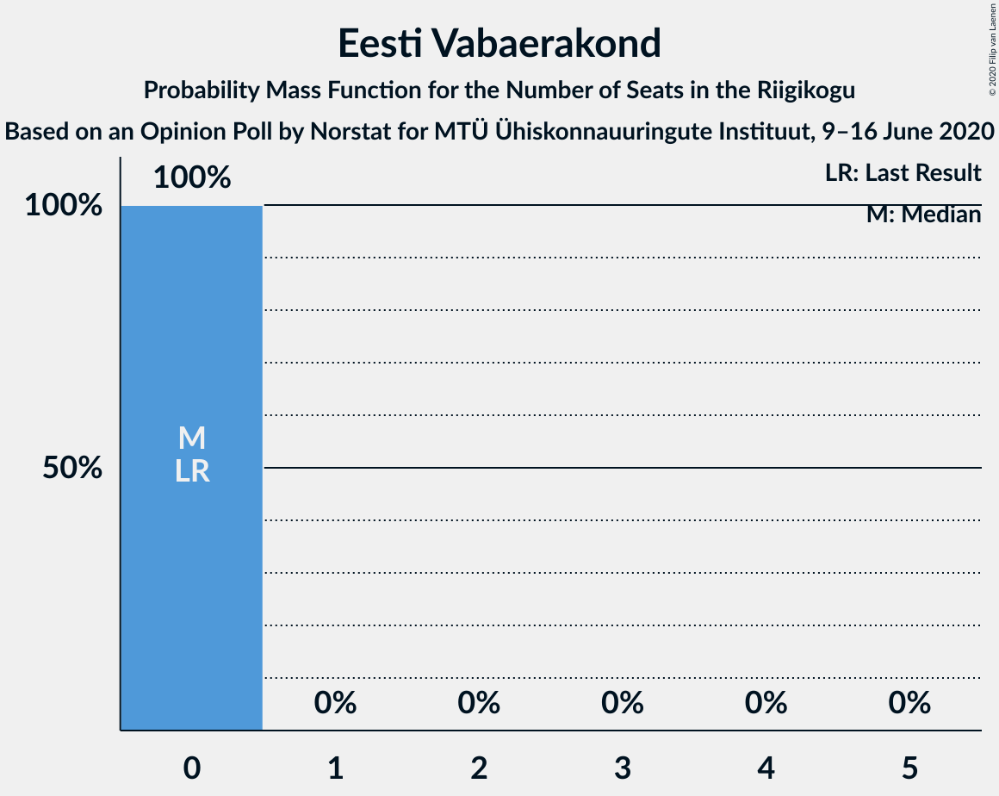

| Number of Seats | Probability | Accumulated | Special Marks |
|:---------------:|:-----------:|:-----------:|:-------------:|
| 0 | 100% | 100% | Last Result, Median |

## Coalitions

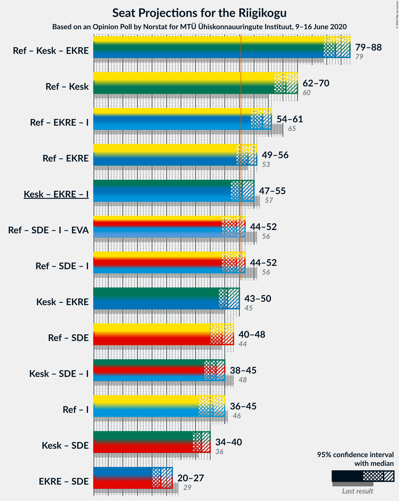

### Confidence Intervals

| Coalition | Last Result | Median | Majority? | 80% Confidence Interval | 90% Confidence Interval | 95% Confidence Interval | 99% Confidence Interval |
|:---------:|:-----------:|:------:|:---------:|:-----------------------:|:-----------------------:|:-----------------------:|:-----------------------:|
| Eesti Reformierakond – Eesti Keskerakond – Eesti Konservatiivne Rahvaerakond | 79 | 83 | 100% | 80–85 | 79–86 | 79–88 | 78–89 |
| Eesti Reformierakond – Eesti Keskerakond | 60 | 66 | 100% | 63–68 | 63–70 | 62–70 | 61–72 |
| Eesti Reformierakond – Eesti Konservatiivne Rahvaerakond – Erakond Isamaa | 65 | 58 | 100% | 55–59 | 54–60 | 54–61 | 52–62 |
| Eesti Reformierakond – Eesti Konservatiivne Rahvaerakond | 53 | 53 | 94% | 51–55 | 50–55 | 49–56 | 47–58 |
| Eesti Keskerakond – Eesti Konservatiivne Rahvaerakond – Erakond Isamaa | 57 | 51 | 58% | 48–53 | 48–54 | 47–55 | 46–57 |
| Eesti Reformierakond – Sotsiaaldemokraatlik Erakond – Erakond Isamaa – Eesti Vabaerakond | 56 | 49 | 20% | 45–51 | 44–52 | 44–52 | 42–54 |
| Eesti Reformierakond – Sotsiaaldemokraatlik Erakond – Erakond Isamaa | 56 | 49 | 20% | 45–51 | 44–52 | 44–52 | 42–54 |
| Eesti Keskerakond – Eesti Konservatiivne Rahvaerakond | 45 | 46 | 2% | 43–49 | 43–50 | 43–50 | 41–52 |
| Eesti Reformierakond – Sotsiaaldemokraatlik Erakond | 44 | 44 | 0% | 41–46 | 40–47 | 40–48 | 38–49 |
| Eesti Keskerakond – Sotsiaaldemokraatlik Erakond – Erakond Isamaa | 48 | 42 | 0% | 40–43 | 39–44 | 38–45 | 36–48 |
| Eesti Reformierakond – Erakond Isamaa | 46 | 41 | 0% | 38–44 | 37–44 | 36–45 | 35–46 |
| Eesti Keskerakond – Sotsiaaldemokraatlik Erakond | 36 | 37 | 0% | 35–39 | 35–40 | 34–40 | 33–42 |
| Eesti Konservatiivne Rahvaerakond – Sotsiaaldemokraatlik Erakond | 29 | 23 | 0% | 21–26 | 21–26 | 20–27 | 20–28 |

### Eesti Reformierakond – Eesti Keskerakond – Eesti Konservatiivne Rahvaerakond

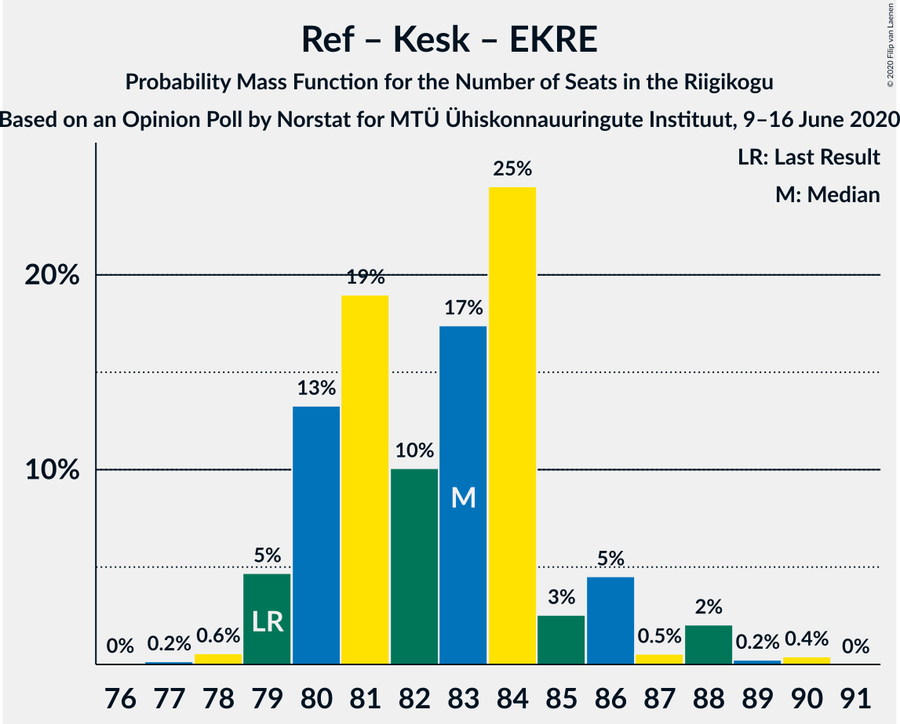

| Number of Seats | Probability | Accumulated | Special Marks |
|:---------------:|:-----------:|:-----------:|:-------------:|
| 77 | 0.2% | 100% |  |
| 78 | 0.6% | 99.8% |  |
| 79 | 5% | 99.2% | Last Result |
| 80 | 13% | 95% |  |
| 81 | 19% | 81% |  |
| 82 | 10% | 62% |  |
| 83 | 17% | 52% | Median |
| 84 | 25% | 35% |  |
| 85 | 3% | 10% |  |
| 86 | 5% | 8% |  |
| 87 | 0.5% | 3% |  |
| 88 | 2% | 3% |  |
| 89 | 0.2% | 0.7% |  |
| 90 | 0.4% | 0.4% |  |
| 91 | 0% | 0% |  |

### Eesti Reformierakond – Eesti Keskerakond

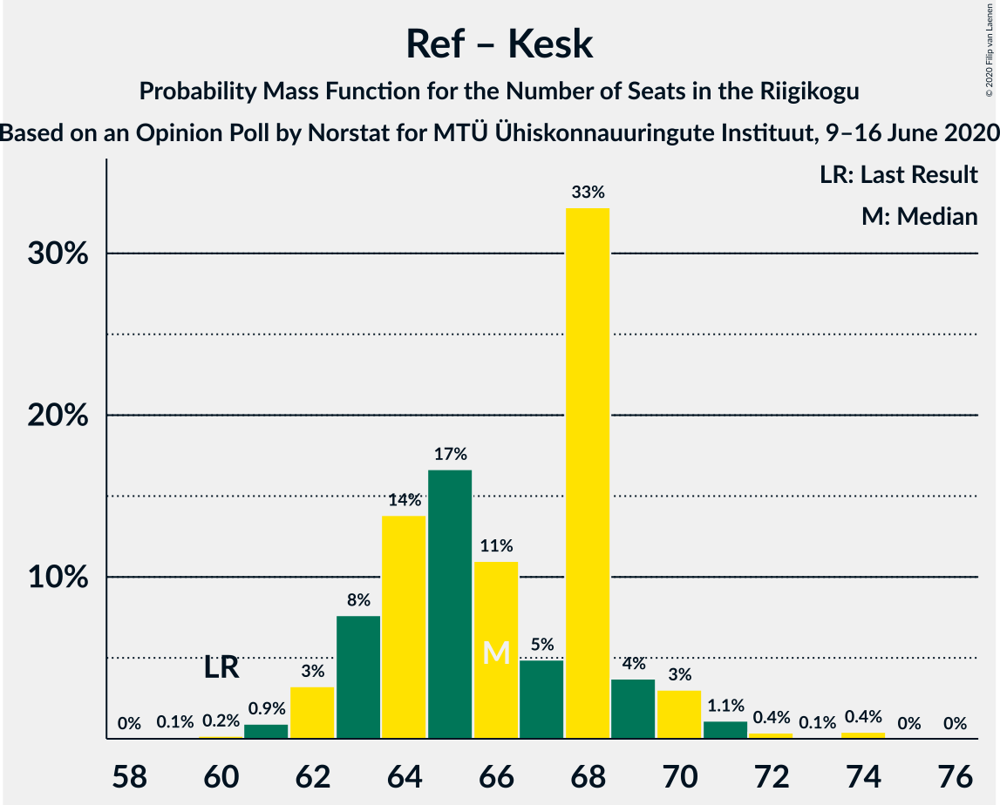

| Number of Seats | Probability | Accumulated | Special Marks |
|:---------------:|:-----------:|:-----------:|:-------------:|
| 59 | 0.1% | 100% |  |
| 60 | 0.2% | 99.9% | Last Result |
| 61 | 0.9% | 99.7% |  |
| 62 | 3% | 98.8% |  |
| 63 | 8% | 96% |  |
| 64 | 14% | 88% |  |
| 65 | 17% | 74% |  |
| 66 | 11% | 57% |  |
| 67 | 5% | 46% | Median |
| 68 | 33% | 42% |  |
| 69 | 4% | 9% |  |
| 70 | 3% | 5% |  |
| 71 | 1.1% | 2% |  |
| 72 | 0.4% | 0.9% |  |
| 73 | 0.1% | 0.5% |  |
| 74 | 0.4% | 0.4% |  |
| 75 | 0% | 0% |  |

### Eesti Reformierakond – Eesti Konservatiivne Rahvaerakond – Erakond Isamaa

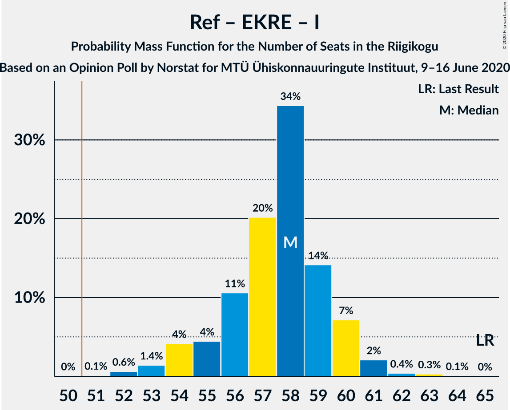

| Number of Seats | Probability | Accumulated | Special Marks |
|:---------------:|:-----------:|:-----------:|:-------------:|
| 51 | 0.1% | 100% | Majority |
| 52 | 0.6% | 99.8% |  |
| 53 | 1.4% | 99.2% |  |
| 54 | 4% | 98% |  |
| 55 | 4% | 94% |  |
| 56 | 11% | 89% |  |
| 57 | 20% | 79% |  |
| 58 | 34% | 58% | Median |
| 59 | 14% | 24% |  |
| 60 | 7% | 10% |  |
| 61 | 2% | 3% |  |
| 62 | 0.4% | 0.7% |  |
| 63 | 0.3% | 0.4% |  |
| 64 | 0.1% | 0.1% |  |
| 65 | 0% | 0% | Last Result |

### Eesti Reformierakond – Eesti Konservatiivne Rahvaerakond

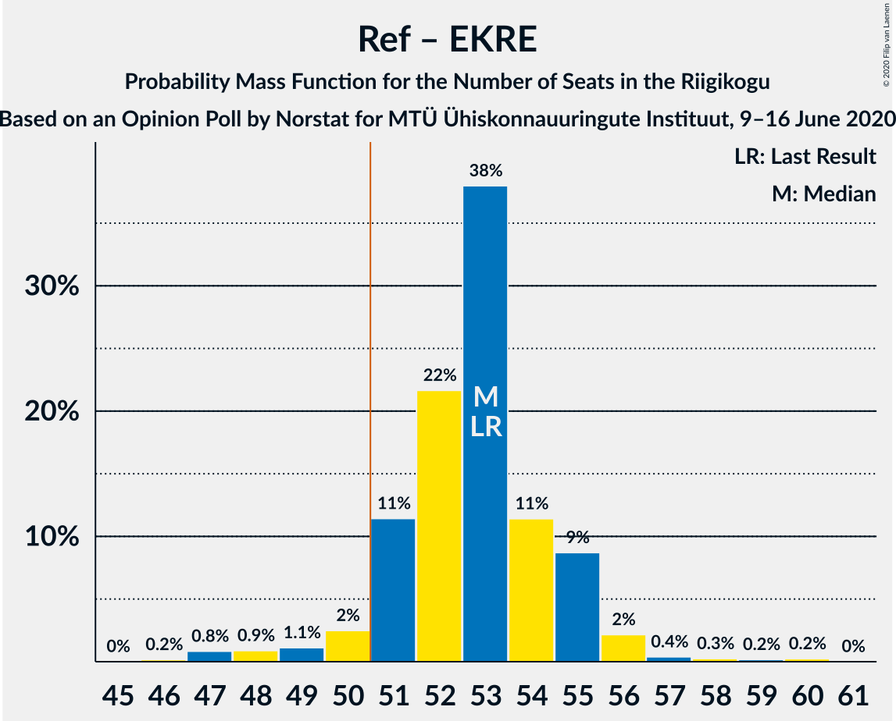

| Number of Seats | Probability | Accumulated | Special Marks |
|:---------------:|:-----------:|:-----------:|:-------------:|
| 46 | 0.2% | 100% |  |
| 47 | 0.8% | 99.8% |  |
| 48 | 0.9% | 99.0% |  |
| 49 | 1.1% | 98% |  |
| 50 | 2% | 97% |  |
| 51 | 11% | 94% | Majority |
| 52 | 22% | 83% |  |
| 53 | 38% | 61% | Last Result, Median |
| 54 | 11% | 23% |  |
| 55 | 9% | 12% |  |
| 56 | 2% | 3% |  |
| 57 | 0.4% | 1.1% |  |
| 58 | 0.3% | 0.7% |  |
| 59 | 0.2% | 0.5% |  |
| 60 | 0.2% | 0.3% |  |
| 61 | 0% | 0% |  |

### Eesti Keskerakond – Eesti Konservatiivne Rahvaerakond – Erakond Isamaa

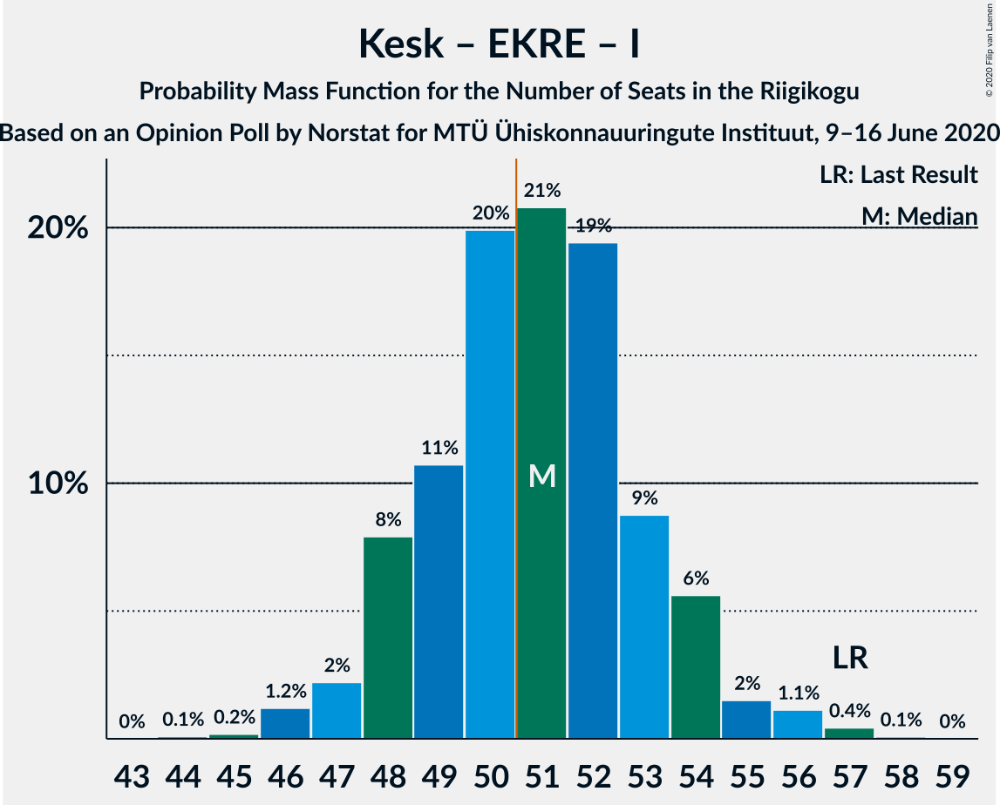

| Number of Seats | Probability | Accumulated | Special Marks |
|:---------------:|:-----------:|:-----------:|:-------------:|
| 44 | 0.1% | 100% |  |
| 45 | 0.2% | 99.9% |  |
| 46 | 1.2% | 99.7% |  |
| 47 | 2% | 98.5% |  |
| 48 | 8% | 96% |  |
| 49 | 11% | 88% |  |
| 50 | 20% | 78% |  |
| 51 | 21% | 58% | Median, Majority |
| 52 | 19% | 37% |  |
| 53 | 9% | 18% |  |
| 54 | 6% | 9% |  |
| 55 | 2% | 3% |  |
| 56 | 1.1% | 2% |  |
| 57 | 0.4% | 0.5% | Last Result |
| 58 | 0.1% | 0.1% |  |
| 59 | 0% | 0% |  |

### Eesti Reformierakond – Sotsiaaldemokraatlik Erakond – Erakond Isamaa – Eesti Vabaerakond

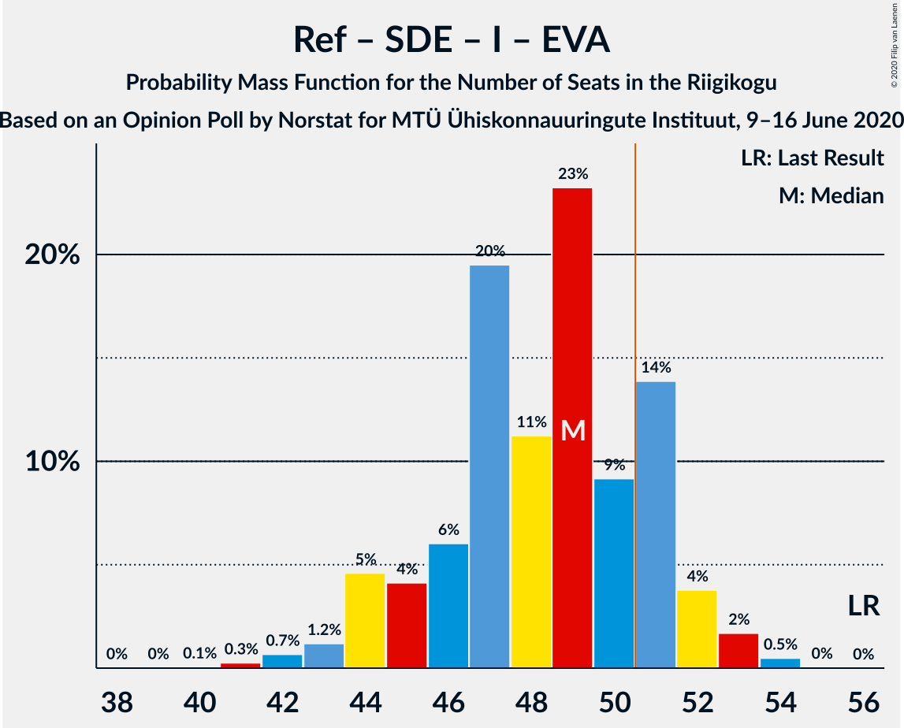

| Number of Seats | Probability | Accumulated | Special Marks |
|:---------------:|:-----------:|:-----------:|:-------------:|
| 40 | 0.1% | 100% |  |
| 41 | 0.3% | 99.9% |  |
| 42 | 0.7% | 99.6% |  |
| 43 | 1.2% | 99.0% |  |
| 44 | 5% | 98% |  |
| 45 | 4% | 93% |  |
| 46 | 6% | 89% |  |
| 47 | 20% | 83% |  |
| 48 | 11% | 64% |  |
| 49 | 23% | 52% | Median |
| 50 | 9% | 29% |  |
| 51 | 14% | 20% | Majority |
| 52 | 4% | 6% |  |
| 53 | 2% | 2% |  |
| 54 | 0.5% | 0.5% |  |
| 55 | 0% | 0% |  |
| 56 | 0% | 0% | Last Result |

### Eesti Reformierakond – Sotsiaaldemokraatlik Erakond – Erakond Isamaa

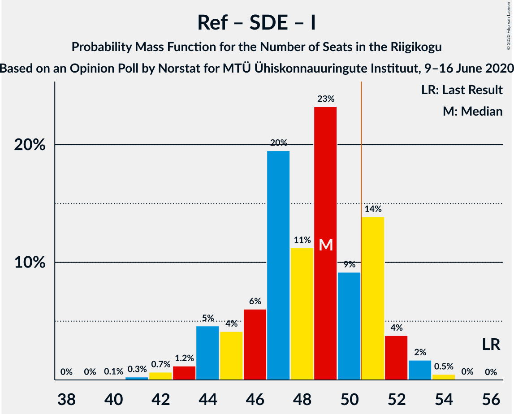

| Number of Seats | Probability | Accumulated | Special Marks |
|:---------------:|:-----------:|:-----------:|:-------------:|
| 40 | 0.1% | 100% |  |
| 41 | 0.3% | 99.9% |  |
| 42 | 0.7% | 99.6% |  |
| 43 | 1.2% | 99.0% |  |
| 44 | 5% | 98% |  |
| 45 | 4% | 93% |  |
| 46 | 6% | 89% |  |
| 47 | 20% | 83% |  |
| 48 | 11% | 64% |  |
| 49 | 23% | 52% | Median |
| 50 | 9% | 29% |  |
| 51 | 14% | 20% | Majority |
| 52 | 4% | 6% |  |
| 53 | 2% | 2% |  |
| 54 | 0.5% | 0.5% |  |
| 55 | 0% | 0% |  |
| 56 | 0% | 0% | Last Result |

### Eesti Keskerakond – Eesti Konservatiivne Rahvaerakond

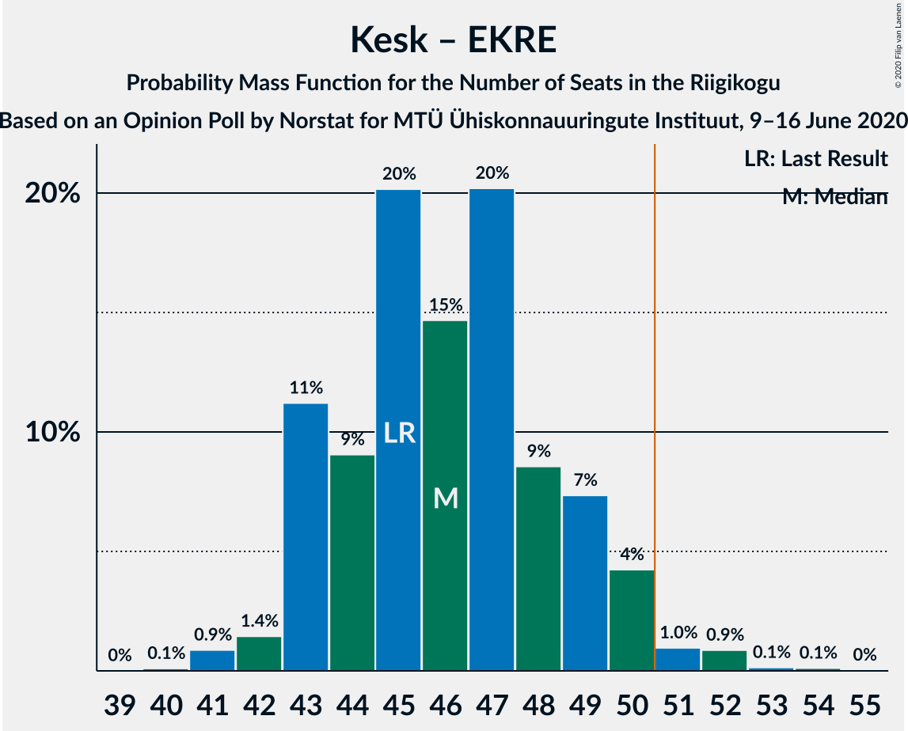

| Number of Seats | Probability | Accumulated | Special Marks |
|:---------------:|:-----------:|:-----------:|:-------------:|
| 40 | 0.1% | 100% |  |
| 41 | 0.9% | 99.9% |  |
| 42 | 1.4% | 99.0% |  |
| 43 | 11% | 98% |  |
| 44 | 9% | 86% |  |
| 45 | 20% | 77% | Last Result |
| 46 | 15% | 57% | Median |
| 47 | 20% | 42% |  |
| 48 | 9% | 22% |  |
| 49 | 7% | 14% |  |
| 50 | 4% | 6% |  |
| 51 | 1.0% | 2% | Majority |
| 52 | 0.9% | 1.2% |  |
| 53 | 0.1% | 0.3% |  |
| 54 | 0.1% | 0.2% |  |
| 55 | 0% | 0% |  |

### Eesti Reformierakond – Sotsiaaldemokraatlik Erakond

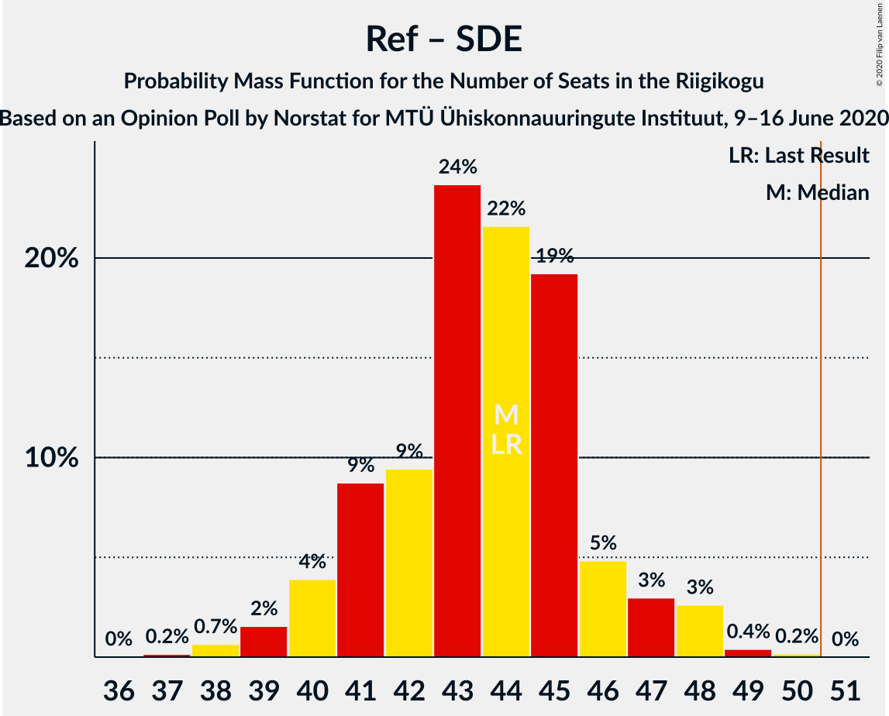

| Number of Seats | Probability | Accumulated | Special Marks |
|:---------------:|:-----------:|:-----------:|:-------------:|
| 37 | 0.2% | 100% |  |
| 38 | 0.7% | 99.8% |  |
| 39 | 2% | 99.2% |  |
| 40 | 4% | 98% |  |
| 41 | 9% | 94% |  |
| 42 | 9% | 85% |  |
| 43 | 24% | 76% |  |
| 44 | 22% | 52% | Last Result, Median |
| 45 | 19% | 30% |  |
| 46 | 5% | 11% |  |
| 47 | 3% | 6% |  |
| 48 | 3% | 3% |  |
| 49 | 0.4% | 0.6% |  |
| 50 | 0.2% | 0.2% |  |
| 51 | 0% | 0% | Majority |

### Eesti Keskerakond – Sotsiaaldemokraatlik Erakond – Erakond Isamaa

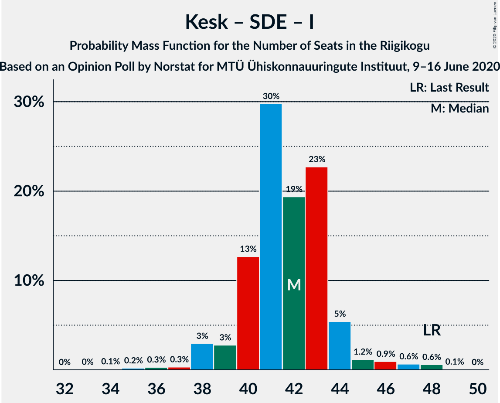

| Number of Seats | Probability | Accumulated | Special Marks |
|:---------------:|:-----------:|:-----------:|:-------------:|
| 34 | 0.1% | 100% |  |
| 35 | 0.2% | 99.9% |  |
| 36 | 0.3% | 99.7% |  |
| 37 | 0.3% | 99.4% |  |
| 38 | 3% | 99.1% |  |
| 39 | 3% | 96% |  |
| 40 | 13% | 93% |  |
| 41 | 30% | 81% |  |
| 42 | 19% | 51% | Median |
| 43 | 23% | 32% |  |
| 44 | 5% | 9% |  |
| 45 | 1.2% | 3% |  |
| 46 | 0.9% | 2% |  |
| 47 | 0.6% | 1.3% |  |
| 48 | 0.6% | 0.7% | Last Result |
| 49 | 0.1% | 0.1% |  |
| 50 | 0% | 0% |  |

### Eesti Reformierakond – Erakond Isamaa

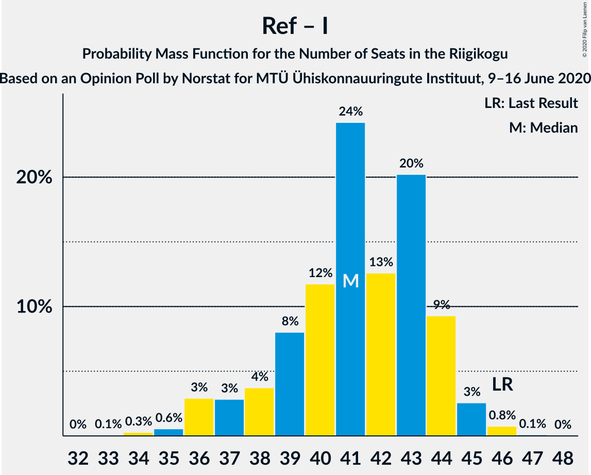

| Number of Seats | Probability | Accumulated | Special Marks |
|:---------------:|:-----------:|:-----------:|:-------------:|
| 32 | 0% | 100% |  |
| 33 | 0.1% | 99.9% |  |
| 34 | 0.3% | 99.9% |  |
| 35 | 0.6% | 99.6% |  |
| 36 | 3% | 99.0% |  |
| 37 | 3% | 96% |  |
| 38 | 4% | 93% |  |
| 39 | 8% | 90% |  |
| 40 | 12% | 82% |  |
| 41 | 24% | 70% |  |
| 42 | 13% | 46% | Median |
| 43 | 20% | 33% |  |
| 44 | 9% | 13% |  |
| 45 | 3% | 3% |  |
| 46 | 0.8% | 0.9% | Last Result |
| 47 | 0.1% | 0.1% |  |
| 48 | 0% | 0% |  |

### Eesti Keskerakond – Sotsiaaldemokraatlik Erakond

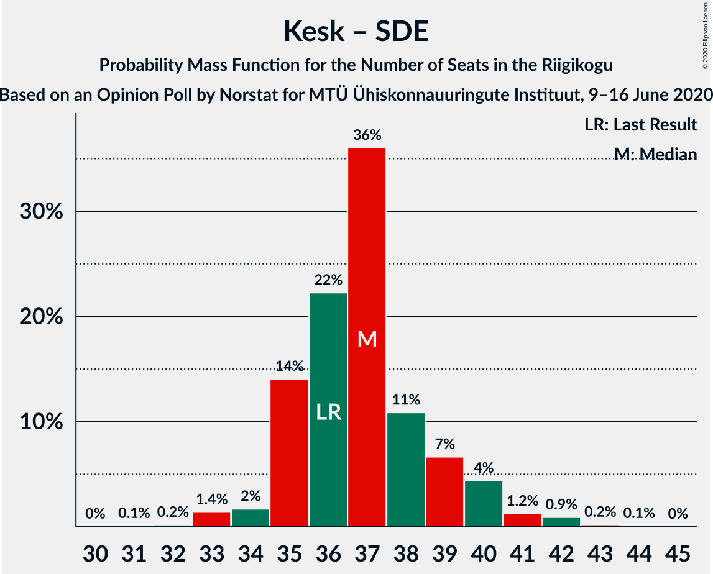

| Number of Seats | Probability | Accumulated | Special Marks |
|:---------------:|:-----------:|:-----------:|:-------------:|
| 31 | 0.1% | 100% |  |
| 32 | 0.2% | 99.9% |  |
| 33 | 1.4% | 99.7% |  |
| 34 | 2% | 98% |  |
| 35 | 14% | 97% |  |
| 36 | 22% | 83% | Last Result |
| 37 | 36% | 60% | Median |
| 38 | 11% | 24% |  |
| 39 | 7% | 13% |  |
| 40 | 4% | 7% |  |
| 41 | 1.2% | 2% |  |
| 42 | 0.9% | 1.2% |  |
| 43 | 0.2% | 0.3% |  |
| 44 | 0.1% | 0.1% |  |
| 45 | 0% | 0% |  |

### Eesti Konservatiivne Rahvaerakond – Sotsiaaldemokraatlik Erakond

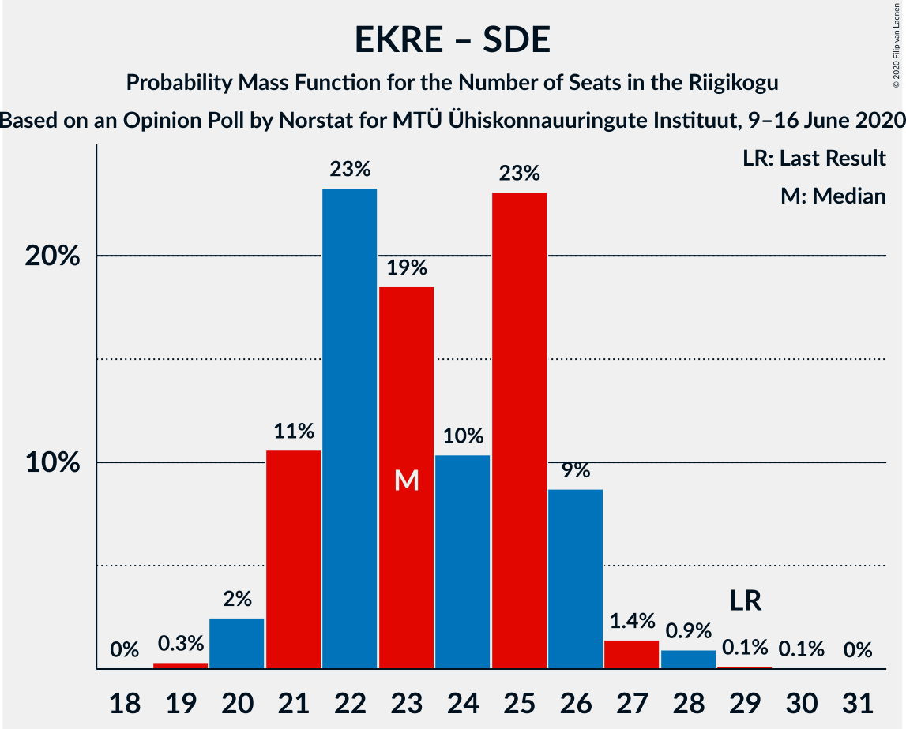

| Number of Seats | Probability | Accumulated | Special Marks |
|:---------------:|:-----------:|:-----------:|:-------------:|
| 19 | 0.3% | 100% |  |
| 20 | 2% | 99.6% |  |
| 21 | 11% | 97% |  |
| 22 | 23% | 87% |  |
| 23 | 19% | 63% | Median |
| 24 | 10% | 45% |  |
| 25 | 23% | 34% |  |
| 26 | 9% | 11% |  |
| 27 | 1.4% | 3% |  |
| 28 | 0.9% | 1.1% |  |
| 29 | 0.1% | 0.2% | Last Result |
| 30 | 0.1% | 0.1% |  |
| 31 | 0% | 0% |  |

## Technical Information

### Opinion Poll

+ **Polling firm:** Norstat
+ **Commissioner(s):** MTÜ Ühiskonnauuringute Instituut
+ **Fieldwork period:** 9–16 June 2020

### Calculations

+ **Sample size:** 1000
+ **Simulations done:** 131,072
+ **Error estimate:** 2.21%

