# Opinion Poll by Norstat for MTÜ Ühiskonnauuringute Instituut, 16–22 June 2020

<a href="#voting-intentions">Voting Intentions</a> | <a href="#seats">Seats</a> | <a href="#coalitions">Coalitions</a> | <a href="#technical-information">Technical Information</a>

## Voting Intentions

### Confidence Intervals

| Party | Last Result | Poll Result | 80% Confidence Interval | 90% Confidence Interval | 95% Confidence Interval | 99% Confidence Interval |
|:-----:|:-----------:|:-----------:|:-----------------------:|:-----------------------:|:-----------------------:|:-----------------------:|
| Eesti Reformierakond | 28.9% | 30.2% | 28.4–32.1% |27.9–32.6% |27.4–33.1% |26.6–34.0% |
| Eesti Keskerakond | 23.1% | 26.0% | 24.3–27.8% |23.8–28.4% |23.4–28.8% |22.6–29.7% |
| Eesti Konservatiivne Rahvaerakond | 17.8% | 16.0% | 14.6–17.6% |14.2–18.0% |13.9–18.4% |13.2–19.2% |
| Sotsiaaldemokraatlik Erakond | 9.8% | 9.3% | 8.2–10.6% |7.9–10.9% |7.7–11.3% |7.2–11.9% |
| Eesti 200 | 4.4% | 9.2% | 8.1–10.5% |7.8–10.8% |7.6–11.2% |7.1–11.8% |
| Erakond Isamaa | 11.4% | 5.9% | 5.0–7.0% |4.8–7.3% |4.6–7.5% |4.2–8.1% |
| Erakond Eestimaa Rohelised | 1.8% | 1.3% | 0.9–1.9% |0.8–2.1% |0.8–2.2% |0.6–2.5% |
| Eesti Vabaerakond | 1.2% | 0.9% | 0.6–1.4% |0.5–1.6% |0.5–1.7% |0.4–2.0% |

*Note:* The poll result column reflects the actual value used in the calculations. Published results may vary slightly, and in addition be rounded to fewer digits.

## Seats

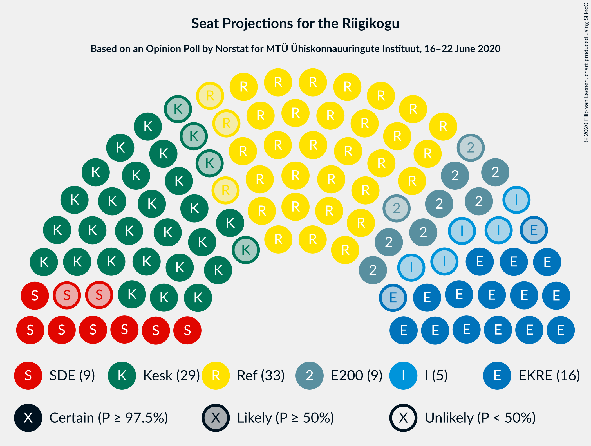

### Confidence Intervals

| Party | Last Result | Median | 80% Confidence Interval | 90% Confidence Interval | 95% Confidence Interval | 99% Confidence Interval |
|:-----:|:-----------:|:------:|:-----------------------:|:-----------------------:|:-----------------------:|:-----------------------:|
| <a href="#eesti-reformierakond">Eesti Reformierakond</a> | 34 | 34 | 31–36 |31–37 |31–37 |29–39 |
| <a href="#eesti-keskerakond">Eesti Keskerakond</a> | 26 | 29 | 26–31 |25–32 |25–32 |24–33 |
| <a href="#eesti-konservatiivne-rahvaerakond">Eesti Konservatiivne Rahvaerakond</a> | 19 | 17 | 15–18 |14–19 |14–19 |13–20 |
| <a href="#sotsiaaldemokraatlik-erakond">Sotsiaaldemokraatlik Erakond</a> | 10 | 9 | 8–10 |7–11 |7–11 |7–12 |
| <a href="#eesti-200">Eesti 200</a> | 0 | 9 | 8–10 |7–10 |7–11 |6–12 |
| <a href="#erakond-isamaa">Erakond Isamaa</a> | 12 | 5 | 0–6 |0–6 |0–7 |0–7 |
| <a href="#erakond-eestimaa-rohelised">Erakond Eestimaa Rohelised</a> | 0 | 0 | 0 |0 |0 |0 |
| <a href="#eesti-vabaerakond">Eesti Vabaerakond</a> | 0 | 0 | 0 |0 |0 |0 |

### Eesti Reformierakond

*For a full overview of the results for this party, see the [Eesti Reformierakond](party-eestireformierakond.html) page.*

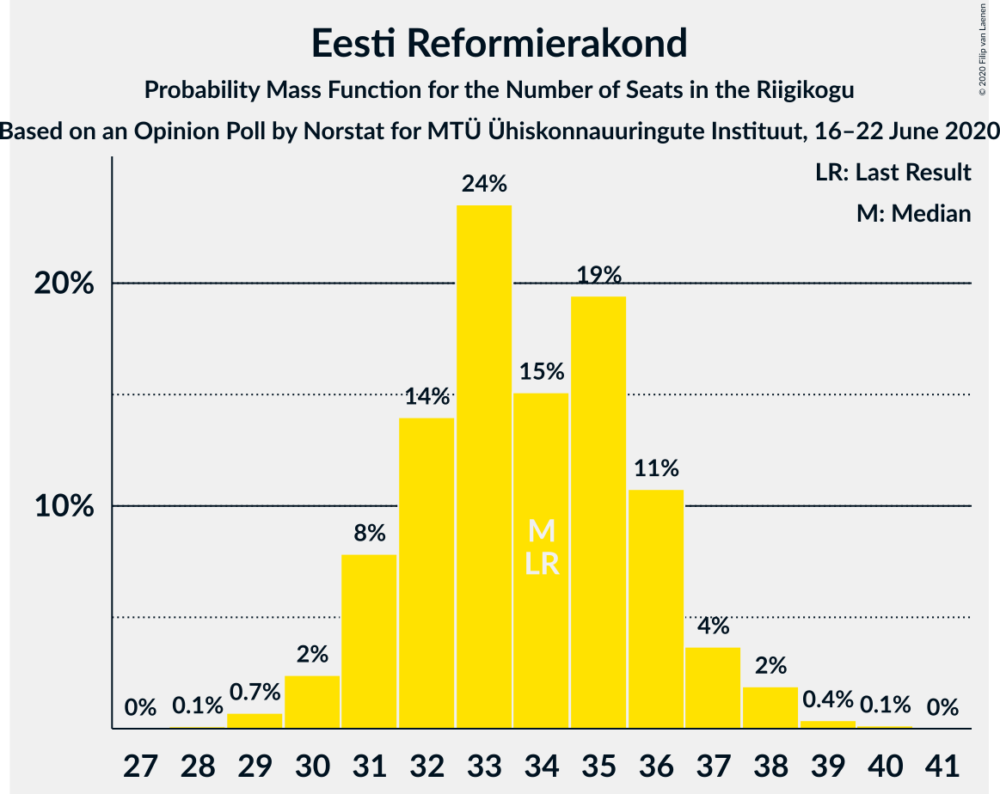

| Number of Seats | Probability | Accumulated | Special Marks |
|:---------------:|:-----------:|:-----------:|:-------------:|
| 28 | 0.1% | 100% |  |
| 29 | 0.5% | 99.9% |  |
| 30 | 2% | 99.4% |  |
| 31 | 10% | 98% |  |
| 32 | 11% | 87% |  |
| 33 | 17% | 76% |  |
| 34 | 17% | 59% | Last Result, Median |
| 35 | 16% | 42% |  |
| 36 | 16% | 26% |  |
| 37 | 8% | 10% |  |
| 38 | 1.3% | 2% |  |
| 39 | 0.7% | 0.8% |  |
| 40 | 0.1% | 0.1% |  |
| 41 | 0% | 0% |  |

### Eesti Keskerakond

*For a full overview of the results for this party, see the [Eesti Keskerakond](party-eestikeskerakond.html) page.*

| Number of Seats | Probability | Accumulated | Special Marks |
|:---------------:|:-----------:|:-----------:|:-------------:|
| 23 | 0.1% | 100% |  |
| 24 | 0.8% | 99.9% |  |
| 25 | 4% | 99.2% |  |
| 26 | 10% | 95% | Last Result |
| 27 | 11% | 85% |  |
| 28 | 21% | 75% |  |
| 29 | 24% | 54% | Median |
| 30 | 20% | 30% |  |
| 31 | 4% | 10% |  |
| 32 | 5% | 6% |  |
| 33 | 1.2% | 1.5% |  |
| 34 | 0.2% | 0.3% |  |
| 35 | 0% | 0% |  |

### Eesti Konservatiivne Rahvaerakond

*For a full overview of the results for this party, see the [Eesti Konservatiivne Rahvaerakond](party-eestikonservatiivnerahvaerakond.html) page.*

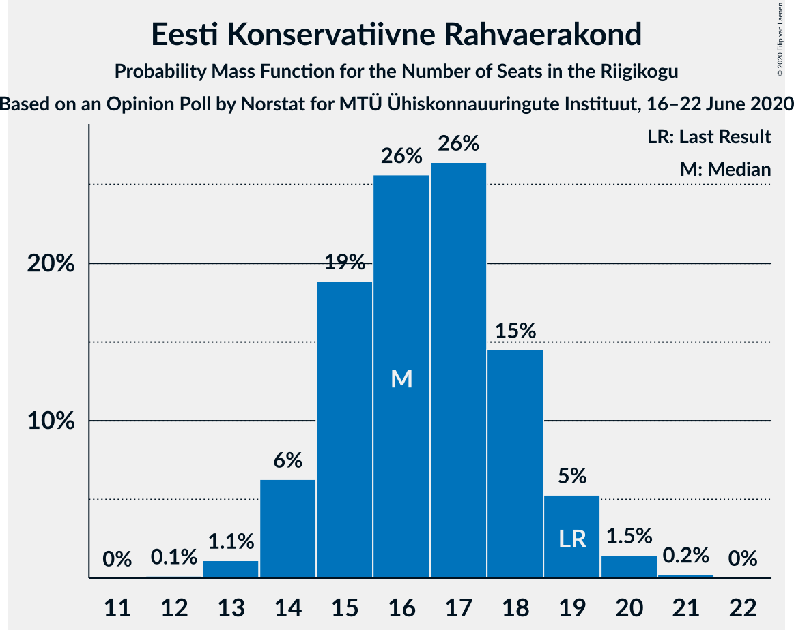

| Number of Seats | Probability | Accumulated | Special Marks |
|:---------------:|:-----------:|:-----------:|:-------------:|
| 12 | 0.1% | 100% |  |
| 13 | 1.2% | 99.9% |  |
| 14 | 4% | 98.8% |  |
| 15 | 23% | 95% |  |
| 16 | 17% | 72% |  |
| 17 | 25% | 55% | Median |
| 18 | 22% | 30% |  |
| 19 | 7% | 8% | Last Result |
| 20 | 1.5% | 2% |  |
| 21 | 0.1% | 0.2% |  |
| 22 | 0% | 0% |  |

### Sotsiaaldemokraatlik Erakond

*For a full overview of the results for this party, see the [Sotsiaaldemokraatlik Erakond](party-sotsiaaldemokraatlikerakond.html) page.*

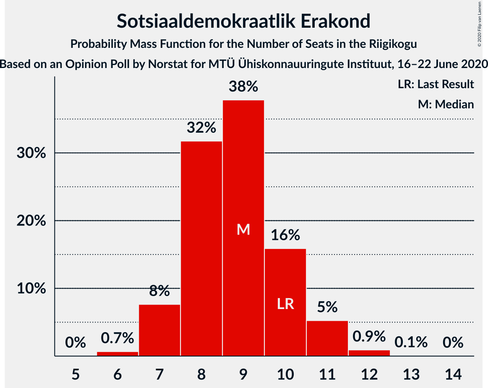

| Number of Seats | Probability | Accumulated | Special Marks |
|:---------------:|:-----------:|:-----------:|:-------------:|
| 6 | 0.4% | 100% |  |
| 7 | 8% | 99.6% |  |
| 8 | 28% | 92% |  |
| 9 | 43% | 64% | Median |
| 10 | 16% | 22% | Last Result |
| 11 | 5% | 5% |  |
| 12 | 0.6% | 0.7% |  |
| 13 | 0.1% | 0.1% |  |
| 14 | 0% | 0% |  |

### Eesti 200

*For a full overview of the results for this party, see the [Eesti 200](party-eesti200.html) page.*

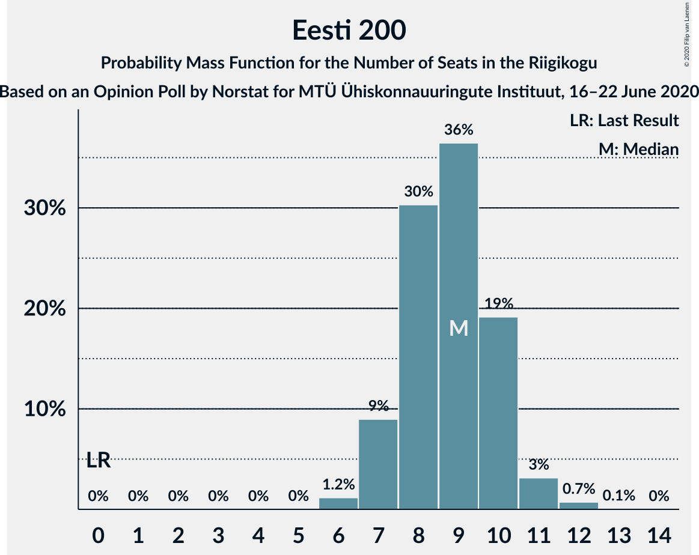

| Number of Seats | Probability | Accumulated | Special Marks |
|:---------------:|:-----------:|:-----------:|:-------------:|
| 0 | 0% | 100% | Last Result |
| 1 | 0% | 100% |  |
| 2 | 0% | 100% |  |
| 3 | 0% | 100% |  |
| 4 | 0% | 100% |  |
| 5 | 0% | 100% |  |
| 6 | 0.8% | 100% |  |
| 7 | 7% | 99.2% |  |
| 8 | 23% | 92% |  |
| 9 | 33% | 69% | Median |
| 10 | 32% | 36% |  |
| 11 | 3% | 4% |  |
| 12 | 1.0% | 1.0% |  |
| 13 | 0.1% | 0.1% |  |
| 14 | 0% | 0% |  |

### Erakond Isamaa

*For a full overview of the results for this party, see the [Erakond Isamaa](party-erakondisamaa.html) page.*

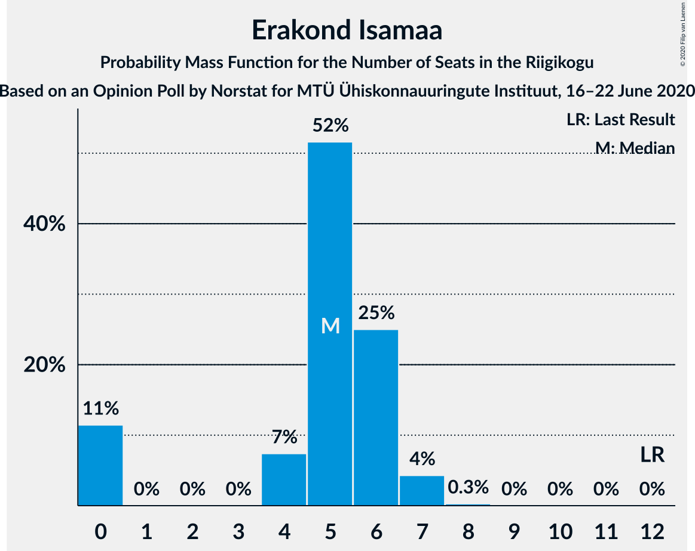

| Number of Seats | Probability | Accumulated | Special Marks |
|:---------------:|:-----------:|:-----------:|:-------------:|
| 0 | 26% | 100% |  |
| 1 | 0% | 74% |  |
| 2 | 0% | 74% |  |
| 3 | 0% | 74% |  |
| 4 | 5% | 74% |  |
| 5 | 41% | 69% | Median |
| 6 | 26% | 29% |  |
| 7 | 3% | 3% |  |
| 8 | 0.2% | 0.2% |  |
| 9 | 0% | 0% |  |
| 10 | 0% | 0% |  |
| 11 | 0% | 0% |  |
| 12 | 0% | 0% | Last Result |

### Erakond Eestimaa Rohelised

*For a full overview of the results for this party, see the [Erakond Eestimaa Rohelised](party-erakondeestimaarohelised.html) page.*

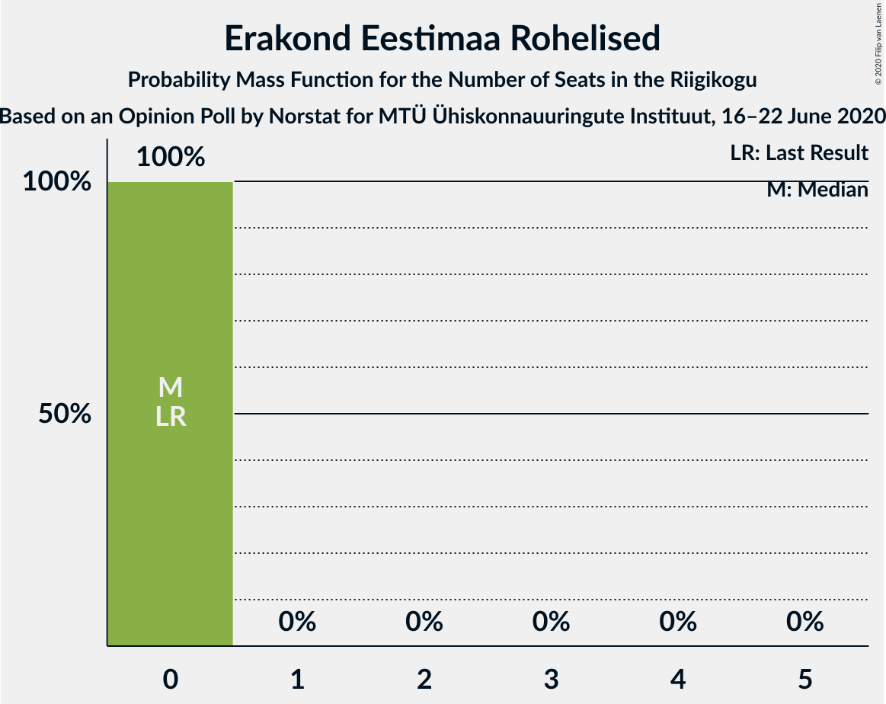

| Number of Seats | Probability | Accumulated | Special Marks |
|:---------------:|:-----------:|:-----------:|:-------------:|
| 0 | 100% | 100% | Last Result, Median |

### Eesti Vabaerakond

*For a full overview of the results for this party, see the [Eesti Vabaerakond](party-eestivabaerakond.html) page.*

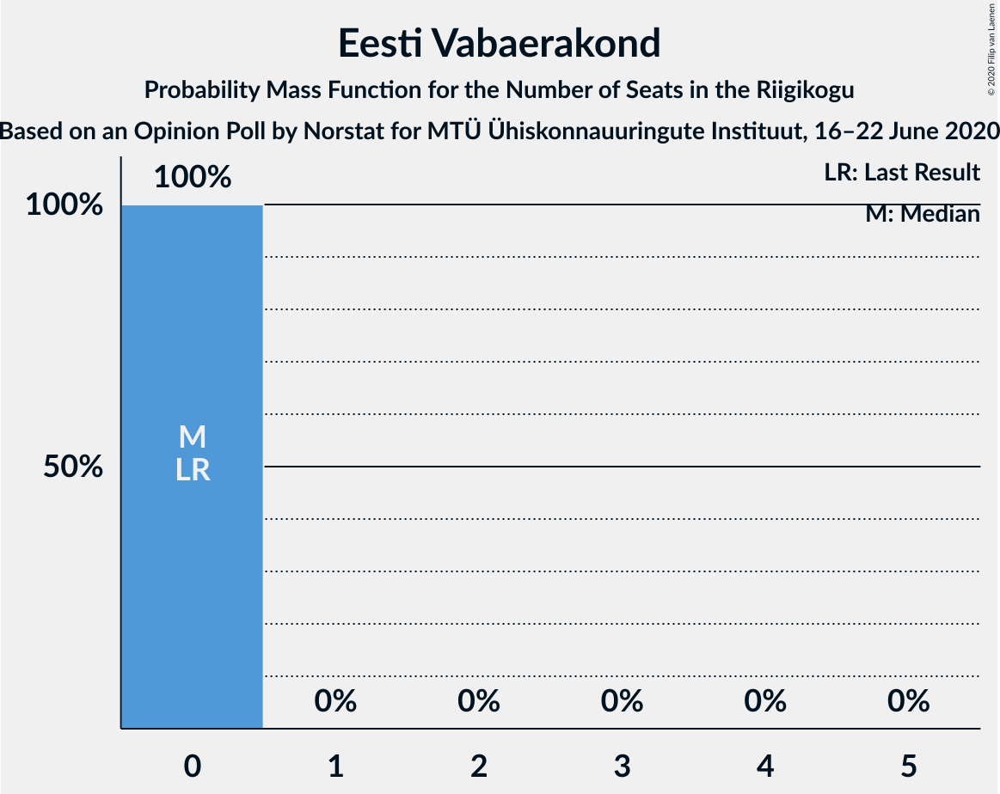

| Number of Seats | Probability | Accumulated | Special Marks |
|:---------------:|:-----------:|:-----------:|:-------------:|
| 0 | 100% | 100% | Last Result, Median |

## Coalitions

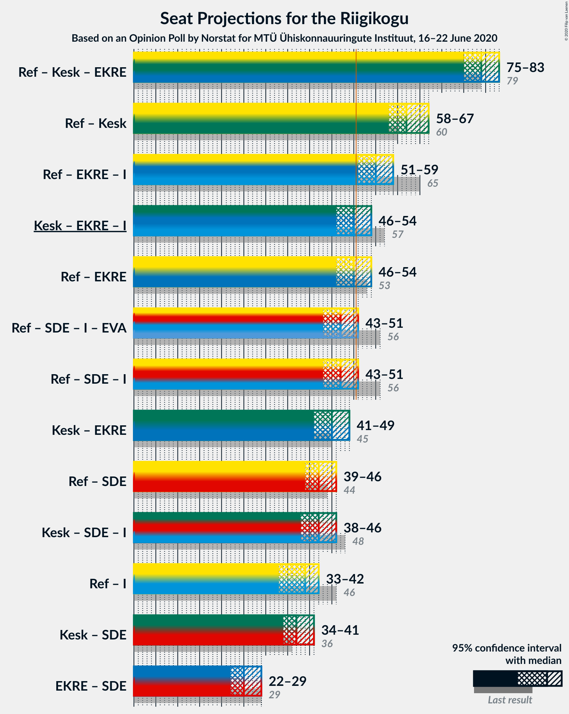

### Confidence Intervals

| Coalition | Last Result | Median | Majority? | 80% Confidence Interval | 90% Confidence Interval | 95% Confidence Interval | 99% Confidence Interval |
|:---------:|:-----------:|:------:|:---------:|:-----------------------:|:-----------------------:|:-----------------------:|:-----------------------:|
| Eesti Reformierakond – Eesti Keskerakond – Eesti Konservatiivne Rahvaerakond | 79 | 79 | 100% | 76–83 | 76–83 | 75–83 | 74–84 |
| Eesti Reformierakond – Eesti Keskerakond | 60 | 63 | 100% | 60–66 | 58–66 | 58–67 | 57–68 |
| Eesti Reformierakond – Eesti Konservatiivne Rahvaerakond – Erakond Isamaa | 65 | 54 | 99.3% | 52–57 | 51–58 | 51–58 | 50–60 |
| Eesti Reformierakond – Eesti Konservatiivne Rahvaerakond | 53 | 51 | 58% | 48–53 | 48–53 | 47–54 | 45–56 |
| Eesti Keskerakond – Eesti Konservatiivne Rahvaerakond – Erakond Isamaa | 57 | 49 | 28% | 47–52 | 46–53 | 46–53 | 44–55 |
| Eesti Reformierakond – Sotsiaaldemokraatlik Erakond – Erakond Isamaa – Eesti Vabaerakond | 56 | 47 | 6% | 44–50 | 43–51 | 43–51 | 41–53 |
| Eesti Reformierakond – Sotsiaaldemokraatlik Erakond – Erakond Isamaa | 56 | 47 | 6% | 44–50 | 43–51 | 43–51 | 41–53 |
| Eesti Keskerakond – Eesti Konservatiivne Rahvaerakond | 45 | 45 | 0.9% | 42–48 | 42–49 | 41–49 | 40–51 |
| Eesti Reformierakond – Sotsiaaldemokraatlik Erakond | 44 | 43 | 0% | 40–45 | 39–46 | 39–46 | 38–48 |
| Eesti Keskerakond – Sotsiaaldemokraatlik Erakond – Erakond Isamaa | 48 | 42 | 0% | 39–44 | 38–45 | 38–45 | 36–47 |
| Eesti Reformierakond – Erakond Isamaa | 46 | 38 | 0% | 35–41 | 34–42 | 33–42 | 32–44 |
| Eesti Keskerakond – Sotsiaaldemokraatlik Erakond | 36 | 37 | 0% | 35–40 | 34–41 | 34–41 | 32–42 |
| Eesti Konservatiivne Rahvaerakond – Sotsiaaldemokraatlik Erakond | 29 | 26 | 0% | 23–28 | 23–29 | 22–29 | 21–29 |

### Eesti Reformierakond – Eesti Keskerakond – Eesti Konservatiivne Rahvaerakond

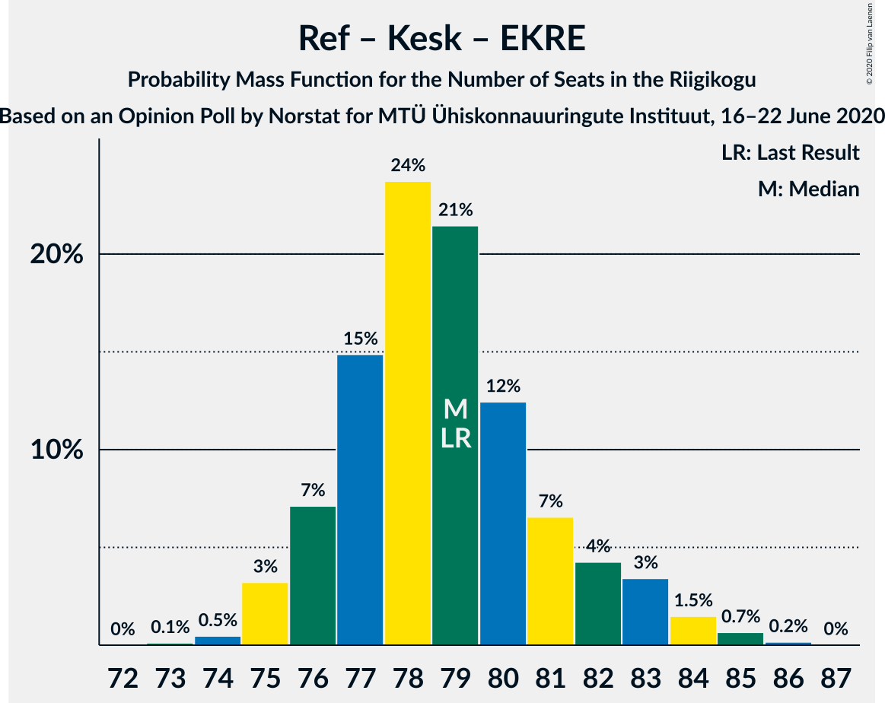

| Number of Seats | Probability | Accumulated | Special Marks |
|:---------------:|:-----------:|:-----------:|:-------------:|
| 73 | 0.2% | 100% |  |
| 74 | 0.4% | 99.8% |  |
| 75 | 2% | 99.4% |  |
| 76 | 10% | 97% |  |
| 77 | 14% | 87% |  |
| 78 | 22% | 73% |  |
| 79 | 11% | 51% | Last Result |
| 80 | 10% | 40% | Median |
| 81 | 7% | 30% |  |
| 82 | 7% | 22% |  |
| 83 | 14% | 15% |  |
| 84 | 0.9% | 1.3% |  |
| 85 | 0.3% | 0.4% |  |
| 86 | 0.1% | 0.1% |  |
| 87 | 0% | 0% |  |

### Eesti Reformierakond – Eesti Keskerakond

| Number of Seats | Probability | Accumulated | Special Marks |
|:---------------:|:-----------:|:-----------:|:-------------:|
| 56 | 0.1% | 100% |  |
| 57 | 0.8% | 99.8% |  |
| 58 | 5% | 99.1% |  |
| 59 | 3% | 94% |  |
| 60 | 18% | 92% | Last Result |
| 61 | 8% | 74% |  |
| 62 | 14% | 66% |  |
| 63 | 19% | 52% | Median |
| 64 | 6% | 32% |  |
| 65 | 11% | 27% |  |
| 66 | 11% | 16% |  |
| 67 | 4% | 4% |  |
| 68 | 0.4% | 0.8% |  |
| 69 | 0.2% | 0.4% |  |
| 70 | 0.1% | 0.2% |  |
| 71 | 0% | 0% |  |

### Eesti Reformierakond – Eesti Konservatiivne Rahvaerakond – Erakond Isamaa

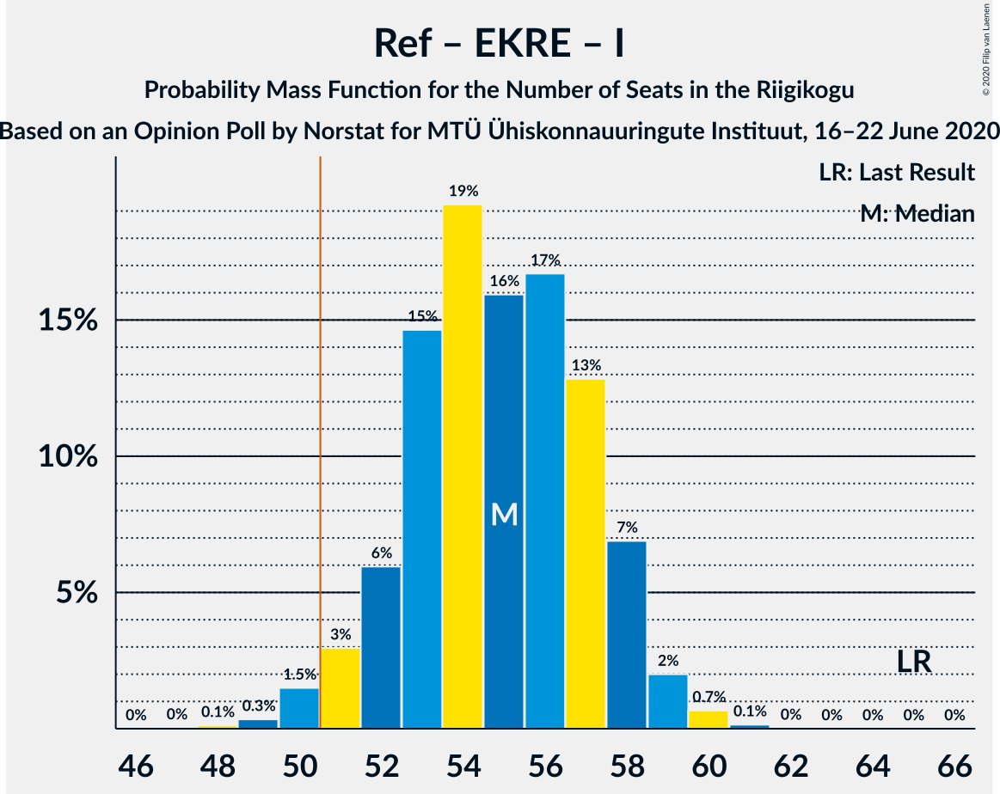

| Number of Seats | Probability | Accumulated | Special Marks |
|:---------------:|:-----------:|:-----------:|:-------------:|
| 47 | 0.1% | 100% |  |
| 48 | 0% | 99.9% |  |
| 49 | 0.2% | 99.9% |  |
| 50 | 0.4% | 99.7% |  |
| 51 | 5% | 99.3% | Majority |
| 52 | 7% | 94% |  |
| 53 | 23% | 87% |  |
| 54 | 20% | 64% |  |
| 55 | 5% | 44% |  |
| 56 | 13% | 39% | Median |
| 57 | 20% | 26% |  |
| 58 | 4% | 5% |  |
| 59 | 0.7% | 2% |  |
| 60 | 0.6% | 0.9% |  |
| 61 | 0.3% | 0.3% |  |
| 62 | 0% | 0% |  |
| 63 | 0% | 0% |  |
| 64 | 0% | 0% |  |
| 65 | 0% | 0% | Last Result |

### Eesti Reformierakond – Eesti Konservatiivne Rahvaerakond

| Number of Seats | Probability | Accumulated | Special Marks |
|:---------------:|:-----------:|:-----------:|:-------------:|
| 44 | 0.1% | 100% |  |
| 45 | 0.4% | 99.9% |  |
| 46 | 1.5% | 99.5% |  |
| 47 | 3% | 98% |  |
| 48 | 14% | 95% |  |
| 49 | 14% | 81% |  |
| 50 | 10% | 67% |  |
| 51 | 22% | 58% | Median, Majority |
| 52 | 15% | 36% |  |
| 53 | 16% | 20% | Last Result |
| 54 | 3% | 4% |  |
| 55 | 0.7% | 1.4% |  |
| 56 | 0.2% | 0.7% |  |
| 57 | 0.5% | 0.5% |  |
| 58 | 0% | 0% |  |

### Eesti Keskerakond – Eesti Konservatiivne Rahvaerakond – Erakond Isamaa

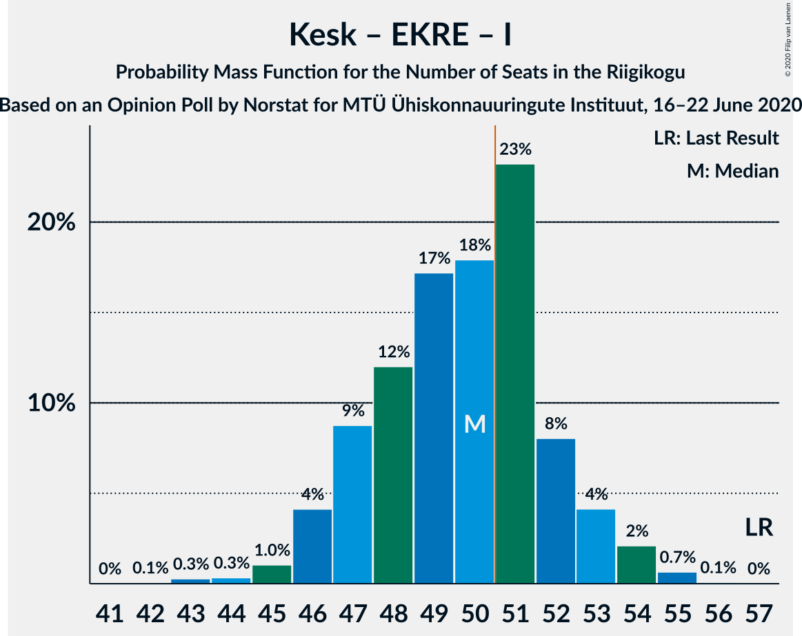

| Number of Seats | Probability | Accumulated | Special Marks |
|:---------------:|:-----------:|:-----------:|:-------------:|
| 43 | 0.4% | 100% |  |
| 44 | 0.3% | 99.5% |  |
| 45 | 1.5% | 99.2% |  |
| 46 | 8% | 98% |  |
| 47 | 15% | 90% |  |
| 48 | 15% | 76% |  |
| 49 | 21% | 61% |  |
| 50 | 12% | 39% |  |
| 51 | 13% | 28% | Median, Majority |
| 52 | 10% | 15% |  |
| 53 | 3% | 5% |  |
| 54 | 2% | 2% |  |
| 55 | 0.9% | 0.9% |  |
| 56 | 0% | 0.1% |  |
| 57 | 0% | 0% | Last Result |

### Eesti Reformierakond – Sotsiaaldemokraatlik Erakond – Erakond Isamaa – Eesti Vabaerakond

| Number of Seats | Probability | Accumulated | Special Marks |
|:---------------:|:-----------:|:-----------:|:-------------:|
| 41 | 2% | 100% |  |
| 42 | 0.6% | 98% |  |
| 43 | 4% | 98% |  |
| 44 | 6% | 94% |  |
| 45 | 19% | 88% |  |
| 46 | 13% | 69% |  |
| 47 | 23% | 56% |  |
| 48 | 10% | 34% | Median |
| 49 | 9% | 24% |  |
| 50 | 10% | 15% |  |
| 51 | 4% | 6% | Majority |
| 52 | 0.7% | 2% |  |
| 53 | 0.9% | 0.9% |  |
| 54 | 0.1% | 0.1% |  |
| 55 | 0% | 0% |  |
| 56 | 0% | 0% | Last Result |

### Eesti Reformierakond – Sotsiaaldemokraatlik Erakond – Erakond Isamaa

| Number of Seats | Probability | Accumulated | Special Marks |
|:---------------:|:-----------:|:-----------:|:-------------:|
| 41 | 2% | 100% |  |
| 42 | 0.6% | 98% |  |
| 43 | 4% | 98% |  |
| 44 | 6% | 94% |  |
| 45 | 19% | 88% |  |
| 46 | 13% | 69% |  |
| 47 | 23% | 56% |  |
| 48 | 10% | 34% | Median |
| 49 | 9% | 24% |  |
| 50 | 10% | 15% |  |
| 51 | 4% | 6% | Majority |
| 52 | 0.7% | 2% |  |
| 53 | 0.9% | 0.9% |  |
| 54 | 0.1% | 0.1% |  |
| 55 | 0% | 0% |  |
| 56 | 0% | 0% | Last Result |

### Eesti Keskerakond – Eesti Konservatiivne Rahvaerakond

| Number of Seats | Probability | Accumulated | Special Marks |
|:---------------:|:-----------:|:-----------:|:-------------:|
| 39 | 0.1% | 100% |  |
| 40 | 1.2% | 99.8% |  |
| 41 | 2% | 98.6% |  |
| 42 | 8% | 96% |  |
| 43 | 11% | 89% |  |
| 44 | 21% | 78% |  |
| 45 | 12% | 57% | Last Result |
| 46 | 17% | 45% | Median |
| 47 | 16% | 28% |  |
| 48 | 6% | 13% |  |
| 49 | 5% | 7% |  |
| 50 | 1.2% | 2% |  |
| 51 | 0.8% | 0.9% | Majority |
| 52 | 0.1% | 0.1% |  |
| 53 | 0% | 0% |  |

### Eesti Reformierakond – Sotsiaaldemokraatlik Erakond

| Number of Seats | Probability | Accumulated | Special Marks |
|:---------------:|:-----------:|:-----------:|:-------------:|
| 37 | 0.2% | 100% |  |
| 38 | 1.2% | 99.8% |  |
| 39 | 4% | 98.6% |  |
| 40 | 7% | 94% |  |
| 41 | 14% | 87% |  |
| 42 | 23% | 74% |  |
| 43 | 11% | 50% | Median |
| 44 | 8% | 39% | Last Result |
| 45 | 23% | 31% |  |
| 46 | 6% | 8% |  |
| 47 | 1.1% | 2% |  |
| 48 | 0.8% | 1.0% |  |
| 49 | 0.1% | 0.1% |  |
| 50 | 0% | 0% |  |

### Eesti Keskerakond – Sotsiaaldemokraatlik Erakond – Erakond Isamaa

| Number of Seats | Probability | Accumulated | Special Marks |
|:---------------:|:-----------:|:-----------:|:-------------:|
| 35 | 0% | 100% |  |
| 36 | 0.5% | 99.9% |  |
| 37 | 0.9% | 99.4% |  |
| 38 | 7% | 98% |  |
| 39 | 13% | 92% |  |
| 40 | 11% | 79% |  |
| 41 | 17% | 68% |  |
| 42 | 27% | 51% |  |
| 43 | 10% | 25% | Median |
| 44 | 8% | 15% |  |
| 45 | 5% | 7% |  |
| 46 | 1.5% | 2% |  |
| 47 | 0.6% | 0.8% |  |
| 48 | 0.2% | 0.2% | Last Result |
| 49 | 0% | 0% |  |

### Eesti Reformierakond – Erakond Isamaa

| Number of Seats | Probability | Accumulated | Special Marks |
|:---------------:|:-----------:|:-----------:|:-------------:|
| 30 | 0.1% | 100% |  |
| 31 | 0% | 99.9% |  |
| 32 | 2% | 99.8% |  |
| 33 | 3% | 98% |  |
| 34 | 0.7% | 95% |  |
| 35 | 8% | 95% |  |
| 36 | 19% | 86% |  |
| 37 | 9% | 67% |  |
| 38 | 13% | 58% |  |
| 39 | 21% | 46% | Median |
| 40 | 8% | 25% |  |
| 41 | 7% | 17% |  |
| 42 | 8% | 10% |  |
| 43 | 1.4% | 2% |  |
| 44 | 0.5% | 0.7% |  |
| 45 | 0.2% | 0.2% |  |
| 46 | 0% | 0% | Last Result |

### Eesti Keskerakond – Sotsiaaldemokraatlik Erakond

| Number of Seats | Probability | Accumulated | Special Marks |
|:---------------:|:-----------:|:-----------:|:-------------:|
| 32 | 0.6% | 100% |  |
| 33 | 0.7% | 99.4% |  |
| 34 | 7% | 98.7% |  |
| 35 | 8% | 92% |  |
| 36 | 16% | 84% | Last Result |
| 37 | 21% | 68% |  |
| 38 | 18% | 47% | Median |
| 39 | 16% | 29% |  |
| 40 | 7% | 13% |  |
| 41 | 5% | 6% |  |
| 42 | 0.6% | 1.0% |  |
| 43 | 0.3% | 0.4% |  |
| 44 | 0.1% | 0.2% |  |
| 45 | 0% | 0% |  |

### Eesti Konservatiivne Rahvaerakond – Sotsiaaldemokraatlik Erakond

| Number of Seats | Probability | Accumulated | Special Marks |
|:---------------:|:-----------:|:-----------:|:-------------:|
| 20 | 0.1% | 100% |  |
| 21 | 0.8% | 99.9% |  |
| 22 | 3% | 99.2% |  |
| 23 | 18% | 97% |  |
| 24 | 12% | 78% |  |
| 25 | 12% | 66% |  |
| 26 | 25% | 54% | Median |
| 27 | 14% | 29% |  |
| 28 | 9% | 15% |  |
| 29 | 5% | 6% | Last Result |
| 30 | 0.3% | 0.4% |  |
| 31 | 0.1% | 0.1% |  |
| 32 | 0% | 0% |  |

## Technical Information

### Opinion Poll

+ **Polling firm:** Norstat
+ **Commissioner(s):** MTÜ Ühiskonnauuringute Instituut
+ **Fieldwork period:** 16–22 June 2020

### Calculations

+ **Sample size:** 1000
+ **Simulations done:** 131,072
+ **Error estimate:** 1.31%

