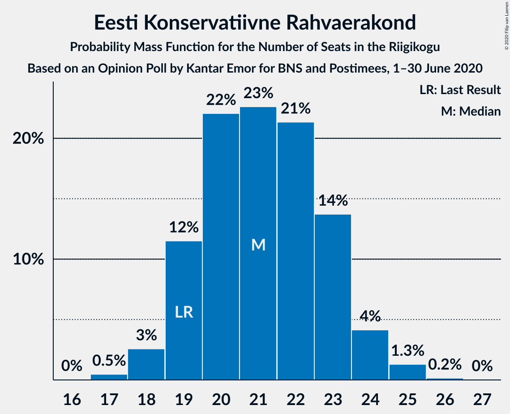
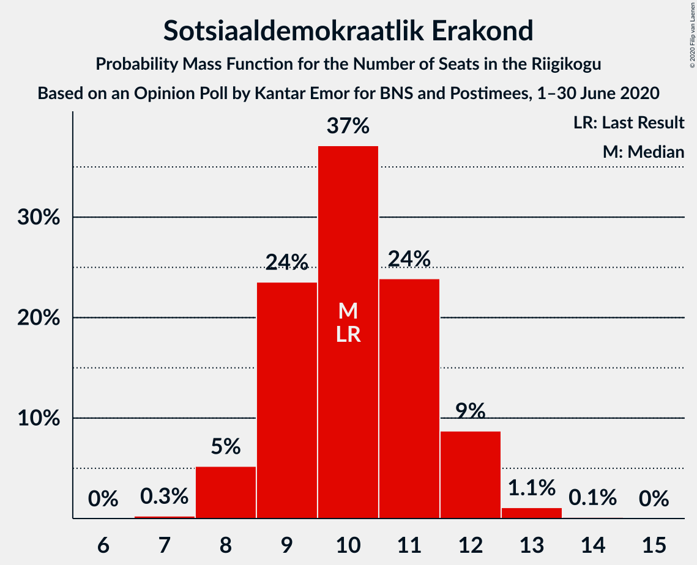
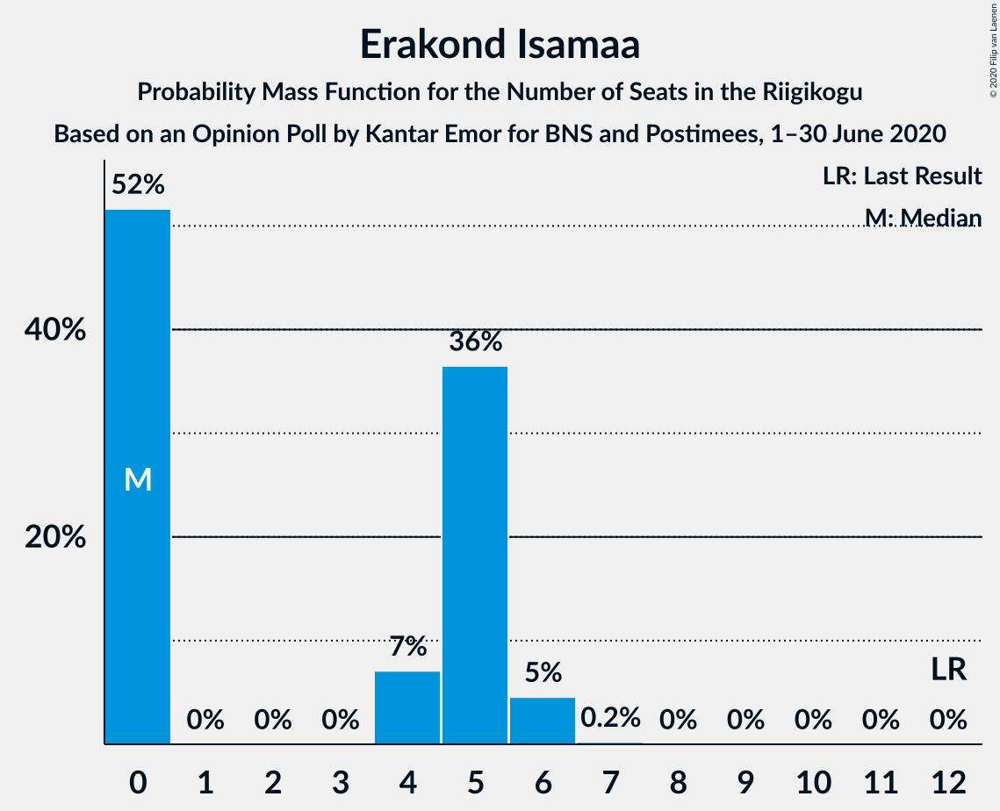
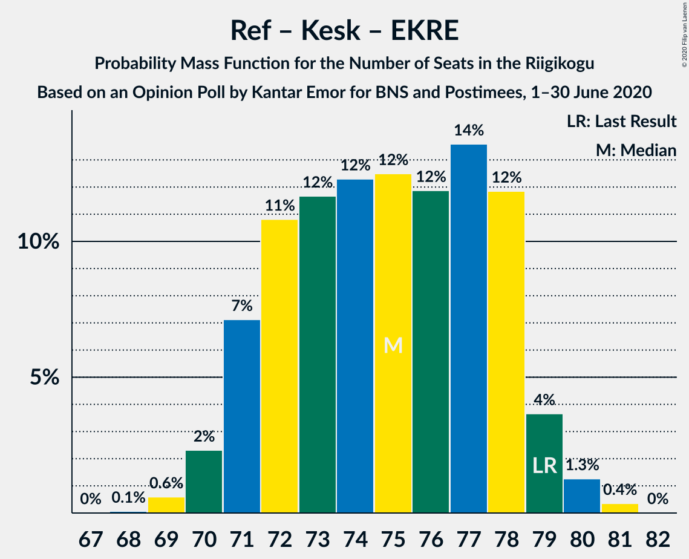

# Opinion Poll by Kantar Emor for BNS and Postimees, 1–30 June 2020

<a href="#voting-intentions">Voting Intentions</a> | <a href="#seats">Seats</a> | <a href="#coalitions">Coalitions</a> | <a href="#technical-information">Technical Information</a>

## Voting Intentions

### Confidence Intervals

| Party | Last Result | Poll Result | 80% Confidence Interval | 90% Confidence Interval | 95% Confidence Interval | 99% Confidence Interval |
|:-----:|:-----------:|:-----------:|:-----------------------:|:-----------------------:|:-----------------------:|:-----------------------:|
| Eesti Reformierakond | 28.9% | 27.9% | 26.3–29.6% |25.9–30.0% |25.5–30.5% |24.8–31.3% |
| Eesti Keskerakond | 23.1% | 18.9% | 17.6–20.4% |17.2–20.8% |16.9–21.2% |16.2–21.9% |
| Eesti Konservatiivne Rahvaerakond | 17.8% | 18.9% | 17.6–20.4% |17.2–20.8% |16.9–21.2% |16.2–21.9% |
| Eesti 200 | 4.4% | 12.9% | 11.8–14.2% |11.5–14.6% |11.2–14.9% |10.7–15.5% |
| Sotsiaaldemokraatlik Erakond | 9.8% | 9.9% | 8.9–11.1% |8.6–11.4% |8.4–11.7% |7.9–12.3% |
| Erakond Isamaa | 11.4% | 5.0% | 4.3–5.9% |4.1–6.1% |3.9–6.3% |3.6–6.8% |
| Erakond Eestimaa Rohelised | 1.8% | 3.0% | 2.5–3.7% |2.3–3.9% |2.2–4.1% |2.0–4.5% |
| Eesti Vabaerakond | 1.2% | 0.2% | 0.1–0.5% |0.1–0.6% |0.1–0.7% |0.0–0.9% |

*Note:* The poll result column reflects the actual value used in the calculations. Published results may vary slightly, and in addition be rounded to fewer digits.

## Seats

### Confidence Intervals

| Party | Last Result | Median | 80% Confidence Interval | 90% Confidence Interval | 95% Confidence Interval | 99% Confidence Interval |
|:-----:|:-----------:|:------:|:-----------------------:|:-----------------------:|:-----------------------:|:-----------------------:|
| <a href="#eesti-reformierakond">Eesti Reformierakond</a> | 34 | 33 | 30–35 |30–36 |29–36 |28–37 |
| <a href="#eesti-keskerakond">Eesti Keskerakond</a> | 26 | 21 | 19–23 |19–24 |18–24 |17–25 |
| <a href="#eesti-konservatiivne-rahvaerakond">Eesti Konservatiivne Rahvaerakond</a> | 19 | 21 | 19–23 |19–24 |18–24 |17–25 |
| <a href="#eesti-200">Eesti 200</a> | 0 | 14 | 12–15 |12–16 |11–16 |11–17 |
| <a href="#sotsiaaldemokraatlik-erakond">Sotsiaaldemokraatlik Erakond</a> | 10 | 10 | 9–11 |8–12 |8–12 |8–13 |
| <a href="#erakond-isamaa">Erakond Isamaa</a> | 12 | 0 | 0–5 |0–5 |0–6 |0–6 |
| <a href="#erakond-eestimaa-rohelised">Erakond Eestimaa Rohelised</a> | 0 | 0 | 0 |0 |0 |0 |
| <a href="#eesti-vabaerakond">Eesti Vabaerakond</a> | 0 | 0 | 0 |0 |0 |0 |

### Eesti Reformierakond

*For a full overview of the results for this party, see the [Eesti Reformierakond](party-eestireformierakond.html) page.*

| Number of Seats | Probability | Accumulated | Special Marks |
|:---------------:|:-----------:|:-----------:|:-------------:|
| 27 | 0.1% | 100% |  |
| 28 | 0.6% | 99.8% |  |
| 29 | 3% | 99.3% |  |
| 30 | 7% | 96% |  |
| 31 | 20% | 89% |  |
| 32 | 13% | 69% |  |
| 33 | 24% | 56% | Median |
| 34 | 15% | 32% | Last Result |
| 35 | 11% | 17% |  |
| 36 | 4% | 7% |  |
| 37 | 2% | 2% |  |
| 38 | 0.3% | 0.4% |  |
| 39 | 0.1% | 0.1% |  |
| 40 | 0% | 0% |  |

### Eesti Keskerakond

*For a full overview of the results for this party, see the [Eesti Keskerakond](party-eestikeskerakond.html) page.*

| Number of Seats | Probability | Accumulated | Special Marks |
|:---------------:|:-----------:|:-----------:|:-------------:|
| 17 | 0.5% | 100% |  |
| 18 | 3% | 99.5% |  |
| 19 | 10% | 96% |  |
| 20 | 20% | 86% |  |
| 21 | 33% | 66% | Median |
| 22 | 15% | 32% |  |
| 23 | 12% | 17% |  |
| 24 | 4% | 6% |  |
| 25 | 1.2% | 1.5% |  |
| 26 | 0.3% | 0.3% | Last Result |
| 27 | 0% | 0% |  |

### Eesti Konservatiivne Rahvaerakond

*For a full overview of the results for this party, see the [Eesti Konservatiivne Rahvaerakond](party-eestikonservatiivnerahvaerakond.html) page.*

| Number of Seats | Probability | Accumulated | Special Marks |
|:---------------:|:-----------:|:-----------:|:-------------:|
| 17 | 0.5% | 100% |  |
| 18 | 3% | 99.5% |  |
| 19 | 12% | 97% | Last Result |
| 20 | 22% | 85% |  |
| 21 | 23% | 63% | Median |
| 22 | 21% | 41% |  |
| 23 | 14% | 19% |  |
| 24 | 4% | 6% |  |
| 25 | 1.3% | 1.5% |  |
| 26 | 0.2% | 0.2% |  |
| 27 | 0% | 0% |  |

### Eesti 200

*For a full overview of the results for this party, see the [Eesti 200](party-eesti200.html) page.*

| Number of Seats | Probability | Accumulated | Special Marks |
|:---------------:|:-----------:|:-----------:|:-------------:|
| 0 | 0% | 100% | Last Result |
| 1 | 0% | 100% |  |
| 2 | 0% | 100% |  |
| 3 | 0% | 100% |  |
| 4 | 0% | 100% |  |
| 5 | 0% | 100% |  |
| 6 | 0% | 100% |  |
| 7 | 0% | 100% |  |
| 8 | 0% | 100% |  |
| 9 | 0% | 100% |  |
| 10 | 0.3% | 100% |  |
| 11 | 3% | 99.7% |  |
| 12 | 15% | 97% |  |
| 13 | 29% | 82% |  |
| 14 | 28% | 52% | Median |
| 15 | 17% | 24% |  |
| 16 | 6% | 8% |  |
| 17 | 1.1% | 1.2% |  |
| 18 | 0.1% | 0.1% |  |
| 19 | 0% | 0% |  |

### Sotsiaaldemokraatlik Erakond

*For a full overview of the results for this party, see the [Sotsiaaldemokraatlik Erakond](party-sotsiaaldemokraatlikerakond.html) page.*

| Number of Seats | Probability | Accumulated | Special Marks |
|:---------------:|:-----------:|:-----------:|:-------------:|
| 7 | 0.3% | 100% |  |
| 8 | 5% | 99.7% |  |
| 9 | 24% | 95% |  |
| 10 | 37% | 71% | Last Result, Median |
| 11 | 24% | 34% |  |
| 12 | 9% | 10% |  |
| 13 | 1.1% | 1.2% |  |
| 14 | 0.1% | 0.1% |  |
| 15 | 0% | 0% |  |

### Erakond Isamaa

*For a full overview of the results for this party, see the [Erakond Isamaa](party-erakondisamaa.html) page.*

| Number of Seats | Probability | Accumulated | Special Marks |
|:---------------:|:-----------:|:-----------:|:-------------:|
| 0 | 52% | 100% | Median |
| 1 | 0% | 48% |  |
| 2 | 0% | 48% |  |
| 3 | 0% | 48% |  |
| 4 | 7% | 48% |  |
| 5 | 36% | 41% |  |
| 6 | 5% | 5% |  |
| 7 | 0.2% | 0.2% |  |
| 8 | 0% | 0% |  |
| 9 | 0% | 0% |  |
| 10 | 0% | 0% |  |
| 11 | 0% | 0% |  |
| 12 | 0% | 0% | Last Result |

### Erakond Eestimaa Rohelised

*For a full overview of the results for this party, see the [Erakond Eestimaa Rohelised](party-erakondeestimaarohelised.html) page.*

| Number of Seats | Probability | Accumulated | Special Marks |
|:---------------:|:-----------:|:-----------:|:-------------:|
| 0 | 100% | 100% | Last Result, Median |

### Eesti Vabaerakond

*For a full overview of the results for this party, see the [Eesti Vabaerakond](party-eestivabaerakond.html) page.*

| Number of Seats | Probability | Accumulated | Special Marks |
|:---------------:|:-----------:|:-----------:|:-------------:|
| 0 | 100% | 100% | Last Result, Median |

## Coalitions

### Confidence Intervals

| Coalition | Last Result | Median | Majority? | 80% Confidence Interval | 90% Confidence Interval | 95% Confidence Interval | 99% Confidence Interval |
|:---------:|:-----------:|:------:|:---------:|:-----------------------:|:-----------------------:|:-----------------------:|:-----------------------:|
| Eesti Reformierakond – Eesti Keskerakond – Eesti Konservatiivne Rahvaerakond | 79 | 75 | 100% | 71–78 | 71–79 | 70–79 | 69–80 |
| Eesti Reformierakond – Eesti Konservatiivne Rahvaerakond – Erakond Isamaa | 65 | 56 | 99.8% | 53–59 | 53–59 | 52–60 | 51–61 |
| Eesti Reformierakond – Eesti Konservatiivne Rahvaerakond | 53 | 54 | 94% | 51–57 | 50–58 | 50–58 | 49–59 |
| Eesti Reformierakond – Eesti Keskerakond | 60 | 54 | 91% | 51–57 | 50–57 | 49–58 | 48–59 |
| Eesti Reformierakond – Sotsiaaldemokraatlik Erakond – Erakond Isamaa – Eesti Vabaerakond | 56 | 45 | 0.4% | 42–48 | 41–49 | 41–49 | 40–50 |
| Eesti Reformierakond – Sotsiaaldemokraatlik Erakond – Erakond Isamaa | 56 | 45 | 0.4% | 42–48 | 41–49 | 41–49 | 40–50 |
| Eesti Keskerakond – Eesti Konservatiivne Rahvaerakond – Erakond Isamaa | 57 | 45 | 0.2% | 42–47 | 41–48 | 40–49 | 39–50 |
| Eesti Reformierakond – Sotsiaaldemokraatlik Erakond | 44 | 43 | 0% | 40–45 | 40–46 | 39–47 | 38–48 |
| Eesti Keskerakond – Eesti Konservatiivne Rahvaerakond | 45 | 42 | 0% | 40–45 | 39–45 | 38–46 | 37–47 |
| Eesti Reformierakond – Erakond Isamaa | 46 | 35 | 0% | 32–38 | 31–38 | 31–39 | 29–41 |
| Eesti Keskerakond – Sotsiaaldemokraatlik Erakond – Erakond Isamaa | 48 | 34 | 0% | 30–37 | 30–37 | 29–38 | 28–39 |
| Eesti Keskerakond – Sotsiaaldemokraatlik Erakond | 36 | 31 | 0% | 29–34 | 28–34 | 28–35 | 27–36 |
| Eesti Konservatiivne Rahvaerakond – Sotsiaaldemokraatlik Erakond | 29 | 31 | 0% | 29–34 | 28–34 | 28–35 | 27–36 |

### Eesti Reformierakond – Eesti Keskerakond – Eesti Konservatiivne Rahvaerakond

| Number of Seats | Probability | Accumulated | Special Marks |
|:---------------:|:-----------:|:-----------:|:-------------:|
| 68 | 0.1% | 100% |  |
| 69 | 0.6% | 99.9% |  |
| 70 | 2% | 99.3% |  |
| 71 | 7% | 97% |  |
| 72 | 11% | 90% |  |
| 73 | 12% | 79% |  |
| 74 | 12% | 67% |  |
| 75 | 12% | 55% | Median |
| 76 | 12% | 43% |  |
| 77 | 14% | 31% |  |
| 78 | 12% | 17% |  |
| 79 | 4% | 5% | Last Result |
| 80 | 1.3% | 2% |  |
| 81 | 0.4% | 0.4% |  |
| 82 | 0% | 0% |  |

### Eesti Reformierakond – Eesti Konservatiivne Rahvaerakond – Erakond Isamaa

| Number of Seats | Probability | Accumulated | Special Marks |
|:---------------:|:-----------:|:-----------:|:-------------:|
| 50 | 0.1% | 100% |  |
| 51 | 0.9% | 99.8% | Majority |
| 52 | 3% | 98.9% |  |
| 53 | 6% | 96% |  |
| 54 | 10% | 90% | Median |
| 55 | 13% | 79% |  |
| 56 | 21% | 67% |  |
| 57 | 19% | 45% |  |
| 58 | 14% | 26% |  |
| 59 | 8% | 12% |  |
| 60 | 4% | 5% |  |
| 61 | 0.7% | 0.9% |  |
| 62 | 0.2% | 0.3% |  |
| 63 | 0% | 0% |  |
| 64 | 0% | 0% |  |
| 65 | 0% | 0% | Last Result |

### Eesti Reformierakond – Eesti Konservatiivne Rahvaerakond

| Number of Seats | Probability | Accumulated | Special Marks |
|:---------------:|:-----------:|:-----------:|:-------------:|
| 47 | 0.1% | 100% |  |
| 48 | 0.3% | 99.9% |  |
| 49 | 1.3% | 99.6% |  |
| 50 | 4% | 98% |  |
| 51 | 11% | 94% | Majority |
| 52 | 12% | 83% |  |
| 53 | 18% | 71% | Last Result |
| 54 | 16% | 53% | Median |
| 55 | 12% | 37% |  |
| 56 | 12% | 25% |  |
| 57 | 7% | 13% |  |
| 58 | 4% | 5% |  |
| 59 | 2% | 2% |  |
| 60 | 0.2% | 0.2% |  |
| 61 | 0% | 0% |  |

### Eesti Reformierakond – Eesti Keskerakond

| Number of Seats | Probability | Accumulated | Special Marks |
|:---------------:|:-----------:|:-----------:|:-------------:|
| 47 | 0.1% | 100% |  |
| 48 | 0.4% | 99.9% |  |
| 49 | 2% | 99.5% |  |
| 50 | 7% | 97% |  |
| 51 | 9% | 91% | Majority |
| 52 | 13% | 82% |  |
| 53 | 10% | 69% |  |
| 54 | 21% | 58% | Median |
| 55 | 14% | 37% |  |
| 56 | 11% | 23% |  |
| 57 | 7% | 12% |  |
| 58 | 3% | 4% |  |
| 59 | 1.0% | 1.2% |  |
| 60 | 0.1% | 0.2% | Last Result |
| 61 | 0% | 0% |  |

### Eesti Reformierakond – Sotsiaaldemokraatlik Erakond – Erakond Isamaa – Eesti Vabaerakond

| Number of Seats | Probability | Accumulated | Special Marks |
|:---------------:|:-----------:|:-----------:|:-------------:|
| 38 | 0.1% | 100% |  |
| 39 | 0.2% | 99.9% |  |
| 40 | 1.0% | 99.7% |  |
| 41 | 4% | 98.7% |  |
| 42 | 6% | 95% |  |
| 43 | 12% | 89% | Median |
| 44 | 15% | 77% |  |
| 45 | 17% | 62% |  |
| 46 | 14% | 45% |  |
| 47 | 18% | 31% |  |
| 48 | 7% | 13% |  |
| 49 | 5% | 7% |  |
| 50 | 1.3% | 2% |  |
| 51 | 0.4% | 0.4% | Majority |
| 52 | 0.1% | 0.1% |  |
| 53 | 0% | 0% |  |
| 54 | 0% | 0% |  |
| 55 | 0% | 0% |  |
| 56 | 0% | 0% | Last Result |

### Eesti Reformierakond – Sotsiaaldemokraatlik Erakond – Erakond Isamaa

| Number of Seats | Probability | Accumulated | Special Marks |
|:---------------:|:-----------:|:-----------:|:-------------:|
| 38 | 0.1% | 100% |  |
| 39 | 0.2% | 99.9% |  |
| 40 | 1.0% | 99.7% |  |
| 41 | 4% | 98.7% |  |
| 42 | 6% | 95% |  |
| 43 | 12% | 89% | Median |
| 44 | 15% | 77% |  |
| 45 | 17% | 62% |  |
| 46 | 14% | 45% |  |
| 47 | 18% | 31% |  |
| 48 | 7% | 13% |  |
| 49 | 5% | 7% |  |
| 50 | 1.3% | 2% |  |
| 51 | 0.4% | 0.4% | Majority |
| 52 | 0.1% | 0.1% |  |
| 53 | 0% | 0% |  |
| 54 | 0% | 0% |  |
| 55 | 0% | 0% |  |
| 56 | 0% | 0% | Last Result |

### Eesti Keskerakond – Eesti Konservatiivne Rahvaerakond – Erakond Isamaa

| Number of Seats | Probability | Accumulated | Special Marks |
|:---------------:|:-----------:|:-----------:|:-------------:|
| 38 | 0.2% | 100% |  |
| 39 | 0.7% | 99.8% |  |
| 40 | 2% | 99.1% |  |
| 41 | 6% | 97% |  |
| 42 | 9% | 91% | Median |
| 43 | 12% | 82% |  |
| 44 | 19% | 70% |  |
| 45 | 20% | 52% |  |
| 46 | 10% | 32% |  |
| 47 | 13% | 22% |  |
| 48 | 5% | 8% |  |
| 49 | 3% | 3% |  |
| 50 | 0.8% | 0.9% |  |
| 51 | 0.1% | 0.2% | Majority |
| 52 | 0% | 0% |  |
| 53 | 0% | 0% |  |
| 54 | 0% | 0% |  |
| 55 | 0% | 0% |  |
| 56 | 0% | 0% |  |
| 57 | 0% | 0% | Last Result |

### Eesti Reformierakond – Sotsiaaldemokraatlik Erakond

| Number of Seats | Probability | Accumulated | Special Marks |
|:---------------:|:-----------:|:-----------:|:-------------:|
| 37 | 0.2% | 100% |  |
| 38 | 0.9% | 99.7% |  |
| 39 | 3% | 98.8% |  |
| 40 | 8% | 95% |  |
| 41 | 15% | 88% |  |
| 42 | 18% | 73% |  |
| 43 | 19% | 55% | Median |
| 44 | 16% | 36% | Last Result |
| 45 | 11% | 20% |  |
| 46 | 5% | 9% |  |
| 47 | 3% | 4% |  |
| 48 | 1.1% | 1.3% |  |
| 49 | 0.2% | 0.2% |  |
| 50 | 0% | 0% |  |

### Eesti Keskerakond – Eesti Konservatiivne Rahvaerakond

| Number of Seats | Probability | Accumulated | Special Marks |
|:---------------:|:-----------:|:-----------:|:-------------:|
| 36 | 0.1% | 100% |  |
| 37 | 0.7% | 99.9% |  |
| 38 | 2% | 99.2% |  |
| 39 | 6% | 97% |  |
| 40 | 12% | 91% |  |
| 41 | 17% | 79% |  |
| 42 | 21% | 62% | Median |
| 43 | 13% | 41% |  |
| 44 | 15% | 28% |  |
| 45 | 8% | 13% | Last Result |
| 46 | 3% | 4% |  |
| 47 | 1.4% | 2% |  |
| 48 | 0.2% | 0.3% |  |
| 49 | 0.1% | 0.1% |  |
| 50 | 0% | 0% |  |

### Eesti Reformierakond – Erakond Isamaa

| Number of Seats | Probability | Accumulated | Special Marks |
|:---------------:|:-----------:|:-----------:|:-------------:|
| 29 | 0.6% | 100% |  |
| 30 | 1.3% | 99.4% |  |
| 31 | 5% | 98% |  |
| 32 | 7% | 93% |  |
| 33 | 13% | 86% | Median |
| 34 | 13% | 73% |  |
| 35 | 15% | 60% |  |
| 36 | 18% | 46% |  |
| 37 | 9% | 27% |  |
| 38 | 14% | 18% |  |
| 39 | 3% | 5% |  |
| 40 | 2% | 2% |  |
| 41 | 0.3% | 0.5% |  |
| 42 | 0.2% | 0.2% |  |
| 43 | 0% | 0% |  |
| 44 | 0% | 0% |  |
| 45 | 0% | 0% |  |
| 46 | 0% | 0% | Last Result |

### Eesti Keskerakond – Sotsiaaldemokraatlik Erakond – Erakond Isamaa

| Number of Seats | Probability | Accumulated | Special Marks |
|:---------------:|:-----------:|:-----------:|:-------------:|
| 27 | 0.1% | 100% |  |
| 28 | 0.7% | 99.9% |  |
| 29 | 3% | 99.2% |  |
| 30 | 7% | 96% |  |
| 31 | 13% | 89% | Median |
| 32 | 12% | 76% |  |
| 33 | 13% | 64% |  |
| 34 | 12% | 52% |  |
| 35 | 16% | 39% |  |
| 36 | 13% | 23% |  |
| 37 | 7% | 11% |  |
| 38 | 3% | 4% |  |
| 39 | 0.9% | 1.1% |  |
| 40 | 0.1% | 0.2% |  |
| 41 | 0% | 0% |  |
| 42 | 0% | 0% |  |
| 43 | 0% | 0% |  |
| 44 | 0% | 0% |  |
| 45 | 0% | 0% |  |
| 46 | 0% | 0% |  |
| 47 | 0% | 0% |  |
| 48 | 0% | 0% | Last Result |

### Eesti Keskerakond – Sotsiaaldemokraatlik Erakond

| Number of Seats | Probability | Accumulated | Special Marks |
|:---------------:|:-----------:|:-----------:|:-------------:|
| 26 | 0.2% | 100% |  |
| 27 | 1.1% | 99.8% |  |
| 28 | 5% | 98.7% |  |
| 29 | 10% | 94% |  |
| 30 | 20% | 84% |  |
| 31 | 26% | 64% | Median |
| 32 | 18% | 38% |  |
| 33 | 10% | 21% |  |
| 34 | 7% | 10% |  |
| 35 | 3% | 4% |  |
| 36 | 0.7% | 0.8% | Last Result |
| 37 | 0.1% | 0.1% |  |
| 38 | 0% | 0% |  |

### Eesti Konservatiivne Rahvaerakond – Sotsiaaldemokraatlik Erakond

| Number of Seats | Probability | Accumulated | Special Marks |
|:---------------:|:-----------:|:-----------:|:-------------:|
| 26 | 0.2% | 100% |  |
| 27 | 1.2% | 99.8% |  |
| 28 | 4% | 98.6% |  |
| 29 | 12% | 94% | Last Result |
| 30 | 18% | 82% |  |
| 31 | 22% | 64% | Median |
| 32 | 17% | 43% |  |
| 33 | 16% | 26% |  |
| 34 | 7% | 10% |  |
| 35 | 2% | 4% |  |
| 36 | 1.2% | 1.3% |  |
| 37 | 0.1% | 0.1% |  |
| 38 | 0% | 0% |  |

## Technical Information

### Opinion Poll

+ **Polling firm:** Kantar Emor
+ **Commissioner(s):** BNS and Postimees
+ **Fieldwork period:** 1–30 June 2020

### Calculations

+ **Sample size:** 1268
+ **Simulations done:** 1,048,576
+ **Error estimate:** 1.30%

