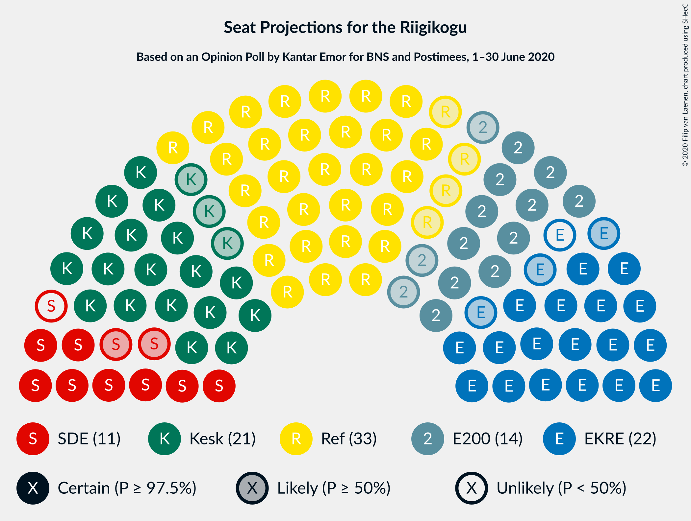
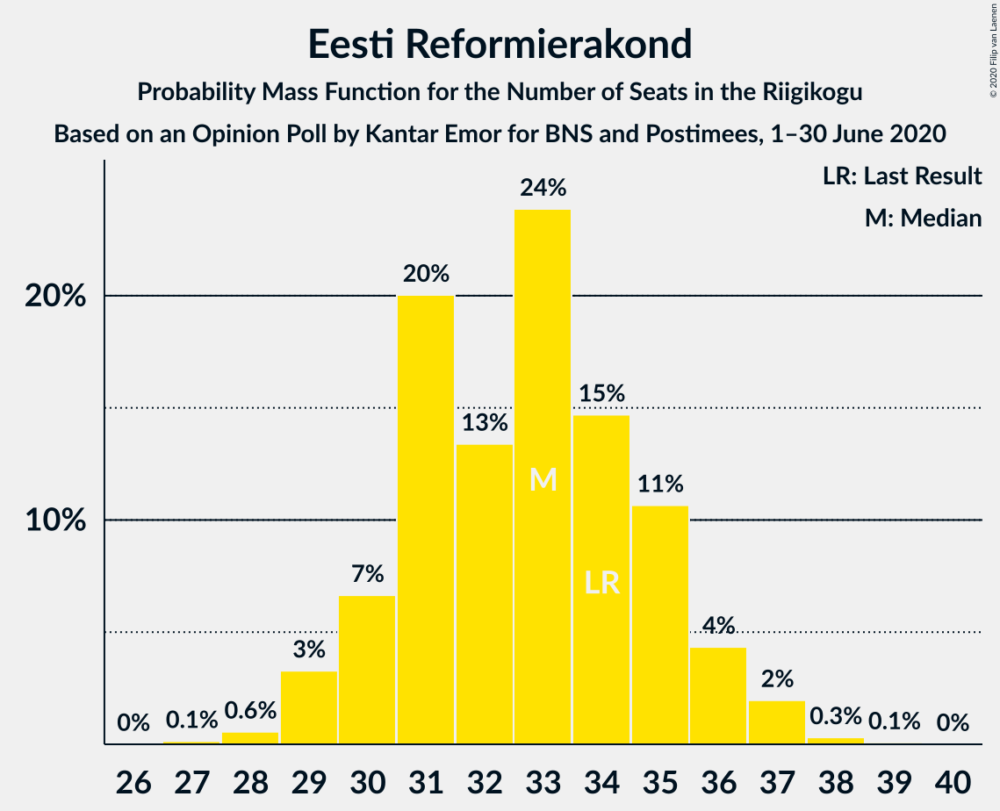
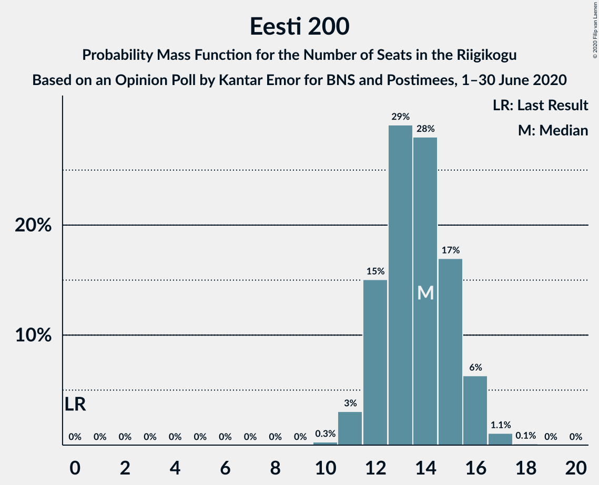
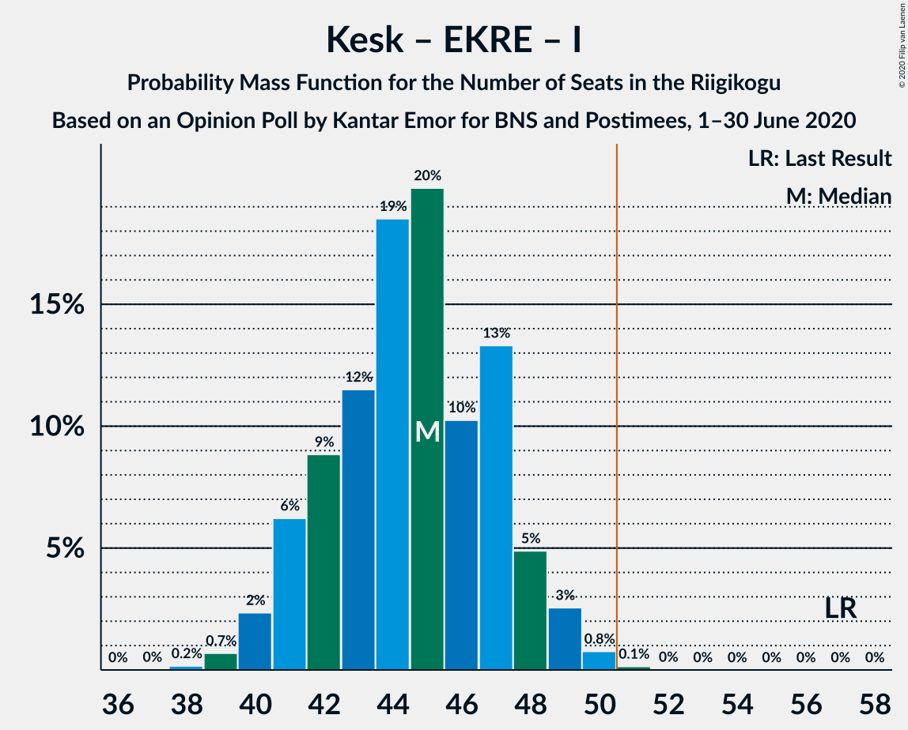

# Opinion Poll by Kantar Emor for BNS and Postimees, 1–30 June 2020

<a href="#voting-intentions">Voting Intentions</a> | <a href="#seats">Seats</a> | <a href="#coalitions">Coalitions</a> | <a href="#technical-information">Technical Information</a>

## Voting Intentions

### Confidence Intervals

| Party | Last Result | Poll Result | 80% Confidence Interval | 90% Confidence Interval | 95% Confidence Interval | 99% Confidence Interval |
|:-----:|:-----------:|:-----------:|:-----------------------:|:-----------------------:|:-----------------------:|:-----------------------:|
| Eesti Reformierakond | 28.9% | 27.9% | 26.3–29.6% |25.9–30.0% |25.5–30.5% |24.8–31.3% |
| Eesti Keskerakond | 23.1% | 18.9% | 17.6–20.4% |17.2–20.8% |16.9–21.2% |16.2–21.9% |
| Eesti Konservatiivne Rahvaerakond | 17.8% | 18.9% | 17.6–20.4% |17.2–20.8% |16.9–21.2% |16.2–21.9% |
| Eesti 200 | 4.4% | 12.9% | 11.8–14.2% |11.5–14.6% |11.2–14.9% |10.7–15.5% |
| Sotsiaaldemokraatlik Erakond | 9.8% | 9.9% | 8.9–11.1% |8.6–11.4% |8.4–11.7% |7.9–12.3% |
| Erakond Isamaa | 11.4% | 5.0% | 4.3–5.9% |4.1–6.1% |3.9–6.3% |3.6–6.8% |
| Erakond Eestimaa Rohelised | 1.8% | 3.0% | 2.5–3.7% |2.3–3.9% |2.2–4.1% |2.0–4.5% |
| Eesti Vabaerakond | 1.2% | 0.2% | 0.1–0.5% |0.1–0.6% |0.1–0.7% |0.0–0.9% |

*Note:* The poll result column reflects the actual value used in the calculations. Published results may vary slightly, and in addition be rounded to fewer digits.

## Seats

### Confidence Intervals

| Party | Last Result | Median | 80% Confidence Interval | 90% Confidence Interval | 95% Confidence Interval | 99% Confidence Interval |
|:-----:|:-----------:|:------:|:-----------------------:|:-----------------------:|:-----------------------:|:-----------------------:|
| <a href="#eesti-reformierakond">Eesti Reformierakond</a> | 34 | 33 | 30–35 |30–36 |29–36 |28–37 |
| <a href="#eesti-keskerakond">Eesti Keskerakond</a> | 26 | 21 | 19–23 |18–23 |18–24 |18–25 |
| <a href="#eesti-konservatiivne-rahvaerakond">Eesti Konservatiivne Rahvaerakond</a> | 19 | 21 | 19–23 |19–23 |18–24 |17–25 |
| <a href="#eesti-200">Eesti 200</a> | 0 | 14 | 12–16 |12–16 |12–16 |10–17 |
| <a href="#sotsiaaldemokraatlik-erakond">Sotsiaaldemokraatlik Erakond</a> | 10 | 10 | 9–11 |9–12 |8–12 |7–13 |
| <a href="#erakond-isamaa">Erakond Isamaa</a> | 12 | 0 | 0–5 |0–6 |0–6 |0–6 |
| <a href="#erakond-eestimaa-rohelised">Erakond Eestimaa Rohelised</a> | 0 | 0 | 0 |0 |0 |0 |
| <a href="#eesti-vabaerakond">Eesti Vabaerakond</a> | 0 | 0 | 0 |0 |0 |0 |

### Eesti Reformierakond

*For a full overview of the results for this party, see the [Eesti Reformierakond](party-eestireformierakond.html) page.*

| Number of Seats | Probability | Accumulated | Special Marks |
|:---------------:|:-----------:|:-----------:|:-------------:|
| 27 | 0.1% | 100% |  |
| 28 | 0.7% | 99.9% |  |
| 29 | 3% | 99.2% |  |
| 30 | 7% | 96% |  |
| 31 | 13% | 89% |  |
| 32 | 17% | 76% |  |
| 33 | 11% | 59% | Median |
| 34 | 35% | 48% | Last Result |
| 35 | 7% | 13% |  |
| 36 | 5% | 6% |  |
| 37 | 0.8% | 1.0% |  |
| 38 | 0.1% | 0.2% |  |
| 39 | 0.1% | 0.1% |  |
| 40 | 0% | 0% |  |

### Eesti Keskerakond

*For a full overview of the results for this party, see the [Eesti Keskerakond](party-eestikeskerakond.html) page.*

| Number of Seats | Probability | Accumulated | Special Marks |
|:---------------:|:-----------:|:-----------:|:-------------:|
| 17 | 0.4% | 100% |  |
| 18 | 6% | 99.6% |  |
| 19 | 10% | 94% |  |
| 20 | 23% | 84% |  |
| 21 | 32% | 61% | Median |
| 22 | 13% | 29% |  |
| 23 | 12% | 17% |  |
| 24 | 4% | 4% |  |
| 25 | 0.4% | 0.6% |  |
| 26 | 0.1% | 0.2% | Last Result |
| 27 | 0% | 0% |  |

### Eesti Konservatiivne Rahvaerakond

*For a full overview of the results for this party, see the [Eesti Konservatiivne Rahvaerakond](party-eestikonservatiivnerahvaerakond.html) page.*

| Number of Seats | Probability | Accumulated | Special Marks |
|:---------------:|:-----------:|:-----------:|:-------------:|
| 17 | 0.5% | 100% |  |
| 18 | 3% | 99.5% |  |
| 19 | 9% | 96% | Last Result |
| 20 | 21% | 88% |  |
| 21 | 18% | 67% | Median |
| 22 | 15% | 49% |  |
| 23 | 30% | 34% |  |
| 24 | 3% | 4% |  |
| 25 | 0.6% | 0.9% |  |
| 26 | 0.3% | 0.3% |  |
| 27 | 0% | 0% |  |

### Eesti 200

*For a full overview of the results for this party, see the [Eesti 200](party-eesti200.html) page.*

| Number of Seats | Probability | Accumulated | Special Marks |
|:---------------:|:-----------:|:-----------:|:-------------:|
| 0 | 0% | 100% | Last Result |
| 1 | 0% | 100% |  |
| 2 | 0% | 100% |  |
| 3 | 0% | 100% |  |
| 4 | 0% | 100% |  |
| 5 | 0% | 100% |  |
| 6 | 0% | 100% |  |
| 7 | 0% | 100% |  |
| 8 | 0% | 100% |  |
| 9 | 0% | 100% |  |
| 10 | 0.5% | 100% |  |
| 11 | 2% | 99.5% |  |
| 12 | 12% | 98% |  |
| 13 | 35% | 86% |  |
| 14 | 23% | 51% | Median |
| 15 | 15% | 28% |  |
| 16 | 12% | 13% |  |
| 17 | 1.1% | 1.2% |  |
| 18 | 0.1% | 0.1% |  |
| 19 | 0% | 0% |  |

### Sotsiaaldemokraatlik Erakond

*For a full overview of the results for this party, see the [Sotsiaaldemokraatlik Erakond](party-sotsiaaldemokraatlikerakond.html) page.*

| Number of Seats | Probability | Accumulated | Special Marks |
|:---------------:|:-----------:|:-----------:|:-------------:|
| 7 | 0.5% | 100% |  |
| 8 | 3% | 99.5% |  |
| 9 | 26% | 96% |  |
| 10 | 43% | 70% | Last Result, Median |
| 11 | 17% | 27% |  |
| 12 | 8% | 10% |  |
| 13 | 2% | 2% |  |
| 14 | 0.1% | 0.1% |  |
| 15 | 0% | 0% |  |

### Erakond Isamaa

*For a full overview of the results for this party, see the [Erakond Isamaa](party-erakondisamaa.html) page.*

| Number of Seats | Probability | Accumulated | Special Marks |
|:---------------:|:-----------:|:-----------:|:-------------:|
| 0 | 59% | 100% | Median |
| 1 | 0% | 41% |  |
| 2 | 0% | 41% |  |
| 3 | 0% | 41% |  |
| 4 | 3% | 41% |  |
| 5 | 31% | 37% |  |
| 6 | 5% | 6% |  |
| 7 | 0.4% | 0.4% |  |
| 8 | 0% | 0% |  |
| 9 | 0% | 0% |  |
| 10 | 0% | 0% |  |
| 11 | 0% | 0% |  |
| 12 | 0% | 0% | Last Result |

### Erakond Eestimaa Rohelised

*For a full overview of the results for this party, see the [Erakond Eestimaa Rohelised](party-erakondeestimaarohelised.html) page.*

| Number of Seats | Probability | Accumulated | Special Marks |
|:---------------:|:-----------:|:-----------:|:-------------:|
| 0 | 100% | 100% | Last Result, Median |

### Eesti Vabaerakond

*For a full overview of the results for this party, see the [Eesti Vabaerakond](party-eestivabaerakond.html) page.*

| Number of Seats | Probability | Accumulated | Special Marks |
|:---------------:|:-----------:|:-----------:|:-------------:|
| 0 | 100% | 100% | Last Result, Median |

## Coalitions

### Confidence Intervals

| Coalition | Last Result | Median | Majority? | 80% Confidence Interval | 90% Confidence Interval | 95% Confidence Interval | 99% Confidence Interval |
|:---------:|:-----------:|:------:|:---------:|:-----------------------:|:-----------------------:|:-----------------------:|:-----------------------:|
| Eesti Reformierakond – Eesti Keskerakond – Eesti Konservatiivne Rahvaerakond | 79 | 75 | 100% | 71–78 | 71–79 | 71–79 | 69–80 |
| Eesti Reformierakond – Eesti Konservatiivne Rahvaerakond – Erakond Isamaa | 65 | 57 | 99.9% | 54–59 | 53–60 | 52–60 | 51–61 |
| Eesti Reformierakond – Eesti Keskerakond | 60 | 54 | 94% | 51–56 | 50–57 | 50–58 | 49–59 |
| Eesti Reformierakond – Eesti Konservatiivne Rahvaerakond | 53 | 54 | 95% | 51–57 | 50–57 | 50–58 | 49–59 |
| Eesti Reformierakond – Sotsiaaldemokraatlik Erakond – Erakond Isamaa – Eesti Vabaerakond | 56 | 44 | 0.3% | 42–48 | 41–49 | 41–50 | 40–50 |
| Eesti Reformierakond – Sotsiaaldemokraatlik Erakond – Erakond Isamaa | 56 | 44 | 0.3% | 42–48 | 41–49 | 41–50 | 40–50 |
| Eesti Keskerakond – Eesti Konservatiivne Rahvaerakond – Erakond Isamaa | 57 | 44 | 0.3% | 41–47 | 41–48 | 40–49 | 39–50 |
| Eesti Reformierakond – Sotsiaaldemokraatlik Erakond | 44 | 43 | 0% | 40–45 | 39–46 | 39–46 | 38–48 |
| Eesti Keskerakond – Eesti Konservatiivne Rahvaerakond | 45 | 42 | 0% | 39–45 | 39–45 | 38–46 | 37–47 |
| Eesti Reformierakond – Erakond Isamaa | 46 | 34 | 0% | 32–38 | 32–39 | 30–40 | 29–40 |
| Eesti Keskerakond – Sotsiaaldemokraatlik Erakond – Erakond Isamaa | 48 | 32 | 0% | 30–37 | 30–37 | 30–38 | 28–39 |
| Eesti Keskerakond – Sotsiaaldemokraatlik Erakond | 36 | 31 | 0% | 29–33 | 28–34 | 28–35 | 27–36 |
| Eesti Konservatiivne Rahvaerakond – Sotsiaaldemokraatlik Erakond | 29 | 31 | 0% | 29–34 | 28–35 | 28–35 | 27–36 |

### Eesti Reformierakond – Eesti Keskerakond – Eesti Konservatiivne Rahvaerakond

| Number of Seats | Probability | Accumulated | Special Marks |
|:---------------:|:-----------:|:-----------:|:-------------:|
| 68 | 0.1% | 100% |  |
| 69 | 0.4% | 99.9% |  |
| 70 | 0.8% | 99.5% |  |
| 71 | 11% | 98.6% |  |
| 72 | 11% | 88% |  |
| 73 | 7% | 77% |  |
| 74 | 10% | 70% |  |
| 75 | 15% | 60% | Median |
| 76 | 6% | 45% |  |
| 77 | 9% | 39% |  |
| 78 | 24% | 29% |  |
| 79 | 4% | 5% | Last Result |
| 80 | 1.3% | 1.5% |  |
| 81 | 0.1% | 0.2% |  |
| 82 | 0% | 0% |  |

### Eesti Reformierakond – Eesti Konservatiivne Rahvaerakond – Erakond Isamaa

| Number of Seats | Probability | Accumulated | Special Marks |
|:---------------:|:-----------:|:-----------:|:-------------:|
| 50 | 0.1% | 100% |  |
| 51 | 2% | 99.9% | Majority |
| 52 | 2% | 98% |  |
| 53 | 3% | 96% |  |
| 54 | 11% | 93% | Median |
| 55 | 17% | 83% |  |
| 56 | 15% | 66% |  |
| 57 | 28% | 51% |  |
| 58 | 10% | 23% |  |
| 59 | 8% | 13% |  |
| 60 | 4% | 5% |  |
| 61 | 1.1% | 1.4% |  |
| 62 | 0.3% | 0.3% |  |
| 63 | 0% | 0% |  |
| 64 | 0% | 0% |  |
| 65 | 0% | 0% | Last Result |

### Eesti Reformierakond – Eesti Keskerakond

| Number of Seats | Probability | Accumulated | Special Marks |
|:---------------:|:-----------:|:-----------:|:-------------:|
| 47 | 0.1% | 100% |  |
| 48 | 0.3% | 99.9% |  |
| 49 | 2% | 99.7% |  |
| 50 | 4% | 98% |  |
| 51 | 11% | 94% | Majority |
| 52 | 15% | 83% |  |
| 53 | 8% | 68% |  |
| 54 | 15% | 60% | Median |
| 55 | 29% | 45% |  |
| 56 | 7% | 16% |  |
| 57 | 4% | 9% |  |
| 58 | 4% | 4% |  |
| 59 | 0.2% | 0.6% |  |
| 60 | 0.2% | 0.3% | Last Result |
| 61 | 0.1% | 0.1% |  |
| 62 | 0% | 0% |  |

### Eesti Reformierakond – Eesti Konservatiivne Rahvaerakond

| Number of Seats | Probability | Accumulated | Special Marks |
|:---------------:|:-----------:|:-----------:|:-------------:|
| 47 | 0.1% | 100% |  |
| 48 | 0.2% | 99.8% |  |
| 49 | 0.9% | 99.6% |  |
| 50 | 4% | 98.8% |  |
| 51 | 15% | 95% | Majority |
| 52 | 5% | 80% |  |
| 53 | 12% | 75% | Last Result |
| 54 | 15% | 63% | Median |
| 55 | 17% | 48% |  |
| 56 | 4% | 32% |  |
| 57 | 23% | 28% |  |
| 58 | 4% | 5% |  |
| 59 | 0.4% | 0.6% |  |
| 60 | 0.2% | 0.2% |  |
| 61 | 0% | 0% |  |

### Eesti Reformierakond – Sotsiaaldemokraatlik Erakond – Erakond Isamaa – Eesti Vabaerakond

| Number of Seats | Probability | Accumulated | Special Marks |
|:---------------:|:-----------:|:-----------:|:-------------:|
| 39 | 0.2% | 100% |  |
| 40 | 0.9% | 99.7% |  |
| 41 | 8% | 98.8% |  |
| 42 | 2% | 90% |  |
| 43 | 8% | 89% | Median |
| 44 | 34% | 81% |  |
| 45 | 8% | 47% |  |
| 46 | 11% | 39% |  |
| 47 | 14% | 28% |  |
| 48 | 6% | 14% |  |
| 49 | 5% | 8% |  |
| 50 | 3% | 3% |  |
| 51 | 0.2% | 0.3% | Majority |
| 52 | 0.1% | 0.2% |  |
| 53 | 0% | 0% |  |
| 54 | 0% | 0% |  |
| 55 | 0% | 0% |  |
| 56 | 0% | 0% | Last Result |

### Eesti Reformierakond – Sotsiaaldemokraatlik Erakond – Erakond Isamaa

| Number of Seats | Probability | Accumulated | Special Marks |
|:---------------:|:-----------:|:-----------:|:-------------:|
| 39 | 0.2% | 100% |  |
| 40 | 0.9% | 99.7% |  |
| 41 | 8% | 98.8% |  |
| 42 | 2% | 90% |  |
| 43 | 8% | 89% | Median |
| 44 | 34% | 81% |  |
| 45 | 8% | 47% |  |
| 46 | 11% | 39% |  |
| 47 | 14% | 28% |  |
| 48 | 6% | 14% |  |
| 49 | 5% | 8% |  |
| 50 | 3% | 3% |  |
| 51 | 0.2% | 0.3% | Majority |
| 52 | 0.1% | 0.2% |  |
| 53 | 0% | 0% |  |
| 54 | 0% | 0% |  |
| 55 | 0% | 0% |  |
| 56 | 0% | 0% | Last Result |

### Eesti Keskerakond – Eesti Konservatiivne Rahvaerakond – Erakond Isamaa

| Number of Seats | Probability | Accumulated | Special Marks |
|:---------------:|:-----------:|:-----------:|:-------------:|
| 38 | 0.1% | 100% |  |
| 39 | 0.8% | 99.9% |  |
| 40 | 2% | 99.0% |  |
| 41 | 10% | 97% |  |
| 42 | 5% | 87% | Median |
| 43 | 7% | 82% |  |
| 44 | 32% | 75% |  |
| 45 | 21% | 42% |  |
| 46 | 6% | 21% |  |
| 47 | 7% | 15% |  |
| 48 | 4% | 8% |  |
| 49 | 3% | 4% |  |
| 50 | 0.9% | 1.1% |  |
| 51 | 0.3% | 0.3% | Majority |
| 52 | 0% | 0% |  |
| 53 | 0% | 0% |  |
| 54 | 0% | 0% |  |
| 55 | 0% | 0% |  |
| 56 | 0% | 0% |  |
| 57 | 0% | 0% | Last Result |

### Eesti Reformierakond – Sotsiaaldemokraatlik Erakond

| Number of Seats | Probability | Accumulated | Special Marks |
|:---------------:|:-----------:|:-----------:|:-------------:|
| 36 | 0.1% | 100% |  |
| 37 | 0.1% | 99.9% |  |
| 38 | 0.5% | 99.8% |  |
| 39 | 6% | 99.3% |  |
| 40 | 4% | 94% |  |
| 41 | 15% | 90% |  |
| 42 | 16% | 74% |  |
| 43 | 10% | 58% | Median |
| 44 | 33% | 49% | Last Result |
| 45 | 8% | 16% |  |
| 46 | 5% | 8% |  |
| 47 | 1.4% | 2% |  |
| 48 | 0.7% | 0.9% |  |
| 49 | 0.2% | 0.2% |  |
| 50 | 0% | 0% |  |

### Eesti Keskerakond – Eesti Konservatiivne Rahvaerakond

| Number of Seats | Probability | Accumulated | Special Marks |
|:---------------:|:-----------:|:-----------:|:-------------:|
| 36 | 0.2% | 100% |  |
| 37 | 0.9% | 99.8% |  |
| 38 | 3% | 98.9% |  |
| 39 | 7% | 96% |  |
| 40 | 13% | 89% |  |
| 41 | 16% | 75% |  |
| 42 | 11% | 60% | Median |
| 43 | 7% | 49% |  |
| 44 | 29% | 42% |  |
| 45 | 10% | 13% | Last Result |
| 46 | 1.3% | 3% |  |
| 47 | 1.0% | 1.2% |  |
| 48 | 0.2% | 0.2% |  |
| 49 | 0% | 0% |  |

### Eesti Reformierakond – Erakond Isamaa

| Number of Seats | Probability | Accumulated | Special Marks |
|:---------------:|:-----------:|:-----------:|:-------------:|
| 29 | 1.4% | 100% |  |
| 30 | 1.3% | 98.5% |  |
| 31 | 1.3% | 97% |  |
| 32 | 12% | 96% |  |
| 33 | 3% | 84% | Median |
| 34 | 34% | 81% |  |
| 35 | 10% | 48% |  |
| 36 | 16% | 38% |  |
| 37 | 5% | 21% |  |
| 38 | 9% | 17% |  |
| 39 | 5% | 8% |  |
| 40 | 3% | 3% |  |
| 41 | 0.1% | 0.3% |  |
| 42 | 0.1% | 0.1% |  |
| 43 | 0% | 0% |  |
| 44 | 0% | 0% |  |
| 45 | 0% | 0% |  |
| 46 | 0% | 0% | Last Result |

### Eesti Keskerakond – Sotsiaaldemokraatlik Erakond – Erakond Isamaa

| Number of Seats | Probability | Accumulated | Special Marks |
|:---------------:|:-----------:|:-----------:|:-------------:|
| 27 | 0.1% | 100% |  |
| 28 | 0.5% | 99.9% |  |
| 29 | 1.4% | 99.4% |  |
| 30 | 10% | 98% |  |
| 31 | 25% | 88% | Median |
| 32 | 13% | 62% |  |
| 33 | 11% | 49% |  |
| 34 | 10% | 38% |  |
| 35 | 7% | 28% |  |
| 36 | 11% | 21% |  |
| 37 | 7% | 10% |  |
| 38 | 2% | 4% |  |
| 39 | 1.2% | 1.4% |  |
| 40 | 0.2% | 0.2% |  |
| 41 | 0% | 0% |  |
| 42 | 0% | 0% |  |
| 43 | 0% | 0% |  |
| 44 | 0% | 0% |  |
| 45 | 0% | 0% |  |
| 46 | 0% | 0% |  |
| 47 | 0% | 0% |  |
| 48 | 0% | 0% | Last Result |

### Eesti Keskerakond – Sotsiaaldemokraatlik Erakond

| Number of Seats | Probability | Accumulated | Special Marks |
|:---------------:|:-----------:|:-----------:|:-------------:|
| 26 | 0.3% | 100% |  |
| 27 | 2% | 99.6% |  |
| 28 | 7% | 98% |  |
| 29 | 8% | 90% |  |
| 30 | 15% | 82% |  |
| 31 | 34% | 67% | Median |
| 32 | 19% | 33% |  |
| 33 | 8% | 14% |  |
| 34 | 3% | 6% |  |
| 35 | 2% | 3% |  |
| 36 | 0.4% | 0.5% | Last Result |
| 37 | 0.1% | 0.1% |  |
| 38 | 0% | 0% |  |

### Eesti Konservatiivne Rahvaerakond – Sotsiaaldemokraatlik Erakond

| Number of Seats | Probability | Accumulated | Special Marks |
|:---------------:|:-----------:|:-----------:|:-------------:|
| 26 | 0.1% | 100% |  |
| 27 | 0.7% | 99.8% |  |
| 28 | 4% | 99.2% |  |
| 29 | 12% | 95% | Last Result |
| 30 | 12% | 83% |  |
| 31 | 28% | 71% | Median |
| 32 | 8% | 43% |  |
| 33 | 24% | 35% |  |
| 34 | 6% | 11% |  |
| 35 | 5% | 5% |  |
| 36 | 0.4% | 0.6% |  |
| 37 | 0.2% | 0.2% |  |
| 38 | 0% | 0% |  |

## Technical Information

### Opinion Poll

+ **Polling firm:** Kantar Emor
+ **Commissioner(s):** BNS and Postimees
+ **Fieldwork period:** 1–30 June 2020

### Calculations

+ **Sample size:** 1268
+ **Simulations done:** 131,072
+ **Error estimate:** 1.20%

