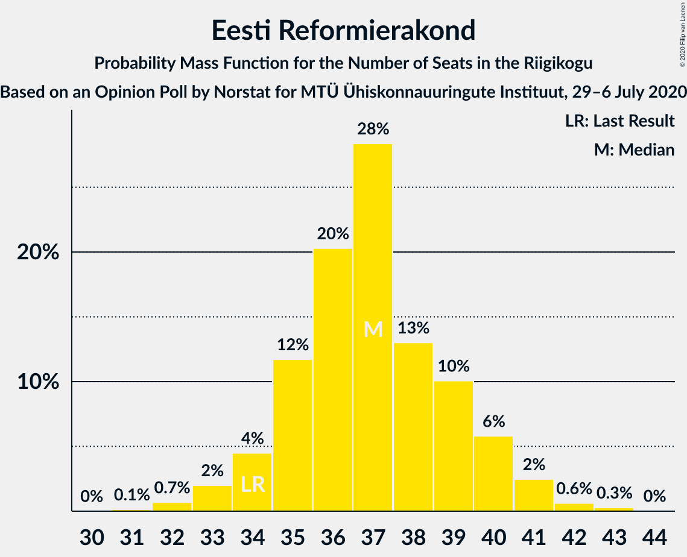
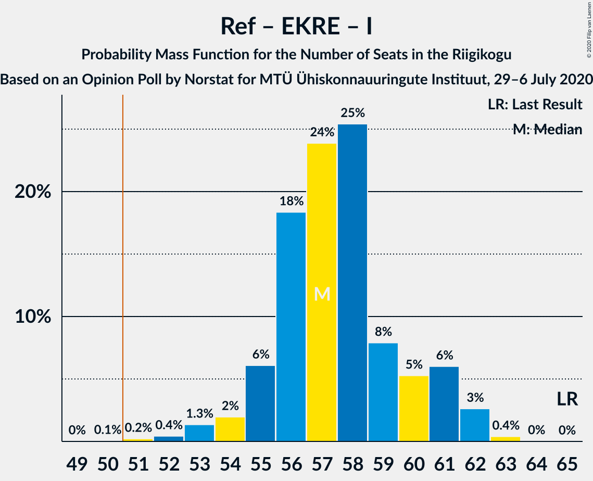
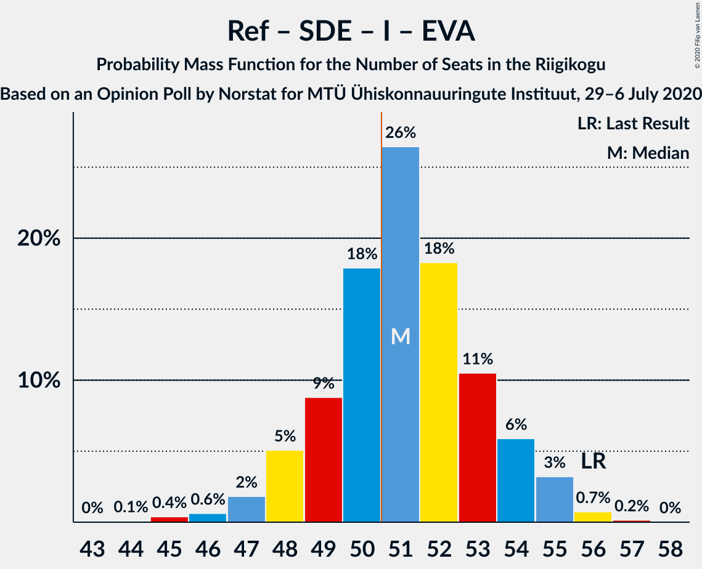

# Opinion Poll by Norstat for MTÜ Ühiskonnauuringute Instituut, 29–6 July 2020

<a href="#voting-intentions">Voting Intentions</a> | <a href="#seats">Seats</a> | <a href="#coalitions">Coalitions</a> | <a href="#technical-information">Technical Information</a>

## Voting Intentions

### Confidence Intervals

| Party | Last Result | Poll Result | 80% Confidence Interval | 90% Confidence Interval | 95% Confidence Interval | 99% Confidence Interval |
|:-----:|:-----------:|:-----------:|:-----------------------:|:-----------------------:|:-----------------------:|:-----------------------:|
| Eesti Reformierakond | 28.9% | 32.1% | 30.3–34.0% |29.7–34.6% |29.3–35.1% |28.4–36.0% |
| Eesti Keskerakond | 23.1% | 22.9% | 21.3–24.7% |20.8–25.2% |20.4–25.6% |19.6–26.5% |
| Eesti Konservatiivne Rahvaerakond | 17.8% | 14.8% | 13.4–16.3% |13.1–16.8% |12.7–17.1% |12.1–17.9% |
| Eesti 200 | 4.4% | 9.6% | 8.5–10.9% |8.2–11.3% |7.9–11.6% |7.4–12.2% |
| Sotsiaaldemokraatlik Erakond | 9.8% | 9.2% | 8.1–10.5% |7.8–10.8% |7.6–11.2% |7.1–11.8% |
| Erakond Isamaa | 11.4% | 6.1% | 5.2–7.2% |5.0–7.5% |4.8–7.8% |4.4–8.3% |
| Erakond Eestimaa Rohelised | 1.8% | 2.5% | 2.0–3.3% |1.8–3.5% |1.7–3.7% |1.5–4.1% |
| Eesti Vabaerakond | 1.2% | 0.6% | 0.4–1.1% |0.3–1.2% |0.3–1.3% |0.2–1.6% |

*Note:* The poll result column reflects the actual value used in the calculations. Published results may vary slightly, and in addition be rounded to fewer digits.

## Seats

### Confidence Intervals

| Party | Last Result | Median | 80% Confidence Interval | 90% Confidence Interval | 95% Confidence Interval | 99% Confidence Interval |
|:-----:|:-----------:|:------:|:-----------------------:|:-----------------------:|:-----------------------:|:-----------------------:|
| <a href="#eesti-reformierakond">Eesti Reformierakond</a> | 34 | 37 | 35–39 |34–40 |33–41 |32–42 |
| <a href="#eesti-keskerakond">Eesti Keskerakond</a> | 26 | 25 | 23–27 |22–28 |22–28 |21–30 |
| <a href="#eesti-konservatiivne-rahvaerakond">Eesti Konservatiivne Rahvaerakond</a> | 19 | 15 | 14–17 |13–17 |13–18 |12–19 |
| <a href="#eesti-200">Eesti 200</a> | 0 | 9 | 8–11 |8–11 |7–11 |7–12 |
| <a href="#sotsiaaldemokraatlik-erakond">Sotsiaaldemokraatlik Erakond</a> | 10 | 9 | 8–10 |7–11 |7–11 |7–12 |
| <a href="#erakond-isamaa">Erakond Isamaa</a> | 12 | 5 | 5–7 |0–7 |0–7 |0–8 |
| <a href="#erakond-eestimaa-rohelised">Erakond Eestimaa Rohelised</a> | 0 | 0 | 0 |0 |0 |0 |
| <a href="#eesti-vabaerakond">Eesti Vabaerakond</a> | 0 | 0 | 0 |0 |0 |0 |

### Eesti Reformierakond

*For a full overview of the results for this party, see the [Eesti Reformierakond](party-eestireformierakond.html) page.*

| Number of Seats | Probability | Accumulated | Special Marks |
|:---------------:|:-----------:|:-----------:|:-------------:|
| 31 | 0.1% | 100% |  |
| 32 | 0.7% | 99.9% |  |
| 33 | 2% | 99.2% |  |
| 34 | 4% | 97% | Last Result |
| 35 | 12% | 93% |  |
| 36 | 20% | 81% |  |
| 37 | 28% | 61% | Median |
| 38 | 13% | 32% |  |
| 39 | 10% | 19% |  |
| 40 | 6% | 9% |  |
| 41 | 2% | 3% |  |
| 42 | 0.6% | 0.9% |  |
| 43 | 0.3% | 0.3% |  |
| 44 | 0% | 0% |  |

### Eesti Keskerakond

*For a full overview of the results for this party, see the [Eesti Keskerakond](party-eestikeskerakond.html) page.*

| Number of Seats | Probability | Accumulated | Special Marks |
|:---------------:|:-----------:|:-----------:|:-------------:|
| 20 | 0.1% | 100% |  |
| 21 | 0.8% | 99.9% |  |
| 22 | 4% | 99.0% |  |
| 23 | 9% | 95% |  |
| 24 | 15% | 86% |  |
| 25 | 29% | 71% | Median |
| 26 | 22% | 41% | Last Result |
| 27 | 14% | 20% |  |
| 28 | 4% | 6% |  |
| 29 | 1.3% | 2% |  |
| 30 | 0.5% | 0.7% |  |
| 31 | 0.1% | 0.2% |  |
| 32 | 0% | 0% |  |

### Eesti Konservatiivne Rahvaerakond

*For a full overview of the results for this party, see the [Eesti Konservatiivne Rahvaerakond](party-eestikonservatiivnerahvaerakond.html) page.*

| Number of Seats | Probability | Accumulated | Special Marks |
|:---------------:|:-----------:|:-----------:|:-------------:|
| 11 | 0.1% | 100% |  |
| 12 | 1.1% | 99.9% |  |
| 13 | 7% | 98.8% |  |
| 14 | 18% | 91% |  |
| 15 | 34% | 73% | Median |
| 16 | 21% | 39% |  |
| 17 | 14% | 18% |  |
| 18 | 3% | 4% |  |
| 19 | 0.9% | 1.0% | Last Result |
| 20 | 0.1% | 0.2% |  |
| 21 | 0% | 0% |  |

### Eesti 200

*For a full overview of the results for this party, see the [Eesti 200](party-eesti200.html) page.*

| Number of Seats | Probability | Accumulated | Special Marks |
|:---------------:|:-----------:|:-----------:|:-------------:|
| 0 | 0% | 100% | Last Result |
| 1 | 0% | 100% |  |
| 2 | 0% | 100% |  |
| 3 | 0% | 100% |  |
| 4 | 0% | 100% |  |
| 5 | 0% | 100% |  |
| 6 | 0.1% | 100% |  |
| 7 | 3% | 99.9% |  |
| 8 | 17% | 97% |  |
| 9 | 32% | 80% | Median |
| 10 | 33% | 48% |  |
| 11 | 13% | 15% |  |
| 12 | 2% | 2% |  |
| 13 | 0.2% | 0.2% |  |
| 14 | 0% | 0% |  |

### Sotsiaaldemokraatlik Erakond

*For a full overview of the results for this party, see the [Sotsiaaldemokraatlik Erakond](party-sotsiaaldemokraatlikerakond.html) page.*

| Number of Seats | Probability | Accumulated | Special Marks |
|:---------------:|:-----------:|:-----------:|:-------------:|
| 6 | 0.4% | 100% |  |
| 7 | 6% | 99.6% |  |
| 8 | 31% | 94% |  |
| 9 | 40% | 63% | Median |
| 10 | 17% | 23% | Last Result |
| 11 | 5% | 5% |  |
| 12 | 0.9% | 0.9% |  |
| 13 | 0.1% | 0.1% |  |
| 14 | 0% | 0% |  |

### Erakond Isamaa

*For a full overview of the results for this party, see the [Erakond Isamaa](party-erakondisamaa.html) page.*

| Number of Seats | Probability | Accumulated | Special Marks |
|:---------------:|:-----------:|:-----------:|:-------------:|
| 0 | 5% | 100% |  |
| 1 | 0% | 95% |  |
| 2 | 0% | 95% |  |
| 3 | 0% | 95% |  |
| 4 | 4% | 95% |  |
| 5 | 43% | 90% | Median |
| 6 | 36% | 47% |  |
| 7 | 10% | 11% |  |
| 8 | 1.2% | 1.3% |  |
| 9 | 0.1% | 0.1% |  |
| 10 | 0% | 0% |  |
| 11 | 0% | 0% |  |
| 12 | 0% | 0% | Last Result |

### Erakond Eestimaa Rohelised

*For a full overview of the results for this party, see the [Erakond Eestimaa Rohelised](party-erakondeestimaarohelised.html) page.*

| Number of Seats | Probability | Accumulated | Special Marks |
|:---------------:|:-----------:|:-----------:|:-------------:|
| 0 | 100% | 100% | Last Result, Median |

### Eesti Vabaerakond

*For a full overview of the results for this party, see the [Eesti Vabaerakond](party-eestivabaerakond.html) page.*

| Number of Seats | Probability | Accumulated | Special Marks |
|:---------------:|:-----------:|:-----------:|:-------------:|
| 0 | 100% | 100% | Last Result, Median |

## Coalitions

### Confidence Intervals

| Coalition | Last Result | Median | Majority? | 80% Confidence Interval | 90% Confidence Interval | 95% Confidence Interval | 99% Confidence Interval |
|:---------:|:-----------:|:------:|:---------:|:-----------------------:|:-----------------------:|:-----------------------:|:-----------------------:|
| Eesti Reformierakond – Eesti Keskerakond – Eesti Konservatiivne Rahvaerakond | 79 | 77 | 100% | 75–80 | 75–81 | 74–82 | 73–84 |
| Eesti Reformierakond – Eesti Keskerakond | 60 | 62 | 100% | 60–65 | 59–65 | 58–66 | 57–68 |
| Eesti Reformierakond – Eesti Konservatiivne Rahvaerakond – Erakond Isamaa | 65 | 57 | 99.9% | 55–60 | 55–61 | 54–62 | 52–62 |
| Eesti Reformierakond – Eesti Konservatiivne Rahvaerakond | 53 | 52 | 84% | 50–55 | 49–56 | 49–56 | 47–58 |
| Eesti Reformierakond – Sotsiaaldemokraatlik Erakond – Erakond Isamaa – Eesti Vabaerakond | 56 | 51 | 65% | 49–54 | 48–54 | 47–55 | 45–56 |
| Eesti Reformierakond – Sotsiaaldemokraatlik Erakond – Erakond Isamaa | 56 | 51 | 65% | 49–54 | 48–54 | 47–55 | 45–56 |
| Eesti Reformierakond – Sotsiaaldemokraatlik Erakond | 44 | 46 | 1.1% | 43–48 | 43–49 | 42–50 | 41–51 |
| Eesti Keskerakond – Eesti Konservatiivne Rahvaerakond – Erakond Isamaa | 57 | 46 | 0.9% | 43–48 | 43–49 | 42–49 | 40–51 |
| Eesti Reformierakond – Erakond Isamaa | 46 | 42 | 0% | 40–45 | 39–46 | 38–46 | 36–47 |
| Eesti Keskerakond – Eesti Konservatiivne Rahvaerakond | 45 | 40 | 0% | 38–43 | 38–43 | 37–44 | 36–46 |
| Eesti Keskerakond – Sotsiaaldemokraatlik Erakond – Erakond Isamaa | 48 | 39 | 0% | 37–42 | 36–42 | 35–43 | 33–44 |
| Eesti Keskerakond – Sotsiaaldemokraatlik Erakond | 36 | 34 | 0% | 32–36 | 31–37 | 31–38 | 30–39 |
| Eesti Konservatiivne Rahvaerakond – Sotsiaaldemokraatlik Erakond | 29 | 24 | 0% | 22–26 | 22–27 | 21–27 | 20–29 |

### Eesti Reformierakond – Eesti Keskerakond – Eesti Konservatiivne Rahvaerakond

| Number of Seats | Probability | Accumulated | Special Marks |
|:---------------:|:-----------:|:-----------:|:-------------:|
| 72 | 0.1% | 100% |  |
| 73 | 0.8% | 99.9% |  |
| 74 | 3% | 99.1% |  |
| 75 | 9% | 96% |  |
| 76 | 19% | 87% |  |
| 77 | 21% | 67% | Median |
| 78 | 22% | 47% |  |
| 79 | 12% | 24% | Last Result |
| 80 | 6% | 12% |  |
| 81 | 2% | 6% |  |
| 82 | 2% | 3% |  |
| 83 | 0.8% | 2% |  |
| 84 | 0.6% | 0.8% |  |
| 85 | 0.1% | 0.2% |  |
| 86 | 0% | 0% |  |

### Eesti Reformierakond – Eesti Keskerakond

| Number of Seats | Probability | Accumulated | Special Marks |
|:---------------:|:-----------:|:-----------:|:-------------:|
| 56 | 0.1% | 100% |  |
| 57 | 0.5% | 99.9% |  |
| 58 | 3% | 99.3% |  |
| 59 | 4% | 97% |  |
| 60 | 11% | 92% | Last Result |
| 61 | 19% | 81% |  |
| 62 | 19% | 62% | Median |
| 63 | 20% | 43% |  |
| 64 | 13% | 24% |  |
| 65 | 6% | 11% |  |
| 66 | 2% | 5% |  |
| 67 | 1.4% | 2% |  |
| 68 | 0.4% | 0.6% |  |
| 69 | 0.2% | 0.2% |  |
| 70 | 0% | 0% |  |

### Eesti Reformierakond – Eesti Konservatiivne Rahvaerakond – Erakond Isamaa

| Number of Seats | Probability | Accumulated | Special Marks |
|:---------------:|:-----------:|:-----------:|:-------------:|
| 50 | 0.1% | 100% |  |
| 51 | 0.2% | 99.9% | Majority |
| 52 | 0.4% | 99.7% |  |
| 53 | 1.3% | 99.3% |  |
| 54 | 2% | 98% |  |
| 55 | 6% | 96% |  |
| 56 | 18% | 90% |  |
| 57 | 24% | 72% | Median |
| 58 | 25% | 48% |  |
| 59 | 8% | 22% |  |
| 60 | 5% | 14% |  |
| 61 | 6% | 9% |  |
| 62 | 3% | 3% |  |
| 63 | 0.4% | 0.4% |  |
| 64 | 0% | 0% |  |
| 65 | 0% | 0% | Last Result |

### Eesti Reformierakond – Eesti Konservatiivne Rahvaerakond

| Number of Seats | Probability | Accumulated | Special Marks |
|:---------------:|:-----------:|:-----------:|:-------------:|
| 46 | 0.1% | 100% |  |
| 47 | 0.4% | 99.9% |  |
| 48 | 1.5% | 99.4% |  |
| 49 | 3% | 98% |  |
| 50 | 11% | 95% |  |
| 51 | 23% | 84% | Majority |
| 52 | 22% | 60% | Median |
| 53 | 17% | 39% | Last Result |
| 54 | 6% | 22% |  |
| 55 | 8% | 15% |  |
| 56 | 5% | 7% |  |
| 57 | 1.4% | 2% |  |
| 58 | 0.6% | 1.0% |  |
| 59 | 0.3% | 0.4% |  |
| 60 | 0% | 0% |  |

### Eesti Reformierakond – Sotsiaaldemokraatlik Erakond – Erakond Isamaa – Eesti Vabaerakond

| Number of Seats | Probability | Accumulated | Special Marks |
|:---------------:|:-----------:|:-----------:|:-------------:|
| 44 | 0.1% | 100% |  |
| 45 | 0.4% | 99.9% |  |
| 46 | 0.6% | 99.5% |  |
| 47 | 2% | 98.9% |  |
| 48 | 5% | 97% |  |
| 49 | 9% | 92% |  |
| 50 | 18% | 83% |  |
| 51 | 26% | 65% | Median, Majority |
| 52 | 18% | 39% |  |
| 53 | 11% | 21% |  |
| 54 | 6% | 10% |  |
| 55 | 3% | 4% |  |
| 56 | 0.7% | 0.9% | Last Result |
| 57 | 0.2% | 0.2% |  |
| 58 | 0% | 0% |  |

### Eesti Reformierakond – Sotsiaaldemokraatlik Erakond – Erakond Isamaa

| Number of Seats | Probability | Accumulated | Special Marks |
|:---------------:|:-----------:|:-----------:|:-------------:|
| 44 | 0.1% | 100% |  |
| 45 | 0.4% | 99.9% |  |
| 46 | 0.6% | 99.5% |  |
| 47 | 2% | 98.9% |  |
| 48 | 5% | 97% |  |
| 49 | 9% | 92% |  |
| 50 | 18% | 83% |  |
| 51 | 26% | 65% | Median, Majority |
| 52 | 18% | 39% |  |
| 53 | 11% | 21% |  |
| 54 | 6% | 10% |  |
| 55 | 3% | 4% |  |
| 56 | 0.7% | 0.9% | Last Result |
| 57 | 0.2% | 0.2% |  |
| 58 | 0% | 0% |  |

### Eesti Reformierakond – Sotsiaaldemokraatlik Erakond

| Number of Seats | Probability | Accumulated | Special Marks |
|:---------------:|:-----------:|:-----------:|:-------------:|
| 40 | 0.2% | 100% |  |
| 41 | 0.6% | 99.7% |  |
| 42 | 2% | 99.1% |  |
| 43 | 7% | 97% |  |
| 44 | 11% | 90% | Last Result |
| 45 | 23% | 79% |  |
| 46 | 25% | 56% | Median |
| 47 | 13% | 31% |  |
| 48 | 10% | 18% |  |
| 49 | 5% | 8% |  |
| 50 | 2% | 3% |  |
| 51 | 0.7% | 1.1% | Majority |
| 52 | 0.2% | 0.3% |  |
| 53 | 0.1% | 0.1% |  |
| 54 | 0% | 0% |  |

### Eesti Keskerakond – Eesti Konservatiivne Rahvaerakond – Erakond Isamaa

| Number of Seats | Probability | Accumulated | Special Marks |
|:---------------:|:-----------:|:-----------:|:-------------:|
| 38 | 0.1% | 100% |  |
| 39 | 0.1% | 99.9% |  |
| 40 | 0.5% | 99.8% |  |
| 41 | 1.3% | 99.3% |  |
| 42 | 2% | 98% |  |
| 43 | 7% | 96% |  |
| 44 | 11% | 88% |  |
| 45 | 25% | 78% | Median |
| 46 | 17% | 53% |  |
| 47 | 16% | 36% |  |
| 48 | 14% | 19% |  |
| 49 | 4% | 6% |  |
| 50 | 1.1% | 2% |  |
| 51 | 0.8% | 0.9% | Majority |
| 52 | 0.1% | 0.1% |  |
| 53 | 0% | 0% |  |
| 54 | 0% | 0% |  |
| 55 | 0% | 0% |  |
| 56 | 0% | 0% |  |
| 57 | 0% | 0% | Last Result |

### Eesti Reformierakond – Erakond Isamaa

| Number of Seats | Probability | Accumulated | Special Marks |
|:---------------:|:-----------:|:-----------:|:-------------:|
| 35 | 0.2% | 100% |  |
| 36 | 0.3% | 99.7% |  |
| 37 | 0.7% | 99.5% |  |
| 38 | 2% | 98.8% |  |
| 39 | 5% | 97% |  |
| 40 | 5% | 92% |  |
| 41 | 20% | 87% |  |
| 42 | 25% | 67% | Median |
| 43 | 22% | 43% |  |
| 44 | 9% | 21% |  |
| 45 | 6% | 12% |  |
| 46 | 5% | 6% | Last Result |
| 47 | 1.3% | 1.5% |  |
| 48 | 0.1% | 0.2% |  |
| 49 | 0% | 0% |  |

### Eesti Keskerakond – Eesti Konservatiivne Rahvaerakond

| Number of Seats | Probability | Accumulated | Special Marks |
|:---------------:|:-----------:|:-----------:|:-------------:|
| 35 | 0.2% | 100% |  |
| 36 | 0.9% | 99.7% |  |
| 37 | 4% | 98.8% |  |
| 38 | 7% | 95% |  |
| 39 | 17% | 88% |  |
| 40 | 26% | 71% | Median |
| 41 | 15% | 45% |  |
| 42 | 17% | 30% |  |
| 43 | 9% | 13% |  |
| 44 | 2% | 4% |  |
| 45 | 1.5% | 2% | Last Result |
| 46 | 0.5% | 0.7% |  |
| 47 | 0.1% | 0.1% |  |
| 48 | 0% | 0.1% |  |
| 49 | 0% | 0% |  |

### Eesti Keskerakond – Sotsiaaldemokraatlik Erakond – Erakond Isamaa

| Number of Seats | Probability | Accumulated | Special Marks |
|:---------------:|:-----------:|:-----------:|:-------------:|
| 32 | 0.2% | 100% |  |
| 33 | 0.3% | 99.7% |  |
| 34 | 0.7% | 99.4% |  |
| 35 | 2% | 98.8% |  |
| 36 | 4% | 96% |  |
| 37 | 8% | 92% |  |
| 38 | 13% | 84% |  |
| 39 | 22% | 71% | Median |
| 40 | 23% | 49% |  |
| 41 | 14% | 26% |  |
| 42 | 7% | 12% |  |
| 43 | 3% | 5% |  |
| 44 | 1.1% | 1.4% |  |
| 45 | 0.3% | 0.4% |  |
| 46 | 0% | 0.1% |  |
| 47 | 0% | 0% |  |
| 48 | 0% | 0% | Last Result |

### Eesti Keskerakond – Sotsiaaldemokraatlik Erakond

| Number of Seats | Probability | Accumulated | Special Marks |
|:---------------:|:-----------:|:-----------:|:-------------:|
| 29 | 0.4% | 100% |  |
| 30 | 2% | 99.5% |  |
| 31 | 6% | 98% |  |
| 32 | 8% | 92% |  |
| 33 | 17% | 83% |  |
| 34 | 30% | 66% | Median |
| 35 | 17% | 36% |  |
| 36 | 13% | 20% | Last Result |
| 37 | 4% | 7% |  |
| 38 | 2% | 3% |  |
| 39 | 0.8% | 1.2% |  |
| 40 | 0.3% | 0.4% |  |
| 41 | 0.1% | 0.1% |  |
| 42 | 0% | 0% |  |

### Eesti Konservatiivne Rahvaerakond – Sotsiaaldemokraatlik Erakond

| Number of Seats | Probability | Accumulated | Special Marks |
|:---------------:|:-----------:|:-----------:|:-------------:|
| 19 | 0.1% | 100% |  |
| 20 | 0.6% | 99.9% |  |
| 21 | 3% | 99.3% |  |
| 22 | 7% | 96% |  |
| 23 | 22% | 89% |  |
| 24 | 30% | 67% | Median |
| 25 | 21% | 37% |  |
| 26 | 9% | 16% |  |
| 27 | 4% | 6% |  |
| 28 | 1.5% | 2% |  |
| 29 | 0.6% | 0.7% | Last Result |
| 30 | 0.1% | 0.1% |  |
| 31 | 0% | 0% |  |

## Technical Information

### Opinion Poll

+ **Polling firm:** Norstat
+ **Commissioner(s):** MTÜ Ühiskonnauuringute Instituut
+ **Fieldwork period:** 29–6 July 2020

### Calculations

+ **Sample size:** 1000
+ **Simulations done:** 1,048,576
+ **Error estimate:** 1.20%

