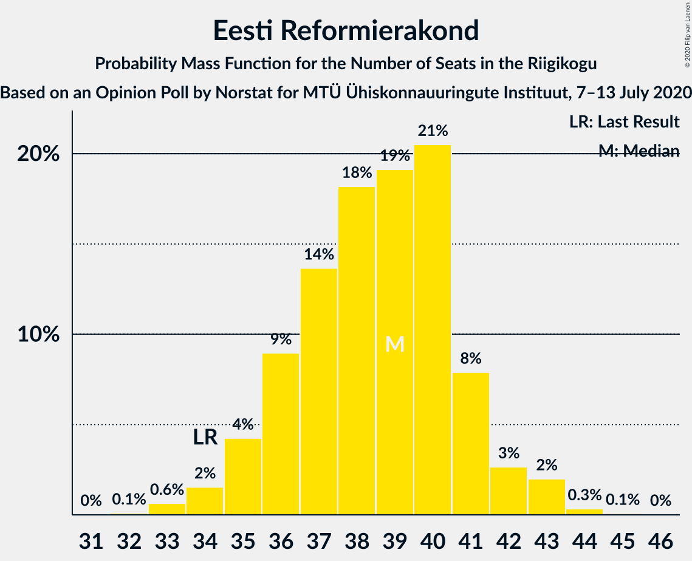
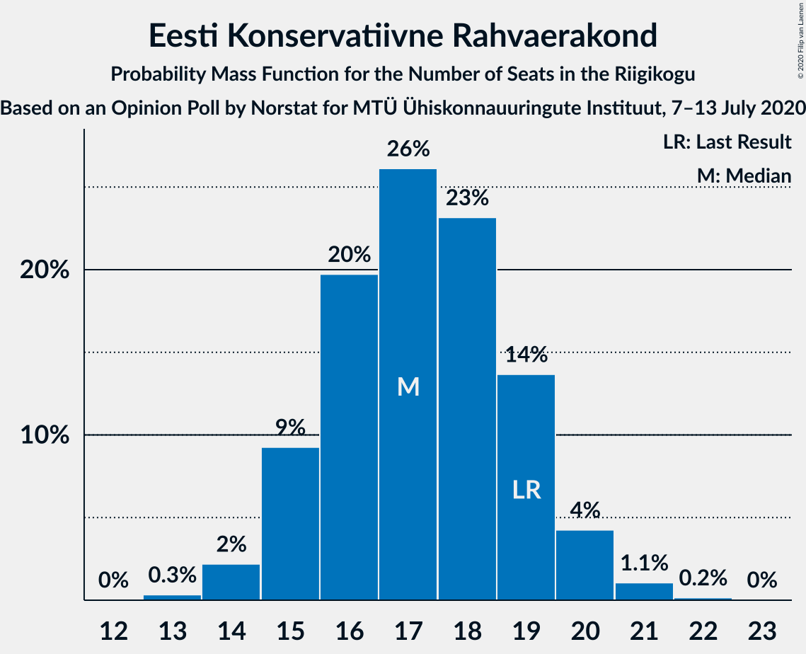
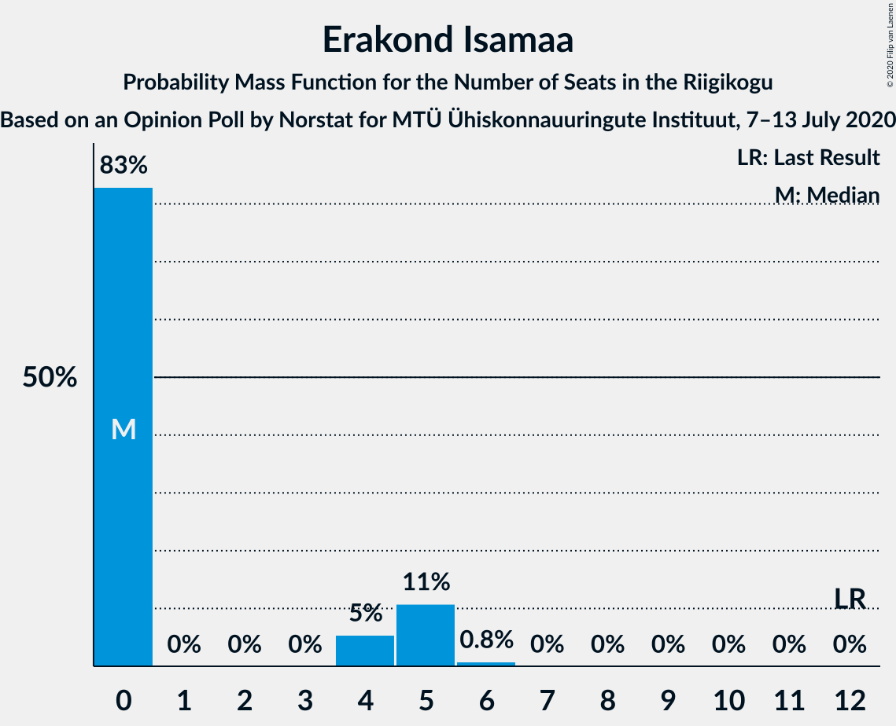
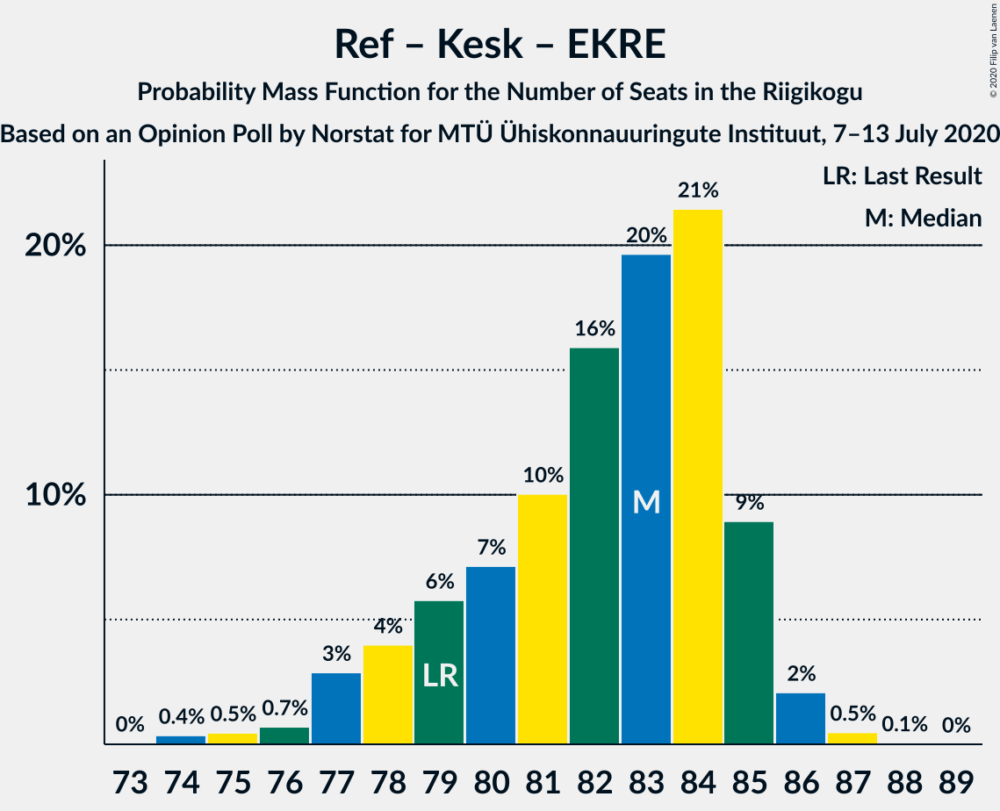
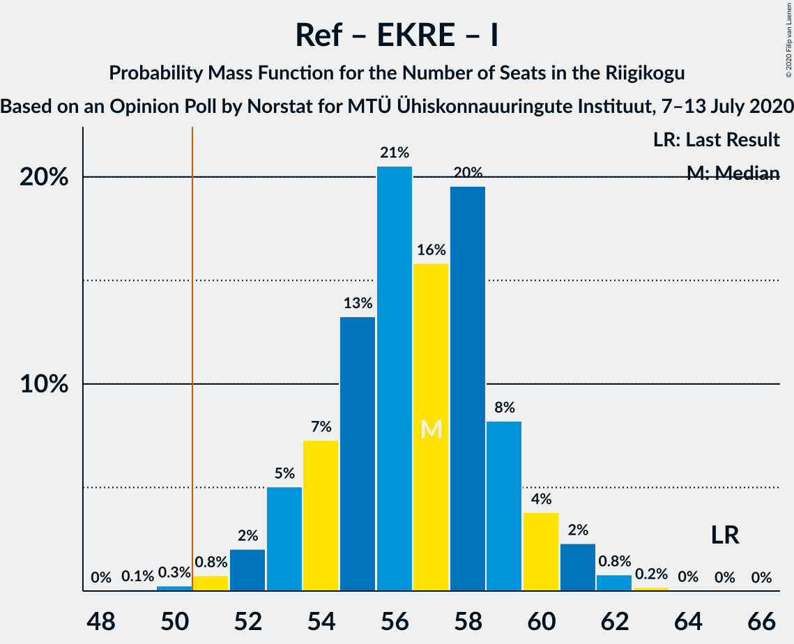
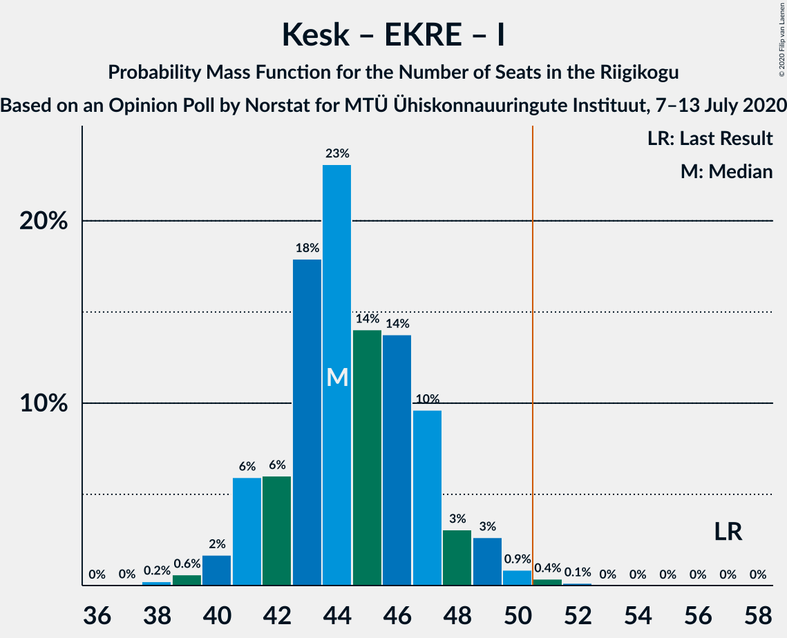
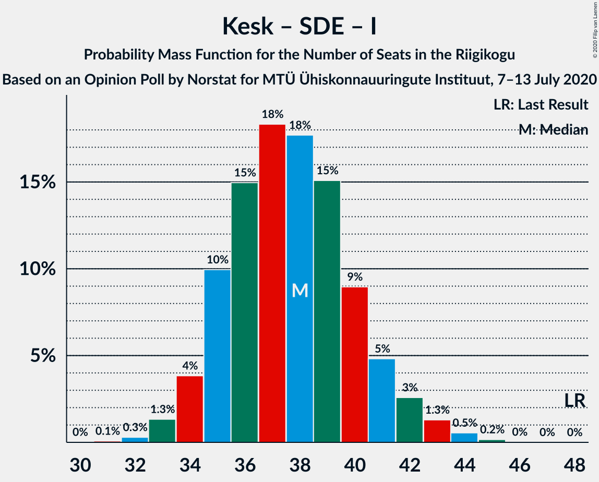

# Opinion Poll by Norstat for MTÜ Ühiskonnauuringute Instituut, 7–13 July 2020

<a href="#voting-intentions">Voting Intentions</a> | <a href="#seats">Seats</a> | <a href="#coalitions">Coalitions</a> | <a href="#technical-information">Technical Information</a>

## Voting Intentions

### Confidence Intervals

| Party | Last Result | Poll Result | 80% Confidence Interval | 90% Confidence Interval | 95% Confidence Interval | 99% Confidence Interval |
|:-----:|:-----------:|:-----------:|:-----------------------:|:-----------------------:|:-----------------------:|:-----------------------:|
| Eesti Reformierakond | 28.9% | 32.3% | 30.4–34.2% |29.9–34.8% |29.5–35.3% |28.6–36.2% |
| Eesti Keskerakond | 23.1% | 23.2% | 21.6–25.0% |21.1–25.5% |20.7–25.9% |19.9–26.8% |
| Eesti Konservatiivne Rahvaerakond | 17.8% | 15.8% | 14.4–17.4% |14.0–17.8% |13.7–18.2% |13.0–19.0% |
| Sotsiaaldemokraatlik Erakond | 9.8% | 10.2% | 9.1–11.5% |8.7–11.9% |8.5–12.2% |8.0–12.9% |
| Eesti 200 | 4.4% | 7.5% | 6.5–8.7% |6.2–9.0% |6.0–9.3% |5.6–9.9% |
| Erakond Isamaa | 11.4% | 4.4% | 3.7–5.3% |3.5–5.6% |3.3–5.9% |3.0–6.4% |
| Erakond Eestimaa Rohelised | 1.8% | 2.2% | 1.7–2.9% |1.6–3.1% |1.4–3.3% |1.2–3.7% |
| Eesti Vabaerakond | 1.2% | 0.4% | 0.2–0.8% |0.2–0.9% |0.2–1.0% |0.1–1.3% |

*Note:* The poll result column reflects the actual value used in the calculations. Published results may vary slightly, and in addition be rounded to fewer digits.

## Seats

### Confidence Intervals

| Party | Last Result | Median | 80% Confidence Interval | 90% Confidence Interval | 95% Confidence Interval | 99% Confidence Interval |
|:-----:|:-----------:|:------:|:-----------------------:|:-----------------------:|:-----------------------:|:-----------------------:|
| <a href="#eesti-reformierakond">Eesti Reformierakond</a> | 34 | 40 | 37–41 |36–42 |35–43 |34–43 |
| <a href="#eesti-keskerakond">Eesti Keskerakond</a> | 26 | 26 | 25–28 |24–28 |23–29 |22–31 |
| <a href="#eesti-konservatiivne-rahvaerakond">Eesti Konservatiivne Rahvaerakond</a> | 19 | 17 | 16–19 |15–19 |15–20 |14–21 |
| <a href="#sotsiaaldemokraatlik-erakond">Sotsiaaldemokraatlik Erakond</a> | 10 | 11 | 9–11 |9–12 |8–12 |8–13 |
| <a href="#eesti-200">Eesti 200</a> | 0 | 7 | 6–8 |6–9 |6–9 |5–10 |
| <a href="#erakond-isamaa">Erakond Isamaa</a> | 12 | 0 | 0 |0–4 |0–5 |0–5 |
| <a href="#erakond-eestimaa-rohelised">Erakond Eestimaa Rohelised</a> | 0 | 0 | 0 |0 |0 |0 |
| <a href="#eesti-vabaerakond">Eesti Vabaerakond</a> | 0 | 0 | 0 |0 |0 |0 |

### Eesti Reformierakond

*For a full overview of the results for this party, see the [Eesti Reformierakond](party-eestireformierakond.html) page.*

| Number of Seats | Probability | Accumulated | Special Marks |
|:---------------:|:-----------:|:-----------:|:-------------:|
| 32 | 0% | 100% |  |
| 33 | 0.3% | 99.9% |  |
| 34 | 0.5% | 99.7% | Last Result |
| 35 | 2% | 99.1% |  |
| 36 | 4% | 97% |  |
| 37 | 7% | 92% |  |
| 38 | 22% | 85% |  |
| 39 | 12% | 63% |  |
| 40 | 37% | 51% | Median |
| 41 | 5% | 13% |  |
| 42 | 4% | 8% |  |
| 43 | 4% | 4% |  |
| 44 | 0.2% | 0.3% |  |
| 45 | 0% | 0.1% |  |
| 46 | 0% | 0% |  |

### Eesti Keskerakond

*For a full overview of the results for this party, see the [Eesti Keskerakond](party-eestikeskerakond.html) page.*

| Number of Seats | Probability | Accumulated | Special Marks |
|:---------------:|:-----------:|:-----------:|:-------------:|
| 21 | 0.1% | 100% |  |
| 22 | 0.6% | 99.9% |  |
| 23 | 4% | 99.3% |  |
| 24 | 5% | 96% |  |
| 25 | 15% | 91% |  |
| 26 | 43% | 76% | Last Result, Median |
| 27 | 10% | 33% |  |
| 28 | 19% | 23% |  |
| 29 | 2% | 4% |  |
| 30 | 0.9% | 2% |  |
| 31 | 0.8% | 1.1% |  |
| 32 | 0.3% | 0.3% |  |
| 33 | 0% | 0% |  |

### Eesti Konservatiivne Rahvaerakond

*For a full overview of the results for this party, see the [Eesti Konservatiivne Rahvaerakond](party-eestikonservatiivnerahvaerakond.html) page.*

| Number of Seats | Probability | Accumulated | Special Marks |
|:---------------:|:-----------:|:-----------:|:-------------:|
| 13 | 0.1% | 100% |  |
| 14 | 2% | 99.8% |  |
| 15 | 6% | 98% |  |
| 16 | 12% | 92% |  |
| 17 | 47% | 80% | Median |
| 18 | 9% | 33% |  |
| 19 | 19% | 24% | Last Result |
| 20 | 3% | 5% |  |
| 21 | 1.4% | 2% |  |
| 22 | 0.1% | 0.1% |  |
| 23 | 0% | 0% |  |

### Sotsiaaldemokraatlik Erakond

*For a full overview of the results for this party, see the [Sotsiaaldemokraatlik Erakond](party-sotsiaaldemokraatlikerakond.html) page.*

| Number of Seats | Probability | Accumulated | Special Marks |
|:---------------:|:-----------:|:-----------:|:-------------:|
| 7 | 0.2% | 100% |  |
| 8 | 4% | 99.7% |  |
| 9 | 21% | 96% |  |
| 10 | 18% | 75% | Last Result |
| 11 | 48% | 57% | Median |
| 12 | 7% | 9% |  |
| 13 | 2% | 2% |  |
| 14 | 0.1% | 0.1% |  |
| 15 | 0% | 0% |  |

### Eesti 200

*For a full overview of the results for this party, see the [Eesti 200](party-eesti200.html) page.*

| Number of Seats | Probability | Accumulated | Special Marks |
|:---------------:|:-----------:|:-----------:|:-------------:|
| 0 | 0% | 100% | Last Result |
| 1 | 0% | 100% |  |
| 2 | 0% | 100% |  |
| 3 | 0% | 100% |  |
| 4 | 0% | 100% |  |
| 5 | 2% | 100% |  |
| 6 | 10% | 98% |  |
| 7 | 53% | 89% | Median |
| 8 | 27% | 36% |  |
| 9 | 7% | 9% |  |
| 10 | 1.4% | 1.5% |  |
| 11 | 0.1% | 0.1% |  |
| 12 | 0% | 0% |  |

### Erakond Isamaa

*For a full overview of the results for this party, see the [Erakond Isamaa](party-erakondisamaa.html) page.*

| Number of Seats | Probability | Accumulated | Special Marks |
|:---------------:|:-----------:|:-----------:|:-------------:|
| 0 | 94% | 100% | Median |
| 1 | 0% | 6% |  |
| 2 | 0% | 6% |  |
| 3 | 0% | 6% |  |
| 4 | 2% | 6% |  |
| 5 | 4% | 4% |  |
| 6 | 0.2% | 0.3% |  |
| 7 | 0% | 0% |  |
| 8 | 0% | 0% |  |
| 9 | 0% | 0% |  |
| 10 | 0% | 0% |  |
| 11 | 0% | 0% |  |
| 12 | 0% | 0% | Last Result |

### Erakond Eestimaa Rohelised

*For a full overview of the results for this party, see the [Erakond Eestimaa Rohelised](party-erakondeestimaarohelised.html) page.*

| Number of Seats | Probability | Accumulated | Special Marks |
|:---------------:|:-----------:|:-----------:|:-------------:|
| 0 | 100% | 100% | Last Result, Median |

### Eesti Vabaerakond

*For a full overview of the results for this party, see the [Eesti Vabaerakond](party-eestivabaerakond.html) page.*

| Number of Seats | Probability | Accumulated | Special Marks |
|:---------------:|:-----------:|:-----------:|:-------------:|
| 0 | 100% | 100% | Last Result, Median |

## Coalitions

### Confidence Intervals

| Coalition | Last Result | Median | Majority? | 80% Confidence Interval | 90% Confidence Interval | 95% Confidence Interval | 99% Confidence Interval |
|:---------:|:-----------:|:------:|:---------:|:-----------------------:|:-----------------------:|:-----------------------:|:-----------------------:|
| Eesti Reformierakond – Eesti Keskerakond – Eesti Konservatiivne Rahvaerakond | 79 | 83 | 100% | 80–84 | 79–85 | 78–86 | 76–87 |
| Eesti Reformierakond – Eesti Keskerakond | 60 | 66 | 100% | 63–68 | 62–68 | 61–69 | 59–71 |
| Eesti Reformierakond – Eesti Konservatiivne Rahvaerakond – Erakond Isamaa | 65 | 57 | 99.7% | 55–59 | 53–59 | 53–61 | 51–62 |
| Eesti Reformierakond – Eesti Konservatiivne Rahvaerakond | 53 | 57 | 99.2% | 54–59 | 53–59 | 52–59 | 50–61 |
| Eesti Reformierakond – Sotsiaaldemokraatlik Erakond – Erakond Isamaa – Eesti Vabaerakond | 56 | 50 | 43% | 48–52 | 46–53 | 46–53 | 45–55 |
| Eesti Reformierakond – Sotsiaaldemokraatlik Erakond – Erakond Isamaa | 56 | 50 | 43% | 48–52 | 46–53 | 46–53 | 45–55 |
| Eesti Reformierakond – Sotsiaaldemokraatlik Erakond | 44 | 49 | 38% | 47–51 | 46–53 | 45–53 | 44–54 |
| Eesti Keskerakond – Eesti Konservatiivne Rahvaerakond – Erakond Isamaa | 57 | 44 | 0.2% | 42–46 | 41–47 | 41–48 | 39–49 |
| Eesti Keskerakond – Eesti Konservatiivne Rahvaerakond | 45 | 43 | 0% | 41–45 | 41–47 | 40–47 | 38–48 |
| Eesti Reformierakond – Erakond Isamaa | 46 | 40 | 0% | 37–42 | 37–43 | 36–43 | 35–44 |
| Eesti Keskerakond – Sotsiaaldemokraatlik Erakond – Erakond Isamaa | 48 | 37 | 0% | 35–39 | 34–39 | 34–42 | 33–43 |
| Eesti Keskerakond – Sotsiaaldemokraatlik Erakond | 36 | 37 | 0% | 34–39 | 34–39 | 33–39 | 32–42 |
| Eesti Konservatiivne Rahvaerakond – Sotsiaaldemokraatlik Erakond | 29 | 28 | 0% | 26–30 | 25–31 | 25–31 | 24–32 |

### Eesti Reformierakond – Eesti Keskerakond – Eesti Konservatiivne Rahvaerakond

| Number of Seats | Probability | Accumulated | Special Marks |
|:---------------:|:-----------:|:-----------:|:-------------:|
| 73 | 0% | 100% |  |
| 74 | 0.1% | 99.9% |  |
| 75 | 0% | 99.9% |  |
| 76 | 0.7% | 99.9% |  |
| 77 | 2% | 99.2% |  |
| 78 | 2% | 98% |  |
| 79 | 4% | 95% | Last Result |
| 80 | 5% | 91% |  |
| 81 | 3% | 86% |  |
| 82 | 6% | 83% |  |
| 83 | 49% | 78% | Median |
| 84 | 20% | 28% |  |
| 85 | 6% | 9% |  |
| 86 | 2% | 3% |  |
| 87 | 1.2% | 1.2% |  |
| 88 | 0% | 0% |  |

### Eesti Reformierakond – Eesti Keskerakond

| Number of Seats | Probability | Accumulated | Special Marks |
|:---------------:|:-----------:|:-----------:|:-------------:|
| 57 | 0.1% | 100% |  |
| 58 | 0.1% | 99.9% |  |
| 59 | 0.7% | 99.8% |  |
| 60 | 2% | 99.1% | Last Result |
| 61 | 1.3% | 98% |  |
| 62 | 5% | 96% |  |
| 63 | 9% | 91% |  |
| 64 | 5% | 82% |  |
| 65 | 16% | 78% |  |
| 66 | 45% | 62% | Median |
| 67 | 5% | 16% |  |
| 68 | 7% | 11% |  |
| 69 | 4% | 4% |  |
| 70 | 0.1% | 0.7% |  |
| 71 | 0.5% | 0.6% |  |
| 72 | 0% | 0% |  |

### Eesti Reformierakond – Eesti Konservatiivne Rahvaerakond – Erakond Isamaa

| Number of Seats | Probability | Accumulated | Special Marks |
|:---------------:|:-----------:|:-----------:|:-------------:|
| 49 | 0.1% | 100% |  |
| 50 | 0.2% | 99.9% |  |
| 51 | 0.3% | 99.7% | Majority |
| 52 | 1.3% | 99.4% |  |
| 53 | 4% | 98% |  |
| 54 | 3% | 95% |  |
| 55 | 19% | 92% |  |
| 56 | 9% | 72% |  |
| 57 | 34% | 63% | Median |
| 58 | 12% | 30% |  |
| 59 | 13% | 18% |  |
| 60 | 1.5% | 5% |  |
| 61 | 2% | 3% |  |
| 62 | 0.8% | 0.9% |  |
| 63 | 0.1% | 0.2% |  |
| 64 | 0% | 0% |  |
| 65 | 0% | 0% | Last Result |

### Eesti Reformierakond – Eesti Konservatiivne Rahvaerakond

| Number of Seats | Probability | Accumulated | Special Marks |
|:---------------:|:-----------:|:-----------:|:-------------:|
| 48 | 0.1% | 100% |  |
| 49 | 0.3% | 99.9% |  |
| 50 | 0.4% | 99.7% |  |
| 51 | 1.4% | 99.2% | Majority |
| 52 | 1.4% | 98% |  |
| 53 | 5% | 96% | Last Result |
| 54 | 4% | 91% |  |
| 55 | 20% | 88% |  |
| 56 | 9% | 68% |  |
| 57 | 33% | 59% | Median |
| 58 | 10% | 26% |  |
| 59 | 13% | 16% |  |
| 60 | 0.4% | 2% |  |
| 61 | 2% | 2% |  |
| 62 | 0% | 0.1% |  |
| 63 | 0% | 0% |  |

### Eesti Reformierakond – Sotsiaaldemokraatlik Erakond – Erakond Isamaa – Eesti Vabaerakond

| Number of Seats | Probability | Accumulated | Special Marks |
|:---------------:|:-----------:|:-----------:|:-------------:|
| 43 | 0.1% | 100% |  |
| 44 | 0.3% | 99.9% |  |
| 45 | 2% | 99.6% |  |
| 46 | 4% | 98% |  |
| 47 | 4% | 94% |  |
| 48 | 12% | 90% |  |
| 49 | 24% | 78% |  |
| 50 | 11% | 54% |  |
| 51 | 30% | 43% | Median, Majority |
| 52 | 5% | 14% |  |
| 53 | 6% | 9% |  |
| 54 | 1.5% | 2% |  |
| 55 | 0.3% | 0.6% |  |
| 56 | 0.2% | 0.3% | Last Result |
| 57 | 0.1% | 0.1% |  |
| 58 | 0% | 0% |  |

### Eesti Reformierakond – Sotsiaaldemokraatlik Erakond – Erakond Isamaa

| Number of Seats | Probability | Accumulated | Special Marks |
|:---------------:|:-----------:|:-----------:|:-------------:|
| 43 | 0.1% | 100% |  |
| 44 | 0.3% | 99.9% |  |
| 45 | 2% | 99.6% |  |
| 46 | 4% | 98% |  |
| 47 | 4% | 94% |  |
| 48 | 12% | 90% |  |
| 49 | 24% | 78% |  |
| 50 | 11% | 54% |  |
| 51 | 30% | 43% | Median, Majority |
| 52 | 5% | 14% |  |
| 53 | 6% | 9% |  |
| 54 | 1.5% | 2% |  |
| 55 | 0.3% | 0.6% |  |
| 56 | 0.2% | 0.3% | Last Result |
| 57 | 0.1% | 0.1% |  |
| 58 | 0% | 0% |  |

### Eesti Reformierakond – Sotsiaaldemokraatlik Erakond

| Number of Seats | Probability | Accumulated | Special Marks |
|:---------------:|:-----------:|:-----------:|:-------------:|
| 42 | 0.1% | 100% |  |
| 43 | 0.2% | 99.9% |  |
| 44 | 0.7% | 99.7% | Last Result |
| 45 | 3% | 99.0% |  |
| 46 | 4% | 96% |  |
| 47 | 6% | 92% |  |
| 48 | 13% | 86% |  |
| 49 | 25% | 74% |  |
| 50 | 10% | 48% |  |
| 51 | 28% | 38% | Median, Majority |
| 52 | 4% | 10% |  |
| 53 | 5% | 6% |  |
| 54 | 1.0% | 1.3% |  |
| 55 | 0.2% | 0.3% |  |
| 56 | 0% | 0.1% |  |
| 57 | 0% | 0% |  |

### Eesti Keskerakond – Eesti Konservatiivne Rahvaerakond – Erakond Isamaa

| Number of Seats | Probability | Accumulated | Special Marks |
|:---------------:|:-----------:|:-----------:|:-------------:|
| 38 | 0.3% | 100% |  |
| 39 | 0.4% | 99.7% |  |
| 40 | 1.5% | 99.2% |  |
| 41 | 5% | 98% |  |
| 42 | 9% | 93% |  |
| 43 | 30% | 83% | Median |
| 44 | 14% | 53% |  |
| 45 | 28% | 39% |  |
| 46 | 3% | 11% |  |
| 47 | 5% | 8% |  |
| 48 | 2% | 3% |  |
| 49 | 1.0% | 1.4% |  |
| 50 | 0.2% | 0.4% |  |
| 51 | 0.1% | 0.2% | Majority |
| 52 | 0% | 0.1% |  |
| 53 | 0% | 0% |  |
| 54 | 0% | 0% |  |
| 55 | 0% | 0% |  |
| 56 | 0% | 0% |  |
| 57 | 0% | 0% | Last Result |

### Eesti Keskerakond – Eesti Konservatiivne Rahvaerakond

| Number of Seats | Probability | Accumulated | Special Marks |
|:---------------:|:-----------:|:-----------:|:-------------:|
| 37 | 0.1% | 100% |  |
| 38 | 0.5% | 99.9% |  |
| 39 | 1.3% | 99.4% |  |
| 40 | 2% | 98% |  |
| 41 | 7% | 96% |  |
| 42 | 11% | 89% |  |
| 43 | 30% | 78% | Median |
| 44 | 15% | 49% |  |
| 45 | 26% | 34% | Last Result |
| 46 | 2% | 8% |  |
| 47 | 4% | 5% |  |
| 48 | 1.3% | 2% |  |
| 49 | 0.1% | 0.3% |  |
| 50 | 0.1% | 0.1% |  |
| 51 | 0% | 0% | Majority |

### Eesti Reformierakond – Erakond Isamaa

| Number of Seats | Probability | Accumulated | Special Marks |
|:---------------:|:-----------:|:-----------:|:-------------:|
| 33 | 0.1% | 100% |  |
| 34 | 0.3% | 99.9% |  |
| 35 | 2% | 99.6% |  |
| 36 | 3% | 98% |  |
| 37 | 6% | 95% |  |
| 38 | 22% | 89% |  |
| 39 | 11% | 67% |  |
| 40 | 39% | 56% | Median |
| 41 | 6% | 17% |  |
| 42 | 4% | 11% |  |
| 43 | 5% | 7% |  |
| 44 | 1.1% | 2% |  |
| 45 | 0.2% | 0.5% |  |
| 46 | 0.1% | 0.2% | Last Result |
| 47 | 0.1% | 0.1% |  |
| 48 | 0% | 0% |  |

### Eesti Keskerakond – Sotsiaaldemokraatlik Erakond – Erakond Isamaa

| Number of Seats | Probability | Accumulated | Special Marks |
|:---------------:|:-----------:|:-----------:|:-------------:|
| 32 | 0.1% | 100% |  |
| 33 | 1.5% | 99.9% |  |
| 34 | 8% | 98% |  |
| 35 | 12% | 90% |  |
| 36 | 14% | 79% |  |
| 37 | 38% | 65% | Median |
| 38 | 5% | 27% |  |
| 39 | 17% | 22% |  |
| 40 | 0.8% | 4% |  |
| 41 | 0.5% | 4% |  |
| 42 | 1.4% | 3% |  |
| 43 | 1.2% | 2% |  |
| 44 | 0.3% | 0.5% |  |
| 45 | 0.2% | 0.2% |  |
| 46 | 0% | 0% |  |
| 47 | 0% | 0% |  |
| 48 | 0% | 0% | Last Result |

### Eesti Keskerakond – Sotsiaaldemokraatlik Erakond

| Number of Seats | Probability | Accumulated | Special Marks |
|:---------------:|:-----------:|:-----------:|:-------------:|
| 31 | 0.1% | 100% |  |
| 32 | 0.8% | 99.8% |  |
| 33 | 2% | 99.0% |  |
| 34 | 10% | 97% |  |
| 35 | 13% | 87% |  |
| 36 | 14% | 74% | Last Result |
| 37 | 38% | 61% | Median |
| 38 | 4% | 23% |  |
| 39 | 16% | 18% |  |
| 40 | 0.5% | 2% |  |
| 41 | 0.5% | 2% |  |
| 42 | 1.1% | 1.3% |  |
| 43 | 0.2% | 0.2% |  |
| 44 | 0.1% | 0.1% |  |
| 45 | 0% | 0% |  |

### Eesti Konservatiivne Rahvaerakond – Sotsiaaldemokraatlik Erakond

| Number of Seats | Probability | Accumulated | Special Marks |
|:---------------:|:-----------:|:-----------:|:-------------:|
| 22 | 0% | 100% |  |
| 23 | 0.3% | 99.9% |  |
| 24 | 2% | 99.6% |  |
| 25 | 7% | 98% |  |
| 26 | 13% | 91% |  |
| 27 | 7% | 78% |  |
| 28 | 55% | 71% | Median |
| 29 | 5% | 16% | Last Result |
| 30 | 5% | 11% |  |
| 31 | 5% | 6% |  |
| 32 | 0.5% | 0.7% |  |
| 33 | 0.2% | 0.2% |  |
| 34 | 0% | 0% |  |

## Technical Information

### Opinion Poll

+ **Polling firm:** Norstat
+ **Commissioner(s):** MTÜ Ühiskonnauuringute Instituut
+ **Fieldwork period:** 7–13 July 2020

### Calculations

+ **Sample size:** 1000
+ **Simulations done:** 131,072
+ **Error estimate:** 1.39%

