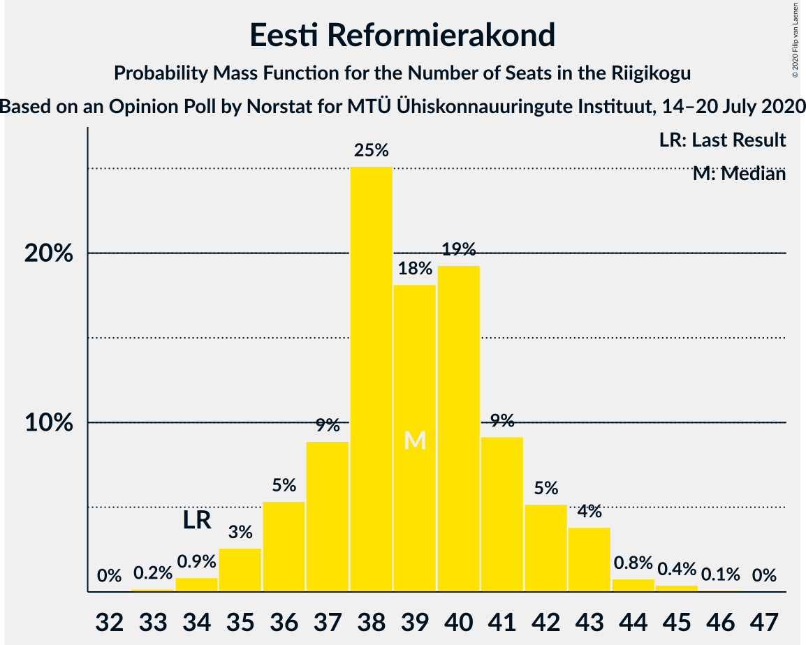
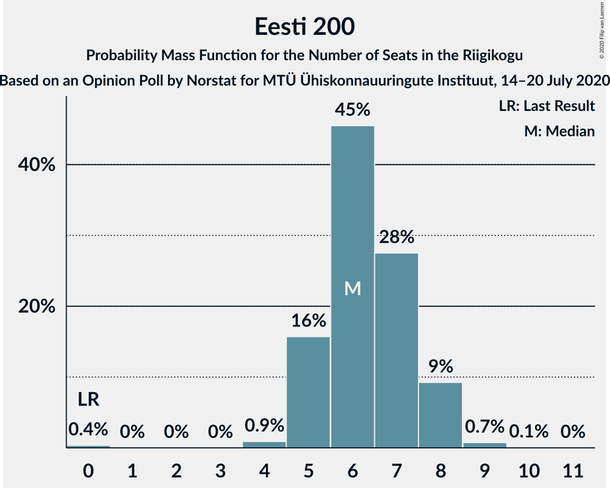
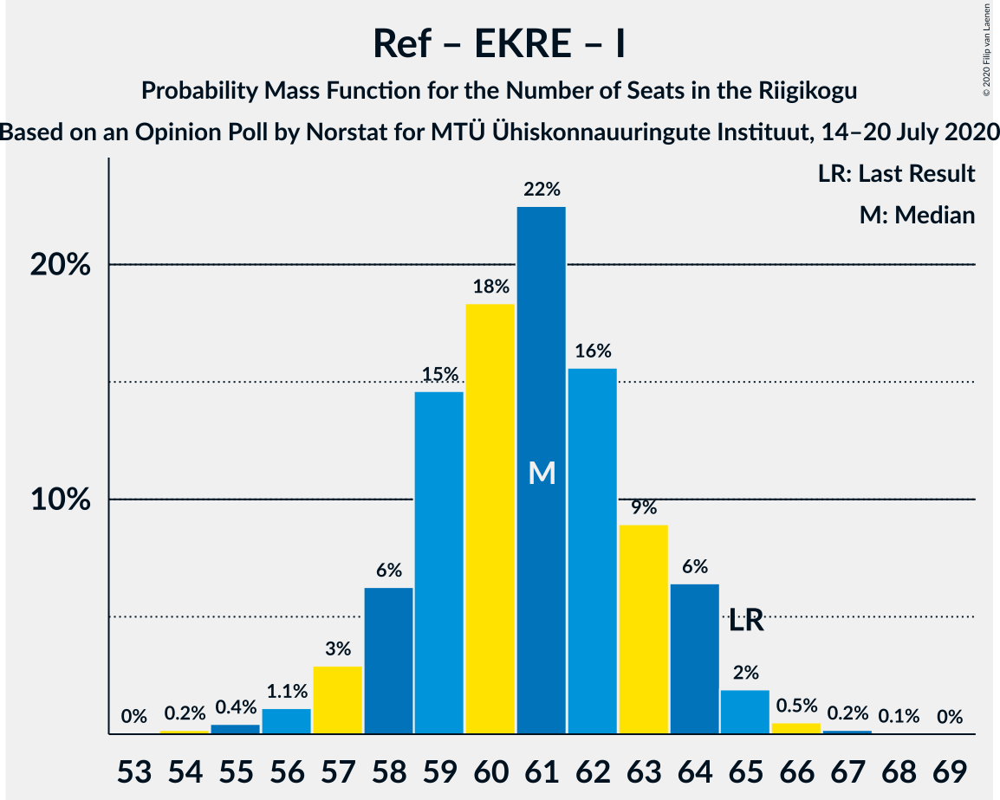

# Opinion Poll by Norstat for MTÜ Ühiskonnauuringute Instituut, 14–20 July 2020

<a href="#voting-intentions">Voting Intentions</a> | <a href="#seats">Seats</a> | <a href="#coalitions">Coalitions</a> | <a href="#technical-information">Technical Information</a>

## Voting Intentions

### Confidence Intervals

| Party | Last Result | Poll Result | 80% Confidence Interval | 90% Confidence Interval | 95% Confidence Interval | 99% Confidence Interval |
|:-----:|:-----------:|:-----------:|:-----------------------:|:-----------------------:|:-----------------------:|:-----------------------:|
| Eesti Reformierakond | 28.9% | 34.0% | 32.1–36.0% |31.6–36.5% |31.1–37.0% |30.2–38.0% |
| Eesti Keskerakond | 23.1% | 23.5% | 21.8–25.3% |21.4–25.8% |21.0–26.2% |20.2–27.1% |
| Eesti Konservatiivne Rahvaerakond | 17.8% | 16.8% | 15.4–18.4% |15.0–18.9% |14.6–19.3% |13.9–20.0% |
| Sotsiaaldemokraatlik Erakond | 9.8% | 8.7% | 7.7–10.0% |7.3–10.3% |7.1–10.6% |6.6–11.2% |
| Eesti 200 | 4.4% | 6.9% | 6.0–8.0% |5.7–8.4% |5.5–8.6% |5.1–9.2% |
| Erakond Isamaa | 11.4% | 5.6% | 4.8–6.6% |4.5–7.0% |4.3–7.2% |4.0–7.7% |
| Erakond Eestimaa Rohelised | 1.8% | 2.3% | 1.8–3.0% |1.6–3.2% |1.5–3.4% |1.3–3.8% |
| Eesti Vabaerakond | 1.2% | 0.3% | 0.2–0.7% |0.1–0.8% |0.1–0.9% |0.1–1.1% |

*Note:* The poll result column reflects the actual value used in the calculations. Published results may vary slightly, and in addition be rounded to fewer digits.

## Seats

### Confidence Intervals

| Party | Last Result | Median | 80% Confidence Interval | 90% Confidence Interval | 95% Confidence Interval | 99% Confidence Interval |
|:-----:|:-----------:|:------:|:-----------------------:|:-----------------------:|:-----------------------:|:-----------------------:|
| <a href="#eesti-reformierakond">Eesti Reformierakond</a> | 34 | 39 | 37–42 |36–43 |35–43 |34–45 |
| <a href="#eesti-keskerakond">Eesti Keskerakond</a> | 26 | 26 | 24–28 |23–28 |22–29 |21–30 |
| <a href="#eesti-konservatiivne-rahvaerakond">Eesti Konservatiivne Rahvaerakond</a> | 19 | 17 | 16–19 |15–20 |15–21 |14–22 |
| <a href="#sotsiaaldemokraatlik-erakond">Sotsiaaldemokraatlik Erakond</a> | 10 | 8 | 7–10 |7–10 |6–10 |6–11 |
| <a href="#eesti-200">Eesti 200</a> | 0 | 6 | 5–8 |5–8 |5–8 |4–9 |
| <a href="#erakond-isamaa">Erakond Isamaa</a> | 12 | 5 | 0–6 |0–6 |0–7 |0–7 |
| <a href="#erakond-eestimaa-rohelised">Erakond Eestimaa Rohelised</a> | 0 | 0 | 0 |0 |0 |0 |
| <a href="#eesti-vabaerakond">Eesti Vabaerakond</a> | 0 | 0 | 0 |0 |0 |0 |

### Eesti Reformierakond

*For a full overview of the results for this party, see the [Eesti Reformierakond](party-eestireformierakond.html) page.*

| Number of Seats | Probability | Accumulated | Special Marks |
|:---------------:|:-----------:|:-----------:|:-------------:|
| 33 | 0.2% | 100% |  |
| 34 | 0.9% | 99.8% | Last Result |
| 35 | 3% | 98.9% |  |
| 36 | 5% | 96% |  |
| 37 | 9% | 91% |  |
| 38 | 25% | 82% |  |
| 39 | 18% | 57% | Median |
| 40 | 19% | 39% |  |
| 41 | 9% | 20% |  |
| 42 | 5% | 10% |  |
| 43 | 4% | 5% |  |
| 44 | 0.8% | 1.3% |  |
| 45 | 0.4% | 0.5% |  |
| 46 | 0.1% | 0.1% |  |
| 47 | 0% | 0% |  |

### Eesti Keskerakond

*For a full overview of the results for this party, see the [Eesti Keskerakond](party-eestikeskerakond.html) page.*

| Number of Seats | Probability | Accumulated | Special Marks |
|:---------------:|:-----------:|:-----------:|:-------------:|
| 20 | 0.1% | 100% |  |
| 21 | 0.5% | 99.9% |  |
| 22 | 2% | 99.5% |  |
| 23 | 7% | 97% |  |
| 24 | 14% | 90% |  |
| 25 | 17% | 76% |  |
| 26 | 28% | 59% | Last Result, Median |
| 27 | 19% | 31% |  |
| 28 | 8% | 12% |  |
| 29 | 4% | 5% |  |
| 30 | 0.8% | 1.2% |  |
| 31 | 0.3% | 0.4% |  |
| 32 | 0.1% | 0.1% |  |
| 33 | 0% | 0% |  |

### Eesti Konservatiivne Rahvaerakond

*For a full overview of the results for this party, see the [Eesti Konservatiivne Rahvaerakond](party-eestikonservatiivnerahvaerakond.html) page.*

| Number of Seats | Probability | Accumulated | Special Marks |
|:---------------:|:-----------:|:-----------:|:-------------:|
| 13 | 0.1% | 100% |  |
| 14 | 0.9% | 99.9% |  |
| 15 | 6% | 99.0% |  |
| 16 | 15% | 93% |  |
| 17 | 30% | 78% | Median |
| 18 | 21% | 49% |  |
| 19 | 18% | 27% | Last Result |
| 20 | 7% | 10% |  |
| 21 | 2% | 3% |  |
| 22 | 0.7% | 0.7% |  |
| 23 | 0.1% | 0.1% |  |
| 24 | 0% | 0% |  |

### Sotsiaaldemokraatlik Erakond

*For a full overview of the results for this party, see the [Sotsiaaldemokraatlik Erakond](party-sotsiaaldemokraatlikerakond.html) page.*

| Number of Seats | Probability | Accumulated | Special Marks |
|:---------------:|:-----------:|:-----------:|:-------------:|
| 5 | 0.1% | 100% |  |
| 6 | 3% | 99.9% |  |
| 7 | 17% | 97% |  |
| 8 | 47% | 80% | Median |
| 9 | 23% | 33% |  |
| 10 | 9% | 10% | Last Result |
| 11 | 2% | 2% |  |
| 12 | 0.2% | 0.2% |  |
| 13 | 0% | 0% |  |

### Eesti 200

*For a full overview of the results for this party, see the [Eesti 200](party-eesti200.html) page.*

| Number of Seats | Probability | Accumulated | Special Marks |
|:---------------:|:-----------:|:-----------:|:-------------:|
| 0 | 0.4% | 100% | Last Result |
| 1 | 0% | 99.6% |  |
| 2 | 0% | 99.6% |  |
| 3 | 0% | 99.6% |  |
| 4 | 0.9% | 99.6% |  |
| 5 | 16% | 98.7% |  |
| 6 | 45% | 83% | Median |
| 7 | 28% | 38% |  |
| 8 | 9% | 10% |  |
| 9 | 0.7% | 0.8% |  |
| 10 | 0.1% | 0.1% |  |
| 11 | 0% | 0% |  |

### Erakond Isamaa

*For a full overview of the results for this party, see the [Erakond Isamaa](party-erakondisamaa.html) page.*

| Number of Seats | Probability | Accumulated | Special Marks |
|:---------------:|:-----------:|:-----------:|:-------------:|
| 0 | 18% | 100% |  |
| 1 | 0% | 82% |  |
| 2 | 0% | 82% |  |
| 3 | 0% | 82% |  |
| 4 | 16% | 82% |  |
| 5 | 45% | 66% | Median |
| 6 | 19% | 21% |  |
| 7 | 2% | 3% |  |
| 8 | 0.1% | 0.1% |  |
| 9 | 0% | 0% |  |
| 10 | 0% | 0% |  |
| 11 | 0% | 0% |  |
| 12 | 0% | 0% | Last Result |

### Erakond Eestimaa Rohelised

*For a full overview of the results for this party, see the [Erakond Eestimaa Rohelised](party-erakondeestimaarohelised.html) page.*

| Number of Seats | Probability | Accumulated | Special Marks |
|:---------------:|:-----------:|:-----------:|:-------------:|
| 0 | 100% | 100% | Last Result, Median |

### Eesti Vabaerakond

*For a full overview of the results for this party, see the [Eesti Vabaerakond](party-eestivabaerakond.html) page.*

| Number of Seats | Probability | Accumulated | Special Marks |
|:---------------:|:-----------:|:-----------:|:-------------:|
| 0 | 100% | 100% | Last Result, Median |

## Coalitions

### Confidence Intervals

| Coalition | Last Result | Median | Majority? | 80% Confidence Interval | 90% Confidence Interval | 95% Confidence Interval | 99% Confidence Interval |
|:---------:|:-----------:|:------:|:---------:|:-----------------------:|:-----------------------:|:-----------------------:|:-----------------------:|
| Eesti Reformierakond – Eesti Keskerakond – Eesti Konservatiivne Rahvaerakond | 79 | 82 | 100% | 80–86 | 79–87 | 79–87 | 78–89 |
| Eesti Reformierakond – Eesti Keskerakond | 60 | 65 | 100% | 62–68 | 61–69 | 61–70 | 60–71 |
| Eesti Reformierakond – Eesti Konservatiivne Rahvaerakond – Erakond Isamaa | 65 | 61 | 100% | 58–63 | 58–64 | 57–65 | 55–66 |
| Eesti Reformierakond – Eesti Konservatiivne Rahvaerakond | 53 | 56 | 99.8% | 54–59 | 53–61 | 53–61 | 51–63 |
| Eesti Reformierakond – Sotsiaaldemokraatlik Erakond – Erakond Isamaa – Eesti Vabaerakond | 56 | 51 | 70% | 48–54 | 48–55 | 47–55 | 46–57 |
| Eesti Reformierakond – Sotsiaaldemokraatlik Erakond – Erakond Isamaa | 56 | 51 | 70% | 48–54 | 48–55 | 47–55 | 46–57 |
| Eesti Keskerakond – Eesti Konservatiivne Rahvaerakond – Erakond Isamaa | 57 | 47 | 7% | 45–50 | 44–51 | 43–52 | 41–53 |
| Eesti Reformierakond – Sotsiaaldemokraatlik Erakond | 44 | 47 | 6% | 45–50 | 44–51 | 43–51 | 42–53 |
| Eesti Keskerakond – Eesti Konservatiivne Rahvaerakond | 45 | 43 | 0.1% | 41–46 | 40–47 | 40–47 | 38–49 |
| Eesti Reformierakond – Erakond Isamaa | 46 | 43 | 0% | 40–46 | 39–47 | 39–47 | 37–49 |
| Eesti Keskerakond – Sotsiaaldemokraatlik Erakond – Erakond Isamaa | 48 | 38 | 0% | 35–41 | 34–41 | 33–42 | 32–43 |
| Eesti Keskerakond – Sotsiaaldemokraatlik Erakond | 36 | 34 | 0% | 32–36 | 31–37 | 30–38 | 29–39 |
| Eesti Konservatiivne Rahvaerakond – Sotsiaaldemokraatlik Erakond | 29 | 26 | 0% | 24–28 | 23–29 | 23–29 | 22–30 |

### Eesti Reformierakond – Eesti Keskerakond – Eesti Konservatiivne Rahvaerakond

| Number of Seats | Probability | Accumulated | Special Marks |
|:---------------:|:-----------:|:-----------:|:-------------:|
| 77 | 0.2% | 100% |  |
| 78 | 1.4% | 99.8% |  |
| 79 | 5% | 98% | Last Result |
| 80 | 11% | 94% |  |
| 81 | 19% | 82% |  |
| 82 | 26% | 63% | Median |
| 83 | 14% | 37% |  |
| 84 | 4% | 22% |  |
| 85 | 7% | 18% |  |
| 86 | 4% | 11% |  |
| 87 | 5% | 6% |  |
| 88 | 1.2% | 2% |  |
| 89 | 0.5% | 0.6% |  |
| 90 | 0.1% | 0.1% |  |
| 91 | 0% | 0.1% |  |
| 92 | 0% | 0% |  |

### Eesti Reformierakond – Eesti Keskerakond

| Number of Seats | Probability | Accumulated | Special Marks |
|:---------------:|:-----------:|:-----------:|:-------------:|
| 58 | 0.1% | 100% |  |
| 59 | 0.3% | 99.9% |  |
| 60 | 1.4% | 99.6% | Last Result |
| 61 | 4% | 98% |  |
| 62 | 9% | 94% |  |
| 63 | 13% | 86% |  |
| 64 | 18% | 72% |  |
| 65 | 21% | 54% | Median |
| 66 | 15% | 33% |  |
| 67 | 7% | 17% |  |
| 68 | 5% | 10% |  |
| 69 | 3% | 6% |  |
| 70 | 2% | 3% |  |
| 71 | 0.8% | 1.0% |  |
| 72 | 0.2% | 0.2% |  |
| 73 | 0% | 0.1% |  |
| 74 | 0% | 0% |  |

### Eesti Reformierakond – Eesti Konservatiivne Rahvaerakond – Erakond Isamaa

| Number of Seats | Probability | Accumulated | Special Marks |
|:---------------:|:-----------:|:-----------:|:-------------:|
| 53 | 0% | 100% |  |
| 54 | 0.2% | 99.9% |  |
| 55 | 0.4% | 99.8% |  |
| 56 | 1.1% | 99.3% |  |
| 57 | 3% | 98% |  |
| 58 | 6% | 95% |  |
| 59 | 15% | 89% |  |
| 60 | 18% | 74% |  |
| 61 | 22% | 56% | Median |
| 62 | 16% | 34% |  |
| 63 | 9% | 18% |  |
| 64 | 6% | 9% |  |
| 65 | 2% | 3% | Last Result |
| 66 | 0.5% | 0.7% |  |
| 67 | 0.2% | 0.2% |  |
| 68 | 0.1% | 0.1% |  |
| 69 | 0% | 0% |  |

### Eesti Reformierakond – Eesti Konservatiivne Rahvaerakond

| Number of Seats | Probability | Accumulated | Special Marks |
|:---------------:|:-----------:|:-----------:|:-------------:|
| 50 | 0.1% | 100% |  |
| 51 | 0.5% | 99.8% | Majority |
| 52 | 2% | 99.4% |  |
| 53 | 4% | 98% | Last Result |
| 54 | 10% | 94% |  |
| 55 | 17% | 84% |  |
| 56 | 17% | 67% | Median |
| 57 | 17% | 49% |  |
| 58 | 12% | 32% |  |
| 59 | 10% | 20% |  |
| 60 | 5% | 10% |  |
| 61 | 3% | 5% |  |
| 62 | 1.2% | 2% |  |
| 63 | 0.4% | 0.7% |  |
| 64 | 0.2% | 0.2% |  |
| 65 | 0% | 0.1% |  |
| 66 | 0% | 0% |  |

### Eesti Reformierakond – Sotsiaaldemokraatlik Erakond – Erakond Isamaa – Eesti Vabaerakond

| Number of Seats | Probability | Accumulated | Special Marks |
|:---------------:|:-----------:|:-----------:|:-------------:|
| 44 | 0.1% | 100% |  |
| 45 | 0.2% | 99.9% |  |
| 46 | 0.9% | 99.6% |  |
| 47 | 2% | 98.7% |  |
| 48 | 7% | 96% |  |
| 49 | 6% | 89% |  |
| 50 | 13% | 84% |  |
| 51 | 26% | 70% | Majority |
| 52 | 14% | 45% | Median |
| 53 | 16% | 31% |  |
| 54 | 7% | 15% |  |
| 55 | 5% | 7% |  |
| 56 | 1.3% | 2% | Last Result |
| 57 | 0.6% | 0.8% |  |
| 58 | 0.1% | 0.1% |  |
| 59 | 0% | 0% |  |

### Eesti Reformierakond – Sotsiaaldemokraatlik Erakond – Erakond Isamaa

| Number of Seats | Probability | Accumulated | Special Marks |
|:---------------:|:-----------:|:-----------:|:-------------:|
| 44 | 0.1% | 100% |  |
| 45 | 0.2% | 99.9% |  |
| 46 | 0.9% | 99.6% |  |
| 47 | 2% | 98.7% |  |
| 48 | 7% | 96% |  |
| 49 | 6% | 89% |  |
| 50 | 13% | 84% |  |
| 51 | 26% | 70% | Majority |
| 52 | 14% | 45% | Median |
| 53 | 16% | 31% |  |
| 54 | 7% | 15% |  |
| 55 | 5% | 7% |  |
| 56 | 1.3% | 2% | Last Result |
| 57 | 0.6% | 0.8% |  |
| 58 | 0.1% | 0.1% |  |
| 59 | 0% | 0% |  |

### Eesti Keskerakond – Eesti Konservatiivne Rahvaerakond – Erakond Isamaa

| Number of Seats | Probability | Accumulated | Special Marks |
|:---------------:|:-----------:|:-----------:|:-------------:|
| 40 | 0.1% | 100% |  |
| 41 | 0.5% | 99.9% |  |
| 42 | 0.8% | 99.4% |  |
| 43 | 2% | 98.6% |  |
| 44 | 5% | 97% |  |
| 45 | 8% | 92% |  |
| 46 | 14% | 83% |  |
| 47 | 21% | 70% |  |
| 48 | 14% | 49% | Median |
| 49 | 19% | 35% |  |
| 50 | 9% | 15% |  |
| 51 | 4% | 7% | Majority |
| 52 | 2% | 3% |  |
| 53 | 0.5% | 0.6% |  |
| 54 | 0.1% | 0.1% |  |
| 55 | 0% | 0% |  |
| 56 | 0% | 0% |  |
| 57 | 0% | 0% | Last Result |

### Eesti Reformierakond – Sotsiaaldemokraatlik Erakond

| Number of Seats | Probability | Accumulated | Special Marks |
|:---------------:|:-----------:|:-----------:|:-------------:|
| 41 | 0.1% | 100% |  |
| 42 | 0.6% | 99.8% |  |
| 43 | 2% | 99.2% |  |
| 44 | 5% | 97% | Last Result |
| 45 | 9% | 92% |  |
| 46 | 22% | 83% |  |
| 47 | 16% | 60% | Median |
| 48 | 20% | 44% |  |
| 49 | 9% | 23% |  |
| 50 | 8% | 15% |  |
| 51 | 4% | 6% | Majority |
| 52 | 1.3% | 2% |  |
| 53 | 0.5% | 0.9% |  |
| 54 | 0.2% | 0.3% |  |
| 55 | 0.1% | 0.1% |  |
| 56 | 0% | 0% |  |

### Eesti Keskerakond – Eesti Konservatiivne Rahvaerakond

| Number of Seats | Probability | Accumulated | Special Marks |
|:---------------:|:-----------:|:-----------:|:-------------:|
| 37 | 0.1% | 100% |  |
| 38 | 0.4% | 99.9% |  |
| 39 | 2% | 99.5% |  |
| 40 | 6% | 98% |  |
| 41 | 8% | 92% |  |
| 42 | 19% | 83% |  |
| 43 | 17% | 64% | Median |
| 44 | 23% | 47% |  |
| 45 | 10% | 25% | Last Result |
| 46 | 8% | 15% |  |
| 47 | 4% | 6% |  |
| 48 | 1.0% | 2% |  |
| 49 | 0.9% | 1.0% |  |
| 50 | 0.1% | 0.2% |  |
| 51 | 0% | 0.1% | Majority |
| 52 | 0% | 0% |  |

### Eesti Reformierakond – Erakond Isamaa

| Number of Seats | Probability | Accumulated | Special Marks |
|:---------------:|:-----------:|:-----------:|:-------------:|
| 35 | 0.1% | 100% |  |
| 36 | 0.2% | 99.9% |  |
| 37 | 0.6% | 99.8% |  |
| 38 | 2% | 99.2% |  |
| 39 | 3% | 98% |  |
| 40 | 7% | 95% |  |
| 41 | 8% | 87% |  |
| 42 | 12% | 79% |  |
| 43 | 24% | 68% |  |
| 44 | 17% | 43% | Median |
| 45 | 13% | 26% |  |
| 46 | 8% | 13% | Last Result |
| 47 | 4% | 5% |  |
| 48 | 1.2% | 2% |  |
| 49 | 0.5% | 0.6% |  |
| 50 | 0.1% | 0.1% |  |
| 51 | 0% | 0% | Majority |

### Eesti Keskerakond – Sotsiaaldemokraatlik Erakond – Erakond Isamaa

| Number of Seats | Probability | Accumulated | Special Marks |
|:---------------:|:-----------:|:-----------:|:-------------:|
| 30 | 0.1% | 100% |  |
| 31 | 0.3% | 99.9% |  |
| 32 | 0.6% | 99.6% |  |
| 33 | 2% | 99.0% |  |
| 34 | 6% | 97% |  |
| 35 | 5% | 91% |  |
| 36 | 8% | 86% |  |
| 37 | 14% | 78% |  |
| 38 | 18% | 65% |  |
| 39 | 18% | 47% | Median |
| 40 | 18% | 29% |  |
| 41 | 7% | 12% |  |
| 42 | 3% | 4% |  |
| 43 | 1.2% | 2% |  |
| 44 | 0.3% | 0.4% |  |
| 45 | 0.1% | 0.1% |  |
| 46 | 0% | 0% |  |
| 47 | 0% | 0% |  |
| 48 | 0% | 0% | Last Result |

### Eesti Keskerakond – Sotsiaaldemokraatlik Erakond

| Number of Seats | Probability | Accumulated | Special Marks |
|:---------------:|:-----------:|:-----------:|:-------------:|
| 28 | 0.1% | 100% |  |
| 29 | 0.5% | 99.9% |  |
| 30 | 3% | 99.4% |  |
| 31 | 6% | 97% |  |
| 32 | 12% | 91% |  |
| 33 | 18% | 79% |  |
| 34 | 25% | 61% | Median |
| 35 | 18% | 36% |  |
| 36 | 10% | 18% | Last Result |
| 37 | 5% | 9% |  |
| 38 | 2% | 3% |  |
| 39 | 0.7% | 1.0% |  |
| 40 | 0.2% | 0.3% |  |
| 41 | 0.1% | 0.1% |  |
| 42 | 0% | 0% |  |

### Eesti Konservatiivne Rahvaerakond – Sotsiaaldemokraatlik Erakond

| Number of Seats | Probability | Accumulated | Special Marks |
|:---------------:|:-----------:|:-----------:|:-------------:|
| 20 | 0.1% | 100% |  |
| 21 | 0.3% | 99.9% |  |
| 22 | 2% | 99.7% |  |
| 23 | 5% | 98% |  |
| 24 | 15% | 93% |  |
| 25 | 25% | 78% | Median |
| 26 | 18% | 53% |  |
| 27 | 19% | 35% |  |
| 28 | 11% | 16% |  |
| 29 | 4% | 5% | Last Result |
| 30 | 1.4% | 2% |  |
| 31 | 0.4% | 0.5% |  |
| 32 | 0.1% | 0.1% |  |
| 33 | 0% | 0% |  |

## Technical Information

### Opinion Poll

+ **Polling firm:** Norstat
+ **Commissioner(s):** MTÜ Ühiskonnauuringute Instituut
+ **Fieldwork period:** 14–20 July 2020

### Calculations

+ **Sample size:** 1000
+ **Simulations done:** 1,048,576
+ **Error estimate:** 1.89%

