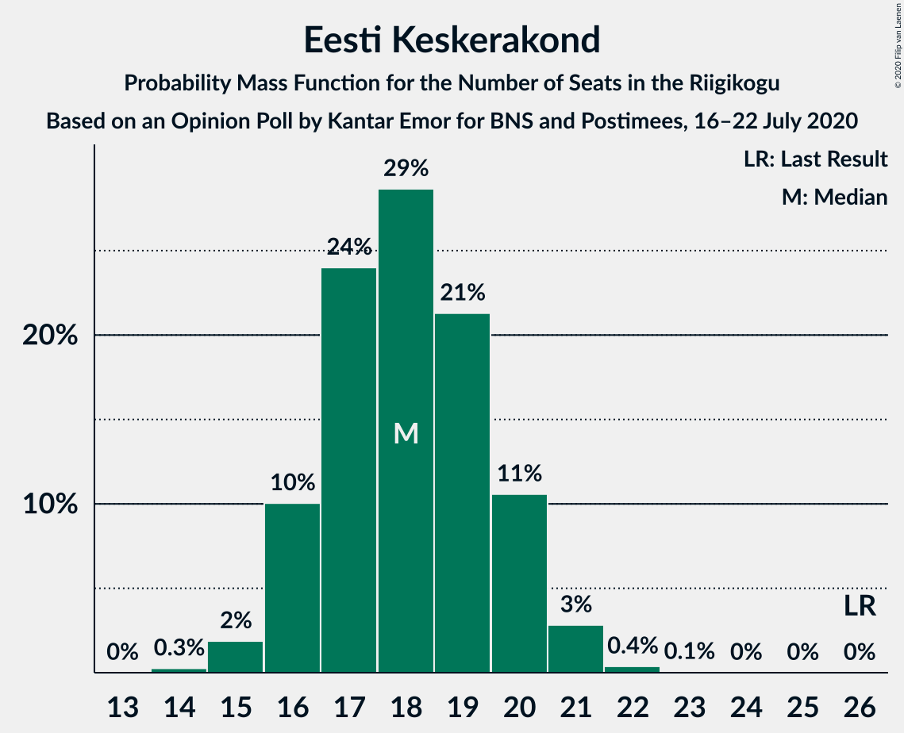
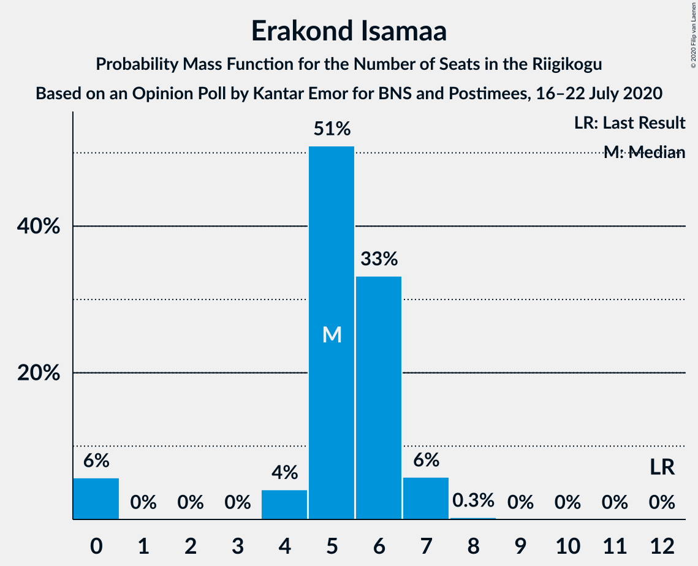

# Opinion Poll by Kantar Emor for BNS and Postimees, 16–22 July 2020

<a href="#voting-intentions">Voting Intentions</a> | <a href="#seats">Seats</a> | <a href="#coalitions">Coalitions</a> | <a href="#technical-information">Technical Information</a>

## Voting Intentions

### Confidence Intervals

| Party | Last Result | Poll Result | 80% Confidence Interval | 90% Confidence Interval | 95% Confidence Interval | 99% Confidence Interval |
|:-----:|:-----------:|:-----------:|:-----------------------:|:-----------------------:|:-----------------------:|:-----------------------:|
| Eesti Reformierakond | 28.9% | 30.9% | 29.3–32.6% |28.8–33.1% |28.4–33.5% |27.7–34.3% |
| Eesti Konservatiivne Rahvaerakond | 17.8% | 18.0% | 16.7–19.4% |16.3–19.8% |16.0–20.2% |15.3–20.9% |
| Eesti Keskerakond | 23.1% | 17.0% | 15.7–18.4% |15.3–18.8% |15.0–19.1% |14.4–19.8% |
| Eesti 200 | 4.4% | 14.0% | 12.8–15.3% |12.4–15.7% |12.2–16.0% |11.6–16.6% |
| Sotsiaaldemokraatlik Erakond | 9.8% | 9.0% | 8.0–10.1% |7.8–10.4% |7.5–10.7% |7.1–11.2% |
| Erakond Isamaa | 11.4% | 6.0% | 5.2–6.9% |5.0–7.2% |4.8–7.4% |4.5–7.9% |
| Erakond Eestimaa Rohelised | 1.8% | 3.0% | 2.5–3.7% |2.3–3.9% |2.2–4.1% |2.0–4.5% |
| Eesti Vabaerakond | 1.2% | 0.2% | 0.1–0.5% |0.1–0.6% |0.1–0.7% |0.0–0.9% |

*Note:* The poll result column reflects the actual value used in the calculations. Published results may vary slightly, and in addition be rounded to fewer digits.

## Seats

### Confidence Intervals

| Party | Last Result | Median | 80% Confidence Interval | 90% Confidence Interval | 95% Confidence Interval | 99% Confidence Interval |
|:-----:|:-----------:|:------:|:-----------------------:|:-----------------------:|:-----------------------:|:-----------------------:|
| <a href="#eesti-reformierakond">Eesti Reformierakond</a> | 34 | 35 | 33–38 |33–38 |32–39 |31–40 |
| <a href="#eesti-konservatiivne-rahvaerakond">Eesti Konservatiivne Rahvaerakond</a> | 19 | 19 | 18–21 |17–21 |17–22 |16–23 |
| <a href="#eesti-keskerakond">Eesti Keskerakond</a> | 26 | 18 | 16–20 |16–20 |16–21 |15–21 |
| <a href="#eesti-200">Eesti 200</a> | 0 | 14 | 13–16 |13–16 |12–17 |12–18 |
| <a href="#sotsiaaldemokraatlik-erakond">Sotsiaaldemokraatlik Erakond</a> | 10 | 9 | 8–10 |7–10 |7–11 |6–11 |
| <a href="#erakond-isamaa">Erakond Isamaa</a> | 12 | 5 | 5–6 |0–7 |0–7 |0–7 |
| <a href="#erakond-eestimaa-rohelised">Erakond Eestimaa Rohelised</a> | 0 | 0 | 0 |0 |0 |0 |
| <a href="#eesti-vabaerakond">Eesti Vabaerakond</a> | 0 | 0 | 0 |0 |0 |0 |

### Eesti Reformierakond

*For a full overview of the results for this party, see the [Eesti Reformierakond](party-eestireformierakond.html) page.*

| Number of Seats | Probability | Accumulated | Special Marks |
|:---------------:|:-----------:|:-----------:|:-------------:|
| 30 | 0.1% | 100% |  |
| 31 | 0.5% | 99.9% |  |
| 32 | 4% | 99.4% |  |
| 33 | 7% | 95% |  |
| 34 | 18% | 89% | Last Result |
| 35 | 25% | 70% | Median |
| 36 | 19% | 45% |  |
| 37 | 15% | 26% |  |
| 38 | 7% | 11% |  |
| 39 | 3% | 4% |  |
| 40 | 0.9% | 1.0% |  |
| 41 | 0.1% | 0.2% |  |
| 42 | 0% | 0% |  |

### Eesti Konservatiivne Rahvaerakond

*For a full overview of the results for this party, see the [Eesti Konservatiivne Rahvaerakond](party-eestikonservatiivnerahvaerakond.html) page.*

| Number of Seats | Probability | Accumulated | Special Marks |
|:---------------:|:-----------:|:-----------:|:-------------:|
| 15 | 0.2% | 100% |  |
| 16 | 2% | 99.8% |  |
| 17 | 6% | 98% |  |
| 18 | 18% | 91% |  |
| 19 | 29% | 74% | Last Result, Median |
| 20 | 29% | 45% |  |
| 21 | 11% | 16% |  |
| 22 | 4% | 5% |  |
| 23 | 0.8% | 1.0% |  |
| 24 | 0.2% | 0.2% |  |
| 25 | 0% | 0% |  |

### Eesti Keskerakond

*For a full overview of the results for this party, see the [Eesti Keskerakond](party-eestikeskerakond.html) page.*

| Number of Seats | Probability | Accumulated | Special Marks |
|:---------------:|:-----------:|:-----------:|:-------------:|
| 14 | 0.3% | 100% |  |
| 15 | 2% | 99.7% |  |
| 16 | 10% | 98% |  |
| 17 | 24% | 88% |  |
| 18 | 29% | 64% | Median |
| 19 | 21% | 35% |  |
| 20 | 11% | 14% |  |
| 21 | 3% | 3% |  |
| 22 | 0.4% | 0.4% |  |
| 23 | 0.1% | 0.1% |  |
| 24 | 0% | 0% |  |
| 25 | 0% | 0% |  |
| 26 | 0% | 0% | Last Result |

### Eesti 200

*For a full overview of the results for this party, see the [Eesti 200](party-eesti200.html) page.*

| Number of Seats | Probability | Accumulated | Special Marks |
|:---------------:|:-----------:|:-----------:|:-------------:|
| 0 | 0% | 100% | Last Result |
| 1 | 0% | 100% |  |
| 2 | 0% | 100% |  |
| 3 | 0% | 100% |  |
| 4 | 0% | 100% |  |
| 5 | 0% | 100% |  |
| 6 | 0% | 100% |  |
| 7 | 0% | 100% |  |
| 8 | 0% | 100% |  |
| 9 | 0% | 100% |  |
| 10 | 0% | 100% |  |
| 11 | 0.4% | 100% |  |
| 12 | 4% | 99.6% |  |
| 13 | 17% | 96% |  |
| 14 | 35% | 79% | Median |
| 15 | 26% | 44% |  |
| 16 | 13% | 17% |  |
| 17 | 4% | 4% |  |
| 18 | 0.7% | 0.8% |  |
| 19 | 0.1% | 0.1% |  |
| 20 | 0% | 0% |  |

### Sotsiaaldemokraatlik Erakond

*For a full overview of the results for this party, see the [Sotsiaaldemokraatlik Erakond](party-sotsiaaldemokraatlikerakond.html) page.*

| Number of Seats | Probability | Accumulated | Special Marks |
|:---------------:|:-----------:|:-----------:|:-------------:|
| 6 | 0.5% | 100% |  |
| 7 | 8% | 99.5% |  |
| 8 | 33% | 91% |  |
| 9 | 36% | 58% | Median |
| 10 | 18% | 22% | Last Result |
| 11 | 3% | 3% |  |
| 12 | 0.2% | 0.2% |  |
| 13 | 0% | 0% |  |

### Erakond Isamaa

*For a full overview of the results for this party, see the [Erakond Isamaa](party-erakondisamaa.html) page.*

| Number of Seats | Probability | Accumulated | Special Marks |
|:---------------:|:-----------:|:-----------:|:-------------:|
| 0 | 6% | 100% |  |
| 1 | 0% | 94% |  |
| 2 | 0% | 94% |  |
| 3 | 0% | 94% |  |
| 4 | 4% | 94% |  |
| 5 | 51% | 90% | Median |
| 6 | 33% | 39% |  |
| 7 | 6% | 6% |  |
| 8 | 0.3% | 0.3% |  |
| 9 | 0% | 0% |  |
| 10 | 0% | 0% |  |
| 11 | 0% | 0% |  |
| 12 | 0% | 0% | Last Result |

### Erakond Eestimaa Rohelised

*For a full overview of the results for this party, see the [Erakond Eestimaa Rohelised](party-erakondeestimaarohelised.html) page.*

| Number of Seats | Probability | Accumulated | Special Marks |
|:---------------:|:-----------:|:-----------:|:-------------:|
| 0 | 100% | 100% | Last Result, Median |

### Eesti Vabaerakond

*For a full overview of the results for this party, see the [Eesti Vabaerakond](party-eestivabaerakond.html) page.*

| Number of Seats | Probability | Accumulated | Special Marks |
|:---------------:|:-----------:|:-----------:|:-------------:|
| 0 | 100% | 100% | Last Result, Median |

## Coalitions

### Confidence Intervals

| Coalition | Last Result | Median | Majority? | 80% Confidence Interval | 90% Confidence Interval | 95% Confidence Interval | 99% Confidence Interval |
|:---------:|:-----------:|:------:|:---------:|:-----------------------:|:-----------------------:|:-----------------------:|:-----------------------:|
| Eesti Reformierakond – Eesti Konservatiivne Rahvaerakond – Eesti Keskerakond | 79 | 73 | 100% | 70–75 | 70–76 | 70–77 | 69–79 |
| Eesti Reformierakond – Eesti Konservatiivne Rahvaerakond – Erakond Isamaa | 65 | 60 | 100% | 57–62 | 57–63 | 56–63 | 55–64 |
| Eesti Reformierakond – Eesti Konservatiivne Rahvaerakond | 53 | 55 | 99.3% | 52–57 | 52–58 | 51–58 | 50–60 |
| Eesti Reformierakond – Eesti Keskerakond | 60 | 53 | 95% | 51–56 | 51–57 | 50–57 | 49–59 |
| Eesti Reformierakond – Sotsiaaldemokraatlik Erakond – Erakond Isamaa – Eesti Vabaerakond | 56 | 49 | 27% | 47–51 | 46–52 | 46–53 | 44–54 |
| Eesti Reformierakond – Sotsiaaldemokraatlik Erakond – Erakond Isamaa | 56 | 49 | 27% | 47–51 | 46–52 | 46–53 | 44–54 |
| Eesti Reformierakond – Sotsiaaldemokraatlik Erakond | 44 | 44 | 0.1% | 42–46 | 41–47 | 41–48 | 40–49 |
| Eesti Konservatiivne Rahvaerakond – Eesti Keskerakond – Erakond Isamaa | 57 | 43 | 0% | 40–45 | 39–45 | 38–46 | 37–47 |
| Eesti Reformierakond – Erakond Isamaa | 46 | 41 | 0% | 38–43 | 37–43 | 37–44 | 35–45 |
| Eesti Konservatiivne Rahvaerakond – Eesti Keskerakond | 45 | 37 | 0% | 35–40 | 35–40 | 34–41 | 33–42 |
| Eesti Keskerakond – Sotsiaaldemokraatlik Erakond – Erakond Isamaa | 48 | 32 | 0% | 30–34 | 29–35 | 28–35 | 26–36 |
| Eesti Konservatiivne Rahvaerakond – Sotsiaaldemokraatlik Erakond | 29 | 28 | 0% | 26–30 | 25–31 | 25–31 | 24–32 |
| Eesti Keskerakond – Sotsiaaldemokraatlik Erakond | 36 | 27 | 0% | 25–29 | 24–29 | 24–30 | 23–31 |

### Eesti Reformierakond – Eesti Konservatiivne Rahvaerakond – Eesti Keskerakond

| Number of Seats | Probability | Accumulated | Special Marks |
|:---------------:|:-----------:|:-----------:|:-------------:|
| 67 | 0% | 100% |  |
| 68 | 0.3% | 99.9% |  |
| 69 | 2% | 99.6% |  |
| 70 | 9% | 98% |  |
| 71 | 14% | 89% |  |
| 72 | 20% | 75% | Median |
| 73 | 28% | 55% |  |
| 74 | 11% | 27% |  |
| 75 | 11% | 17% |  |
| 76 | 2% | 6% |  |
| 77 | 2% | 4% |  |
| 78 | 0.8% | 1.4% |  |
| 79 | 0.5% | 0.7% | Last Result |
| 80 | 0.1% | 0.1% |  |
| 81 | 0.1% | 0.1% |  |
| 82 | 0% | 0% |  |

### Eesti Reformierakond – Eesti Konservatiivne Rahvaerakond – Erakond Isamaa

| Number of Seats | Probability | Accumulated | Special Marks |
|:---------------:|:-----------:|:-----------:|:-------------:|
| 54 | 0.1% | 100% |  |
| 55 | 0.6% | 99.8% |  |
| 56 | 2% | 99.2% |  |
| 57 | 7% | 97% |  |
| 58 | 9% | 90% |  |
| 59 | 23% | 81% | Median |
| 60 | 24% | 58% |  |
| 61 | 19% | 34% |  |
| 62 | 8% | 15% |  |
| 63 | 6% | 7% |  |
| 64 | 1.1% | 1.5% |  |
| 65 | 0.3% | 0.4% | Last Result |
| 66 | 0% | 0% |  |

### Eesti Reformierakond – Eesti Konservatiivne Rahvaerakond

| Number of Seats | Probability | Accumulated | Special Marks |
|:---------------:|:-----------:|:-----------:|:-------------:|
| 49 | 0.1% | 100% |  |
| 50 | 0.6% | 99.9% |  |
| 51 | 4% | 99.3% | Majority |
| 52 | 8% | 96% |  |
| 53 | 12% | 88% | Last Result |
| 54 | 19% | 76% | Median |
| 55 | 27% | 57% |  |
| 56 | 16% | 30% |  |
| 57 | 7% | 14% |  |
| 58 | 5% | 8% |  |
| 59 | 2% | 2% |  |
| 60 | 0.4% | 0.8% |  |
| 61 | 0.3% | 0.4% |  |
| 62 | 0.1% | 0.1% |  |
| 63 | 0% | 0% |  |

### Eesti Reformierakond – Eesti Keskerakond

| Number of Seats | Probability | Accumulated | Special Marks |
|:---------------:|:-----------:|:-----------:|:-------------:|
| 48 | 0.2% | 100% |  |
| 49 | 0.6% | 99.8% |  |
| 50 | 4% | 99.2% |  |
| 51 | 9% | 95% | Majority |
| 52 | 17% | 86% |  |
| 53 | 27% | 69% | Median |
| 54 | 14% | 43% |  |
| 55 | 13% | 28% |  |
| 56 | 9% | 15% |  |
| 57 | 4% | 6% |  |
| 58 | 1.1% | 2% |  |
| 59 | 0.5% | 0.8% |  |
| 60 | 0.2% | 0.3% | Last Result |
| 61 | 0% | 0% |  |

### Eesti Reformierakond – Sotsiaaldemokraatlik Erakond – Erakond Isamaa – Eesti Vabaerakond

| Number of Seats | Probability | Accumulated | Special Marks |
|:---------------:|:-----------:|:-----------:|:-------------:|
| 43 | 0.2% | 100% |  |
| 44 | 0.5% | 99.8% |  |
| 45 | 2% | 99.3% |  |
| 46 | 3% | 98% |  |
| 47 | 14% | 95% |  |
| 48 | 13% | 81% |  |
| 49 | 20% | 68% | Median |
| 50 | 22% | 48% |  |
| 51 | 18% | 27% | Majority |
| 52 | 6% | 9% |  |
| 53 | 2% | 3% |  |
| 54 | 0.7% | 0.8% |  |
| 55 | 0.1% | 0.1% |  |
| 56 | 0% | 0% | Last Result |

### Eesti Reformierakond – Sotsiaaldemokraatlik Erakond – Erakond Isamaa

| Number of Seats | Probability | Accumulated | Special Marks |
|:---------------:|:-----------:|:-----------:|:-------------:|
| 43 | 0.2% | 100% |  |
| 44 | 0.5% | 99.8% |  |
| 45 | 2% | 99.3% |  |
| 46 | 3% | 98% |  |
| 47 | 14% | 95% |  |
| 48 | 13% | 81% |  |
| 49 | 20% | 68% | Median |
| 50 | 22% | 48% |  |
| 51 | 18% | 27% | Majority |
| 52 | 6% | 9% |  |
| 53 | 2% | 3% |  |
| 54 | 0.7% | 0.8% |  |
| 55 | 0.1% | 0.1% |  |
| 56 | 0% | 0% | Last Result |

### Eesti Reformierakond – Sotsiaaldemokraatlik Erakond

| Number of Seats | Probability | Accumulated | Special Marks |
|:---------------:|:-----------:|:-----------:|:-------------:|
| 39 | 0.2% | 100% |  |
| 40 | 1.4% | 99.8% |  |
| 41 | 5% | 98% |  |
| 42 | 13% | 93% |  |
| 43 | 14% | 80% |  |
| 44 | 22% | 66% | Last Result, Median |
| 45 | 22% | 43% |  |
| 46 | 12% | 21% |  |
| 47 | 6% | 10% |  |
| 48 | 2% | 3% |  |
| 49 | 0.6% | 0.9% |  |
| 50 | 0.2% | 0.3% |  |
| 51 | 0.1% | 0.1% | Majority |
| 52 | 0% | 0% |  |

### Eesti Konservatiivne Rahvaerakond – Eesti Keskerakond – Erakond Isamaa

| Number of Seats | Probability | Accumulated | Special Marks |
|:---------------:|:-----------:|:-----------:|:-------------:|
| 35 | 0.1% | 100% |  |
| 36 | 0.3% | 99.9% |  |
| 37 | 0.5% | 99.6% |  |
| 38 | 2% | 99.1% |  |
| 39 | 3% | 97% |  |
| 40 | 8% | 95% |  |
| 41 | 14% | 87% |  |
| 42 | 20% | 72% | Median |
| 43 | 27% | 52% |  |
| 44 | 14% | 25% |  |
| 45 | 7% | 11% |  |
| 46 | 3% | 4% |  |
| 47 | 0.8% | 0.9% |  |
| 48 | 0.1% | 0.1% |  |
| 49 | 0% | 0% |  |
| 50 | 0% | 0% |  |
| 51 | 0% | 0% | Majority |
| 52 | 0% | 0% |  |
| 53 | 0% | 0% |  |
| 54 | 0% | 0% |  |
| 55 | 0% | 0% |  |
| 56 | 0% | 0% |  |
| 57 | 0% | 0% | Last Result |

### Eesti Reformierakond – Erakond Isamaa

| Number of Seats | Probability | Accumulated | Special Marks |
|:---------------:|:-----------:|:-----------:|:-------------:|
| 33 | 0% | 100% |  |
| 34 | 0.2% | 99.9% |  |
| 35 | 0.6% | 99.8% |  |
| 36 | 0.7% | 99.2% |  |
| 37 | 4% | 98% |  |
| 38 | 8% | 95% |  |
| 39 | 13% | 87% |  |
| 40 | 22% | 74% | Median |
| 41 | 21% | 52% |  |
| 42 | 18% | 31% |  |
| 43 | 9% | 13% |  |
| 44 | 3% | 4% |  |
| 45 | 0.9% | 1.1% |  |
| 46 | 0.2% | 0.2% | Last Result |
| 47 | 0% | 0% |  |

### Eesti Konservatiivne Rahvaerakond – Eesti Keskerakond

| Number of Seats | Probability | Accumulated | Special Marks |
|:---------------:|:-----------:|:-----------:|:-------------:|
| 32 | 0.1% | 100% |  |
| 33 | 1.2% | 99.9% |  |
| 34 | 3% | 98.7% |  |
| 35 | 11% | 96% |  |
| 36 | 16% | 85% |  |
| 37 | 24% | 68% | Median |
| 38 | 21% | 45% |  |
| 39 | 14% | 24% |  |
| 40 | 7% | 10% |  |
| 41 | 2% | 3% |  |
| 42 | 0.8% | 1.0% |  |
| 43 | 0.2% | 0.2% |  |
| 44 | 0% | 0% |  |
| 45 | 0% | 0% | Last Result |

### Eesti Keskerakond – Sotsiaaldemokraatlik Erakond – Erakond Isamaa

| Number of Seats | Probability | Accumulated | Special Marks |
|:---------------:|:-----------:|:-----------:|:-------------:|
| 25 | 0.1% | 100% |  |
| 26 | 0.5% | 99.8% |  |
| 27 | 1.1% | 99.3% |  |
| 28 | 2% | 98% |  |
| 29 | 6% | 97% |  |
| 30 | 9% | 90% |  |
| 31 | 18% | 81% |  |
| 32 | 29% | 63% | Median |
| 33 | 18% | 35% |  |
| 34 | 10% | 17% |  |
| 35 | 6% | 7% |  |
| 36 | 0.9% | 1.2% |  |
| 37 | 0.3% | 0.3% |  |
| 38 | 0% | 0% |  |
| 39 | 0% | 0% |  |
| 40 | 0% | 0% |  |
| 41 | 0% | 0% |  |
| 42 | 0% | 0% |  |
| 43 | 0% | 0% |  |
| 44 | 0% | 0% |  |
| 45 | 0% | 0% |  |
| 46 | 0% | 0% |  |
| 47 | 0% | 0% |  |
| 48 | 0% | 0% | Last Result |

### Eesti Konservatiivne Rahvaerakond – Sotsiaaldemokraatlik Erakond

| Number of Seats | Probability | Accumulated | Special Marks |
|:---------------:|:-----------:|:-----------:|:-------------:|
| 23 | 0.1% | 100% |  |
| 24 | 1.2% | 99.9% |  |
| 25 | 4% | 98.7% |  |
| 26 | 9% | 94% |  |
| 27 | 17% | 85% |  |
| 28 | 33% | 69% | Median |
| 29 | 22% | 35% | Last Result |
| 30 | 8% | 13% |  |
| 31 | 4% | 5% |  |
| 32 | 1.4% | 2% |  |
| 33 | 0.2% | 0.2% |  |
| 34 | 0% | 0% |  |

### Eesti Keskerakond – Sotsiaaldemokraatlik Erakond

| Number of Seats | Probability | Accumulated | Special Marks |
|:---------------:|:-----------:|:-----------:|:-------------:|
| 22 | 0.2% | 100% |  |
| 23 | 1.1% | 99.7% |  |
| 24 | 8% | 98.6% |  |
| 25 | 12% | 91% |  |
| 26 | 20% | 79% |  |
| 27 | 29% | 59% | Median |
| 28 | 16% | 30% |  |
| 29 | 9% | 14% |  |
| 30 | 4% | 4% |  |
| 31 | 0.6% | 0.7% |  |
| 32 | 0.1% | 0.1% |  |
| 33 | 0% | 0% |  |
| 34 | 0% | 0% |  |
| 35 | 0% | 0% |  |
| 36 | 0% | 0% | Last Result |

## Technical Information

### Opinion Poll

+ **Polling firm:** Kantar Emor
+ **Commissioner(s):** BNS and Postimees
+ **Fieldwork period:** 16–22 July 2020

### Calculations

+ **Sample size:** 1268
+ **Simulations done:** 1,048,576
+ **Error estimate:** 0.93%

