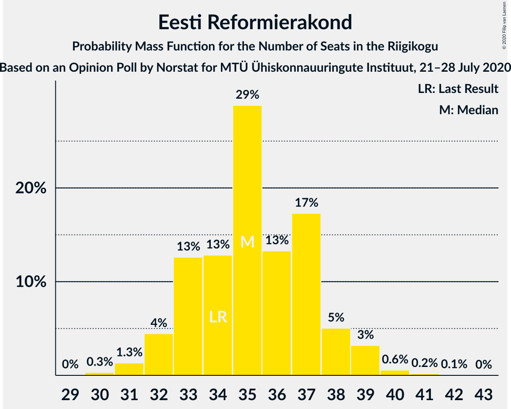

# Opinion Poll by Norstat for MTÜ Ühiskonnauuringute Instituut, 21–28 July 2020

<a href="#voting-intentions">Voting Intentions</a> | <a href="#seats">Seats</a> | <a href="#coalitions">Coalitions</a> | <a href="#technical-information">Technical Information</a>

## Voting Intentions

### Confidence Intervals

| Party | Last Result | Poll Result | 80% Confidence Interval | 90% Confidence Interval | 95% Confidence Interval | 99% Confidence Interval |
|:-----:|:-----------:|:-----------:|:-----------------------:|:-----------------------:|:-----------------------:|:-----------------------:|
| Eesti Reformierakond | 28.9% | 31.2% | 29.4–33.1% |28.9–33.7% |28.4–34.1% |27.5–35.1% |
| Eesti Keskerakond | 23.1% | 24.1% | 22.4–25.9% |21.9–26.4% |21.6–26.9% |20.8–27.7% |
| Eesti Konservatiivne Rahvaerakond | 17.8% | 18.6% | 17.1–20.3% |16.7–20.7% |16.3–21.1% |15.6–21.9% |
| Sotsiaaldemokraatlik Erakond | 9.8% | 8.7% | 7.7–10.0% |7.3–10.3% |7.1–10.6% |6.6–11.2% |
| Eesti 200 | 4.4% | 6.8% | 5.9–7.9% |5.6–8.3% |5.4–8.5% |5.0–9.1% |
| Erakond Isamaa | 11.4% | 6.4% | 5.5–7.5% |5.3–7.8% |5.0–8.1% |4.6–8.7% |
| Erakond Eestimaa Rohelised | 1.8% | 2.2% | 1.7–2.9% |1.6–3.1% |1.4–3.3% |1.2–3.7% |
| Eesti Vabaerakond | 1.2% | 0.6% | 0.4–1.1% |0.3–1.2% |0.3–1.3% |0.2–1.6% |

*Note:* The poll result column reflects the actual value used in the calculations. Published results may vary slightly, and in addition be rounded to fewer digits.

## Seats

### Confidence Intervals

| Party | Last Result | Median | 80% Confidence Interval | 90% Confidence Interval | 95% Confidence Interval | 99% Confidence Interval |
|:-----:|:-----------:|:------:|:-----------------------:|:-----------------------:|:-----------------------:|:-----------------------:|
| <a href="#eesti-reformierakond">Eesti Reformierakond</a> | 34 | 35 | 32–38 |32–38 |31–39 |31–40 |
| <a href="#eesti-keskerakond">Eesti Keskerakond</a> | 26 | 26 | 24–28 |23–29 |23–30 |22–31 |
| <a href="#eesti-konservatiivne-rahvaerakond">Eesti Konservatiivne Rahvaerakond</a> | 19 | 20 | 18–21 |17–22 |17–23 |16–24 |
| <a href="#sotsiaaldemokraatlik-erakond">Sotsiaaldemokraatlik Erakond</a> | 10 | 8 | 7–10 |7–10 |6–11 |6–11 |
| <a href="#eesti-200">Eesti 200</a> | 0 | 6 | 5–7 |5–8 |5–8 |0–9 |
| <a href="#erakond-isamaa">Erakond Isamaa</a> | 12 | 6 | 5–7 |4–7 |4–8 |0–8 |
| <a href="#erakond-eestimaa-rohelised">Erakond Eestimaa Rohelised</a> | 0 | 0 | 0 |0 |0 |0 |
| <a href="#eesti-vabaerakond">Eesti Vabaerakond</a> | 0 | 0 | 0 |0 |0 |0 |

### Eesti Reformierakond

*For a full overview of the results for this party, see the [Eesti Reformierakond](party-eestireformierakond.html) page.*

| Number of Seats | Probability | Accumulated | Special Marks |
|:---------------:|:-----------:|:-----------:|:-------------:|
| 29 | 0% | 100% |  |
| 30 | 0.3% | 99.9% |  |
| 31 | 3% | 99.6% |  |
| 32 | 9% | 97% |  |
| 33 | 7% | 88% |  |
| 34 | 22% | 81% | Last Result |
| 35 | 12% | 60% | Median |
| 36 | 20% | 48% |  |
| 37 | 16% | 28% |  |
| 38 | 10% | 12% |  |
| 39 | 2% | 3% |  |
| 40 | 0.8% | 1.0% |  |
| 41 | 0.2% | 0.2% |  |
| 42 | 0.1% | 0.1% |  |
| 43 | 0% | 0% |  |

### Eesti Keskerakond

*For a full overview of the results for this party, see the [Eesti Keskerakond](party-eestikeskerakond.html) page.*

| Number of Seats | Probability | Accumulated | Special Marks |
|:---------------:|:-----------:|:-----------:|:-------------:|
| 21 | 0.2% | 100% |  |
| 22 | 0.5% | 99.8% |  |
| 23 | 6% | 99.3% |  |
| 24 | 7% | 93% |  |
| 25 | 18% | 87% |  |
| 26 | 28% | 69% | Last Result, Median |
| 27 | 11% | 41% |  |
| 28 | 22% | 30% |  |
| 29 | 5% | 7% |  |
| 30 | 1.2% | 3% |  |
| 31 | 1.1% | 1.3% |  |
| 32 | 0.2% | 0.3% |  |
| 33 | 0% | 0% |  |

### Eesti Konservatiivne Rahvaerakond

*For a full overview of the results for this party, see the [Eesti Konservatiivne Rahvaerakond](party-eestikonservatiivnerahvaerakond.html) page.*

| Number of Seats | Probability | Accumulated | Special Marks |
|:---------------:|:-----------:|:-----------:|:-------------:|
| 15 | 0.2% | 100% |  |
| 16 | 1.1% | 99.8% |  |
| 17 | 7% | 98.7% |  |
| 18 | 22% | 92% |  |
| 19 | 18% | 69% | Last Result |
| 20 | 26% | 51% | Median |
| 21 | 15% | 25% |  |
| 22 | 7% | 10% |  |
| 23 | 2% | 3% |  |
| 24 | 0.5% | 0.7% |  |
| 25 | 0.1% | 0.1% |  |
| 26 | 0% | 0% |  |

### Sotsiaaldemokraatlik Erakond

*For a full overview of the results for this party, see the [Sotsiaaldemokraatlik Erakond](party-sotsiaaldemokraatlikerakond.html) page.*

| Number of Seats | Probability | Accumulated | Special Marks |
|:---------------:|:-----------:|:-----------:|:-------------:|
| 5 | 0.2% | 100% |  |
| 6 | 3% | 99.8% |  |
| 7 | 28% | 97% |  |
| 8 | 27% | 68% | Median |
| 9 | 27% | 41% |  |
| 10 | 11% | 14% | Last Result |
| 11 | 3% | 3% |  |
| 12 | 0.3% | 0.3% |  |
| 13 | 0% | 0% |  |

### Eesti 200

*For a full overview of the results for this party, see the [Eesti 200](party-eesti200.html) page.*

| Number of Seats | Probability | Accumulated | Special Marks |
|:---------------:|:-----------:|:-----------:|:-------------:|
| 0 | 1.0% | 100% | Last Result |
| 1 | 0% | 99.0% |  |
| 2 | 0% | 99.0% |  |
| 3 | 0% | 99.0% |  |
| 4 | 1.3% | 99.0% |  |
| 5 | 24% | 98% |  |
| 6 | 30% | 74% | Median |
| 7 | 39% | 44% |  |
| 8 | 4% | 5% |  |
| 9 | 0.8% | 0.9% |  |
| 10 | 0% | 0% |  |

### Erakond Isamaa

*For a full overview of the results for this party, see the [Erakond Isamaa](party-erakondisamaa.html) page.*

| Number of Seats | Probability | Accumulated | Special Marks |
|:---------------:|:-----------:|:-----------:|:-------------:|
| 0 | 2% | 100% |  |
| 1 | 0% | 98% |  |
| 2 | 0% | 98% |  |
| 3 | 0% | 98% |  |
| 4 | 5% | 98% |  |
| 5 | 35% | 93% |  |
| 6 | 40% | 57% | Median |
| 7 | 15% | 17% |  |
| 8 | 3% | 3% |  |
| 9 | 0.1% | 0.1% |  |
| 10 | 0% | 0% |  |
| 11 | 0% | 0% |  |
| 12 | 0% | 0% | Last Result |

### Erakond Eestimaa Rohelised

*For a full overview of the results for this party, see the [Erakond Eestimaa Rohelised](party-erakondeestimaarohelised.html) page.*

| Number of Seats | Probability | Accumulated | Special Marks |
|:---------------:|:-----------:|:-----------:|:-------------:|
| 0 | 100% | 100% | Last Result, Median |

### Eesti Vabaerakond

*For a full overview of the results for this party, see the [Eesti Vabaerakond](party-eestivabaerakond.html) page.*

| Number of Seats | Probability | Accumulated | Special Marks |
|:---------------:|:-----------:|:-----------:|:-------------:|
| 0 | 100% | 100% | Last Result, Median |

## Coalitions

### Confidence Intervals

| Coalition | Last Result | Median | Majority? | 80% Confidence Interval | 90% Confidence Interval | 95% Confidence Interval | 99% Confidence Interval |
|:---------:|:-----------:|:------:|:---------:|:-----------------------:|:-----------------------:|:-----------------------:|:-----------------------:|
| Eesti Reformierakond – Eesti Keskerakond – Eesti Konservatiivne Rahvaerakond | 79 | 81 | 100% | 79–83 | 79–84 | 78–85 | 77–87 |
| Eesti Reformierakond – Eesti Keskerakond | 60 | 61 | 100% | 59–64 | 59–65 | 58–66 | 57–67 |
| Eesti Reformierakond – Eesti Konservatiivne Rahvaerakond – Erakond Isamaa | 65 | 60 | 100% | 58–63 | 57–63 | 56–64 | 55–66 |
| Eesti Reformierakond – Eesti Konservatiivne Rahvaerakond | 53 | 55 | 98.6% | 52–57 | 51–58 | 51–59 | 49–60 |
| Eesti Keskerakond – Eesti Konservatiivne Rahvaerakond – Erakond Isamaa | 57 | 51 | 75% | 49–54 | 48–55 | 48–55 | 46–57 |
| Eesti Reformierakond – Sotsiaaldemokraatlik Erakond – Erakond Isamaa – Eesti Vabaerakond | 56 | 49 | 21% | 46–52 | 46–53 | 45–53 | 43–54 |
| Eesti Reformierakond – Sotsiaaldemokraatlik Erakond – Erakond Isamaa | 56 | 49 | 21% | 46–52 | 46–53 | 45–53 | 43–54 |
| Eesti Keskerakond – Eesti Konservatiivne Rahvaerakond | 45 | 46 | 0.9% | 43–48 | 43–49 | 42–50 | 41–52 |
| Eesti Reformierakond – Sotsiaaldemokraatlik Erakond | 44 | 43 | 0% | 41–46 | 40–47 | 40–47 | 39–48 |
| Eesti Reformierakond – Erakond Isamaa | 46 | 41 | 0% | 38–43 | 37–44 | 37–45 | 35–46 |
| Eesti Keskerakond – Sotsiaaldemokraatlik Erakond – Erakond Isamaa | 48 | 40 | 0% | 38–43 | 37–44 | 35–44 | 35–45 |
| Eesti Keskerakond – Sotsiaaldemokraatlik Erakond | 36 | 34 | 0% | 32–37 | 32–38 | 30–38 | 30–39 |
| Eesti Konservatiivne Rahvaerakond – Sotsiaaldemokraatlik Erakond | 29 | 28 | 0% | 25–30 | 25–31 | 25–31 | 24–32 |

### Eesti Reformierakond – Eesti Keskerakond – Eesti Konservatiivne Rahvaerakond

| Number of Seats | Probability | Accumulated | Special Marks |
|:---------------:|:-----------:|:-----------:|:-------------:|
| 75 | 0.1% | 100% |  |
| 76 | 0.3% | 99.9% |  |
| 77 | 2% | 99.6% |  |
| 78 | 3% | 98% |  |
| 79 | 23% | 95% | Last Result |
| 80 | 14% | 72% |  |
| 81 | 15% | 58% | Median |
| 82 | 22% | 43% |  |
| 83 | 14% | 20% |  |
| 84 | 3% | 6% |  |
| 85 | 0.8% | 3% |  |
| 86 | 0.7% | 2% |  |
| 87 | 0.9% | 1.1% |  |
| 88 | 0.1% | 0.2% |  |
| 89 | 0.1% | 0.1% |  |
| 90 | 0% | 0% |  |

### Eesti Reformierakond – Eesti Keskerakond

| Number of Seats | Probability | Accumulated | Special Marks |
|:---------------:|:-----------:|:-----------:|:-------------:|
| 55 | 0.1% | 100% |  |
| 56 | 0.2% | 99.9% |  |
| 57 | 2% | 99.7% |  |
| 58 | 3% | 98% |  |
| 59 | 20% | 95% |  |
| 60 | 15% | 75% | Last Result |
| 61 | 16% | 60% | Median |
| 62 | 6% | 44% |  |
| 63 | 11% | 37% |  |
| 64 | 20% | 27% |  |
| 65 | 2% | 6% |  |
| 66 | 3% | 4% |  |
| 67 | 1.0% | 1.2% |  |
| 68 | 0.2% | 0.3% |  |
| 69 | 0% | 0.1% |  |
| 70 | 0% | 0% |  |

### Eesti Reformierakond – Eesti Konservatiivne Rahvaerakond – Erakond Isamaa

| Number of Seats | Probability | Accumulated | Special Marks |
|:---------------:|:-----------:|:-----------:|:-------------:|
| 54 | 0.2% | 100% |  |
| 55 | 0.4% | 99.8% |  |
| 56 | 2% | 99.4% |  |
| 57 | 7% | 97% |  |
| 58 | 6% | 90% |  |
| 59 | 17% | 84% |  |
| 60 | 21% | 67% |  |
| 61 | 21% | 47% | Median |
| 62 | 15% | 25% |  |
| 63 | 6% | 11% |  |
| 64 | 4% | 5% |  |
| 65 | 0.7% | 1.5% | Last Result |
| 66 | 0.7% | 0.8% |  |
| 67 | 0.1% | 0.1% |  |
| 68 | 0% | 0% |  |

### Eesti Reformierakond – Eesti Konservatiivne Rahvaerakond

| Number of Seats | Probability | Accumulated | Special Marks |
|:---------------:|:-----------:|:-----------:|:-------------:|
| 48 | 0.1% | 100% |  |
| 49 | 0.7% | 99.9% |  |
| 50 | 0.7% | 99.3% |  |
| 51 | 6% | 98.6% | Majority |
| 52 | 6% | 93% |  |
| 53 | 8% | 87% | Last Result |
| 54 | 27% | 79% |  |
| 55 | 25% | 52% | Median |
| 56 | 10% | 28% |  |
| 57 | 11% | 18% |  |
| 58 | 3% | 7% |  |
| 59 | 4% | 4% |  |
| 60 | 0.5% | 0.7% |  |
| 61 | 0.1% | 0.2% |  |
| 62 | 0% | 0.1% |  |
| 63 | 0% | 0% |  |

### Eesti Keskerakond – Eesti Konservatiivne Rahvaerakond – Erakond Isamaa

| Number of Seats | Probability | Accumulated | Special Marks |
|:---------------:|:-----------:|:-----------:|:-------------:|
| 45 | 0.2% | 100% |  |
| 46 | 0.4% | 99.8% |  |
| 47 | 2% | 99.5% |  |
| 48 | 4% | 98% |  |
| 49 | 10% | 94% |  |
| 50 | 8% | 84% |  |
| 51 | 33% | 75% | Majority |
| 52 | 16% | 42% | Median |
| 53 | 12% | 26% |  |
| 54 | 7% | 14% |  |
| 55 | 5% | 7% |  |
| 56 | 0.8% | 1.4% |  |
| 57 | 0.5% | 0.6% | Last Result |
| 58 | 0.1% | 0.1% |  |
| 59 | 0% | 0% |  |

### Eesti Reformierakond – Sotsiaaldemokraatlik Erakond – Erakond Isamaa – Eesti Vabaerakond

| Number of Seats | Probability | Accumulated | Special Marks |
|:---------------:|:-----------:|:-----------:|:-------------:|
| 42 | 0% | 100% |  |
| 43 | 0.6% | 99.9% |  |
| 44 | 0.8% | 99.3% |  |
| 45 | 2% | 98.6% |  |
| 46 | 7% | 96% |  |
| 47 | 8% | 89% |  |
| 48 | 21% | 81% |  |
| 49 | 24% | 61% | Median |
| 50 | 15% | 37% |  |
| 51 | 9% | 21% | Majority |
| 52 | 7% | 13% |  |
| 53 | 5% | 6% |  |
| 54 | 0.7% | 0.8% |  |
| 55 | 0.1% | 0.2% |  |
| 56 | 0% | 0% | Last Result |

### Eesti Reformierakond – Sotsiaaldemokraatlik Erakond – Erakond Isamaa

| Number of Seats | Probability | Accumulated | Special Marks |
|:---------------:|:-----------:|:-----------:|:-------------:|
| 42 | 0% | 100% |  |
| 43 | 0.6% | 99.9% |  |
| 44 | 0.8% | 99.3% |  |
| 45 | 2% | 98.6% |  |
| 46 | 7% | 96% |  |
| 47 | 8% | 89% |  |
| 48 | 21% | 81% |  |
| 49 | 24% | 61% | Median |
| 50 | 15% | 37% |  |
| 51 | 9% | 21% | Majority |
| 52 | 7% | 13% |  |
| 53 | 5% | 6% |  |
| 54 | 0.7% | 0.8% |  |
| 55 | 0.1% | 0.2% |  |
| 56 | 0% | 0% | Last Result |

### Eesti Keskerakond – Eesti Konservatiivne Rahvaerakond

| Number of Seats | Probability | Accumulated | Special Marks |
|:---------------:|:-----------:|:-----------:|:-------------:|
| 40 | 0.2% | 100% |  |
| 41 | 0.8% | 99.8% |  |
| 42 | 4% | 99.0% |  |
| 43 | 9% | 95% |  |
| 44 | 7% | 86% |  |
| 45 | 24% | 79% | Last Result |
| 46 | 23% | 55% | Median |
| 47 | 14% | 32% |  |
| 48 | 10% | 18% |  |
| 49 | 4% | 8% |  |
| 50 | 3% | 4% |  |
| 51 | 0.4% | 0.9% | Majority |
| 52 | 0.4% | 0.5% |  |
| 53 | 0.1% | 0.2% |  |
| 54 | 0% | 0% |  |

### Eesti Reformierakond – Sotsiaaldemokraatlik Erakond

| Number of Seats | Probability | Accumulated | Special Marks |
|:---------------:|:-----------:|:-----------:|:-------------:|
| 38 | 0.3% | 100% |  |
| 39 | 2% | 99.6% |  |
| 40 | 5% | 98% |  |
| 41 | 6% | 93% |  |
| 42 | 16% | 87% |  |
| 43 | 31% | 71% | Median |
| 44 | 9% | 40% | Last Result |
| 45 | 15% | 31% |  |
| 46 | 10% | 16% |  |
| 47 | 4% | 5% |  |
| 48 | 1.1% | 2% |  |
| 49 | 0.2% | 0.4% |  |
| 50 | 0.1% | 0.2% |  |
| 51 | 0% | 0% | Majority |

### Eesti Reformierakond – Erakond Isamaa

| Number of Seats | Probability | Accumulated | Special Marks |
|:---------------:|:-----------:|:-----------:|:-------------:|
| 33 | 0.2% | 100% |  |
| 34 | 0.1% | 99.8% |  |
| 35 | 0.4% | 99.6% |  |
| 36 | 0.4% | 99.2% |  |
| 37 | 6% | 98.8% |  |
| 38 | 10% | 93% |  |
| 39 | 7% | 83% |  |
| 40 | 20% | 76% |  |
| 41 | 17% | 56% | Median |
| 42 | 18% | 39% |  |
| 43 | 12% | 21% |  |
| 44 | 6% | 9% |  |
| 45 | 2% | 3% |  |
| 46 | 0.8% | 0.8% | Last Result |
| 47 | 0% | 0.1% |  |
| 48 | 0% | 0.1% |  |
| 49 | 0% | 0% |  |

### Eesti Keskerakond – Sotsiaaldemokraatlik Erakond – Erakond Isamaa

| Number of Seats | Probability | Accumulated | Special Marks |
|:---------------:|:-----------:|:-----------:|:-------------:|
| 34 | 0.3% | 100% |  |
| 35 | 3% | 99.7% |  |
| 36 | 2% | 97% |  |
| 37 | 5% | 95% |  |
| 38 | 3% | 90% |  |
| 39 | 13% | 87% |  |
| 40 | 42% | 74% | Median |
| 41 | 13% | 32% |  |
| 42 | 8% | 19% |  |
| 43 | 2% | 11% |  |
| 44 | 7% | 8% |  |
| 45 | 2% | 2% |  |
| 46 | 0.2% | 0.3% |  |
| 47 | 0.1% | 0.1% |  |
| 48 | 0% | 0% | Last Result |

### Eesti Keskerakond – Sotsiaaldemokraatlik Erakond

| Number of Seats | Probability | Accumulated | Special Marks |
|:---------------:|:-----------:|:-----------:|:-------------:|
| 29 | 0.3% | 100% |  |
| 30 | 3% | 99.7% |  |
| 31 | 2% | 97% |  |
| 32 | 5% | 95% |  |
| 33 | 16% | 90% |  |
| 34 | 26% | 74% | Median |
| 35 | 25% | 48% |  |
| 36 | 7% | 23% | Last Result |
| 37 | 8% | 16% |  |
| 38 | 6% | 9% |  |
| 39 | 2% | 2% |  |
| 40 | 0.3% | 0.3% |  |
| 41 | 0% | 0% |  |

### Eesti Konservatiivne Rahvaerakond – Sotsiaaldemokraatlik Erakond

| Number of Seats | Probability | Accumulated | Special Marks |
|:---------------:|:-----------:|:-----------:|:-------------:|
| 23 | 0.2% | 100% |  |
| 24 | 0.7% | 99.7% |  |
| 25 | 18% | 99.1% |  |
| 26 | 15% | 81% |  |
| 27 | 7% | 66% |  |
| 28 | 17% | 59% | Median |
| 29 | 25% | 42% | Last Result |
| 30 | 9% | 16% |  |
| 31 | 6% | 8% |  |
| 32 | 1.1% | 1.3% |  |
| 33 | 0.2% | 0.2% |  |
| 34 | 0.1% | 0.1% |  |
| 35 | 0% | 0% |  |

## Technical Information

### Opinion Poll

+ **Polling firm:** Norstat
+ **Commissioner(s):** MTÜ Ühiskonnauuringute Instituut
+ **Fieldwork period:** 21–28 July 2020

### Calculations

+ **Sample size:** 1000
+ **Simulations done:** 131,072
+ **Error estimate:** 2.29%

