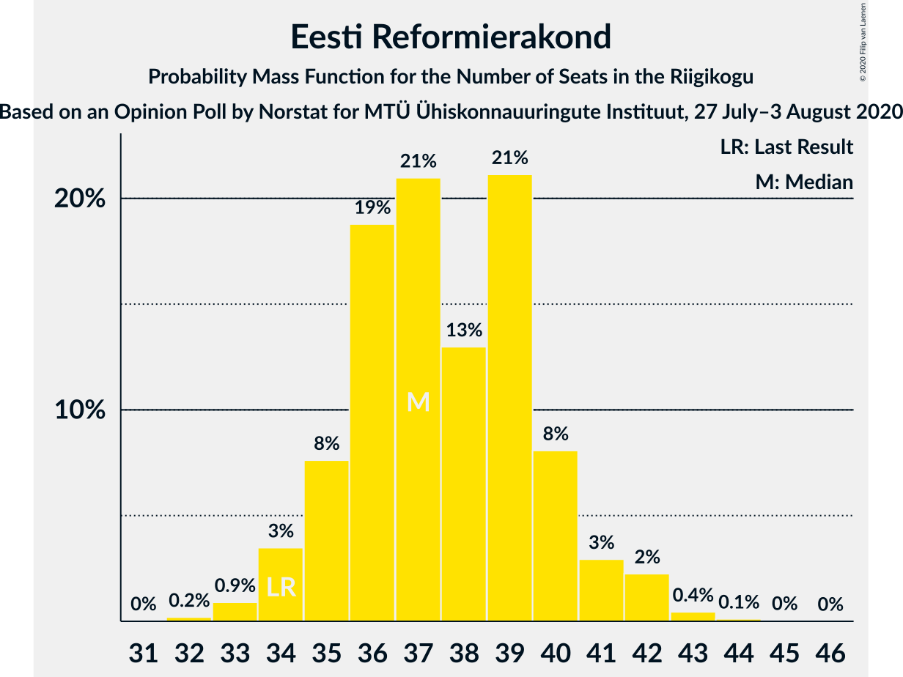
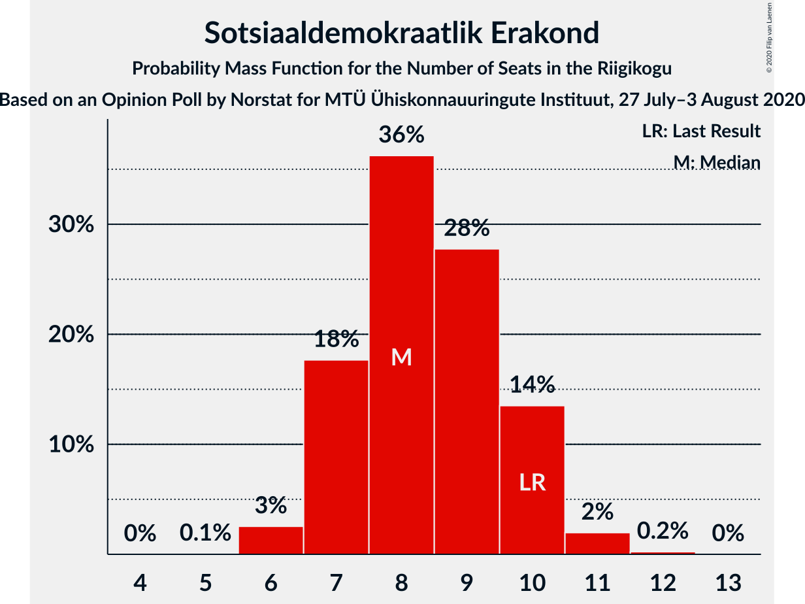
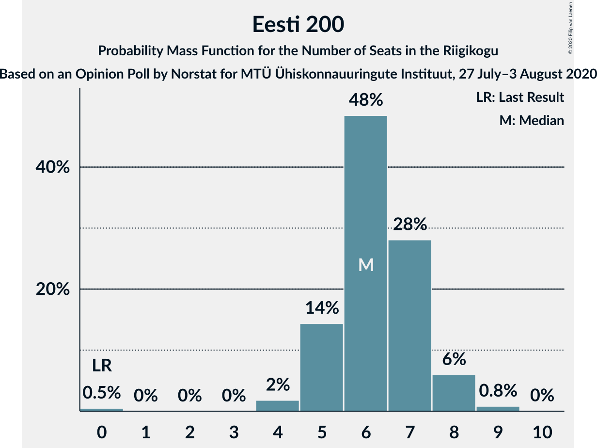
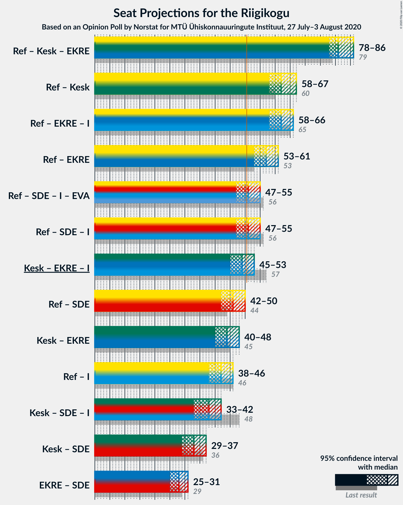
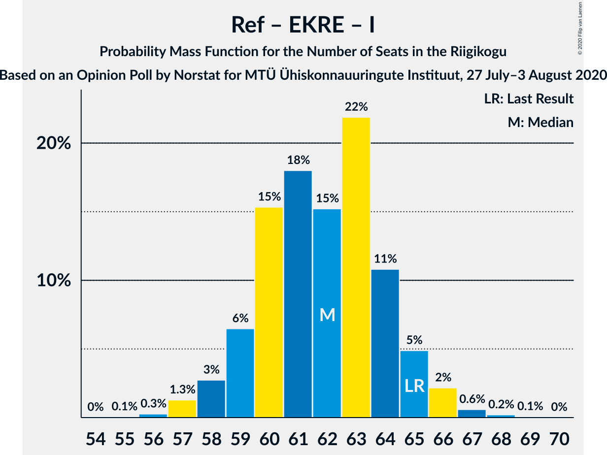

# Opinion Poll by Norstat for MTÜ Ühiskonnauuringute Instituut, 27 July–3 August 2020

<a href="#voting-intentions">Voting Intentions</a> | <a href="#seats">Seats</a> | <a href="#coalitions">Coalitions</a> | <a href="#technical-information">Technical Information</a>

## Voting Intentions

### Confidence Intervals

| Party | Last Result | Poll Result | 80% Confidence Interval | 90% Confidence Interval | 95% Confidence Interval | 99% Confidence Interval |
|:-----:|:-----------:|:-----------:|:-----------------------:|:-----------------------:|:-----------------------:|:-----------------------:|
| Eesti Reformierakond | 28.9% | 33.0% | 31.1–34.9% |30.6–35.5% |30.1–36.0% |29.3–36.9% |
| Eesti Keskerakond | 23.1% | 22.5% | 20.9–24.3% |20.4–24.8% |20.0–25.2% |19.3–26.1% |
| Eesti Konservatiivne Rahvaerakond | 17.8% | 18.4% | 16.9–20.1% |16.5–20.5% |16.1–20.9% |15.4–21.7% |
| Sotsiaaldemokraatlik Erakond | 9.8% | 8.8% | 7.7–10.1% |7.5–10.4% |7.2–10.7% |6.7–11.4% |
| Eesti 200 | 4.4% | 6.8% | 5.9–7.9% |5.6–8.3% |5.4–8.5% |5.0–9.1% |
| Erakond Isamaa | 11.4% | 5.9% | 5.0–7.0% |4.8–7.3% |4.6–7.5% |4.2–8.1% |
| Erakond Eestimaa Rohelised | 1.8% | 2.6% | 2.1–3.4% |1.9–3.6% |1.8–3.8% |1.6–4.2% |
| Eesti Vabaerakond | 1.2% | 0.9% | 0.6–1.4% |0.5–1.6% |0.5–1.7% |0.4–2.0% |

*Note:* The poll result column reflects the actual value used in the calculations. Published results may vary slightly, and in addition be rounded to fewer digits.

## Seats

### Confidence Intervals

| Party | Last Result | Median | 80% Confidence Interval | 90% Confidence Interval | 95% Confidence Interval | 99% Confidence Interval |
|:-----:|:-----------:|:------:|:-----------------------:|:-----------------------:|:-----------------------:|:-----------------------:|
| <a href="#eesti-reformierakond">Eesti Reformierakond</a> | 34 | 37 | 35–40 |34–42 |34–42 |33–43 |
| <a href="#eesti-keskerakond">Eesti Keskerakond</a> | 26 | 24 | 22–27 |22–28 |21–28 |20–29 |
| <a href="#eesti-konservatiivne-rahvaerakond">Eesti Konservatiivne Rahvaerakond</a> | 19 | 20 | 18–22 |17–22 |17–22 |16–24 |
| <a href="#sotsiaaldemokraatlik-erakond">Sotsiaaldemokraatlik Erakond</a> | 10 | 8 | 7–10 |7–10 |6–11 |6–11 |
| <a href="#eesti-200">Eesti 200</a> | 0 | 6 | 5–8 |4–8 |4–8 |0–9 |
| <a href="#erakond-isamaa">Erakond Isamaa</a> | 12 | 5 | 0–6 |0–6 |0–7 |0–7 |
| <a href="#erakond-eestimaa-rohelised">Erakond Eestimaa Rohelised</a> | 0 | 0 | 0 |0 |0 |0 |
| <a href="#eesti-vabaerakond">Eesti Vabaerakond</a> | 0 | 0 | 0 |0 |0 |0 |

### Eesti Reformierakond

*For a full overview of the results for this party, see the [Eesti Reformierakond](party-eestireformierakond.html) page.*

| Number of Seats | Probability | Accumulated | Special Marks |
|:---------------:|:-----------:|:-----------:|:-------------:|
| 32 | 0.2% | 100% |  |
| 33 | 2% | 99.8% |  |
| 34 | 3% | 98% | Last Result |
| 35 | 5% | 95% |  |
| 36 | 24% | 90% |  |
| 37 | 27% | 66% | Median |
| 38 | 7% | 40% |  |
| 39 | 15% | 33% |  |
| 40 | 9% | 18% |  |
| 41 | 2% | 8% |  |
| 42 | 5% | 6% |  |
| 43 | 1.0% | 1.2% |  |
| 44 | 0.2% | 0.3% |  |
| 45 | 0.1% | 0.1% |  |
| 46 | 0% | 0% |  |

### Eesti Keskerakond

*For a full overview of the results for this party, see the [Eesti Keskerakond](party-eestikeskerakond.html) page.*

| Number of Seats | Probability | Accumulated | Special Marks |
|:---------------:|:-----------:|:-----------:|:-------------:|
| 19 | 0% | 100% |  |
| 20 | 1.1% | 99.9% |  |
| 21 | 2% | 98.8% |  |
| 22 | 13% | 97% |  |
| 23 | 16% | 84% |  |
| 24 | 27% | 68% | Median |
| 25 | 7% | 41% |  |
| 26 | 17% | 34% | Last Result |
| 27 | 11% | 16% |  |
| 28 | 4% | 5% |  |
| 29 | 0.7% | 1.0% |  |
| 30 | 0.3% | 0.3% |  |
| 31 | 0.1% | 0.1% |  |
| 32 | 0% | 0% |  |

### Eesti Konservatiivne Rahvaerakond

*For a full overview of the results for this party, see the [Eesti Konservatiivne Rahvaerakond](party-eestikonservatiivnerahvaerakond.html) page.*

| Number of Seats | Probability | Accumulated | Special Marks |
|:---------------:|:-----------:|:-----------:|:-------------:|
| 15 | 0.1% | 100% |  |
| 16 | 1.0% | 99.9% |  |
| 17 | 7% | 98.9% |  |
| 18 | 14% | 92% |  |
| 19 | 22% | 77% | Last Result |
| 20 | 31% | 55% | Median |
| 21 | 14% | 24% |  |
| 22 | 8% | 10% |  |
| 23 | 2% | 2% |  |
| 24 | 0.3% | 0.7% |  |
| 25 | 0.4% | 0.4% |  |
| 26 | 0% | 0% |  |

### Sotsiaaldemokraatlik Erakond

*For a full overview of the results for this party, see the [Sotsiaaldemokraatlik Erakond](party-sotsiaaldemokraatlikerakond.html) page.*

| Number of Seats | Probability | Accumulated | Special Marks |
|:---------------:|:-----------:|:-----------:|:-------------:|
| 6 | 3% | 100% |  |
| 7 | 20% | 97% |  |
| 8 | 28% | 77% | Median |
| 9 | 24% | 48% |  |
| 10 | 20% | 24% | Last Result |
| 11 | 4% | 4% |  |
| 12 | 0.4% | 0.4% |  |
| 13 | 0% | 0% |  |

### Eesti 200

*For a full overview of the results for this party, see the [Eesti 200](party-eesti200.html) page.*

| Number of Seats | Probability | Accumulated | Special Marks |
|:---------------:|:-----------:|:-----------:|:-------------:|
| 0 | 1.4% | 100% | Last Result |
| 1 | 0% | 98.6% |  |
| 2 | 0% | 98.6% |  |
| 3 | 0% | 98.6% |  |
| 4 | 5% | 98.6% |  |
| 5 | 16% | 93% |  |
| 6 | 43% | 77% | Median |
| 7 | 21% | 34% |  |
| 8 | 12% | 13% |  |
| 9 | 0.9% | 1.0% |  |
| 10 | 0% | 0% |  |

### Erakond Isamaa

*For a full overview of the results for this party, see the [Erakond Isamaa](party-erakondisamaa.html) page.*

| Number of Seats | Probability | Accumulated | Special Marks |
|:---------------:|:-----------:|:-----------:|:-------------:|
| 0 | 12% | 100% |  |
| 1 | 0% | 88% |  |
| 2 | 0% | 88% |  |
| 3 | 0% | 88% |  |
| 4 | 4% | 88% |  |
| 5 | 49% | 84% | Median |
| 6 | 31% | 35% |  |
| 7 | 4% | 5% |  |
| 8 | 0.3% | 0.3% |  |
| 9 | 0% | 0% |  |
| 10 | 0% | 0% |  |
| 11 | 0% | 0% |  |
| 12 | 0% | 0% | Last Result |

### Erakond Eestimaa Rohelised

*For a full overview of the results for this party, see the [Erakond Eestimaa Rohelised](party-erakondeestimaarohelised.html) page.*

| Number of Seats | Probability | Accumulated | Special Marks |
|:---------------:|:-----------:|:-----------:|:-------------:|
| 0 | 100% | 100% | Last Result, Median |

### Eesti Vabaerakond

*For a full overview of the results for this party, see the [Eesti Vabaerakond](party-eestivabaerakond.html) page.*

| Number of Seats | Probability | Accumulated | Special Marks |
|:---------------:|:-----------:|:-----------:|:-------------:|
| 0 | 100% | 100% | Last Result, Median |

## Coalitions

### Confidence Intervals

| Coalition | Last Result | Median | Majority? | 80% Confidence Interval | 90% Confidence Interval | 95% Confidence Interval | 99% Confidence Interval |
|:---------:|:-----------:|:------:|:---------:|:-----------------------:|:-----------------------:|:-----------------------:|:-----------------------:|
| Eesti Reformierakond – Eesti Keskerakond – Eesti Konservatiivne Rahvaerakond | 79 | 81 | 100% | 79–85 | 79–86 | 78–87 | 78–88 |
| Eesti Reformierakond – Eesti Keskerakond | 60 | 62 | 100% | 59–65 | 59–66 | 58–67 | 57–70 |
| Eesti Reformierakond – Eesti Konservatiivne Rahvaerakond – Erakond Isamaa | 65 | 62 | 100% | 59–65 | 58–65 | 58–66 | 57–68 |
| Eesti Reformierakond – Eesti Konservatiivne Rahvaerakond | 53 | 57 | 100% | 55–60 | 54–61 | 53–62 | 52–63 |
| Eesti Reformierakond – Sotsiaaldemokraatlik Erakond – Erakond Isamaa – Eesti Vabaerakond | 56 | 51 | 67% | 48–53 | 47–54 | 46–55 | 45–56 |
| Eesti Reformierakond – Sotsiaaldemokraatlik Erakond – Erakond Isamaa | 56 | 51 | 67% | 48–53 | 47–54 | 46–55 | 45–56 |
| Eesti Keskerakond – Eesti Konservatiivne Rahvaerakond – Erakond Isamaa | 57 | 49 | 18% | 45–52 | 44–53 | 44–53 | 44–54 |
| Eesti Reformierakond – Sotsiaaldemokraatlik Erakond | 44 | 46 | 1.2% | 43–49 | 43–50 | 41–50 | 41–51 |
| Eesti Keskerakond – Eesti Konservatiivne Rahvaerakond | 45 | 44 | 0.4% | 42–47 | 41–48 | 40–49 | 39–50 |
| Eesti Reformierakond – Erakond Isamaa | 46 | 42 | 0% | 40–45 | 39–46 | 38–47 | 36–48 |
| Eesti Keskerakond – Sotsiaaldemokraatlik Erakond – Erakond Isamaa | 48 | 38 | 0% | 35–41 | 34–41 | 32–42 | 32–42 |
| Eesti Keskerakond – Sotsiaaldemokraatlik Erakond | 36 | 33 | 0% | 30–36 | 30–36 | 29–37 | 28–38 |
| Eesti Konservatiivne Rahvaerakond – Sotsiaaldemokraatlik Erakond | 29 | 28 | 0% | 26–30 | 25–30 | 24–31 | 24–33 |

### Eesti Reformierakond – Eesti Keskerakond – Eesti Konservatiivne Rahvaerakond

| Number of Seats | Probability | Accumulated | Special Marks |
|:---------------:|:-----------:|:-----------:|:-------------:|
| 76 | 0% | 100% |  |
| 77 | 0.4% | 99.9% |  |
| 78 | 3% | 99.5% |  |
| 79 | 7% | 96% | Last Result |
| 80 | 31% | 90% |  |
| 81 | 16% | 59% | Median |
| 82 | 17% | 44% |  |
| 83 | 5% | 27% |  |
| 84 | 10% | 22% |  |
| 85 | 4% | 11% |  |
| 86 | 4% | 7% |  |
| 87 | 1.2% | 3% |  |
| 88 | 1.4% | 2% |  |
| 89 | 0.4% | 0.5% |  |
| 90 | 0% | 0.1% |  |
| 91 | 0% | 0.1% |  |
| 92 | 0% | 0% |  |

### Eesti Reformierakond – Eesti Keskerakond

| Number of Seats | Probability | Accumulated | Special Marks |
|:---------------:|:-----------:|:-----------:|:-------------:|
| 56 | 0.1% | 100% |  |
| 57 | 0.7% | 99.8% |  |
| 58 | 2% | 99.1% |  |
| 59 | 11% | 97% |  |
| 60 | 23% | 86% | Last Result |
| 61 | 11% | 63% | Median |
| 62 | 14% | 52% |  |
| 63 | 9% | 38% |  |
| 64 | 9% | 29% |  |
| 65 | 11% | 20% |  |
| 66 | 6% | 9% |  |
| 67 | 1.0% | 3% |  |
| 68 | 0.7% | 2% |  |
| 69 | 0.2% | 0.9% |  |
| 70 | 0.6% | 0.6% |  |
| 71 | 0% | 0% |  |

### Eesti Reformierakond – Eesti Konservatiivne Rahvaerakond – Erakond Isamaa

| Number of Seats | Probability | Accumulated | Special Marks |
|:---------------:|:-----------:|:-----------:|:-------------:|
| 55 | 0.1% | 100% |  |
| 56 | 0.3% | 99.9% |  |
| 57 | 0.7% | 99.6% |  |
| 58 | 5% | 98.9% |  |
| 59 | 6% | 94% |  |
| 60 | 11% | 87% |  |
| 61 | 19% | 76% |  |
| 62 | 15% | 57% | Median |
| 63 | 21% | 42% |  |
| 64 | 11% | 21% |  |
| 65 | 5% | 10% | Last Result |
| 66 | 4% | 5% |  |
| 67 | 0.4% | 1.1% |  |
| 68 | 0.4% | 0.7% |  |
| 69 | 0.3% | 0.3% |  |
| 70 | 0% | 0% |  |

### Eesti Reformierakond – Eesti Konservatiivne Rahvaerakond

| Number of Seats | Probability | Accumulated | Special Marks |
|:---------------:|:-----------:|:-----------:|:-------------:|
| 51 | 0.3% | 100% | Majority |
| 52 | 0.3% | 99.7% |  |
| 53 | 3% | 99.4% | Last Result |
| 54 | 6% | 97% |  |
| 55 | 11% | 91% |  |
| 56 | 24% | 79% |  |
| 57 | 11% | 55% | Median |
| 58 | 22% | 44% |  |
| 59 | 9% | 22% |  |
| 60 | 3% | 13% |  |
| 61 | 5% | 10% |  |
| 62 | 4% | 5% |  |
| 63 | 0.6% | 0.8% |  |
| 64 | 0.1% | 0.2% |  |
| 65 | 0.1% | 0.1% |  |
| 66 | 0% | 0% |  |

### Eesti Reformierakond – Sotsiaaldemokraatlik Erakond – Erakond Isamaa – Eesti Vabaerakond

| Number of Seats | Probability | Accumulated | Special Marks |
|:---------------:|:-----------:|:-----------:|:-------------:|
| 44 | 0.3% | 100% |  |
| 45 | 1.3% | 99.7% |  |
| 46 | 3% | 98% |  |
| 47 | 4% | 95% |  |
| 48 | 4% | 92% |  |
| 49 | 5% | 88% |  |
| 50 | 16% | 83% | Median |
| 51 | 34% | 67% | Majority |
| 52 | 20% | 33% |  |
| 53 | 7% | 13% |  |
| 54 | 3% | 6% |  |
| 55 | 2% | 3% |  |
| 56 | 0.8% | 1.2% | Last Result |
| 57 | 0.3% | 0.4% |  |
| 58 | 0% | 0% |  |

### Eesti Reformierakond – Sotsiaaldemokraatlik Erakond – Erakond Isamaa

| Number of Seats | Probability | Accumulated | Special Marks |
|:---------------:|:-----------:|:-----------:|:-------------:|
| 44 | 0.3% | 100% |  |
| 45 | 1.3% | 99.7% |  |
| 46 | 3% | 98% |  |
| 47 | 4% | 95% |  |
| 48 | 4% | 92% |  |
| 49 | 5% | 88% |  |
| 50 | 16% | 83% | Median |
| 51 | 34% | 67% | Majority |
| 52 | 20% | 33% |  |
| 53 | 7% | 13% |  |
| 54 | 3% | 6% |  |
| 55 | 2% | 3% |  |
| 56 | 0.8% | 1.2% | Last Result |
| 57 | 0.3% | 0.4% |  |
| 58 | 0% | 0% |  |

### Eesti Keskerakond – Eesti Konservatiivne Rahvaerakond – Erakond Isamaa

| Number of Seats | Probability | Accumulated | Special Marks |
|:---------------:|:-----------:|:-----------:|:-------------:|
| 41 | 0.2% | 100% |  |
| 42 | 0.2% | 99.8% |  |
| 43 | 0.1% | 99.6% |  |
| 44 | 5% | 99.5% |  |
| 45 | 5% | 94% |  |
| 46 | 4% | 89% |  |
| 47 | 8% | 85% |  |
| 48 | 11% | 78% |  |
| 49 | 35% | 66% | Median |
| 50 | 13% | 31% |  |
| 51 | 6% | 18% | Majority |
| 52 | 5% | 12% |  |
| 53 | 6% | 7% |  |
| 54 | 1.4% | 2% |  |
| 55 | 0.1% | 0.2% |  |
| 56 | 0.1% | 0.1% |  |
| 57 | 0% | 0% | Last Result |

### Eesti Reformierakond – Sotsiaaldemokraatlik Erakond

| Number of Seats | Probability | Accumulated | Special Marks |
|:---------------:|:-----------:|:-----------:|:-------------:|
| 39 | 0.1% | 100% |  |
| 40 | 0.1% | 99.9% |  |
| 41 | 2% | 99.8% |  |
| 42 | 2% | 97% |  |
| 43 | 6% | 95% |  |
| 44 | 8% | 89% | Last Result |
| 45 | 14% | 81% | Median |
| 46 | 34% | 67% |  |
| 47 | 15% | 33% |  |
| 48 | 4% | 18% |  |
| 49 | 6% | 14% |  |
| 50 | 7% | 8% |  |
| 51 | 0.7% | 1.2% | Majority |
| 52 | 0.2% | 0.5% |  |
| 53 | 0.2% | 0.2% |  |
| 54 | 0% | 0.1% |  |
| 55 | 0% | 0% |  |

### Eesti Keskerakond – Eesti Konservatiivne Rahvaerakond

| Number of Seats | Probability | Accumulated | Special Marks |
|:---------------:|:-----------:|:-----------:|:-------------:|
| 37 | 0.1% | 100% |  |
| 38 | 0.3% | 99.9% |  |
| 39 | 0.9% | 99.6% |  |
| 40 | 2% | 98.7% |  |
| 41 | 4% | 97% |  |
| 42 | 12% | 93% |  |
| 43 | 20% | 80% |  |
| 44 | 25% | 60% | Median |
| 45 | 19% | 35% | Last Result |
| 46 | 5% | 17% |  |
| 47 | 2% | 11% |  |
| 48 | 6% | 10% |  |
| 49 | 3% | 4% |  |
| 50 | 0.2% | 0.6% |  |
| 51 | 0.3% | 0.4% | Majority |
| 52 | 0% | 0% |  |

### Eesti Reformierakond – Erakond Isamaa

| Number of Seats | Probability | Accumulated | Special Marks |
|:---------------:|:-----------:|:-----------:|:-------------:|
| 35 | 0.3% | 100% |  |
| 36 | 0.3% | 99.7% |  |
| 37 | 1.4% | 99.5% |  |
| 38 | 2% | 98% |  |
| 39 | 5% | 96% |  |
| 40 | 5% | 91% |  |
| 41 | 24% | 86% |  |
| 42 | 13% | 61% | Median |
| 43 | 22% | 48% |  |
| 44 | 12% | 26% |  |
| 45 | 6% | 14% |  |
| 46 | 5% | 8% | Last Result |
| 47 | 3% | 3% |  |
| 48 | 0.3% | 0.5% |  |
| 49 | 0.2% | 0.3% |  |
| 50 | 0% | 0% |  |

### Eesti Keskerakond – Sotsiaaldemokraatlik Erakond – Erakond Isamaa

| Number of Seats | Probability | Accumulated | Special Marks |
|:---------------:|:-----------:|:-----------:|:-------------:|
| 30 | 0% | 100% |  |
| 31 | 0.3% | 99.9% |  |
| 32 | 3% | 99.7% |  |
| 33 | 1.1% | 96% |  |
| 34 | 3% | 95% |  |
| 35 | 10% | 92% |  |
| 36 | 11% | 82% |  |
| 37 | 16% | 71% | Median |
| 38 | 9% | 54% |  |
| 39 | 25% | 45% |  |
| 40 | 8% | 20% |  |
| 41 | 9% | 13% |  |
| 42 | 3% | 4% |  |
| 43 | 0.2% | 0.4% |  |
| 44 | 0.3% | 0.3% |  |
| 45 | 0% | 0% |  |
| 46 | 0% | 0% |  |
| 47 | 0% | 0% |  |
| 48 | 0% | 0% | Last Result |

### Eesti Keskerakond – Sotsiaaldemokraatlik Erakond

| Number of Seats | Probability | Accumulated | Special Marks |
|:---------------:|:-----------:|:-----------:|:-------------:|
| 27 | 0.1% | 100% |  |
| 28 | 2% | 99.9% |  |
| 29 | 2% | 98% |  |
| 30 | 9% | 96% |  |
| 31 | 20% | 87% |  |
| 32 | 8% | 67% | Median |
| 33 | 13% | 59% |  |
| 34 | 24% | 46% |  |
| 35 | 9% | 23% |  |
| 36 | 9% | 14% | Last Result |
| 37 | 4% | 4% |  |
| 38 | 0.7% | 0.9% |  |
| 39 | 0.2% | 0.3% |  |
| 40 | 0% | 0% |  |

### Eesti Konservatiivne Rahvaerakond – Sotsiaaldemokraatlik Erakond

| Number of Seats | Probability | Accumulated | Special Marks |
|:---------------:|:-----------:|:-----------:|:-------------:|
| 22 | 0.1% | 100% |  |
| 23 | 0.2% | 99.9% |  |
| 24 | 3% | 99.7% |  |
| 25 | 6% | 96% |  |
| 26 | 10% | 91% |  |
| 27 | 21% | 80% |  |
| 28 | 15% | 59% | Median |
| 29 | 12% | 45% | Last Result |
| 30 | 28% | 33% |  |
| 31 | 3% | 5% |  |
| 32 | 2% | 2% |  |
| 33 | 0.3% | 0.5% |  |
| 34 | 0.2% | 0.2% |  |
| 35 | 0% | 0% |  |

## Technical Information

### Opinion Poll

+ **Polling firm:** Norstat
+ **Commissioner(s):** MTÜ Ühiskonnauuringute Instituut
+ **Fieldwork period:** 27 July–3 August 2020

### Calculations

+ **Sample size:** 1000
+ **Simulations done:** 131,072
+ **Error estimate:** 2.27%

