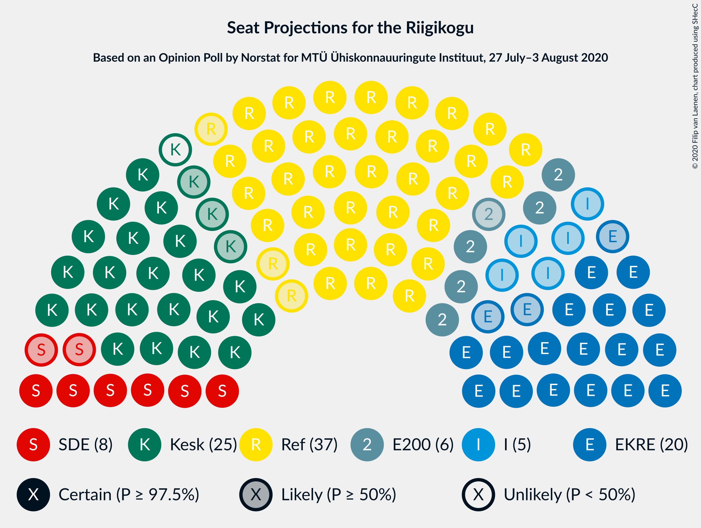
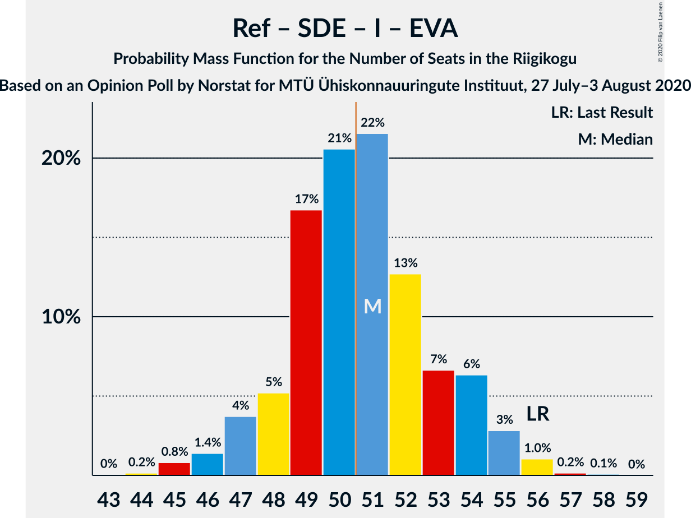
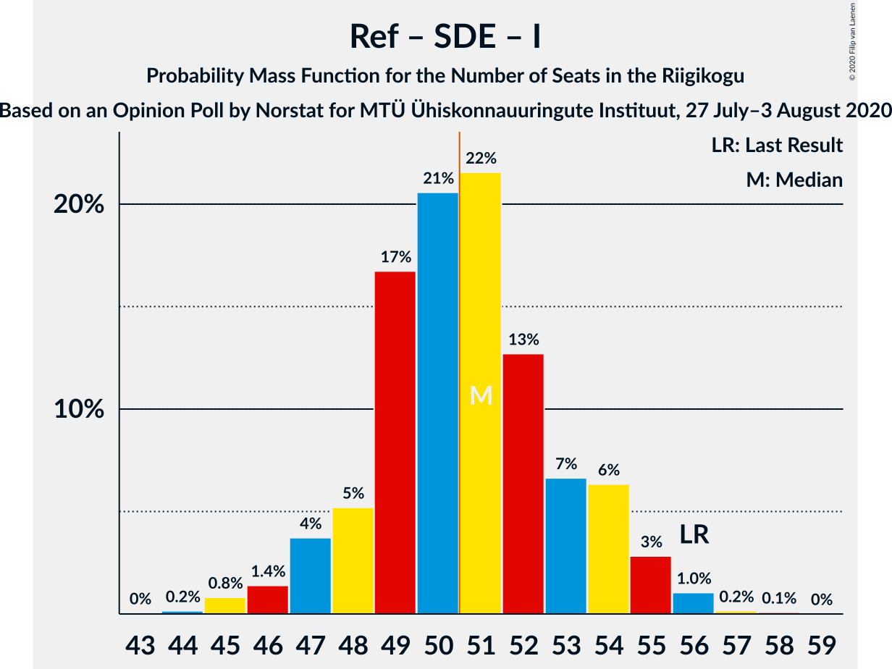

# Opinion Poll by Norstat for MTÜ Ühiskonnauuringute Instituut, 27 July–3 August 2020

<a href="#voting-intentions">Voting Intentions</a> | <a href="#seats">Seats</a> | <a href="#coalitions">Coalitions</a> | <a href="#technical-information">Technical Information</a>

## Voting Intentions

### Confidence Intervals

| Party | Last Result | Poll Result | 80% Confidence Interval | 90% Confidence Interval | 95% Confidence Interval | 99% Confidence Interval |
|:-----:|:-----------:|:-----------:|:-----------------------:|:-----------------------:|:-----------------------:|:-----------------------:|
| Eesti Reformierakond | 28.9% | 33.0% | 31.1–34.9% |30.6–35.5% |30.1–36.0% |29.3–36.9% |
| Eesti Keskerakond | 23.1% | 22.5% | 20.9–24.3% |20.4–24.8% |20.0–25.2% |19.3–26.1% |
| Eesti Konservatiivne Rahvaerakond | 17.8% | 18.4% | 16.9–20.1% |16.5–20.5% |16.1–20.9% |15.4–21.7% |
| Sotsiaaldemokraatlik Erakond | 9.8% | 8.8% | 7.7–10.1% |7.5–10.4% |7.2–10.7% |6.7–11.4% |
| Eesti 200 | 4.4% | 6.8% | 5.9–7.9% |5.6–8.3% |5.4–8.5% |5.0–9.1% |
| Erakond Isamaa | 11.4% | 5.9% | 5.0–7.0% |4.8–7.3% |4.6–7.5% |4.2–8.1% |
| Erakond Eestimaa Rohelised | 1.8% | 2.6% | 2.1–3.4% |1.9–3.6% |1.8–3.8% |1.6–4.2% |
| Eesti Vabaerakond | 1.2% | 0.9% | 0.6–1.4% |0.5–1.6% |0.5–1.7% |0.4–2.0% |

*Note:* The poll result column reflects the actual value used in the calculations. Published results may vary slightly, and in addition be rounded to fewer digits.

## Seats

### Confidence Intervals

| Party | Last Result | Median | 80% Confidence Interval | 90% Confidence Interval | 95% Confidence Interval | 99% Confidence Interval |
|:-----:|:-----------:|:------:|:-----------------------:|:-----------------------:|:-----------------------:|:-----------------------:|
| <a href="#eesti-reformierakond">Eesti Reformierakond</a> | 34 | 37 | 35–40 |35–41 |34–42 |33–43 |
| <a href="#eesti-keskerakond">Eesti Keskerakond</a> | 26 | 24 | 23–27 |22–27 |21–28 |20–29 |
| <a href="#eesti-konservatiivne-rahvaerakond">Eesti Konservatiivne Rahvaerakond</a> | 19 | 20 | 18–21 |17–22 |17–22 |16–23 |
| <a href="#sotsiaaldemokraatlik-erakond">Sotsiaaldemokraatlik Erakond</a> | 10 | 8 | 7–10 |7–10 |6–10 |6–11 |
| <a href="#eesti-200">Eesti 200</a> | 0 | 6 | 5–7 |5–8 |5–8 |4–9 |
| <a href="#erakond-isamaa">Erakond Isamaa</a> | 12 | 5 | 0–6 |0–7 |0–7 |0–7 |
| <a href="#erakond-eestimaa-rohelised">Erakond Eestimaa Rohelised</a> | 0 | 0 | 0 |0 |0 |0 |
| <a href="#eesti-vabaerakond">Eesti Vabaerakond</a> | 0 | 0 | 0 |0 |0 |0 |

### Eesti Reformierakond

*For a full overview of the results for this party, see the [Eesti Reformierakond](party-eestireformierakond.html) page.*

| Number of Seats | Probability | Accumulated | Special Marks |
|:---------------:|:-----------:|:-----------:|:-------------:|
| 32 | 0.2% | 100% |  |
| 33 | 0.9% | 99.8% |  |
| 34 | 3% | 98.9% | Last Result |
| 35 | 8% | 95% |  |
| 36 | 19% | 88% |  |
| 37 | 21% | 69% | Median |
| 38 | 13% | 48% |  |
| 39 | 21% | 35% |  |
| 40 | 8% | 14% |  |
| 41 | 3% | 6% |  |
| 42 | 2% | 3% |  |
| 43 | 0.4% | 0.6% |  |
| 44 | 0.1% | 0.2% |  |
| 45 | 0% | 0.1% |  |
| 46 | 0% | 0% |  |

### Eesti Keskerakond

*For a full overview of the results for this party, see the [Eesti Keskerakond](party-eestikeskerakond.html) page.*

| Number of Seats | Probability | Accumulated | Special Marks |
|:---------------:|:-----------:|:-----------:|:-------------:|
| 20 | 1.0% | 100% |  |
| 21 | 3% | 99.0% |  |
| 22 | 6% | 96% |  |
| 23 | 16% | 90% |  |
| 24 | 24% | 74% | Median |
| 25 | 20% | 50% |  |
| 26 | 18% | 30% | Last Result |
| 27 | 7% | 12% |  |
| 28 | 3% | 4% |  |
| 29 | 0.9% | 1.0% |  |
| 30 | 0.1% | 0.2% |  |
| 31 | 0% | 0% |  |

### Eesti Konservatiivne Rahvaerakond

*For a full overview of the results for this party, see the [Eesti Konservatiivne Rahvaerakond](party-eestikonservatiivnerahvaerakond.html) page.*

| Number of Seats | Probability | Accumulated | Special Marks |
|:---------------:|:-----------:|:-----------:|:-------------:|
| 15 | 0.2% | 100% |  |
| 16 | 1.4% | 99.8% |  |
| 17 | 7% | 98% |  |
| 18 | 15% | 91% |  |
| 19 | 22% | 76% | Last Result |
| 20 | 28% | 54% | Median |
| 21 | 16% | 26% |  |
| 22 | 8% | 10% |  |
| 23 | 2% | 2% |  |
| 24 | 0.4% | 0.5% |  |
| 25 | 0.1% | 0.1% |  |
| 26 | 0% | 0% |  |

### Sotsiaaldemokraatlik Erakond

*For a full overview of the results for this party, see the [Sotsiaaldemokraatlik Erakond](party-sotsiaaldemokraatlikerakond.html) page.*

| Number of Seats | Probability | Accumulated | Special Marks |
|:---------------:|:-----------:|:-----------:|:-------------:|
| 5 | 0.1% | 100% |  |
| 6 | 3% | 99.9% |  |
| 7 | 18% | 97% |  |
| 8 | 36% | 80% | Median |
| 9 | 28% | 43% |  |
| 10 | 14% | 16% | Last Result |
| 11 | 2% | 2% |  |
| 12 | 0.2% | 0.2% |  |
| 13 | 0% | 0% |  |

### Eesti 200

*For a full overview of the results for this party, see the [Eesti 200](party-eesti200.html) page.*

| Number of Seats | Probability | Accumulated | Special Marks |
|:---------------:|:-----------:|:-----------:|:-------------:|
| 0 | 0.5% | 100% | Last Result |
| 1 | 0% | 99.5% |  |
| 2 | 0% | 99.5% |  |
| 3 | 0% | 99.5% |  |
| 4 | 2% | 99.5% |  |
| 5 | 14% | 98% |  |
| 6 | 48% | 83% | Median |
| 7 | 28% | 35% |  |
| 8 | 6% | 7% |  |
| 9 | 0.8% | 0.8% |  |
| 10 | 0% | 0% |  |

### Erakond Isamaa

*For a full overview of the results for this party, see the [Erakond Isamaa](party-erakondisamaa.html) page.*

| Number of Seats | Probability | Accumulated | Special Marks |
|:---------------:|:-----------:|:-----------:|:-------------:|
| 0 | 12% | 100% |  |
| 1 | 0% | 88% |  |
| 2 | 0% | 88% |  |
| 3 | 0% | 88% |  |
| 4 | 8% | 88% |  |
| 5 | 47% | 80% | Median |
| 6 | 28% | 33% |  |
| 7 | 5% | 5% |  |
| 8 | 0.5% | 0.5% |  |
| 9 | 0% | 0% |  |
| 10 | 0% | 0% |  |
| 11 | 0% | 0% |  |
| 12 | 0% | 0% | Last Result |

### Erakond Eestimaa Rohelised

*For a full overview of the results for this party, see the [Erakond Eestimaa Rohelised](party-erakondeestimaarohelised.html) page.*

| Number of Seats | Probability | Accumulated | Special Marks |
|:---------------:|:-----------:|:-----------:|:-------------:|
| 0 | 100% | 100% | Last Result, Median |

### Eesti Vabaerakond

*For a full overview of the results for this party, see the [Eesti Vabaerakond](party-eestivabaerakond.html) page.*

| Number of Seats | Probability | Accumulated | Special Marks |
|:---------------:|:-----------:|:-----------:|:-------------:|
| 0 | 100% | 100% | Last Result, Median |

## Coalitions

### Confidence Intervals

| Coalition | Last Result | Median | Majority? | 80% Confidence Interval | 90% Confidence Interval | 95% Confidence Interval | 99% Confidence Interval |
|:---------:|:-----------:|:------:|:---------:|:-----------------------:|:-----------------------:|:-----------------------:|:-----------------------:|
| Eesti Reformierakond – Eesti Keskerakond – Eesti Konservatiivne Rahvaerakond | 79 | 81 | 100% | 80–85 | 79–86 | 78–86 | 77–88 |
| Eesti Reformierakond – Eesti Keskerakond | 60 | 62 | 100% | 60–65 | 59–66 | 58–67 | 57–68 |
| Eesti Reformierakond – Eesti Konservatiivne Rahvaerakond – Erakond Isamaa | 65 | 62 | 100% | 59–64 | 59–65 | 58–66 | 57–67 |
| Eesti Reformierakond – Eesti Konservatiivne Rahvaerakond | 53 | 57 | 100% | 55–60 | 54–61 | 53–61 | 52–63 |
| Eesti Reformierakond – Sotsiaaldemokraatlik Erakond – Erakond Isamaa – Eesti Vabaerakond | 56 | 51 | 51% | 48–54 | 47–54 | 47–55 | 45–56 |
| Eesti Reformierakond – Sotsiaaldemokraatlik Erakond – Erakond Isamaa | 56 | 51 | 51% | 48–54 | 47–54 | 47–55 | 45–56 |
| Eesti Keskerakond – Eesti Konservatiivne Rahvaerakond – Erakond Isamaa | 57 | 49 | 21% | 46–51 | 45–52 | 45–53 | 43–54 |
| Eesti Reformierakond – Sotsiaaldemokraatlik Erakond | 44 | 46 | 2% | 44–49 | 43–49 | 42–50 | 41–51 |
| Eesti Keskerakond – Eesti Konservatiivne Rahvaerakond | 45 | 44 | 0.1% | 41–46 | 41–47 | 40–48 | 39–50 |
| Eesti Reformierakond – Erakond Isamaa | 46 | 42 | 0% | 39–45 | 39–46 | 38–46 | 36–47 |
| Eesti Keskerakond – Sotsiaaldemokraatlik Erakond – Erakond Isamaa | 48 | 38 | 0% | 35–40 | 34–41 | 33–42 | 32–42 |
| Eesti Keskerakond – Sotsiaaldemokraatlik Erakond | 36 | 33 | 0% | 31–35 | 30–36 | 29–37 | 28–38 |
| Eesti Konservatiivne Rahvaerakond – Sotsiaaldemokraatlik Erakond | 29 | 28 | 0% | 26–30 | 25–31 | 25–31 | 24–33 |

### Eesti Reformierakond – Eesti Keskerakond – Eesti Konservatiivne Rahvaerakond

| Number of Seats | Probability | Accumulated | Special Marks |
|:---------------:|:-----------:|:-----------:|:-------------:|
| 76 | 0.1% | 100% |  |
| 77 | 0.6% | 99.9% |  |
| 78 | 2% | 99.3% |  |
| 79 | 7% | 97% | Last Result |
| 80 | 18% | 90% |  |
| 81 | 27% | 72% | Median |
| 82 | 18% | 45% |  |
| 83 | 10% | 27% |  |
| 84 | 5% | 18% |  |
| 85 | 6% | 12% |  |
| 86 | 4% | 6% |  |
| 87 | 1.4% | 2% |  |
| 88 | 0.8% | 0.9% |  |
| 89 | 0.1% | 0.2% |  |
| 90 | 0% | 0% |  |

### Eesti Reformierakond – Eesti Keskerakond

| Number of Seats | Probability | Accumulated | Special Marks |
|:---------------:|:-----------:|:-----------:|:-------------:|
| 56 | 0.2% | 100% |  |
| 57 | 1.1% | 99.8% |  |
| 58 | 3% | 98.7% |  |
| 59 | 6% | 96% |  |
| 60 | 12% | 90% | Last Result |
| 61 | 20% | 78% | Median |
| 62 | 15% | 58% |  |
| 63 | 15% | 42% |  |
| 64 | 12% | 27% |  |
| 65 | 10% | 15% |  |
| 66 | 2% | 5% |  |
| 67 | 1.4% | 3% |  |
| 68 | 0.9% | 1.2% |  |
| 69 | 0.1% | 0.3% |  |
| 70 | 0.1% | 0.2% |  |
| 71 | 0% | 0% |  |

### Eesti Reformierakond – Eesti Konservatiivne Rahvaerakond – Erakond Isamaa

| Number of Seats | Probability | Accumulated | Special Marks |
|:---------------:|:-----------:|:-----------:|:-------------:|
| 55 | 0.1% | 100% |  |
| 56 | 0.3% | 99.9% |  |
| 57 | 1.3% | 99.7% |  |
| 58 | 3% | 98% |  |
| 59 | 6% | 96% |  |
| 60 | 15% | 89% |  |
| 61 | 18% | 74% |  |
| 62 | 15% | 56% | Median |
| 63 | 22% | 41% |  |
| 64 | 11% | 19% |  |
| 65 | 5% | 8% | Last Result |
| 66 | 2% | 3% |  |
| 67 | 0.6% | 0.9% |  |
| 68 | 0.2% | 0.3% |  |
| 69 | 0.1% | 0.1% |  |
| 70 | 0% | 0% |  |

### Eesti Reformierakond – Eesti Konservatiivne Rahvaerakond

| Number of Seats | Probability | Accumulated | Special Marks |
|:---------------:|:-----------:|:-----------:|:-------------:|
| 51 | 0.2% | 100% | Majority |
| 52 | 0.7% | 99.8% |  |
| 53 | 2% | 99.1% | Last Result |
| 54 | 6% | 97% |  |
| 55 | 13% | 91% |  |
| 56 | 17% | 78% |  |
| 57 | 20% | 61% | Median |
| 58 | 15% | 41% |  |
| 59 | 12% | 26% |  |
| 60 | 7% | 13% |  |
| 61 | 4% | 6% |  |
| 62 | 1.2% | 2% |  |
| 63 | 0.5% | 1.0% |  |
| 64 | 0.4% | 0.4% |  |
| 65 | 0% | 0.1% |  |
| 66 | 0% | 0% |  |

### Eesti Reformierakond – Sotsiaaldemokraatlik Erakond – Erakond Isamaa – Eesti Vabaerakond

| Number of Seats | Probability | Accumulated | Special Marks |
|:---------------:|:-----------:|:-----------:|:-------------:|
| 43 | 0% | 100% |  |
| 44 | 0.2% | 99.9% |  |
| 45 | 0.8% | 99.8% |  |
| 46 | 1.4% | 99.0% |  |
| 47 | 4% | 98% |  |
| 48 | 5% | 94% |  |
| 49 | 17% | 89% |  |
| 50 | 21% | 72% | Median |
| 51 | 22% | 51% | Majority |
| 52 | 13% | 30% |  |
| 53 | 7% | 17% |  |
| 54 | 6% | 10% |  |
| 55 | 3% | 4% |  |
| 56 | 1.0% | 1.3% | Last Result |
| 57 | 0.2% | 0.2% |  |
| 58 | 0.1% | 0.1% |  |
| 59 | 0% | 0% |  |

### Eesti Reformierakond – Sotsiaaldemokraatlik Erakond – Erakond Isamaa

| Number of Seats | Probability | Accumulated | Special Marks |
|:---------------:|:-----------:|:-----------:|:-------------:|
| 43 | 0% | 100% |  |
| 44 | 0.2% | 99.9% |  |
| 45 | 0.8% | 99.8% |  |
| 46 | 1.4% | 99.0% |  |
| 47 | 4% | 98% |  |
| 48 | 5% | 94% |  |
| 49 | 17% | 89% |  |
| 50 | 21% | 72% | Median |
| 51 | 22% | 51% | Majority |
| 52 | 13% | 30% |  |
| 53 | 7% | 17% |  |
| 54 | 6% | 10% |  |
| 55 | 3% | 4% |  |
| 56 | 1.0% | 1.3% | Last Result |
| 57 | 0.2% | 0.2% |  |
| 58 | 0.1% | 0.1% |  |
| 59 | 0% | 0% |  |

### Eesti Keskerakond – Eesti Konservatiivne Rahvaerakond – Erakond Isamaa

| Number of Seats | Probability | Accumulated | Special Marks |
|:---------------:|:-----------:|:-----------:|:-------------:|
| 41 | 0.1% | 100% |  |
| 42 | 0.1% | 99.9% |  |
| 43 | 0.5% | 99.8% |  |
| 44 | 2% | 99.3% |  |
| 45 | 3% | 98% |  |
| 46 | 10% | 94% |  |
| 47 | 9% | 84% |  |
| 48 | 15% | 75% |  |
| 49 | 19% | 60% | Median |
| 50 | 20% | 40% |  |
| 51 | 13% | 21% | Majority |
| 52 | 5% | 8% |  |
| 53 | 2% | 3% |  |
| 54 | 0.7% | 0.9% |  |
| 55 | 0.1% | 0.1% |  |
| 56 | 0% | 0% |  |
| 57 | 0% | 0% | Last Result |

### Eesti Reformierakond – Sotsiaaldemokraatlik Erakond

| Number of Seats | Probability | Accumulated | Special Marks |
|:---------------:|:-----------:|:-----------:|:-------------:|
| 40 | 0.2% | 100% |  |
| 41 | 0.7% | 99.8% |  |
| 42 | 2% | 99.1% |  |
| 43 | 6% | 97% |  |
| 44 | 17% | 91% | Last Result |
| 45 | 18% | 74% | Median |
| 46 | 18% | 56% |  |
| 47 | 17% | 38% |  |
| 48 | 7% | 21% |  |
| 49 | 10% | 14% |  |
| 50 | 3% | 5% |  |
| 51 | 1.3% | 2% | Majority |
| 52 | 0.3% | 0.5% |  |
| 53 | 0.1% | 0.2% |  |
| 54 | 0% | 0% |  |

### Eesti Keskerakond – Eesti Konservatiivne Rahvaerakond

| Number of Seats | Probability | Accumulated | Special Marks |
|:---------------:|:-----------:|:-----------:|:-------------:|
| 38 | 0.2% | 100% |  |
| 39 | 0.6% | 99.7% |  |
| 40 | 3% | 99.1% |  |
| 41 | 7% | 96% |  |
| 42 | 9% | 89% |  |
| 43 | 14% | 80% |  |
| 44 | 22% | 67% | Median |
| 45 | 24% | 45% | Last Result |
| 46 | 11% | 21% |  |
| 47 | 6% | 10% |  |
| 48 | 2% | 4% |  |
| 49 | 1.1% | 2% |  |
| 50 | 0.4% | 0.6% |  |
| 51 | 0.1% | 0.1% | Majority |
| 52 | 0% | 0% |  |

### Eesti Reformierakond – Erakond Isamaa

| Number of Seats | Probability | Accumulated | Special Marks |
|:---------------:|:-----------:|:-----------:|:-------------:|
| 35 | 0.1% | 100% |  |
| 36 | 0.5% | 99.9% |  |
| 37 | 1.1% | 99.4% |  |
| 38 | 2% | 98% |  |
| 39 | 8% | 97% |  |
| 40 | 8% | 89% |  |
| 41 | 17% | 81% |  |
| 42 | 16% | 64% | Median |
| 43 | 20% | 48% |  |
| 44 | 15% | 28% |  |
| 45 | 7% | 13% |  |
| 46 | 4% | 6% | Last Result |
| 47 | 1.5% | 2% |  |
| 48 | 0.3% | 0.5% |  |
| 49 | 0.1% | 0.1% |  |
| 50 | 0% | 0% |  |

### Eesti Keskerakond – Sotsiaaldemokraatlik Erakond – Erakond Isamaa

| Number of Seats | Probability | Accumulated | Special Marks |
|:---------------:|:-----------:|:-----------:|:-------------:|
| 30 | 0.1% | 100% |  |
| 31 | 0.4% | 99.9% |  |
| 32 | 0.9% | 99.5% |  |
| 33 | 2% | 98.6% |  |
| 34 | 5% | 97% |  |
| 35 | 7% | 92% |  |
| 36 | 12% | 85% |  |
| 37 | 19% | 73% | Median |
| 38 | 19% | 54% |  |
| 39 | 16% | 35% |  |
| 40 | 10% | 19% |  |
| 41 | 6% | 8% |  |
| 42 | 2% | 3% |  |
| 43 | 0.4% | 0.5% |  |
| 44 | 0.1% | 0.1% |  |
| 45 | 0% | 0% |  |
| 46 | 0% | 0% |  |
| 47 | 0% | 0% |  |
| 48 | 0% | 0% | Last Result |

### Eesti Keskerakond – Sotsiaaldemokraatlik Erakond

| Number of Seats | Probability | Accumulated | Special Marks |
|:---------------:|:-----------:|:-----------:|:-------------:|
| 27 | 0.1% | 100% |  |
| 28 | 0.6% | 99.9% |  |
| 29 | 2% | 99.3% |  |
| 30 | 6% | 97% |  |
| 31 | 14% | 92% |  |
| 32 | 21% | 78% | Median |
| 33 | 20% | 57% |  |
| 34 | 16% | 37% |  |
| 35 | 11% | 21% |  |
| 36 | 7% | 10% | Last Result |
| 37 | 2% | 3% |  |
| 38 | 0.6% | 0.7% |  |
| 39 | 0.1% | 0.2% |  |
| 40 | 0% | 0% |  |

### Eesti Konservatiivne Rahvaerakond – Sotsiaaldemokraatlik Erakond

| Number of Seats | Probability | Accumulated | Special Marks |
|:---------------:|:-----------:|:-----------:|:-------------:|
| 23 | 0.3% | 100% |  |
| 24 | 2% | 99.6% |  |
| 25 | 5% | 98% |  |
| 26 | 13% | 92% |  |
| 27 | 19% | 79% |  |
| 28 | 22% | 60% | Median |
| 29 | 18% | 38% | Last Result |
| 30 | 13% | 20% |  |
| 31 | 6% | 8% |  |
| 32 | 1.4% | 2% |  |
| 33 | 0.4% | 0.5% |  |
| 34 | 0.1% | 0.1% |  |
| 35 | 0% | 0% |  |

## Technical Information

### Opinion Poll

+ **Polling firm:** Norstat
+ **Commissioner(s):** MTÜ Ühiskonnauuringute Instituut
+ **Fieldwork period:** 27 July–3 August 2020

### Calculations

+ **Sample size:** 1000
+ **Simulations done:** 1,048,576
+ **Error estimate:** 0.88%

