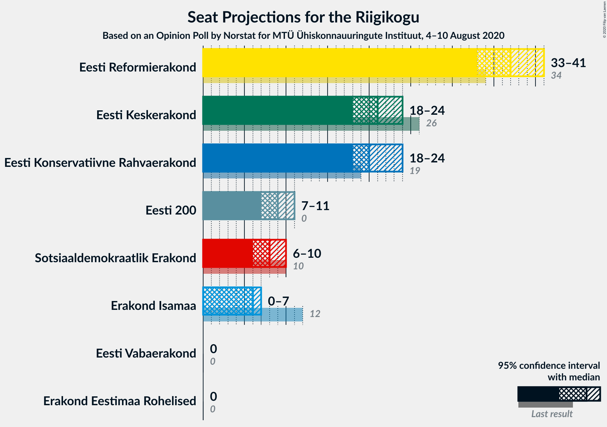
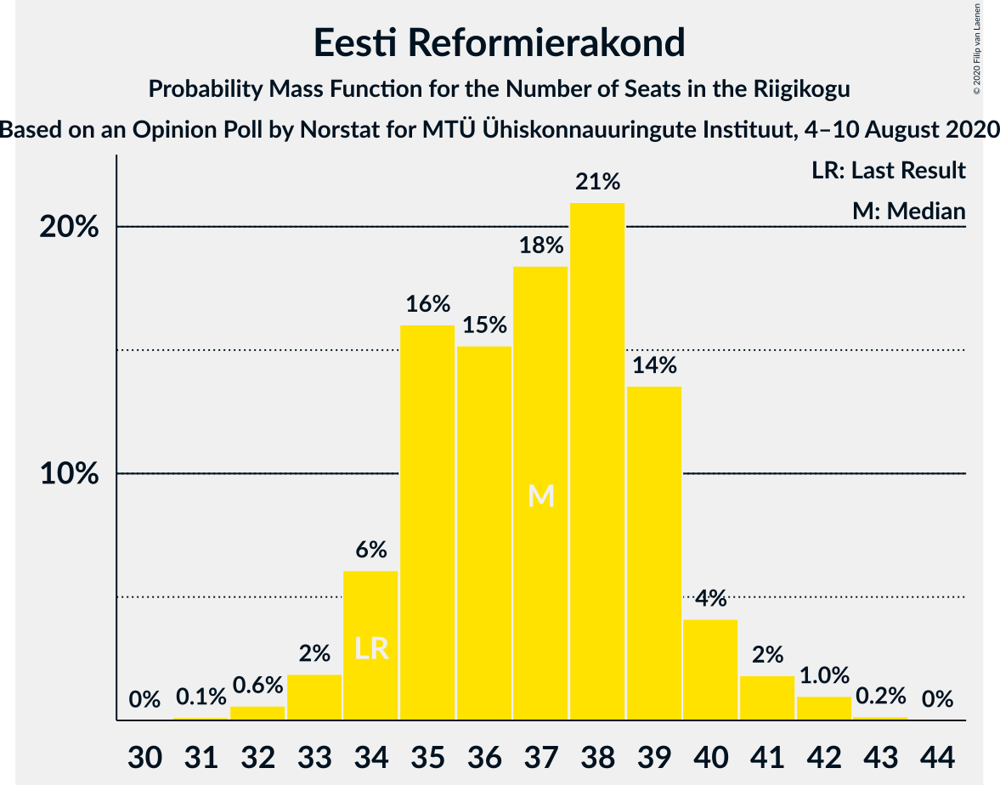
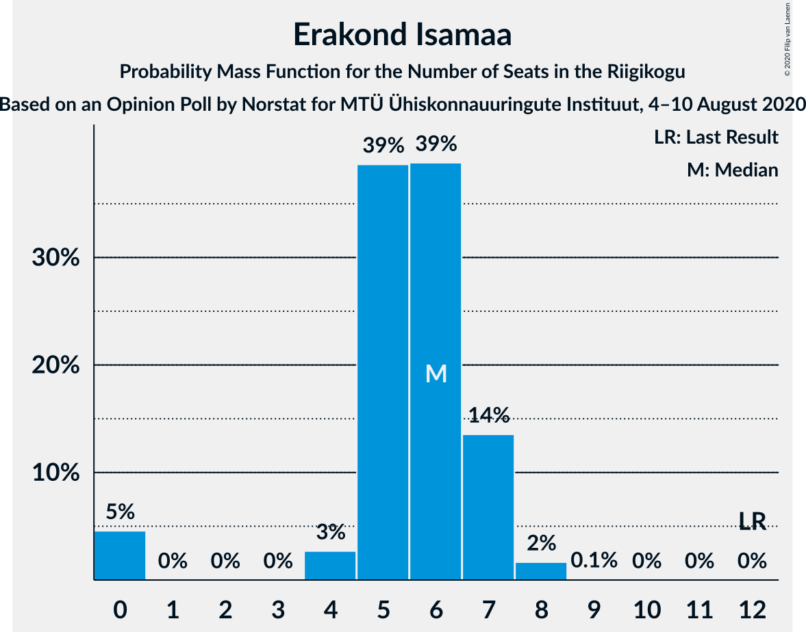
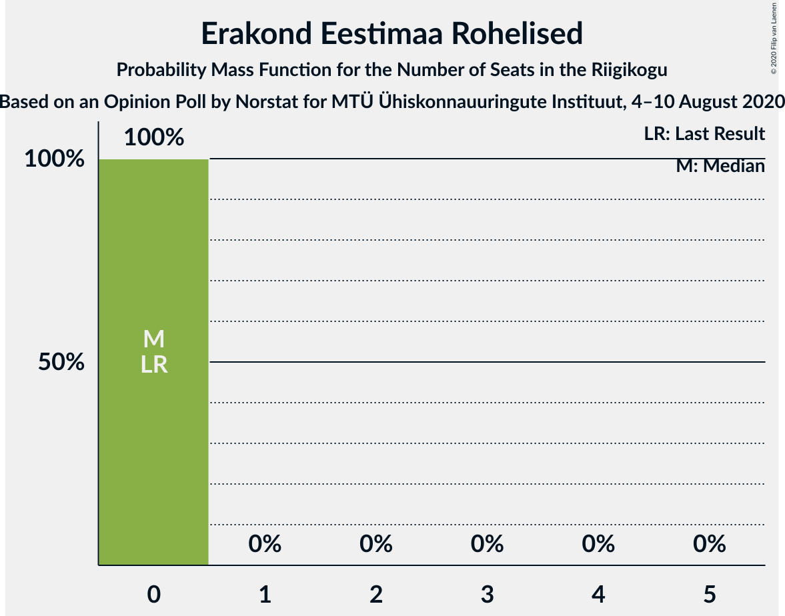
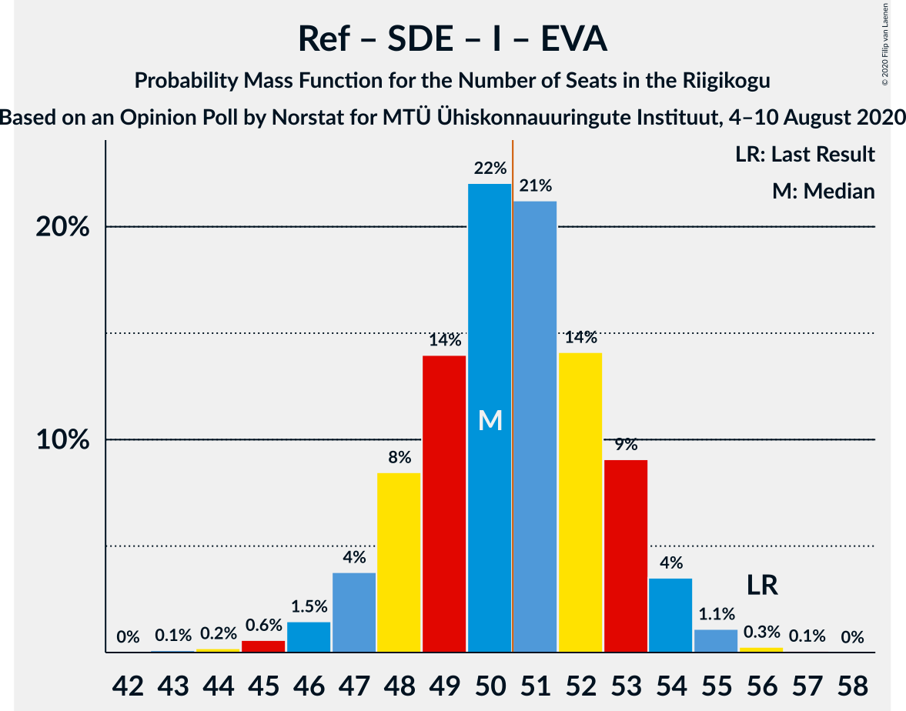

# Opinion Poll by Norstat for MTÜ Ühiskonnauuringute Instituut, 4–10 August 2020

<a href="#voting-intentions">Voting Intentions</a> | <a href="#seats">Seats</a> | <a href="#coalitions">Coalitions</a> | <a href="#technical-information">Technical Information</a>

## Voting Intentions

### Confidence Intervals

| Party | Last Result | Poll Result | 80% Confidence Interval | 90% Confidence Interval | 95% Confidence Interval | 99% Confidence Interval |
|:-----:|:-----------:|:-----------:|:-----------------------:|:-----------------------:|:-----------------------:|:-----------------------:|
| Eesti Reformierakond | 28.9% | 32.1% | 30.3–34.0% |29.7–34.6% |29.3–35.1% |28.4–36.0% |
| Eesti Keskerakond | 23.1% | 19.4% | 17.9–21.1% |17.4–21.6% |17.1–22.0% |16.4–22.8% |
| Eesti Konservatiivne Rahvaerakond | 17.8% | 19.0% | 17.5–20.7% |17.1–21.1% |16.7–21.6% |16.0–22.4% |
| Eesti 200 | 4.4% | 9.4% | 8.3–10.7% |8.0–11.1% |7.7–11.4% |7.2–12.0% |
| Sotsiaaldemokraatlik Erakond | 9.8% | 8.4% | 7.4–9.6% |7.1–10.0% |6.8–10.3% |6.4–10.9% |
| Erakond Isamaa | 11.4% | 6.2% | 5.3–7.3% |5.1–7.6% |4.9–7.9% |4.5–8.4% |
| Erakond Eestimaa Rohelised | 1.8% | 1.2% | 0.9–1.8% |0.8–1.9% |0.7–2.1% |0.5–2.4% |
| Eesti Vabaerakond | 1.2% | 1.1% | 0.8–1.7% |0.7–1.8% |0.6–2.0% |0.5–2.3% |

*Note:* The poll result column reflects the actual value used in the calculations. Published results may vary slightly, and in addition be rounded to fewer digits.

## Seats

### Confidence Intervals

| Party | Last Result | Median | 80% Confidence Interval | 90% Confidence Interval | 95% Confidence Interval | 99% Confidence Interval |
|:-----:|:-----------:|:------:|:-----------------------:|:-----------------------:|:-----------------------:|:-----------------------:|
| <a href="#eesti-reformierakond">Eesti Reformierakond</a> | 34 | 37 | 35–39 |34–40 |34–41 |32–42 |
| <a href="#eesti-keskerakond">Eesti Keskerakond</a> | 26 | 21 | 19–23 |18–24 |18–24 |17–25 |
| <a href="#eesti-konservatiivne-rahvaerakond">Eesti Konservatiivne Rahvaerakond</a> | 19 | 20 | 19–22 |18–23 |18–24 |17–24 |
| <a href="#eesti-200">Eesti 200</a> | 0 | 9 | 8–11 |8–11 |7–11 |6–12 |
| <a href="#sotsiaaldemokraatlik-erakond">Sotsiaaldemokraatlik Erakond</a> | 10 | 8 | 7–9 |7–10 |6–10 |6–11 |
| <a href="#erakond-isamaa">Erakond Isamaa</a> | 12 | 6 | 5–7 |0–7 |0–8 |0–8 |
| <a href="#erakond-eestimaa-rohelised">Erakond Eestimaa Rohelised</a> | 0 | 0 | 0 |0 |0 |0 |
| <a href="#eesti-vabaerakond">Eesti Vabaerakond</a> | 0 | 0 | 0 |0 |0 |0 |

### Eesti Reformierakond

*For a full overview of the results for this party, see the [Eesti Reformierakond](party-eestireformierakond.html) page.*

| Number of Seats | Probability | Accumulated | Special Marks |
|:---------------:|:-----------:|:-----------:|:-------------:|
| 31 | 0.1% | 100% |  |
| 32 | 0.6% | 99.9% |  |
| 33 | 1.4% | 99.2% |  |
| 34 | 6% | 98% | Last Result |
| 35 | 18% | 91% |  |
| 36 | 10% | 73% |  |
| 37 | 29% | 63% | Median |
| 38 | 14% | 34% |  |
| 39 | 13% | 21% |  |
| 40 | 3% | 8% |  |
| 41 | 4% | 5% |  |
| 42 | 0.7% | 0.9% |  |
| 43 | 0.1% | 0.2% |  |
| 44 | 0.1% | 0.1% |  |
| 45 | 0.1% | 0.1% |  |
| 46 | 0% | 0% |  |

### Eesti Keskerakond

*For a full overview of the results for this party, see the [Eesti Keskerakond](party-eestikeskerakond.html) page.*

| Number of Seats | Probability | Accumulated | Special Marks |
|:---------------:|:-----------:|:-----------:|:-------------:|
| 16 | 0.1% | 100% |  |
| 17 | 0.5% | 99.9% |  |
| 18 | 5% | 99.4% |  |
| 19 | 6% | 95% |  |
| 20 | 33% | 89% |  |
| 21 | 14% | 55% | Median |
| 22 | 29% | 41% |  |
| 23 | 7% | 12% |  |
| 24 | 4% | 6% |  |
| 25 | 1.1% | 1.5% |  |
| 26 | 0.3% | 0.4% | Last Result |
| 27 | 0% | 0% |  |

### Eesti Konservatiivne Rahvaerakond

*For a full overview of the results for this party, see the [Eesti Konservatiivne Rahvaerakond](party-eestikonservatiivnerahvaerakond.html) page.*

| Number of Seats | Probability | Accumulated | Special Marks |
|:---------------:|:-----------:|:-----------:|:-------------:|
| 16 | 0.1% | 100% |  |
| 17 | 2% | 99.8% |  |
| 18 | 4% | 98% |  |
| 19 | 19% | 93% | Last Result |
| 20 | 44% | 75% | Median |
| 21 | 9% | 31% |  |
| 22 | 13% | 22% |  |
| 23 | 6% | 9% |  |
| 24 | 3% | 3% |  |
| 25 | 0.3% | 0.5% |  |
| 26 | 0.1% | 0.1% |  |
| 27 | 0% | 0% |  |

### Eesti 200

*For a full overview of the results for this party, see the [Eesti 200](party-eesti200.html) page.*

| Number of Seats | Probability | Accumulated | Special Marks |
|:---------------:|:-----------:|:-----------:|:-------------:|
| 0 | 0% | 100% | Last Result |
| 1 | 0% | 100% |  |
| 2 | 0% | 100% |  |
| 3 | 0% | 100% |  |
| 4 | 0% | 100% |  |
| 5 | 0% | 100% |  |
| 6 | 0.6% | 100% |  |
| 7 | 3% | 99.4% |  |
| 8 | 28% | 97% |  |
| 9 | 25% | 68% | Median |
| 10 | 25% | 44% |  |
| 11 | 17% | 19% |  |
| 12 | 1.3% | 1.4% |  |
| 13 | 0.1% | 0.1% |  |
| 14 | 0% | 0% |  |

### Sotsiaaldemokraatlik Erakond

*For a full overview of the results for this party, see the [Sotsiaaldemokraatlik Erakond](party-sotsiaaldemokraatlikerakond.html) page.*

| Number of Seats | Probability | Accumulated | Special Marks |
|:---------------:|:-----------:|:-----------:|:-------------:|
| 5 | 0.3% | 100% |  |
| 6 | 5% | 99.7% |  |
| 7 | 27% | 95% |  |
| 8 | 32% | 68% | Median |
| 9 | 29% | 36% |  |
| 10 | 7% | 7% | Last Result |
| 11 | 0.8% | 0.9% |  |
| 12 | 0.1% | 0.1% |  |
| 13 | 0% | 0% |  |

### Erakond Isamaa

*For a full overview of the results for this party, see the [Erakond Isamaa](party-erakondisamaa.html) page.*

| Number of Seats | Probability | Accumulated | Special Marks |
|:---------------:|:-----------:|:-----------:|:-------------:|
| 0 | 6% | 100% |  |
| 1 | 0% | 94% |  |
| 2 | 0% | 94% |  |
| 3 | 0% | 94% |  |
| 4 | 2% | 94% |  |
| 5 | 34% | 92% |  |
| 6 | 46% | 58% | Median |
| 7 | 9% | 12% |  |
| 8 | 3% | 3% |  |
| 9 | 0.1% | 0.1% |  |
| 10 | 0% | 0% |  |
| 11 | 0% | 0% |  |
| 12 | 0% | 0% | Last Result |

### Erakond Eestimaa Rohelised

*For a full overview of the results for this party, see the [Erakond Eestimaa Rohelised](party-erakondeestimaarohelised.html) page.*

| Number of Seats | Probability | Accumulated | Special Marks |
|:---------------:|:-----------:|:-----------:|:-------------:|
| 0 | 100% | 100% | Last Result, Median |

### Eesti Vabaerakond

*For a full overview of the results for this party, see the [Eesti Vabaerakond](party-eestivabaerakond.html) page.*

| Number of Seats | Probability | Accumulated | Special Marks |
|:---------------:|:-----------:|:-----------:|:-------------:|
| 0 | 100% | 100% | Last Result, Median |

## Coalitions

### Confidence Intervals

| Coalition | Last Result | Median | Majority? | 80% Confidence Interval | 90% Confidence Interval | 95% Confidence Interval | 99% Confidence Interval |
|:---------:|:-----------:|:------:|:---------:|:-----------------------:|:-----------------------:|:-----------------------:|:-----------------------:|
| Eesti Reformierakond – Eesti Keskerakond – Eesti Konservatiivne Rahvaerakond | 79 | 78 | 100% | 76–80 | 76–82 | 75–83 | 74–84 |
| Eesti Reformierakond – Eesti Konservatiivne Rahvaerakond – Erakond Isamaa | 65 | 63 | 100% | 60–65 | 60–66 | 59–66 | 57–68 |
| Eesti Reformierakond – Eesti Keskerakond | 60 | 58 | 100% | 56–60 | 55–62 | 55–62 | 53–64 |
| Eesti Reformierakond – Eesti Konservatiivne Rahvaerakond | 53 | 57 | 100% | 54–60 | 54–61 | 54–61 | 53–64 |
| Eesti Reformierakond – Sotsiaaldemokraatlik Erakond – Erakond Isamaa – Eesti Vabaerakond | 56 | 50 | 46% | 48–53 | 47–54 | 46–54 | 45–55 |
| Eesti Reformierakond – Sotsiaaldemokraatlik Erakond – Erakond Isamaa | 56 | 50 | 46% | 48–53 | 47–54 | 46–54 | 45–55 |
| Eesti Keskerakond – Eesti Konservatiivne Rahvaerakond – Erakond Isamaa | 57 | 47 | 2% | 44–50 | 43–50 | 43–50 | 41–52 |
| Eesti Reformierakond – Sotsiaaldemokraatlik Erakond | 44 | 45 | 0.4% | 43–48 | 42–48 | 41–49 | 40–50 |
| Eesti Reformierakond – Erakond Isamaa | 46 | 43 | 0% | 40–44 | 39–46 | 38–46 | 37–47 |
| Eesti Keskerakond – Eesti Konservatiivne Rahvaerakond | 45 | 41 | 0% | 39–44 | 39–45 | 38–45 | 37–47 |
| Eesti Keskerakond – Sotsiaaldemokraatlik Erakond – Erakond Isamaa | 48 | 34 | 0% | 32–37 | 31–37 | 30–38 | 28–39 |
| Eesti Keskerakond – Sotsiaaldemokraatlik Erakond | 36 | 29 | 0% | 27–32 | 26–32 | 26–32 | 25–34 |
| Eesti Konservatiivne Rahvaerakond – Sotsiaaldemokraatlik Erakond | 29 | 28 | 0% | 27–31 | 26–31 | 25–32 | 23–33 |

### Eesti Reformierakond – Eesti Keskerakond – Eesti Konservatiivne Rahvaerakond

| Number of Seats | Probability | Accumulated | Special Marks |
|:---------------:|:-----------:|:-----------:|:-------------:|
| 73 | 0.2% | 100% |  |
| 74 | 0.4% | 99.8% |  |
| 75 | 3% | 99.4% |  |
| 76 | 17% | 96% |  |
| 77 | 18% | 80% |  |
| 78 | 17% | 61% | Median |
| 79 | 23% | 44% | Last Result |
| 80 | 12% | 21% |  |
| 81 | 3% | 9% |  |
| 82 | 3% | 6% |  |
| 83 | 1.3% | 3% |  |
| 84 | 1.2% | 2% |  |
| 85 | 0.4% | 0.4% |  |
| 86 | 0% | 0% |  |

### Eesti Reformierakond – Eesti Konservatiivne Rahvaerakond – Erakond Isamaa

| Number of Seats | Probability | Accumulated | Special Marks |
|:---------------:|:-----------:|:-----------:|:-------------:|
| 56 | 0.1% | 100% |  |
| 57 | 0.6% | 99.9% |  |
| 58 | 1.4% | 99.3% |  |
| 59 | 1.4% | 98% |  |
| 60 | 18% | 97% |  |
| 61 | 9% | 79% |  |
| 62 | 7% | 70% |  |
| 63 | 26% | 63% | Median |
| 64 | 24% | 37% |  |
| 65 | 6% | 13% | Last Result |
| 66 | 5% | 7% |  |
| 67 | 1.0% | 2% |  |
| 68 | 0.5% | 0.6% |  |
| 69 | 0.1% | 0.1% |  |
| 70 | 0% | 0% |  |

### Eesti Reformierakond – Eesti Keskerakond

| Number of Seats | Probability | Accumulated | Special Marks |
|:---------------:|:-----------:|:-----------:|:-------------:|
| 51 | 0% | 100% | Majority |
| 52 | 0.1% | 99.9% |  |
| 53 | 1.1% | 99.8% |  |
| 54 | 1.0% | 98.7% |  |
| 55 | 6% | 98% |  |
| 56 | 8% | 91% |  |
| 57 | 28% | 83% |  |
| 58 | 21% | 55% | Median |
| 59 | 19% | 34% |  |
| 60 | 6% | 15% | Last Result |
| 61 | 3% | 9% |  |
| 62 | 3% | 6% |  |
| 63 | 1.4% | 2% |  |
| 64 | 0.9% | 1.0% |  |
| 65 | 0.1% | 0.1% |  |
| 66 | 0% | 0% |  |

### Eesti Reformierakond – Eesti Konservatiivne Rahvaerakond

| Number of Seats | Probability | Accumulated | Special Marks |
|:---------------:|:-----------:|:-----------:|:-------------:|
| 51 | 0.1% | 100% | Majority |
| 52 | 0.3% | 99.8% |  |
| 53 | 0.8% | 99.6% | Last Result |
| 54 | 15% | 98.8% |  |
| 55 | 6% | 84% |  |
| 56 | 11% | 78% |  |
| 57 | 23% | 67% | Median |
| 58 | 14% | 44% |  |
| 59 | 17% | 30% |  |
| 60 | 8% | 13% |  |
| 61 | 4% | 5% |  |
| 62 | 0.4% | 2% |  |
| 63 | 0.6% | 1.2% |  |
| 64 | 0.5% | 0.6% |  |
| 65 | 0.1% | 0.1% |  |
| 66 | 0% | 0% |  |

### Eesti Reformierakond – Sotsiaaldemokraatlik Erakond – Erakond Isamaa – Eesti Vabaerakond

| Number of Seats | Probability | Accumulated | Special Marks |
|:---------------:|:-----------:|:-----------:|:-------------:|
| 43 | 0% | 100% |  |
| 44 | 0.1% | 99.9% |  |
| 45 | 0.6% | 99.8% |  |
| 46 | 3% | 99.2% |  |
| 47 | 4% | 96% |  |
| 48 | 8% | 92% |  |
| 49 | 10% | 84% |  |
| 50 | 28% | 74% |  |
| 51 | 20% | 46% | Median, Majority |
| 52 | 9% | 26% |  |
| 53 | 12% | 17% |  |
| 54 | 3% | 5% |  |
| 55 | 1.5% | 2% |  |
| 56 | 0.2% | 0.2% | Last Result |
| 57 | 0% | 0% |  |

### Eesti Reformierakond – Sotsiaaldemokraatlik Erakond – Erakond Isamaa

| Number of Seats | Probability | Accumulated | Special Marks |
|:---------------:|:-----------:|:-----------:|:-------------:|
| 43 | 0% | 100% |  |
| 44 | 0.1% | 99.9% |  |
| 45 | 0.6% | 99.8% |  |
| 46 | 3% | 99.2% |  |
| 47 | 4% | 96% |  |
| 48 | 8% | 92% |  |
| 49 | 10% | 84% |  |
| 50 | 28% | 74% |  |
| 51 | 20% | 46% | Median, Majority |
| 52 | 9% | 26% |  |
| 53 | 12% | 17% |  |
| 54 | 3% | 5% |  |
| 55 | 1.5% | 2% |  |
| 56 | 0.2% | 0.2% | Last Result |
| 57 | 0% | 0% |  |

### Eesti Keskerakond – Eesti Konservatiivne Rahvaerakond – Erakond Isamaa

| Number of Seats | Probability | Accumulated | Special Marks |
|:---------------:|:-----------:|:-----------:|:-------------:|
| 40 | 0.3% | 100% |  |
| 41 | 0.4% | 99.7% |  |
| 42 | 1.0% | 99.2% |  |
| 43 | 3% | 98% |  |
| 44 | 5% | 95% |  |
| 45 | 17% | 90% |  |
| 46 | 20% | 72% |  |
| 47 | 18% | 52% | Median |
| 48 | 19% | 34% |  |
| 49 | 4% | 15% |  |
| 50 | 9% | 11% |  |
| 51 | 1.1% | 2% | Majority |
| 52 | 0.6% | 0.7% |  |
| 53 | 0.1% | 0.2% |  |
| 54 | 0% | 0% |  |
| 55 | 0% | 0% |  |
| 56 | 0% | 0% |  |
| 57 | 0% | 0% | Last Result |

### Eesti Reformierakond – Sotsiaaldemokraatlik Erakond

| Number of Seats | Probability | Accumulated | Special Marks |
|:---------------:|:-----------:|:-----------:|:-------------:|
| 39 | 0.2% | 100% |  |
| 40 | 0.4% | 99.8% |  |
| 41 | 3% | 99.4% |  |
| 42 | 5% | 96% |  |
| 43 | 8% | 91% |  |
| 44 | 32% | 83% | Last Result |
| 45 | 13% | 51% | Median |
| 46 | 16% | 38% |  |
| 47 | 7% | 21% |  |
| 48 | 10% | 14% |  |
| 49 | 3% | 5% |  |
| 50 | 0.9% | 1.2% |  |
| 51 | 0.2% | 0.4% | Majority |
| 52 | 0.1% | 0.1% |  |
| 53 | 0.1% | 0.1% |  |
| 54 | 0% | 0% |  |

### Eesti Reformierakond – Erakond Isamaa

| Number of Seats | Probability | Accumulated | Special Marks |
|:---------------:|:-----------:|:-----------:|:-------------:|
| 34 | 0% | 100% |  |
| 35 | 0.2% | 99.9% |  |
| 36 | 0.1% | 99.8% |  |
| 37 | 2% | 99.7% |  |
| 38 | 2% | 98% |  |
| 39 | 4% | 96% |  |
| 40 | 8% | 92% |  |
| 41 | 18% | 84% |  |
| 42 | 10% | 66% |  |
| 43 | 33% | 57% | Median |
| 44 | 16% | 24% |  |
| 45 | 1.0% | 8% |  |
| 46 | 5% | 7% | Last Result |
| 47 | 2% | 2% |  |
| 48 | 0.1% | 0.1% |  |
| 49 | 0% | 0.1% |  |
| 50 | 0% | 0% |  |

### Eesti Keskerakond – Eesti Konservatiivne Rahvaerakond

| Number of Seats | Probability | Accumulated | Special Marks |
|:---------------:|:-----------:|:-----------:|:-------------:|
| 35 | 0.1% | 100% |  |
| 36 | 0.1% | 99.9% |  |
| 37 | 1.4% | 99.8% |  |
| 38 | 3% | 98% |  |
| 39 | 7% | 95% |  |
| 40 | 29% | 89% |  |
| 41 | 20% | 60% | Median |
| 42 | 16% | 40% |  |
| 43 | 12% | 25% |  |
| 44 | 6% | 13% |  |
| 45 | 6% | 7% | Last Result |
| 46 | 0.7% | 1.5% |  |
| 47 | 0.7% | 0.8% |  |
| 48 | 0.1% | 0.1% |  |
| 49 | 0% | 0% |  |

### Eesti Keskerakond – Sotsiaaldemokraatlik Erakond – Erakond Isamaa

| Number of Seats | Probability | Accumulated | Special Marks |
|:---------------:|:-----------:|:-----------:|:-------------:|
| 26 | 0% | 100% |  |
| 27 | 0.1% | 99.9% |  |
| 28 | 0.7% | 99.9% |  |
| 29 | 1.0% | 99.1% |  |
| 30 | 1.0% | 98% |  |
| 31 | 3% | 97% |  |
| 32 | 6% | 94% |  |
| 33 | 27% | 88% |  |
| 34 | 18% | 61% |  |
| 35 | 6% | 43% | Median |
| 36 | 13% | 37% |  |
| 37 | 21% | 24% |  |
| 38 | 2% | 3% |  |
| 39 | 0.5% | 1.0% |  |
| 40 | 0.3% | 0.4% |  |
| 41 | 0.1% | 0.1% |  |
| 42 | 0% | 0% |  |
| 43 | 0% | 0% |  |
| 44 | 0% | 0% |  |
| 45 | 0% | 0% |  |
| 46 | 0% | 0% |  |
| 47 | 0% | 0% |  |
| 48 | 0% | 0% | Last Result |

### Eesti Keskerakond – Sotsiaaldemokraatlik Erakond

| Number of Seats | Probability | Accumulated | Special Marks |
|:---------------:|:-----------:|:-----------:|:-------------:|
| 24 | 0.1% | 100% |  |
| 25 | 0.9% | 99.8% |  |
| 26 | 5% | 98.9% |  |
| 27 | 16% | 94% |  |
| 28 | 20% | 77% |  |
| 29 | 17% | 57% | Median |
| 30 | 13% | 40% |  |
| 31 | 16% | 27% |  |
| 32 | 8% | 10% |  |
| 33 | 1.2% | 2% |  |
| 34 | 0.6% | 0.8% |  |
| 35 | 0.1% | 0.1% |  |
| 36 | 0% | 0% | Last Result |

### Eesti Konservatiivne Rahvaerakond – Sotsiaaldemokraatlik Erakond

| Number of Seats | Probability | Accumulated | Special Marks |
|:---------------:|:-----------:|:-----------:|:-------------:|
| 23 | 0.6% | 100% |  |
| 24 | 1.2% | 99.4% |  |
| 25 | 2% | 98% |  |
| 26 | 3% | 96% |  |
| 27 | 17% | 93% |  |
| 28 | 36% | 76% | Median |
| 29 | 22% | 40% | Last Result |
| 30 | 7% | 18% |  |
| 31 | 6% | 11% |  |
| 32 | 3% | 5% |  |
| 33 | 1.0% | 1.5% |  |
| 34 | 0.4% | 0.4% |  |
| 35 | 0.1% | 0.1% |  |
| 36 | 0% | 0% |  |

## Technical Information

### Opinion Poll

+ **Polling firm:** Norstat
+ **Commissioner(s):** MTÜ Ühiskonnauuringute Instituut
+ **Fieldwork period:** 4–10 August 2020

### Calculations

+ **Sample size:** 1000
+ **Simulations done:** 131,072
+ **Error estimate:** 2.12%

