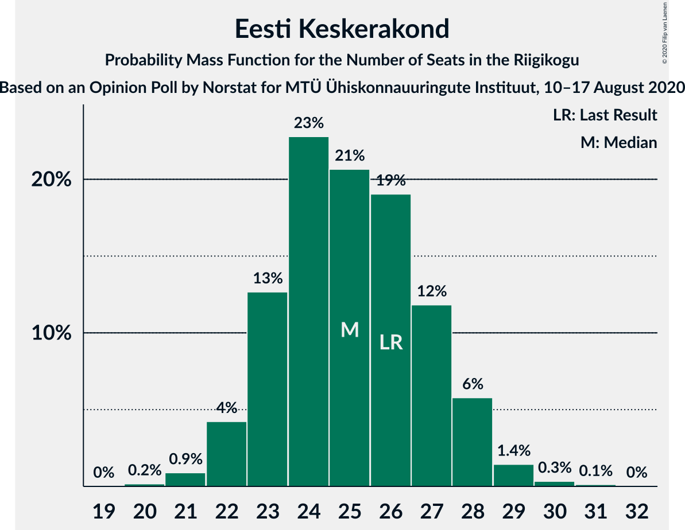
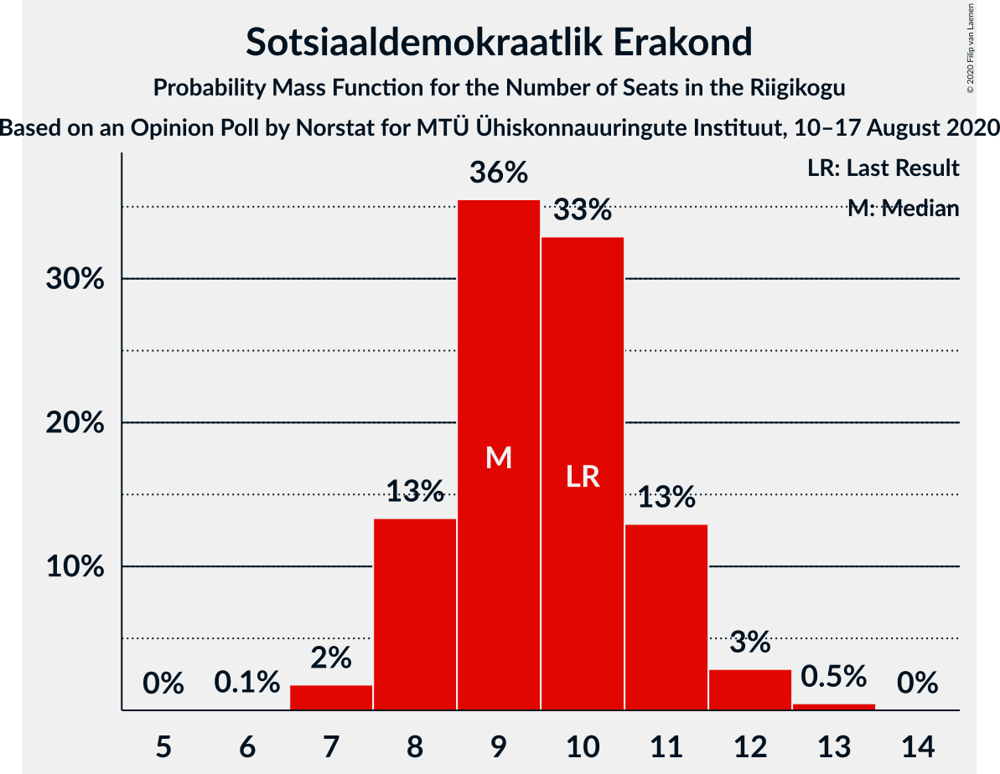

# Opinion Poll by Norstat for MTÜ Ühiskonnauuringute Instituut, 10–17 August 2020

<a href="#voting-intentions">Voting Intentions</a> | <a href="#seats">Seats</a> | <a href="#coalitions">Coalitions</a> | <a href="#technical-information">Technical Information</a>

## Voting Intentions

### Confidence Intervals

| Party | Last Result | Poll Result | 80% Confidence Interval | 90% Confidence Interval | 95% Confidence Interval | 99% Confidence Interval |
|:-----:|:-----------:|:-----------:|:-----------------------:|:-----------------------:|:-----------------------:|:-----------------------:|
| Eesti Reformierakond | 28.9% | 33.0% | 31.1–34.9% |30.6–35.5% |30.1–36.0% |29.3–36.9% |
| Eesti Keskerakond | 23.1% | 22.9% | 21.3–24.7% |20.8–25.2% |20.4–25.6% |19.6–26.5% |
| Eesti Konservatiivne Rahvaerakond | 17.8% | 15.4% | 14.0–16.9% |13.6–17.4% |13.3–17.8% |12.7–18.5% |
| Sotsiaaldemokraatlik Erakond | 9.8% | 9.8% | 8.7–11.1% |8.4–11.5% |8.1–11.8% |7.6–12.5% |
| Eesti 200 | 4.4% | 7.9% | 6.9–9.1% |6.6–9.4% |6.4–9.7% |5.9–10.3% |
| Erakond Isamaa | 11.4% | 6.1% | 5.2–7.2% |5.0–7.5% |4.8–7.8% |4.4–8.3% |
| Erakond Eestimaa Rohelised | 1.8% | 2.3% | 1.8–3.0% |1.6–3.2% |1.5–3.4% |1.3–3.8% |
| Eesti Vabaerakond | 1.2% | 0.6% | 0.4–1.1% |0.3–1.2% |0.3–1.3% |0.2–1.6% |

*Note:* The poll result column reflects the actual value used in the calculations. Published results may vary slightly, and in addition be rounded to fewer digits.

## Seats

### Confidence Intervals

| Party | Last Result | Median | 80% Confidence Interval | 90% Confidence Interval | 95% Confidence Interval | 99% Confidence Interval |
|:-----:|:-----------:|:------:|:-----------------------:|:-----------------------:|:-----------------------:|:-----------------------:|
| <a href="#eesti-reformierakond">Eesti Reformierakond</a> | 34 | 38 | 35–40 |35–41 |34–42 |33–43 |
| <a href="#eesti-keskerakond">Eesti Keskerakond</a> | 26 | 25 | 23–27 |22–28 |22–28 |21–29 |
| <a href="#eesti-konservatiivne-rahvaerakond">Eesti Konservatiivne Rahvaerakond</a> | 19 | 16 | 14–18 |14–18 |13–19 |13–20 |
| <a href="#sotsiaaldemokraatlik-erakond">Sotsiaaldemokraatlik Erakond</a> | 10 | 9 | 8–11 |8–11 |8–12 |7–13 |
| <a href="#eesti-200">Eesti 200</a> | 0 | 7 | 6–9 |6–9 |6–9 |5–10 |
| <a href="#erakond-isamaa">Erakond Isamaa</a> | 12 | 5 | 4–6 |0–7 |0–7 |0–8 |
| <a href="#erakond-eestimaa-rohelised">Erakond Eestimaa Rohelised</a> | 0 | 0 | 0 |0 |0 |0 |
| <a href="#eesti-vabaerakond">Eesti Vabaerakond</a> | 0 | 0 | 0 |0 |0 |0 |

### Eesti Reformierakond

*For a full overview of the results for this party, see the [Eesti Reformierakond](party-eestireformierakond.html) page.*

| Number of Seats | Probability | Accumulated | Special Marks |
|:---------------:|:-----------:|:-----------:|:-------------:|
| 32 | 0.2% | 100% |  |
| 33 | 0.7% | 99.8% |  |
| 34 | 3% | 99.1% | Last Result |
| 35 | 7% | 96% |  |
| 36 | 15% | 90% |  |
| 37 | 18% | 74% |  |
| 38 | 24% | 56% | Median |
| 39 | 14% | 33% |  |
| 40 | 11% | 19% |  |
| 41 | 5% | 8% |  |
| 42 | 2% | 3% |  |
| 43 | 0.7% | 1.0% |  |
| 44 | 0.2% | 0.2% |  |
| 45 | 0% | 0% |  |

### Eesti Keskerakond

*For a full overview of the results for this party, see the [Eesti Keskerakond](party-eestikeskerakond.html) page.*

| Number of Seats | Probability | Accumulated | Special Marks |
|:---------------:|:-----------:|:-----------:|:-------------:|
| 20 | 0.2% | 100% |  |
| 21 | 0.9% | 99.8% |  |
| 22 | 4% | 98.9% |  |
| 23 | 13% | 95% |  |
| 24 | 23% | 82% |  |
| 25 | 21% | 59% | Median |
| 26 | 19% | 39% | Last Result |
| 27 | 12% | 20% |  |
| 28 | 6% | 8% |  |
| 29 | 1.4% | 2% |  |
| 30 | 0.3% | 0.5% |  |
| 31 | 0.1% | 0.1% |  |
| 32 | 0% | 0% |  |

### Eesti Konservatiivne Rahvaerakond

*For a full overview of the results for this party, see the [Eesti Konservatiivne Rahvaerakond](party-eestikonservatiivnerahvaerakond.html) page.*

| Number of Seats | Probability | Accumulated | Special Marks |
|:---------------:|:-----------:|:-----------:|:-------------:|
| 12 | 0.3% | 100% |  |
| 13 | 3% | 99.7% |  |
| 14 | 9% | 97% |  |
| 15 | 24% | 88% |  |
| 16 | 29% | 64% | Median |
| 17 | 21% | 35% |  |
| 18 | 10% | 14% |  |
| 19 | 4% | 4% | Last Result |
| 20 | 0.6% | 0.7% |  |
| 21 | 0.1% | 0.1% |  |
| 22 | 0% | 0% |  |

### Sotsiaaldemokraatlik Erakond

*For a full overview of the results for this party, see the [Sotsiaaldemokraatlik Erakond](party-sotsiaaldemokraatlikerakond.html) page.*

| Number of Seats | Probability | Accumulated | Special Marks |
|:---------------:|:-----------:|:-----------:|:-------------:|
| 6 | 0.1% | 100% |  |
| 7 | 2% | 99.9% |  |
| 8 | 13% | 98% |  |
| 9 | 36% | 85% | Median |
| 10 | 33% | 49% | Last Result |
| 11 | 13% | 16% |  |
| 12 | 3% | 3% |  |
| 13 | 0.5% | 0.5% |  |
| 14 | 0% | 0% |  |

### Eesti 200

*For a full overview of the results for this party, see the [Eesti 200](party-eesti200.html) page.*

| Number of Seats | Probability | Accumulated | Special Marks |
|:---------------:|:-----------:|:-----------:|:-------------:|
| 0 | 0% | 100% | Last Result |
| 1 | 0% | 100% |  |
| 2 | 0% | 100% |  |
| 3 | 0% | 100% |  |
| 4 | 0% | 100% |  |
| 5 | 2% | 100% |  |
| 6 | 13% | 98% |  |
| 7 | 42% | 86% | Median |
| 8 | 33% | 44% |  |
| 9 | 9% | 11% |  |
| 10 | 2% | 2% |  |
| 11 | 0.1% | 0.2% |  |
| 12 | 0% | 0% |  |

### Erakond Isamaa

*For a full overview of the results for this party, see the [Erakond Isamaa](party-erakondisamaa.html) page.*

| Number of Seats | Probability | Accumulated | Special Marks |
|:---------------:|:-----------:|:-----------:|:-------------:|
| 0 | 5% | 100% |  |
| 1 | 0% | 95% |  |
| 2 | 0% | 95% |  |
| 3 | 0% | 95% |  |
| 4 | 5% | 95% |  |
| 5 | 45% | 90% | Median |
| 6 | 35% | 44% |  |
| 7 | 8% | 9% |  |
| 8 | 0.8% | 0.9% |  |
| 9 | 0.1% | 0.1% |  |
| 10 | 0% | 0% |  |
| 11 | 0% | 0% |  |
| 12 | 0% | 0% | Last Result |

### Erakond Eestimaa Rohelised

*For a full overview of the results for this party, see the [Erakond Eestimaa Rohelised](party-erakondeestimaarohelised.html) page.*

| Number of Seats | Probability | Accumulated | Special Marks |
|:---------------:|:-----------:|:-----------:|:-------------:|
| 0 | 100% | 100% | Last Result, Median |

### Eesti Vabaerakond

*For a full overview of the results for this party, see the [Eesti Vabaerakond](party-eestivabaerakond.html) page.*

| Number of Seats | Probability | Accumulated | Special Marks |
|:---------------:|:-----------:|:-----------:|:-------------:|
| 0 | 100% | 100% | Last Result, Median |

## Coalitions

### Confidence Intervals

| Coalition | Last Result | Median | Majority? | 80% Confidence Interval | 90% Confidence Interval | 95% Confidence Interval | 99% Confidence Interval |
|:---------:|:-----------:|:------:|:---------:|:-----------------------:|:-----------------------:|:-----------------------:|:-----------------------:|
| Eesti Reformierakond – Eesti Keskerakond – Eesti Konservatiivne Rahvaerakond | 79 | 79 | 100% | 77–81 | 76–82 | 76–83 | 75–85 |
| Eesti Reformierakond – Eesti Keskerakond | 60 | 63 | 100% | 60–65 | 60–66 | 59–67 | 58–69 |
| Eesti Reformierakond – Eesti Konservatiivne Rahvaerakond – Erakond Isamaa | 65 | 59 | 100% | 56–61 | 56–62 | 55–63 | 54–64 |
| Eesti Reformierakond – Eesti Konservatiivne Rahvaerakond | 53 | 54 | 96% | 51–56 | 51–57 | 50–58 | 49–60 |
| Eesti Reformierakond – Sotsiaaldemokraatlik Erakond – Erakond Isamaa – Eesti Vabaerakond | 56 | 53 | 85% | 50–55 | 49–56 | 49–56 | 47–57 |
| Eesti Reformierakond – Sotsiaaldemokraatlik Erakond – Erakond Isamaa | 56 | 53 | 85% | 50–55 | 49–56 | 49–56 | 47–57 |
| Eesti Reformierakond – Sotsiaaldemokraatlik Erakond | 44 | 47 | 6% | 45–50 | 44–51 | 43–51 | 43–53 |
| Eesti Keskerakond – Eesti Konservatiivne Rahvaerakond – Erakond Isamaa | 57 | 46 | 1.3% | 44–48 | 43–50 | 42–50 | 41–51 |
| Eesti Reformierakond – Erakond Isamaa | 46 | 43 | 0% | 41–46 | 40–46 | 39–47 | 37–48 |
| Eesti Keskerakond – Eesti Konservatiivne Rahvaerakond | 45 | 41 | 0% | 39–43 | 38–44 | 37–45 | 36–46 |
| Eesti Keskerakond – Sotsiaaldemokraatlik Erakond – Erakond Isamaa | 48 | 40 | 0% | 37–42 | 36–43 | 36–44 | 34–45 |
| Eesti Keskerakond – Sotsiaaldemokraatlik Erakond | 36 | 34 | 0% | 32–37 | 32–38 | 31–38 | 30–40 |
| Eesti Konservatiivne Rahvaerakond – Sotsiaaldemokraatlik Erakond | 29 | 25 | 0% | 24–28 | 23–28 | 22–29 | 22–30 |

### Eesti Reformierakond – Eesti Keskerakond – Eesti Konservatiivne Rahvaerakond

| Number of Seats | Probability | Accumulated | Special Marks |
|:---------------:|:-----------:|:-----------:|:-------------:|
| 73 | 0.1% | 100% |  |
| 74 | 0.4% | 99.9% |  |
| 75 | 2% | 99.5% |  |
| 76 | 5% | 98% |  |
| 77 | 12% | 93% |  |
| 78 | 24% | 81% |  |
| 79 | 27% | 57% | Last Result, Median |
| 80 | 16% | 30% |  |
| 81 | 7% | 13% |  |
| 82 | 3% | 7% |  |
| 83 | 2% | 4% |  |
| 84 | 0.9% | 2% |  |
| 85 | 1.0% | 1.3% |  |
| 86 | 0.3% | 0.3% |  |
| 87 | 0% | 0% |  |

### Eesti Reformierakond – Eesti Keskerakond

| Number of Seats | Probability | Accumulated | Special Marks |
|:---------------:|:-----------:|:-----------:|:-------------:|
| 57 | 0.2% | 100% |  |
| 58 | 0.8% | 99.8% |  |
| 59 | 3% | 99.0% |  |
| 60 | 8% | 96% | Last Result |
| 61 | 11% | 88% |  |
| 62 | 23% | 77% |  |
| 63 | 18% | 54% | Median |
| 64 | 19% | 36% |  |
| 65 | 10% | 17% |  |
| 66 | 3% | 7% |  |
| 67 | 2% | 4% |  |
| 68 | 1.1% | 2% |  |
| 69 | 0.3% | 0.6% |  |
| 70 | 0.2% | 0.3% |  |
| 71 | 0.1% | 0.1% |  |
| 72 | 0% | 0% |  |

### Eesti Reformierakond – Eesti Konservatiivne Rahvaerakond – Erakond Isamaa

| Number of Seats | Probability | Accumulated | Special Marks |
|:---------------:|:-----------:|:-----------:|:-------------:|
| 52 | 0.1% | 100% |  |
| 53 | 0.3% | 99.9% |  |
| 54 | 0.8% | 99.6% |  |
| 55 | 2% | 98.8% |  |
| 56 | 7% | 96% |  |
| 57 | 8% | 89% |  |
| 58 | 20% | 81% |  |
| 59 | 20% | 61% | Median |
| 60 | 20% | 42% |  |
| 61 | 12% | 22% |  |
| 62 | 6% | 10% |  |
| 63 | 2% | 3% |  |
| 64 | 0.7% | 0.8% |  |
| 65 | 0.1% | 0.1% | Last Result |
| 66 | 0% | 0% |  |

### Eesti Reformierakond – Eesti Konservatiivne Rahvaerakond

| Number of Seats | Probability | Accumulated | Special Marks |
|:---------------:|:-----------:|:-----------:|:-------------:|
| 47 | 0.1% | 100% |  |
| 48 | 0.2% | 99.9% |  |
| 49 | 1.3% | 99.7% |  |
| 50 | 2% | 98% |  |
| 51 | 9% | 96% | Majority |
| 52 | 11% | 87% |  |
| 53 | 22% | 76% | Last Result |
| 54 | 19% | 55% | Median |
| 55 | 18% | 36% |  |
| 56 | 9% | 18% |  |
| 57 | 5% | 9% |  |
| 58 | 3% | 4% |  |
| 59 | 0.7% | 1.3% |  |
| 60 | 0.5% | 0.6% |  |
| 61 | 0.1% | 0.1% |  |
| 62 | 0% | 0% |  |

### Eesti Reformierakond – Sotsiaaldemokraatlik Erakond – Erakond Isamaa – Eesti Vabaerakond

| Number of Seats | Probability | Accumulated | Special Marks |
|:---------------:|:-----------:|:-----------:|:-------------:|
| 46 | 0.2% | 100% |  |
| 47 | 0.4% | 99.8% |  |
| 48 | 2% | 99.4% |  |
| 49 | 4% | 98% |  |
| 50 | 9% | 94% |  |
| 51 | 16% | 85% | Majority |
| 52 | 17% | 69% | Median |
| 53 | 21% | 51% |  |
| 54 | 13% | 30% |  |
| 55 | 9% | 17% |  |
| 56 | 6% | 8% | Last Result |
| 57 | 1.4% | 2% |  |
| 58 | 0.4% | 0.5% |  |
| 59 | 0.1% | 0.1% |  |
| 60 | 0% | 0% |  |

### Eesti Reformierakond – Sotsiaaldemokraatlik Erakond – Erakond Isamaa

| Number of Seats | Probability | Accumulated | Special Marks |
|:---------------:|:-----------:|:-----------:|:-------------:|
| 46 | 0.2% | 100% |  |
| 47 | 0.4% | 99.8% |  |
| 48 | 2% | 99.4% |  |
| 49 | 4% | 98% |  |
| 50 | 9% | 94% |  |
| 51 | 16% | 85% | Majority |
| 52 | 17% | 69% | Median |
| 53 | 21% | 51% |  |
| 54 | 13% | 30% |  |
| 55 | 9% | 17% |  |
| 56 | 6% | 8% | Last Result |
| 57 | 1.4% | 2% |  |
| 58 | 0.4% | 0.5% |  |
| 59 | 0.1% | 0.1% |  |
| 60 | 0% | 0% |  |

### Eesti Reformierakond – Sotsiaaldemokraatlik Erakond

| Number of Seats | Probability | Accumulated | Special Marks |
|:---------------:|:-----------:|:-----------:|:-------------:|
| 41 | 0.1% | 100% |  |
| 42 | 0.3% | 99.9% |  |
| 43 | 2% | 99.6% |  |
| 44 | 4% | 97% | Last Result |
| 45 | 13% | 94% |  |
| 46 | 17% | 81% |  |
| 47 | 17% | 64% | Median |
| 48 | 22% | 47% |  |
| 49 | 9% | 24% |  |
| 50 | 9% | 15% |  |
| 51 | 4% | 6% | Majority |
| 52 | 1.1% | 2% |  |
| 53 | 0.7% | 0.8% |  |
| 54 | 0.1% | 0.2% |  |
| 55 | 0.1% | 0.1% |  |
| 56 | 0% | 0% |  |

### Eesti Keskerakond – Eesti Konservatiivne Rahvaerakond – Erakond Isamaa

| Number of Seats | Probability | Accumulated | Special Marks |
|:---------------:|:-----------:|:-----------:|:-------------:|
| 39 | 0.1% | 100% |  |
| 40 | 0.2% | 99.9% |  |
| 41 | 1.3% | 99.6% |  |
| 42 | 2% | 98% |  |
| 43 | 5% | 96% |  |
| 44 | 9% | 92% |  |
| 45 | 16% | 82% |  |
| 46 | 18% | 66% | Median |
| 47 | 20% | 49% |  |
| 48 | 19% | 28% |  |
| 49 | 5% | 10% |  |
| 50 | 4% | 5% |  |
| 51 | 1.1% | 1.3% | Majority |
| 52 | 0.2% | 0.2% |  |
| 53 | 0% | 0.1% |  |
| 54 | 0% | 0% |  |
| 55 | 0% | 0% |  |
| 56 | 0% | 0% |  |
| 57 | 0% | 0% | Last Result |

### Eesti Reformierakond – Erakond Isamaa

| Number of Seats | Probability | Accumulated | Special Marks |
|:---------------:|:-----------:|:-----------:|:-------------:|
| 35 | 0.1% | 100% |  |
| 36 | 0.2% | 99.9% |  |
| 37 | 0.4% | 99.8% |  |
| 38 | 1.1% | 99.3% |  |
| 39 | 2% | 98% |  |
| 40 | 6% | 96% |  |
| 41 | 11% | 90% |  |
| 42 | 17% | 79% |  |
| 43 | 21% | 61% | Median |
| 44 | 20% | 41% |  |
| 45 | 10% | 21% |  |
| 46 | 7% | 11% | Last Result |
| 47 | 3% | 4% |  |
| 48 | 0.9% | 1.1% |  |
| 49 | 0.2% | 0.2% |  |
| 50 | 0% | 0% |  |

### Eesti Keskerakond – Eesti Konservatiivne Rahvaerakond

| Number of Seats | Probability | Accumulated | Special Marks |
|:---------------:|:-----------:|:-----------:|:-------------:|
| 35 | 0.1% | 100% |  |
| 36 | 0.8% | 99.9% |  |
| 37 | 2% | 99.0% |  |
| 38 | 7% | 97% |  |
| 39 | 11% | 90% |  |
| 40 | 17% | 79% |  |
| 41 | 23% | 62% | Median |
| 42 | 16% | 40% |  |
| 43 | 15% | 24% |  |
| 44 | 5% | 9% |  |
| 45 | 2% | 4% | Last Result |
| 46 | 1.2% | 2% |  |
| 47 | 0.3% | 0.4% |  |
| 48 | 0% | 0.1% |  |
| 49 | 0% | 0% |  |

### Eesti Keskerakond – Sotsiaaldemokraatlik Erakond – Erakond Isamaa

| Number of Seats | Probability | Accumulated | Special Marks |
|:---------------:|:-----------:|:-----------:|:-------------:|
| 32 | 0.1% | 100% |  |
| 33 | 0.2% | 99.9% |  |
| 34 | 0.7% | 99.7% |  |
| 35 | 1.4% | 99.0% |  |
| 36 | 3% | 98% |  |
| 37 | 6% | 94% |  |
| 38 | 9% | 88% |  |
| 39 | 24% | 79% | Median |
| 40 | 18% | 55% |  |
| 41 | 19% | 37% |  |
| 42 | 11% | 18% |  |
| 43 | 4% | 7% |  |
| 44 | 2% | 3% |  |
| 45 | 0.7% | 0.9% |  |
| 46 | 0.1% | 0.1% |  |
| 47 | 0% | 0% |  |
| 48 | 0% | 0% | Last Result |

### Eesti Keskerakond – Sotsiaaldemokraatlik Erakond

| Number of Seats | Probability | Accumulated | Special Marks |
|:---------------:|:-----------:|:-----------:|:-------------:|
| 29 | 0.1% | 100% |  |
| 30 | 1.2% | 99.8% |  |
| 31 | 3% | 98.7% |  |
| 32 | 8% | 96% |  |
| 33 | 14% | 88% |  |
| 34 | 26% | 73% | Median |
| 35 | 17% | 47% |  |
| 36 | 16% | 30% | Last Result |
| 37 | 8% | 14% |  |
| 38 | 4% | 6% |  |
| 39 | 1.2% | 2% |  |
| 40 | 0.5% | 0.6% |  |
| 41 | 0.1% | 0.2% |  |
| 42 | 0.1% | 0.1% |  |
| 43 | 0% | 0% |  |

### Eesti Konservatiivne Rahvaerakond – Sotsiaaldemokraatlik Erakond

| Number of Seats | Probability | Accumulated | Special Marks |
|:---------------:|:-----------:|:-----------:|:-------------:|
| 20 | 0.1% | 100% |  |
| 21 | 0.4% | 99.9% |  |
| 22 | 2% | 99.5% |  |
| 23 | 7% | 97% |  |
| 24 | 17% | 91% |  |
| 25 | 25% | 74% | Median |
| 26 | 21% | 49% |  |
| 27 | 17% | 28% |  |
| 28 | 7% | 11% |  |
| 29 | 3% | 4% | Last Result |
| 30 | 0.6% | 0.8% |  |
| 31 | 0.2% | 0.2% |  |
| 32 | 0% | 0% |  |

## Technical Information

### Opinion Poll

+ **Polling firm:** Norstat
+ **Commissioner(s):** MTÜ Ühiskonnauuringute Instituut
+ **Fieldwork period:** 10–17 August 2020

### Calculations

+ **Sample size:** 1000
+ **Simulations done:** 1,048,576
+ **Error estimate:** 1.08%

