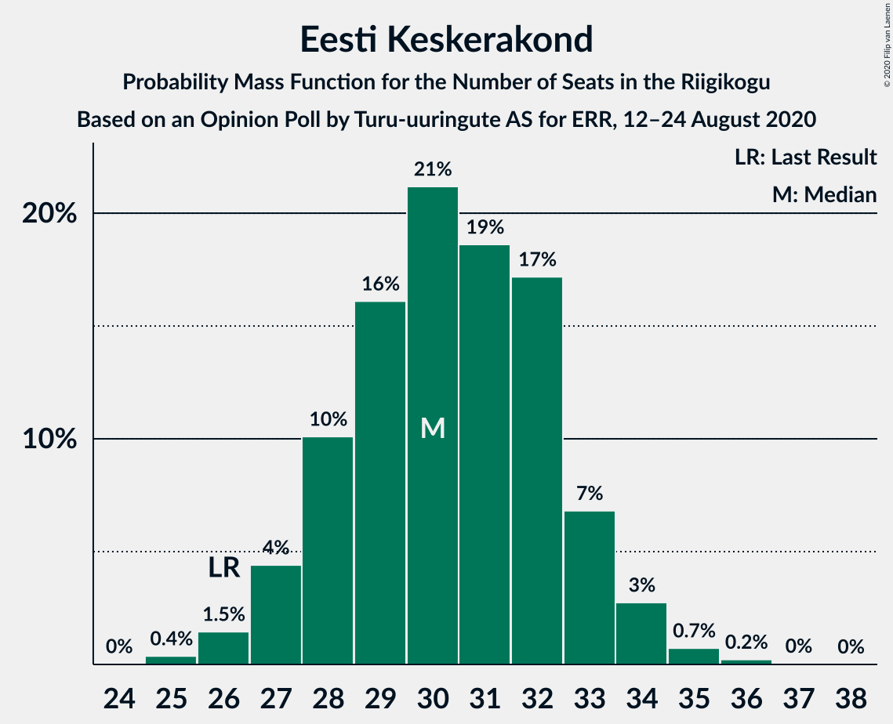
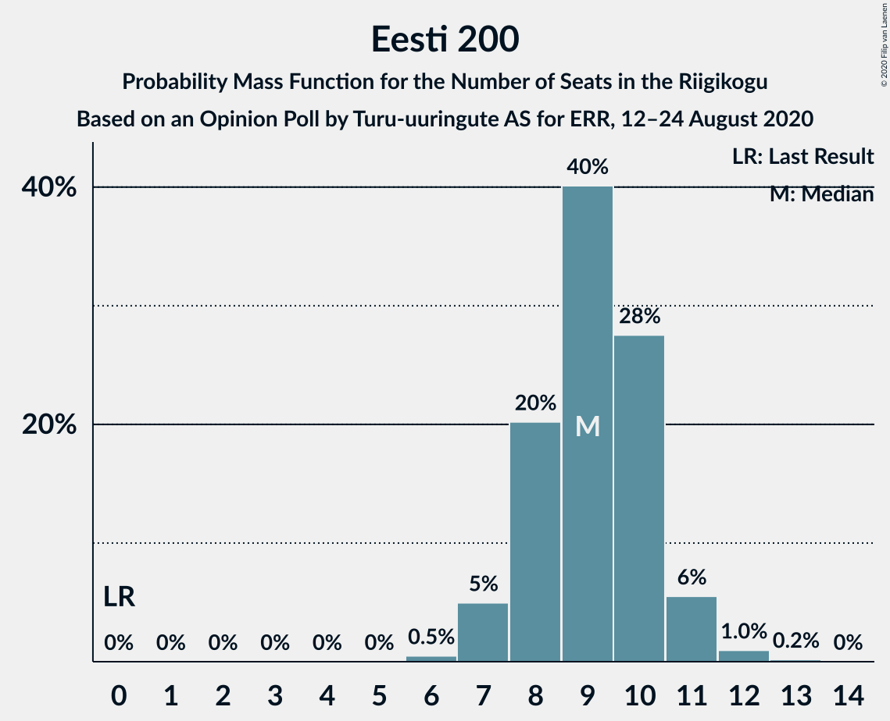
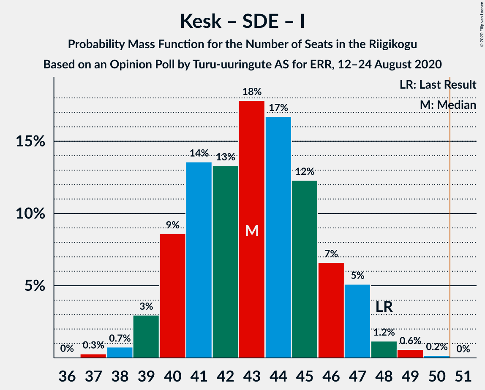

# Opinion Poll by Turu-uuringute AS for ERR, 12–24 August 2020

<a href="#voting-intentions">Voting Intentions</a> | <a href="#seats">Seats</a> | <a href="#coalitions">Coalitions</a> | <a href="#technical-information">Technical Information</a>

## Voting Intentions

### Confidence Intervals

| Party | Last Result | Poll Result | 80% Confidence Interval | 90% Confidence Interval | 95% Confidence Interval | 99% Confidence Interval |
|:-----:|:-----------:|:-----------:|:-----------------------:|:-----------------------:|:-----------------------:|:-----------------------:|
| Eesti Keskerakond | 23.1% | 27.0% | 25.3–28.9% |24.8–29.4% |24.4–29.9% |23.5–30.8% |
| Eesti Reformierakond | 28.9% | 23.9% | 22.3–25.7% |21.8–26.2% |21.4–26.7% |20.6–27.5% |
| Eesti Konservatiivne Rahvaerakond | 17.8% | 20.7% | 19.2–22.5% |18.7–22.9% |18.3–23.4% |17.6–24.2% |
| Sotsiaaldemokraatlik Erakond | 9.8% | 10.4% | 9.2–11.7% |8.9–12.1% |8.6–12.4% |8.1–13.1% |
| Eesti 200 | 4.4% | 9.4% | 8.3–10.7% |8.0–11.0% |7.7–11.3% |7.2–12.0% |
| Erakond Isamaa | 11.4% | 5.2% | 4.4–6.2% |4.2–6.5% |4.0–6.7% |3.6–7.3% |
| Erakond Eestimaa Rohelised | 1.8% | 2.1% | 1.6–2.8% |1.5–3.0% |1.4–3.2% |1.2–3.6% |
| Eesti Vabaerakond | 1.2% | 0.3% | 0.2–0.7% |0.1–0.8% |0.1–0.9% |0.1–1.1% |

*Note:* The poll result column reflects the actual value used in the calculations. Published results may vary slightly, and in addition be rounded to fewer digits.

## Seats

### Confidence Intervals

| Party | Last Result | Median | 80% Confidence Interval | 90% Confidence Interval | 95% Confidence Interval | 99% Confidence Interval |
|:-----:|:-----------:|:------:|:-----------------------:|:-----------------------:|:-----------------------:|:-----------------------:|
| <a href="#eesti-keskerakond">Eesti Keskerakond</a> | 26 | 30 | 28–33 |27–33 |27–34 |26–35 |
| <a href="#eesti-reformierakond">Eesti Reformierakond</a> | 34 | 26 | 24–29 |24–29 |23–30 |22–31 |
| <a href="#eesti-konservatiivne-rahvaerakond">Eesti Konservatiivne Rahvaerakond</a> | 19 | 22 | 20–25 |20–25 |19–26 |19–27 |
| <a href="#sotsiaaldemokraatlik-erakond">Sotsiaaldemokraatlik Erakond</a> | 10 | 11 | 9–12 |8–12 |8–13 |7–13 |
| <a href="#eesti-200">Eesti 200</a> | 0 | 9 | 8–10 |7–11 |7–11 |6–12 |
| <a href="#erakond-isamaa">Erakond Isamaa</a> | 12 | 0 | 0–5 |0–6 |0–6 |0–7 |
| <a href="#erakond-eestimaa-rohelised">Erakond Eestimaa Rohelised</a> | 0 | 0 | 0 |0 |0 |0 |
| <a href="#eesti-vabaerakond">Eesti Vabaerakond</a> | 0 | 0 | 0 |0 |0 |0 |

### Eesti Keskerakond

*For a full overview of the results for this party, see the [Eesti Keskerakond](party-eestikeskerakond.html) page.*

| Number of Seats | Probability | Accumulated | Special Marks |
|:---------------:|:-----------:|:-----------:|:-------------:|
| 25 | 0.4% | 100% |  |
| 26 | 1.5% | 99.6% | Last Result |
| 27 | 4% | 98% |  |
| 28 | 10% | 94% |  |
| 29 | 16% | 84% |  |
| 30 | 21% | 68% | Median |
| 31 | 19% | 46% |  |
| 32 | 17% | 28% |  |
| 33 | 7% | 11% |  |
| 34 | 3% | 4% |  |
| 35 | 0.7% | 1.0% |  |
| 36 | 0.2% | 0.3% |  |
| 37 | 0% | 0.1% |  |
| 38 | 0% | 0% |  |

### Eesti Reformierakond

*For a full overview of the results for this party, see the [Eesti Reformierakond](party-eestireformierakond.html) page.*

| Number of Seats | Probability | Accumulated | Special Marks |
|:---------------:|:-----------:|:-----------:|:-------------:|
| 21 | 0.2% | 100% |  |
| 22 | 1.0% | 99.8% |  |
| 23 | 3% | 98.9% |  |
| 24 | 10% | 95% |  |
| 25 | 15% | 85% |  |
| 26 | 26% | 71% | Median |
| 27 | 22% | 44% |  |
| 28 | 11% | 22% |  |
| 29 | 8% | 11% |  |
| 30 | 2% | 3% |  |
| 31 | 0.6% | 0.7% |  |
| 32 | 0.2% | 0.2% |  |
| 33 | 0% | 0% |  |
| 34 | 0% | 0% | Last Result |

### Eesti Konservatiivne Rahvaerakond

*For a full overview of the results for this party, see the [Eesti Konservatiivne Rahvaerakond](party-eestikonservatiivnerahvaerakond.html) page.*

| Number of Seats | Probability | Accumulated | Special Marks |
|:---------------:|:-----------:|:-----------:|:-------------:|
| 17 | 0.1% | 100% |  |
| 18 | 0.4% | 99.9% |  |
| 19 | 3% | 99.5% | Last Result |
| 20 | 8% | 97% |  |
| 21 | 16% | 89% |  |
| 22 | 24% | 73% | Median |
| 23 | 23% | 50% |  |
| 24 | 15% | 26% |  |
| 25 | 8% | 11% |  |
| 26 | 2% | 3% |  |
| 27 | 0.5% | 0.7% |  |
| 28 | 0.1% | 0.1% |  |
| 29 | 0% | 0% |  |

### Sotsiaaldemokraatlik Erakond

*For a full overview of the results for this party, see the [Sotsiaaldemokraatlik Erakond](party-sotsiaaldemokraatlikerakond.html) page.*

| Number of Seats | Probability | Accumulated | Special Marks |
|:---------------:|:-----------:|:-----------:|:-------------:|
| 7 | 0.7% | 100% |  |
| 8 | 8% | 99.3% |  |
| 9 | 15% | 91% |  |
| 10 | 25% | 76% | Last Result |
| 11 | 32% | 51% | Median |
| 12 | 15% | 19% |  |
| 13 | 3% | 3% |  |
| 14 | 0.1% | 0.1% |  |
| 15 | 0% | 0% |  |

### Eesti 200

*For a full overview of the results for this party, see the [Eesti 200](party-eesti200.html) page.*

| Number of Seats | Probability | Accumulated | Special Marks |
|:---------------:|:-----------:|:-----------:|:-------------:|
| 0 | 0% | 100% | Last Result |
| 1 | 0% | 100% |  |
| 2 | 0% | 100% |  |
| 3 | 0% | 100% |  |
| 4 | 0% | 100% |  |
| 5 | 0% | 100% |  |
| 6 | 0.5% | 100% |  |
| 7 | 5% | 99.5% |  |
| 8 | 20% | 95% |  |
| 9 | 40% | 74% | Median |
| 10 | 28% | 34% |  |
| 11 | 6% | 7% |  |
| 12 | 1.0% | 1.2% |  |
| 13 | 0.2% | 0.2% |  |
| 14 | 0% | 0% |  |

### Erakond Isamaa

*For a full overview of the results for this party, see the [Erakond Isamaa](party-erakondisamaa.html) page.*

| Number of Seats | Probability | Accumulated | Special Marks |
|:---------------:|:-----------:|:-----------:|:-------------:|
| 0 | 52% | 100% | Median |
| 1 | 0% | 48% |  |
| 2 | 0% | 48% |  |
| 3 | 0% | 48% |  |
| 4 | 14% | 48% |  |
| 5 | 25% | 34% |  |
| 6 | 8% | 9% |  |
| 7 | 0.9% | 0.9% |  |
| 8 | 0% | 0% |  |
| 9 | 0% | 0% |  |
| 10 | 0% | 0% |  |
| 11 | 0% | 0% |  |
| 12 | 0% | 0% | Last Result |

### Erakond Eestimaa Rohelised

*For a full overview of the results for this party, see the [Erakond Eestimaa Rohelised](party-erakondeestimaarohelised.html) page.*

| Number of Seats | Probability | Accumulated | Special Marks |
|:---------------:|:-----------:|:-----------:|:-------------:|
| 0 | 100% | 100% | Last Result, Median |

### Eesti Vabaerakond

*For a full overview of the results for this party, see the [Eesti Vabaerakond](party-eestivabaerakond.html) page.*

| Number of Seats | Probability | Accumulated | Special Marks |
|:---------------:|:-----------:|:-----------:|:-------------:|
| 0 | 100% | 100% | Last Result, Median |

## Coalitions

### Confidence Intervals

| Coalition | Last Result | Median | Majority? | 80% Confidence Interval | 90% Confidence Interval | 95% Confidence Interval | 99% Confidence Interval |
|:---------:|:-----------:|:------:|:---------:|:-----------------------:|:-----------------------:|:-----------------------:|:-----------------------:|
| Eesti Keskerakond – Eesti Reformierakond – Eesti Konservatiivne Rahvaerakond | 79 | 79 | 100% | 76–82 | 75–82 | 75–83 | 74–84 |
| Eesti Keskerakond – Eesti Reformierakond | 60 | 57 | 99.7% | 54–59 | 53–60 | 52–61 | 51–62 |
| Eesti Keskerakond – Eesti Konservatiivne Rahvaerakond – Erakond Isamaa | 57 | 55 | 98.8% | 52–58 | 52–59 | 51–60 | 50–61 |
| Eesti Keskerakond – Eesti Konservatiivne Rahvaerakond | 45 | 53 | 84% | 50–55 | 49–56 | 49–57 | 47–58 |
| Eesti Reformierakond – Eesti Konservatiivne Rahvaerakond – Erakond Isamaa | 65 | 51 | 61% | 48–54 | 48–55 | 47–56 | 46–57 |
| Eesti Reformierakond – Eesti Konservatiivne Rahvaerakond | 53 | 49 | 24% | 46–51 | 45–52 | 44–53 | 43–54 |
| Eesti Keskerakond – Sotsiaaldemokraatlik Erakond – Erakond Isamaa | 48 | 43 | 0% | 40–46 | 40–47 | 39–47 | 38–49 |
| Eesti Keskerakond – Sotsiaaldemokraatlik Erakond | 36 | 41 | 0% | 38–44 | 37–44 | 36–45 | 35–46 |
| Eesti Reformierakond – Sotsiaaldemokraatlik Erakond – Erakond Isamaa – Eesti Vabaerakond | 56 | 39 | 0% | 36–42 | 36–43 | 35–44 | 34–45 |
| Eesti Reformierakond – Sotsiaaldemokraatlik Erakond – Erakond Isamaa | 56 | 39 | 0% | 36–42 | 36–43 | 35–44 | 34–45 |
| Eesti Reformierakond – Sotsiaaldemokraatlik Erakond | 44 | 37 | 0% | 34–39 | 33–40 | 33–41 | 32–42 |
| Eesti Konservatiivne Rahvaerakond – Sotsiaaldemokraatlik Erakond | 29 | 33 | 0% | 30–35 | 29–36 | 29–37 | 28–37 |
| Eesti Reformierakond – Erakond Isamaa | 46 | 28 | 0% | 26–32 | 25–33 | 24–34 | 23–35 |

### Eesti Keskerakond – Eesti Reformierakond – Eesti Konservatiivne Rahvaerakond

| Number of Seats | Probability | Accumulated | Special Marks |
|:---------------:|:-----------:|:-----------:|:-------------:|
| 72 | 0.1% | 100% |  |
| 73 | 0.4% | 99.9% |  |
| 74 | 2% | 99.5% |  |
| 75 | 4% | 98% |  |
| 76 | 9% | 93% |  |
| 77 | 7% | 84% |  |
| 78 | 15% | 77% | Median |
| 79 | 14% | 63% | Last Result |
| 80 | 15% | 49% |  |
| 81 | 22% | 34% |  |
| 82 | 9% | 12% |  |
| 83 | 2% | 3% |  |
| 84 | 0.6% | 0.9% |  |
| 85 | 0.2% | 0.3% |  |
| 86 | 0.1% | 0.1% |  |
| 87 | 0% | 0% |  |

### Eesti Keskerakond – Eesti Reformierakond

| Number of Seats | Probability | Accumulated | Special Marks |
|:---------------:|:-----------:|:-----------:|:-------------:|
| 50 | 0.3% | 100% |  |
| 51 | 0.5% | 99.7% | Majority |
| 52 | 3% | 99.2% |  |
| 53 | 3% | 96% |  |
| 54 | 9% | 92% |  |
| 55 | 14% | 83% |  |
| 56 | 13% | 69% | Median |
| 57 | 19% | 56% |  |
| 58 | 18% | 37% |  |
| 59 | 11% | 19% |  |
| 60 | 5% | 8% | Last Result |
| 61 | 3% | 3% |  |
| 62 | 0.5% | 0.7% |  |
| 63 | 0.1% | 0.2% |  |
| 64 | 0.1% | 0.1% |  |
| 65 | 0% | 0% |  |

### Eesti Keskerakond – Eesti Konservatiivne Rahvaerakond – Erakond Isamaa

| Number of Seats | Probability | Accumulated | Special Marks |
|:---------------:|:-----------:|:-----------:|:-------------:|
| 49 | 0.4% | 100% |  |
| 50 | 0.8% | 99.6% |  |
| 51 | 3% | 98.8% | Majority |
| 52 | 6% | 96% | Median |
| 53 | 10% | 90% |  |
| 54 | 18% | 80% |  |
| 55 | 20% | 62% |  |
| 56 | 14% | 41% |  |
| 57 | 12% | 27% | Last Result |
| 58 | 8% | 15% |  |
| 59 | 5% | 7% |  |
| 60 | 2% | 3% |  |
| 61 | 0.5% | 0.6% |  |
| 62 | 0.1% | 0.1% |  |
| 63 | 0% | 0% |  |

### Eesti Keskerakond – Eesti Konservatiivne Rahvaerakond

| Number of Seats | Probability | Accumulated | Special Marks |
|:---------------:|:-----------:|:-----------:|:-------------:|
| 45 | 0% | 100% | Last Result |
| 46 | 0.1% | 100% |  |
| 47 | 0.7% | 99.8% |  |
| 48 | 2% | 99.1% |  |
| 49 | 4% | 98% |  |
| 50 | 10% | 93% |  |
| 51 | 9% | 84% | Majority |
| 52 | 18% | 75% | Median |
| 53 | 16% | 56% |  |
| 54 | 17% | 41% |  |
| 55 | 15% | 23% |  |
| 56 | 5% | 9% |  |
| 57 | 2% | 3% |  |
| 58 | 0.8% | 1.3% |  |
| 59 | 0.3% | 0.4% |  |
| 60 | 0.1% | 0.1% |  |
| 61 | 0% | 0% |  |

### Eesti Reformierakond – Eesti Konservatiivne Rahvaerakond – Erakond Isamaa

| Number of Seats | Probability | Accumulated | Special Marks |
|:---------------:|:-----------:|:-----------:|:-------------:|
| 44 | 0.1% | 100% |  |
| 45 | 0.2% | 99.9% |  |
| 46 | 2% | 99.7% |  |
| 47 | 3% | 98% |  |
| 48 | 6% | 95% | Median |
| 49 | 19% | 89% |  |
| 50 | 10% | 70% |  |
| 51 | 20% | 61% | Majority |
| 52 | 13% | 41% |  |
| 53 | 10% | 28% |  |
| 54 | 8% | 18% |  |
| 55 | 5% | 10% |  |
| 56 | 3% | 5% |  |
| 57 | 1.0% | 1.4% |  |
| 58 | 0.3% | 0.4% |  |
| 59 | 0.1% | 0.1% |  |
| 60 | 0% | 0% |  |
| 61 | 0% | 0% |  |
| 62 | 0% | 0% |  |
| 63 | 0% | 0% |  |
| 64 | 0% | 0% |  |
| 65 | 0% | 0% | Last Result |

### Eesti Reformierakond – Eesti Konservatiivne Rahvaerakond

| Number of Seats | Probability | Accumulated | Special Marks |
|:---------------:|:-----------:|:-----------:|:-------------:|
| 42 | 0.1% | 100% |  |
| 43 | 0.6% | 99.8% |  |
| 44 | 2% | 99.2% |  |
| 45 | 4% | 97% |  |
| 46 | 8% | 94% |  |
| 47 | 12% | 86% |  |
| 48 | 14% | 74% | Median |
| 49 | 25% | 60% |  |
| 50 | 11% | 35% |  |
| 51 | 15% | 24% | Majority |
| 52 | 6% | 9% |  |
| 53 | 2% | 3% | Last Result |
| 54 | 0.6% | 0.9% |  |
| 55 | 0.2% | 0.3% |  |
| 56 | 0% | 0.1% |  |
| 57 | 0% | 0% |  |

### Eesti Keskerakond – Sotsiaaldemokraatlik Erakond – Erakond Isamaa

| Number of Seats | Probability | Accumulated | Special Marks |
|:---------------:|:-----------:|:-----------:|:-------------:|
| 36 | 0% | 100% |  |
| 37 | 0.3% | 99.9% |  |
| 38 | 0.7% | 99.7% |  |
| 39 | 3% | 98.9% |  |
| 40 | 9% | 96% |  |
| 41 | 14% | 87% | Median |
| 42 | 13% | 74% |  |
| 43 | 18% | 60% |  |
| 44 | 17% | 43% |  |
| 45 | 12% | 26% |  |
| 46 | 7% | 14% |  |
| 47 | 5% | 7% |  |
| 48 | 1.2% | 2% | Last Result |
| 49 | 0.6% | 0.8% |  |
| 50 | 0.2% | 0.2% |  |
| 51 | 0% | 0% | Majority |

### Eesti Keskerakond – Sotsiaaldemokraatlik Erakond

| Number of Seats | Probability | Accumulated | Special Marks |
|:---------------:|:-----------:|:-----------:|:-------------:|
| 34 | 0.2% | 100% |  |
| 35 | 0.7% | 99.8% |  |
| 36 | 2% | 99.1% | Last Result |
| 37 | 6% | 97% |  |
| 38 | 6% | 91% |  |
| 39 | 13% | 85% |  |
| 40 | 16% | 71% |  |
| 41 | 20% | 55% | Median |
| 42 | 12% | 36% |  |
| 43 | 13% | 23% |  |
| 44 | 7% | 11% |  |
| 45 | 3% | 4% |  |
| 46 | 0.7% | 0.8% |  |
| 47 | 0.2% | 0.2% |  |
| 48 | 0% | 0% |  |

### Eesti Reformierakond – Sotsiaaldemokraatlik Erakond – Erakond Isamaa – Eesti Vabaerakond

| Number of Seats | Probability | Accumulated | Special Marks |
|:---------------:|:-----------:|:-----------:|:-------------:|
| 32 | 0.1% | 100% |  |
| 33 | 0.3% | 99.9% |  |
| 34 | 2% | 99.5% |  |
| 35 | 3% | 98% |  |
| 36 | 8% | 95% |  |
| 37 | 16% | 87% | Median |
| 38 | 12% | 71% |  |
| 39 | 16% | 59% |  |
| 40 | 14% | 43% |  |
| 41 | 14% | 29% |  |
| 42 | 6% | 14% |  |
| 43 | 6% | 8% |  |
| 44 | 2% | 3% |  |
| 45 | 0.6% | 0.8% |  |
| 46 | 0.2% | 0.2% |  |
| 47 | 0% | 0% |  |
| 48 | 0% | 0% |  |
| 49 | 0% | 0% |  |
| 50 | 0% | 0% |  |
| 51 | 0% | 0% | Majority |
| 52 | 0% | 0% |  |
| 53 | 0% | 0% |  |
| 54 | 0% | 0% |  |
| 55 | 0% | 0% |  |
| 56 | 0% | 0% | Last Result |

### Eesti Reformierakond – Sotsiaaldemokraatlik Erakond – Erakond Isamaa

| Number of Seats | Probability | Accumulated | Special Marks |
|:---------------:|:-----------:|:-----------:|:-------------:|
| 32 | 0.1% | 100% |  |
| 33 | 0.3% | 99.9% |  |
| 34 | 2% | 99.5% |  |
| 35 | 3% | 98% |  |
| 36 | 8% | 95% |  |
| 37 | 16% | 87% | Median |
| 38 | 12% | 71% |  |
| 39 | 16% | 59% |  |
| 40 | 14% | 43% |  |
| 41 | 14% | 29% |  |
| 42 | 6% | 14% |  |
| 43 | 6% | 8% |  |
| 44 | 2% | 3% |  |
| 45 | 0.6% | 0.8% |  |
| 46 | 0.2% | 0.2% |  |
| 47 | 0% | 0% |  |
| 48 | 0% | 0% |  |
| 49 | 0% | 0% |  |
| 50 | 0% | 0% |  |
| 51 | 0% | 0% | Majority |
| 52 | 0% | 0% |  |
| 53 | 0% | 0% |  |
| 54 | 0% | 0% |  |
| 55 | 0% | 0% |  |
| 56 | 0% | 0% | Last Result |

### Eesti Reformierakond – Sotsiaaldemokraatlik Erakond

| Number of Seats | Probability | Accumulated | Special Marks |
|:---------------:|:-----------:|:-----------:|:-------------:|
| 30 | 0.1% | 100% |  |
| 31 | 0.4% | 99.9% |  |
| 32 | 1.0% | 99.6% |  |
| 33 | 4% | 98.5% |  |
| 34 | 8% | 94% |  |
| 35 | 13% | 86% |  |
| 36 | 18% | 73% |  |
| 37 | 23% | 55% | Median |
| 38 | 14% | 32% |  |
| 39 | 11% | 19% |  |
| 40 | 4% | 8% |  |
| 41 | 3% | 4% |  |
| 42 | 0.6% | 0.8% |  |
| 43 | 0.2% | 0.2% |  |
| 44 | 0% | 0% | Last Result |

### Eesti Konservatiivne Rahvaerakond – Sotsiaaldemokraatlik Erakond

| Number of Seats | Probability | Accumulated | Special Marks |
|:---------------:|:-----------:|:-----------:|:-------------:|
| 27 | 0.3% | 100% |  |
| 28 | 1.2% | 99.7% |  |
| 29 | 4% | 98.5% | Last Result |
| 30 | 6% | 95% |  |
| 31 | 14% | 88% |  |
| 32 | 13% | 74% |  |
| 33 | 20% | 61% | Median |
| 34 | 21% | 41% |  |
| 35 | 11% | 21% |  |
| 36 | 6% | 9% |  |
| 37 | 3% | 3% |  |
| 38 | 0.3% | 0.4% |  |
| 39 | 0.1% | 0.1% |  |
| 40 | 0% | 0% |  |

### Eesti Reformierakond – Erakond Isamaa

| Number of Seats | Probability | Accumulated | Special Marks |
|:---------------:|:-----------:|:-----------:|:-------------:|
| 22 | 0.1% | 100% |  |
| 23 | 0.7% | 99.9% |  |
| 24 | 2% | 99.2% |  |
| 25 | 6% | 97% |  |
| 26 | 14% | 91% | Median |
| 27 | 17% | 76% |  |
| 28 | 10% | 60% |  |
| 29 | 12% | 50% |  |
| 30 | 12% | 38% |  |
| 31 | 9% | 25% |  |
| 32 | 8% | 17% |  |
| 33 | 4% | 9% |  |
| 34 | 4% | 5% |  |
| 35 | 0.7% | 0.9% |  |
| 36 | 0.2% | 0.2% |  |
| 37 | 0% | 0% |  |
| 38 | 0% | 0% |  |
| 39 | 0% | 0% |  |
| 40 | 0% | 0% |  |
| 41 | 0% | 0% |  |
| 42 | 0% | 0% |  |
| 43 | 0% | 0% |  |
| 44 | 0% | 0% |  |
| 45 | 0% | 0% |  |
| 46 | 0% | 0% | Last Result |

## Technical Information

### Opinion Poll

+ **Polling firm:** Turu-uuringute AS
+ **Commissioner(s):** ERR
+ **Fieldwork period:** 12–24 August 2020

### Calculations

+ **Sample size:** 1003
+ **Simulations done:** 1,048,576
+ **Error estimate:** 1.46%

