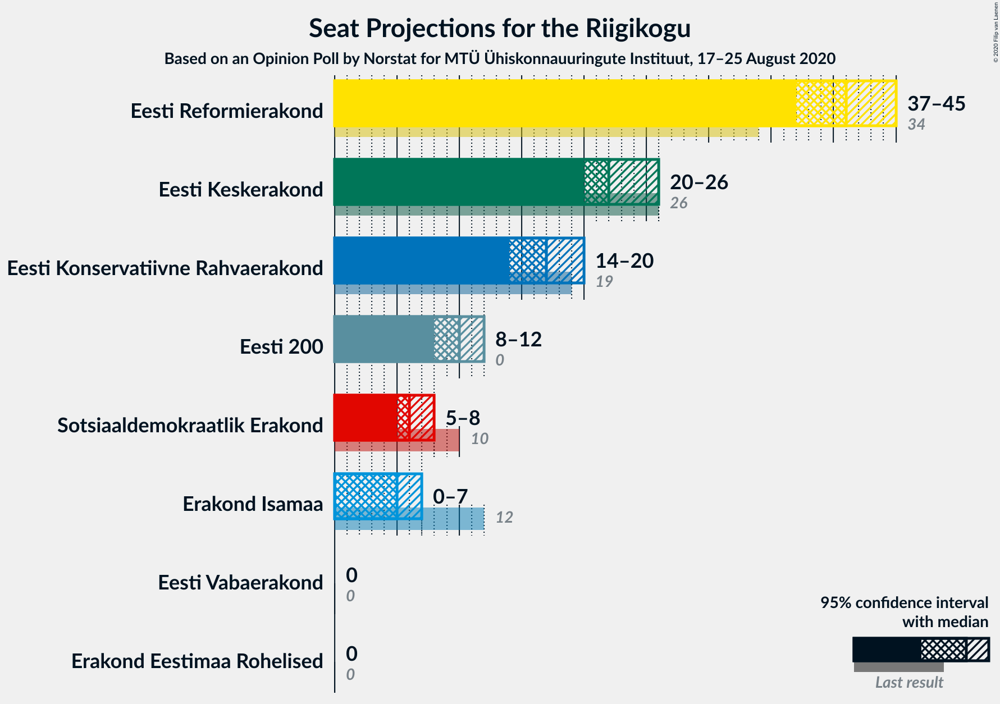
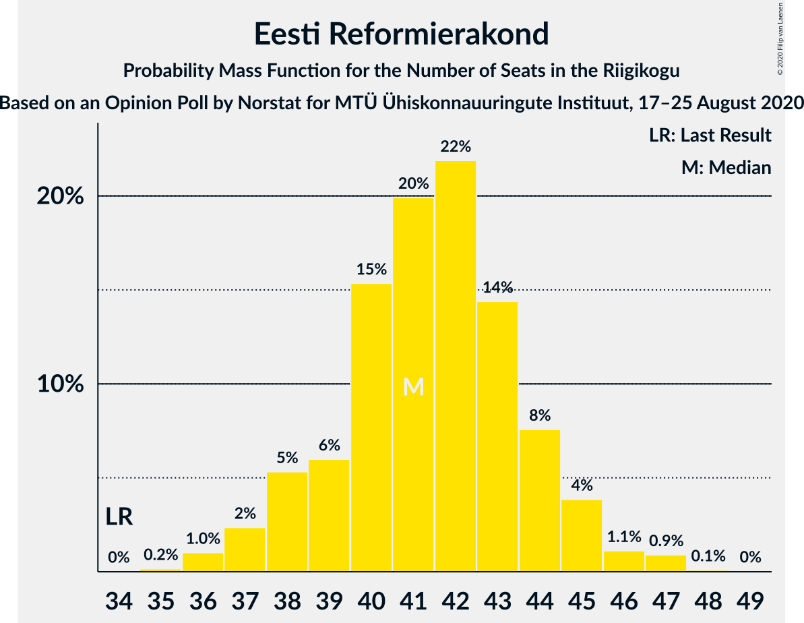
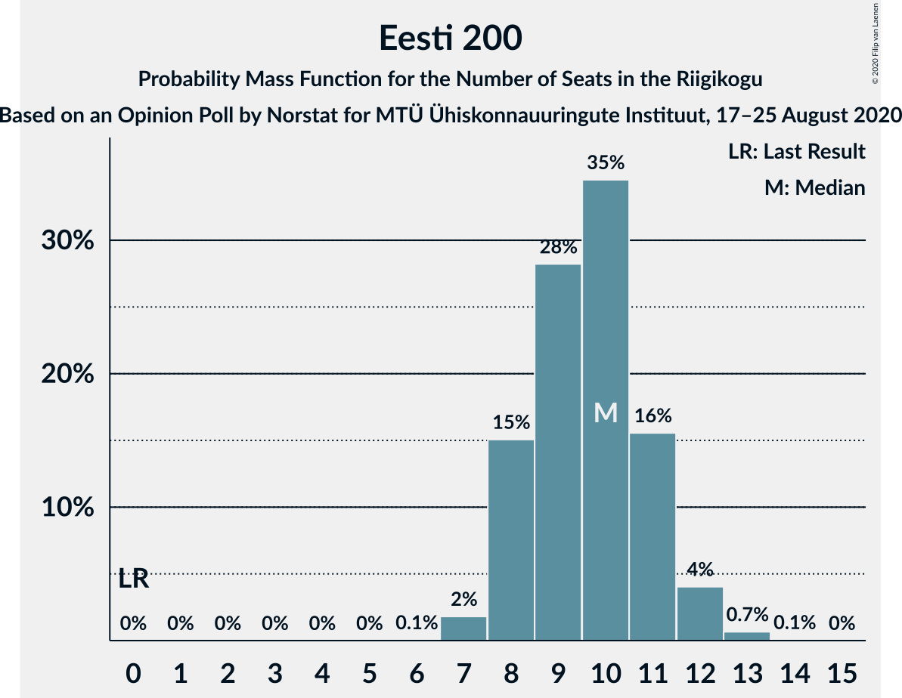
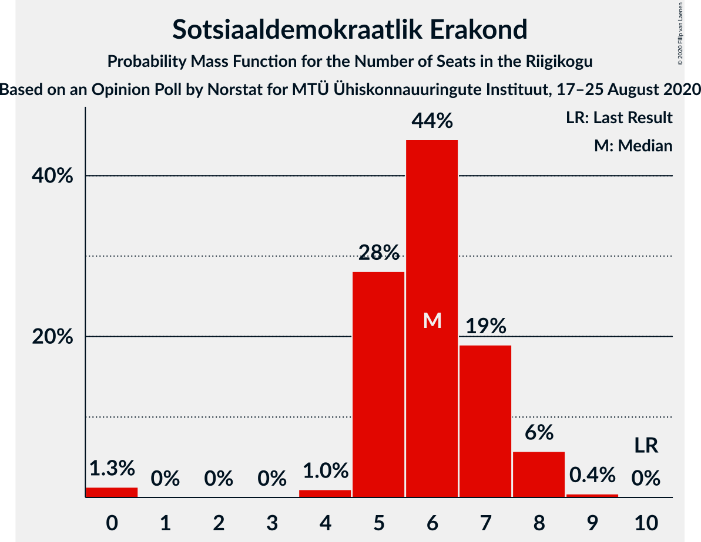
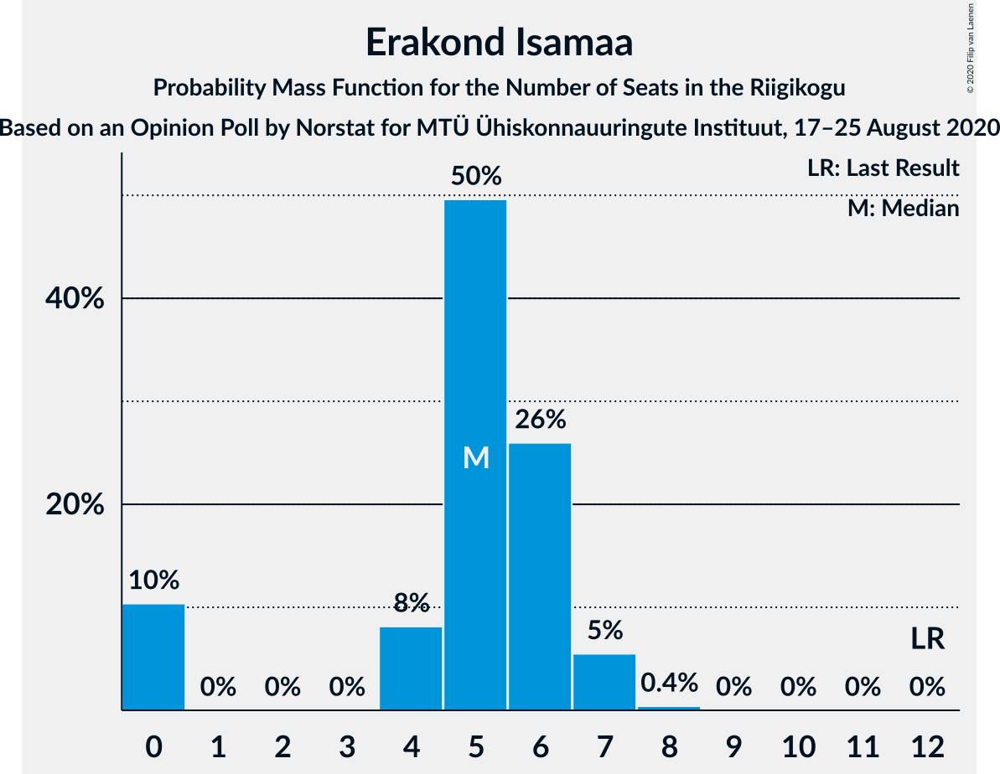

# Opinion Poll by Norstat for MTÜ Ühiskonnauuringute Instituut, 17–25 August 2020

<a href="#voting-intentions">Voting Intentions</a> | <a href="#seats">Seats</a> | <a href="#coalitions">Coalitions</a> | <a href="#technical-information">Technical Information</a>

## Voting Intentions

### Confidence Intervals

| Party | Last Result | Poll Result | 80% Confidence Interval | 90% Confidence Interval | 95% Confidence Interval | 99% Confidence Interval |
|:-----:|:-----------:|:-----------:|:-----------------------:|:-----------------------:|:-----------------------:|:-----------------------:|
| Eesti Reformierakond | 28.9% | 35.5% | 33.6–37.5% |33.1–38.0% |32.6–38.5% |31.7–39.5% |
| Eesti Keskerakond | 23.1% | 20.9% | 19.3–22.6% |18.9–23.1% |18.5–23.5% |17.8–24.4% |
| Eesti Konservatiivne Rahvaerakond | 17.8% | 16.1% | 14.7–17.7% |14.3–18.1% |13.9–18.5% |13.3–19.3% |
| Eesti 200 | 4.4% | 9.9% | 8.8–11.2% |8.5–11.6% |8.2–11.9% |7.7–12.6% |
| Sotsiaaldemokraatlik Erakond | 9.8% | 6.7% | 5.8–7.8% |5.5–8.1% |5.3–8.4% |4.9–9.0% |
| Erakond Isamaa | 11.4% | 5.8% | 5.0–6.9% |4.7–7.2% |4.5–7.4% |4.1–8.0% |
| Erakond Eestimaa Rohelised | 1.8% | 1.3% | 0.9–1.9% |0.8–2.1% |0.8–2.2% |0.6–2.5% |
| Eesti Vabaerakond | 1.2% | 0.7% | 0.5–1.2% |0.4–1.3% |0.3–1.4% |0.2–1.7% |

*Note:* The poll result column reflects the actual value used in the calculations. Published results may vary slightly, and in addition be rounded to fewer digits.

## Seats

### Confidence Intervals

| Party | Last Result | Median | 80% Confidence Interval | 90% Confidence Interval | 95% Confidence Interval | 99% Confidence Interval |
|:-----:|:-----------:|:------:|:-----------------------:|:-----------------------:|:-----------------------:|:-----------------------:|
| <a href="#eesti-reformierakond">Eesti Reformierakond</a> | 34 | 41 | 39–44 |38–45 |37–45 |36–47 |
| <a href="#eesti-keskerakond">Eesti Keskerakond</a> | 26 | 22 | 20–25 |20–25 |20–26 |19–27 |
| <a href="#eesti-konservatiivne-rahvaerakond">Eesti Konservatiivne Rahvaerakond</a> | 19 | 17 | 15–19 |14–19 |14–20 |13–21 |
| <a href="#eesti-200">Eesti 200</a> | 0 | 10 | 8–11 |8–11 |8–12 |7–13 |
| <a href="#sotsiaaldemokraatlik-erakond">Sotsiaaldemokraatlik Erakond</a> | 10 | 6 | 5–7 |5–8 |5–8 |0–8 |
| <a href="#erakond-isamaa">Erakond Isamaa</a> | 12 | 5 | 0–6 |0–7 |0–7 |0–7 |
| <a href="#erakond-eestimaa-rohelised">Erakond Eestimaa Rohelised</a> | 0 | 0 | 0 |0 |0 |0 |
| <a href="#eesti-vabaerakond">Eesti Vabaerakond</a> | 0 | 0 | 0 |0 |0 |0 |

### Eesti Reformierakond

*For a full overview of the results for this party, see the [Eesti Reformierakond](party-eestireformierakond.html) page.*

| Number of Seats | Probability | Accumulated | Special Marks |
|:---------------:|:-----------:|:-----------:|:-------------:|
| 34 | 0% | 100% | Last Result |
| 35 | 0.2% | 100% |  |
| 36 | 1.0% | 99.8% |  |
| 37 | 2% | 98.8% |  |
| 38 | 5% | 96% |  |
| 39 | 6% | 91% |  |
| 40 | 15% | 85% |  |
| 41 | 20% | 70% | Median |
| 42 | 22% | 50% |  |
| 43 | 14% | 28% |  |
| 44 | 8% | 14% |  |
| 45 | 4% | 6% |  |
| 46 | 1.1% | 2% |  |
| 47 | 0.9% | 1.0% |  |
| 48 | 0.1% | 0.1% |  |
| 49 | 0% | 0% |  |

### Eesti Keskerakond

*For a full overview of the results for this party, see the [Eesti Keskerakond](party-eestikeskerakond.html) page.*

| Number of Seats | Probability | Accumulated | Special Marks |
|:---------------:|:-----------:|:-----------:|:-------------:|
| 18 | 0.3% | 100% |  |
| 19 | 2% | 99.7% |  |
| 20 | 9% | 98% |  |
| 21 | 17% | 88% |  |
| 22 | 29% | 71% | Median |
| 23 | 19% | 42% |  |
| 24 | 12% | 24% |  |
| 25 | 7% | 11% |  |
| 26 | 3% | 4% | Last Result |
| 27 | 0.8% | 1.2% |  |
| 28 | 0.3% | 0.3% |  |
| 29 | 0% | 0% |  |

### Eesti Konservatiivne Rahvaerakond

*For a full overview of the results for this party, see the [Eesti Konservatiivne Rahvaerakond](party-eestikonservatiivnerahvaerakond.html) page.*

| Number of Seats | Probability | Accumulated | Special Marks |
|:---------------:|:-----------:|:-----------:|:-------------:|
| 13 | 0.5% | 100% |  |
| 14 | 5% | 99.5% |  |
| 15 | 12% | 94% |  |
| 16 | 22% | 82% |  |
| 17 | 30% | 61% | Median |
| 18 | 20% | 31% |  |
| 19 | 8% | 11% | Last Result |
| 20 | 3% | 3% |  |
| 21 | 0.4% | 0.5% |  |
| 22 | 0.1% | 0.1% |  |
| 23 | 0% | 0% |  |

### Eesti 200

*For a full overview of the results for this party, see the [Eesti 200](party-eesti200.html) page.*

| Number of Seats | Probability | Accumulated | Special Marks |
|:---------------:|:-----------:|:-----------:|:-------------:|
| 0 | 0% | 100% | Last Result |
| 1 | 0% | 100% |  |
| 2 | 0% | 100% |  |
| 3 | 0% | 100% |  |
| 4 | 0% | 100% |  |
| 5 | 0% | 100% |  |
| 6 | 0.1% | 100% |  |
| 7 | 2% | 99.9% |  |
| 8 | 15% | 98% |  |
| 9 | 28% | 83% |  |
| 10 | 35% | 55% | Median |
| 11 | 16% | 20% |  |
| 12 | 4% | 5% |  |
| 13 | 0.7% | 0.7% |  |
| 14 | 0.1% | 0.1% |  |
| 15 | 0% | 0% |  |

### Sotsiaaldemokraatlik Erakond

*For a full overview of the results for this party, see the [Sotsiaaldemokraatlik Erakond](party-sotsiaaldemokraatlikerakond.html) page.*

| Number of Seats | Probability | Accumulated | Special Marks |
|:---------------:|:-----------:|:-----------:|:-------------:|
| 0 | 1.3% | 100% |  |
| 1 | 0% | 98.7% |  |
| 2 | 0% | 98.7% |  |
| 3 | 0% | 98.7% |  |
| 4 | 1.0% | 98.7% |  |
| 5 | 28% | 98% |  |
| 6 | 44% | 70% | Median |
| 7 | 19% | 25% |  |
| 8 | 6% | 6% |  |
| 9 | 0.4% | 0.5% |  |
| 10 | 0% | 0% | Last Result |

### Erakond Isamaa

*For a full overview of the results for this party, see the [Erakond Isamaa](party-erakondisamaa.html) page.*

| Number of Seats | Probability | Accumulated | Special Marks |
|:---------------:|:-----------:|:-----------:|:-------------:|
| 0 | 10% | 100% |  |
| 1 | 0% | 90% |  |
| 2 | 0% | 90% |  |
| 3 | 0% | 90% |  |
| 4 | 8% | 90% |  |
| 5 | 50% | 81% | Median |
| 6 | 26% | 32% |  |
| 7 | 5% | 6% |  |
| 8 | 0.4% | 0.4% |  |
| 9 | 0% | 0% |  |
| 10 | 0% | 0% |  |
| 11 | 0% | 0% |  |
| 12 | 0% | 0% | Last Result |

### Erakond Eestimaa Rohelised

*For a full overview of the results for this party, see the [Erakond Eestimaa Rohelised](party-erakondeestimaarohelised.html) page.*

| Number of Seats | Probability | Accumulated | Special Marks |
|:---------------:|:-----------:|:-----------:|:-------------:|
| 0 | 100% | 100% | Last Result, Median |

### Eesti Vabaerakond

*For a full overview of the results for this party, see the [Eesti Vabaerakond](party-eestivabaerakond.html) page.*

| Number of Seats | Probability | Accumulated | Special Marks |
|:---------------:|:-----------:|:-----------:|:-------------:|
| 0 | 100% | 100% | Last Result, Median |

## Coalitions

### Confidence Intervals

| Coalition | Last Result | Median | Majority? | 80% Confidence Interval | 90% Confidence Interval | 95% Confidence Interval | 99% Confidence Interval |
|:---------:|:-----------:|:------:|:---------:|:-----------------------:|:-----------------------:|:-----------------------:|:-----------------------:|
| Eesti Reformierakond – Eesti Keskerakond – Eesti Konservatiivne Rahvaerakond | 79 | 80 | 100% | 78–83 | 78–85 | 77–86 | 76–87 |
| Eesti Reformierakond – Eesti Keskerakond | 60 | 64 | 100% | 61–67 | 61–68 | 60–69 | 59–70 |
| Eesti Reformierakond – Eesti Konservatiivne Rahvaerakond – Erakond Isamaa | 65 | 63 | 100% | 60–65 | 59–66 | 59–66 | 57–68 |
| Eesti Reformierakond – Eesti Konservatiivne Rahvaerakond | 53 | 58 | 100% | 56–61 | 55–62 | 54–63 | 53–64 |
| Eesti Reformierakond – Sotsiaaldemokraatlik Erakond – Erakond Isamaa – Eesti Vabaerakond | 56 | 52 | 81% | 49–55 | 48–55 | 47–56 | 46–57 |
| Eesti Reformierakond – Sotsiaaldemokraatlik Erakond – Erakond Isamaa | 56 | 52 | 81% | 49–55 | 48–55 | 47–56 | 46–57 |
| Eesti Reformierakond – Sotsiaaldemokraatlik Erakond | 44 | 47 | 7% | 45–50 | 44–51 | 43–52 | 42–53 |
| Eesti Reformierakond – Erakond Isamaa | 46 | 47 | 0.5% | 43–49 | 42–49 | 41–50 | 39–51 |
| Eesti Keskerakond – Eesti Konservatiivne Rahvaerakond – Erakond Isamaa | 57 | 44 | 0.1% | 41–47 | 40–47 | 39–48 | 38–49 |
| Eesti Keskerakond – Eesti Konservatiivne Rahvaerakond | 45 | 39 | 0% | 37–42 | 36–43 | 36–44 | 35–45 |
| Eesti Keskerakond – Sotsiaaldemokraatlik Erakond – Erakond Isamaa | 48 | 33 | 0% | 31–36 | 29–37 | 28–37 | 27–38 |
| Eesti Keskerakond – Sotsiaaldemokraatlik Erakond | 36 | 28 | 0% | 26–31 | 26–32 | 25–32 | 24–34 |
| Eesti Konservatiivne Rahvaerakond – Sotsiaaldemokraatlik Erakond | 29 | 23 | 0% | 21–25 | 20–26 | 19–26 | 17–27 |

### Eesti Reformierakond – Eesti Keskerakond – Eesti Konservatiivne Rahvaerakond

| Number of Seats | Probability | Accumulated | Special Marks |
|:---------------:|:-----------:|:-----------:|:-------------:|
| 75 | 0.1% | 100% |  |
| 76 | 0.5% | 99.8% |  |
| 77 | 3% | 99.4% |  |
| 78 | 9% | 97% |  |
| 79 | 16% | 88% | Last Result |
| 80 | 22% | 72% | Median |
| 81 | 25% | 50% |  |
| 82 | 11% | 25% |  |
| 83 | 4% | 14% |  |
| 84 | 4% | 10% |  |
| 85 | 2% | 6% |  |
| 86 | 3% | 4% |  |
| 87 | 0.6% | 0.9% |  |
| 88 | 0.2% | 0.3% |  |
| 89 | 0% | 0.1% |  |
| 90 | 0% | 0.1% |  |
| 91 | 0% | 0% |  |

### Eesti Reformierakond – Eesti Keskerakond

| Number of Seats | Probability | Accumulated | Special Marks |
|:---------------:|:-----------:|:-----------:|:-------------:|
| 57 | 0% | 100% |  |
| 58 | 0.2% | 99.9% |  |
| 59 | 0.9% | 99.7% |  |
| 60 | 4% | 98.8% | Last Result |
| 61 | 6% | 95% |  |
| 62 | 16% | 89% |  |
| 63 | 19% | 73% | Median |
| 64 | 19% | 53% |  |
| 65 | 16% | 34% |  |
| 66 | 8% | 18% |  |
| 67 | 5% | 10% |  |
| 68 | 2% | 5% |  |
| 69 | 1.4% | 3% |  |
| 70 | 1.4% | 2% |  |
| 71 | 0.2% | 0.3% |  |
| 72 | 0.1% | 0.1% |  |
| 73 | 0% | 0% |  |

### Eesti Reformierakond – Eesti Konservatiivne Rahvaerakond – Erakond Isamaa

| Number of Seats | Probability | Accumulated | Special Marks |
|:---------------:|:-----------:|:-----------:|:-------------:|
| 55 | 0.1% | 100% |  |
| 56 | 0.2% | 99.9% |  |
| 57 | 0.6% | 99.7% |  |
| 58 | 2% | 99.1% |  |
| 59 | 5% | 98% |  |
| 60 | 5% | 93% |  |
| 61 | 8% | 88% |  |
| 62 | 15% | 80% |  |
| 63 | 18% | 64% | Median |
| 64 | 21% | 46% |  |
| 65 | 17% | 25% | Last Result |
| 66 | 5% | 8% |  |
| 67 | 2% | 2% |  |
| 68 | 0.6% | 0.7% |  |
| 69 | 0.1% | 0.1% |  |
| 70 | 0% | 0% |  |

### Eesti Reformierakond – Eesti Konservatiivne Rahvaerakond

| Number of Seats | Probability | Accumulated | Special Marks |
|:---------------:|:-----------:|:-----------:|:-------------:|
| 51 | 0.1% | 100% | Majority |
| 52 | 0.3% | 99.9% |  |
| 53 | 1.0% | 99.7% | Last Result |
| 54 | 3% | 98.7% |  |
| 55 | 5% | 96% |  |
| 56 | 10% | 91% |  |
| 57 | 17% | 81% |  |
| 58 | 20% | 64% | Median |
| 59 | 18% | 45% |  |
| 60 | 14% | 26% |  |
| 61 | 6% | 13% |  |
| 62 | 3% | 6% |  |
| 63 | 2% | 3% |  |
| 64 | 0.9% | 1.2% |  |
| 65 | 0.2% | 0.3% |  |
| 66 | 0.1% | 0.1% |  |
| 67 | 0% | 0% |  |

### Eesti Reformierakond – Sotsiaaldemokraatlik Erakond – Erakond Isamaa – Eesti Vabaerakond

| Number of Seats | Probability | Accumulated | Special Marks |
|:---------------:|:-----------:|:-----------:|:-------------:|
| 44 | 0.1% | 100% |  |
| 45 | 0.3% | 99.9% |  |
| 46 | 0.9% | 99.6% |  |
| 47 | 2% | 98.8% |  |
| 48 | 3% | 97% |  |
| 49 | 4% | 94% |  |
| 50 | 8% | 89% |  |
| 51 | 17% | 81% | Majority |
| 52 | 20% | 65% | Median |
| 53 | 16% | 45% |  |
| 54 | 17% | 29% |  |
| 55 | 8% | 12% |  |
| 56 | 3% | 4% | Last Result |
| 57 | 0.6% | 0.7% |  |
| 58 | 0.1% | 0.1% |  |
| 59 | 0% | 0% |  |

### Eesti Reformierakond – Sotsiaaldemokraatlik Erakond – Erakond Isamaa

| Number of Seats | Probability | Accumulated | Special Marks |
|:---------------:|:-----------:|:-----------:|:-------------:|
| 44 | 0.1% | 100% |  |
| 45 | 0.3% | 99.9% |  |
| 46 | 0.9% | 99.6% |  |
| 47 | 2% | 98.8% |  |
| 48 | 3% | 97% |  |
| 49 | 4% | 94% |  |
| 50 | 8% | 89% |  |
| 51 | 17% | 81% | Majority |
| 52 | 20% | 65% | Median |
| 53 | 16% | 45% |  |
| 54 | 17% | 29% |  |
| 55 | 8% | 12% |  |
| 56 | 3% | 4% | Last Result |
| 57 | 0.6% | 0.7% |  |
| 58 | 0.1% | 0.1% |  |
| 59 | 0% | 0% |  |

### Eesti Reformierakond – Sotsiaaldemokraatlik Erakond

| Number of Seats | Probability | Accumulated | Special Marks |
|:---------------:|:-----------:|:-----------:|:-------------:|
| 40 | 0.1% | 100% |  |
| 41 | 0.2% | 99.9% |  |
| 42 | 0.9% | 99.7% |  |
| 43 | 2% | 98.8% |  |
| 44 | 5% | 97% | Last Result |
| 45 | 9% | 92% |  |
| 46 | 15% | 83% |  |
| 47 | 24% | 68% | Median |
| 48 | 14% | 44% |  |
| 49 | 16% | 30% |  |
| 50 | 7% | 14% |  |
| 51 | 4% | 7% | Majority |
| 52 | 2% | 3% |  |
| 53 | 0.7% | 1.2% |  |
| 54 | 0.4% | 0.5% |  |
| 55 | 0% | 0.1% |  |
| 56 | 0% | 0% |  |

### Eesti Reformierakond – Erakond Isamaa

| Number of Seats | Probability | Accumulated | Special Marks |
|:---------------:|:-----------:|:-----------:|:-------------:|
| 38 | 0.1% | 100% |  |
| 39 | 0.4% | 99.9% |  |
| 40 | 1.3% | 99.4% |  |
| 41 | 2% | 98% |  |
| 42 | 3% | 96% |  |
| 43 | 5% | 93% |  |
| 44 | 7% | 88% |  |
| 45 | 12% | 81% |  |
| 46 | 18% | 69% | Last Result, Median |
| 47 | 21% | 51% |  |
| 48 | 20% | 31% |  |
| 49 | 8% | 11% |  |
| 50 | 2% | 3% |  |
| 51 | 0.4% | 0.5% | Majority |
| 52 | 0.1% | 0.1% |  |
| 53 | 0% | 0% |  |

### Eesti Keskerakond – Eesti Konservatiivne Rahvaerakond – Erakond Isamaa

| Number of Seats | Probability | Accumulated | Special Marks |
|:---------------:|:-----------:|:-----------:|:-------------:|
| 36 | 0.1% | 100% |  |
| 37 | 0.2% | 99.9% |  |
| 38 | 0.5% | 99.7% |  |
| 39 | 2% | 99.2% |  |
| 40 | 2% | 97% |  |
| 41 | 6% | 95% |  |
| 42 | 10% | 88% |  |
| 43 | 13% | 78% |  |
| 44 | 29% | 65% | Median |
| 45 | 11% | 36% |  |
| 46 | 12% | 25% |  |
| 47 | 7% | 12% |  |
| 48 | 3% | 5% |  |
| 49 | 2% | 2% |  |
| 50 | 0.2% | 0.4% |  |
| 51 | 0.1% | 0.1% | Majority |
| 52 | 0% | 0% |  |
| 53 | 0% | 0% |  |
| 54 | 0% | 0% |  |
| 55 | 0% | 0% |  |
| 56 | 0% | 0% |  |
| 57 | 0% | 0% | Last Result |

### Eesti Keskerakond – Eesti Konservatiivne Rahvaerakond

| Number of Seats | Probability | Accumulated | Special Marks |
|:---------------:|:-----------:|:-----------:|:-------------:|
| 34 | 0.4% | 100% |  |
| 35 | 1.5% | 99.6% |  |
| 36 | 6% | 98% |  |
| 37 | 11% | 92% |  |
| 38 | 15% | 81% |  |
| 39 | 28% | 66% | Median |
| 40 | 12% | 38% |  |
| 41 | 14% | 25% |  |
| 42 | 5% | 12% |  |
| 43 | 3% | 7% |  |
| 44 | 3% | 4% |  |
| 45 | 0.6% | 0.8% | Last Result |
| 46 | 0.2% | 0.2% |  |
| 47 | 0% | 0.1% |  |
| 48 | 0% | 0% |  |

### Eesti Keskerakond – Sotsiaaldemokraatlik Erakond – Erakond Isamaa

| Number of Seats | Probability | Accumulated | Special Marks |
|:---------------:|:-----------:|:-----------:|:-------------:|
| 25 | 0.1% | 100% |  |
| 26 | 0.2% | 99.9% |  |
| 27 | 1.0% | 99.7% |  |
| 28 | 2% | 98.7% |  |
| 29 | 2% | 97% |  |
| 30 | 4% | 95% |  |
| 31 | 9% | 91% |  |
| 32 | 18% | 82% |  |
| 33 | 20% | 64% | Median |
| 34 | 20% | 43% |  |
| 35 | 12% | 23% |  |
| 36 | 6% | 11% |  |
| 37 | 4% | 6% |  |
| 38 | 1.3% | 2% |  |
| 39 | 0.3% | 0.4% |  |
| 40 | 0.1% | 0.1% |  |
| 41 | 0% | 0% |  |
| 42 | 0% | 0% |  |
| 43 | 0% | 0% |  |
| 44 | 0% | 0% |  |
| 45 | 0% | 0% |  |
| 46 | 0% | 0% |  |
| 47 | 0% | 0% |  |
| 48 | 0% | 0% | Last Result |

### Eesti Keskerakond – Sotsiaaldemokraatlik Erakond

| Number of Seats | Probability | Accumulated | Special Marks |
|:---------------:|:-----------:|:-----------:|:-------------:|
| 22 | 0.1% | 100% |  |
| 23 | 0.3% | 99.9% |  |
| 24 | 0.5% | 99.5% |  |
| 25 | 3% | 99.0% |  |
| 26 | 9% | 96% |  |
| 27 | 22% | 87% |  |
| 28 | 28% | 66% | Median |
| 29 | 15% | 38% |  |
| 30 | 8% | 23% |  |
| 31 | 8% | 15% |  |
| 32 | 5% | 7% |  |
| 33 | 2% | 2% |  |
| 34 | 0.5% | 0.6% |  |
| 35 | 0.1% | 0.2% |  |
| 36 | 0% | 0% | Last Result |

### Eesti Konservatiivne Rahvaerakond – Sotsiaaldemokraatlik Erakond

| Number of Seats | Probability | Accumulated | Special Marks |
|:---------------:|:-----------:|:-----------:|:-------------:|
| 16 | 0.2% | 100% |  |
| 17 | 0.3% | 99.8% |  |
| 18 | 0.5% | 99.5% |  |
| 19 | 2% | 98.9% |  |
| 20 | 5% | 97% |  |
| 21 | 14% | 92% |  |
| 22 | 19% | 78% |  |
| 23 | 27% | 59% | Median |
| 24 | 17% | 32% |  |
| 25 | 9% | 15% |  |
| 26 | 4% | 6% |  |
| 27 | 1.1% | 2% |  |
| 28 | 0.3% | 0.4% |  |
| 29 | 0.1% | 0.1% | Last Result |
| 30 | 0% | 0% |  |

## Technical Information

### Opinion Poll

+ **Polling firm:** Norstat
+ **Commissioner(s):** MTÜ Ühiskonnauuringute Instituut
+ **Fieldwork period:** 17–25 August 2020

### Calculations

+ **Sample size:** 1000
+ **Simulations done:** 1,048,576
+ **Error estimate:** 1.20%

