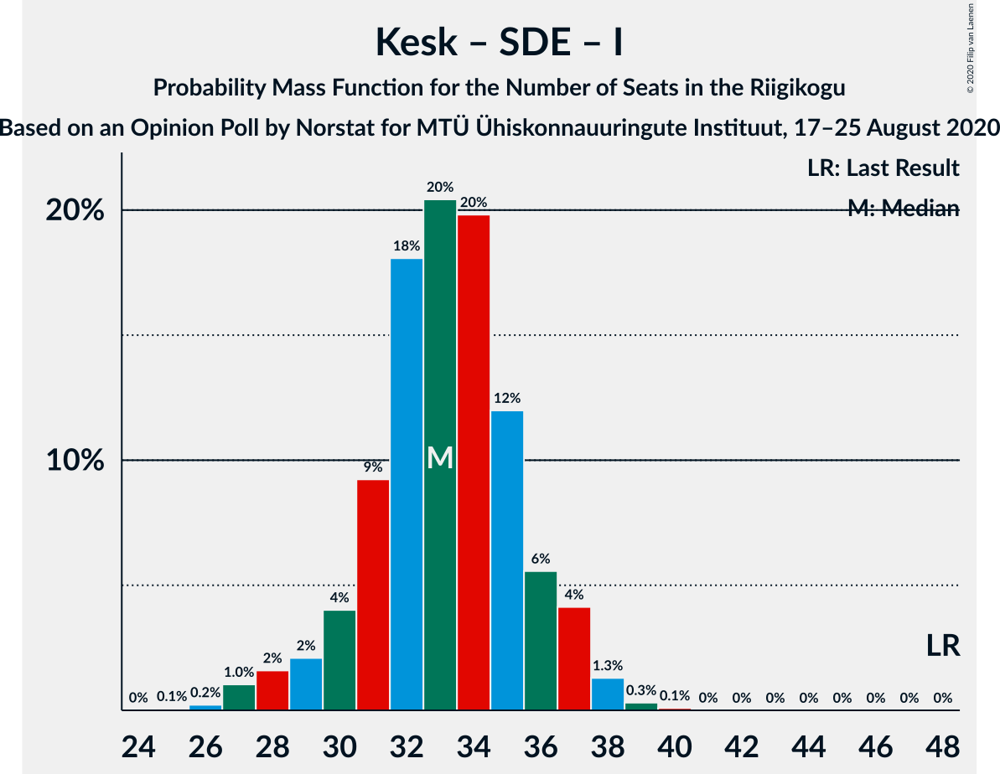

# Opinion Poll by Norstat for MTÜ Ühiskonnauuringute Instituut, 17–25 August 2020

<a href="#voting-intentions">Voting Intentions</a> | <a href="#seats">Seats</a> | <a href="#coalitions">Coalitions</a> | <a href="#technical-information">Technical Information</a>

## Voting Intentions

### Confidence Intervals

| Party | Last Result | Poll Result | 80% Confidence Interval | 90% Confidence Interval | 95% Confidence Interval | 99% Confidence Interval |
|:-----:|:-----------:|:-----------:|:-----------------------:|:-----------------------:|:-----------------------:|:-----------------------:|
| Eesti Reformierakond | 28.9% | 35.5% | 33.6–37.5% |33.1–38.0% |32.6–38.5% |31.7–39.5% |
| Eesti Keskerakond | 23.1% | 20.9% | 19.3–22.6% |18.9–23.1% |18.5–23.5% |17.8–24.4% |
| Eesti Konservatiivne Rahvaerakond | 17.8% | 16.1% | 14.7–17.7% |14.3–18.1% |13.9–18.5% |13.3–19.3% |
| Eesti 200 | 4.4% | 9.9% | 8.8–11.2% |8.5–11.6% |8.2–11.9% |7.7–12.6% |
| Sotsiaaldemokraatlik Erakond | 9.8% | 6.7% | 5.8–7.8% |5.5–8.1% |5.3–8.4% |4.9–9.0% |
| Erakond Isamaa | 11.4% | 5.8% | 5.0–6.9% |4.7–7.2% |4.5–7.4% |4.1–8.0% |
| Erakond Eestimaa Rohelised | 1.8% | 1.3% | 0.9–1.9% |0.8–2.1% |0.8–2.2% |0.6–2.5% |
| Eesti Vabaerakond | 1.2% | 0.7% | 0.5–1.2% |0.4–1.3% |0.3–1.4% |0.2–1.7% |

*Note:* The poll result column reflects the actual value used in the calculations. Published results may vary slightly, and in addition be rounded to fewer digits.

## Seats

### Confidence Intervals

| Party | Last Result | Median | 80% Confidence Interval | 90% Confidence Interval | 95% Confidence Interval | 99% Confidence Interval |
|:-----:|:-----------:|:------:|:-----------------------:|:-----------------------:|:-----------------------:|:-----------------------:|
| <a href="#eesti-reformierakond">Eesti Reformierakond</a> | 34 | 42 | 38–44 |38–45 |37–46 |36–47 |
| <a href="#eesti-keskerakond">Eesti Keskerakond</a> | 26 | 22 | 20–25 |20–26 |19–26 |19–27 |
| <a href="#eesti-konservatiivne-rahvaerakond">Eesti Konservatiivne Rahvaerakond</a> | 19 | 17 | 15–19 |14–20 |14–20 |14–21 |
| <a href="#eesti-200">Eesti 200</a> | 0 | 10 | 8–11 |8–12 |7–12 |7–13 |
| <a href="#sotsiaaldemokraatlik-erakond">Sotsiaaldemokraatlik Erakond</a> | 10 | 6 | 5–7 |5–8 |4–8 |0–9 |
| <a href="#erakond-isamaa">Erakond Isamaa</a> | 12 | 5 | 0–6 |0–7 |0–7 |0–7 |
| <a href="#erakond-eestimaa-rohelised">Erakond Eestimaa Rohelised</a> | 0 | 0 | 0 |0 |0 |0 |
| <a href="#eesti-vabaerakond">Eesti Vabaerakond</a> | 0 | 0 | 0 |0 |0 |0 |

### Eesti Reformierakond

*For a full overview of the results for this party, see the [Eesti Reformierakond](party-eestireformierakond.html) page.*

| Number of Seats | Probability | Accumulated | Special Marks |
|:---------------:|:-----------:|:-----------:|:-------------:|
| 34 | 0% | 100% | Last Result |
| 35 | 0.1% | 100% |  |
| 36 | 2% | 99.9% |  |
| 37 | 2% | 98% |  |
| 38 | 7% | 97% |  |
| 39 | 7% | 90% |  |
| 40 | 15% | 83% |  |
| 41 | 18% | 68% |  |
| 42 | 20% | 51% | Median |
| 43 | 15% | 31% |  |
| 44 | 11% | 16% |  |
| 45 | 3% | 5% |  |
| 46 | 1.4% | 3% |  |
| 47 | 1.1% | 1.2% |  |
| 48 | 0% | 0.1% |  |
| 49 | 0% | 0.1% |  |
| 50 | 0% | 0% |  |

### Eesti Keskerakond

*For a full overview of the results for this party, see the [Eesti Keskerakond](party-eestikeskerakond.html) page.*

| Number of Seats | Probability | Accumulated | Special Marks |
|:---------------:|:-----------:|:-----------:|:-------------:|
| 18 | 0.2% | 100% |  |
| 19 | 2% | 99.8% |  |
| 20 | 15% | 97% |  |
| 21 | 13% | 82% |  |
| 22 | 26% | 69% | Median |
| 23 | 19% | 43% |  |
| 24 | 11% | 24% |  |
| 25 | 7% | 13% |  |
| 26 | 5% | 6% | Last Result |
| 27 | 1.0% | 1.5% |  |
| 28 | 0.4% | 0.4% |  |
| 29 | 0% | 0% |  |

### Eesti Konservatiivne Rahvaerakond

*For a full overview of the results for this party, see the [Eesti Konservatiivne Rahvaerakond](party-eestikonservatiivnerahvaerakond.html) page.*

| Number of Seats | Probability | Accumulated | Special Marks |
|:---------------:|:-----------:|:-----------:|:-------------:|
| 13 | 0.4% | 100% |  |
| 14 | 9% | 99.6% |  |
| 15 | 16% | 91% |  |
| 16 | 21% | 75% |  |
| 17 | 27% | 54% | Median |
| 18 | 10% | 27% |  |
| 19 | 10% | 17% | Last Result |
| 20 | 6% | 7% |  |
| 21 | 0.4% | 0.6% |  |
| 22 | 0.2% | 0.2% |  |
| 23 | 0% | 0% |  |

### Eesti 200

*For a full overview of the results for this party, see the [Eesti 200](party-eesti200.html) page.*

| Number of Seats | Probability | Accumulated | Special Marks |
|:---------------:|:-----------:|:-----------:|:-------------:|
| 0 | 0% | 100% | Last Result |
| 1 | 0% | 100% |  |
| 2 | 0% | 100% |  |
| 3 | 0% | 100% |  |
| 4 | 0% | 100% |  |
| 5 | 0% | 100% |  |
| 6 | 0.1% | 100% |  |
| 7 | 3% | 99.9% |  |
| 8 | 13% | 97% |  |
| 9 | 24% | 84% |  |
| 10 | 43% | 60% | Median |
| 11 | 10% | 17% |  |
| 12 | 6% | 7% |  |
| 13 | 0.8% | 0.9% |  |
| 14 | 0.1% | 0.1% |  |
| 15 | 0% | 0% |  |

### Sotsiaaldemokraatlik Erakond

*For a full overview of the results for this party, see the [Sotsiaaldemokraatlik Erakond](party-sotsiaaldemokraatlikerakond.html) page.*

| Number of Seats | Probability | Accumulated | Special Marks |
|:---------------:|:-----------:|:-----------:|:-------------:|
| 0 | 2% | 100% |  |
| 1 | 0% | 98% |  |
| 2 | 0% | 98% |  |
| 3 | 0% | 98% |  |
| 4 | 3% | 98% |  |
| 5 | 23% | 95% |  |
| 6 | 35% | 72% | Median |
| 7 | 29% | 38% |  |
| 8 | 8% | 8% |  |
| 9 | 0.7% | 0.7% |  |
| 10 | 0.1% | 0.1% | Last Result |
| 11 | 0% | 0% |  |

### Erakond Isamaa

*For a full overview of the results for this party, see the [Erakond Isamaa](party-erakondisamaa.html) page.*

| Number of Seats | Probability | Accumulated | Special Marks |
|:---------------:|:-----------:|:-----------:|:-------------:|
| 0 | 13% | 100% |  |
| 1 | 0% | 87% |  |
| 2 | 0% | 87% |  |
| 3 | 0% | 87% |  |
| 4 | 14% | 87% |  |
| 5 | 27% | 73% | Median |
| 6 | 37% | 46% |  |
| 7 | 9% | 9% |  |
| 8 | 0.3% | 0.4% |  |
| 9 | 0% | 0% |  |
| 10 | 0% | 0% |  |
| 11 | 0% | 0% |  |
| 12 | 0% | 0% | Last Result |

### Erakond Eestimaa Rohelised

*For a full overview of the results for this party, see the [Erakond Eestimaa Rohelised](party-erakondeestimaarohelised.html) page.*

| Number of Seats | Probability | Accumulated | Special Marks |
|:---------------:|:-----------:|:-----------:|:-------------:|
| 0 | 100% | 100% | Last Result, Median |

### Eesti Vabaerakond

*For a full overview of the results for this party, see the [Eesti Vabaerakond](party-eestivabaerakond.html) page.*

| Number of Seats | Probability | Accumulated | Special Marks |
|:---------------:|:-----------:|:-----------:|:-------------:|
| 0 | 100% | 100% | Last Result, Median |

## Coalitions

### Confidence Intervals

| Coalition | Last Result | Median | Majority? | 80% Confidence Interval | 90% Confidence Interval | 95% Confidence Interval | 99% Confidence Interval |
|:---------:|:-----------:|:------:|:---------:|:-----------------------:|:-----------------------:|:-----------------------:|:-----------------------:|
| Eesti Reformierakond – Eesti Keskerakond – Eesti Konservatiivne Rahvaerakond | 79 | 80 | 100% | 78–84 | 77–85 | 77–86 | 76–88 |
| Eesti Reformierakond – Eesti Keskerakond | 60 | 64 | 100% | 61–67 | 61–68 | 60–69 | 59–71 |
| Eesti Reformierakond – Eesti Konservatiivne Rahvaerakond – Erakond Isamaa | 65 | 63 | 100% | 59–66 | 59–66 | 59–67 | 57–68 |
| Eesti Reformierakond – Eesti Konservatiivne Rahvaerakond | 53 | 58 | 100% | 55–61 | 55–62 | 54–63 | 53–65 |
| Eesti Reformierakond – Sotsiaaldemokraatlik Erakond – Erakond Isamaa – Eesti Vabaerakond | 56 | 53 | 79% | 49–55 | 47–56 | 47–56 | 45–57 |
| Eesti Reformierakond – Sotsiaaldemokraatlik Erakond – Erakond Isamaa | 56 | 53 | 79% | 49–55 | 47–56 | 47–56 | 45–57 |
| Eesti Reformierakond – Sotsiaaldemokraatlik Erakond | 44 | 47 | 8% | 45–50 | 44–51 | 43–51 | 42–54 |
| Eesti Reformierakond – Erakond Isamaa | 46 | 47 | 0.8% | 43–49 | 41–49 | 41–50 | 39–51 |
| Eesti Keskerakond – Eesti Konservatiivne Rahvaerakond – Erakond Isamaa | 57 | 44 | 0.1% | 41–47 | 40–47 | 40–49 | 37–49 |
| Eesti Keskerakond – Eesti Konservatiivne Rahvaerakond | 45 | 39 | 0% | 36–42 | 36–44 | 36–44 | 35–45 |
| Eesti Keskerakond – Sotsiaaldemokraatlik Erakond – Erakond Isamaa | 48 | 33 | 0% | 30–36 | 29–37 | 28–37 | 26–39 |
| Eesti Keskerakond – Sotsiaaldemokraatlik Erakond | 36 | 28 | 0% | 26–32 | 25–32 | 25–32 | 22–34 |
| Eesti Konservatiivne Rahvaerakond – Sotsiaaldemokraatlik Erakond | 29 | 23 | 0% | 20–25 | 19–26 | 19–26 | 17–28 |

### Eesti Reformierakond – Eesti Keskerakond – Eesti Konservatiivne Rahvaerakond

| Number of Seats | Probability | Accumulated | Special Marks |
|:---------------:|:-----------:|:-----------:|:-------------:|
| 75 | 0.2% | 100% |  |
| 76 | 0.5% | 99.8% |  |
| 77 | 4% | 99.2% |  |
| 78 | 19% | 95% |  |
| 79 | 11% | 76% | Last Result |
| 80 | 18% | 65% |  |
| 81 | 23% | 47% | Median |
| 82 | 9% | 24% |  |
| 83 | 4% | 16% |  |
| 84 | 5% | 12% |  |
| 85 | 4% | 7% |  |
| 86 | 2% | 3% |  |
| 87 | 0.8% | 1.4% |  |
| 88 | 0.4% | 0.7% |  |
| 89 | 0% | 0.3% |  |
| 90 | 0% | 0.3% |  |
| 91 | 0.3% | 0.3% |  |
| 92 | 0% | 0% |  |

### Eesti Reformierakond – Eesti Keskerakond

| Number of Seats | Probability | Accumulated | Special Marks |
|:---------------:|:-----------:|:-----------:|:-------------:|
| 57 | 0.1% | 100% |  |
| 58 | 0.4% | 99.9% |  |
| 59 | 0.8% | 99.6% |  |
| 60 | 3% | 98.8% | Last Result |
| 61 | 10% | 96% |  |
| 62 | 19% | 86% |  |
| 63 | 12% | 67% |  |
| 64 | 21% | 55% | Median |
| 65 | 13% | 34% |  |
| 66 | 10% | 20% |  |
| 67 | 5% | 10% |  |
| 68 | 2% | 5% |  |
| 69 | 1.3% | 3% |  |
| 70 | 1.3% | 2% |  |
| 71 | 0.3% | 0.6% |  |
| 72 | 0.3% | 0.3% |  |
| 73 | 0% | 0% |  |

### Eesti Reformierakond – Eesti Konservatiivne Rahvaerakond – Erakond Isamaa

| Number of Seats | Probability | Accumulated | Special Marks |
|:---------------:|:-----------:|:-----------:|:-------------:|
| 55 | 0.1% | 100% |  |
| 56 | 0.2% | 99.9% |  |
| 57 | 1.0% | 99.7% |  |
| 58 | 0.9% | 98.7% |  |
| 59 | 8% | 98% |  |
| 60 | 4% | 89% |  |
| 61 | 11% | 86% |  |
| 62 | 16% | 75% |  |
| 63 | 20% | 59% |  |
| 64 | 10% | 39% | Median |
| 65 | 17% | 29% | Last Result |
| 66 | 8% | 12% |  |
| 67 | 3% | 4% |  |
| 68 | 0.7% | 0.9% |  |
| 69 | 0.2% | 0.2% |  |
| 70 | 0% | 0% |  |

### Eesti Reformierakond – Eesti Konservatiivne Rahvaerakond

| Number of Seats | Probability | Accumulated | Special Marks |
|:---------------:|:-----------:|:-----------:|:-------------:|
| 51 | 0.1% | 100% | Majority |
| 52 | 0.3% | 99.9% |  |
| 53 | 1.0% | 99.6% | Last Result |
| 54 | 2% | 98.6% |  |
| 55 | 8% | 96% |  |
| 56 | 18% | 89% |  |
| 57 | 14% | 71% |  |
| 58 | 16% | 57% |  |
| 59 | 15% | 41% | Median |
| 60 | 6% | 27% |  |
| 61 | 15% | 21% |  |
| 62 | 2% | 6% |  |
| 63 | 2% | 4% |  |
| 64 | 1.3% | 2% |  |
| 65 | 0.3% | 0.6% |  |
| 66 | 0.3% | 0.3% |  |
| 67 | 0% | 0% |  |

### Eesti Reformierakond – Sotsiaaldemokraatlik Erakond – Erakond Isamaa – Eesti Vabaerakond

| Number of Seats | Probability | Accumulated | Special Marks |
|:---------------:|:-----------:|:-----------:|:-------------:|
| 45 | 0.7% | 100% |  |
| 46 | 0.6% | 99.2% |  |
| 47 | 5% | 98.6% |  |
| 48 | 3% | 94% |  |
| 49 | 5% | 91% |  |
| 50 | 7% | 86% |  |
| 51 | 13% | 79% | Majority |
| 52 | 13% | 66% |  |
| 53 | 16% | 53% | Median |
| 54 | 22% | 38% |  |
| 55 | 10% | 16% |  |
| 56 | 5% | 6% | Last Result |
| 57 | 0.8% | 1.0% |  |
| 58 | 0.1% | 0.2% |  |
| 59 | 0% | 0% |  |

### Eesti Reformierakond – Sotsiaaldemokraatlik Erakond – Erakond Isamaa

| Number of Seats | Probability | Accumulated | Special Marks |
|:---------------:|:-----------:|:-----------:|:-------------:|
| 45 | 0.7% | 100% |  |
| 46 | 0.6% | 99.2% |  |
| 47 | 5% | 98.6% |  |
| 48 | 3% | 94% |  |
| 49 | 5% | 91% |  |
| 50 | 7% | 86% |  |
| 51 | 13% | 79% | Majority |
| 52 | 13% | 66% |  |
| 53 | 16% | 53% | Median |
| 54 | 22% | 38% |  |
| 55 | 10% | 16% |  |
| 56 | 5% | 6% | Last Result |
| 57 | 0.8% | 1.0% |  |
| 58 | 0.1% | 0.2% |  |
| 59 | 0% | 0% |  |

### Eesti Reformierakond – Sotsiaaldemokraatlik Erakond

| Number of Seats | Probability | Accumulated | Special Marks |
|:---------------:|:-----------:|:-----------:|:-------------:|
| 41 | 0.1% | 100% |  |
| 42 | 2% | 99.8% |  |
| 43 | 2% | 98% |  |
| 44 | 5% | 97% | Last Result |
| 45 | 8% | 92% |  |
| 46 | 13% | 83% |  |
| 47 | 26% | 70% |  |
| 48 | 11% | 44% | Median |
| 49 | 13% | 33% |  |
| 50 | 12% | 20% |  |
| 51 | 6% | 8% | Majority |
| 52 | 0.8% | 2% |  |
| 53 | 0.8% | 1.5% |  |
| 54 | 0.6% | 0.7% |  |
| 55 | 0% | 0.1% |  |
| 56 | 0% | 0% |  |

### Eesti Reformierakond – Erakond Isamaa

| Number of Seats | Probability | Accumulated | Special Marks |
|:---------------:|:-----------:|:-----------:|:-------------:|
| 38 | 0.1% | 100% |  |
| 39 | 1.2% | 99.9% |  |
| 40 | 1.2% | 98.8% |  |
| 41 | 4% | 98% |  |
| 42 | 3% | 94% |  |
| 43 | 6% | 91% |  |
| 44 | 9% | 85% |  |
| 45 | 7% | 76% |  |
| 46 | 18% | 69% | Last Result |
| 47 | 10% | 51% | Median |
| 48 | 29% | 41% |  |
| 49 | 10% | 13% |  |
| 50 | 2% | 3% |  |
| 51 | 0.6% | 0.8% | Majority |
| 52 | 0.1% | 0.2% |  |
| 53 | 0% | 0.1% |  |
| 54 | 0% | 0% |  |

### Eesti Keskerakond – Eesti Konservatiivne Rahvaerakond – Erakond Isamaa

| Number of Seats | Probability | Accumulated | Special Marks |
|:---------------:|:-----------:|:-----------:|:-------------:|
| 36 | 0.1% | 100% |  |
| 37 | 0.5% | 99.9% |  |
| 38 | 0.3% | 99.4% |  |
| 39 | 1.5% | 99.1% |  |
| 40 | 3% | 98% |  |
| 41 | 12% | 95% |  |
| 42 | 10% | 83% |  |
| 43 | 15% | 72% |  |
| 44 | 23% | 58% | Median |
| 45 | 12% | 35% |  |
| 46 | 9% | 23% |  |
| 47 | 10% | 15% |  |
| 48 | 2% | 5% |  |
| 49 | 2% | 3% |  |
| 50 | 0.2% | 0.3% |  |
| 51 | 0.1% | 0.1% | Majority |
| 52 | 0% | 0% |  |
| 53 | 0% | 0% |  |
| 54 | 0% | 0% |  |
| 55 | 0% | 0% |  |
| 56 | 0% | 0% |  |
| 57 | 0% | 0% | Last Result |

### Eesti Keskerakond – Eesti Konservatiivne Rahvaerakond

| Number of Seats | Probability | Accumulated | Special Marks |
|:---------------:|:-----------:|:-----------:|:-------------:|
| 34 | 0.3% | 100% |  |
| 35 | 0.9% | 99.6% |  |
| 36 | 11% | 98.7% |  |
| 37 | 20% | 88% |  |
| 38 | 14% | 68% |  |
| 39 | 15% | 54% | Median |
| 40 | 11% | 38% |  |
| 41 | 11% | 27% |  |
| 42 | 7% | 16% |  |
| 43 | 2% | 9% |  |
| 44 | 5% | 7% |  |
| 45 | 0.9% | 1.2% | Last Result |
| 46 | 0.2% | 0.2% |  |
| 47 | 0% | 0.1% |  |
| 48 | 0% | 0% |  |

### Eesti Keskerakond – Sotsiaaldemokraatlik Erakond – Erakond Isamaa

| Number of Seats | Probability | Accumulated | Special Marks |
|:---------------:|:-----------:|:-----------:|:-------------:|
| 25 | 0.4% | 100% |  |
| 26 | 0.4% | 99.6% |  |
| 27 | 1.0% | 99.2% |  |
| 28 | 1.5% | 98% |  |
| 29 | 2% | 97% |  |
| 30 | 10% | 95% |  |
| 31 | 8% | 84% |  |
| 32 | 7% | 77% |  |
| 33 | 22% | 69% | Median |
| 34 | 16% | 47% |  |
| 35 | 17% | 31% |  |
| 36 | 7% | 14% |  |
| 37 | 6% | 8% |  |
| 38 | 0.7% | 1.5% |  |
| 39 | 0.6% | 0.7% |  |
| 40 | 0.1% | 0.1% |  |
| 41 | 0% | 0% |  |
| 42 | 0% | 0% |  |
| 43 | 0% | 0% |  |
| 44 | 0% | 0% |  |
| 45 | 0% | 0% |  |
| 46 | 0% | 0% |  |
| 47 | 0% | 0% |  |
| 48 | 0% | 0% | Last Result |

### Eesti Keskerakond – Sotsiaaldemokraatlik Erakond

| Number of Seats | Probability | Accumulated | Special Marks |
|:---------------:|:-----------:|:-----------:|:-------------:|
| 22 | 0.6% | 100% |  |
| 23 | 0.3% | 99.3% |  |
| 24 | 0.5% | 99.0% |  |
| 25 | 4% | 98.6% |  |
| 26 | 11% | 94% |  |
| 27 | 20% | 84% |  |
| 28 | 17% | 64% | Median |
| 29 | 19% | 47% |  |
| 30 | 11% | 28% |  |
| 31 | 6% | 17% |  |
| 32 | 8% | 10% |  |
| 33 | 2% | 2% |  |
| 34 | 0.4% | 0.6% |  |
| 35 | 0.1% | 0.2% |  |
| 36 | 0.1% | 0.1% | Last Result |
| 37 | 0% | 0% |  |

### Eesti Konservatiivne Rahvaerakond – Sotsiaaldemokraatlik Erakond

| Number of Seats | Probability | Accumulated | Special Marks |
|:---------------:|:-----------:|:-----------:|:-------------:|
| 15 | 0% | 100% |  |
| 16 | 0.1% | 99.9% |  |
| 17 | 0.4% | 99.9% |  |
| 18 | 0.5% | 99.5% |  |
| 19 | 6% | 98.9% |  |
| 20 | 4% | 93% |  |
| 21 | 14% | 89% |  |
| 22 | 16% | 75% |  |
| 23 | 24% | 59% | Median |
| 24 | 16% | 35% |  |
| 25 | 13% | 19% |  |
| 26 | 5% | 6% |  |
| 27 | 1.0% | 2% |  |
| 28 | 0.5% | 0.6% |  |
| 29 | 0.1% | 0.1% | Last Result |
| 30 | 0% | 0% |  |

## Technical Information

### Opinion Poll

+ **Polling firm:** Norstat
+ **Commissioner(s):** MTÜ Ühiskonnauuringute Instituut
+ **Fieldwork period:** 17–25 August 2020

### Calculations

+ **Sample size:** 1000
+ **Simulations done:** 131,072
+ **Error estimate:** 1.34%

