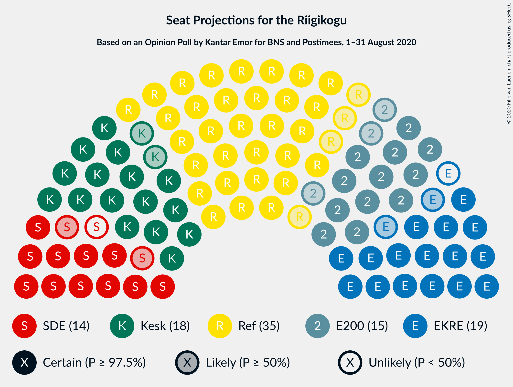
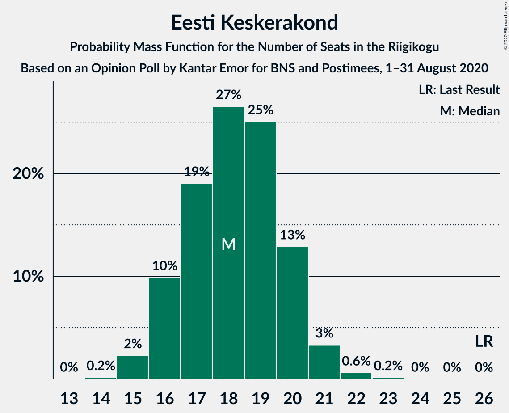
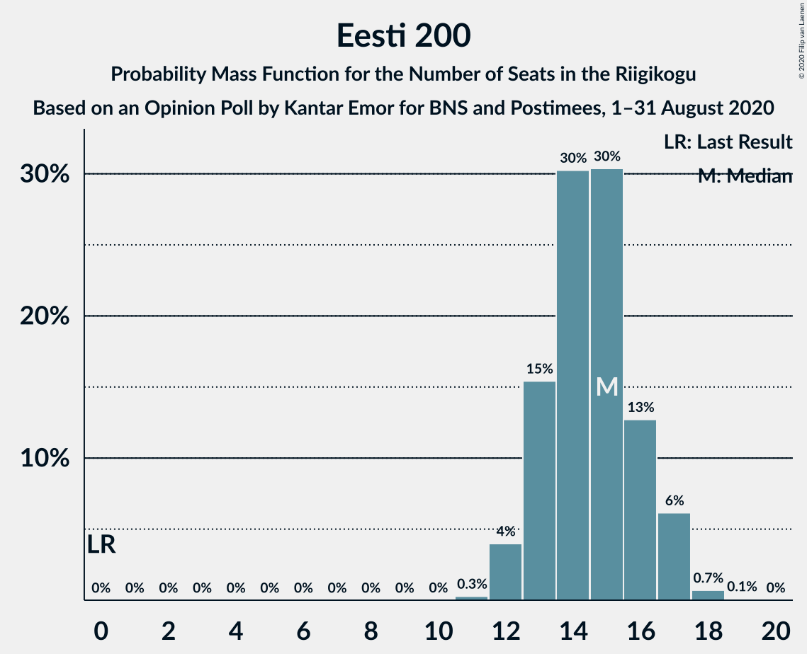
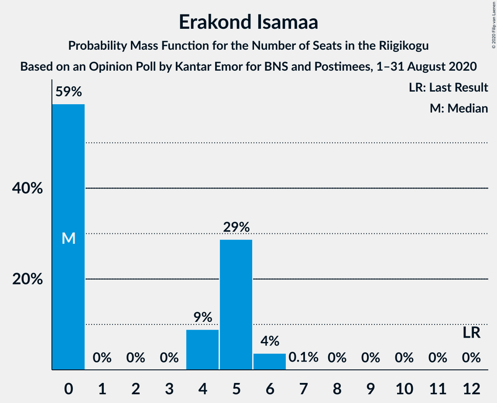
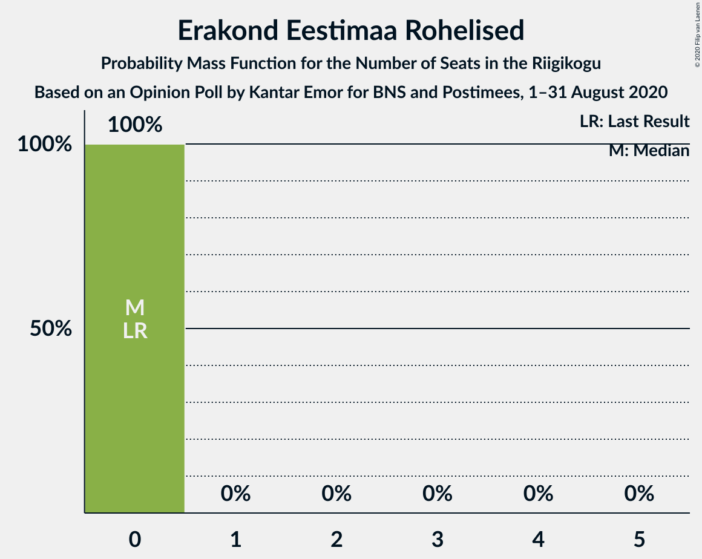
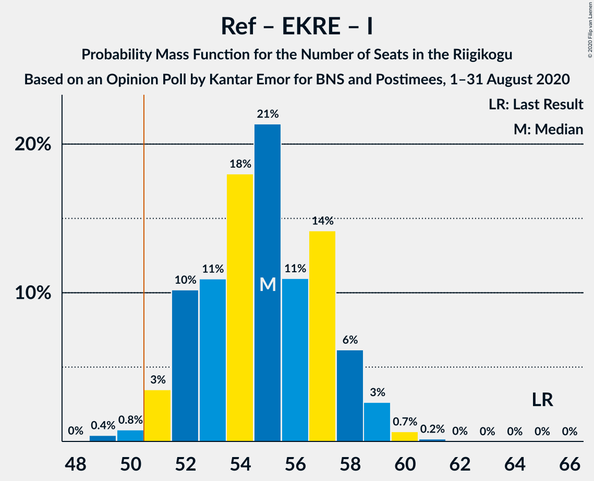
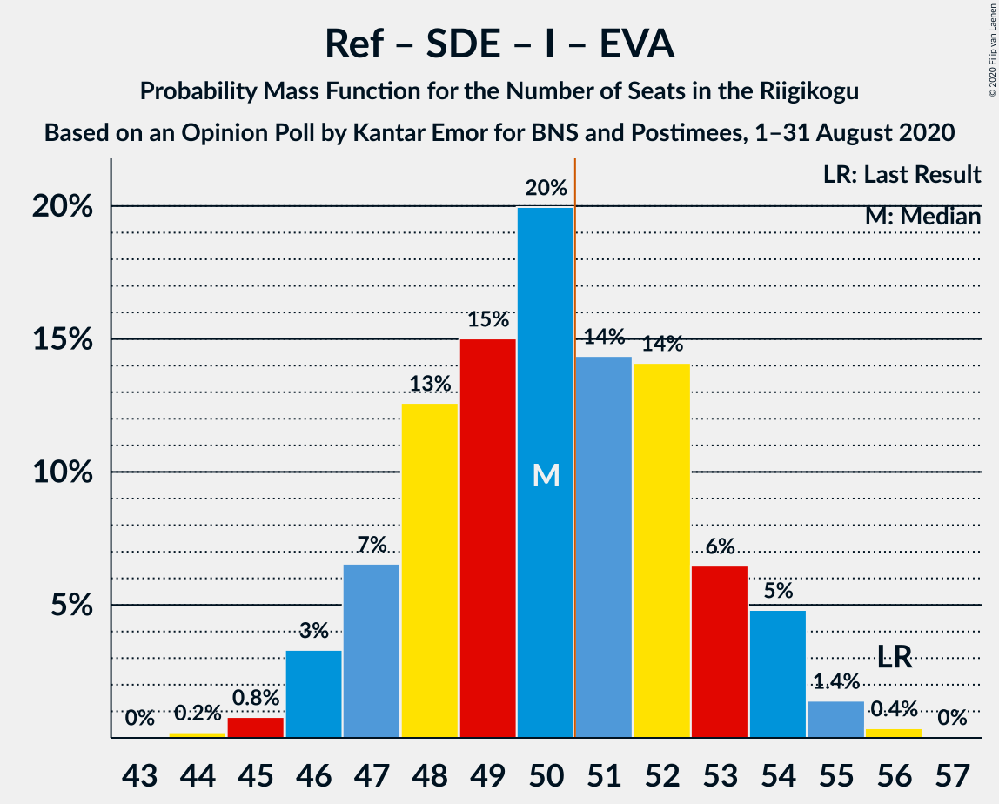
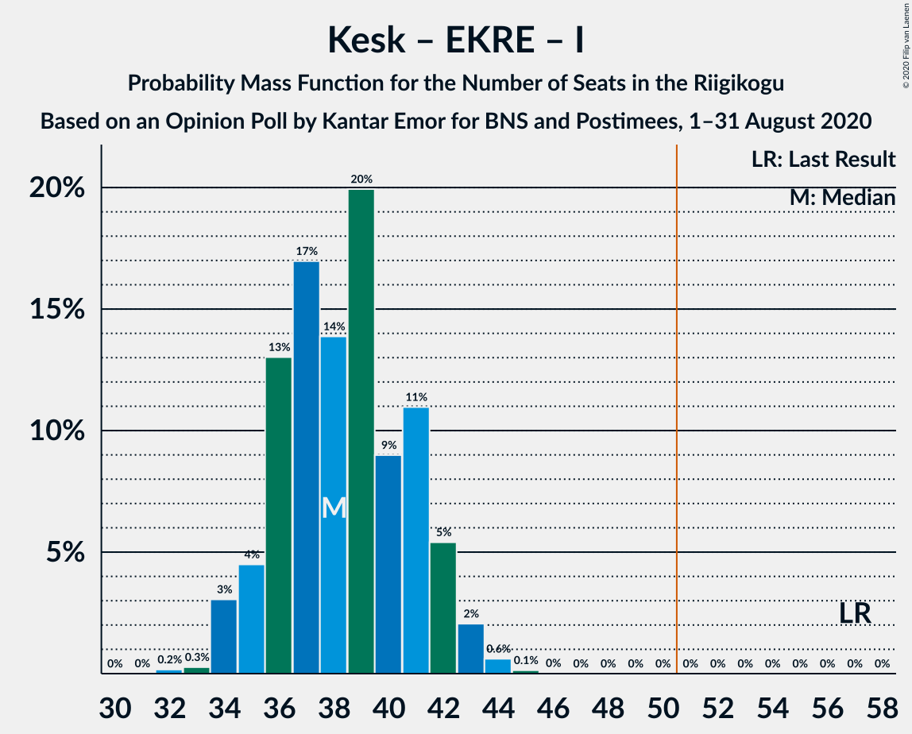
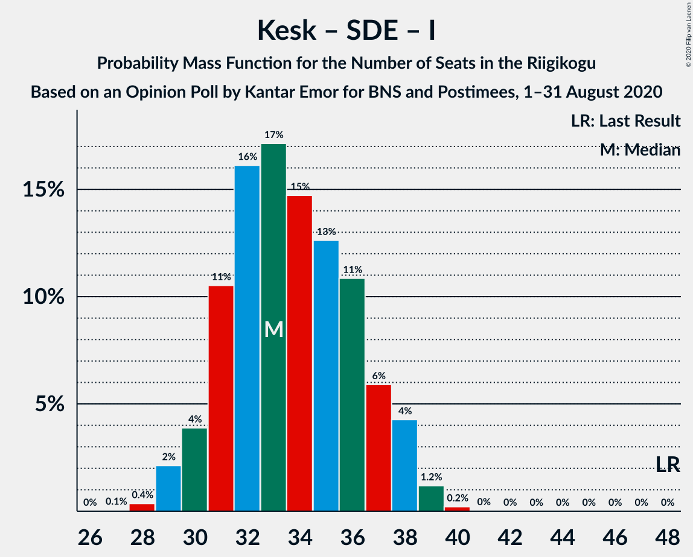

# Opinion Poll by Kantar Emor for BNS and Postimees, 1–31 August 2020

<a href="#voting-intentions">Voting Intentions</a> | <a href="#seats">Seats</a> | <a href="#coalitions">Coalitions</a> | <a href="#technical-information">Technical Information</a>

## Voting Intentions

### Confidence Intervals

| Party | Last Result | Poll Result | 80% Confidence Interval | 90% Confidence Interval | 95% Confidence Interval | 99% Confidence Interval |
|:-----:|:-----------:|:-----------:|:-----------------------:|:-----------------------:|:-----------------------:|:-----------------------:|
| Eesti Reformierakond | 28.9% | 29.4% | 27.8–31.1% |27.4–31.6% |27.0–32.0% |26.2–32.8% |
| Eesti Keskerakond | 23.1% | 16.6% | 15.4–18.0% |15.0–18.4% |14.7–18.8% |14.1–19.5% |
| Eesti Konservatiivne Rahvaerakond | 17.8% | 16.6% | 15.4–18.0% |15.0–18.4% |14.7–18.8% |14.1–19.5% |
| Eesti 200 | 4.4% | 13.7% | 12.5–15.0% |12.2–15.4% |11.9–15.7% |11.4–16.4% |
| Sotsiaaldemokraatlik Erakond | 9.8% | 12.8% | 11.6–14.1% |11.3–14.4% |11.1–14.7% |10.5–15.4% |
| Erakond Isamaa | 11.4% | 4.9% | 4.2–5.8% |4.0–6.0% |3.8–6.2% |3.5–6.7% |
| Erakond Eestimaa Rohelised | 1.8% | 2.0% | 1.6–2.6% |1.4–2.7% |1.3–2.9% |1.2–3.2% |
| Eesti Vabaerakond | 1.2% | 0.9% | 0.7–1.4% |0.6–1.5% |0.5–1.6% |0.4–1.9% |

*Note:* The poll result column reflects the actual value used in the calculations. Published results may vary slightly, and in addition be rounded to fewer digits.

## Seats

### Confidence Intervals

| Party | Last Result | Median | 80% Confidence Interval | 90% Confidence Interval | 95% Confidence Interval | 99% Confidence Interval |
|:-----:|:-----------:|:------:|:-----------------------:|:-----------------------:|:-----------------------:|:-----------------------:|
| <a href="#eesti-reformierakond">Eesti Reformierakond</a> | 34 | 35 | 32–37 |32–38 |31–38 |30–39 |
| <a href="#eesti-keskerakond">Eesti Keskerakond</a> | 26 | 18 | 16–20 |16–20 |16–21 |15–22 |
| <a href="#eesti-konservatiivne-rahvaerakond">Eesti Konservatiivne Rahvaerakond</a> | 19 | 18 | 16–20 |16–21 |16–21 |15–22 |
| <a href="#eesti-200">Eesti 200</a> | 0 | 15 | 13–16 |13–17 |12–17 |12–18 |
| <a href="#sotsiaaldemokraatlik-erakond">Sotsiaaldemokraatlik Erakond</a> | 10 | 13 | 12–15 |12–15 |11–16 |11–17 |
| <a href="#erakond-isamaa">Erakond Isamaa</a> | 12 | 0 | 0–5 |0–5 |0–6 |0–6 |
| <a href="#erakond-eestimaa-rohelised">Erakond Eestimaa Rohelised</a> | 0 | 0 | 0 |0 |0 |0 |
| <a href="#eesti-vabaerakond">Eesti Vabaerakond</a> | 0 | 0 | 0 |0 |0 |0 |

### Eesti Reformierakond

*For a full overview of the results for this party, see the [Eesti Reformierakond](party-eestireformierakond.html) page.*

| Number of Seats | Probability | Accumulated | Special Marks |
|:---------------:|:-----------:|:-----------:|:-------------:|
| 29 | 0.2% | 100% |  |
| 30 | 0.8% | 99.8% |  |
| 31 | 3% | 99.0% |  |
| 32 | 7% | 96% |  |
| 33 | 18% | 90% |  |
| 34 | 18% | 71% | Last Result |
| 35 | 21% | 53% | Median |
| 36 | 18% | 32% |  |
| 37 | 8% | 14% |  |
| 38 | 5% | 6% |  |
| 39 | 1.0% | 1.3% |  |
| 40 | 0.2% | 0.3% |  |
| 41 | 0.1% | 0.1% |  |
| 42 | 0% | 0% |  |

### Eesti Keskerakond

*For a full overview of the results for this party, see the [Eesti Keskerakond](party-eestikeskerakond.html) page.*

| Number of Seats | Probability | Accumulated | Special Marks |
|:---------------:|:-----------:|:-----------:|:-------------:|
| 14 | 0.2% | 100% |  |
| 15 | 2% | 99.8% |  |
| 16 | 10% | 98% |  |
| 17 | 19% | 88% |  |
| 18 | 27% | 69% | Median |
| 19 | 25% | 42% |  |
| 20 | 13% | 17% |  |
| 21 | 3% | 4% |  |
| 22 | 0.6% | 0.8% |  |
| 23 | 0.2% | 0.2% |  |
| 24 | 0% | 0% |  |
| 25 | 0% | 0% |  |
| 26 | 0% | 0% | Last Result |

### Eesti Konservatiivne Rahvaerakond

*For a full overview of the results for this party, see the [Eesti Konservatiivne Rahvaerakond](party-eestikonservatiivnerahvaerakond.html) page.*

| Number of Seats | Probability | Accumulated | Special Marks |
|:---------------:|:-----------:|:-----------:|:-------------:|
| 14 | 0.2% | 100% |  |
| 15 | 2% | 99.8% |  |
| 16 | 10% | 98% |  |
| 17 | 24% | 88% |  |
| 18 | 22% | 65% | Median |
| 19 | 26% | 43% | Last Result |
| 20 | 11% | 17% |  |
| 21 | 5% | 5% |  |
| 22 | 0.8% | 0.9% |  |
| 23 | 0.1% | 0.1% |  |
| 24 | 0% | 0% |  |

### Eesti 200

*For a full overview of the results for this party, see the [Eesti 200](party-eesti200.html) page.*

| Number of Seats | Probability | Accumulated | Special Marks |
|:---------------:|:-----------:|:-----------:|:-------------:|
| 0 | 0% | 100% | Last Result |
| 1 | 0% | 100% |  |
| 2 | 0% | 100% |  |
| 3 | 0% | 100% |  |
| 4 | 0% | 100% |  |
| 5 | 0% | 100% |  |
| 6 | 0% | 100% |  |
| 7 | 0% | 100% |  |
| 8 | 0% | 100% |  |
| 9 | 0% | 100% |  |
| 10 | 0% | 100% |  |
| 11 | 0.3% | 100% |  |
| 12 | 4% | 99.7% |  |
| 13 | 15% | 96% |  |
| 14 | 30% | 80% |  |
| 15 | 30% | 50% | Median |
| 16 | 13% | 20% |  |
| 17 | 6% | 7% |  |
| 18 | 0.7% | 0.8% |  |
| 19 | 0.1% | 0.1% |  |
| 20 | 0% | 0% |  |

### Sotsiaaldemokraatlik Erakond

*For a full overview of the results for this party, see the [Sotsiaaldemokraatlik Erakond](party-sotsiaaldemokraatlikerakond.html) page.*

| Number of Seats | Probability | Accumulated | Special Marks |
|:---------------:|:-----------:|:-----------:|:-------------:|
| 10 | 0.4% | 100% | Last Result |
| 11 | 4% | 99.6% |  |
| 12 | 17% | 96% |  |
| 13 | 29% | 79% | Median |
| 14 | 31% | 50% |  |
| 15 | 14% | 18% |  |
| 16 | 4% | 4% |  |
| 17 | 0.7% | 0.7% |  |
| 18 | 0% | 0% |  |

### Erakond Isamaa

*For a full overview of the results for this party, see the [Erakond Isamaa](party-erakondisamaa.html) page.*

| Number of Seats | Probability | Accumulated | Special Marks |
|:---------------:|:-----------:|:-----------:|:-------------:|
| 0 | 59% | 100% | Median |
| 1 | 0% | 41% |  |
| 2 | 0% | 41% |  |
| 3 | 0% | 41% |  |
| 4 | 9% | 41% |  |
| 5 | 29% | 33% |  |
| 6 | 4% | 4% |  |
| 7 | 0.1% | 0.1% |  |
| 8 | 0% | 0% |  |
| 9 | 0% | 0% |  |
| 10 | 0% | 0% |  |
| 11 | 0% | 0% |  |
| 12 | 0% | 0% | Last Result |

### Erakond Eestimaa Rohelised

*For a full overview of the results for this party, see the [Erakond Eestimaa Rohelised](party-erakondeestimaarohelised.html) page.*

| Number of Seats | Probability | Accumulated | Special Marks |
|:---------------:|:-----------:|:-----------:|:-------------:|
| 0 | 100% | 100% | Last Result, Median |

### Eesti Vabaerakond

*For a full overview of the results for this party, see the [Eesti Vabaerakond](party-eestivabaerakond.html) page.*

| Number of Seats | Probability | Accumulated | Special Marks |
|:---------------:|:-----------:|:-----------:|:-------------:|
| 0 | 100% | 100% | Last Result, Median |

## Coalitions

### Confidence Intervals

| Coalition | Last Result | Median | Majority? | 80% Confidence Interval | 90% Confidence Interval | 95% Confidence Interval | 99% Confidence Interval |
|:---------:|:-----------:|:------:|:---------:|:-----------------------:|:-----------------------:|:-----------------------:|:-----------------------:|
| Eesti Reformierakond – Eesti Keskerakond – Eesti Konservatiivne Rahvaerakond | 79 | 71 | 100% | 68–74 | 67–74 | 67–75 | 65–76 |
| Eesti Reformierakond – Eesti Konservatiivne Rahvaerakond – Erakond Isamaa | 65 | 55 | 98.8% | 52–57 | 52–58 | 51–59 | 50–60 |
| Eesti Reformierakond – Eesti Keskerakond | 60 | 53 | 84% | 50–55 | 49–56 | 49–57 | 47–58 |
| Eesti Reformierakond – Eesti Konservatiivne Rahvaerakond | 53 | 53 | 85% | 50–55 | 49–56 | 49–57 | 47–58 |
| Eesti Reformierakond – Sotsiaaldemokraatlik Erakond – Erakond Isamaa – Eesti Vabaerakond | 56 | 50 | 42% | 47–53 | 47–54 | 46–54 | 45–55 |
| Eesti Reformierakond – Sotsiaaldemokraatlik Erakond – Erakond Isamaa | 56 | 50 | 42% | 47–53 | 47–54 | 46–54 | 45–55 |
| Eesti Reformierakond – Sotsiaaldemokraatlik Erakond | 44 | 48 | 11% | 45–51 | 45–51 | 44–52 | 43–53 |
| Eesti Keskerakond – Eesti Konservatiivne Rahvaerakond – Erakond Isamaa | 57 | 38 | 0% | 36–41 | 35–42 | 34–43 | 34–44 |
| Eesti Reformierakond – Erakond Isamaa | 46 | 37 | 0% | 34–40 | 33–41 | 33–41 | 31–42 |
| Eesti Keskerakond – Eesti Konservatiivne Rahvaerakond | 45 | 36 | 0% | 34–39 | 33–39 | 33–40 | 32–41 |
| Eesti Keskerakond – Sotsiaaldemokraatlik Erakond – Erakond Isamaa | 48 | 33 | 0% | 31–37 | 30–38 | 29–38 | 29–39 |
| Eesti Keskerakond – Sotsiaaldemokraatlik Erakond | 36 | 32 | 0% | 29–34 | 29–34 | 28–35 | 27–36 |
| Eesti Konservatiivne Rahvaerakond – Sotsiaaldemokraatlik Erakond | 29 | 32 | 0% | 29–34 | 29–35 | 28–35 | 27–36 |

### Eesti Reformierakond – Eesti Keskerakond – Eesti Konservatiivne Rahvaerakond

| Number of Seats | Probability | Accumulated | Special Marks |
|:---------------:|:-----------:|:-----------:|:-------------:|
| 64 | 0.1% | 100% |  |
| 65 | 0.6% | 99.9% |  |
| 66 | 2% | 99.3% |  |
| 67 | 5% | 98% |  |
| 68 | 8% | 93% |  |
| 69 | 13% | 85% |  |
| 70 | 13% | 72% |  |
| 71 | 16% | 59% | Median |
| 72 | 13% | 43% |  |
| 73 | 18% | 30% |  |
| 74 | 8% | 13% |  |
| 75 | 4% | 5% |  |
| 76 | 0.7% | 0.9% |  |
| 77 | 0.2% | 0.2% |  |
| 78 | 0% | 0% |  |
| 79 | 0% | 0% | Last Result |

### Eesti Reformierakond – Eesti Konservatiivne Rahvaerakond – Erakond Isamaa

| Number of Seats | Probability | Accumulated | Special Marks |
|:---------------:|:-----------:|:-----------:|:-------------:|
| 48 | 0% | 100% |  |
| 49 | 0.4% | 99.9% |  |
| 50 | 0.8% | 99.5% |  |
| 51 | 3% | 98.8% | Majority |
| 52 | 10% | 95% |  |
| 53 | 11% | 85% | Median |
| 54 | 18% | 74% |  |
| 55 | 21% | 56% |  |
| 56 | 11% | 35% |  |
| 57 | 14% | 24% |  |
| 58 | 6% | 10% |  |
| 59 | 3% | 3% |  |
| 60 | 0.7% | 0.9% |  |
| 61 | 0.2% | 0.2% |  |
| 62 | 0% | 0% |  |
| 63 | 0% | 0% |  |
| 64 | 0% | 0% |  |
| 65 | 0% | 0% | Last Result |

### Eesti Reformierakond – Eesti Keskerakond

| Number of Seats | Probability | Accumulated | Special Marks |
|:---------------:|:-----------:|:-----------:|:-------------:|
| 46 | 0.1% | 100% |  |
| 47 | 0.5% | 99.9% |  |
| 48 | 2% | 99.4% |  |
| 49 | 3% | 98% |  |
| 50 | 10% | 95% |  |
| 51 | 12% | 84% | Majority |
| 52 | 17% | 73% |  |
| 53 | 18% | 56% | Median |
| 54 | 17% | 39% |  |
| 55 | 12% | 22% |  |
| 56 | 6% | 10% |  |
| 57 | 3% | 4% |  |
| 58 | 0.5% | 0.7% |  |
| 59 | 0.1% | 0.2% |  |
| 60 | 0% | 0% | Last Result |

### Eesti Reformierakond – Eesti Konservatiivne Rahvaerakond

| Number of Seats | Probability | Accumulated | Special Marks |
|:---------------:|:-----------:|:-----------:|:-------------:|
| 46 | 0.1% | 100% |  |
| 47 | 0.4% | 99.9% |  |
| 48 | 2% | 99.5% |  |
| 49 | 4% | 98% |  |
| 50 | 9% | 94% |  |
| 51 | 11% | 85% | Majority |
| 52 | 21% | 75% |  |
| 53 | 14% | 53% | Last Result, Median |
| 54 | 17% | 40% |  |
| 55 | 13% | 22% |  |
| 56 | 5% | 9% |  |
| 57 | 3% | 4% |  |
| 58 | 0.9% | 1.1% |  |
| 59 | 0.1% | 0.2% |  |
| 60 | 0% | 0% |  |

### Eesti Reformierakond – Sotsiaaldemokraatlik Erakond – Erakond Isamaa – Eesti Vabaerakond

| Number of Seats | Probability | Accumulated | Special Marks |
|:---------------:|:-----------:|:-----------:|:-------------:|
| 44 | 0.2% | 100% |  |
| 45 | 0.8% | 99.8% |  |
| 46 | 3% | 99.0% |  |
| 47 | 7% | 96% |  |
| 48 | 13% | 89% | Median |
| 49 | 15% | 77% |  |
| 50 | 20% | 62% |  |
| 51 | 14% | 42% | Majority |
| 52 | 14% | 27% |  |
| 53 | 6% | 13% |  |
| 54 | 5% | 7% |  |
| 55 | 1.4% | 2% |  |
| 56 | 0.4% | 0.4% | Last Result |
| 57 | 0% | 0% |  |

### Eesti Reformierakond – Sotsiaaldemokraatlik Erakond – Erakond Isamaa

| Number of Seats | Probability | Accumulated | Special Marks |
|:---------------:|:-----------:|:-----------:|:-------------:|
| 44 | 0.2% | 100% |  |
| 45 | 0.8% | 99.8% |  |
| 46 | 3% | 99.0% |  |
| 47 | 7% | 96% |  |
| 48 | 13% | 89% | Median |
| 49 | 15% | 77% |  |
| 50 | 20% | 62% |  |
| 51 | 14% | 42% | Majority |
| 52 | 14% | 27% |  |
| 53 | 6% | 13% |  |
| 54 | 5% | 7% |  |
| 55 | 1.4% | 2% |  |
| 56 | 0.4% | 0.4% | Last Result |
| 57 | 0% | 0% |  |

### Eesti Reformierakond – Sotsiaaldemokraatlik Erakond

| Number of Seats | Probability | Accumulated | Special Marks |
|:---------------:|:-----------:|:-----------:|:-------------:|
| 42 | 0.3% | 100% |  |
| 43 | 1.0% | 99.7% |  |
| 44 | 3% | 98.7% | Last Result |
| 45 | 7% | 96% |  |
| 46 | 11% | 89% |  |
| 47 | 17% | 79% |  |
| 48 | 18% | 62% | Median |
| 49 | 18% | 44% |  |
| 50 | 15% | 26% |  |
| 51 | 7% | 11% | Majority |
| 52 | 3% | 4% |  |
| 53 | 0.8% | 1.0% |  |
| 54 | 0.2% | 0.2% |  |
| 55 | 0% | 0% |  |

### Eesti Keskerakond – Eesti Konservatiivne Rahvaerakond – Erakond Isamaa

| Number of Seats | Probability | Accumulated | Special Marks |
|:---------------:|:-----------:|:-----------:|:-------------:|
| 32 | 0.2% | 100% |  |
| 33 | 0.3% | 99.8% |  |
| 34 | 3% | 99.6% |  |
| 35 | 4% | 96% |  |
| 36 | 13% | 92% | Median |
| 37 | 17% | 79% |  |
| 38 | 14% | 62% |  |
| 39 | 20% | 48% |  |
| 40 | 9% | 28% |  |
| 41 | 11% | 19% |  |
| 42 | 5% | 8% |  |
| 43 | 2% | 3% |  |
| 44 | 0.6% | 0.8% |  |
| 45 | 0.1% | 0.2% |  |
| 46 | 0% | 0% |  |
| 47 | 0% | 0% |  |
| 48 | 0% | 0% |  |
| 49 | 0% | 0% |  |
| 50 | 0% | 0% |  |
| 51 | 0% | 0% | Majority |
| 52 | 0% | 0% |  |
| 53 | 0% | 0% |  |
| 54 | 0% | 0% |  |
| 55 | 0% | 0% |  |
| 56 | 0% | 0% |  |
| 57 | 0% | 0% | Last Result |

### Eesti Reformierakond – Erakond Isamaa

| Number of Seats | Probability | Accumulated | Special Marks |
|:---------------:|:-----------:|:-----------:|:-------------:|
| 30 | 0.1% | 100% |  |
| 31 | 0.5% | 99.9% |  |
| 32 | 1.3% | 99.4% |  |
| 33 | 8% | 98% |  |
| 34 | 9% | 91% |  |
| 35 | 15% | 81% | Median |
| 36 | 16% | 66% |  |
| 37 | 13% | 50% |  |
| 38 | 15% | 37% |  |
| 39 | 9% | 22% |  |
| 40 | 8% | 13% |  |
| 41 | 4% | 5% |  |
| 42 | 0.9% | 1.3% |  |
| 43 | 0.3% | 0.4% |  |
| 44 | 0.1% | 0.1% |  |
| 45 | 0% | 0% |  |
| 46 | 0% | 0% | Last Result |

### Eesti Keskerakond – Eesti Konservatiivne Rahvaerakond

| Number of Seats | Probability | Accumulated | Special Marks |
|:---------------:|:-----------:|:-----------:|:-------------:|
| 31 | 0.3% | 100% |  |
| 32 | 2% | 99.7% |  |
| 33 | 3% | 98% |  |
| 34 | 12% | 95% |  |
| 35 | 15% | 82% |  |
| 36 | 20% | 68% | Median |
| 37 | 21% | 47% |  |
| 38 | 14% | 27% |  |
| 39 | 9% | 13% |  |
| 40 | 3% | 4% |  |
| 41 | 0.9% | 1.2% |  |
| 42 | 0.2% | 0.2% |  |
| 43 | 0% | 0% |  |
| 44 | 0% | 0% |  |
| 45 | 0% | 0% | Last Result |

### Eesti Keskerakond – Sotsiaaldemokraatlik Erakond – Erakond Isamaa

| Number of Seats | Probability | Accumulated | Special Marks |
|:---------------:|:-----------:|:-----------:|:-------------:|
| 27 | 0.1% | 100% |  |
| 28 | 0.4% | 99.9% |  |
| 29 | 2% | 99.6% |  |
| 30 | 4% | 97% |  |
| 31 | 11% | 94% | Median |
| 32 | 16% | 83% |  |
| 33 | 17% | 67% |  |
| 34 | 15% | 50% |  |
| 35 | 13% | 35% |  |
| 36 | 11% | 22% |  |
| 37 | 6% | 12% |  |
| 38 | 4% | 6% |  |
| 39 | 1.2% | 1.4% |  |
| 40 | 0.2% | 0.2% |  |
| 41 | 0% | 0% |  |
| 42 | 0% | 0% |  |
| 43 | 0% | 0% |  |
| 44 | 0% | 0% |  |
| 45 | 0% | 0% |  |
| 46 | 0% | 0% |  |
| 47 | 0% | 0% |  |
| 48 | 0% | 0% | Last Result |

### Eesti Keskerakond – Sotsiaaldemokraatlik Erakond

| Number of Seats | Probability | Accumulated | Special Marks |
|:---------------:|:-----------:|:-----------:|:-------------:|
| 26 | 0.1% | 100% |  |
| 27 | 0.7% | 99.9% |  |
| 28 | 3% | 99.2% |  |
| 29 | 9% | 96% |  |
| 30 | 12% | 87% |  |
| 31 | 21% | 75% | Median |
| 32 | 22% | 54% |  |
| 33 | 17% | 32% |  |
| 34 | 10% | 15% |  |
| 35 | 3% | 5% |  |
| 36 | 1.0% | 1.4% | Last Result |
| 37 | 0.3% | 0.3% |  |
| 38 | 0% | 0% |  |

### Eesti Konservatiivne Rahvaerakond – Sotsiaaldemokraatlik Erakond

| Number of Seats | Probability | Accumulated | Special Marks |
|:---------------:|:-----------:|:-----------:|:-------------:|
| 26 | 0.1% | 100% |  |
| 27 | 0.4% | 99.9% |  |
| 28 | 3% | 99.5% |  |
| 29 | 10% | 96% | Last Result |
| 30 | 11% | 86% |  |
| 31 | 25% | 75% | Median |
| 32 | 17% | 51% |  |
| 33 | 19% | 33% |  |
| 34 | 8% | 15% |  |
| 35 | 5% | 7% |  |
| 36 | 2% | 2% |  |
| 37 | 0.2% | 0.2% |  |
| 38 | 0% | 0% |  |

## Technical Information

### Opinion Poll

+ **Polling firm:** Kantar Emor
+ **Commissioner(s):** BNS and Postimees
+ **Fieldwork period:** 1–31 August 2020

### Calculations

+ **Sample size:** 1268
+ **Simulations done:** 1,048,576
+ **Error estimate:** 0.72%

