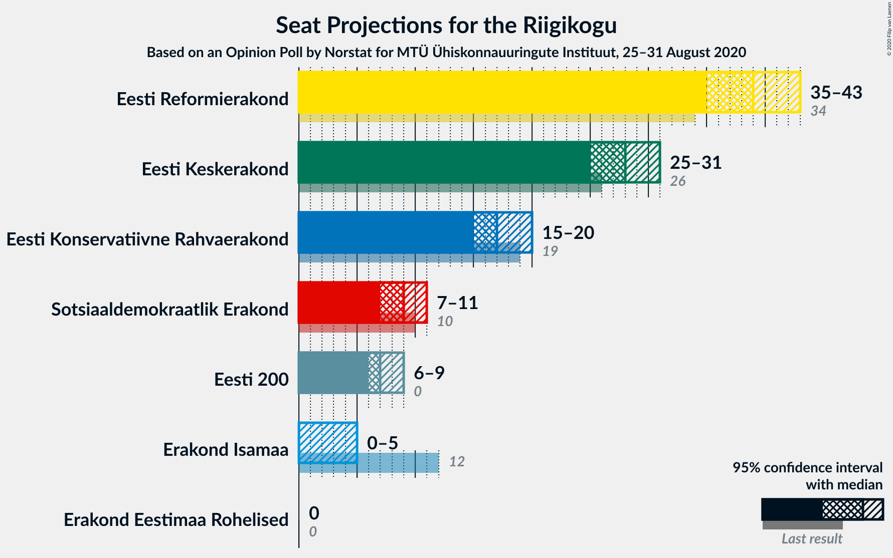
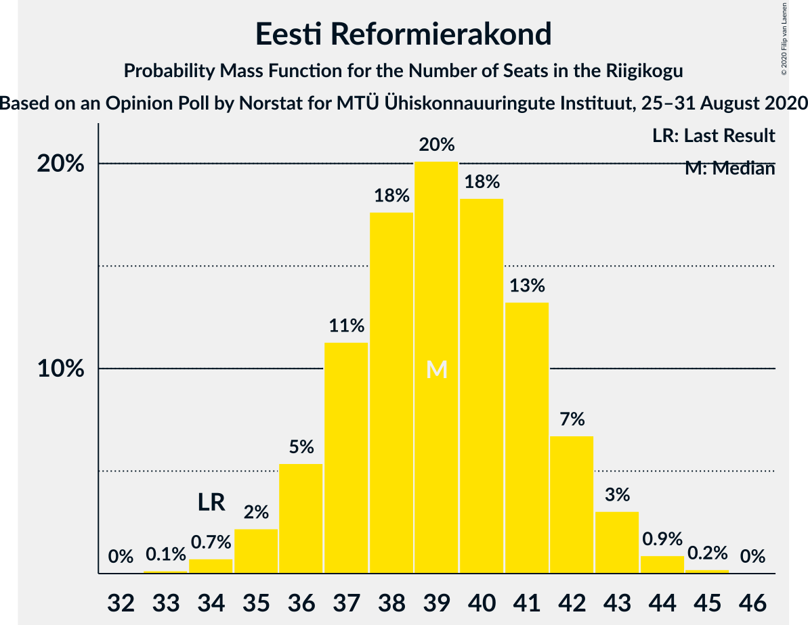
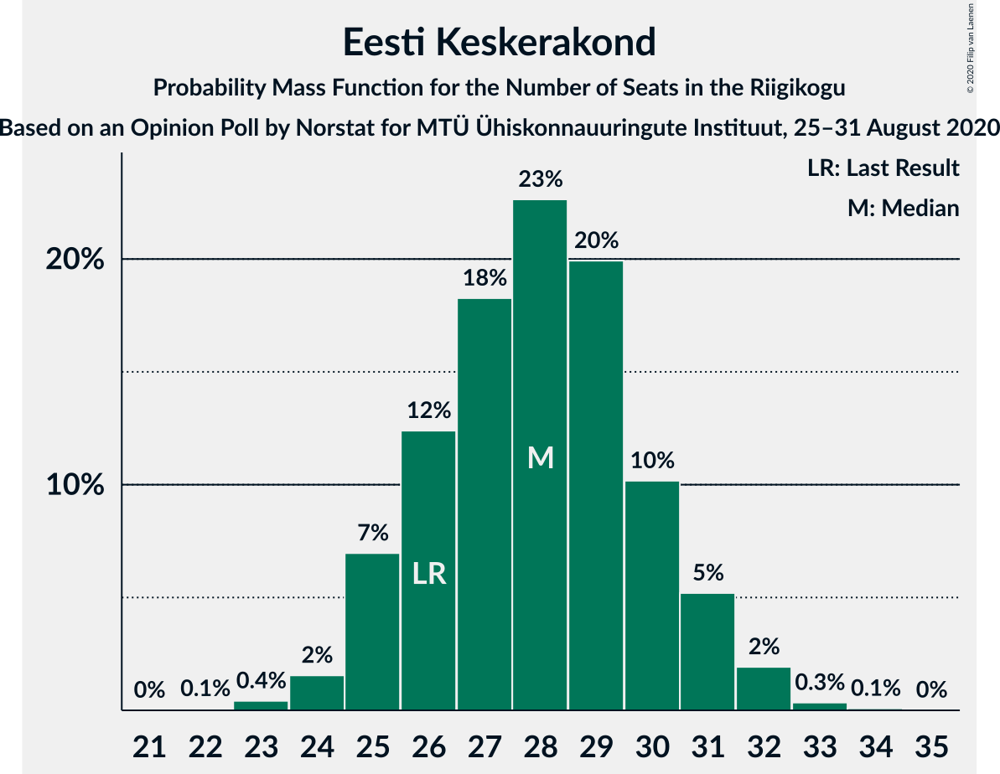
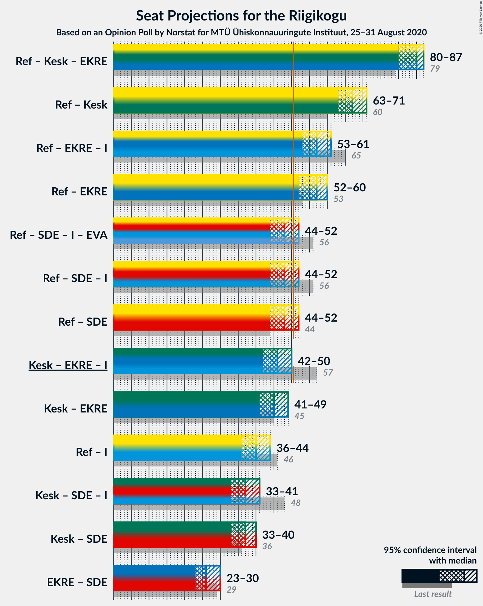
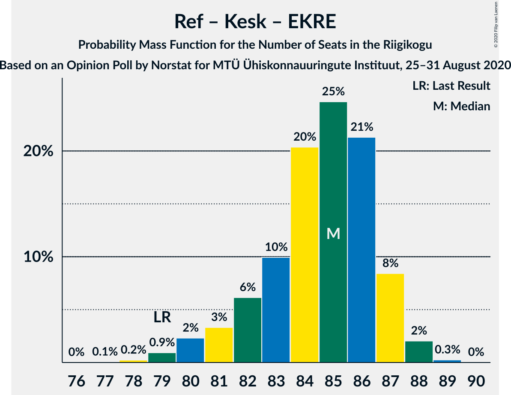
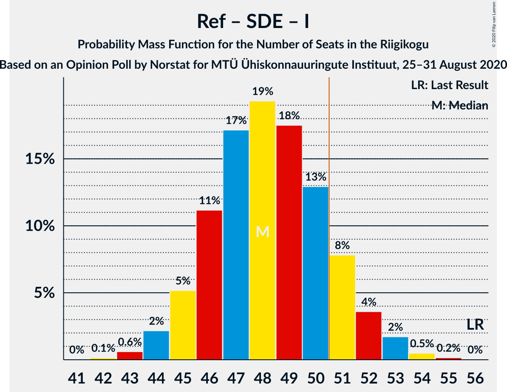
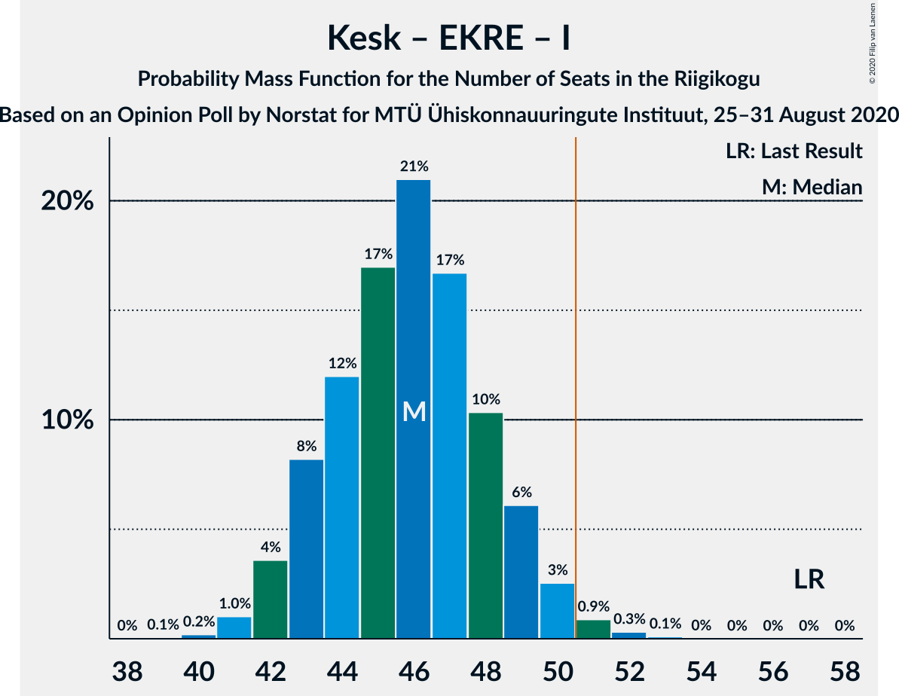
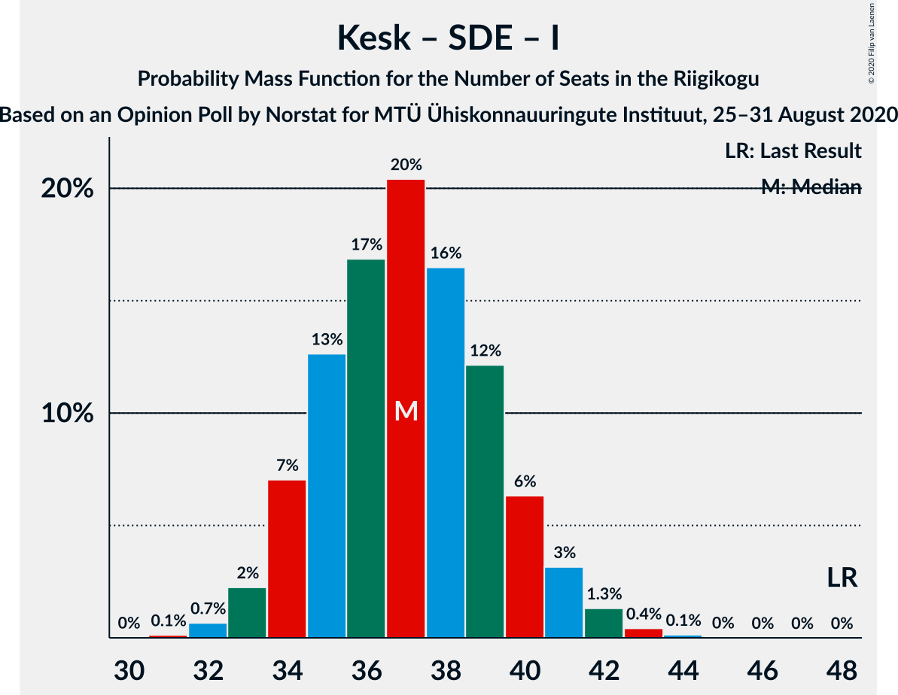

# Opinion Poll by Norstat for MTÜ Ühiskonnauuringute Instituut, 25–31 August 2020

<a href="#voting-intentions">Voting Intentions</a> | <a href="#seats">Seats</a> | <a href="#coalitions">Coalitions</a> | <a href="#technical-information">Technical Information</a>

## Voting Intentions

### Confidence Intervals

| Party | Last Result | Poll Result | 80% Confidence Interval | 90% Confidence Interval | 95% Confidence Interval | 99% Confidence Interval |
|:-----:|:-----------:|:-----------:|:-----------------------:|:-----------------------:|:-----------------------:|:-----------------------:|
| Eesti Reformierakond | 28.9% | 33.5% | 31.6–35.5% |31.1–36.0% |30.6–36.5% |29.8–37.4% |
| Eesti Keskerakond | 23.1% | 24.8% | 23.1–26.6% |22.6–27.1% |22.2–27.6% |21.4–28.5% |
| Eesti Konservatiivne Rahvaerakond | 17.8% | 16.4% | 15.0–18.0% |14.6–18.4% |14.2–18.8% |13.6–19.6% |
| Sotsiaaldemokraatlik Erakond | 9.8% | 8.9% | 7.8–10.2% |7.5–10.5% |7.3–10.8% |6.8–11.5% |
| Eesti 200 | 4.4% | 7.7% | 6.7–8.9% |6.4–9.2% |6.2–9.5% |5.8–10.1% |
| Erakond Isamaa | 11.4% | 4.1% | 3.4–5.0% |3.2–5.3% |3.0–5.5% |2.7–6.0% |
| Erakond Eestimaa Rohelised | 1.8% | 3.3% | 2.7–4.1% |2.5–4.4% |2.4–4.6% |2.1–5.0% |

*Note:* The poll result column reflects the actual value used in the calculations. Published results may vary slightly, and in addition be rounded to fewer digits.

## Seats

### Confidence Intervals

| Party | Last Result | Median | 80% Confidence Interval | 90% Confidence Interval | 95% Confidence Interval | 99% Confidence Interval |
|:-----:|:-----------:|:------:|:-----------------------:|:-----------------------:|:-----------------------:|:-----------------------:|
| <a href="#eesti-reformierakond">Eesti Reformierakond</a> | 34 | 39 | 37–42 |36–42 |35–43 |34–44 |
| <a href="#eesti-keskerakond">Eesti Keskerakond</a> | 26 | 28 | 26–30 |25–31 |25–31 |23–32 |
| <a href="#eesti-konservatiivne-rahvaerakond">Eesti Konservatiivne Rahvaerakond</a> | 19 | 17 | 16–19 |15–20 |15–20 |14–21 |
| <a href="#sotsiaaldemokraatlik-erakond">Sotsiaaldemokraatlik Erakond</a> | 10 | 9 | 7–10 |7–10 |7–11 |6–12 |
| <a href="#eesti-200">Eesti 200</a> | 0 | 7 | 6–9 |6–9 |6–9 |5–10 |
| <a href="#erakond-isamaa">Erakond Isamaa</a> | 12 | 0 | 0–4 |0–4 |0–5 |0–5 |
| <a href="#erakond-eestimaa-rohelised">Erakond Eestimaa Rohelised</a> | 0 | 0 | 0 |0 |0 |0–4 |

### Eesti Reformierakond

*For a full overview of the results for this party, see the [Eesti Reformierakond](party-eestireformierakond.html) page.*

| Number of Seats | Probability | Accumulated | Special Marks |
|:---------------:|:-----------:|:-----------:|:-------------:|
| 33 | 0.1% | 100% |  |
| 34 | 0.7% | 99.8% | Last Result |
| 35 | 2% | 99.1% |  |
| 36 | 5% | 97% |  |
| 37 | 11% | 92% |  |
| 38 | 18% | 80% |  |
| 39 | 20% | 63% | Median |
| 40 | 18% | 42% |  |
| 41 | 13% | 24% |  |
| 42 | 7% | 11% |  |
| 43 | 3% | 4% |  |
| 44 | 0.9% | 1.1% |  |
| 45 | 0.2% | 0.2% |  |
| 46 | 0% | 0% |  |

### Eesti Keskerakond

*For a full overview of the results for this party, see the [Eesti Keskerakond](party-eestikeskerakond.html) page.*

| Number of Seats | Probability | Accumulated | Special Marks |
|:---------------:|:-----------:|:-----------:|:-------------:|
| 22 | 0.1% | 100% |  |
| 23 | 0.4% | 99.9% |  |
| 24 | 2% | 99.5% |  |
| 25 | 7% | 98% |  |
| 26 | 12% | 91% | Last Result |
| 27 | 18% | 79% |  |
| 28 | 23% | 60% | Median |
| 29 | 20% | 38% |  |
| 30 | 10% | 18% |  |
| 31 | 5% | 8% |  |
| 32 | 2% | 2% |  |
| 33 | 0.3% | 0.4% |  |
| 34 | 0.1% | 0.1% |  |
| 35 | 0% | 0% |  |

### Eesti Konservatiivne Rahvaerakond

*For a full overview of the results for this party, see the [Eesti Konservatiivne Rahvaerakond](party-eestikonservatiivnerahvaerakond.html) page.*

| Number of Seats | Probability | Accumulated | Special Marks |
|:---------------:|:-----------:|:-----------:|:-------------:|
| 13 | 0.2% | 100% |  |
| 14 | 1.3% | 99.8% |  |
| 15 | 7% | 98.6% |  |
| 16 | 15% | 91% |  |
| 17 | 29% | 76% | Median |
| 18 | 21% | 46% |  |
| 19 | 17% | 25% | Last Result |
| 20 | 6% | 8% |  |
| 21 | 2% | 2% |  |
| 22 | 0.4% | 0.4% |  |
| 23 | 0% | 0.1% |  |
| 24 | 0% | 0% |  |

### Sotsiaaldemokraatlik Erakond

*For a full overview of the results for this party, see the [Sotsiaaldemokraatlik Erakond](party-sotsiaaldemokraatlikerakond.html) page.*

| Number of Seats | Probability | Accumulated | Special Marks |
|:---------------:|:-----------:|:-----------:|:-------------:|
| 6 | 1.2% | 100% |  |
| 7 | 12% | 98.8% |  |
| 8 | 32% | 87% |  |
| 9 | 34% | 55% | Median |
| 10 | 16% | 21% | Last Result |
| 11 | 4% | 5% |  |
| 12 | 0.5% | 0.6% |  |
| 13 | 0% | 0% |  |

### Eesti 200

*For a full overview of the results for this party, see the [Eesti 200](party-eesti200.html) page.*

| Number of Seats | Probability | Accumulated | Special Marks |
|:---------------:|:-----------:|:-----------:|:-------------:|
| 0 | 0% | 100% | Last Result |
| 1 | 0% | 100% |  |
| 2 | 0% | 100% |  |
| 3 | 0% | 100% |  |
| 4 | 0% | 100% |  |
| 5 | 2% | 100% |  |
| 6 | 18% | 98% |  |
| 7 | 41% | 80% | Median |
| 8 | 28% | 39% |  |
| 9 | 9% | 11% |  |
| 10 | 2% | 2% |  |
| 11 | 0.1% | 0.1% |  |
| 12 | 0% | 0% |  |

### Erakond Isamaa

*For a full overview of the results for this party, see the [Erakond Isamaa](party-erakondisamaa.html) page.*

| Number of Seats | Probability | Accumulated | Special Marks |
|:---------------:|:-----------:|:-----------:|:-------------:|
| 0 | 90% | 100% | Median |
| 1 | 0% | 10% |  |
| 2 | 0% | 10% |  |
| 3 | 0% | 10% |  |
| 4 | 6% | 10% |  |
| 5 | 4% | 4% |  |
| 6 | 0.2% | 0.2% |  |
| 7 | 0% | 0% |  |
| 8 | 0% | 0% |  |
| 9 | 0% | 0% |  |
| 10 | 0% | 0% |  |
| 11 | 0% | 0% |  |
| 12 | 0% | 0% | Last Result |

### Erakond Eestimaa Rohelised

*For a full overview of the results for this party, see the [Erakond Eestimaa Rohelised](party-erakondeestimaarohelised.html) page.*

| Number of Seats | Probability | Accumulated | Special Marks |
|:---------------:|:-----------:|:-----------:|:-------------:|
| 0 | 99.5% | 100% | Last Result, Median |
| 1 | 0% | 0.5% |  |
| 2 | 0% | 0.5% |  |
| 3 | 0% | 0.5% |  |
| 4 | 0.4% | 0.5% |  |
| 5 | 0.2% | 0.2% |  |
| 6 | 0% | 0% |  |

## Coalitions

### Confidence Intervals

| Coalition | Last Result | Median | Majority? | 80% Confidence Interval | 90% Confidence Interval | 95% Confidence Interval | 99% Confidence Interval |
|:---------:|:-----------:|:------:|:---------:|:-----------------------:|:-----------------------:|:-----------------------:|:-----------------------:|
| Eesti Reformierakond – Eesti Keskerakond – Eesti Konservatiivne Rahvaerakond | 79 | 85 | 100% | 82–87 | 81–87 | 80–87 | 79–88 |
| Eesti Reformierakond – Eesti Keskerakond | 60 | 67 | 100% | 64–70 | 64–70 | 63–71 | 62–72 |
| Eesti Reformierakond – Eesti Konservatiivne Rahvaerakond – Erakond Isamaa | 65 | 57 | 100% | 55–60 | 54–60 | 53–61 | 52–62 |
| Eesti Reformierakond – Eesti Konservatiivne Rahvaerakond | 53 | 57 | 99.8% | 54–59 | 53–60 | 52–60 | 51–62 |
| Eesti Reformierakond – Sotsiaaldemokraatlik Erakond – Erakond Isamaa | 56 | 48 | 14% | 46–51 | 45–52 | 44–52 | 43–54 |
| Eesti Reformierakond – Sotsiaaldemokraatlik Erakond | 44 | 48 | 9% | 45–50 | 44–51 | 44–52 | 43–53 |
| Eesti Keskerakond – Eesti Konservatiivne Rahvaerakond – Erakond Isamaa | 57 | 46 | 1.3% | 43–48 | 43–49 | 42–50 | 41–51 |
| Eesti Keskerakond – Eesti Konservatiivne Rahvaerakond | 45 | 45 | 0.5% | 43–48 | 42–49 | 41–49 | 40–50 |
| Eesti Reformierakond – Erakond Isamaa | 46 | 40 | 0% | 37–42 | 36–43 | 36–44 | 35–45 |
| Eesti Keskerakond – Sotsiaaldemokraatlik Erakond – Erakond Isamaa | 48 | 37 | 0% | 34–40 | 34–41 | 33–41 | 32–43 |
| Eesti Keskerakond – Sotsiaaldemokraatlik Erakond | 36 | 37 | 0% | 34–39 | 34–40 | 33–40 | 32–41 |
| Eesti Konservatiivne Rahvaerakond – Sotsiaaldemokraatlik Erakond | 29 | 26 | 0% | 24–28 | 23–29 | 23–30 | 22–31 |

### Eesti Reformierakond – Eesti Keskerakond – Eesti Konservatiivne Rahvaerakond

| Number of Seats | Probability | Accumulated | Special Marks |
|:---------------:|:-----------:|:-----------:|:-------------:|
| 77 | 0.1% | 100% |  |
| 78 | 0.2% | 99.9% |  |
| 79 | 0.9% | 99.7% | Last Result |
| 80 | 2% | 98.8% |  |
| 81 | 3% | 96% |  |
| 82 | 6% | 93% |  |
| 83 | 10% | 87% |  |
| 84 | 20% | 77% | Median |
| 85 | 25% | 57% |  |
| 86 | 21% | 32% |  |
| 87 | 8% | 11% |  |
| 88 | 2% | 2% |  |
| 89 | 0.3% | 0.3% |  |
| 90 | 0% | 0% |  |

### Eesti Reformierakond – Eesti Keskerakond

| Number of Seats | Probability | Accumulated | Special Marks |
|:---------------:|:-----------:|:-----------:|:-------------:|
| 60 | 0.1% | 100% | Last Result |
| 61 | 0.3% | 99.9% |  |
| 62 | 1.4% | 99.5% |  |
| 63 | 3% | 98% |  |
| 64 | 6% | 95% |  |
| 65 | 11% | 89% |  |
| 66 | 15% | 78% |  |
| 67 | 18% | 63% | Median |
| 68 | 22% | 45% |  |
| 69 | 12% | 23% |  |
| 70 | 6% | 11% |  |
| 71 | 3% | 4% |  |
| 72 | 0.6% | 0.8% |  |
| 73 | 0.2% | 0.2% |  |
| 74 | 0% | 0% |  |

### Eesti Reformierakond – Eesti Konservatiivne Rahvaerakond – Erakond Isamaa

| Number of Seats | Probability | Accumulated | Special Marks |
|:---------------:|:-----------:|:-----------:|:-------------:|
| 51 | 0.2% | 100% | Majority |
| 52 | 0.7% | 99.7% |  |
| 53 | 3% | 99.0% |  |
| 54 | 6% | 96% |  |
| 55 | 12% | 91% |  |
| 56 | 17% | 78% | Median |
| 57 | 20% | 61% |  |
| 58 | 17% | 41% |  |
| 59 | 13% | 24% |  |
| 60 | 7% | 11% |  |
| 61 | 3% | 4% |  |
| 62 | 0.9% | 1.3% |  |
| 63 | 0.3% | 0.4% |  |
| 64 | 0.1% | 0.1% |  |
| 65 | 0% | 0% | Last Result |

### Eesti Reformierakond – Eesti Konservatiivne Rahvaerakond

| Number of Seats | Probability | Accumulated | Special Marks |
|:---------------:|:-----------:|:-----------:|:-------------:|
| 49 | 0% | 100% |  |
| 50 | 0.2% | 99.9% |  |
| 51 | 0.8% | 99.8% | Majority |
| 52 | 2% | 99.0% |  |
| 53 | 4% | 97% | Last Result |
| 54 | 7% | 93% |  |
| 55 | 14% | 86% |  |
| 56 | 18% | 71% | Median |
| 57 | 20% | 53% |  |
| 58 | 15% | 33% |  |
| 59 | 11% | 18% |  |
| 60 | 5% | 7% |  |
| 61 | 2% | 2% |  |
| 62 | 0.5% | 0.6% |  |
| 63 | 0.1% | 0.1% |  |
| 64 | 0% | 0% |  |

### Eesti Reformierakond – Sotsiaaldemokraatlik Erakond – Erakond Isamaa

| Number of Seats | Probability | Accumulated | Special Marks |
|:---------------:|:-----------:|:-----------:|:-------------:|
| 42 | 0.1% | 100% |  |
| 43 | 0.6% | 99.8% |  |
| 44 | 2% | 99.2% |  |
| 45 | 5% | 97% |  |
| 46 | 11% | 92% |  |
| 47 | 17% | 81% |  |
| 48 | 19% | 64% | Median |
| 49 | 18% | 44% |  |
| 50 | 13% | 27% |  |
| 51 | 8% | 14% | Majority |
| 52 | 4% | 6% |  |
| 53 | 2% | 2% |  |
| 54 | 0.5% | 0.7% |  |
| 55 | 0.2% | 0.2% |  |
| 56 | 0% | 0% | Last Result |

### Eesti Reformierakond – Sotsiaaldemokraatlik Erakond

| Number of Seats | Probability | Accumulated | Special Marks |
|:---------------:|:-----------:|:-----------:|:-------------:|
| 41 | 0.1% | 100% |  |
| 42 | 0.3% | 99.9% |  |
| 43 | 1.3% | 99.5% |  |
| 44 | 3% | 98% | Last Result |
| 45 | 7% | 95% |  |
| 46 | 13% | 88% |  |
| 47 | 19% | 75% |  |
| 48 | 19% | 56% | Median |
| 49 | 17% | 36% |  |
| 50 | 11% | 20% |  |
| 51 | 6% | 9% | Majority |
| 52 | 2% | 3% |  |
| 53 | 0.8% | 1.0% |  |
| 54 | 0.1% | 0.2% |  |
| 55 | 0% | 0% |  |

### Eesti Keskerakond – Eesti Konservatiivne Rahvaerakond – Erakond Isamaa

| Number of Seats | Probability | Accumulated | Special Marks |
|:---------------:|:-----------:|:-----------:|:-------------:|
| 39 | 0.1% | 100% |  |
| 40 | 0.2% | 99.9% |  |
| 41 | 1.0% | 99.7% |  |
| 42 | 4% | 98.7% |  |
| 43 | 8% | 95% |  |
| 44 | 12% | 87% |  |
| 45 | 17% | 75% | Median |
| 46 | 21% | 58% |  |
| 47 | 17% | 37% |  |
| 48 | 10% | 20% |  |
| 49 | 6% | 10% |  |
| 50 | 3% | 4% |  |
| 51 | 0.9% | 1.3% | Majority |
| 52 | 0.3% | 0.4% |  |
| 53 | 0.1% | 0.1% |  |
| 54 | 0% | 0% |  |
| 55 | 0% | 0% |  |
| 56 | 0% | 0% |  |
| 57 | 0% | 0% | Last Result |

### Eesti Keskerakond – Eesti Konservatiivne Rahvaerakond

| Number of Seats | Probability | Accumulated | Special Marks |
|:---------------:|:-----------:|:-----------:|:-------------:|
| 39 | 0.2% | 100% |  |
| 40 | 0.5% | 99.8% |  |
| 41 | 2% | 99.3% |  |
| 42 | 5% | 97% |  |
| 43 | 10% | 92% |  |
| 44 | 14% | 82% |  |
| 45 | 18% | 68% | Last Result, Median |
| 46 | 20% | 50% |  |
| 47 | 15% | 30% |  |
| 48 | 8% | 14% |  |
| 49 | 4% | 6% |  |
| 50 | 2% | 2% |  |
| 51 | 0.4% | 0.5% | Majority |
| 52 | 0.1% | 0.1% |  |
| 53 | 0% | 0% |  |

### Eesti Reformierakond – Erakond Isamaa

| Number of Seats | Probability | Accumulated | Special Marks |
|:---------------:|:-----------:|:-----------:|:-------------:|
| 33 | 0.1% | 100% |  |
| 34 | 0.4% | 99.9% |  |
| 35 | 1.4% | 99.6% |  |
| 36 | 4% | 98% |  |
| 37 | 9% | 94% |  |
| 38 | 16% | 85% |  |
| 39 | 19% | 69% | Median |
| 40 | 18% | 50% |  |
| 41 | 15% | 32% |  |
| 42 | 9% | 17% |  |
| 43 | 5% | 8% |  |
| 44 | 2% | 3% |  |
| 45 | 0.7% | 1.1% |  |
| 46 | 0.3% | 0.4% | Last Result |
| 47 | 0.1% | 0.1% |  |
| 48 | 0% | 0% |  |

### Eesti Keskerakond – Sotsiaaldemokraatlik Erakond – Erakond Isamaa

| Number of Seats | Probability | Accumulated | Special Marks |
|:---------------:|:-----------:|:-----------:|:-------------:|
| 31 | 0.1% | 100% |  |
| 32 | 0.7% | 99.9% |  |
| 33 | 2% | 99.2% |  |
| 34 | 7% | 97% |  |
| 35 | 13% | 90% |  |
| 36 | 17% | 77% |  |
| 37 | 20% | 60% | Median |
| 38 | 16% | 40% |  |
| 39 | 12% | 24% |  |
| 40 | 6% | 11% |  |
| 41 | 3% | 5% |  |
| 42 | 1.3% | 2% |  |
| 43 | 0.4% | 0.6% |  |
| 44 | 0.1% | 0.2% |  |
| 45 | 0% | 0% |  |
| 46 | 0% | 0% |  |
| 47 | 0% | 0% |  |
| 48 | 0% | 0% | Last Result |

### Eesti Keskerakond – Sotsiaaldemokraatlik Erakond

| Number of Seats | Probability | Accumulated | Special Marks |
|:---------------:|:-----------:|:-----------:|:-------------:|
| 30 | 0% | 100% |  |
| 31 | 0.3% | 99.9% |  |
| 32 | 1.0% | 99.6% |  |
| 33 | 4% | 98.6% |  |
| 34 | 9% | 95% |  |
| 35 | 15% | 86% |  |
| 36 | 18% | 71% | Last Result |
| 37 | 21% | 53% | Median |
| 38 | 15% | 32% |  |
| 39 | 10% | 17% |  |
| 40 | 4% | 6% |  |
| 41 | 2% | 2% |  |
| 42 | 0.4% | 0.5% |  |
| 43 | 0.1% | 0.1% |  |
| 44 | 0% | 0% |  |

### Eesti Konservatiivne Rahvaerakond – Sotsiaaldemokraatlik Erakond

| Number of Seats | Probability | Accumulated | Special Marks |
|:---------------:|:-----------:|:-----------:|:-------------:|
| 21 | 0.2% | 100% |  |
| 22 | 1.1% | 99.7% |  |
| 23 | 5% | 98.7% |  |
| 24 | 10% | 94% |  |
| 25 | 19% | 84% |  |
| 26 | 24% | 64% | Median |
| 27 | 17% | 40% |  |
| 28 | 14% | 23% |  |
| 29 | 6% | 9% | Last Result |
| 30 | 2% | 3% |  |
| 31 | 0.6% | 0.7% |  |
| 32 | 0.1% | 0.1% |  |
| 33 | 0% | 0% |  |

## Technical Information

### Opinion Poll

+ **Polling firm:** Norstat
+ **Commissioner(s):** MTÜ Ühiskonnauuringute Instituut
+ **Fieldwork period:** 25–31 August 2020

### Calculations

+ **Sample size:** 1000
+ **Simulations done:** 1,048,576
+ **Error estimate:** 1.39%

