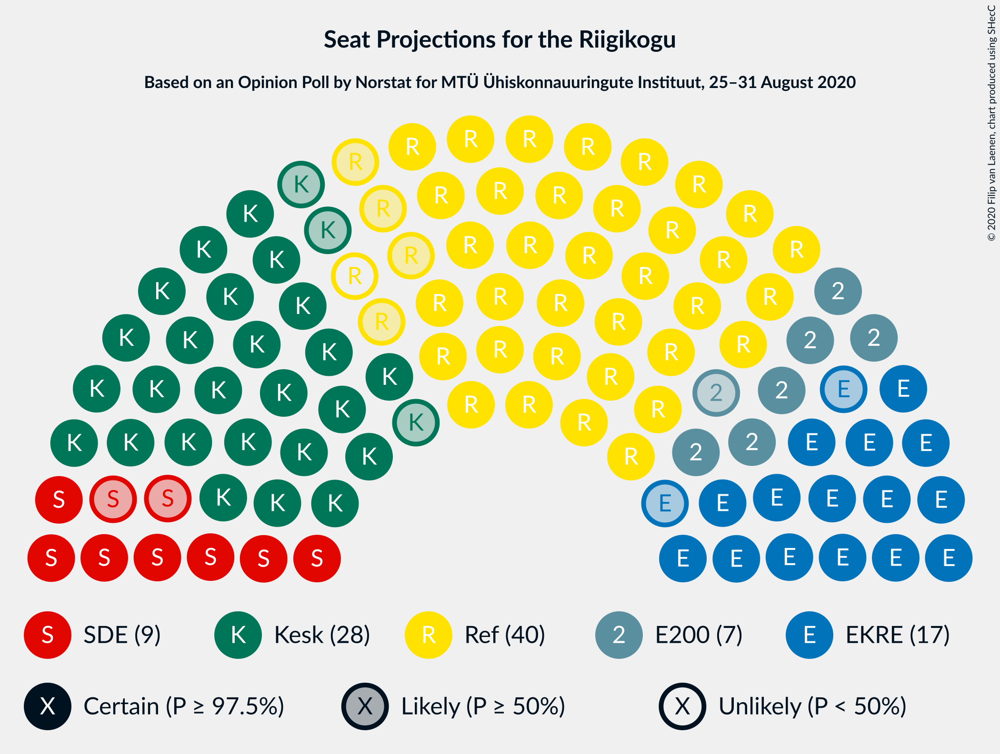
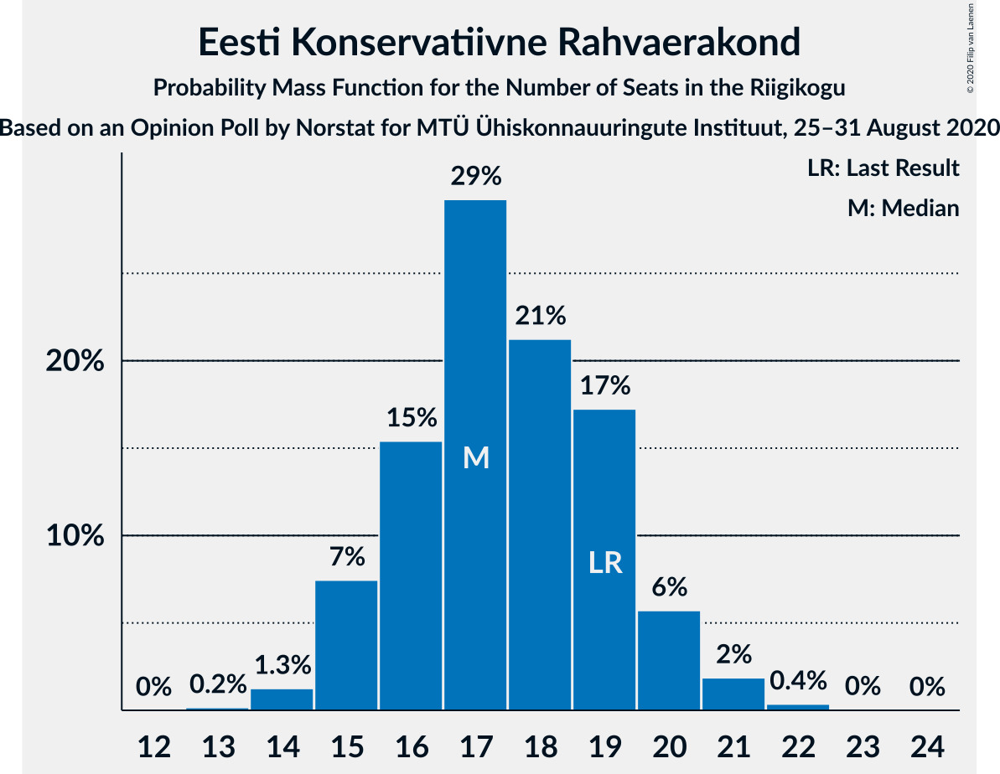
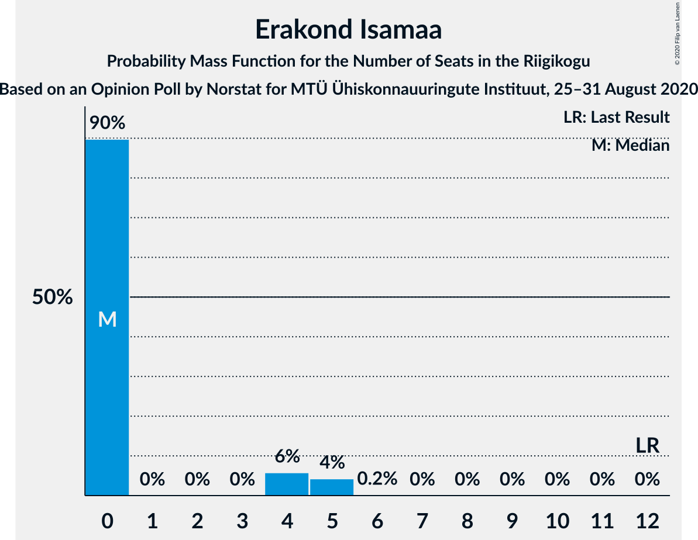

# Opinion Poll by Norstat for MTÜ Ühiskonnauuringute Instituut, 25–31 August 2020

<a href="#voting-intentions">Voting Intentions</a> | <a href="#seats">Seats</a> | <a href="#coalitions">Coalitions</a> | <a href="#technical-information">Technical Information</a>

## Voting Intentions

### Confidence Intervals

| Party | Last Result | Poll Result | 80% Confidence Interval | 90% Confidence Interval | 95% Confidence Interval | 99% Confidence Interval |
|:-----:|:-----------:|:-----------:|:-----------------------:|:-----------------------:|:-----------------------:|:-----------------------:|
| Eesti Reformierakond | 28.9% | 33.5% | 31.6–35.5% |31.1–36.0% |30.6–36.5% |29.8–37.4% |
| Eesti Keskerakond | 23.1% | 24.8% | 23.1–26.6% |22.6–27.1% |22.2–27.6% |21.4–28.5% |
| Eesti Konservatiivne Rahvaerakond | 17.8% | 16.4% | 15.0–18.0% |14.6–18.4% |14.2–18.8% |13.6–19.6% |
| Sotsiaaldemokraatlik Erakond | 9.8% | 8.9% | 7.8–10.2% |7.5–10.5% |7.3–10.8% |6.8–11.5% |
| Eesti 200 | 4.4% | 7.7% | 6.7–8.9% |6.4–9.2% |6.2–9.5% |5.8–10.1% |
| Erakond Isamaa | 11.4% | 4.1% | 3.4–5.0% |3.2–5.3% |3.0–5.5% |2.7–6.0% |
| Erakond Eestimaa Rohelised | 1.8% | 3.3% | 2.7–4.1% |2.5–4.4% |2.4–4.6% |2.1–5.0% |

*Note:* The poll result column reflects the actual value used in the calculations. Published results may vary slightly, and in addition be rounded to fewer digits.

## Seats

### Confidence Intervals

| Party | Last Result | Median | 80% Confidence Interval | 90% Confidence Interval | 95% Confidence Interval | 99% Confidence Interval |
|:-----:|:-----------:|:------:|:-----------------------:|:-----------------------:|:-----------------------:|:-----------------------:|
| <a href="#eesti-reformierakond">Eesti Reformierakond</a> | 34 | 39 | 36–42 |36–42 |35–43 |34–44 |
| <a href="#eesti-keskerakond">Eesti Keskerakond</a> | 26 | 28 | 26–31 |25–31 |24–32 |23–32 |
| <a href="#eesti-konservatiivne-rahvaerakond">Eesti Konservatiivne Rahvaerakond</a> | 19 | 17 | 16–19 |15–20 |15–21 |14–21 |
| <a href="#sotsiaaldemokraatlik-erakond">Sotsiaaldemokraatlik Erakond</a> | 10 | 9 | 7–10 |7–11 |7–11 |6–12 |
| <a href="#eesti-200">Eesti 200</a> | 0 | 7 | 6–8 |6–9 |5–10 |5–10 |
| <a href="#erakond-isamaa">Erakond Isamaa</a> | 12 | 0 | 0–4 |0–5 |0–5 |0–5 |
| <a href="#erakond-eestimaa-rohelised">Erakond Eestimaa Rohelised</a> | 0 | 0 | 0 |0 |0 |0–4 |

### Eesti Reformierakond

*For a full overview of the results for this party, see the [Eesti Reformierakond](party-eestireformierakond.html) page.*

| Number of Seats | Probability | Accumulated | Special Marks |
|:---------------:|:-----------:|:-----------:|:-------------:|
| 33 | 0.2% | 100% |  |
| 34 | 0.9% | 99.8% | Last Result |
| 35 | 2% | 98.9% |  |
| 36 | 8% | 97% |  |
| 37 | 12% | 89% |  |
| 38 | 12% | 76% |  |
| 39 | 27% | 64% | Median |
| 40 | 14% | 37% |  |
| 41 | 8% | 22% |  |
| 42 | 10% | 14% |  |
| 43 | 3% | 4% |  |
| 44 | 1.1% | 1.3% |  |
| 45 | 0.2% | 0.2% |  |
| 46 | 0% | 0% |  |

### Eesti Keskerakond

*For a full overview of the results for this party, see the [Eesti Keskerakond](party-eestikeskerakond.html) page.*

| Number of Seats | Probability | Accumulated | Special Marks |
|:---------------:|:-----------:|:-----------:|:-------------:|
| 22 | 0.1% | 100% |  |
| 23 | 0.5% | 99.9% |  |
| 24 | 2% | 99.4% |  |
| 25 | 6% | 97% |  |
| 26 | 8% | 91% | Last Result |
| 27 | 21% | 83% |  |
| 28 | 22% | 61% | Median |
| 29 | 18% | 39% |  |
| 30 | 11% | 22% |  |
| 31 | 7% | 11% |  |
| 32 | 3% | 4% |  |
| 33 | 0.3% | 0.5% |  |
| 34 | 0.1% | 0.2% |  |
| 35 | 0% | 0% |  |

### Eesti Konservatiivne Rahvaerakond

*For a full overview of the results for this party, see the [Eesti Konservatiivne Rahvaerakond](party-eestikonservatiivnerahvaerakond.html) page.*

| Number of Seats | Probability | Accumulated | Special Marks |
|:---------------:|:-----------:|:-----------:|:-------------:|
| 13 | 0.1% | 100% |  |
| 14 | 1.5% | 99.8% |  |
| 15 | 8% | 98% |  |
| 16 | 19% | 90% |  |
| 17 | 28% | 71% | Median |
| 18 | 12% | 43% |  |
| 19 | 23% | 31% | Last Result |
| 20 | 5% | 8% |  |
| 21 | 2% | 3% |  |
| 22 | 0.4% | 0.5% |  |
| 23 | 0.1% | 0.1% |  |
| 24 | 0% | 0% |  |

### Sotsiaaldemokraatlik Erakond

*For a full overview of the results for this party, see the [Sotsiaaldemokraatlik Erakond](party-sotsiaaldemokraatlikerakond.html) page.*

| Number of Seats | Probability | Accumulated | Special Marks |
|:---------------:|:-----------:|:-----------:|:-------------:|
| 6 | 2% | 100% |  |
| 7 | 18% | 98% |  |
| 8 | 26% | 81% |  |
| 9 | 32% | 55% | Median |
| 10 | 16% | 24% | Last Result |
| 11 | 7% | 8% |  |
| 12 | 0.6% | 0.6% |  |
| 13 | 0% | 0% |  |

### Eesti 200

*For a full overview of the results for this party, see the [Eesti 200](party-eesti200.html) page.*

| Number of Seats | Probability | Accumulated | Special Marks |
|:---------------:|:-----------:|:-----------:|:-------------:|
| 0 | 0% | 100% | Last Result |
| 1 | 0% | 100% |  |
| 2 | 0% | 100% |  |
| 3 | 0% | 100% |  |
| 4 | 0% | 100% |  |
| 5 | 3% | 100% |  |
| 6 | 22% | 97% |  |
| 7 | 42% | 76% | Median |
| 8 | 24% | 34% |  |
| 9 | 7% | 10% |  |
| 10 | 3% | 3% |  |
| 11 | 0.1% | 0.2% |  |
| 12 | 0% | 0% |  |

### Erakond Isamaa

*For a full overview of the results for this party, see the [Erakond Isamaa](party-erakondisamaa.html) page.*

| Number of Seats | Probability | Accumulated | Special Marks |
|:---------------:|:-----------:|:-----------:|:-------------:|
| 0 | 88% | 100% | Median |
| 1 | 0% | 12% |  |
| 2 | 0% | 12% |  |
| 3 | 0% | 12% |  |
| 4 | 6% | 12% |  |
| 5 | 5% | 6% |  |
| 6 | 0.2% | 0.2% |  |
| 7 | 0% | 0% |  |
| 8 | 0% | 0% |  |
| 9 | 0% | 0% |  |
| 10 | 0% | 0% |  |
| 11 | 0% | 0% |  |
| 12 | 0% | 0% | Last Result |

### Erakond Eestimaa Rohelised

*For a full overview of the results for this party, see the [Erakond Eestimaa Rohelised](party-erakondeestimaarohelised.html) page.*

| Number of Seats | Probability | Accumulated | Special Marks |
|:---------------:|:-----------:|:-----------:|:-------------:|
| 0 | 99.1% | 100% | Last Result, Median |
| 1 | 0% | 0.9% |  |
| 2 | 0% | 0.9% |  |
| 3 | 0% | 0.9% |  |
| 4 | 0.7% | 0.9% |  |
| 5 | 0.3% | 0.3% |  |
| 6 | 0% | 0% |  |

## Coalitions

### Confidence Intervals

| Coalition | Last Result | Median | Majority? | 80% Confidence Interval | 90% Confidence Interval | 95% Confidence Interval | 99% Confidence Interval |
|:---------:|:-----------:|:------:|:---------:|:-----------------------:|:-----------------------:|:-----------------------:|:-----------------------:|
| Eesti Reformierakond – Eesti Keskerakond – Eesti Konservatiivne Rahvaerakond | 79 | 85 | 100% | 82–87 | 81–87 | 80–88 | 79–88 |
| Eesti Reformierakond – Eesti Keskerakond | 60 | 67 | 100% | 64–71 | 63–71 | 63–71 | 61–72 |
| Eesti Reformierakond – Eesti Konservatiivne Rahvaerakond – Erakond Isamaa | 65 | 57 | 99.9% | 54–60 | 54–60 | 53–61 | 52–63 |
| Eesti Reformierakond – Eesti Konservatiivne Rahvaerakond | 53 | 56 | 99.5% | 54–59 | 53–60 | 52–60 | 51–62 |
| Eesti Reformierakond – Sotsiaaldemokraatlik Erakond – Erakond Isamaa | 56 | 48 | 14% | 46–51 | 45–52 | 44–52 | 43–54 |
| Eesti Reformierakond – Sotsiaaldemokraatlik Erakond | 44 | 48 | 8% | 45–50 | 44–51 | 44–52 | 43–53 |
| Eesti Keskerakond – Eesti Konservatiivne Rahvaerakond – Erakond Isamaa | 57 | 46 | 1.2% | 43–49 | 43–50 | 42–50 | 41–51 |
| Eesti Keskerakond – Eesti Konservatiivne Rahvaerakond | 45 | 46 | 0.5% | 43–48 | 42–49 | 41–50 | 40–50 |
| Eesti Reformierakond – Erakond Isamaa | 46 | 39 | 0% | 37–42 | 36–43 | 36–44 | 34–45 |
| Eesti Keskerakond – Sotsiaaldemokraatlik Erakond – Erakond Isamaa | 48 | 37 | 0% | 35–40 | 34–41 | 33–41 | 32–43 |
| Eesti Keskerakond – Sotsiaaldemokraatlik Erakond | 36 | 37 | 0% | 34–39 | 34–40 | 33–40 | 32–42 |
| Eesti Konservatiivne Rahvaerakond – Sotsiaaldemokraatlik Erakond | 29 | 26 | 0% | 23–29 | 23–29 | 23–30 | 22–31 |

### Eesti Reformierakond – Eesti Keskerakond – Eesti Konservatiivne Rahvaerakond

| Number of Seats | Probability | Accumulated | Special Marks |
|:---------------:|:-----------:|:-----------:|:-------------:|
| 77 | 0.1% | 100% |  |
| 78 | 0.2% | 99.9% |  |
| 79 | 1.4% | 99.7% | Last Result |
| 80 | 3% | 98% |  |
| 81 | 4% | 95% |  |
| 82 | 9% | 91% |  |
| 83 | 10% | 82% |  |
| 84 | 15% | 72% | Median |
| 85 | 20% | 57% |  |
| 86 | 18% | 38% |  |
| 87 | 17% | 20% |  |
| 88 | 3% | 3% |  |
| 89 | 0.2% | 0.2% |  |
| 90 | 0% | 0% |  |

### Eesti Reformierakond – Eesti Keskerakond

| Number of Seats | Probability | Accumulated | Special Marks |
|:---------------:|:-----------:|:-----------:|:-------------:|
| 60 | 0.2% | 100% | Last Result |
| 61 | 0.5% | 99.8% |  |
| 62 | 1.1% | 99.3% |  |
| 63 | 4% | 98% |  |
| 64 | 12% | 94% |  |
| 65 | 9% | 83% |  |
| 66 | 12% | 74% |  |
| 67 | 19% | 62% | Median |
| 68 | 16% | 43% |  |
| 69 | 10% | 27% |  |
| 70 | 4% | 17% |  |
| 71 | 12% | 13% |  |
| 72 | 0.3% | 0.6% |  |
| 73 | 0.2% | 0.3% |  |
| 74 | 0% | 0% |  |

### Eesti Reformierakond – Eesti Konservatiivne Rahvaerakond – Erakond Isamaa

| Number of Seats | Probability | Accumulated | Special Marks |
|:---------------:|:-----------:|:-----------:|:-------------:|
| 50 | 0% | 100% |  |
| 51 | 0.2% | 99.9% | Majority |
| 52 | 1.2% | 99.8% |  |
| 53 | 2% | 98.6% |  |
| 54 | 8% | 97% |  |
| 55 | 13% | 89% |  |
| 56 | 18% | 76% | Median |
| 57 | 15% | 58% |  |
| 58 | 21% | 43% |  |
| 59 | 12% | 22% |  |
| 60 | 7% | 11% |  |
| 61 | 2% | 4% |  |
| 62 | 0.8% | 1.4% |  |
| 63 | 0.6% | 0.6% |  |
| 64 | 0% | 0.1% |  |
| 65 | 0% | 0% | Last Result |

### Eesti Reformierakond – Eesti Konservatiivne Rahvaerakond

| Number of Seats | Probability | Accumulated | Special Marks |
|:---------------:|:-----------:|:-----------:|:-------------:|
| 50 | 0.4% | 100% |  |
| 51 | 1.2% | 99.5% | Majority |
| 52 | 2% | 98% |  |
| 53 | 3% | 97% | Last Result |
| 54 | 10% | 93% |  |
| 55 | 16% | 83% |  |
| 56 | 18% | 67% | Median |
| 57 | 14% | 49% |  |
| 58 | 19% | 35% |  |
| 59 | 9% | 16% |  |
| 60 | 5% | 7% |  |
| 61 | 1.4% | 2% |  |
| 62 | 0.4% | 0.5% |  |
| 63 | 0.1% | 0.1% |  |
| 64 | 0% | 0% |  |

### Eesti Reformierakond – Sotsiaaldemokraatlik Erakond – Erakond Isamaa

| Number of Seats | Probability | Accumulated | Special Marks |
|:---------------:|:-----------:|:-----------:|:-------------:|
| 42 | 0.1% | 100% |  |
| 43 | 0.7% | 99.9% |  |
| 44 | 2% | 99.2% |  |
| 45 | 7% | 97% |  |
| 46 | 10% | 90% |  |
| 47 | 15% | 80% |  |
| 48 | 23% | 65% | Median |
| 49 | 17% | 42% |  |
| 50 | 10% | 25% |  |
| 51 | 6% | 14% | Majority |
| 52 | 6% | 8% |  |
| 53 | 2% | 2% |  |
| 54 | 0.5% | 0.7% |  |
| 55 | 0.2% | 0.2% |  |
| 56 | 0% | 0% | Last Result |

### Eesti Reformierakond – Sotsiaaldemokraatlik Erakond

| Number of Seats | Probability | Accumulated | Special Marks |
|:---------------:|:-----------:|:-----------:|:-------------:|
| 41 | 0.1% | 100% |  |
| 42 | 0.3% | 99.9% |  |
| 43 | 2% | 99.6% |  |
| 44 | 3% | 98% | Last Result |
| 45 | 9% | 94% |  |
| 46 | 12% | 86% |  |
| 47 | 18% | 74% |  |
| 48 | 23% | 55% | Median |
| 49 | 16% | 33% |  |
| 50 | 9% | 17% |  |
| 51 | 4% | 8% | Majority |
| 52 | 3% | 4% |  |
| 53 | 0.5% | 0.6% |  |
| 54 | 0.1% | 0.1% |  |
| 55 | 0% | 0% |  |

### Eesti Keskerakond – Eesti Konservatiivne Rahvaerakond – Erakond Isamaa

| Number of Seats | Probability | Accumulated | Special Marks |
|:---------------:|:-----------:|:-----------:|:-------------:|
| 40 | 0.2% | 100% |  |
| 41 | 1.0% | 99.8% |  |
| 42 | 2% | 98.8% |  |
| 43 | 7% | 96% |  |
| 44 | 12% | 90% |  |
| 45 | 18% | 78% | Median |
| 46 | 20% | 60% |  |
| 47 | 15% | 40% |  |
| 48 | 11% | 24% |  |
| 49 | 9% | 14% |  |
| 50 | 4% | 5% |  |
| 51 | 0.9% | 1.2% | Majority |
| 52 | 0.2% | 0.3% |  |
| 53 | 0.1% | 0.1% |  |
| 54 | 0% | 0% |  |
| 55 | 0% | 0% |  |
| 56 | 0% | 0% |  |
| 57 | 0% | 0% | Last Result |

### Eesti Keskerakond – Eesti Konservatiivne Rahvaerakond

| Number of Seats | Probability | Accumulated | Special Marks |
|:---------------:|:-----------:|:-----------:|:-------------:|
| 39 | 0.2% | 100% |  |
| 40 | 0.7% | 99.8% |  |
| 41 | 2% | 99.1% |  |
| 42 | 4% | 97% |  |
| 43 | 8% | 93% |  |
| 44 | 14% | 84% |  |
| 45 | 21% | 71% | Last Result, Median |
| 46 | 20% | 50% |  |
| 47 | 13% | 30% |  |
| 48 | 8% | 17% |  |
| 49 | 6% | 9% |  |
| 50 | 2% | 3% |  |
| 51 | 0.4% | 0.5% | Majority |
| 52 | 0.1% | 0.1% |  |
| 53 | 0% | 0% |  |

### Eesti Reformierakond – Erakond Isamaa

| Number of Seats | Probability | Accumulated | Special Marks |
|:---------------:|:-----------:|:-----------:|:-------------:|
| 33 | 0.1% | 100% |  |
| 34 | 0.5% | 99.9% |  |
| 35 | 1.0% | 99.4% |  |
| 36 | 6% | 98% |  |
| 37 | 10% | 93% |  |
| 38 | 10% | 83% |  |
| 39 | 26% | 72% | Median |
| 40 | 16% | 46% |  |
| 41 | 10% | 30% |  |
| 42 | 11% | 20% |  |
| 43 | 6% | 9% |  |
| 44 | 2% | 3% |  |
| 45 | 0.8% | 1.2% |  |
| 46 | 0.3% | 0.4% | Last Result |
| 47 | 0.1% | 0.1% |  |
| 48 | 0% | 0% |  |

### Eesti Keskerakond – Sotsiaaldemokraatlik Erakond – Erakond Isamaa

| Number of Seats | Probability | Accumulated | Special Marks |
|:---------------:|:-----------:|:-----------:|:-------------:|
| 31 | 0.1% | 100% |  |
| 32 | 0.7% | 99.9% |  |
| 33 | 2% | 99.2% |  |
| 34 | 4% | 97% |  |
| 35 | 13% | 93% |  |
| 36 | 16% | 80% |  |
| 37 | 22% | 64% | Median |
| 38 | 13% | 42% |  |
| 39 | 13% | 29% |  |
| 40 | 9% | 15% |  |
| 41 | 3% | 6% |  |
| 42 | 2% | 2% |  |
| 43 | 0.6% | 0.8% |  |
| 44 | 0.1% | 0.2% |  |
| 45 | 0% | 0% |  |
| 46 | 0% | 0% |  |
| 47 | 0% | 0% |  |
| 48 | 0% | 0% | Last Result |

### Eesti Keskerakond – Sotsiaaldemokraatlik Erakond

| Number of Seats | Probability | Accumulated | Special Marks |
|:---------------:|:-----------:|:-----------:|:-------------:|
| 30 | 0.1% | 100% |  |
| 31 | 0.3% | 99.9% |  |
| 32 | 1.3% | 99.7% |  |
| 33 | 3% | 98% |  |
| 34 | 6% | 95% |  |
| 35 | 15% | 89% |  |
| 36 | 18% | 74% | Last Result |
| 37 | 24% | 56% | Median |
| 38 | 13% | 32% |  |
| 39 | 11% | 19% |  |
| 40 | 6% | 8% |  |
| 41 | 1.2% | 2% |  |
| 42 | 0.5% | 0.6% |  |
| 43 | 0.1% | 0.1% |  |
| 44 | 0% | 0% |  |

### Eesti Konservatiivne Rahvaerakond – Sotsiaaldemokraatlik Erakond

| Number of Seats | Probability | Accumulated | Special Marks |
|:---------------:|:-----------:|:-----------:|:-------------:|
| 21 | 0.3% | 100% |  |
| 22 | 0.7% | 99.7% |  |
| 23 | 12% | 99.0% |  |
| 24 | 8% | 87% |  |
| 25 | 13% | 78% |  |
| 26 | 25% | 65% | Median |
| 27 | 17% | 40% |  |
| 28 | 8% | 23% |  |
| 29 | 11% | 15% | Last Result |
| 30 | 2% | 4% |  |
| 31 | 1.5% | 2% |  |
| 32 | 0.1% | 0.1% |  |
| 33 | 0% | 0% |  |

## Technical Information

### Opinion Poll

+ **Polling firm:** Norstat
+ **Commissioner(s):** MTÜ Ühiskonnauuringute Instituut
+ **Fieldwork period:** 25–31 August 2020

### Calculations

+ **Sample size:** 1000
+ **Simulations done:** 131,072
+ **Error estimate:** 1.84%

