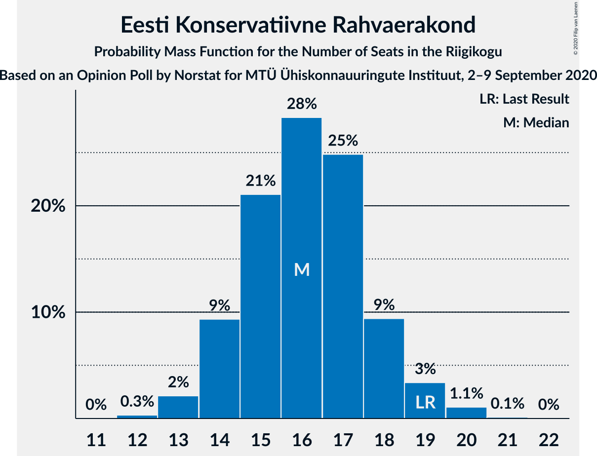
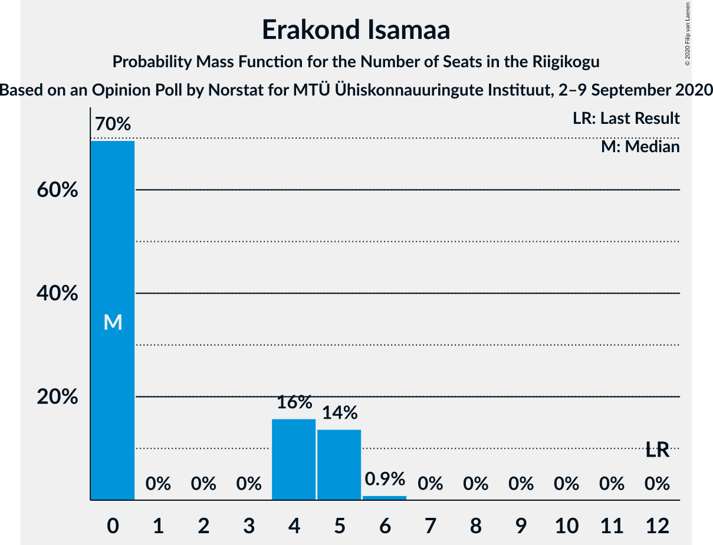
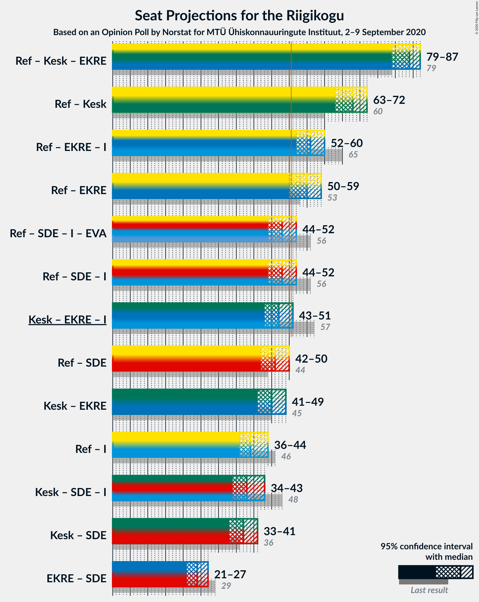
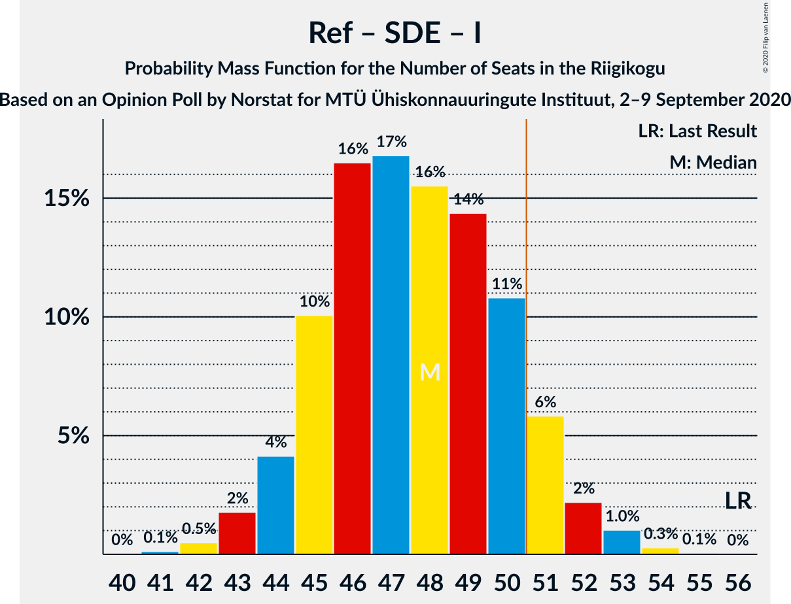

# Opinion Poll by Norstat for MTÜ Ühiskonnauuringute Instituut, 2–9 September 2020

<a href="#voting-intentions">Voting Intentions</a> | <a href="#seats">Seats</a> | <a href="#coalitions">Coalitions</a> | <a href="#technical-information">Technical Information</a>

## Voting Intentions

### Confidence Intervals

| Party | Last Result | Poll Result | 80% Confidence Interval | 90% Confidence Interval | 95% Confidence Interval | 99% Confidence Interval |
|:-----:|:-----------:|:-----------:|:-----------------------:|:-----------------------:|:-----------------------:|:-----------------------:|
| Eesti Reformierakond | 28.9% | 33.6% | 31.7–35.6% |31.2–36.1% |30.7–36.6% |29.8–37.5% |
| Eesti Keskerakond | 23.1% | 26.4% | 24.7–28.2% |24.2–28.8% |23.8–29.2% |23.0–30.1% |
| Eesti Konservatiivne Rahvaerakond | 17.8% | 15.6% | 14.2–17.2% |13.8–17.6% |13.5–18.0% |12.8–18.8% |
| Eesti 200 | 4.4% | 8.5% | 7.5–9.7% |7.2–10.1% |6.9–10.4% |6.5–11.0% |
| Sotsiaaldemokraatlik Erakond | 9.8% | 8.4% | 7.4–9.6% |7.1–10.0% |6.8–10.3% |6.4–10.9% |
| Erakond Isamaa | 11.4% | 4.6% | 3.9–5.6% |3.6–5.8% |3.5–6.1% |3.1–6.6% |
| Erakond Eestimaa Rohelised | 1.8% | 2.0% | 1.5–2.7% |1.4–2.9% |1.3–3.1% |1.1–3.4% |

*Note:* The poll result column reflects the actual value used in the calculations. Published results may vary slightly, and in addition be rounded to fewer digits.

## Seats

### Confidence Intervals

| Party | Last Result | Median | 80% Confidence Interval | 90% Confidence Interval | 95% Confidence Interval | 99% Confidence Interval |
|:-----:|:-----------:|:------:|:-----------------------:|:-----------------------:|:-----------------------:|:-----------------------:|
| <a href="#eesti-reformierakond">Eesti Reformierakond</a> | 34 | 38 | 36–41 |35–42 |34–42 |33–43 |
| <a href="#eesti-keskerakond">Eesti Keskerakond</a> | 26 | 29 | 27–32 |26–32 |26–33 |25–34 |
| <a href="#eesti-konservatiivne-rahvaerakond">Eesti Konservatiivne Rahvaerakond</a> | 19 | 16 | 14–18 |14–18 |14–19 |13–20 |
| <a href="#eesti-200">Eesti 200</a> | 0 | 8 | 7–9 |6–10 |6–10 |6–11 |
| <a href="#sotsiaaldemokraatlik-erakond">Sotsiaaldemokraatlik Erakond</a> | 10 | 8 | 7–9 |6–10 |6–10 |6–11 |
| <a href="#erakond-isamaa">Erakond Isamaa</a> | 12 | 0 | 0–5 |0–5 |0–5 |0–6 |
| <a href="#erakond-eestimaa-rohelised">Erakond Eestimaa Rohelised</a> | 0 | 0 | 0 |0 |0 |0 |

### Eesti Reformierakond

*For a full overview of the results for this party, see the [Eesti Reformierakond](party-eestireformierakond.html) page.*

| Number of Seats | Probability | Accumulated | Special Marks |
|:---------------:|:-----------:|:-----------:|:-------------:|
| 32 | 0.1% | 100% |  |
| 33 | 0.6% | 99.9% |  |
| 34 | 2% | 99.3% | Last Result |
| 35 | 5% | 97% |  |
| 36 | 8% | 92% |  |
| 37 | 15% | 84% |  |
| 38 | 24% | 69% | Median |
| 39 | 20% | 45% |  |
| 40 | 11% | 25% |  |
| 41 | 8% | 14% |  |
| 42 | 5% | 6% |  |
| 43 | 1.1% | 1.4% |  |
| 44 | 0.3% | 0.4% |  |
| 45 | 0.1% | 0.1% |  |
| 46 | 0% | 0% |  |

### Eesti Keskerakond

*For a full overview of the results for this party, see the [Eesti Keskerakond](party-eestikeskerakond.html) page.*

| Number of Seats | Probability | Accumulated | Special Marks |
|:---------------:|:-----------:|:-----------:|:-------------:|
| 24 | 0.3% | 100% |  |
| 25 | 1.4% | 99.6% |  |
| 26 | 4% | 98% | Last Result |
| 27 | 9% | 94% |  |
| 28 | 19% | 85% |  |
| 29 | 20% | 65% | Median |
| 30 | 23% | 45% |  |
| 31 | 12% | 22% |  |
| 32 | 7% | 10% |  |
| 33 | 3% | 4% |  |
| 34 | 0.8% | 1.0% |  |
| 35 | 0.2% | 0.3% |  |
| 36 | 0% | 0% |  |

### Eesti Konservatiivne Rahvaerakond

*For a full overview of the results for this party, see the [Eesti Konservatiivne Rahvaerakond](party-eestikonservatiivnerahvaerakond.html) page.*

| Number of Seats | Probability | Accumulated | Special Marks |
|:---------------:|:-----------:|:-----------:|:-------------:|
| 12 | 0.3% | 100% |  |
| 13 | 2% | 99.7% |  |
| 14 | 9% | 98% |  |
| 15 | 21% | 88% |  |
| 16 | 28% | 67% | Median |
| 17 | 25% | 39% |  |
| 18 | 9% | 14% |  |
| 19 | 3% | 5% | Last Result |
| 20 | 1.1% | 1.2% |  |
| 21 | 0.1% | 0.1% |  |
| 22 | 0% | 0% |  |

### Eesti 200

*For a full overview of the results for this party, see the [Eesti 200](party-eesti200.html) page.*

| Number of Seats | Probability | Accumulated | Special Marks |
|:---------------:|:-----------:|:-----------:|:-------------:|
| 0 | 0% | 100% | Last Result |
| 1 | 0% | 100% |  |
| 2 | 0% | 100% |  |
| 3 | 0% | 100% |  |
| 4 | 0% | 100% |  |
| 5 | 0.2% | 100% |  |
| 6 | 5% | 99.8% |  |
| 7 | 25% | 95% |  |
| 8 | 37% | 70% | Median |
| 9 | 25% | 32% |  |
| 10 | 6% | 7% |  |
| 11 | 0.8% | 0.9% |  |
| 12 | 0.1% | 0.1% |  |
| 13 | 0% | 0% |  |

### Sotsiaaldemokraatlik Erakond

*For a full overview of the results for this party, see the [Sotsiaaldemokraatlik Erakond](party-sotsiaaldemokraatlikerakond.html) page.*

| Number of Seats | Probability | Accumulated | Special Marks |
|:---------------:|:-----------:|:-----------:|:-------------:|
| 5 | 0.3% | 100% |  |
| 6 | 6% | 99.7% |  |
| 7 | 28% | 94% |  |
| 8 | 42% | 65% | Median |
| 9 | 17% | 23% |  |
| 10 | 5% | 6% | Last Result |
| 11 | 0.7% | 0.8% |  |
| 12 | 0.1% | 0.1% |  |
| 13 | 0% | 0% |  |

### Erakond Isamaa

*For a full overview of the results for this party, see the [Erakond Isamaa](party-erakondisamaa.html) page.*

| Number of Seats | Probability | Accumulated | Special Marks |
|:---------------:|:-----------:|:-----------:|:-------------:|
| 0 | 70% | 100% | Median |
| 1 | 0% | 30% |  |
| 2 | 0% | 30% |  |
| 3 | 0% | 30% |  |
| 4 | 16% | 30% |  |
| 5 | 14% | 15% |  |
| 6 | 0.9% | 0.9% |  |
| 7 | 0% | 0% |  |
| 8 | 0% | 0% |  |
| 9 | 0% | 0% |  |
| 10 | 0% | 0% |  |
| 11 | 0% | 0% |  |
| 12 | 0% | 0% | Last Result |

### Erakond Eestimaa Rohelised

*For a full overview of the results for this party, see the [Erakond Eestimaa Rohelised](party-erakondeestimaarohelised.html) page.*

| Number of Seats | Probability | Accumulated | Special Marks |
|:---------------:|:-----------:|:-----------:|:-------------:|
| 0 | 100% | 100% | Last Result, Median |

## Coalitions

### Confidence Intervals

| Coalition | Last Result | Median | Majority? | 80% Confidence Interval | 90% Confidence Interval | 95% Confidence Interval | 99% Confidence Interval |
|:---------:|:-----------:|:------:|:---------:|:-----------------------:|:-----------------------:|:-----------------------:|:-----------------------:|
| Eesti Reformierakond – Eesti Keskerakond – Eesti Konservatiivne Rahvaerakond | 79 | 84 | 100% | 81–86 | 80–87 | 79–87 | 78–88 |
| Eesti Reformierakond – Eesti Keskerakond | 60 | 68 | 100% | 65–70 | 64–71 | 63–72 | 62–73 |
| Eesti Reformierakond – Eesti Konservatiivne Rahvaerakond – Erakond Isamaa | 65 | 56 | 99.5% | 53–59 | 53–59 | 52–60 | 51–61 |
| Eesti Reformierakond – Eesti Konservatiivne Rahvaerakond | 53 | 55 | 96% | 52–57 | 51–58 | 50–59 | 49–60 |
| Eesti Reformierakond – Sotsiaaldemokraatlik Erakond – Erakond Isamaa | 56 | 48 | 9% | 45–50 | 44–51 | 44–52 | 42–53 |
| Eesti Keskerakond – Eesti Konservatiivne Rahvaerakond – Erakond Isamaa | 57 | 47 | 5% | 44–50 | 43–50 | 43–51 | 41–52 |
| Eesti Reformierakond – Sotsiaaldemokraatlik Erakond | 44 | 46 | 2% | 44–49 | 43–50 | 42–50 | 41–51 |
| Eesti Keskerakond – Eesti Konservatiivne Rahvaerakond | 45 | 45 | 0.6% | 43–48 | 42–49 | 41–49 | 40–51 |
| Eesti Reformierakond – Erakond Isamaa | 46 | 39 | 0% | 37–43 | 36–43 | 36–44 | 34–46 |
| Eesti Keskerakond – Sotsiaaldemokraatlik Erakond – Erakond Isamaa | 48 | 38 | 0% | 36–42 | 35–42 | 34–43 | 33–44 |
| Eesti Keskerakond – Sotsiaaldemokraatlik Erakond | 36 | 37 | 0% | 35–40 | 34–40 | 33–41 | 32–42 |
| Eesti Konservatiivne Rahvaerakond – Sotsiaaldemokraatlik Erakond | 29 | 24 | 0% | 22–26 | 22–27 | 21–27 | 20–28 |

### Eesti Reformierakond – Eesti Keskerakond – Eesti Konservatiivne Rahvaerakond

| Number of Seats | Probability | Accumulated | Special Marks |
|:---------------:|:-----------:|:-----------:|:-------------:|
| 77 | 0.1% | 100% |  |
| 78 | 0.8% | 99.8% |  |
| 79 | 3% | 99.0% | Last Result |
| 80 | 6% | 97% |  |
| 81 | 11% | 91% |  |
| 82 | 10% | 80% |  |
| 83 | 11% | 71% | Median |
| 84 | 18% | 60% |  |
| 85 | 20% | 42% |  |
| 86 | 15% | 22% |  |
| 87 | 5% | 7% |  |
| 88 | 1.4% | 2% |  |
| 89 | 0.1% | 0.2% |  |
| 90 | 0% | 0% |  |

### Eesti Reformierakond – Eesti Keskerakond

| Number of Seats | Probability | Accumulated | Special Marks |
|:---------------:|:-----------:|:-----------:|:-------------:|
| 60 | 0.1% | 100% | Last Result |
| 61 | 0.3% | 99.9% |  |
| 62 | 1.2% | 99.7% |  |
| 63 | 2% | 98% |  |
| 64 | 6% | 96% |  |
| 65 | 7% | 90% |  |
| 66 | 15% | 83% |  |
| 67 | 14% | 68% | Median |
| 68 | 19% | 54% |  |
| 69 | 15% | 35% |  |
| 70 | 12% | 20% |  |
| 71 | 5% | 8% |  |
| 72 | 3% | 4% |  |
| 73 | 0.5% | 0.7% |  |
| 74 | 0.1% | 0.1% |  |
| 75 | 0% | 0% |  |

### Eesti Reformierakond – Eesti Konservatiivne Rahvaerakond – Erakond Isamaa

| Number of Seats | Probability | Accumulated | Special Marks |
|:---------------:|:-----------:|:-----------:|:-------------:|
| 49 | 0.1% | 100% |  |
| 50 | 0.4% | 99.9% |  |
| 51 | 1.3% | 99.5% | Majority |
| 52 | 3% | 98% |  |
| 53 | 8% | 95% |  |
| 54 | 14% | 88% | Median |
| 55 | 17% | 73% |  |
| 56 | 21% | 56% |  |
| 57 | 15% | 35% |  |
| 58 | 10% | 20% |  |
| 59 | 6% | 10% |  |
| 60 | 3% | 4% |  |
| 61 | 1.0% | 1.3% |  |
| 62 | 0.3% | 0.3% |  |
| 63 | 0% | 0.1% |  |
| 64 | 0% | 0% |  |
| 65 | 0% | 0% | Last Result |

### Eesti Reformierakond – Eesti Konservatiivne Rahvaerakond

| Number of Seats | Probability | Accumulated | Special Marks |
|:---------------:|:-----------:|:-----------:|:-------------:|
| 47 | 0.1% | 100% |  |
| 48 | 0.2% | 99.9% |  |
| 49 | 0.9% | 99.7% |  |
| 50 | 2% | 98.8% |  |
| 51 | 6% | 96% | Majority |
| 52 | 8% | 90% |  |
| 53 | 14% | 82% | Last Result |
| 54 | 18% | 68% | Median |
| 55 | 17% | 50% |  |
| 56 | 18% | 33% |  |
| 57 | 9% | 16% |  |
| 58 | 4% | 7% |  |
| 59 | 2% | 3% |  |
| 60 | 0.8% | 1.0% |  |
| 61 | 0.2% | 0.2% |  |
| 62 | 0% | 0% |  |

### Eesti Reformierakond – Sotsiaaldemokraatlik Erakond – Erakond Isamaa

| Number of Seats | Probability | Accumulated | Special Marks |
|:---------------:|:-----------:|:-----------:|:-------------:|
| 41 | 0.1% | 100% |  |
| 42 | 0.5% | 99.8% |  |
| 43 | 2% | 99.4% |  |
| 44 | 4% | 98% |  |
| 45 | 10% | 93% |  |
| 46 | 16% | 83% | Median |
| 47 | 17% | 67% |  |
| 48 | 16% | 50% |  |
| 49 | 14% | 35% |  |
| 50 | 11% | 20% |  |
| 51 | 6% | 9% | Majority |
| 52 | 2% | 4% |  |
| 53 | 1.0% | 1.4% |  |
| 54 | 0.3% | 0.3% |  |
| 55 | 0.1% | 0.1% |  |
| 56 | 0% | 0% | Last Result |

### Eesti Keskerakond – Eesti Konservatiivne Rahvaerakond – Erakond Isamaa

| Number of Seats | Probability | Accumulated | Special Marks |
|:---------------:|:-----------:|:-----------:|:-------------:|
| 40 | 0.1% | 100% |  |
| 41 | 0.4% | 99.9% |  |
| 42 | 1.5% | 99.5% |  |
| 43 | 5% | 98% |  |
| 44 | 10% | 93% |  |
| 45 | 12% | 84% | Median |
| 46 | 17% | 71% |  |
| 47 | 19% | 54% |  |
| 48 | 16% | 35% |  |
| 49 | 8% | 20% |  |
| 50 | 7% | 11% |  |
| 51 | 3% | 5% | Majority |
| 52 | 1.0% | 1.5% |  |
| 53 | 0.4% | 0.4% |  |
| 54 | 0.1% | 0.1% |  |
| 55 | 0% | 0% |  |
| 56 | 0% | 0% |  |
| 57 | 0% | 0% | Last Result |

### Eesti Reformierakond – Sotsiaaldemokraatlik Erakond

| Number of Seats | Probability | Accumulated | Special Marks |
|:---------------:|:-----------:|:-----------:|:-------------:|
| 39 | 0.1% | 100% |  |
| 40 | 0.3% | 99.9% |  |
| 41 | 1.1% | 99.6% |  |
| 42 | 2% | 98.6% |  |
| 43 | 5% | 96% |  |
| 44 | 10% | 91% | Last Result |
| 45 | 15% | 81% |  |
| 46 | 23% | 66% | Median |
| 47 | 17% | 43% |  |
| 48 | 12% | 26% |  |
| 49 | 8% | 14% |  |
| 50 | 5% | 6% |  |
| 51 | 1.2% | 2% | Majority |
| 52 | 0.3% | 0.5% |  |
| 53 | 0.1% | 0.1% |  |
| 54 | 0% | 0% |  |

### Eesti Keskerakond – Eesti Konservatiivne Rahvaerakond

| Number of Seats | Probability | Accumulated | Special Marks |
|:---------------:|:-----------:|:-----------:|:-------------:|
| 39 | 0.2% | 100% |  |
| 40 | 0.7% | 99.8% |  |
| 41 | 2% | 99.1% |  |
| 42 | 4% | 97% |  |
| 43 | 12% | 93% |  |
| 44 | 16% | 81% |  |
| 45 | 17% | 65% | Last Result, Median |
| 46 | 19% | 48% |  |
| 47 | 16% | 30% |  |
| 48 | 8% | 14% |  |
| 49 | 3% | 6% |  |
| 50 | 2% | 2% |  |
| 51 | 0.4% | 0.6% | Majority |
| 52 | 0.1% | 0.1% |  |
| 53 | 0% | 0% |  |

### Eesti Reformierakond – Erakond Isamaa

| Number of Seats | Probability | Accumulated | Special Marks |
|:---------------:|:-----------:|:-----------:|:-------------:|
| 33 | 0.1% | 100% |  |
| 34 | 0.5% | 99.9% |  |
| 35 | 2% | 99.4% |  |
| 36 | 4% | 98% |  |
| 37 | 8% | 93% |  |
| 38 | 17% | 86% | Median |
| 39 | 20% | 69% |  |
| 40 | 13% | 49% |  |
| 41 | 14% | 37% |  |
| 42 | 13% | 23% |  |
| 43 | 6% | 10% |  |
| 44 | 3% | 4% |  |
| 45 | 1.2% | 2% |  |
| 46 | 0.4% | 0.5% | Last Result |
| 47 | 0.1% | 0.1% |  |
| 48 | 0% | 0% |  |

### Eesti Keskerakond – Sotsiaaldemokraatlik Erakond – Erakond Isamaa

| Number of Seats | Probability | Accumulated | Special Marks |
|:---------------:|:-----------:|:-----------:|:-------------:|
| 32 | 0.1% | 100% |  |
| 33 | 0.7% | 99.8% |  |
| 34 | 2% | 99.2% |  |
| 35 | 5% | 97% |  |
| 36 | 11% | 92% |  |
| 37 | 17% | 81% | Median |
| 38 | 16% | 64% |  |
| 39 | 15% | 48% |  |
| 40 | 13% | 33% |  |
| 41 | 10% | 20% |  |
| 42 | 6% | 10% |  |
| 43 | 3% | 5% |  |
| 44 | 1.2% | 2% |  |
| 45 | 0.3% | 0.4% |  |
| 46 | 0.1% | 0.1% |  |
| 47 | 0% | 0% |  |
| 48 | 0% | 0% | Last Result |

### Eesti Keskerakond – Sotsiaaldemokraatlik Erakond

| Number of Seats | Probability | Accumulated | Special Marks |
|:---------------:|:-----------:|:-----------:|:-------------:|
| 31 | 0.1% | 100% |  |
| 32 | 0.6% | 99.8% |  |
| 33 | 2% | 99.2% |  |
| 34 | 5% | 97% |  |
| 35 | 11% | 92% |  |
| 36 | 19% | 81% | Last Result |
| 37 | 22% | 62% | Median |
| 38 | 17% | 41% |  |
| 39 | 13% | 24% |  |
| 40 | 7% | 11% |  |
| 41 | 3% | 4% |  |
| 42 | 1.0% | 1.4% |  |
| 43 | 0.3% | 0.3% |  |
| 44 | 0% | 0.1% |  |
| 45 | 0% | 0% |  |

### Eesti Konservatiivne Rahvaerakond – Sotsiaaldemokraatlik Erakond

| Number of Seats | Probability | Accumulated | Special Marks |
|:---------------:|:-----------:|:-----------:|:-------------:|
| 19 | 0.4% | 100% |  |
| 20 | 1.2% | 99.6% |  |
| 21 | 3% | 98% |  |
| 22 | 10% | 95% |  |
| 23 | 23% | 86% |  |
| 24 | 32% | 62% | Median |
| 25 | 14% | 31% |  |
| 26 | 9% | 17% |  |
| 27 | 6% | 8% |  |
| 28 | 2% | 2% |  |
| 29 | 0.4% | 0.5% | Last Result |
| 30 | 0% | 0.1% |  |
| 31 | 0% | 0% |  |

## Technical Information

### Opinion Poll

+ **Polling firm:** Norstat
+ **Commissioner(s):** MTÜ Ühiskonnauuringute Instituut
+ **Fieldwork period:** 2–9 September 2020

### Calculations

+ **Sample size:** 1000
+ **Simulations done:** 1,048,576
+ **Error estimate:** 0.67%

