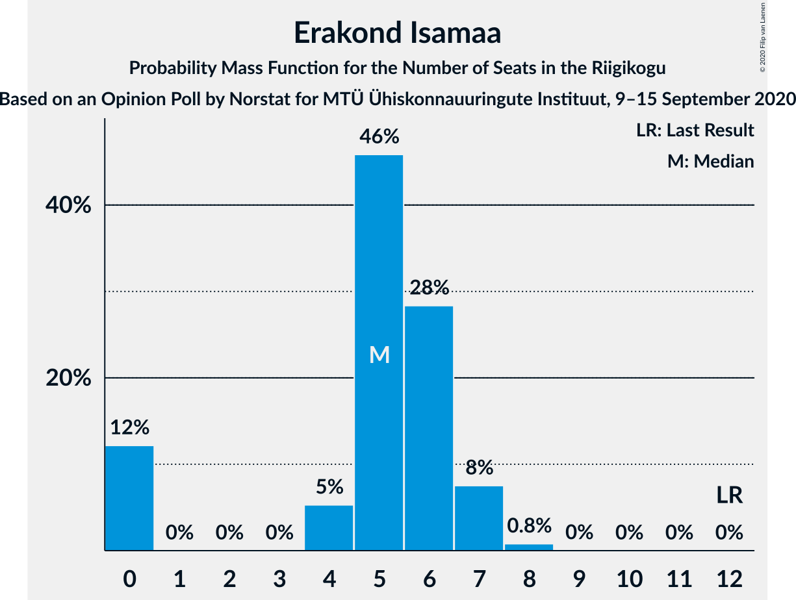
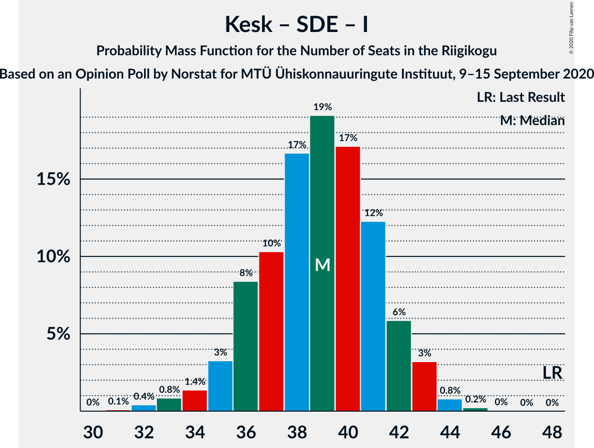

# Opinion Poll by Norstat for MTÜ Ühiskonnauuringute Instituut, 9–15 September 2020

<a href="#voting-intentions">Voting Intentions</a> | <a href="#seats">Seats</a> | <a href="#coalitions">Coalitions</a> | <a href="#technical-information">Technical Information</a>

## Voting Intentions

### Confidence Intervals

| Party | Last Result | Poll Result | 80% Confidence Interval | 90% Confidence Interval | 95% Confidence Interval | 99% Confidence Interval |
|:-----:|:-----------:|:-----------:|:-----------------------:|:-----------------------:|:-----------------------:|:-----------------------:|
| Eesti Reformierakond | 28.9% | 32.5% | 30.6–34.4% |30.1–35.0% |29.7–35.5% |28.8–36.4% |
| Eesti Keskerakond | 23.1% | 22.5% | 20.9–24.3% |20.4–24.8% |20.0–25.2% |19.3–26.1% |
| Eesti Konservatiivne Rahvaerakond | 17.8% | 13.8% | 12.5–15.3% |12.1–15.7% |11.8–16.1% |11.2–16.8% |
| Eesti 200 | 4.4% | 9.7% | 8.6–11.0% |8.3–11.4% |8.0–11.7% |7.5–12.3% |
| Sotsiaaldemokraatlik Erakond | 9.8% | 9.1% | 8.0–10.4% |7.7–10.7% |7.5–11.1% |7.0–11.7% |
| Erakond Isamaa | 11.4% | 5.8% | 5.0–6.9% |4.7–7.2% |4.5–7.4% |4.1–8.0% |
| Erakond Eestimaa Rohelised | 1.8% | 2.5% | 2.0–3.3% |1.8–3.5% |1.7–3.7% |1.5–4.1% |
| Eesti Vabaerakond | 1.2% | 1.4% | 1.0–2.0% |0.9–2.2% |0.8–2.3% |0.7–2.7% |

*Note:* The poll result column reflects the actual value used in the calculations. Published results may vary slightly, and in addition be rounded to fewer digits.

## Seats

### Confidence Intervals

| Party | Last Result | Median | 80% Confidence Interval | 90% Confidence Interval | 95% Confidence Interval | 99% Confidence Interval |
|:-----:|:-----------:|:------:|:-----------------------:|:-----------------------:|:-----------------------:|:-----------------------:|
| <a href="#eesti-reformierakond">Eesti Reformierakond</a> | 34 | 38 | 35–41 |35–41 |34–42 |33–44 |
| <a href="#eesti-keskerakond">Eesti Keskerakond</a> | 26 | 25 | 23–27 |22–28 |22–29 |21–30 |
| <a href="#eesti-konservatiivne-rahvaerakond">Eesti Konservatiivne Rahvaerakond</a> | 19 | 14 | 13–16 |12–17 |12–17 |11–18 |
| <a href="#eesti-200">Eesti 200</a> | 0 | 10 | 8–11 |8–12 |8–12 |7–13 |
| <a href="#sotsiaaldemokraatlik-erakond">Sotsiaaldemokraatlik Erakond</a> | 10 | 9 | 8–10 |7–11 |7–11 |6–12 |
| <a href="#erakond-isamaa">Erakond Isamaa</a> | 12 | 5 | 0–6 |0–7 |0–7 |0–8 |
| <a href="#erakond-eestimaa-rohelised">Erakond Eestimaa Rohelised</a> | 0 | 0 | 0 |0 |0 |0 |
| <a href="#eesti-vabaerakond">Eesti Vabaerakond</a> | 0 | 0 | 0 |0 |0 |0 |

### Eesti Reformierakond

*For a full overview of the results for this party, see the [Eesti Reformierakond](party-eestireformierakond.html) page.*

| Number of Seats | Probability | Accumulated | Special Marks |
|:---------------:|:-----------:|:-----------:|:-------------:|
| 32 | 0.2% | 100% |  |
| 33 | 0.8% | 99.8% |  |
| 34 | 3% | 99.0% | Last Result |
| 35 | 7% | 96% |  |
| 36 | 12% | 89% |  |
| 37 | 16% | 77% |  |
| 38 | 18% | 62% | Median |
| 39 | 19% | 44% |  |
| 40 | 15% | 25% |  |
| 41 | 6% | 11% |  |
| 42 | 2% | 4% |  |
| 43 | 1.4% | 2% |  |
| 44 | 0.4% | 0.6% |  |
| 45 | 0.1% | 0.2% |  |
| 46 | 0% | 0% |  |

### Eesti Keskerakond

*For a full overview of the results for this party, see the [Eesti Keskerakond](party-eestikeskerakond.html) page.*

| Number of Seats | Probability | Accumulated | Special Marks |
|:---------------:|:-----------:|:-----------:|:-------------:|
| 20 | 0.2% | 100% |  |
| 21 | 1.2% | 99.8% |  |
| 22 | 4% | 98.6% |  |
| 23 | 11% | 95% |  |
| 24 | 20% | 84% |  |
| 25 | 24% | 64% | Median |
| 26 | 18% | 40% | Last Result |
| 27 | 13% | 22% |  |
| 28 | 6% | 9% |  |
| 29 | 3% | 3% |  |
| 30 | 0.6% | 0.8% |  |
| 31 | 0.1% | 0.2% |  |
| 32 | 0% | 0% |  |

### Eesti Konservatiivne Rahvaerakond

*For a full overview of the results for this party, see the [Eesti Konservatiivne Rahvaerakond](party-eestikonservatiivnerahvaerakond.html) page.*

| Number of Seats | Probability | Accumulated | Special Marks |
|:---------------:|:-----------:|:-----------:|:-------------:|
| 10 | 0.1% | 100% |  |
| 11 | 1.1% | 99.9% |  |
| 12 | 6% | 98.9% |  |
| 13 | 20% | 93% |  |
| 14 | 26% | 73% | Median |
| 15 | 26% | 47% |  |
| 16 | 13% | 20% |  |
| 17 | 6% | 8% |  |
| 18 | 1.4% | 2% |  |
| 19 | 0.3% | 0.3% | Last Result |
| 20 | 0% | 0% |  |

### Eesti 200

*For a full overview of the results for this party, see the [Eesti 200](party-eesti200.html) page.*

| Number of Seats | Probability | Accumulated | Special Marks |
|:---------------:|:-----------:|:-----------:|:-------------:|
| 0 | 0% | 100% | Last Result |
| 1 | 0% | 100% |  |
| 2 | 0% | 100% |  |
| 3 | 0% | 100% |  |
| 4 | 0% | 100% |  |
| 5 | 0% | 100% |  |
| 6 | 0.1% | 100% |  |
| 7 | 2% | 99.9% |  |
| 8 | 13% | 98% |  |
| 9 | 31% | 85% |  |
| 10 | 34% | 54% | Median |
| 11 | 14% | 20% |  |
| 12 | 5% | 6% |  |
| 13 | 0.7% | 0.8% |  |
| 14 | 0.1% | 0.1% |  |
| 15 | 0% | 0% |  |

### Sotsiaaldemokraatlik Erakond

*For a full overview of the results for this party, see the [Sotsiaaldemokraatlik Erakond](party-sotsiaaldemokraatlikerakond.html) page.*

| Number of Seats | Probability | Accumulated | Special Marks |
|:---------------:|:-----------:|:-----------:|:-------------:|
| 6 | 0.5% | 100% |  |
| 7 | 7% | 99.5% |  |
| 8 | 30% | 92% |  |
| 9 | 34% | 62% | Median |
| 10 | 21% | 28% | Last Result |
| 11 | 6% | 7% |  |
| 12 | 1.1% | 1.2% |  |
| 13 | 0.1% | 0.1% |  |
| 14 | 0% | 0% |  |

### Erakond Isamaa

*For a full overview of the results for this party, see the [Erakond Isamaa](party-erakondisamaa.html) page.*

| Number of Seats | Probability | Accumulated | Special Marks |
|:---------------:|:-----------:|:-----------:|:-------------:|
| 0 | 12% | 100% |  |
| 1 | 0% | 88% |  |
| 2 | 0% | 88% |  |
| 3 | 0% | 88% |  |
| 4 | 5% | 88% |  |
| 5 | 46% | 83% | Median |
| 6 | 28% | 37% |  |
| 7 | 8% | 8% |  |
| 8 | 0.8% | 0.8% |  |
| 9 | 0% | 0% |  |
| 10 | 0% | 0% |  |
| 11 | 0% | 0% |  |
| 12 | 0% | 0% | Last Result |

### Erakond Eestimaa Rohelised

*For a full overview of the results for this party, see the [Erakond Eestimaa Rohelised](party-erakondeestimaarohelised.html) page.*

| Number of Seats | Probability | Accumulated | Special Marks |
|:---------------:|:-----------:|:-----------:|:-------------:|
| 0 | 100% | 100% | Last Result, Median |

### Eesti Vabaerakond

*For a full overview of the results for this party, see the [Eesti Vabaerakond](party-eestivabaerakond.html) page.*

| Number of Seats | Probability | Accumulated | Special Marks |
|:---------------:|:-----------:|:-----------:|:-------------:|
| 0 | 100% | 100% | Last Result, Median |

## Coalitions

### Confidence Intervals

| Coalition | Last Result | Median | Majority? | 80% Confidence Interval | 90% Confidence Interval | 95% Confidence Interval | 99% Confidence Interval |
|:---------:|:-----------:|:------:|:---------:|:-----------------------:|:-----------------------:|:-----------------------:|:-----------------------:|
| Eesti Reformierakond – Eesti Keskerakond – Eesti Konservatiivne Rahvaerakond | 79 | 78 | 100% | 75–80 | 74–82 | 74–83 | 73–84 |
| Eesti Reformierakond – Eesti Keskerakond | 60 | 63 | 100% | 60–66 | 60–67 | 59–68 | 58–70 |
| Eesti Reformierakond – Eesti Konservatiivne Rahvaerakond – Erakond Isamaa | 65 | 58 | 99.7% | 55–60 | 54–60 | 53–61 | 51–62 |
| Eesti Reformierakond – Eesti Konservatiivne Rahvaerakond | 53 | 52 | 83% | 50–55 | 49–56 | 49–57 | 47–59 |
| Eesti Reformierakond – Sotsiaaldemokraatlik Erakond – Erakond Isamaa – Eesti Vabaerakond | 56 | 52 | 71% | 49–54 | 48–55 | 47–55 | 46–57 |
| Eesti Reformierakond – Sotsiaaldemokraatlik Erakond – Erakond Isamaa | 56 | 52 | 71% | 49–54 | 48–55 | 47–55 | 46–57 |
| Eesti Reformierakond – Sotsiaaldemokraatlik Erakond | 44 | 47 | 4% | 44–50 | 44–50 | 43–51 | 42–53 |
| Eesti Keskerakond – Eesti Konservatiivne Rahvaerakond – Erakond Isamaa | 57 | 44 | 0.1% | 42–47 | 41–48 | 40–49 | 38–49 |
| Eesti Reformierakond – Erakond Isamaa | 46 | 43 | 0% | 40–46 | 39–46 | 38–47 | 37–48 |
| Eesti Keskerakond – Eesti Konservatiivne Rahvaerakond | 45 | 39 | 0% | 37–42 | 36–43 | 36–44 | 35–45 |
| Eesti Keskerakond – Sotsiaaldemokraatlik Erakond – Erakond Isamaa | 48 | 39 | 0% | 36–42 | 35–42 | 34–43 | 32–44 |
| Eesti Keskerakond – Sotsiaaldemokraatlik Erakond | 36 | 34 | 0% | 32–37 | 31–37 | 30–38 | 30–39 |
| Eesti Konservatiivne Rahvaerakond – Sotsiaaldemokraatlik Erakond | 29 | 23 | 0% | 21–26 | 21–26 | 20–27 | 19–28 |

### Eesti Reformierakond – Eesti Keskerakond – Eesti Konservatiivne Rahvaerakond

| Number of Seats | Probability | Accumulated | Special Marks |
|:---------------:|:-----------:|:-----------:|:-------------:|
| 72 | 0.2% | 100% |  |
| 73 | 0.8% | 99.8% |  |
| 74 | 4% | 99.0% |  |
| 75 | 9% | 95% |  |
| 76 | 13% | 86% |  |
| 77 | 23% | 73% | Median |
| 78 | 24% | 50% |  |
| 79 | 10% | 26% | Last Result |
| 80 | 7% | 17% |  |
| 81 | 4% | 10% |  |
| 82 | 4% | 6% |  |
| 83 | 1.4% | 3% |  |
| 84 | 0.8% | 1.1% |  |
| 85 | 0.3% | 0.3% |  |
| 86 | 0% | 0% |  |

### Eesti Reformierakond – Eesti Keskerakond

| Number of Seats | Probability | Accumulated | Special Marks |
|:---------------:|:-----------:|:-----------:|:-------------:|
| 57 | 0.1% | 100% |  |
| 58 | 0.9% | 99.8% |  |
| 59 | 2% | 98.9% |  |
| 60 | 8% | 97% | Last Result |
| 61 | 8% | 89% |  |
| 62 | 20% | 81% |  |
| 63 | 15% | 61% | Median |
| 64 | 20% | 46% |  |
| 65 | 13% | 26% |  |
| 66 | 5% | 13% |  |
| 67 | 5% | 9% |  |
| 68 | 2% | 3% |  |
| 69 | 0.9% | 1.4% |  |
| 70 | 0.4% | 0.5% |  |
| 71 | 0.1% | 0.1% |  |
| 72 | 0% | 0% |  |

### Eesti Reformierakond – Eesti Konservatiivne Rahvaerakond – Erakond Isamaa

| Number of Seats | Probability | Accumulated | Special Marks |
|:---------------:|:-----------:|:-----------:|:-------------:|
| 50 | 0.3% | 100% |  |
| 51 | 0.2% | 99.7% | Majority |
| 52 | 1.4% | 99.5% |  |
| 53 | 3% | 98% |  |
| 54 | 5% | 96% |  |
| 55 | 10% | 90% |  |
| 56 | 13% | 80% |  |
| 57 | 16% | 67% | Median |
| 58 | 22% | 51% |  |
| 59 | 17% | 29% |  |
| 60 | 8% | 13% |  |
| 61 | 3% | 5% |  |
| 62 | 1.2% | 2% |  |
| 63 | 0.3% | 0.3% |  |
| 64 | 0.1% | 0.1% |  |
| 65 | 0% | 0% | Last Result |

### Eesti Reformierakond – Eesti Konservatiivne Rahvaerakond

| Number of Seats | Probability | Accumulated | Special Marks |
|:---------------:|:-----------:|:-----------:|:-------------:|
| 46 | 0.1% | 100% |  |
| 47 | 0.5% | 99.8% |  |
| 48 | 2% | 99.3% |  |
| 49 | 5% | 98% |  |
| 50 | 10% | 93% |  |
| 51 | 14% | 83% | Majority |
| 52 | 19% | 69% | Median |
| 53 | 18% | 50% | Last Result |
| 54 | 15% | 31% |  |
| 55 | 9% | 16% |  |
| 56 | 4% | 7% |  |
| 57 | 1.5% | 3% |  |
| 58 | 1.1% | 2% |  |
| 59 | 0.5% | 0.6% |  |
| 60 | 0.1% | 0.1% |  |
| 61 | 0% | 0% |  |

### Eesti Reformierakond – Sotsiaaldemokraatlik Erakond – Erakond Isamaa – Eesti Vabaerakond

| Number of Seats | Probability | Accumulated | Special Marks |
|:---------------:|:-----------:|:-----------:|:-------------:|
| 44 | 0% | 100% |  |
| 45 | 0.3% | 99.9% |  |
| 46 | 0.7% | 99.6% |  |
| 47 | 2% | 98.9% |  |
| 48 | 5% | 97% |  |
| 49 | 8% | 92% |  |
| 50 | 14% | 85% |  |
| 51 | 14% | 71% | Majority |
| 52 | 14% | 57% | Median |
| 53 | 18% | 43% |  |
| 54 | 16% | 24% |  |
| 55 | 6% | 9% |  |
| 56 | 2% | 2% | Last Result |
| 57 | 0.7% | 0.9% |  |
| 58 | 0.2% | 0.2% |  |
| 59 | 0.1% | 0.1% |  |
| 60 | 0% | 0% |  |

### Eesti Reformierakond – Sotsiaaldemokraatlik Erakond – Erakond Isamaa

| Number of Seats | Probability | Accumulated | Special Marks |
|:---------------:|:-----------:|:-----------:|:-------------:|
| 44 | 0% | 100% |  |
| 45 | 0.3% | 99.9% |  |
| 46 | 0.7% | 99.6% |  |
| 47 | 2% | 98.9% |  |
| 48 | 5% | 97% |  |
| 49 | 8% | 92% |  |
| 50 | 14% | 85% |  |
| 51 | 14% | 71% | Majority |
| 52 | 14% | 57% | Median |
| 53 | 18% | 43% |  |
| 54 | 16% | 24% |  |
| 55 | 6% | 9% |  |
| 56 | 2% | 2% | Last Result |
| 57 | 0.7% | 0.9% |  |
| 58 | 0.2% | 0.2% |  |
| 59 | 0.1% | 0.1% |  |
| 60 | 0% | 0% |  |

### Eesti Reformierakond – Sotsiaaldemokraatlik Erakond

| Number of Seats | Probability | Accumulated | Special Marks |
|:---------------:|:-----------:|:-----------:|:-------------:|
| 41 | 0.2% | 100% |  |
| 42 | 1.0% | 99.7% |  |
| 43 | 3% | 98.7% |  |
| 44 | 7% | 96% | Last Result |
| 45 | 13% | 88% |  |
| 46 | 17% | 75% |  |
| 47 | 17% | 58% | Median |
| 48 | 16% | 41% |  |
| 49 | 14% | 25% |  |
| 50 | 7% | 11% |  |
| 51 | 2% | 4% | Majority |
| 52 | 1.0% | 2% |  |
| 53 | 0.7% | 0.9% |  |
| 54 | 0.2% | 0.3% |  |
| 55 | 0% | 0% |  |

### Eesti Keskerakond – Eesti Konservatiivne Rahvaerakond – Erakond Isamaa

| Number of Seats | Probability | Accumulated | Special Marks |
|:---------------:|:-----------:|:-----------:|:-------------:|
| 37 | 0.2% | 100% |  |
| 38 | 0.5% | 99.8% |  |
| 39 | 1.3% | 99.3% |  |
| 40 | 2% | 98% |  |
| 41 | 5% | 96% |  |
| 42 | 11% | 91% |  |
| 43 | 15% | 80% |  |
| 44 | 18% | 65% | Median |
| 45 | 16% | 47% |  |
| 46 | 13% | 31% |  |
| 47 | 10% | 18% |  |
| 48 | 5% | 7% |  |
| 49 | 2% | 3% |  |
| 50 | 0.3% | 0.4% |  |
| 51 | 0.1% | 0.1% | Majority |
| 52 | 0% | 0% |  |
| 53 | 0% | 0% |  |
| 54 | 0% | 0% |  |
| 55 | 0% | 0% |  |
| 56 | 0% | 0% |  |
| 57 | 0% | 0% | Last Result |

### Eesti Reformierakond – Erakond Isamaa

| Number of Seats | Probability | Accumulated | Special Marks |
|:---------------:|:-----------:|:-----------:|:-------------:|
| 35 | 0.1% | 100% |  |
| 36 | 0.3% | 99.9% |  |
| 37 | 1.0% | 99.6% |  |
| 38 | 3% | 98.6% |  |
| 39 | 4% | 96% |  |
| 40 | 7% | 92% |  |
| 41 | 11% | 85% |  |
| 42 | 15% | 73% |  |
| 43 | 12% | 58% | Median |
| 44 | 20% | 46% |  |
| 45 | 15% | 26% |  |
| 46 | 8% | 11% | Last Result |
| 47 | 2% | 3% |  |
| 48 | 0.6% | 0.9% |  |
| 49 | 0.2% | 0.3% |  |
| 50 | 0.1% | 0.1% |  |
| 51 | 0% | 0% | Majority |

### Eesti Keskerakond – Eesti Konservatiivne Rahvaerakond

| Number of Seats | Probability | Accumulated | Special Marks |
|:---------------:|:-----------:|:-----------:|:-------------:|
| 34 | 0.4% | 100% |  |
| 35 | 1.3% | 99.6% |  |
| 36 | 3% | 98% |  |
| 37 | 10% | 95% |  |
| 38 | 19% | 85% |  |
| 39 | 18% | 66% | Median |
| 40 | 16% | 48% |  |
| 41 | 14% | 33% |  |
| 42 | 9% | 18% |  |
| 43 | 6% | 9% |  |
| 44 | 2% | 3% |  |
| 45 | 0.7% | 1.0% | Last Result |
| 46 | 0.2% | 0.2% |  |
| 47 | 0.1% | 0.1% |  |
| 48 | 0% | 0% |  |

### Eesti Keskerakond – Sotsiaaldemokraatlik Erakond – Erakond Isamaa

| Number of Seats | Probability | Accumulated | Special Marks |
|:---------------:|:-----------:|:-----------:|:-------------:|
| 31 | 0.1% | 100% |  |
| 32 | 0.4% | 99.9% |  |
| 33 | 0.8% | 99.5% |  |
| 34 | 1.4% | 98.6% |  |
| 35 | 3% | 97% |  |
| 36 | 8% | 94% |  |
| 37 | 10% | 86% |  |
| 38 | 17% | 75% |  |
| 39 | 19% | 59% | Median |
| 40 | 17% | 40% |  |
| 41 | 12% | 22% |  |
| 42 | 6% | 10% |  |
| 43 | 3% | 4% |  |
| 44 | 0.8% | 1.1% |  |
| 45 | 0.2% | 0.3% |  |
| 46 | 0% | 0% |  |
| 47 | 0% | 0% |  |
| 48 | 0% | 0% | Last Result |

### Eesti Keskerakond – Sotsiaaldemokraatlik Erakond

| Number of Seats | Probability | Accumulated | Special Marks |
|:---------------:|:-----------:|:-----------:|:-------------:|
| 28 | 0.1% | 100% |  |
| 29 | 0.4% | 99.9% |  |
| 30 | 2% | 99.5% |  |
| 31 | 5% | 97% |  |
| 32 | 14% | 92% |  |
| 33 | 19% | 78% |  |
| 34 | 20% | 60% | Median |
| 35 | 17% | 40% |  |
| 36 | 12% | 22% | Last Result |
| 37 | 7% | 11% |  |
| 38 | 2% | 4% |  |
| 39 | 2% | 2% |  |
| 40 | 0.3% | 0.4% |  |
| 41 | 0.1% | 0.1% |  |
| 42 | 0% | 0% |  |

### Eesti Konservatiivne Rahvaerakond – Sotsiaaldemokraatlik Erakond

| Number of Seats | Probability | Accumulated | Special Marks |
|:---------------:|:-----------:|:-----------:|:-------------:|
| 18 | 0.1% | 100% |  |
| 19 | 0.7% | 99.9% |  |
| 20 | 4% | 99.2% |  |
| 21 | 10% | 96% |  |
| 22 | 19% | 85% |  |
| 23 | 21% | 66% | Median |
| 24 | 21% | 45% |  |
| 25 | 13% | 24% |  |
| 26 | 7% | 11% |  |
| 27 | 3% | 4% |  |
| 28 | 0.9% | 1.1% |  |
| 29 | 0.2% | 0.2% | Last Result |
| 30 | 0% | 0% |  |

## Technical Information

### Opinion Poll

+ **Polling firm:** Norstat
+ **Commissioner(s):** MTÜ Ühiskonnauuringute Instituut
+ **Fieldwork period:** 9–15 September 2020

### Calculations

+ **Sample size:** 1000
+ **Simulations done:** 1,048,576
+ **Error estimate:** 2.90%

